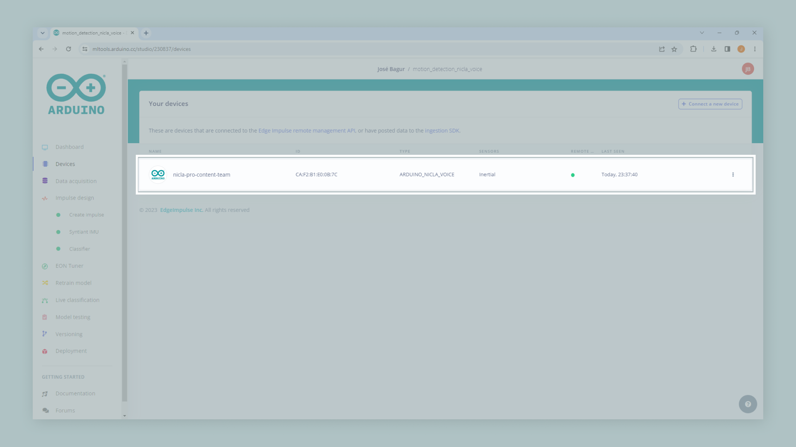
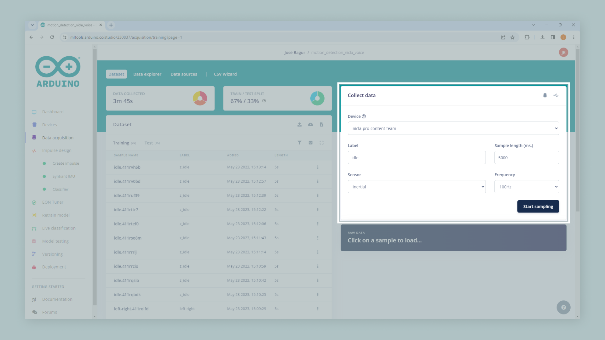
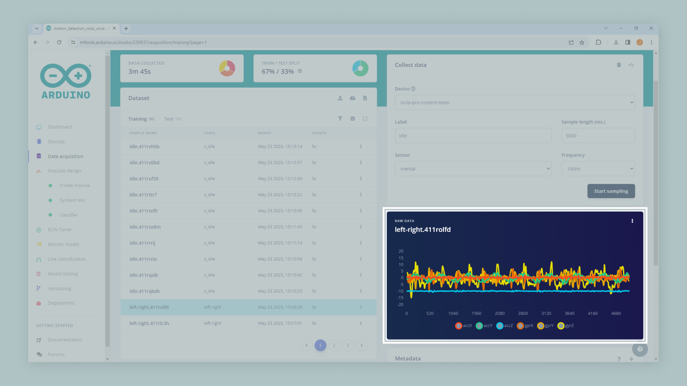
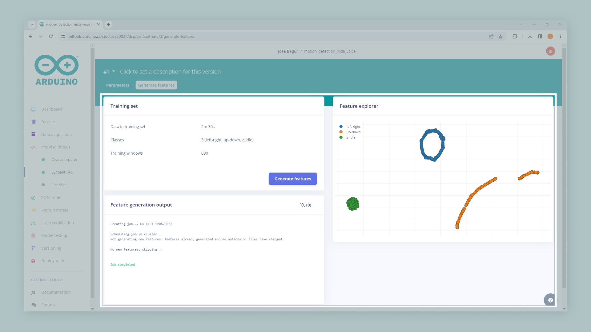
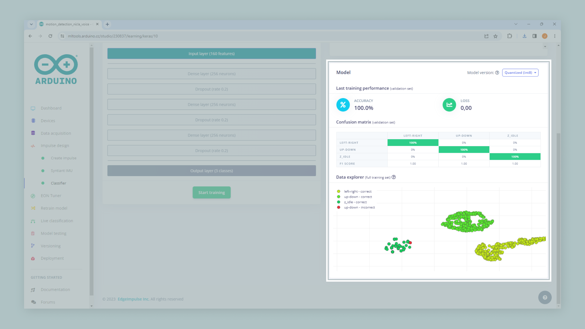

## Overview

The Nicla Voice is a versatile board that can be used for various projects and applications. With its onboard Inertial Measurement Unit (IMU) and Tiny Machine Learning (TinyML), the Nicla Voice board provides an ideal device for the application described in this tutorial: **a simple motion detection application**.

The simple motion detection application will be based on a TinyML model developed with Edge Impulse®, a leading platform in developing intelligent devices and a powerful facilitator for TinyML applications. With Edge Impulse®, we will capture data from your Nicla's Voice onboard IMU, create and train a TinyML model specifically designed for motion detection, and deploy it into the board for testing and validation. By the end of this tutorial, you will have a fully functional motion detection application running on your Nicla Voice board and a solid foundation in applying TinyML to real-world applications.

## Goals

- Understand the key features and capabilities of the Nicla Voice board.
- Set up a Nicla Voice board and prepare it for developing of a motion detection application.
- Become familiar with the Edge Impulse® platform, its interface, and its key features.
- Collect motion data from the Nicla Voice board's onboard IMU using Edge Impulse®.
- Develop, train, and validate a TinyML model designed for motion detection using Edge Impulse®.
- Deploy the trained TinyML model onto the Nicla Voice board and test its real-time motion detection capabilities.
- Gain practical experience and foundational knowledge in developing TinyML applications for real-world scenarios.

## Hardware and Software Requirements

### Hardware Requirements

- [Nicla Voice](https://store.arduino.cc/products/nicla-voice) (x1)
- [Micro-USB](https://store.arduino.cc/products/usb-2-0-cable-type-a-micro) cable (x1)

### Software Requirements

- [Arduino IDE 2.0+](https://www.arduino.cc/en/software), or [Arduino Web Editor](https://create.arduino.cc/editor)
- To create custom Machine Learning models, the integrated [Machine Learning Tools](https://cloud.arduino.cc/machine-learning-tools/) of the [Arduino Cloud](https://cloud.arduino.cc/) are needed. In case you do not have an Arduino Cloud account, you will need to create one first.

## Motion Detection and TinyML

Motion detection technology, which identifies and measures physical movement, is vital in many fields. The precision and scope of motion detection can be significantly improved by using an IMU, an advanced device designed to capture the force and angular velocity. This enhanced capability is important in real-world applications such as wearable fitness trackers, vehicle safety and navigation systems, and robotic movement controls.

Within this context, TinyML emerges as a transformative new force. As a specialized branch of Machine Learning, TinyML was explicitly developed for devices with limited computational power, such as microcontrollers. Despite its compact nature, TinyML brings robust Machine Learning capabilities without imposing significant power or computational burdens. Its essence lies in converting raw data into actionable insights. A TinyML model can discern specific movements and irregularities by interpreting patterns from the IMU data, empowering a device to interact dynamically with its environment.

For the development process in this tutorial, we'll employ Edge Impulse®, an essential platform in TinyML application development. This platform features an interesting suite of tools for data acquisition, model design, model training, and deploying our motion detection model on the Nicla Voice board. This approach facilitates the design and implementation of complex models directly on the board. By combining the capabilities of the Nicla Voice board, the advantages of an IMU-based motion detection model, and the versatility of a platform like Edge Impulse®, this tutorial aims to provide an exhaustive perspective on constructing tangible real-world applications.

## Instructions

### Creating an Arduino Cloud Account

First, if you still need an Arduino Cloud account, please create one [here](https://cloud.arduino.cc/home/). You can then access the Machine Learning Tools integration via the Arduino Cloud, as shown in the image below.

With your account set up and running, create a new project. With your new project created, we are ready to capture data for your motion detection model. 

### IMU Data Capture with Edge Impulse®

We can capture data from the onboard IMU of the Nicla Board using Edge Impulse®. To do this, check out the following [article](https://docs.edgeimpulse.com/docs/development-platforms/officially-supported-mcu-targets/arduino-nicla-voice) from Edge Impulse® documentation. Follow the steps described in the article to connect your Nicla Voice board to Edge Impulse®; when your board is connected, under the **Devices** tab on the left side of the window, you should see your it as shown in the image below (green dot):

You can now start collecting IMU data with your Nicla Voice board connected to your Machine Learning Tools account. In the Machine Learning Tools, go to the **Data acquisition** tab on the left side of the window. **Data acquisition** is the tool from the Machine Learning Tools where IMU data can be sampled and stored. To sample new data, go to the **Collect data** window.

Select your Nicla Voice board, set the label to `left-right`, the sample length to `5000` ms, the sensor to `Inertial`, and the frequency to `100Hz`. This configuration means that data from the onboard IMU of your Nicla Voice board will be sampled for five seconds (5000 ms) and stored with the `left-right` label (labels can be edited later if needed). Click the **Start sampling** button and move your Nicla Voice board from left to right, as shown below. 

After the sampling and storing process is finished, you should see a new line under the **Collected data** window; when the data is selected, you can graph the raw sampled data as shown in the image below. 

Let's repeat the process but for a different type of movement. Set the label to `up-down`, the sample length to `5000` ms, the sensor to `Inertial`, and the frequency to `100Hz` (same as before). Click the **Start sampling** button and move your Nicla Voice board up and down, as shown below. 

Now its time to build the **dataset** for the motion detection application using the following **three classes**:

- `left-right`: horizontal movements, from left to right.
- `up-down`: vertical movements, starting up and going down.
- `z-idle`: random movements that are not from left to right or starting up and going down. 

***The Syntiant NDP processors require a negative class on which no predictions will occur; in our application, this is the `z_idle` class. Make sure the negative class name is last in alphabetical order.***

Split your data into **training**, **test**, and **validation** sets; **a common split ratio is 70% for training, 15% for testing, and 15% for validation**. For demonstration purposes, record around **four minutes** of data per class; in this case, you need to allocate approximately the following amounts of data for each set:

- **Training**: 2.8 minutes (70% of 4 minutes).
- **Testing**: 0.6 minutes (15% of 4 minutes).
- **Validation**: 0.6 minutes (15% of 4 minutes).

The number of samples required for a motion detection model depends on several factors. There is no one-size-fits-all answer, but some general guidelines to determine the appropriate sample size are the following:

- **Data complexity**: With complex patterns, larger sample size.
- **Type of motion detection technique**: Supervised methods require more samples than unsupervised methods.
- **Model performance**: More data is only sometimes better.
- **The rarity of movements**: A larger sample size is needed if anomalies are rare events.

As a starting point, consider that you will need more samples, **at least several hundred to a few thousand**, for a more robust model.

### Impulse Design

With the training dataset captured, you can design an **impulse**; an impulse takes raw data, uses signal processing to extract features, and then uses a learning block to classify new data. Signal processing blocks always return the same values for the same input and are used to make raw data easier to process, while learning blocks learn from past experiences.

In this tutorial, we are going to use the following processing blocks:

- **IMU Syntiant processing block**: This block prescales raw data to 8-bit values to match Nicla's Voice NDP processor input requirements.
- **Classification learning block**: This block takes the generated features and learns to distinguish between different classes (`left-right`, `up-down`, or `z-idle`).

To set both blocks, navigate to the **Create impulse** tab, select the window size to `600` ms, increase it to `200`, add the `IMU Syntiant` and `Classification` blocks, and click the **Save impulse** button. Your impulse should be as shown below:

***The Syntiant NDP101 processor requires the number of generated features to be divisible by four. In our example, we have three axes sampled at 100 Hz with a 600 ms window leading to 180 (60x3) features divisible by four.***

#### IMU Syntiant Block Configuration
  

To configure the **IMU Syntiant** processing block, navigate to the **Syntiant IMU** tab. You will see the raw data on top of the window (you can select other files via the drop-down menu) and the processed features on the right. 

Click the **Scale 16 bits to 8 bits** option; this converts your raw data to 8-bit and normalizes it to the [-1, 1] range. Then, click the **Save parameters** button to send you to the **Feature generation** window. Click the **Generate features** button on that window to start the feature generation process.

After a while, the **Feature explorer** window will load. This screen plots all the extracted features against all the generated windows, as shown in the image above; you can use this graph to compare your complete data set. A good rule of thumb is that **if you can visually separate the data on several axes, then the Machine Learning model will also be able to do so**.

#### Classification Block Configuration
  

Now, it's time to start training a neural network. Neural networks are algorithms that can learn to recognize patterns in their training data, for example, certain types of movements. The neural network you will train will take the processing block features as input and try to map it to one of the three classes of our model (`left-right`, `up-down`, or `z-idle`).

Click on the **Classifier** tab, you'll see the following window:

Click the **Start training**. When it's complete, you'll see the **Model** performance window appear at the bottom-right of the window:

From the **Model** performance window, we can see the **model's accuracy**. Accuracy refers to the percentage of windows of movement that were correctly classified; the higher the number, the better. However,** an accuracy of 100% is unlikely and often a sign that your model has overfit the training data**. For most applications, an accuracy above 85% is very good. The confusion matrix shows the balance of correctly versus incorrectly classified.

Now that you have trained a neural network with Edge Impulse®, we are ready to deploy and test it on your Nicla Voice board!

### Deploying and Running an Impulse

It's time to test your model on your Nicla Voice board. Click on the **Deployment** tab, and then under the **Search deployment options** button, select the **Arduino Nicla Voice** option. You can also configure posterior parameters to define, for example, thresholds at which your model activates; in this demonstration, we will not change the default posterior parameters.

Click on the **Build** button. This will start a process on which a binary file containing your impulse is built; this file can then be run on your Nicla Voice board. After completing the building process, you'll be prompted to download a .zip file containing the binary file and save it on your computer.

After unzipping the downloaded file, run the appropriate flashing script for your computer's operative system (Linux, Mac, or Windows) to flash your Nicla Voice board with the motion recognition model and associated firmware. 

## Conclusion

In this tutorial