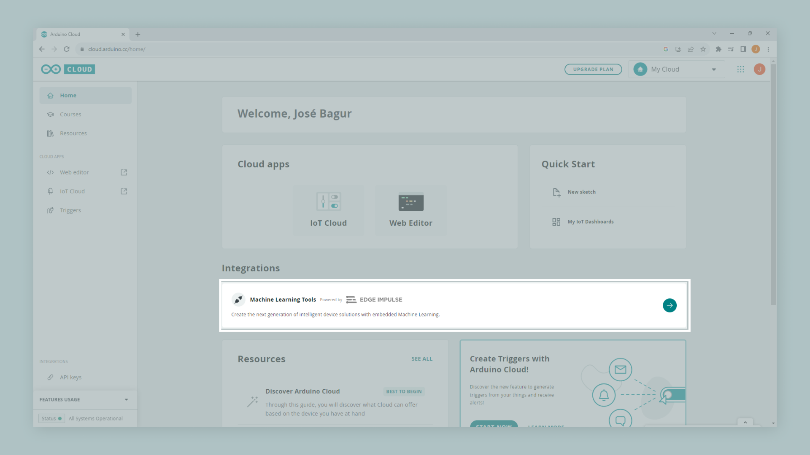

## Overview

The Nicla Voice is a versatile board that can be used for various projects and applications. With its onboard Inertial Measurement Unit (IMU) and Tiny Machine Learning (TinyML), the Nicla Voice board provides an ideal device for the application described in this tutorial: **a simple motion detection application**.

The simple motion detection application will be based on a TinyML model developed with Edge Impulse®, a leading platform in developing intelligent devices and a powerful facilitator for TinyML applications. With Edge Impulse®, we will capture data from your Nicla's Voice onboard IMU, create and train a TinyML model specifically designed for motion detection, and deploy it into the board for testing and validation. By the end of this tutorial, you will have a fully functional motion detection application running on your Nicla Voice board and a solid foundation in applying TinyML to real-world applications.

## Goals

- Understand the key features and capabilities of the Nicla Voice board.
- Set up a Nicla Voice board and prepare it for developing of a motion detection application.
- Become familiar with the Edge Impulse® platform, its interface, and its key features.
- Collect motion data from the Nicla Voice board's onboard IMU using Edge Impulse®.
- Develop, train, and validate a TinyML model designed for motion detection using Edge Impulse®.
- Deploy the trained TinyML model onto the Nicla Voice board and test its real-time motion detection capabilities.
- Gain practical experience and foundational knowledge in developing TinyML applications for real-world scenarios.

## Hardware and Software Requirements

### Hardware Requirements

- [Nicla Voice](https://store.arduino.cc/products/nicla-voice) (x1)
- [Micro-USB](https://store.arduino.cc/products/usb-2-0-cable-type-a-micro) cable (x1)

### Software Requirements

- [Arduino IDE 2.0+](https://www.arduino.cc/en/software), or [Arduino Web Editor](https://create.arduino.cc/editor)
- To create custom Machine Learning models, the integrated [Machine Learning Tools](https://cloud.arduino.cc/machine-learning-tools/) of the [Arduino Cloud](https://cloud.arduino.cc/) are needed. In case you do not have an Arduino Cloud account, you will need to create one first.

## Motion Detection and TinyML

Motion detection technology, which identifies and measures physical movement, is vital in many fields. The precision and scope of motion detection can be significantly improved by using an IMU, an advanced device designed to capture the force and angular velocity. This enhanced capability is important in real-world applications such as wearable fitness trackers, vehicle safety and navigation systems, and robotic movement controls.

Within this context, TinyML emerges as a transformative new force. As a specialized branch of Machine Learning, TinyML was explicitly developed for devices with limited computational power, such as microcontrollers. Despite its compact nature, TinyML brings robust Machine Learning capabilities without imposing significant power or computational burdens. Its essence lies in converting raw data into actionable insights. A TinyML model can discern specific movements and irregularities by interpreting patterns from the IMU data, empowering a device to interact dynamically with its environment.

For the development process in this tutorial, we'll employ Edge Impulse®, an essential platform in TinyML application development. This platform features an interesting suite of tools for data acquisition, model design, model training, and deploying our motion detection model on the Nicla Voice board. This approach facilitates the design and implementation of complex models directly on the board. By combining the capabilities of the Nicla Voice board, the advantages of an IMU-based motion detection model, and the versatility of a platform like Edge Impulse®, this tutorial aims to provide an exhaustive perspective on constructing tangible real-world applications.

## Instructions

### Creating an Arduino Cloud Account

First, if you still need an Arduino Cloud account, please create one [here](https://cloud.arduino.cc/home/). You can then access the Machine Learning Tools integration via the Arduino Cloud, as shown in the image below.

With your account set up and running, create a new project. With your new project created, we are ready to capture data for your motion detection model. 

### IMU Data Capture with Edge Impulse®

We can capture data from the onboard IMU of the Nicla Board using Edge Impulse®. To do this, check out the following [article](https://docs.edgeimpulse.com/docs/development-platforms/officially-supported-mcu-targets/arduino-nicla-voice) from Edge Impulse® documentation. 

We can start collecting IMU data With your Nicla Voice board connected to your Machine Learning Tools account. In the Machine Learning Tools, go to the **Data acquisition** tab on the left side of the window. **Data acquisition** is the tool from the Machine Learning Tools integration where IMU data is sampled and stored. To sample new data, go to **Collect data**, select your Nicla Voice board, set the label to `left-right`, the sample length to `5000`, the sensor to `Inertial`, and the frequency to `100Hz`. This means that data from the onboard IMU of the Nicla Voice will be sampled for five seconds and stored with the `left-right` label. Labels can be edited later if needed.

Click **Start sampling** and move your Nicla Voice board from left to right, as shown below. After the sampling and storing process is finished, you should see a new line under **Collected data**; you can access the raw sampled data graphed as shown in the image below.

Machine learning works best with lots of data, so a single sample won't cut it. Let's build the dataset for the motion detection application using the following four classes; record around 3 minutes of data per class:

- `left-right`: horizontal movements, from left to right.
- `up-down`: vertical movements, starting up and going down.
- `z-idle`: random movements that are not from left to right or starting up and going down. 

***The Syntiant NDP processors require a **negative class** on which no predictions will occur; in our example, this is the `z_idle` class. Make sure the class name is last in alphabetical order.***

