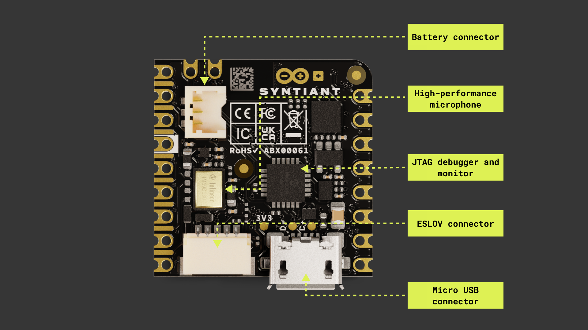

## Overview

This user manual will provide you with a comprehensive overview of the Arduino Nicla Voice board, covering its main hardware and software features. With this user manual, you will also learn how to set up, configure and use these features. 

## Hardware and Software Requirements

### Hardware Requirements

- [Nicla Voice](https://store.arduino.cc/products/nicla-voice) (x1)
- Micro USB cable (x1)

### Software Requirements

- [Arduino IDE 1.8.10+](https://www.arduino.cc/en/software), [Arduino IDE 2.0+](https://www.arduino.cc/en/software), or [Arduino Web Editor](https://create.arduino.cc/editor)
- To create custom Machine Learning models, we will use the integrated Machine Learning Tools of the [Arduino Cloud](https://create.arduino.cc/iot/) (you will need to create an account if you don't have one yet)

## Product Overview

The Nicla Voice is an innovative and versatile development board designed by the Arduino team for voice-enabled projects and applications. This board has an onboard always-on speech recognition processor, advanced motion sensors, and wireless connectivity via Bluetooth® Low Energy. The Nicla Voice is an ideal solution for various applications, from ultra-low power predictive maintenance and gesture or voice recognition systems to contactless wireless applications.

### Board Architecture Overview

The Nicla Voice features a robust and efficient architecture that integrates various components to enable voice-enabled projects and applications. 




Here is an overview of the board's architecture's main components shown in the images above:

- **Microcontroller**: at the heart of the Nicla Voice is the nRF52832, a powerful and versatile System-on-Chip (SoC) from Nordic® Semiconductor. The nRF52832 is built around a 32-bit Arm® Cortex®-M4 processor running at 64 MHz.
- **Speech recognition processor**: the board features the NDP120 Neural Decision Processor™, an ultra-low power always-on speech processor from Syntiant®, which enables several applications, including echo-cancellation, beamforming, noise suppression, speech enhancement, speaker identification, and keyword spotting. 
- **Onboard advanced motion sensors**: the board features the BMI270, a high-precision IMU by Bosch® Sensortec, which combines a 3-axis accelerometer and a 3-axis gyroscope for precise motion tracking and orientation detection. The board also features the BMM150, a compact geomagnetic sensor from Bosch® Sensortec with a 3-axis magnetometer.
- **Onboard high-performance microphone**:  The Nicla Voice is equipped with the IM69D130, a high-quality MEMS microphone by Infineon® Technologies. The IM69D130 offers excellent audio quality and low noise performance, ensuring accurate and distortion-free audio capturing.
- **Wireless connectivity**: the board supports Bluetooth® Low Energy (BLE) connectivity, provided by the ANNA-B112 module developed by u-blox®. This compact, high-performance BLE module allows the Nicla Voice to communicate wirelessly with other devices and systems.
- **Power management**: The Nicla Voice is designed for ultra-low power operation, with efficient power management features that ensure minimal energy consumption even when using always-on speech recognition and multiple sensors. The Nicla Voice features the BQ25120 from Texas Instruments; a highly integrated battery charge management  integrated circuit (IC) designed for wearables and Internet of Things (IoT) devices. 

### Board Core and Libraries

The **Arduino Mbed OS Nicla Boards** core contains the libraries you need to work with the board's components, such as its IMU, magnetometer, and onboard. To install the core for Nicla boards, navigate to **Tools > Board > Boards Manager** or click the Boards Manager icon in the left tab of the IDE. In the Boards Manager tab, search for `nicla` and install the latest `Arduino Mbed OS Nicla Boards` version.


### Board Pinout

The Nicla Voice pinout is shown in the image below:


### Board Datasheet

The complete datasheet is available and downloadable as PDF from the link below:

- [Nicla Voice datasheet](assets/ABX00061-datasheet.pdf)

### Board Schematics

The complete schematics are available and downloadable as PDF from the link below:

- [Nicla Voice schematics](assets/ABX00061-schematics.pdf)

### Board STEP Files

The complete STEP files are available and downloadable from the link below:

- [Nicla Voice STEP files](assets/ABX00061-step.zip)

## Board First Use

### Powering the Board

The Nicla voice can be powered by:

- Using a Micro USB cable (not included). 
- Using an external **5 V power supply** connected to `VIN_BQ25120` pin (please, refer to the [board pinout section](#board-pinout) of the user manual).
- Using a **3.7 V Lithium Polymer (Li-Po) battery** connected to the board through the onboard battery connector; the manufacturer part number of the battery connector is BM03B-ACHSS, and the **recommended battery capacity for the Nicla Voice is 200 mAh**. A Li-Po battery with an integrated NTC thermistor is also recommended for thermal protection. 
- Using the onboard **ESLOV connector**, which has a dedicated 5 V power line. The manufacturer part number of the ESLOV connector is SM05B-SRSS. 


### NDP120 Processor Firmware Update

It is recommended to update the NDP120 processor firmware and the built-in speech recognition model to the latest release. Follow these three steps to complete the update process:

1. Upload the `Syntiant_upload_fw_ymodem` sketch. This sketch can be found in the board's built-in examples by navigating to **File -> Examples -> NDP -> Syntiant_upload_fw_ymodem**. **Remember to select the board in the Arduino IDE first before navigating to the examples**.
2. Extract [this .zip file](assets/nicla_voice_uploader_and_firmwares.zip), which contains the compiled uploaders for various operating systems, and the updated NDP120 processor firmware and speech recognition model, in a known location on your computer. 
3. Open a new terminal in the location where the .zip file was extracted and execute the following command:

    ```
    ./syntiant-uploader send -m "Y" -w "Y" -p $portName $filename
    ```

    Replace `portName` and `filename` with the relevant information. Three different files must be uploaded to the board by executing the following three commands:

    ```
    ./syntiant-uploader send -m "Y" -w "Y" -p COM6 mcu_fw_120_v91.synpkg
    ```

    ```
    ./syntiant-uploader send -m "Y" -w "Y" -p COM6 dsp_firmware_v91.synpkg
    ```

    ```
    ./syntiant-uploader send -m "Y" -w "Y" -p COM6 model_name.synpkg
    ```

    Ensure all executed commands return a `filename sent successful` message in the console, as shown in the image below. 

    

### Built-in Speech Recognition Example

The speech recognition example can be found in the board's built-in examples by navigating to **File -> Examples -> NDP -> AlexaDemo**. After successfully updating the NDP120 processor firmware and the speech recognition model to the latest release, we can upload the speech recognition example to the Nicla Voice. To test the example, say "Alexa"; this should make the onboard LED of the Nicla Voice blink blue if the keyword "Alexa" is recognized. If there is no response from the board, try speaking from a closer proximity or louder. You should also see in the Serial Monitor if the word "Alexa" was detected, as shown in the image below:


## Board Pins

