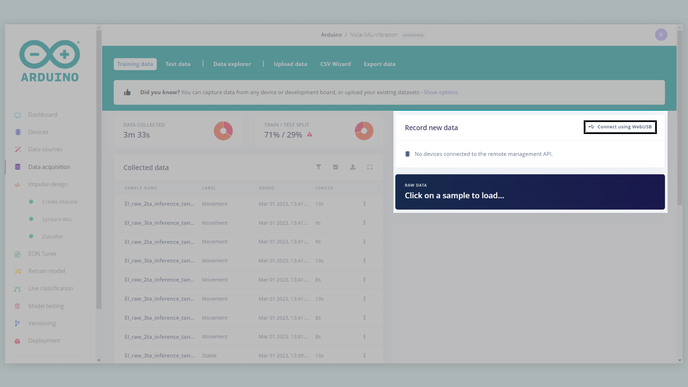
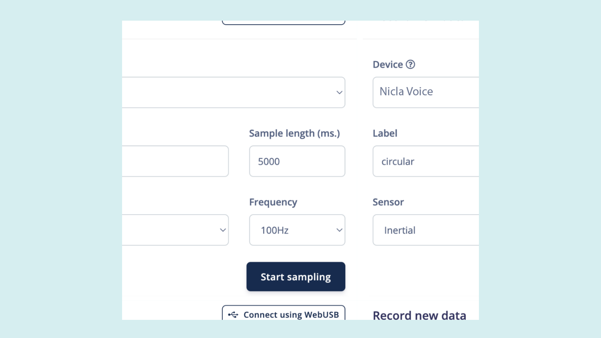
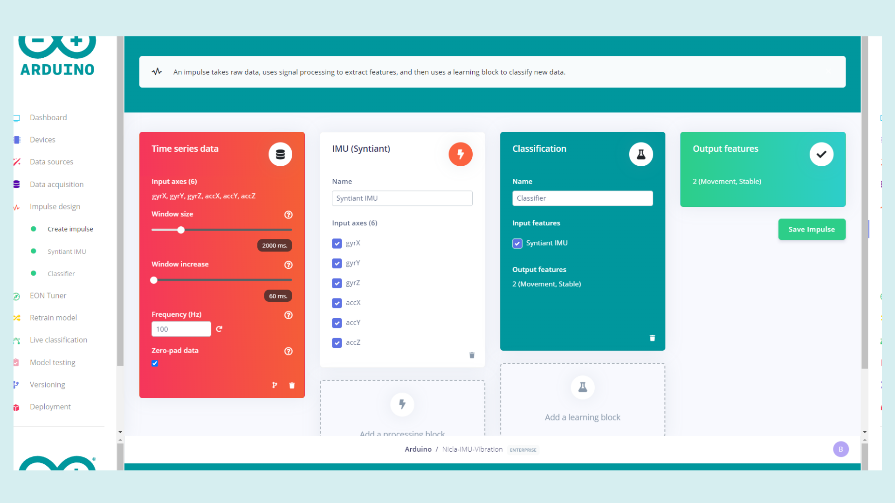
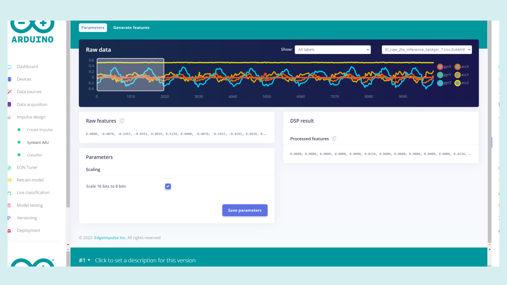
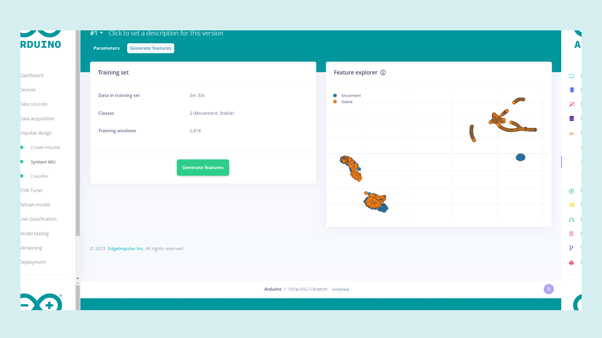
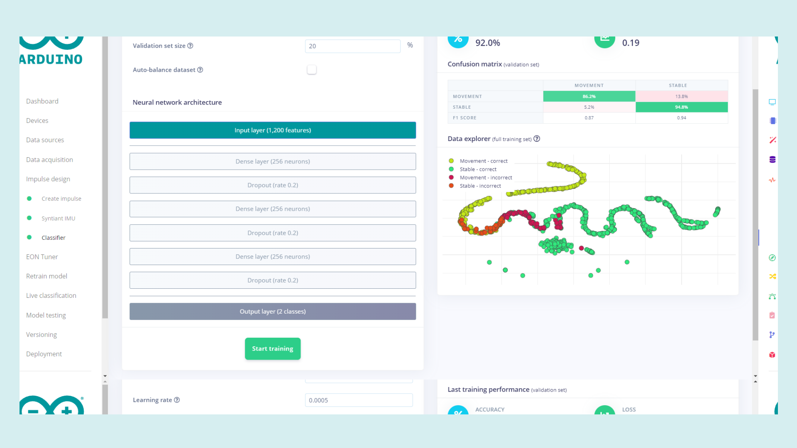
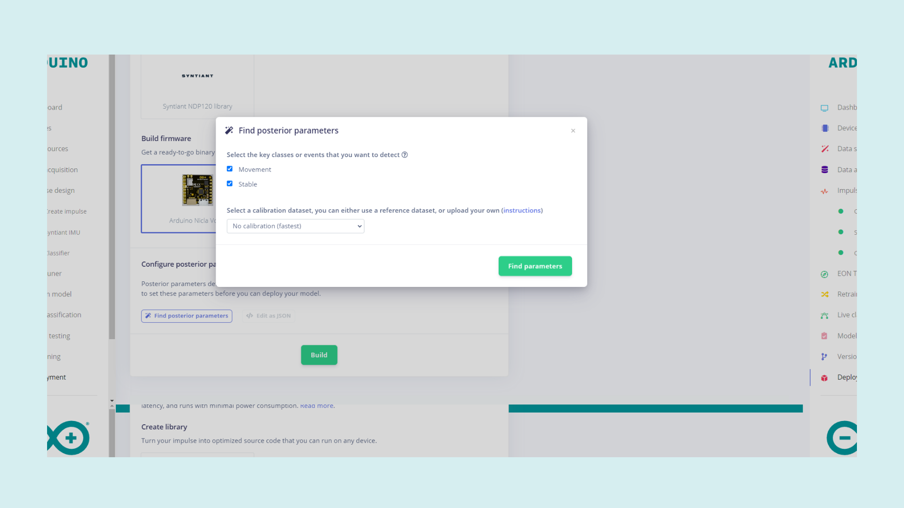

## Overview

One of the main features of the Nicla Voice is its ability to easily capture data for a machine learning model and then deploy that trained model to the board. The Nicla Voice features a highly integrated, low power inertial measurement unit (IMU) that combines precise acceleration and angular rate (gyroscopic) measurement with intelligent on-chip motion-triggered interrupt features. This tutorial will show how to capture data with this IMU and use it in a machine learning model to let the board detect vibrations. Using the Edge Impulse powered machine learning tools this is made extremely easy. This tutorial will show how to capture IMU data with the board, train a machine learning model with that data and then deploy the trained model to the Nicla Voice board. At the end of the tutorial the model will be flashed to the board and tested with the Arduino IDE.

## Goals

The goals of this project are:

- Capture data from the IMU with machine learning tools
- Train a machine learning model with the data captured
- Build the machine learning model for the Nicla Voice
- Test the model with Nicla Voice

### Hardware & Software Needed

- Arduino IDE ([online](https://create.arduino.cc/) or [offline](https://www.arduino.cc/en/main/software)).
- [Arduino Nicla Voice](https://store.arduino.cc/nicla-voice) (x1)
- [Arduino Cloud](https://cloud.arduino.cc/)

## Instructions

### Creating a Custom Machine Learning Model

With the Nicla Voice, it is possible to train your own models for IMU readings and use them with the board. This will allow the Nicla Voice to vibrations or movements based on your recordings. First, if you do not already have an Arduino Cloud account, please go [here and create one](https://cloud.arduino.cc/home/). You can then access the Machine Learning Tools integration via the Arduino Cloud, as shown in the image below. 

With the account set up, create a new project and proceed to the next step to capture data for the model.

### Capturing Data With the Nicla Voice IMU

To capture IMU data with the Nicla Voice for use with a machine learning model, the board first needs to be set up with that environment. Follow the steps in this [Edge Impulse article](https://docs.edgeimpulse.com/docs/development-platforms/officially-supported-mcu-targets/arduino-nicla-voice) and use the IMU firmware mentioned.

Now you can use the board to capture data directly on the machine learning tools site. Navigate to the data acquisition page, on the right side there is a "Connect with USB" button. Pressing this will bring up a small window where you can select the port that your board is connected. If you are unsure about what port the board is currently connected to you can double check in the Arduino IDE or with a console command.

When the board is chosen, the options of the data recording needs to be set. 

Now lets collect some data with the boards IMU. First lets collect some data of the board being still, for when no vibration is detected. Under Record new data, select your Nicla Voice device, change the label to "stable", the sample length to 2000, the sensor to Inertial and the frequency to 100 Hz. This means that data will be recorded for 2 seconds. Simply let the board rest on a stable surface and press "Start sampling". Capture about one to two minutes of the board not moving, capturing more will make the results in the end be more accurate so feel free to capture more.

Next lets capture data of the board moving, such as it would if placed on somewhere to detect vibrations. Apply the same settings as before but change the label to "Vibration" or something similar. Now capture data like before but this time move the board while data is being captured. Shake the board and move it along the X, Y and Z axes. Vary the amount of movement in each recorded sample to make the data set more varied. Like before capture about one or two minutes of this data.

### Designing the Impulse

Now that we acquired the data samples, we can move on to designing the Impulse. In a nutshell, an Impulse is a pipeline that the model will use for training and it consists of an input block, a processing block and a learning block. The input block indicates the type of data being used in the model, which will be IMU sensor data in this case. The processing block extracts meaningful features from your data. The IMU Syntiant processing block we are using in this tutorial rescales raw data to 8 bits values to match the required NDP chip input. The learning block uses a neural network classifier that will take the input data and compare it to what was captured in the previous step and provides a probability that indicates how likely it is that the input data belongs to a particular class as its output. Set the settings of each block to match the ones in the image below.

To configure your signal processing block, click Syntiant IMU in the menu on the left. This will show you the raw data on top of the screen. The "Scale 16 bits to 8 bits" option converts your raw data to 8 bits and normalize it to the range [-1, 1]. This option needs to be enabled. Enable the setting and press "Save parameters". You will now be sent to the "Feature generation" section.

### Generating Features

In the "Generate features" tab on the "Syntiant" page. Press the green "Generate features" button. This will take some time to complete, the length of time depending on how much data was collected in the previous step. Now the data can be visualized on the right. Here you can easily see if the different classes of collected data are separated into clear groups with respect to their different classes; this can help you figure out if the desired movements of the board will be easily differentiated.

Now that the settings are correct and we have the data for the model, it is time to train.

### Training the model

Go to the "Classifier" tab under "Impulse design". We can keep the default settings here and press the "Start training" button. On the right, you can see the progress of the training, this process will also take some time to complete. Once it is complete, the performance of the model's training can be seen in the image below.

Ideally, you want to get as close to 100% accuracy as possible for each class. If the results are poor, the movements recorded may not be representative of the movement or vibration that it is being classified as. The IMU readings that are incorrect should then be removed from the data set and replaced if the data set becomes too small.

### Deploying the Model

The model is now ready to be built and deployed. Go to the "Deployment" page, select the "Arduino Nicla Voice" under "Build firmware" and set the posterior parameters. Click the "Find posterior parameters" button. In the window that pops up select all labels that we have created in the steps before. We can keep the calibration settings to "No calibration". Then press the green "Find parameters" button and, when the job is done, close this window.

Now it is time to prepare the model created to upload it to the Nicla Voice. Select the Nicla Voice firmware and press the green "Build" button. When the building is done you will receive a .zip file containing the model built for the Nicla Voice. Now that you have the Machine Learning model built, we need to set up the Arduino IDE installing the appropriate core and CLIs.

### Setting up the Arduino IDE

Make sure the latest version of the Arduino IDE is installed. The IDE can be downloaded [here](https://www.arduino.cc/en/software). Within the Arduino IDE install the core for Nicla. Go to **Tools > Board > Boards Manager**, in the board's manager section search for **Arduino Mbed OS Nicla Boards** and install it.

### Installing Additional Dependencies

To easily flash any Machine Learning model created with Machine Learning Tools integration onto the Nicla Voice, we need to install the Arduino CLI and Edge Impulse® CLI. Follow [this article](https://docs.edgeimpulse.com/docs/development-platforms/officially-supported-mcu-targets/arduino-nicla-vision#installing-dependencies) from Edge Impulse® to install both properly.

### Uploading the Model

Now that everything needed for flashing the firmware and the model to the Nicla Voice is installed, you can finally flash the board with your model. Extract the files that were packed into the .zip file received from Edge Impulse® when the model was built into a folder. At this point, run the right "flash" file for your OS on the machine you are using, as reported in this list:

- Use **flash_windows.bat** if you are using a PC
- Use **flash_mac.command** if you are using a MAC
- Use **flash_linux.sh** if you are using a Linux machine

If there is any issue in the process, try to run these as administrator. A command window will appear where you can follow the status of the installation.

### Testing It Out

To make sure everything is working open the Arduino IDE, select the correct port that the board is connected to, and open the serial monitor. If there is nothing in the serial monitor try pressing the reset button on the Nicla Voice once. The information about the files and the model that is loaded onto the board should now be printed on the serial monitor.

[Correct firmware and model loaded on the Nicla Voice]()

Now you can go ahead and move the board. The board should blink its blue LED when the board is being moved around. The board will print what class it thinks the movements recognized belongs to, as seen in the image below. This makes it easy to see if the board will recognize the desired movement or if it is recognized as the stable class. If the board has problems recognizing the right movement it might be a good idea to take another look at the model and the data that has been collected.

[Serial monitor showing IMU readings recognized]()

## Conclusion

This tutorial showed how to use the Nicla Voices IMU to capture data for a machine learning model. Then how to use that data to train the model to recognize specific IMU readings. And finally how to deploy this model to the Nicla Voice and see the results in the Arduino IDE.

### Next Steps

If you are interested in seeing how this process is applied to machine learning with audio then head on over to the [Getting started with Nicla Voice tutorial.](https://docs.arduino.cc/tutorials/nicla-voice/getting-started-ml)
