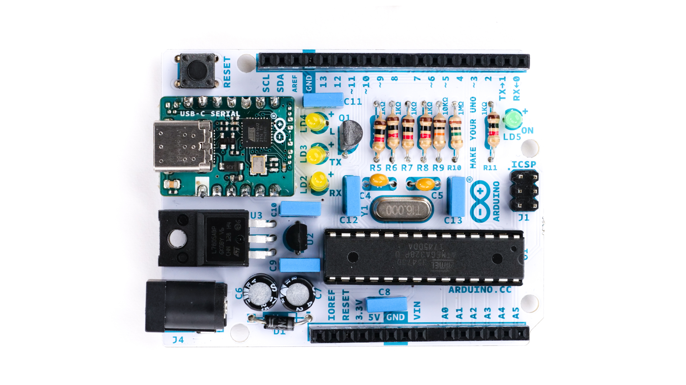
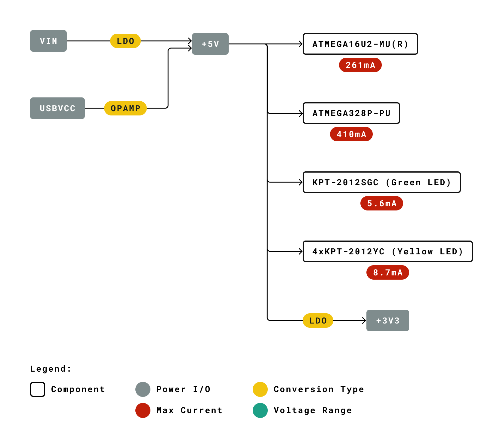
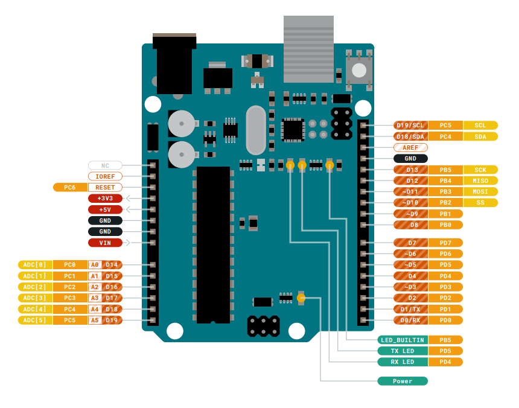

# Description
The *Arduino Make Your UNO kit* is the perfect kit to learn the basics of electronics and coding by assembling your own *Arduino Uno*. Become familiar with soldering by mounting every single component, unleash your creativity with the audio synth kit, and learn how to code using your new **Arduino Uno** board to create amazing projects!

# Target areas:
Maker, introduction, education

# Features
* **ATMega328P** Processor
    * **Memory**
        * AVR CPU at up to 16 MHz
        * 32KB Flash
        * 2KB SRAM
        * 1KB EEPROM

    * **Security**
        * Power On Reset (POR) 
        * Brown Out Detection (BOD) 

    * **Peripherals**
        * 2x 8-bit Timer/Counter with a dedicated period register and compare channels
        * 1x 16-bit Timer/Counter with a dedicated period register, input capture and compare channels
        * 1x USART with fractional baud rate generator and start-of-frame detection
        * 1x controller/peripheral Serial Peripheral Interface (SPI)
        * 1x Dual mode controller/peripheral I2C
        * 1x Analog Comparator (AC) with a scalable reference input
        * Watchdog Timer with separate on-chip oscillator
        * Six PWM channels
        * Interrupt and wake-up on pin change

* **USB_C Serial PCB** Board

    The USB_C Serial PCB contains the ATMega16U2 processor and a USB Type-C socket to program and power the board.

    * **ATMega16U2 Processor**
        *  8-bit AVR® RISC-based microcontroller 

        * **Memory**
            * 16 KB ISP Flash
            * 512B EEPROM
            * 512B SRAM
            * debugWIRE interface for on-chip debugging and programming

        * **Power**
            * 2.7-5.5 volts

# CONTENTS
## The Board
### Application Examples
The *Arduino Make Your UNO kit* is like any *Arduino Uno* board but created by yourself. The UNO board is the flagship product of Arduino. Regardless if you are new to the world of electronics or will use the UNO as a tool for education purposes or industry-related tasks.

**First entry to electronics:** If this is your first project within coding and electronics, get started with our most used and documented board; *Arduino Uno* and create one by yourself using the *Arduino Make Your UNO kit* is a great choice. It is equipped with the well-known ATmega328P processor, 14 digital input/output pins, 6 analog inputs, USB connections, ICSP header and a reset button. This board includes everything you will need for a great first experience with Arduino.

**Education purposes:** Although the UNO board has been with us for about ten years, it is still widely used for various educational purposes and scientific projects. The *Arduino Make Your UNO kit* is the perfect way to teach and learn about basic circuits, electronics components, soldering and coding microcontrollers, being the perfect board to create basic and advanced projects of all kinds.

**Audio synthesizer for educational and artistic performances**: The kit comes with an *Audio Synth Shield* that can be attached to the *Arduino Make Your UNO* to learn about and experiment with audio synthesizers, being a perfect device to play and experiment in the classroom and at the same time a great instrument for artistic performances.

### Related Products
* *Arduino Uno* R3 and *Arduino Uno* R3 SMD
* Starter Kit
* Tinkerkit Braccio Robot

## Ratings

### Recommended Operating Conditions

| Symbol | Description                                      | Min            | Max            |
| ------ | ------------------------------------------------ | -------------- | -------------- |
|        | Conservative thermal limits for the whole board: | -40 °C (-40°F) | 85 °C ( 185°F) |

>**NOTE:** In extreme temperatures, EEPROM, voltage regulator, and the crystal oscillator, might not work as expected due to the extreme temperature conditions 

### Power Consumption

| Symbol  | Description                              | Min  | Typ  | Max  | Unit |
| ------- | ---------------------------------------- | ---- | ---- | ---- | ---- |
| VINMax  | Maximum input voltage from Jack connector/VIN pad       | 6    | -    | 20   | V    |
| VUSBMax | Maximum input voltage from USB connector |      | -    | 5.5  | V    |
| PMax    | Maximum Power Consumption                | -    | -    | xx   | mA   |

## Functional Overview

### Board Topology and Bill of Materials
Top view

The *BOM* or *Bill Of Materials* of the *Arduino Make Your UNO kit* is made up of common components that can be found on the market. Use this list to reference and/or replace a damaged component if necessary. The designator references can be found written on the board and inside the PCB source file.

| **Ref.** | **Quantity** | **Description**                             | **Designator**               |
| -------- | -------------| ------------------------------------------- | ---------------------------- |
| A5215        | 7            | RES FIXED THD 1K OHM 1/4W 5%            | R1, R4, R5, R6, R7, R8, R11  |
| A5213        | 2            | RES THD 10K 1/4W 5%                     | R2, R9                       |
| A5217        | 2            | RES THD 1M OHM 1/4w  5%                 | R3, R10                      |
| 0066         | 1            | Diodes \[1N4007\]                       | D1                           |
| 0019         | 1            | CRYSTAL 16.0000MHZ 20PF THD             | Y1                           |
| C0124        | 3            | CAP THD 22pF 50V C0G 5%                 | C2, C4, C5                   |
| L0021        | 4            | LED THD YELLOW DIFFUSED T-1, 3mm        | LD1, LD2, LD3, LD4           |
| L0023        | 1            | LED THD GREEN DIFFUSED T-1, 3mm         | LD5                          |
| 0089         | 1            | PUSHBUTTON. 6x6 CS                      | PB1                          |
| T0035        | 1            | TRANSISTOR NMOS 0.2A                    | Q1                           |
| U0246        | 1            | IC REG LDO FIXED 3.3V, 0.2V TO-92-3     | R3                           |
| C0125        | 3            | CAP ALUM POL THD 47uF 25V               | C1, C12, C13                 |
| U0239        | 1            | IC REG LINEAR 5V 1.5A TO220AB           | U3                           |
| 0080         | 7            | CAP THD 100NF 63V POLIESTER             | C3, C6, C7, C8, C9, C10, C11 |
| 0064         | 1            | CONN DIP 28 SOCKET                      | J7                           |
| 3648         | 1            | CONN STRIP F/1/D 18v SER.NERA           | J2                           |
| 3649         | 1            | CONN STRIP F/1/D 14v SER.NERA           | J3                           |
| 0114         | 1            | CONN Header Through Hole 6 position     | J4                           |
| 0018         | 1            | CONN PWR JACK 2.1X5.5MM                 | J1                           |
| SL-ABX00068  | 1            | SL USB-C SERIAL V 1.0                   |                              |
| PCB_ASX00040 | 1            | PCB ARDUINO UNO DIY                     |                              |
| AKB 00037    | 1            | Bustine Avana 98x67                     |                              |
| A5681        | 1            | Jumper standed wire Red 15CM            |                              |
| A5680        | 1            | Jumper standed wire BLK 15CM            |                              |

### Processor
The Main Processor is an ATmega328P running at up to 20 MHz. Most of its pins are connected to the external headers, however some are reserved for internal communication with the USB Bridge coprocessor.

### Power Tree

 TODO: update power tree ? I thingks power tree should be the same

## Board Operation

### Getting Started - IDE
If you want to program your *Arduino Uno* while offline you need to install the Arduino Desktop IDE [\[1\]][1]. To connect the *Arduino Uno* to your computer, you’ll need a USB Type-C cable. This also provides power to the board, as indicated by the LED.

### Getting Started - Arduino Web Editor
All Arduino boards, including this one, work out-of-the-box on the Arduino Web Editor [\[2\]][2] by just installing a simple plugin.

The Arduino Web Editor is hosted online, therefore it will always be up-to-date with the latest features and support for all boards. Follow [\[3\]][3] to start coding on the browser and upload your sketches onto your board.

### Getting Started - Arduino IoT Cloud
All Arduino IoT-enabled products are supported on Arduino IoT Cloud which allows you to log, graph and analyze sensor data, trigger events, and automate your home or business.

### Sample Sketches
Sample sketches for the *Arduino Uno* can be found either in the “Examples” menu in the Arduino IDE.

### Online Resources
Now that you have gone through the basics of what you can do with the board you can explore the endless possibilities it provides by checking exciting projects on ProjectHub [\[4\]][4], the Arduino Library Reference [\[5\]][5] and the online store [\[6\]][6] where you will be able to complement your board with sensors, actuators and more.

### Board Recovery
All Arduino boards have a built-in bootloader which allows flashing the board via USB. In case a sketch locks up the processor and the board is not reachable anymore via USB it is possible to enter bootloader mode by double-tapping the reset button right after a power-up.

## Connector Pinouts

### JANALOG
| Pin  | **Function** | **Type**         | **Description**                                 |
| ---- | ------------ | ---------------- | ----------------------------------------------- |
| 1    | NC           | NC               | Not connected                                   |
| 2    | IOREF        | IOREF            | Reference for digital logic V - connected to 5V |
| 3    | Reset        | Reset            | Reset                                           |
| 4    | +3V3         | Power            | +3V3 Power Rail                                 |
| 5    | +5V          | Power            | +5V Power Rail                                  |
| 6    | GND          | Power            | Ground                                          |
| 7    | GND          | Power            | Ground                                          |
| 8    | VIN          | Power            | Voltage Input                                   |
| 9    | A0           | Analog/GPIO      | Analog input 0 /GPIO                            |
| 10   | A1           | Analog/GPIO      | Analog input 1 /GPIO                            |
| 11   | A2           | Analog/GPIO      | Analog input 2 /GPIO                            |
| 12   | A3           | Analog/GPIO      | Analog input 3 /GPIO                            |
| 13   | A4/SDA       | Analog input/I2C | Analog input 4/I2C Data line                    |
| 14   | A5/SCL       | Analog input/I2C | Analog input 5/I2C Clock line                   |

### JDIGITAL

| Pin  | **Function** | **Type**     | **Description**                            |
| ---- | ------------ | ------------ | ------------------------------------------ |
| 1    | D0           | Digital/GPIO | Digital pin 0/GPIO                         |
| 2    | D1           | Digital/GPIO | Digital pin 1/GPIO                         |
| 3    | D2           | Digital/GPIO | Digital pin 2/GPIO                         |
| 4    | D3           | Digital/GPIO | Digital pin 3/GPIO                         |
| 5    | D4           | Digital/GPIO | Digital pin 4/GPIO                         |
| 6    | D5           | Digital/GPIO | Digital pin 5/GPIO                         |
| 7    | D6           | Digital/GPIO | Digital pin 6/GPIO                         |
| 8    | D7           | Digital/GPIO | Digital pin 7/GPIO                         |
| 9    | D8           | Digital/GPIO | Digital pin 8/GPIO                         |
| 10   | D9           | Digital/GPIO | Digital pin 9/GPIO                         |
| 11   | SS           | Digital      | SPI Chip Select                            |
| 12   | MOSI         | Digital      | SPI1 Main Out Secondary In                 |
| 13   | MISO         | Digital      | SPI Main In Secondary Out                  |
| 14   | SCK          | Digital      | SPI serial clock output                    |
| 15   | GND          | Power        | Ground                                     |
| 16   | AREF         | Digital      | Analog reference voltage                   |
| 17   | A4/SD4       | Digital      | Analog input 4/I2C Data line (duplicated)  |
| 18   | A5/SD5       | Digital      | Analog input 5/I2C Clock line (duplicated) |

### Mechanical Information

### Board Outline & Mounting Holes

The *Arduino Make Your UNO kit* shares with the standard *Arduino Uno* boards the same shape and external mechanical board outline. The most important difference is the new USB Type-C connector instead of the classical USB Type-B one. The external shape and dimensions, pin headers, mounting holes and jack barrel connector are located in the same place as a standard _Arduino Uno_* board, being compatible with most of the shields and peripheral devices done for the *Arduino Uno* board.

## Certifications

### Declaration of Conformity CE DoC (EU)

We declare under our sole responsibility that the products above are in conformity with the essential requirements of the following EU Directives and therefore qualify for free movement within markets comprising the European Union (EU) and European Economic Area (EEA).

|                                                         |                                                   |
| ------------------------------------------------------- | ------------------------------------------------- |
| **ROHS 2 Directive 2011/65/EU**                         |                                                   |
| Conforms to:                                            | EN50581:2012                                      |
| **Directive 2014/35/EU. (LVD)**                         |                                                   |
| Conforms to:                                            | EN 60950-1:2006/A11:2009/A1:2010/A12:2011/AC:2011 |
| **Directive 2004/40/EC & 2008/46/EC & 2013/35/EU, EMF** |                                                   |
| Conforms to:                                            | EN 62311:2008                                     |

### Declaration of Conformity to EU RoHS & REACH 211 01/19/2021

Arduino boards are in compliance with RoHS 2 Directive 2011/65/EU of the European Parliament and RoHS 3 Directive 2015/863/EU of the Council of 4 June 2015 on the restriction of the use of certain hazardous substances in electrical and electronic equipment.

| Substance                              | **Maximum limit (ppm)** |
| -------------------------------------- | ----------------------- |
| Lead (Pb)                              | 1000                    |
| Cadmium (Cd)                           | 100                     |
| Mercury (Hg)                           | 1000                    |
| Hexavalent Chromium (Cr6+)             | 1000                    |
| Poly Brominated Biphenyls (PBB)        | 1000                    |
| Poly Brominated Diphenyl ethers (PBDE) | 1000                    |
| Bis(2-Ethylhexyl} phthalate (DEHP)     | 1000                    |
| Benzyl butyl phthalate (BBP)           | 1000                    |
| Dibutyl phthalate (DBP)                | 1000                    |
| Diisobutyl phthalate (DIBP)            | 1000                    |

Exemptions: No exemptions are claimed.

Arduino Boards are fully compliant with the related requirements of European Union Regulation (EC) 1907 /2006 concerning the Registration, Evaluation, Authorization and Restriction of Chemicals (REACH). We declare none of the SVHCs (https://echa.europa.eu/web/guest/candidate-list-table), the Candidate List of Substances of Very High Concern for authorization currently released by ECHA, is present in all products (and also package) in quantities totaling in a concentration equal or above 0.1%. To the best of our knowledge, we also declare that our products do not contain any of the substances listed on the "Authorization List" (Annex XIV of the REACH regulations) and Substances of Very High Concern (SVHC) in any significant amounts as specified by the Annex XVII of Candidate list published by ECHA (European Chemical Agency) 1907 /2006/EC.

### Conflict Minerals Declaration

As a global supplier of electronic and electrical components, Arduino is aware of our obligations with regards to laws and regulations regarding Conflict Minerals, specifically the Dodd-Frank Wall Street Reform and Consumer Protection Act, Section 1502. Arduino does not directly source or process conflict minerals such as Tin, Tantalum, Tungsten, or Gold. Conflict minerals are contained in our products in the form of solder, or as a component in metal alloys. As part of our reasonable due diligence Arduino has contacted component suppliers within our supply chain to verify their continued compliance with the regulations. Based on the information received thus far we declare that our products contain Conflict Minerals sourced from conflict-free areas. 

## FCC Caution

Any Changes or modifications not expressly approved by the party responsible for compliance could void the user’s authority to operate the equipment.

This device complies with part 15 of the FCC Rules. Operation is subject to the following two conditions: 

(1) This device may not cause harmful interference

 (2) this device must accept any interference received, including interference that may cause undesired operation.

**FCC RF Radiation Exposure Statement:**

1. This Transmitter must not be co-located or operating in conjunction with any other antenna or transmitter.

2. This equipment complies with RF radiation exposure limits set forth for an uncontrolled environment.

3. This equipment should be installed and operated with minimum distance 20cm between the radiator & your body.

English: 
User manuals for license-exempt radio apparatus shall contain the following or equivalent notice in a conspicuous location in the user manual or alternatively on the device or both. This device complies with Industry Canada license-exempt RSS standard(s). Operation is subject to the following two conditions:

(1) this device may not cause interference

 (2) this device must accept any interference, including interference that may cause undesired operation of the device.

French: 
Le présent appareil est conforme aux CNR d’Industrie Canada applicables aux appareils radio exempts de licence. L’exploitation est autorisée aux deux conditions suivantes :

(1) l’ appareil nedoit pas produire de brouillage

(2) l’utilisateur de l’appareil doit accepter tout brouillage radioélectrique subi, même si le brouillage est susceptible d’en compromettre le fonctionnement.

**IC SAR Warning:**

English
This equipment should be installed and operated with minimum distance 20 cm between the radiator and your body.

French:
Lors de l’ installation et de l’ exploitation de ce dispositif, la distance entre le radiateur et le corps est d ’au moins 20 cm.

**Important:** The operating temperature of the EUT can’t exceed 85℃ and shouldn’t be lower than -40℃.

Hereby, Arduino S.r.l. declares that this product is in compliance with essential requirements and other relevant provisions of Directive 2014/53/EU. This product is allowed to be used in all EU member states. 
 
## Company Information

| Company name    | Arduino S.r.l                           |
| --------------- | --------------------------------------- |
| Company Address | Via Andrea Appiani 25 20900 MONZA Italy |

## Reference Documentation

| Reference                 | **Link**                                                     |
| ------------------------- | ------------------------------------------------------------ |
| Arduino IDE (Desktop)     | https://www.arduino.cc/en/software                      |
| Arduino IDE (Cloud)       | https://create.arduino.cc/editor                             |
| Cloud IDE Getting Started | https://create.arduino.cc/projecthub/Arduino_Genuino/getting-started-with-arduino-web-editor-4b3e4a |
| Project Hub               | https://create.arduino.cc/projecthub?by=part&part_id=11332&sort=trending |
| Library Reference         | https://www.arduino.cc/reference/en/                         |
| Online Store              | https://store.arduino.cc/                                    |

## Revision History

| Date       | **Revision** | **Changes**       |
| ---------- | ------------ | ----------------- |
| xx/10/2022 | 1            | Datasheet release |

[1]: https://www.arduino.cc/en/software
[2]: https://create.arduino.cc/
[3]: https://create.arduino.cc/projecthub/Arduino_Genuino/getting-started-with-arduino-web-editor-4b3e4a
[4]: https://create.arduino.cc/projecthub?by=part&part_id=11332&sort=trending
[5]: https://www.arduino.cc/reference/en/
[6]: https://store.arduino.cc/