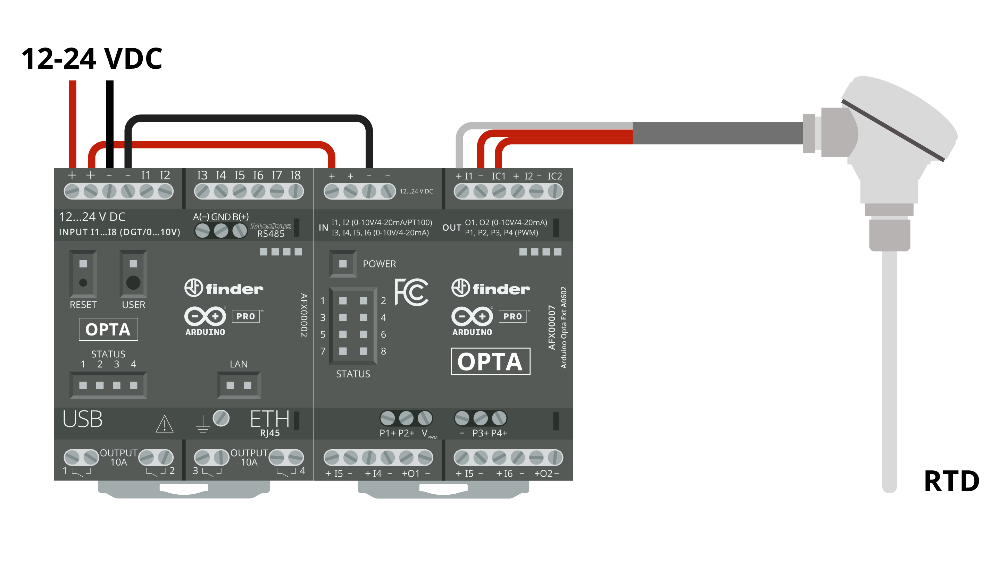
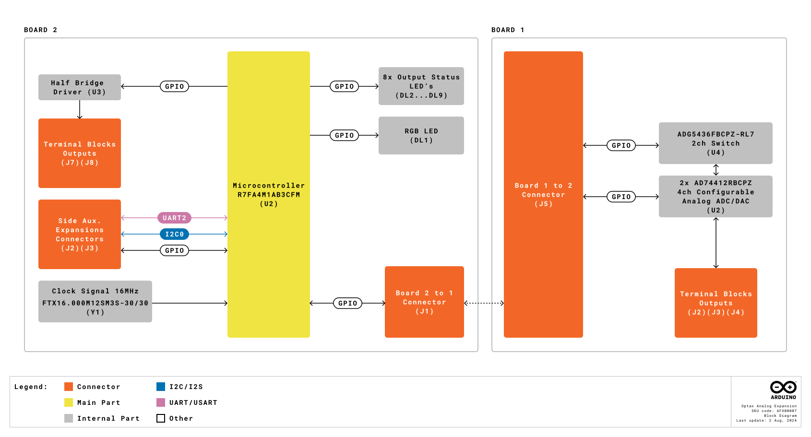

# Description
Arduino Opta® Analog Expansions are designed to multiply your Opta® micro PLC capabilities with the addition of 8 channels that can be programmed as inputs or outputs for connecting your analog voltage, current, resistive temperature sensors or actuators in addition to 4x dedicated PWM outputs. Designed in partnership with leading relay manufacturer Finder®, it allows professionals to scale up industrial and building automation projects while taking advantage of the Arduino ecosystem.

# Target Areas:
Industrial IoT, Building automation, Electrical loads management, Industrial automation

# CONTENTS

## Application Examples
The Arduino Opta® Analog Expansion is designed for industrial standard machinery control alongside the Opta® micro PLC. It is readily integrated into the Arduino hardware and software ecosystem.

- **Automated Production Line:** Arduino Opta® can manage the overall flow of goods in manufacturing. For example, by integrating a load cell or a vision system, it can ensure each phase of a packing process is performed correctly, automatically discard faulty parts, ensure the appropriate amount of goods is present within each box and interact with production line printers, also adding timestamp information synchronized via Network Time Protocol (NTP).

- **Real-time Monitoring in Manufacturing:** Production data can be visualized locally via an HMI or even by connecting to the Arduino Opta® via Bluetooth® Low Energy. The simplicity of Arduino Cloud allows to remotely display custom dashboards; this product is also compatible with other major Cloud providers.

- **Automated Anomaly Detection:** Its computing power allows the Arduino Opta® to deploy Machine Learning algorithms that are capable to learn when a process is drifting from its usual behavior on the production line and activating/deactivating processes to prevent equipment damage.

## Features
### General Specifications Overview

| Characteristics                     | Details                                                                                                                                                                                                                                        |
|-------------------------------------|------------------------------------------------------------------------------------------------------------------------------------------------------------------------------------------------------------------------------------------------|
| Supply Voltage                      | 12...24 V                                                                                                                                                                                                                                      |
| Reverse polarity protection         | Yes                                                                                                                                                                                                                                            |
| ESP protection                      | Yes                                                                                                                                                                                                                                            |
| Transient overvoltage protection    | Yes (up to 40 V)                                                                                                                                                                                                                               |
| Maximum Supported Expansion Modules | Up to 5                                                                                                                                                                                                                                        |
| Channels                            | 8x: I1, I2, I3, I4, O1, I5, I6, O2                                                                                                                                                                                                             |
| Channels functionalities            | I1 and I2: Programmable inputs (Voltage, Current, RTD2 wires, RTD3 wires), Programmable outputs (Voltage and current) - I3, I4, O1, I5, I6, O2: Programmable inputs (Voltage, Current, RTD2 wires), Programmable outputs (Voltage and current) |
| Degree of Protection                | IP20                                                                                                                                                                                                                                           |
| Certifications                      | FCC, CE, UKCA, cULus, ENEC                                                                                                                                                                                                                     |

<strong>Note:</strong> Check the inputs and outputs detailed sections below for more information about the Analog Expansion channels use. 

### Inputs

| Characteristics                 | Details                                               |
| ------------------------------- | ----------------------------------------------------- |
| Number of channels              | 8x                                                    |
| Channels programmable as inputs | I1, I2, I3, I4, O1, I5, I6, O2                        |
| Type of inputs accepted         | Digital Voltage and Analog (Voltage, Current and RTD) |
| Inputs overvoltage protection   | Yes                                                   |
| Antipolarity protection         | No                                                    |
| Analog Input resolution         | 16 bit                                               |
| Noise Rejection                 | Optional noise rejection between 50 Hz and 60 Hz      |

#### Voltage Input Mode

The Analog Expansion input channels can be configured for digital sensors or 0-10 V analog sensors. 

| Characteristics        | Details                                                |
|------------------------|--------------------------------------------------------|
| Digital input voltage  | 0...24 V                                               |
| Configurable threshold | Yes (for supporting 0...10 V logic level)              |
| Analog input voltage   | 0...10 V                                               |
| Analog input LSB value | 152.59 uV                                              |
| Accuracy               | +/- 1%                                                 |
| Repeatability          | +/- 1%                                                 |
| Input impedance        | Min: 175 kΩ (when internal 200 kΩ resistor is enabled) |

#### Current Input Mode

The Analog Expansion input channels can be configured for current loop instrumentation using the 0/4-20 mA standard. 

| Characteristics             | Details                                     |
|-----------------------------|---------------------------------------------|
| Analog input current        | 0...25 mA                                   |
| Analog input LSB value      | 381.5 nA                                    |
| Short circuit current limit | Min: 25 mA, Max 35 mA (externally powered). |
| Programmable current limit  | 0.5 mA to 24.5 mA (loop powered)            |
| Accuracy                    | +/- 1%                                      |
| Repeatability               | +/- 1%                                      |

#### RTD Input Mode

The Analog Expansion input channels can be used for temperature metering with **PT100** RTDs.

| Characteristics | Details  |
|-----------------|----------|
| Input range     | 0...1 MΩ |
| Bias voltage    | 2.5 V    |

***2 wires RTDs can be connected to any of the eight channels.***

**3 Wires RTD Connection**

RTD with 3 wires has generally two wires with the same color.

- Connect the two wires with the same color to the - and the ICx screw terminals respectively.
- Connect the wire with a different color to the + screw terminal.

***3 wires RTD can only be measured by channels __I1__ and __I2__.***

### Outputs

| Characteristics                     | Details                                  |
| ----------------------------------- | ---------------------------------------- |
| Number of channels                  | 8x, (2x used simultaneously recommended) |
| Channels programmable as outputs    | I1, I2, I3, I4, O1, I5, I6, O2           |
| Type of outputs supported           | Analog voltage and current               |
| DAC resolution                      | 13 bit                                  |
| Charge pump for zero voltage output | Yes                                      |

***All eight analog channels can be used as outputs but due to power dissipation limitations, it is recommended to have up to 2 channels set at output at the same time.***

***At 25°C of ambient temperature, all the 8 channels set as outputs have been tested at the same time while outputting more than 24 mA at 10 V each (>0.24W per channel).***

#### Voltage Output Mode

This output mode lets you control voltage-driven actuators.

| Characteristics                              | Details                                                                                                                     |
| -------------------------------------------- | --------------------------------------------------------------------------------------------------------------------------- |
| Analog output voltage                        | 0...11 V                                                                                                                    |
| Resistive load range                         | 500 Ω...100 kΩ                                                                                                              |
| Maximum capacitive load                      | 2 μF                                                                                                                        |
| Short-circuit current per channel (sourcing) | Min: 25 mA, Typ: 29 mA, Max: 32 mA (lower limit bit = 0 (default)), Min: 5.5 mA, Typ: 7 mA, Max: 9 mA (lower limit bit = 1) |
| Short-circuit current per channel (sinking)  | Min: 3.0 mA, Typ: 3.8 mA, Max: 4.5 mA                                                                                       |
| Accuracy                                     | +/- 1%                                                                                                                      |
| Repeatability                                | +/- 1%                                                                                                                      |

#### Current Output Mode

This output mode lets you control current-driven actuators.

| Characteristics                            | Details                                   |
| ------------------------------------------ | ----------------------------------------- |
| Analog output current                      | 0...25 mA                                 |
| Maximum output voltage when sourcing 25 mA | 11.9 V ± 20%                              |
| Open circuit voltage                       | 16.9 V ± 20%                              |
| Output  impedance                          | Min: 1.5 MΩ, Typ: 4 MΩ                    |
| Accuracy                                   | 1% in 0-10 mA range, 2% in 10-24 mA range |
| Repeatability                              | 1% in 0-10 mA range, 2% in 10-24 mA range |

#### PWM Output Channels

The Analog Expansion has four PWM output channels **(P1...P4)**. They are software configurable and for them to work you must provide the **VPWM** pin with the desired voltage.

| VPWM Voltage  | Details               |
| ------------------------ | --------------------- |
| Source voltage supported | 8...24 VDC            |
| Period                   | Programmable          |
| Duty-cycle               | Programmable (0-100%) |

#### Status LEDs

The Analog Expansion features eight user-programmable LEDs ideal for status reporting in the front panel.

| Description    | Value |
|----------------|-------|
| Number of LEDs | 8x     |

## Ratings
### Recommended Operating Conditions

| Description                 | Value                     |
|-----------------------------|---------------------------|
| Temperature Operating Range | -20...50 °C               |
| Protection degree rating    | IP20                      |
| Pollution degree            | 2 conforming to IEC 61010 |

### Power Specification (Ambient Temperature)

| Property                | Min | Typ | Max  | Unit |
|-------------------------|-----|-----|------|------|
| Supply voltage          | 12  | -   | 24   | V    |
| Permissible range       | 9.6 | -   | 28.8 | V    |
| Power consumption (12V) | 1.5 | -   | -    | W    |
| Power consumption (24V) | 1.8 | -   | -    | W    |

#### Additional Notes

***All screw terminals marked with “-” (minus sign) are shorted together.***
***There is no galvanic isolation between the board and its DC power supply.***

## Functional Overview

### Product View

| Item | Feature                                                                                                          |
|------|------------------------------------------------------------------------------------------------------------------|
| 3a   | Power Supply Terminals 12...24 VDC                                                                               |
| 3b   | P1...P4 PWM Outputs                                                                                              |
| 3c   | Power Status LED                                                                                                 |
| 3d   | Analog Input/Output Terminals I1...I2 (Voltage, Current, RTD 2 wires and RTD 3 wires)                            |
| 3e   | Status LEDs 1...8                                                                                                |
| 3f   | Port for communication and connection of auxiliary modules                                                       |
| 3g   | Analog Input/Output Terminals I3...I6 (Voltage, Current, RTD 2 wires)                                            |
| 3h   | Analog Input/Output Terminals O1...O2 (Voltage, Current, RTD 2 wires)                                            |

### Block Diagram

The following diagram explains the relation between the main components of the Opta® Analog Expansion:

### Input/Output Channels

The Arduino Opta® Analog Expansion features 8 channels that can be configured as inputs or outputs. When the channels are configured as inputs they can be used as digital ones with a 0-24/0-10 V range, or analog being able to measure voltage from 0 to 10 V, measure current from 0 to 25 mA or temperature leveraging the RTD mode.

The channels **I1** and **I2** can be used for connecting 3-Wires RTDs. Every channel can be used also as an output, be aware that using more than two channels as an output simultaneously may overheat the device. This will depend on the ambient temperature and channel load.

We have tested setting all eight channels as outputs at 25 °C outputting more than 24 mA at 10 V each during a limited timeframe.

<strong>Warning:</strong> In case the user needs a configuration with a deviation from the suggested one, will need to validate the system performance and stability before a deployment into a production environment.

The PWM outputs are software configurable and for them to work you must provide the **VPWM** pin with the desired voltage between 8 and 24 VDC, you can set the period and duty-cycle by software.

### Expansion Port
The expansion port can be used to daisy-chain several Opta® Expansions and additional modules. To access it, it needs to be freed from its breakable plastic cover, and the connection plug needs to be added between each device.

It supports up to 5 expansion modules. To avoid potential communication issues, ensure the total number of connected modules does not exceed 5.

If any issues occur with module detection or data exchange, double-check the connections and ensure the **Aux connector and clips are securely installed** within the expansion port. If problems persist, inspect for any loose or improperly connected cables.

## Device Operation
### Getting Started - IDE
If you want to program your Arduino Opta® Analog Expansion while offline you need to install the Arduino® Desktop IDE **[1]** and the Arduino_Opta_Blueprint using the Library Manager. To connect the Arduino Opta® to your computer, you will need a USB-C® cable.

### Getting Started - Arduino Cloud Editor
All Arduino® devices work out-of-the-box on the Arduino® Cloud Editor **[2]** by just installing a simple plugin.

The Arduino® Cloud Editor is hosted online, therefore it will always be up-to-date with the latest features and support for all boards and devices. Follow **[3]** to start coding on the browser and upload your sketches onto your device.

### Getting Started - Arduino PLC IDE
Arduino Opta® Analog Expansion can be also programmed using the industrial-standard **_IEC 61131-3_** programming languages. Download the Arduino® PLC IDE **[4]** software, attach the Opta® Expansion through the Aux Connector and connect your Arduino Opta® to your computer using a simple USB-C® cable to start creating your own PLC industrial solutions. The PLC IDE will recognize the expansion and will expose the new available I/Os in the resources tree.

### Getting Started - Arduino Cloud
All Arduino® IoT enabled products are supported on Arduino Cloud which allows you to log, graph and analyze sensor data, trigger events, and automate your home or business.

### Sample Sketches
Sample sketches for Arduino Opta® Analog Expansions can be found in the **Arduino_Opta_Blueprint** library “Examples” in the Arduino® IDE or the “Arduino Opta® Documentation” section of Arduino® **[5]**.

### Online Resources
Now that you have gone through the basics of what you can do with the device, you can explore the endless possibilities it provides by checking exciting projects on ProjectHub **[6]**, the Arduino® Library Reference **[7]** and the online store **[8]** where you will be able to complement your Arduino Opta® product with additional extensions, sensors and actuators.

## Mechanical Information
### Product Dimensions

***Note: Terminals can be used with both solid and stranded core wire (min: 0.5 mm2 / 20 AWG).***

## Certifications

### Certifications Summary

| Cert       | Arduino Opta® Analog Expansion (AFX00007 |
|------------|------------------------------------------|
| CE (EU)    | EN IEC 61326-1:2021, EN IEC 61010 (LVD)  |
| CB (EU)    | Yes                                      |
| WEEE (EU)  | Yes                                      |
| REACH (EU) | Yes                                      |
| UKCA (UK)  | EN IEC 61326-1:2021                      |
| FCC (US)   | Yes                                      |
| cULus      | UL 61010-2-201                           |

### Declaration of Conformity CE DoC (EU)
We declare under our sole responsibility that the products above are in conformity with the essential requirements of the following EU Directives and therefore qualify for free movement within markets comprising the European Union (EU) and European Economic Area (EEA).

### Declaration of Conformity to EU RoHS & REACH 211 01/19/2021

Arduino boards are in compliance with RoHS 2 Directive 2011/65/EU of the European Parliament and RoHS 3 Directive 2015/863/EU of the Council of 4 June 2015 on the restriction of the use of certain hazardous substances in electrical and electronic equipment.

| Substance                              | **Maximum limit (ppm)** |
|----------------------------------------|-------------------------|
| Lead (Pb)                              | 1000                    |
| Cadmium (Cd)                           | 100                     |
| Mercury (Hg)                           | 1000                    |
| Hexavalent Chromium (Cr6+)             | 1000                    |
| Poly Brominated Biphenyls (PBB)        | 1000                    |
| Poly Brominated Diphenyl ethers (PBDE) | 1000                    |
| Bis(2-Ethylhexyl) phthalate (DEHP)     | 1000                    |
| Benzyl butyl phthalate (BBP)           | 1000                    |
| Dibutyl phthalate (DBP)                | 1000                    |
| Diisobutyl phthalate (DIBP)            | 1000                    |

Exemptions: No exemptions are claimed.

Arduino Boards are fully compliant with the related requirements of European Union Regulation (EC) 1907 /2006 concerning the Registration, Evaluation, Authorization and Restriction of Chemicals (REACH). We declare none of the SVHCs (https://echa.europa.eu/web/guest/candidate-list-table), the Candidate List of Substances of Very High Concern for authorization currently released by ECHA, is present in all products (and also package) in quantities totaling in a concentration equal or above 0.1%. To the best of our knowledge, we also declare that our products do not contain any of the substances listed on the "Authorization List" (Annex XIV of the REACH regulations) and Substances of Very High Concern (SVHC) in any significant amounts as specified by the Annex XVII of Candidate list published by ECHA (European Chemical Agency) 1907 /2006/EC.

### Conflict Minerals Declaration
As a global supplier of electronic and electrical components, Arduino is aware of our obligations with regards to laws and regulations regarding Conflict Minerals, specifically the Dodd-Frank Wall Street Reform and Consumer Protection Act, Section 1502. Arduino does not directly source or process conflict minerals such as Tin, Tantalum, Tungsten, or Gold. Conflict minerals are contained in our products in the form of solder, or as a component in metal alloys. As part of our reasonable due diligence Arduino has contacted component suppliers within our supply chain to verify their continued compliance with the regulations. Based on the information received thus far we declare that our products contain Conflict Minerals sourced from conflict-free areas.

## FCC Caution
Any Changes or modifications not expressly approved by the party responsible for compliance could void the user’s authority to operate the equipment.

This device complies with part 15 of the FCC Rules. Operation is subject to the following two conditions:

(1) This device may not cause harmful interference

(2) this device must accept any interference received, including interference that may cause undesired operation.

**Note:** This equipment has been tested and found to comply with the limits for a Class A digital device, pursuant to part 15 of the FCC Rules. These limits are designed to provide reasonable protection against harmful interference when the equipment is operated in a commercial environment. This equipment generates, uses, and can radiate radio frequency energy and, if not installed and used in accordance with the instruction manual, may cause harmful interference to radio communications. Operation of this equipment in a residential area is likely to cause harmful interference in which case the user will be required to correct the interference at his own expense.

## Company Information

| Company name    | Arduino S.r.l                                  |
|-----------------|------------------------------------------------|
| Company Address | Via Andrea Appiani, 25 - 20900 MONZA （ Italy ) |

## Reference Documentation
|             **Ref**             | **Link**                                                                        |
|:-------------------------------:|---------------------------------------------------------------------------------|
|      Arduino IDE (Desktop)      | https://www.arduino.cc/en/Main/Software                                         |
|       Arduino IDE (Cloud)       | https://create.arduino.cc/editor                                                |
| Arduino Cloud - Getting started | https://docs.arduino.cc/arduino-cloud/getting-started/iot-cloud-getting-started |
|         Arduino PLC IDE         | https://www.arduino.cc/en/Main/Software                                         |
|   Arduino Opta® Documentation   | https://docs.arduino.cc/hardware/opta                                           |
|           Project Hub           | https://create.arduino.cc/projecthub?by=part&part_id=11332&sort=trending        |
|        Library Reference        | https://www.arduino.cc/reference/en/                                            |
|          Online Store           | https://store.arduino.cc/                                                       |

## Revision History

|  **Date**  | **Revision** |             **Changes**              |
|:----------:|:------------:|:------------------------------------:|
| 24/09/2024 |      4       |        Expansion port updates        |
| 03/09/2024 |      3       | Cloud Editor updated from Web Editor |
| 05/07/2024 |      2       |        Block Diagram updated         |
| 25/07/2024 |      1       |            First Release             |

