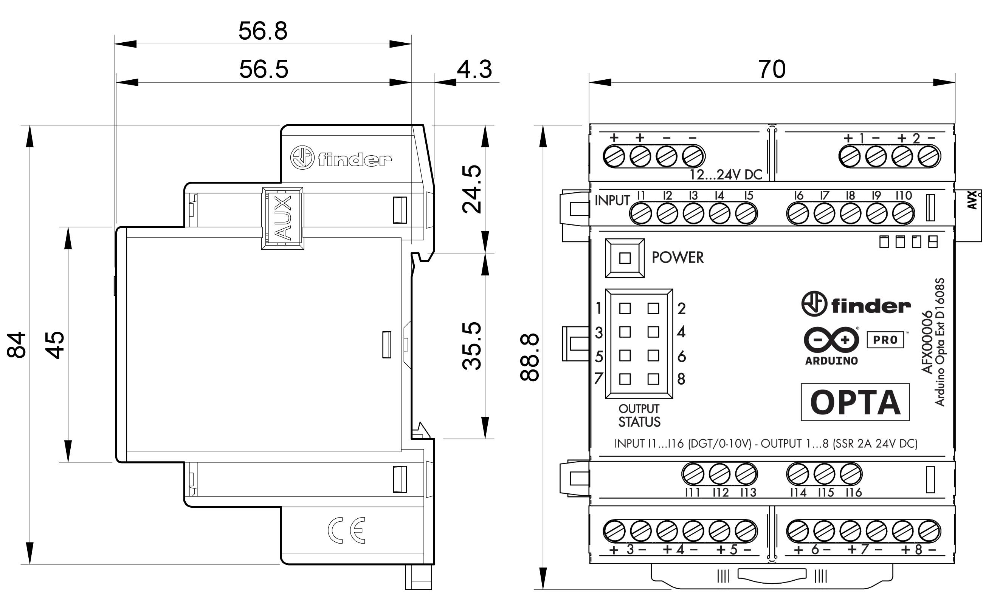

# Description
Arduino Opta® Digital Expansions are designed to multiply your Opta® micro PLC capabilities with the addition of 16 programmable inputs for connecting your digital sensors and 8 more relays to operate your machines. Designed in partnership with leading relay manufacturer Finder®, it allows professionals to scale up industrial and building automation projects while taking advantage of the Arduino ecosystem.

The Arduino Opta® Digital Expansion comes in two variants: the Opta Ext D1608E (with Electromechanical Relays) and the Opta Ext D1608S (with Solid State Relays), both of them described in this document.

# Target Areas:
Industrial IoT, Building automation, Electrical loads management, Industrial automation

# CONTENTS
## Product Variants
There are two variants of the Arduino Opta® Digital Expansion created to fit the different needs of each industry and application. The difference between each of the variants can be found in the following table:

| Name    | Arduino Opta® Ext D1608E                                     | Arduino Opta® Ext D1608S                                     |
| ------- | ------------------------------------------------------------ | ------------------------------------------------------------ |
| SKU     | AFX00005                                                     | AFX00006                                                     |
| Inputs  | 16 x programmable (0-24 V digital / 0-10 V or 0-24 V analog) | 16 x programmable (0-24 V digital / 0-10 V or 0-24 V analog) |
| Outputs | 8 x Electromechanical Relays (250 VAC - 6 A)                 | 8 x Solid State Relays (24 VDC - 3 A)                        |

***All digital expansion inputs, configured as analog, support analog sensors both 0-10 VDC(industrial standard) and 0-24 VDC.***

## Application Examples
Arduino Opta® Expansion is designed for industrial standard machinery control alongside the Opta® micro PLC. It is readily integrated into the Arduino hardware and software ecosystem.

- **Automated Production Line:** Arduino Opta® can manage the overall flow of goods in manufacturing. For example, by integrating a load cell or a vision system, it can ensure each phase of a packing process is performed correctly, automatically discard faulty parts, ensure the appropriate amount of goods is present within each box and interact with production line printers, also adding timestamp information synchronized via Network Time Protocol (NTP).

- **Real-time Monitoring in Manufacturing:** Production data can be visualized locally via an HMI or even by connecting to the Arduino Opta® via Bluetooth® Low Energy. The simplicity of Arduino Cloud allows to remotely display custom dashboards; this product is also compatible with other major Cloud providers.

- **Automated Anomaly Detection:** Its computing power allows the Arduino Opta® to deploy Machine Learning algorithms that are capable to learn when a process is drifting from its usual behavior on the production line and activating/deactivating processes to prevent equipment damage.

## Features
### General Specifications Overview

| Characteristics                     | Details                                                                                               |
| ----------------------------------- | ----------------------------------------------------------------------------------------------------- |
| Supply Voltage                      | 12...24 V                                                                                             |
| Antipolarity protection             | Yes                                                                                                   |
| Overvoltage protection              | Yes (+20%)                                                                                            |
| Maximum Supported Expansion Modules | Up to 5                                                                                               |
| Inputs                              | 16x Digital (0-24 V) / Analog (0-10 V or 0-24 V) inputs                                               |
| Outputs                             | AFX00005: 8x Electromechanical Relays (250 VAC - 6 A), AFX00006: 8x Solid State Relays (24 VDC - 3 A) |
| Degree of Protection                | IP20                                                                                                  |
| Certifications                      | FCC, CE, UKCA                                                                                         |

### Inputs

| Characteristics               | Details                   |
| ----------------------------- | ------------------------- |
| Number of inputs              | 16x Digital/Analog inputs |
| Inputs overvoltage protection | Yes (Up to 40 V)          |
| Antipolarity protection       | No                        |
| Input impedance               | 5.85 kΩ                   |

***The inputs are marked on plastic as DGT/0-10 V to maintain uniformity with the main Opta module and as conventionally the majority of industrial analog sensors work in the 0-10 V range.***

#### Digital Inputs
| Characteristics                   | Details                                                                   |
|-----------------------------------|---------------------------------------------------------------------------|
| Digital Input voltage             | 0...24 V                                                                  |
| Digital Input voltage logic level | Voltage Input Low (VIL) Max: 4 VDC. Voltage Input High (VIH) Min: 5.9 VDC |
| Digital Input current             | 4.12 mA at 24 V, 2.05 mA at 10 V                                          |
| Digital Input frequency           | 300 Hz                                                                    |

***The expansion digital inputs are compatible with 0-10 V and 0-24 V digital sensors.***

#### Analog Inputs
| Characteristics           | Details                          |
|---------------------------|----------------------------------|
| Analog Input voltage      | 0...10 V or 0...24 V             |
| Analog Input resolution   | 14 bit                           |
| Analog Input LSB value    | 1.733 mV                         |
| Accuracy                  | +/- 5%, repeatability +/- 2%     |

***The analog-to-digital converter resolution of 14 bits is considered in the 0-24 VDC range. If you are using a 0-10 VDC sensor, take into account that you will be leveraging half of the ADC scope.***

### Outputs (AFX00005 Only)

| Characteristics                             | Details                                        |
| ------------------------------------------- | ---------------------------------------------- |
| Number of outputs                           | 8x Electromechanical Relays (NO - SPST)        |
| Max current per relay                       | 6 A                                            |
| Max peak current per relay                  | 10 A                                           |
| Continuous current per terminal             | 6 A                                            |
| Short-circuit protection                    | No, external fuse required                     |
| Relay rated voltage                         | 250 VAC                                        |
| Relay Max voltage                           | 400 VAC                                        |
| Rated load AC1                              | 1500 VA                                        |
| Rated load AC15 (230 VAC)                   | 300 VA                                         |
| Breaking capacity DC1: 24/110/220 V         | 6/0.2/0.12 A                                   |
| Minimum switching load                      | 500 mW (12 V/10 mA)                            |
| Max output line length (unshielded)         | 100 m                                          |
| Relay response time from state 0 to state 1 | 5 ms for relay output                          |
| Relay response time from state 1 to state 0 | 3 ms for relay output                          |
| Bounce time NO                              | 1 ms                                           |
| Bounce time NC                              | 6 ms                                           |
| Relay mechanical durability                 | 10 million cycles (DC)                         |
| Relay electrical durability                 | 60 thousand cycles with a resistive load (AC1) |

### Outputs (AFX00006 Only)

| Characteristics                             | Details                           |
| ------------------------------------------- | --------------------------------- |
| Number of outputs                           | 8x Solid State Relays (NO - SPST) |
| Max current per relay                       | 3 A                               |
| Max peak current per relay                  | 50 A (10 ms)                      |
| Continuous current per terminal             | 3 A                               |
| Short-circuit protection                    | No, external fuse required        |
| Relay rated voltage                         | 24 VDC                            |
| Switching voltage range                     | 1.5...30 VDC                      |
| Maximum blocking voltage                    | 33 VDC                            |
| Rated load DC13                             | 36 W                              |
| Minimum switching current                   | 1 mA                              |
| Max "OFF-state" leakage current             | 0.001 mA                          |
| Max "ON-state" voltage drop                 | 0.4 V                             |
| Relay response time from state 0 to state 1 | 0.02 ms for relay output          |
| Relay response time from state 1 to state 0 | 0.2 ms for relay output           |
| Electrical life at rated load               | > 10 million cycles               |

## Ratings
### Recommended Operating Conditions

| Description                 | Value                     |
| --------------------------- | ------------------------- |
| Temperature Operating Range | -20...50 °C               |
| Protection degree rating    | IP20                      |
| Pollution degree            | 2 conforming to IEC 61010 |

### Power Specification (Ambient Temperature)

| Property                | Min  | Typ | Max  | Unit |
| ----------------------- | ---- | --- | ---- | ---- |
| Supply voltage          | 12   | -   | 24   | V    |
| Permissible range       | 10.2 | -   | 27.6 | V    |
| Power consumption (12 V) | -    | -   | 3    | W    |
| Power consumption (24 V) | -    | -   | 3    | W    |

## Functional Overview

### Product View

| Item | Feature                                                                           |
| ---- | --------------------------------------------------------------------------------- |
| 3a   | Power Supply Terminals 12...24 VDC                                                |
| 3b   | I1...I16 digital/analog input terminals (0-24 V) configurable via IDE             |
| 3c   | Power Status LED                                                                  |
| 3d   | Relay Output Terminals 1...8, NO contact (SPST), EMR 6 A 250 VAC - SSR 3 A 24 VDC |
| 3e   | Status LEDs 1...8                                                                 |
| 3f   | Port for communication and connection of auxiliary modules                        |

### Block Diagram

The following diagram explains the relation between the main components of the Opta® Digital Expansion:

### Relay Outputs
Arduino Opta® Digital Expansions has eight *Normally Open* (NO) relays. For the **EMR** variant, eight powerful 6 A electromechanical relays capable of actuating on loads at a rated voltage of 250 VAC and up to a maximum switching voltage of 400 VAC, and for the **SSR** variant, eight fast 3 A solid state relays which are capable of actuating on DC loads at a rated voltage of 24 VDC. 

The relay *Maximum Peak Current* is defined as the highest value of inrush current that the relay can endure without undergoing any permanent degradation of its characteristics due to the generated heat. The relay has to be able to hold up that maximum using a duty cycle of less or equal to 10% and for a time equal to or less than 0.5 s.

In the case of Arduino Opta® Digital Expansions, the EMR and SSR variants have a *Maximum Peak Current* of 10 A and 50 A respectively.

The *Rated Load* is the maximum resistive load that a contact can make, carry and break repeatedly. 
- For resistive or slightly inductive loads (AC1 classification), **EMR variant's** *Rated Load* is 1500 VA.
- For small electromagnetic loads (> 72 VA) (AC15 classification) like power contactors, magnetic solenoid valves, electromagnets and AC single-phase supplies, **EMR variant's** *Rated Load* is 300 VA. This value assumes a peak inrush current of approximately 10 times the rated current and keeps it within the maximum peak current.

For controlling DC loads (DC1 classification), the **EMR variant's** *Breaking Capacity* or maximum value of DC resistive current that a contact can make, carry and break repeatedly, is 6/0.2/0.12 A for respectively 24/110/220 V. 

For controlling DC electromagnetics loads (DC13 classification), the **SSR variant's** *Rated Load* is 36 W.

In the case of the minimum switching load parameters, the minimum values of power, voltage and current that the **EMR variant** relays can reliably switch, are 500 mW/ 12 V / 10 mA. This implies that with 12 V the current must be at least 42 mA, with 24 V, it must be at least 21 mA, and with 10 mA the voltage must be at least 50V.

For the **SSR variant**, the minimum switching voltage and current are 1.5 VDC and 1 mA respectively.

The **EMR variant** relays on Arduino Opta® Digital Expansions provide a very fast response time of 6/4 ms to change state for closing/reopening. The **SSR variant** provides an even faster response of 0.02/0.2 ms to change state for closing/reopening.

### Expansion Port
The expansion port can be used to daisy-chain several Opta® Expansions and additional modules. To be accessed needs to be freed up from its breakable plastic cover and the connection plug added between each device.

It supports up to 5 expansion modules. To avoid potential communication issues, ensure the total number of connected modules does not exceed 5.

If any issues occur with module detection or data exchange, double-check the connections and ensure the **Aux connector and clips are securely installed** within the expansion port. If problems persist, inspect for any loose or improperly connected cables.

## Device Operation
### Getting Started - IDE
If you want to program your Arduino Opta® Digital Expansions while offline you need to install the Arduino® Desktop IDE **[1]** and the Arduino_Opta_Blueprint using the Library Manager. To connect the Arduino Opta® to your computer, you will need a USB-C® cable.

### Getting Started - Arduino Cloud Editor
All Arduino® devices work out-of-the-box on the Arduino® Cloud Editor **[2]** by just installing a simple plugin.

The Arduino® Cloud Editor is hosted online, therefore it will always be up-to-date with the latest features and support for all boards and devices. Follow **[3]** to start coding on the browser and upload your sketches onto your device.

### Getting Started - Arduino PLC IDE
Arduino Opta® Digital Expansions can be also programmed using the industrial-standard **_IEC 61131-3_** programming languages. Download the Arduino® PLC IDE **[4]** software, attach the Opta® Expansion through the Aux Connector and connect your Arduino Opta® to your computer using a simple USB-C® cable to start creating your own PLC industrial solutions. The PLC IDE will recognize the expansion and will expose the new available I/Os in the resources tree.

### Getting Started - Arduino Cloud
All Arduino® IoT enabled products are supported on Arduino Cloud which allows you to log, graph and analyze sensor data, trigger events, and automate your home or business.

### Sample Sketches
Sample sketches for Arduino Opta® Digital Expansions can be found in the **Arduino_Opta_Blueprint** library “Examples” in the Arduino® IDE or the “Arduino Opta® Documentation” section of Arduino® **[5]**.

### Online Resources
Now that you have gone through the basics of what you can do with the device, you can explore the endless possibilities it provides by checking exciting projects on ProjectHub **[6]**, the Arduino® Library Reference **[7]** and the online store **[8]** where you will be able to complement your Arduino Opta® product with additional extensions, sensors and actuators.

## Mechanical Information
### Product Dimensions

***Note: Terminals can be used with both solid and stranded core wire (min: 0.5 mm2 / 20 AWG).***

## Certifications

### Certifications Summary

| Cert       | Arduino Opta® Digital Expansion EMR (AFX00005) | Arduino Opta® Digital Expansion SSR (AFX00006) |
| ---------- | ---------------------------------------------- | ---------------------------------------------- |
| CE (EU)    | EN IEC 61326-1:2021, EN IEC 61010 (LVD)        | EN IEC 61326-1:2021, EN IEC 61010 (LVD)        |
| CB (EU)    | Yes                                            | Yes                                            |
| WEEE (EU)  | Yes                                            | Yes                                            |
| REACH (EU) | Yes                                            | Yes                                            |
| UKCA (UK)  | EN IEC 61326-1:2021                            | EN IEC 61326-1:2021                            |
| FCC (US)   | Yes                                            | Yes                                            |
| cULus      | UL 61010-2-201                                 | UL 61010-2-201                                 |

### Declaration of Conformity CE DoC (EU)
We declare under our sole responsibility that the products above are in conformity with the essential requirements of the following EU Directives and therefore qualify for free movement within markets comprising the European Union (EU) and European Economic Area (EEA).

### Declaration of Conformity to EU RoHS & REACH 211 01/19/2021

Arduino boards are in compliance with RoHS 2 Directive 2011/65/EU of the European Parliament and RoHS 3 Directive 2015/863/EU of the Council of 4 June 2015 on the restriction of the use of certain hazardous substances in electrical and electronic equipment.

| Substance                              | **Maximum limit (ppm)** |
|----------------------------------------|-------------------------|
| Lead (Pb)                              | 1000                    |
| Cadmium (Cd)                           | 100                     |
| Mercury (Hg)                           | 1000                    |
| Hexavalent Chromium (Cr6+)             | 1000                    |
| Poly Brominated Biphenyls (PBB)        | 1000                    |
| Poly Brominated Diphenyl ethers (PBDE) | 1000                    |
| Bis(2-Ethylhexyl) phthalate (DEHP)     | 1000                    |
| Benzyl butyl phthalate (BBP)           | 1000                    |
| Dibutyl phthalate (DBP)                | 1000                    |
| Diisobutyl phthalate (DIBP)            | 1000                    |

Exemptions: No exemptions are claimed.

Arduino Boards are fully compliant with the related requirements of European Union Regulation (EC) 1907 /2006 concerning the Registration, Evaluation, Authorization and Restriction of Chemicals (REACH). We declare none of the SVHCs (https://echa.europa.eu/web/guest/candidate-list-table), the Candidate List of Substances of Very High Concern for authorization currently released by ECHA, is present in all products (and also package) in quantities totaling in a concentration equal or above 0.1%. To the best of our knowledge, we also declare that our products do not contain any of the substances listed on the "Authorization List" (Annex XIV of the REACH regulations) and Substances of Very High Concern (SVHC) in any significant amounts as specified by the Annex XVII of Candidate list published by ECHA (European Chemical Agency) 1907 /2006/EC.

### Conflict Minerals Declaration
As a global supplier of electronic and electrical components, Arduino is aware of our obligations with regards to laws and regulations regarding Conflict Minerals, specifically the Dodd-Frank Wall Street Reform and Consumer Protection Act, Section 1502. Arduino does not directly source or process conflict minerals such as Tin, Tantalum, Tungsten, or Gold. Conflict minerals are contained in our products in the form of solder, or as a component in metal alloys. As part of our reasonable due diligence Arduino has contacted component suppliers within our supply chain to verify their continued compliance with the regulations. Based on the information received thus far we declare that our products contain Conflict Minerals sourced from conflict-free areas.

## FCC Caution
Any Changes or modifications not expressly approved by the party responsible for compliance could void the user’s authority to operate the equipment.

This device complies with part 15 of the FCC Rules. Operation is subject to the following two conditions:

(1) This device may not cause harmful interference

(2) this device must accept any interference received, including interference that may cause undesired operation.

**Note:** This equipment has been tested and found to comply with the limits for a Class A digital device, pursuant to part 15 of the FCC Rules. These limits are designed to provide reasonable protection against harmful interference when the equipment is operated in a commercial environment. This equipment generates, uses, and can radiate radio frequency energy and, if not installed and used in accordance with the instruction manual, may cause harmful interference to radio communications. Operation of this equipment in a residential area is likely to cause harmful interference in which case the user will be required to correct the interference at his own expense.

## Company Information

| Company name    | Arduino S.r.l                                   |
| --------------- | ----------------------------------------------- |
| Company Address | Via Andrea Appiani, 25 - 20900 MONZA （ Italy ) |

## Reference Documentation
|        **Ref**                    | **Link**                                                                                    |
|:---------------------------------:|---------------------------------------------------------------------------------------------|
| Arduino IDE (Desktop)             | https://www.arduino.cc/en/Main/Software                                                     |
| Arduino IDE (Cloud)               | https://create.arduino.cc/editor                                                            |
| Arduino Cloud - Getting started   | https://docs.arduino.cc/arduino-cloud/getting-started/iot-cloud-getting-started             |
| Arduino PLC IDE                   | https://www.arduino.cc/en/Main/Software                                                     |
| Arduino Opta® Documentation       | https://docs.arduino.cc/hardware/opta                                                       |
| Project Hub                       | https://create.arduino.cc/projecthub?by=part&part_id=11332&sort=trending                    |
| Library Reference                 | https://www.arduino.cc/reference/en/                                                        |
| Online Store                      | https://store.arduino.cc/                                                                   |

## Revision History

| Date       | **Revision** | **Changes**                          |
|------------|--------------|--------------------------------------|
| 02/12/2024 | 5            | Digital input specification update   |
| 24/09/2024 | 4            | Expansion port updates               |
| 24/09/2024 | 3            | SSR operating current update         |
| 03/09/2024 | 2            | Cloud Editor updated from Web Editor |
| 06/05/2024 | 1            | First Release                        |
