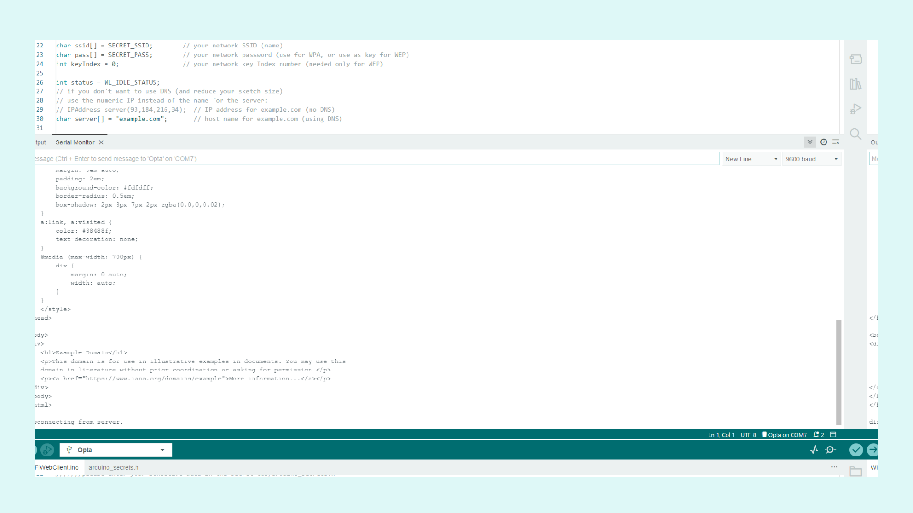
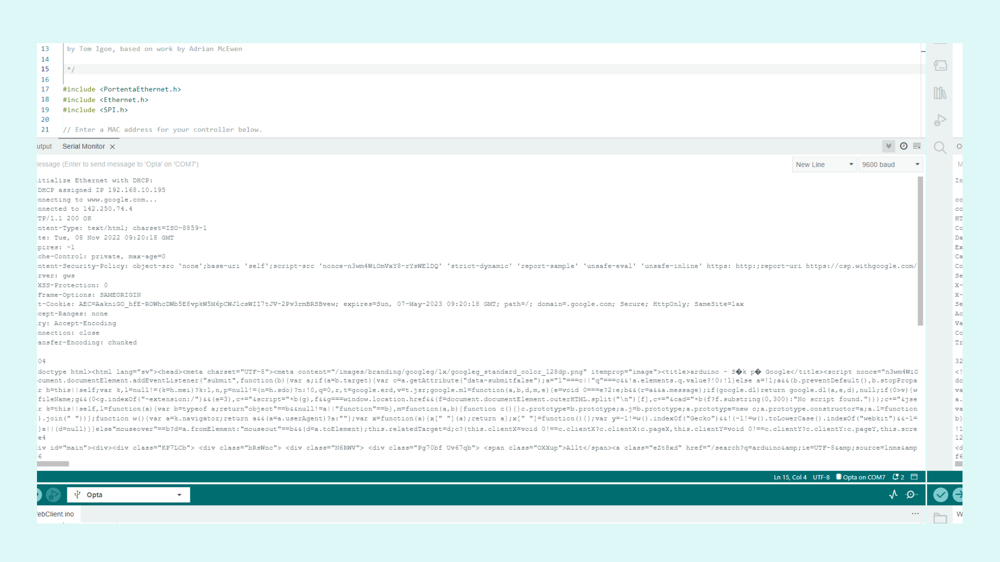
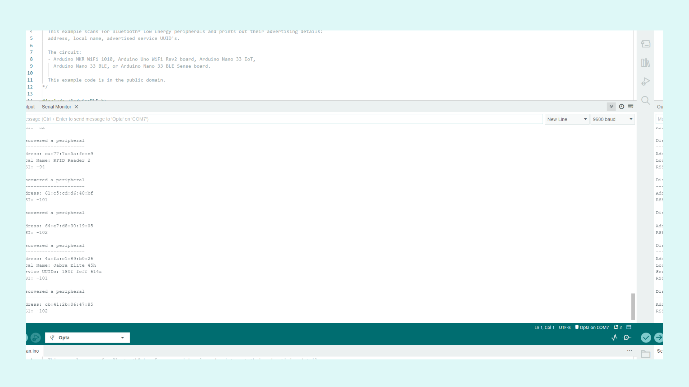

## Overview

The Opta™ is a powerful micro PLC device with many features that can be customized to meet the requirements of each professional solution. Among these features, you can find standard connectivity protocols such as Wi-Fi®, Ethernet, and Bluetooth®. Please note that these connectivity features are not available on all variants of Opta™. In this tutorial, we will go through how to use these features in Opta™ using the Arduino IDE.

## Goals

- Learn how to use Wi-Fi® on Opta™
- Learn how to use Ethernet on Opta™
- Learn how to use Bluetooth® Low Energy on Opta™

### Required Hardware and Software

- Opta™ PLC with connectivity support (x1)
- Ethernet (RJ45) cable (x1)
- [Arduino IDE 1.8.10+](https://www.arduino.cc/en/software), [Arduino IDE 2](https://www.arduino.cc/en/software), or [Arduino Web Editor](https://create.arduino.cc/editor)
- USB-C® cable (either USB-C® to USB-A or USB-C® to USB-C®) (x1)
- Wi-Fi® Access Point with Internet Access

## Instructions

### Setup with the Arduino IDE

Using the Arduino IDE, we can easily work with the connectivity features, which have libraries that we can make use of. First, make sure the latest version of the Arduino IDE is installed. The IDE can be downloaded [here](https://www.arduino.cc/en/software).

Then we need to install the appropriate core for Opta™. Go to **Tools > Board > Boards Manager**, in the board's manager section search for **Opta mbed** and install it. For more detailed instructions on setting up the Opta™ with the Arduino IDE, have a look at the [Getting started with Opta™ tutorial](/tutorials/opta/getting-started).

### Wi-Fi®

The files necessary for using the Wi-Fi® on Opta™ are included in the core. To try it out, we can go to **File > Examples**, and under **Examples for Opta**, we can find the **WiFi** section. Inside there is an example sketch called **WiFiWebClient**. Open this example sketch and fill out the Wi-Fi® details in the **arduino_secrets.h** tab.

Once uploaded, the sketch will make Opta™ connect to the desired website defined within the `char server[] = "example.com";` variable. If the connection is successful, it will then print the website's HTML content to the serial monitor. If the sketch ran successfully, the output should look like the image below.

If you want to take a deeper look at the features that the **WiFi** library has to offer, [take a look at the API Wi-Fi® reference page](https://www.arduino.cc/reference/en/libraries/wifi/).

### Ethernet

Opta™ has an RJ45 ethernet port with a LED that will indicate the status of the connected cable. The files necessary for using Ethernet with Opta™ are included in the core. To try it out, we can go to **File > Examples**, and under **Examples for Opta**, we can find the **Ethernet** section. Inside the section, there is an example sketch called **WebClient**.

Connect the Ethernet cable to Opta™ and upload the example using the USB-C® cable. This example will work the same way as the one mentioned in the Wi-Fi® section. The device will connect to the website defined in the sketch and print the website's HTML content in the serial monitor. If the sketch ran successfully, the output should look like the image below.

If you want to take a deeper look at the features that the **Ethernet** library has to offer, [take a look at the API Ethernet reference page](https://www.arduino.cc/reference/en/libraries/ethernet/).

### Modbus TCP Via Ethernet Port

Opta™ can be configured to use Modbus TCP protocol, which runs a Modbus protocol layered over a TCP/IP stack. Thus the coverage distance is dependent on the capacity of the Ethernet cable. In the case of an industrial environment, a good cable choice could be an RJ45 cable with the category Cat6 or Cat6A, allowing a maximum distance of 100 meters.

### Bluetooth® Low Energy

To use the Bluetooth® Low Energy feature, you will need to download the **ArduinoBLE** library in the Arduino IDE. Go into the **library manager** and search for **ArduinoBLE**. If you can't find it, try sorting by official libraries published by Arduino. Once the ArduinoBLE library is installed, let's try and run a simple example that scans for other Bluetooth® devices within range.

The sketch will print the addresses of near devices as well as the local name and the advertised service UUIDs if present. The example can be found under **File > Examples > ArduinoBLE > Central**, the sketch is called **Scan**. When the sketch is running on the Opta™, the output on the serial monitor should look something like the image below.

If you want to take a deeper look at the features that the **ArduinoBLE** library has to offer, [take a look at the API BLE reference page](https://www.arduino.cc/reference/en/libraries/arduinoble/).

## Conclusion

This tutorial has shown an overview of the connectivity features of Opta™ and how to use them, including how to use the different connectivity protocols and which libraries are required to make them work. By running all the example sketches mentioned in this tutorial, you can confirm that the connectivity features of your Opta™ are ready to be implemented into more complex solutions.

### Next Steps

Now that you know how to use the connectivity features of the device, have a look at other interesting tutorials and try to combine the different features. Opta™ uses the same architecture as the Portenta H7 and therefore, it could be a good idea to take a look at the Portenta H7 tutorials. Such as using your [device as a Wi-Fi® access point tutorial](https://docs.arduino.cc/tutorials/portenta-h7/wifi-access-point) or the [Bluetooth® Low Energy connectivity with a phone tutorial](https://docs.arduino.cc/tutorials/portenta-h7/ble-connectivity).
