This user manual will provide a comprehensive overview of Opta™, covering its major hardware and software elements. With this user manual, you will learn how to set up, configure, and use all the main features of an Opta™ device. 

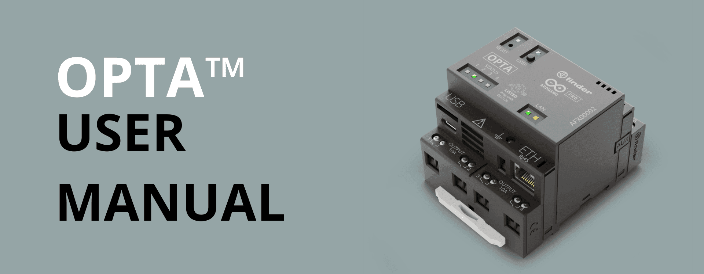

## Hardware and Software Requirements

### Hardware Requirements

- [Opta™ Lite](https://store.arduino.cc/products/opta-lite), [Opta™ RS485](https://store.arduino.cc/products/opta-rs485), or [Opta™ WiFi](https://store.arduino.cc/products/opta-wifi) (x1)
- [USB-C® cable](https://store.arduino.cc/products/usb-cable2in1-type-c) (x1)
- +12-24 VDC/0.5 A power supply (x1)

### Software Requirements

- [Arduino IDE 2.0+](https://www.arduino.cc/en/software) or [Arduino Cloud Editor](https://create.arduino.cc/editor)
- [Arduino PLC IDE 1.0.3+](https://www.arduino.cc/en/software) (for IEC 61131-3 PLC programming languages)

***To learn more about the PLC IDE, check out our tutorials [here](https://docs.arduino.cc/software/plc-ide).***

## Opta™ Overview

Opta™ is a secure micro Programmable Logic Controller (PLC) with Industrial Internet of Things (IoT) capabilities. Developed in partnership with Finder®, this device supports both the Arduino programming language and standard IEC-61131-3 PLC programming languages, such as Ladder Diagram (LD), Sequential Function Chart (SFC), Function Block Diagram (FBD), Structured Text (ST), and Instruction List (IL), making it an ideal device for automation engineers. 

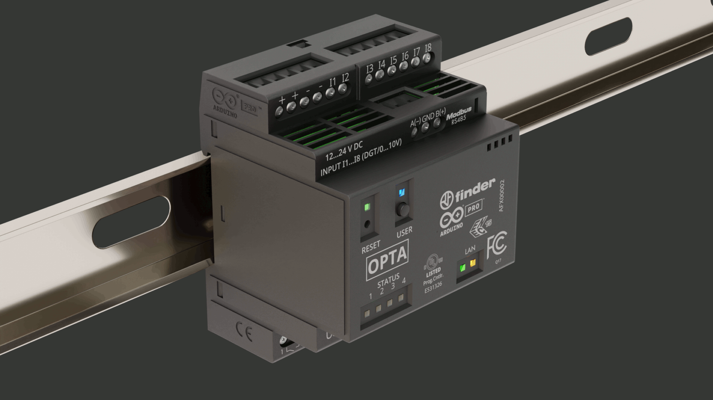

Based on the STM32H747XI from STMicroelectronics®, a high-performance Arm® Cortex®-M7 + Cortex®-M4 microcontroller, Opta™ is a perfect option for a wide range of applications, from real-time control to predictive maintenance applications.

### Opta™ Variants

There are three variants of Opta™ created to fit the different needs of each industry and application. 

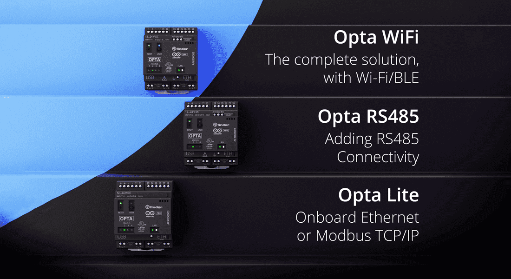 

The difference between each of the variants can be found in the following table:

|      **Feature**     |   **Opta™ Lite**  |  **Opta™ RS485**  |     **Opta™ WiFi**    |
|:--------------------:|:-----------------:|:-----------------:|:---------------------:|
|        **SKU**       |      AFX00003     |      AFX00001     |        AFX00002       |
|        **USB**       |       USB-C®      |       USB-C®      |         USB-C®        |
| **Ethernet Support** | 10/100BASE-T Port | 10/100BASE-T Port |   10/100BASE-T Port   |
|      **RS-485**      |        N/A        |    Half-duplex    |      Half-duplex      |
|      **Wi-Fi®**      |        N/A        |        N/A        |      802.11 b/g/n     |
|    **Bluetooth®**    |        N/A        |        N/A        | Bluetooth® Low Energy |

The main differences between each one of the variants are related to their connectivity possibilities. All the variants can be connected to the Cloud using the onboard Ethernet. If your solution does not need an RS-485 interface or wireless connectivity, Opta™ Lite can fit your needs. If you need to connect your device to a Modbus RTU bus using an RS-485 connection but do not need wireless communication, Opta™ RS485 is the chosen variant. To have all Opta™ features and flexibility, with full wireless Wi-Fi® and Bluetooth® Low Energy connectivity, the Opta™ WiFi variant is the perfect choice for your professional projects.

### Opta™ Main Components

Opta™ features a secure, certified, and durable design that enables it for automation and industrial applications. 

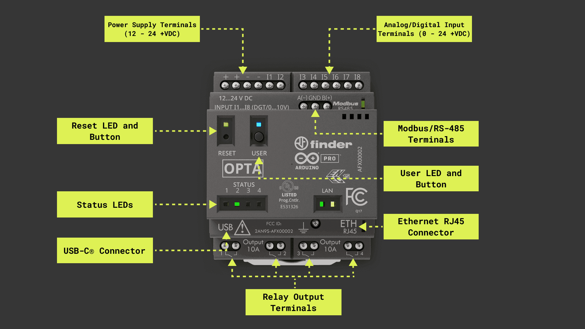

Here's an overview of the device's main components shown in the image above:

- **Microcontroller**: At the heart of Opta™ is the STM32H747XI, a powerful and high-performance microcontroller from STMicroelectronics®. The STM32H747XI is built around an Arm® Cortex®-M7 and Arm® Cortex®-M4 32-bit RISC cores. The Arm® Cortex®-M7 core operates at up to 480 MHz, and the Arm® Cortex®-M4 core at up to 240 MHz.
- **Wireless connectivity**: Opta™ (WiFi variant only) supports 2.4 GHz Wi-Fi® (802.11 b/g/n) and Bluetooth® Low Energy (4.2 supported by firmware and 5.1 supported by hardware), allowing the device to communicate wirelessly with other devices and systems. 
- **Ethernet connectivity**: Opta™ (all variants) features an onboard, high-performance 10/100 Mbps Ethernet transceiver accessible through its onboard RJ45 connector.
- **Security**: Opta™ features an onboard ready-to-use secure element, the ATECC608B from Microchip®, specifically designed for IoT devices that provides advanced security features, being perfect for Industrial IoT (IIoT) environments where security is critical.
- **USB connectivity**: Opta™ features an onboard USB-C® port that can be used for programming and data logging but not to command the relay outputs. To do so, power Opta™ using an external power supply.
- **Analog and digital peripherals**: Opta™ features analog and digital peripherals such as eight analog/digital input ports and four digital outputs ports (relay outputs). 
- **RS-485 connectivity**: Opta™ (RS485 and WiFi variants) features a physical RS-485 communication interface available through an onboard terminal connector that can be used for standard communication interfaces like Modbus RTU or custom communication protocols.
- **Form factor**: Opta™ devices can be mounted standalone on a DIN rail, a grid, or a panel, providing quick and easy access to all input/output ports and peripherals.

### Opta™ Core and Libraries

The `Arduino Mbed OS Opta Boards` core contains the libraries and examples to work with Opta™'s peripherals and onboard components, such as its input ports, output ports, Wi-Fi® and Bluetooth® module (WiFi variant only). To install the core for Opta™, navigate to **Tools > Board > Boards Manager** or click the **Boards Manager** icon in the left tab of the IDE. In the Boards Manager tab, search for `opta` and install the latest `Arduino Mbed OS Opta Boards` core version.

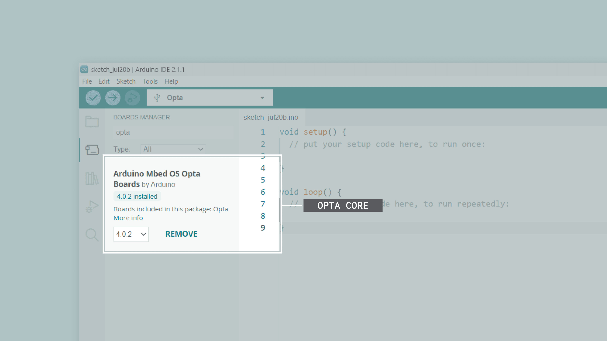

### Arduino PLC IDE

PLC IDE is the Arduino solution to program Opta™ devices using the five programming languages recognized by the IEC 61131-3 standard. 

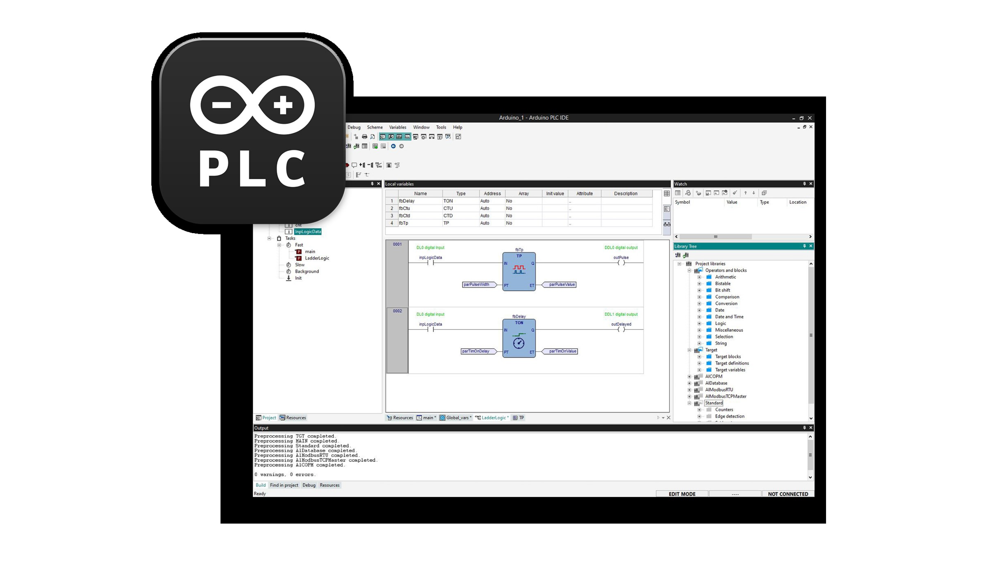

The IEC 61131-3 programming languages include:

- Ladder Diagram (LD)
- Functional Block Diagram (FBD)
- Structured Text (ST)
- Sequential Function Chart (SFC)
- Instruction List (IL)

In the PLC IDE, you can mix PLC programming with standard Arduino sketches within the integrated sketch editor and share variables between the two environments. You can also automate tasks in your software applications; this gives you control over scheduling and repetition, enhancing the reliability and efficiency of your project. Moreover, communication protocols such as Modbus RTU and Modbus TCP can be managed effortlessly using integrated no-code fieldbus configurators.

Check out the following resources that will show you how to start with the Arduino PLC IDE and how to use IEC 61131-3 programming languages with Opta™:

- [Arduino PLC IDE download page](https://www.arduino.cc/pro/software-plc-ide)
- [Arduino PLC IDE and Opta™ tutorials](https://docs.arduino.cc/software/plc-ide)

***The Arduino IDE and the Arduino PLC IDE programming environments have important differences in control and real-time performance, which means that the device is configured differently the first time you use one or the other. In case you have been using Opta with the PLC IDE, and you want to come back to use it inside the Arduino environment, we recommend performing the memory partitioning process that is explained in the [Opta™ Memory Partitioning for Use with the Arduino IDE](https://docs.arduino.cc/tutorials/opta/memory-partitioning) tutorial.***

### Pinout

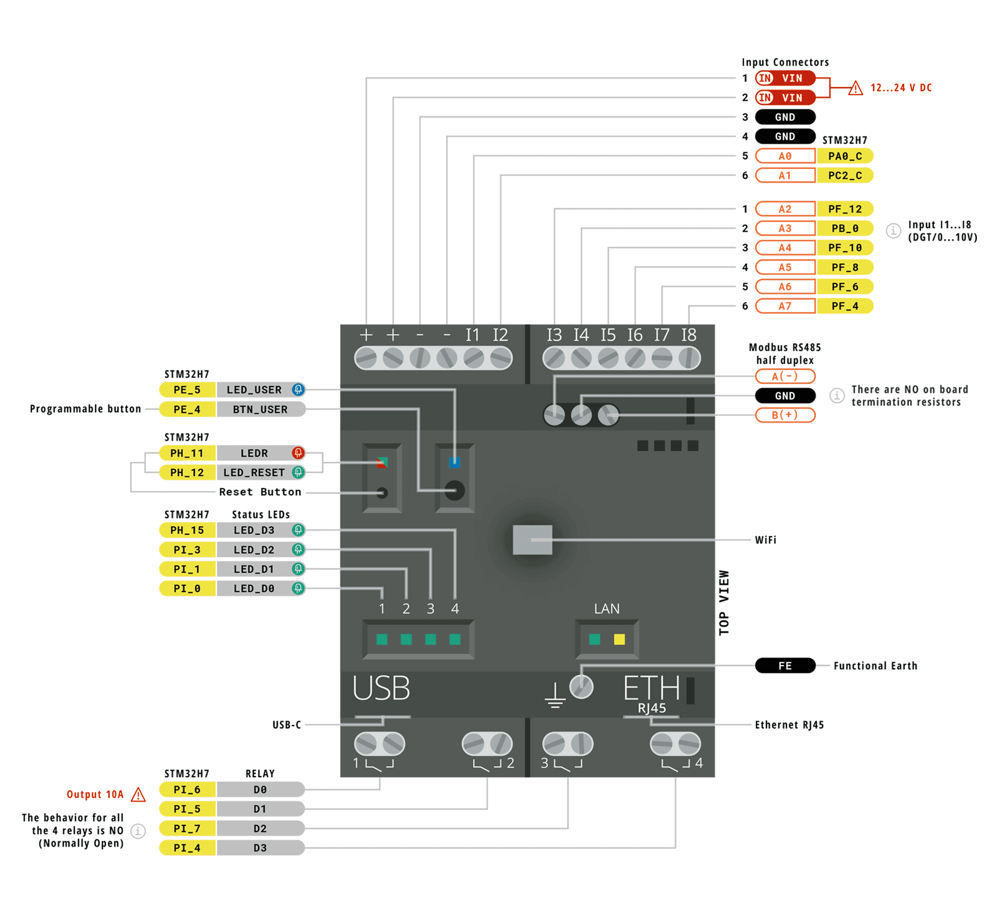

The complete pinout (for all Opta™ variants) is available and downloadable as PDF from the link below:

- [Opta™ pinout](https://docs.arduino.cc/resources/pinouts/opta-full-pinout.pdf)

### Datasheet

The complete datasheet (for all Opta™ variants) is available and downloadable as PDF from the link below:

- [Opta™ datasheet](https://docs.arduino.cc/resources/datasheets/AFX00001-AFX00002-AFX00003-datasheet.pdf)

### STEP Files

The complete STEP files (for all Opta™ variants) are available and downloadable from the link below:

- [Opta™ STEP files](../../downloads/AFX00001-AFX00002-AFX00003-step.zip)  

## First Use

### Powering the Opta™

Opta™ can be powered in different ways:

- Using a **USB-C® cable** (not included) for programming purposes only. **Opta's output ports (relay outputs) are not powered via its USB-C® port**.
- Using an external **+12 VDC to +24 VDC power supply** connected to Opta's power supply terminals. Please, refer to the [pinout section](#pinout) of the user manual.

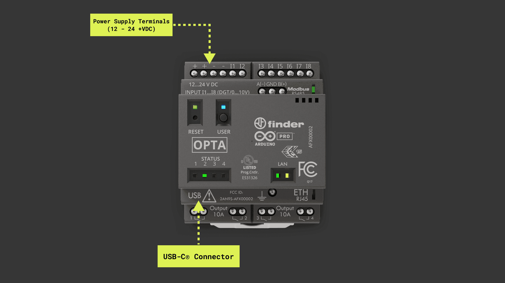

### Hello World Example

Let's program Opta™ with the classic `hello world` example used in the Arduino ecosystem: the `Blink` sketch. We will use this example to verify the board's connection to the Arduino IDE and that the Opta™ core and device are working as expected.

There are two ways to program this example in the device:

- Navigate to **File > Examples > 01.Basics > Blink**.
- Copy and paste the code below into a new sketch in the Arduino IDE.

```arduino
void setup() {
  // Initialize LED_BUILTIN as an output
  pinMode(LED_BUILTIN, OUTPUT);
}

void loop() {
  // Turn the LED_BUILTIN ON
  digitalWrite(LED_BUILTIN, HIGH);
  delay(1000);
  // Turn the user LED_BUILTIN OFF
  digitalWrite(LED_BUILTIN, LOW);
  delay(1000);
}
```

***For all Opta™ variants, the `LED_BUILTIN` macro represents the green LED on top of the device's RESET button.***

To upload the code to your Opta™ device, click the **Verify** button to compile the sketch and check for errors; then click the **Upload** button to program the device with the sketch.

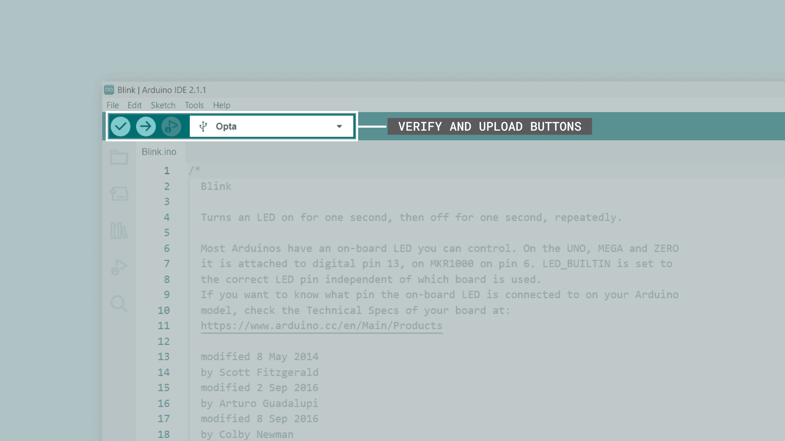

You should see the green LED on top of your device's `RESET` button turn on for one second, then off for one second, repeatedly. 


## USB®-C Port

Opta™ has an **onboard USB®-C port** that can be used for programming the device's microcontroller and for data logging with mass storage devices such as USB memory sticks. 

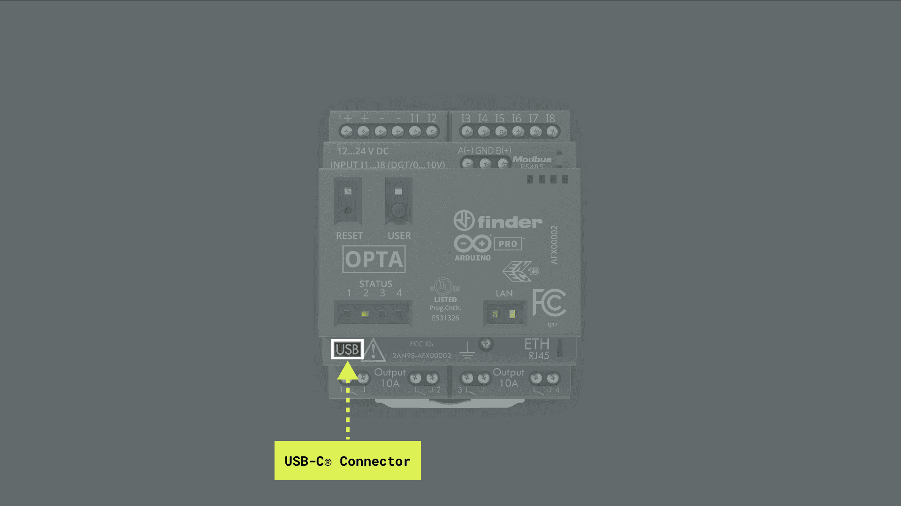

***Opta's USB®-C port shall be used only for programming or data logging. This port does not power Opta's output relays.***

## Electrical Terminals

This user manual section covers Opta's electrical terminals, showing their main hardware and software characteristics. Opta™ has 12 electrical terminals, four of which can be used for the power supply of the device, and eight of them can be used as digital/analog inputs.

### Wiring Specifications

Following Opta's wiring specifications is important to ensure proper connection and operation of its electrical terminals. The tables shown below provide recommendations for torque application, cable preparation, and accepted wire types of Opta's electrical terminals. 

#### Recommended Torque and Cable Preparation

| **Torque** |     **Recommended Tool**     | **Stripping Length** |
|:----------:|:----------------------------:|:--------------------:|
|  0.80 Nm  | #1 Phillips-head screwdriver |         9 mm         |

#### Accepted Wire Types

|    **Wire Type**   | **Minimum Size** |           **Maximum Size**          |
|:------------------:|:----------------:|:-----------------------------------:|
|   Solid Conductor  | 0.5 mm² (20 AWG) |  6 mm² (10 AWG)/2x4 mm² (2x12 AWG)  |
| Stranded Conductor | 0.5 mm² (20 AWG) | 4 mm² (12 AWG)/2x2.5 mm² (2x14 AWG) |

### Power Supply

As shown in the image below, the first four terminals, from left to right, are Opta's power supply terminals; two are marked with `+` signs and two with `-` signs. An external +12 VDC to +24 VDC power supply can be connected to these terminals. 

Opta's maximum power consumption at +12 VDC is 2 W, and at +24 VDC is 2.2 W.

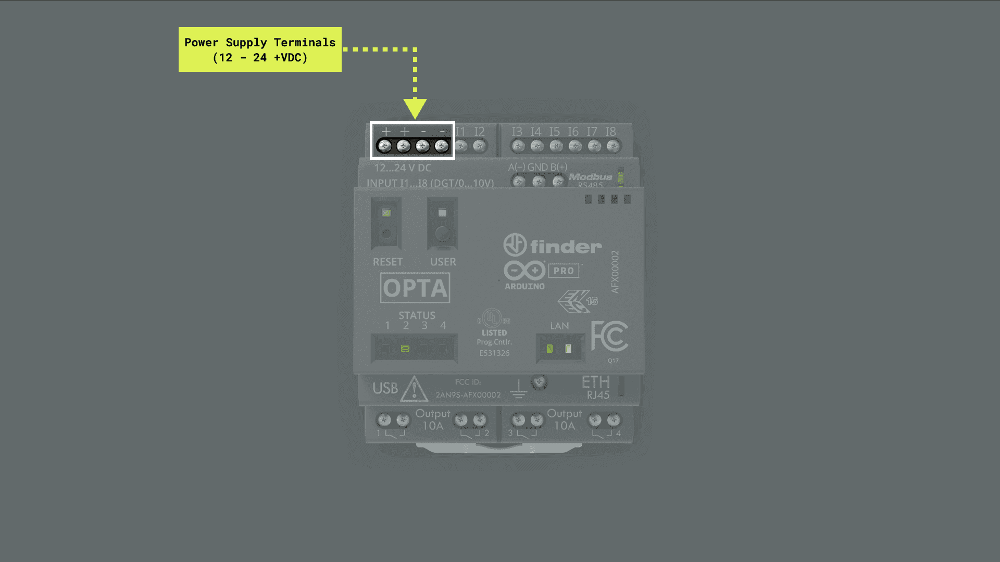

***For use with Opta™ devices, we recommend the official Finder 78.12.1.230.2400 power supply. This power supply was designed to provide stable +24 VDC despite consistently fluctuating current draw.***

### Programmable Inputs

The image below shows Opta™ devices have **eight digital/analog programmable inputs** accessible through terminals `I1`, `I2`, `I3`, `I4`, `I5`, `I6`, `I7`, and `I8`. 

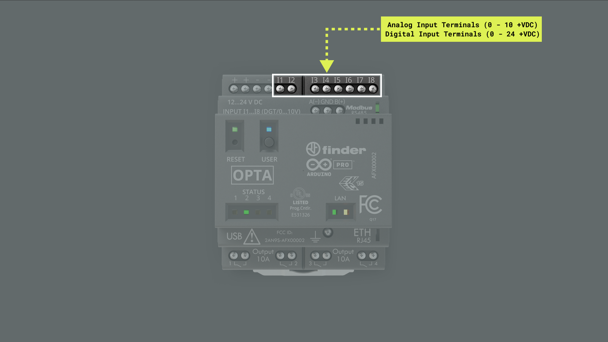

***The Opta™ digital inputs also support 0 to +10 VDC logic level sensors.***

Digital/analog input terminals are mapped as described in the following table:

| **Opta™ Terminal** | **Arduino Pin Mapping** |
|:------------------:|:-----------------------:|
|        `I1`        |      `A0`/`PIN_A0`      |
|        `I2`        |      `A1`/`PIN_A1`      |
|        `I3`        |      `A2`/`PIN_A2`      |
|        `I4`        |      `A3`/`PIN_A3`      |
|        `I5`        |      `A4`/`PIN_A4`      |
|        `I6`        |      `A5`/`PIN_A5`      |
|        `I7`        |      `A6`/`PIN_A6`      |
|        `I8`        |      `A7`/`PIN_A7`      |

#### Digital Inputs
<br></br>

The input voltage range for each digital input terminal is the following:

- **Input voltage range**: 0 to +24 VDC

***The Opta™ digital inputs also support 0 to +10 VDC logic level sensors.***

The input terminals can be used through the built-in functions of the [Arduino programming language](https://www.arduino.cc/reference/en/). To use the input terminals as digital inputs:

- Add the `pinMode(pinName, INPUT)` instruction in your sketch's `setup()` function.

The sketch below shows how to monitor digital states on Opta's input terminals `I1`, `I2`, and `I3`. It initializes a serial connection, takes readings from each defined terminal, and interprets them as either `HIGH` or `LOW` digital states. These states are then output through the Arduino IDE's Serial Monitor. The state readings are looped every second, allowing you to monitor real-time changes.

```arduino
/**
  Opta's Digital Input Terminals
  Name: opta_digital_inputs_example.ino
  Purpose: This sketch demonstrates the use of I1, I2, and I3 input
  terminals as digital inputs on Opta.

  @author Arduino PRO Content Team
  @version 2.0 23/07/23
*/

// Array of terminals.
const int TERMINALS[] = {A0, A1, A2};

// Number of terminals.
const int NUM_PINS = 3;

void setup() {
  // Initialize serial communication at 9600 bits per second.
  Serial.begin(9600);

  // Set the mode of the pins as digital inputs.
  for (int i = 0; i < NUM_PINS; i++) {
    pinMode(TERMINALS[i], INPUT);
  }
}

void loop() {
  // Loop through each of the terminal, read the terminal digital value, and print the result.
  for (int i = 0; i < NUM_PINS; i++) {
    readAndPrint(TERMINALS[i], i + 1);
  }

  // Delay for a second before reading the terminals again.
  delay(1000);
}

// This function reads the digital value from the specified pin and prints the result.
void readAndPrint(int terminal, int terminalNumber) {
  // Read the input value from the digital pin.
  int terminalValue = digitalRead(terminal);
  
  // Print the terminal value.
  Serial.print("I");
  Serial.print(terminalNumber);
  Serial.print(" value: ");
  Serial.println(terminalValue);
}
```

#### Analog Inputs
<br></br>

The input voltage range for each analog input terminal is the following:

- **Input voltage range**: 0 to +10 VDC

The analog input terminals can be used through the built-in functions of the [Arduino programming language](https://www.arduino.cc/reference/en/). To use the input terminals as analog inputs:

- Add the `analogReadResolution()` instruction in your sketch's `setup()` function.

The sketch below shows how to monitor analog voltages on Opta's input terminals `I1`, `I2`, and `I3`. It initializes a serial connection, takes readings from each defined terminal, converts those readings into voltage based on a 12-bit resolution, and outputs these voltage values through the Arduino IDE's Serial Monitor. The readings are looped every second, allowing you to monitor real-time changes.

```arduino
/**
  Opta's Analog Input Terminals
  Name: opta_analog_inputs_example.ino
  Purpose: This sketch demonstrates the use of I1, I2, and I3 input 
  terminals as analog inputs on Opta.

  @author Arduino PRO Content Team
  @version 2.0 22/07/23
*/

// Define constants for voltage, resolution, and divider.
const float VOLTAGE_MAX   = 3.3;      // Maximum voltage that can be read
const float RESOLUTION    = 4095.0;   // 12-bit resolution
const float DIVIDER       = 0.3034;      // Voltage divider

// Array of terminals.
const int TERMINALS[] = {A0, A1, A2};

// Number of terminals.
const int NUM_PINS = 3;

void setup() {
  // Initialize serial communication at 9600 bits per second.
  Serial.begin(9600);

  // Enable analog inputs on Opta
  // Set the resolution of the ADC to 12 bits.
  analogReadResolution(12);
}

void loop() {
  // Loop through each of the terminal, read the terminal analog value, convert it to voltage, and print the result.
  for (int i = 0; i < NUM_PINS; i++) {
    readAndPrint(TERMINALS[i], i + 1);
  }

  // Delay for a second before reading the terminals again.
  delay(1000);
}

// This function reads the value from the specified pin, converts it to voltage, and prints the result.
void readAndPrint(int terminal, int terminalNumber) {
  // Read the input value from the analog pin.
  int terminalValue = analogRead(terminal);

  // Convert the terminal value to its corresponding voltage. 
  float voltage = terminalValue * (VOLTAGE_MAX / RESOLUTION) / DIVIDER;

  // Print the terminal value and its corresponding voltage.
  Serial.print("I");
  Serial.print(terminalNumber);
  Serial.print(" value: ");
  Serial.print(terminalValue);
  Serial.print(" corresponding to ");
  Serial.print(voltage, 5);
  Serial.println(" VDC");
}
```

## LEDs

Opta™ Lite and Opta™ RS485 devices have **four user-programmable LEDs**, and **Opta™ WiFi devices have an extra one**. 

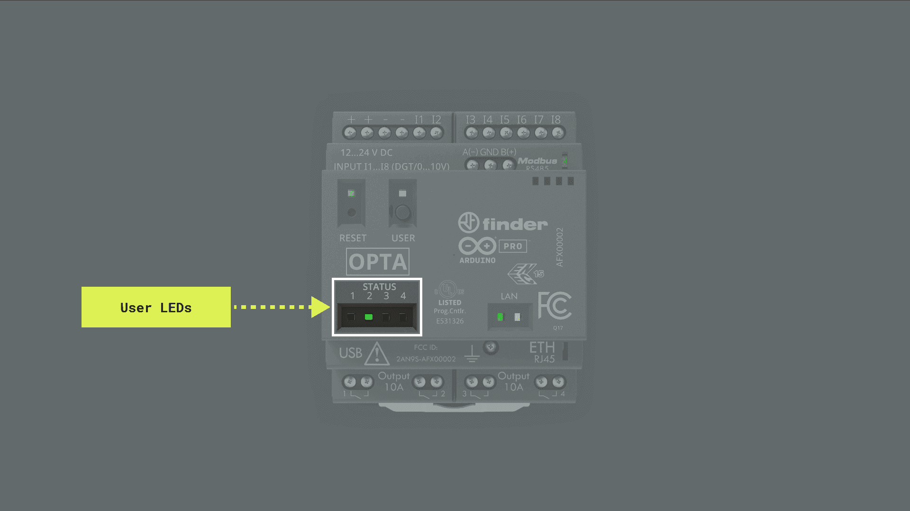

User-programmable LEDs are mapped as described in the following table:

|     **Opta™ User LED**     | **Arduino Pin Mapping** |
|:--------------------------:|:-----------------------:|
|         `STATUS 1`         |  `LED_D0`/`LED_RELAY1`  |
|         `STATUS 2`         |  `LED_D1`/`LED_RELAY2`  |
|         `STATUS 3`         |  `LED_D2`/`LED_RELAY3`  |
|         `STATUS 4`         |  `LED_D3`/`LED_RELAY4`  |
| `USER` (WiFi variant only) |    `LED_USER`/`LEDB`    |
|    `RESET` (Green color)   |  `LED_BUILTIN`/`LEDG`   |
|    `RESET` (Red color)     |         `LEDR`          |

The sketch below shows how to create a Knight Rider-style "scanning" effect using Opta™s user LEDs. It works by sequentially lighting up each user's LED, creating a visual effect of scanning back and forth. This effect is achieved by defining an array of the user LED identifiers and using loops to cycle through these identifiers, turning each user LED on and off in sequence.

```arduino
/**
  Opta's Knight Rider Scanning Effect
  Name: opta_knight_rider_example.ino
  Purpose: This sketch demonstrates a Knight Rider scanning effect using 
  the user LEDs of Opta devices.


  @author Arduino PRO Content Team
  @version 2.0 22/07/23
*/

// Define an array to hold the pin numbers for Opta's user LEDs.
const int USER_LEDS[] = {LED_D0, LED_D1, LED_D2, LED_D3};

// Number of Opta's user LEDs
const int NUM_LEDS = 4;

void setup() {
  // Set the mode for each user LED to OUTPUT.
  for (int i = 0; i < NUM_LEDS; i++) {
    pinMode(USER_LEDS[i], OUTPUT);
  }
}

void loop() {
  // Scan from the first LED to the last.
  for (int i = 0; i < NUM_LEDS; i++) {
    // Turn on the LED.
    // Wait for 50 milliseconds.
    digitalWrite(USER_LEDS[i], HIGH); 
    delay(50); 
    // Turn off the LED.
    // Wait for 50 milliseconds.
    digitalWrite(USER_LEDS[i], LOW); 
    delay(50); 
  }
  
  // Scan back from the last LED to the first.
  for (int i = NUM_LEDS - 1; i >= 0; i--) {
    // Turn on the LED.
    // Wait for 50 milliseconds.
    digitalWrite(USER_LEDS[i], HIGH); 
    delay(50); 
    // Turn off the LED.
    // Wait for 50 milliseconds.
    digitalWrite(USER_LEDS[i], LOW); 
    delay(50); 
  }
}
```

You should see a Knight Rider-style "scanning" effect with Opta's user LEDs.


You also have another user-programmable LED located on top of the RESET button of the device; this green user LED is represented with the `LED_BUILTIN` macro and it is available in all Opta™ variants. 

***The USER LED located above the USER BUTTON is only available on Opta™ WiFi (AFX00002).***

The blink code that uses the green `LED_BUILTIN` LED is shown below:

```arduino
void setup() {
  // Initialize LED_BUILTIN as an output
  pinMode(LED_BUILTIN, OUTPUT);
}

void loop() {
  // Turn the LED_BUILTIN ON
  digitalWrite(LED_BUILTIN, HIGH);
  delay(1000);
  // Turn the user LED_BUILTIN OFF
  digitalWrite(LED_BUILTIN, LOW);
  delay(1000);
}
```

You should see the green LED on top of your device's RESET button turn on for one second, then off for one second, repeatedly. 


## User Button

All Opta™ variants devices have an onboard user-programmable button; this user button is mapped as `BTN_USER` in the Opta™ core. The user button has an internal pull-up resistor, meaning its default value (while not being pressed) is `HIGH`.

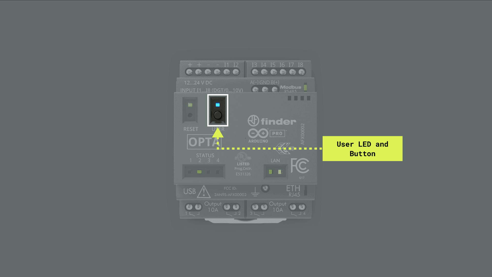

The user-programmable button can be used through the built-in functions of the Arduino programming language.

To use the user button, first define it as a digital input:

- Add the `pinMode(BTN_USER, INPUT)` instruction in your sketch's `setup()` function.

To read the status of the user button:

- Add the `digitalRead(BTN_USER)` instruction in your sketch.

The sketch below shows how to use Opta's programmable user button to control the sequence of status LEDs, `D0` to `D3`. 


```arduino
/**
  Opta's User Button Example
  Name: opta_user_button_example.ino
  Purpose: Configures Opta's user-programmable button to control the user LEDs.
  This example includes debouncing for the user button.

  @author Arduino PRO Content Team
  @version 2.0 23/07/23
*/

// Current and previous state of the button.
int buttonState     = 0;
int lastButtonState = 0;

// Counter to keep track of the LED sequence.
int counter = 0;

// Variables to implement button debouncing.
unsigned long lastDebounceTime  = 0;
unsigned long debounceDelay     = 50; // In ms

// Array to store LED pins.
int LEDS[] = {LED_D0, LED_D1, LED_D2, LED_D3};
int NUM_LEDS = 4;

void setup() {
  // Initialize Opta user LEDs.
  for(int i = 0; i < NUM_LEDS; i++) {
    pinMode(LEDS[i], OUTPUT);
  }
  pinMode(BTN_USER, INPUT);
}

void loop() {
  int reading = digitalRead(BTN_USER);
  
  // Check if button state has changed.
  if (reading != lastButtonState) {
    lastDebounceTime = millis();
  }

  // Debouncing routine.
  if ((millis() - lastDebounceTime) > debounceDelay) {
    if (reading != buttonState) {
      buttonState = reading;

      // Only increment the counter if the new button state is HIGH.
      if (buttonState == HIGH) {
        if(counter < NUM_LEDS){
          counter++;
        }
        else{
          counter = 0;
        }
      }
    }
  }

  // Save the current state as the last state, for next time through the loop.
  lastButtonState = reading;
  
  // Control LED states.
  changeLights();
}

/**
  Control the status LEDs based on a counter value.
  Turns off all LEDs first, then turns on the LED 
  corresponding to the current counter value.

  @param None.
*/
void changeLights() {
  // Turn off all user LEDs.
  for(int i = 0; i < NUM_LEDS; i++) {
    digitalWrite(LEDS[i], LOW);
  }

  // Turn on the selected user LED.
  if(counter > 0) {
    digitalWrite(LEDS[counter - 1], HIGH);
  }
}
```

The sketch initializes the state of the user's LEDs and button, along with variables for button debouncing. This sketch continuously reads the state of the user button, debounces the button input to avoid false triggering due to electrical noise, and increments a counter each time the button is pressed. It then passes the control to the `changeLights()` function. This function first turns off all LEDs and then, depending on the value of the counter, turns on the corresponding LED. With each button press, the counter increments, and a different LED lights up, cycling back to the beginning after the final LED.


You should now be able to control the status LED sequence by pressing Opta's programmable user button.


## Relays

Opta™ devices (all variants) have four **Normally Open (NO)** 10 A relays capable of actuating on loads at a rated voltage of 250 VAC and up to a maximum switching voltage of 400 VAC.


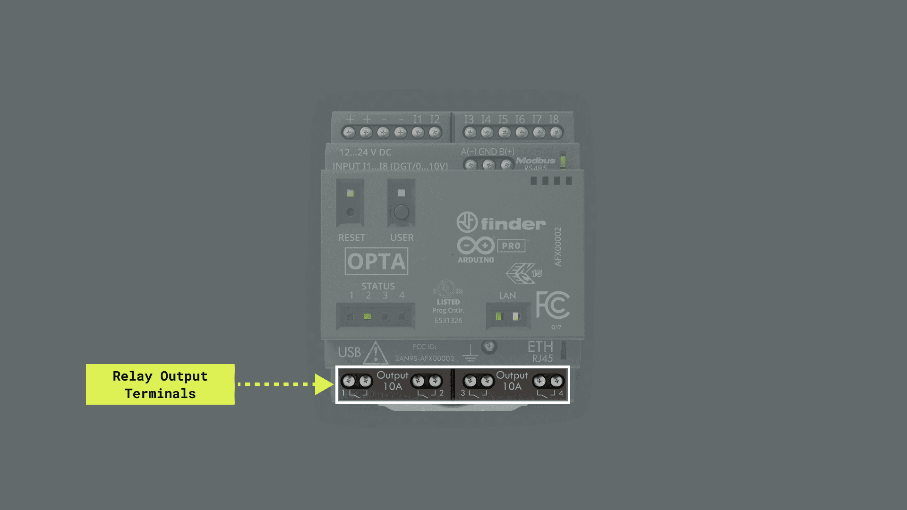

User-programmable relay outputs are mapped as described in the following table:

| **Opta™ Relay Output** | **Arduino Pin Mapping** |
|:----------------------:|:-----------------------:|
|       `OUTPUT 1`       |      `D0`/`RELAY1`      |
|       `OUTPUT 2`       |      `D1`/`RELAY2`      |
|       `OUTPUT 3`       |      `D2`/`RELAY3`      |
|       `OUTPUT 4`       |      `D3`/`RELAY4`      |

The output relays can be used through the built-in functions of the Arduino programming language. To use an output relay as a digital output:

- Add the `pinMode(relayOutput, OUTPUT)` instruction in your sketch's `setup()` function. 
  
To change the status of the output relay (`LOW` or `HIGH`):

- Add your sketch's `digitalWrite(relayOutput, LOW)` or `digitalWrite(relayOutput, HIGH)` instruction.

The sketch below tests the output relays and status LEDs of an Opta™ device. The sketch initializes the relay outputs and user LEDs as outputs; then, the sketch turns each output relay and its corresponding status LED on and off in sequence, with a one-second delay between each state change. This allows us to visually verify the correct functioning of the output relays and user LEDs.

```arduino
/*
  Opta's Output Relays 
  Name: opta_outputs_relays_example.ino
  Purpose: This sketch tests the output relays of Opta devices.


  @author Arduino PRO Content Team
  @version 2.0 22/07/23
*/

// Arrays of relays and user LEDs
int relayOutputs[] = {D0, D1, D2, D3};
int userLeds[] = {LED_D0, LED_D1, LED_D2, LED_D3};

// Compute the number of relays/LEDs based on the size of the relayPins array
int numRelays = 4;

void setup() {
  for(int i = 0; i < numRelays; i++) {
    // Sets the mode of the relays and user LEDs as outputs
    pinMode(relayOutputs[i], OUTPUT); 
    pinMode(userLeds[i], OUTPUT); 
  }
}

void loop() {
  // For each relay/user LED: turn it on, wait for a second, turn it off, wait for another second
  for(int i = 0; i < numRelays; i++) {
    digitalWrite(relayOutputs[i], HIGH); 
    digitalWrite(userLeds[i], HIGH);
    delay(1000);
    digitalWrite(relayOutputs[i], LOW);
    digitalWrite(userLeds[i], LOW);
    delay(1000);
  }
}
```

## Communication

This user manual section covers the different communication interfaces and protocols supported by Opta™ devices, including the Ethernet, RS-485, Modbus, Wi-Fi®, and Bluetooth®.

### Ethernet

Opta™ devices (all variants) feature an onboard low-power 10BASE-T/100BASE-TX Ethernet physical layer (PHY) transceiver. The transceiver complies with the IEEE 802.3 and 802.3u standards and supports communication with an Ethernet MAC through a standard RMII interface. The Ethernet transceiver is accessible through the onboard RJ45 connector.

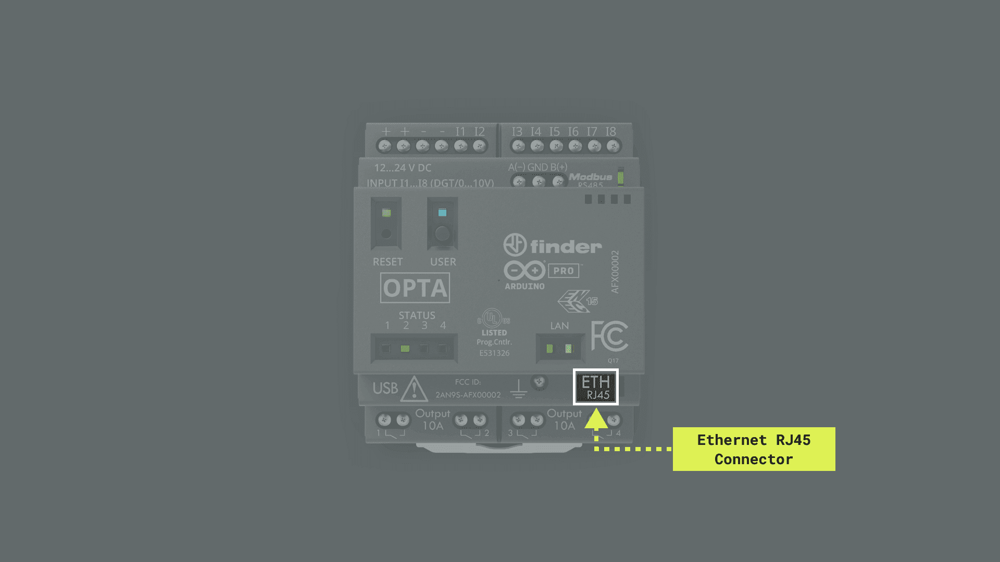

The `Arduino Mbed OS Opta Boards` core has a built-in library that lets you use the onboard Ethernet PHY transceiver right out of the box: the [`Ethernet` library](https://www.arduino.cc/reference/en/libraries/ethernet/). Let's use an example code demonstrating some of the transceiver's capabilities. 

The sketch below enables an Opta™ device to connect to the Internet via an Ethernet connection. Once connected, it performs a `GET` request to the [`ip-api.com`](https://ip-api.com/) service to fetch details about the device's IP address. It then parses the received JSON object using the [`Arduino_JSON` library](https://github.com/arduino-libraries/Arduino_JSON) to extract key IP details: IP address, city, region, and country. This data is then printed to the Arduino IDE's Serial Monitor.

```arduino
/**
  Web Client (Ethernet version)
  Name: opta_ethernet_web_client.ino
  Purpose: This sketch connects an Opta device to ip-api.com via Ethernet
  and fetches IP details for the device.

  @author Arduino PRO Content Team
  @version 2.0 15/08/23
*/

// Include the necessary libraries.
#include <Ethernet.h>
#include <Arduino_JSON.h>

// Server address for ip-api.com.
const char* server = "ip-api.com";

// API endpoint path to get IP details in JSON format.
String path = "/json/";

// Static IP configuration for the Opta device.
IPAddress ip(10, 130, 22, 84);

// Ethernet client instance for the communication.
EthernetClient client;

// JSON variable to store and process the fetched data.
JSONVar doc;

// Variable to ensure we fetch data only once.
bool dataFetched = false;

void setup() {
  // Begin serial communication at a baud rate of 115200.
  Serial.begin(115200);

  // Wait for the serial port to connect,
  // This is necessary for boards that have native USB.
  while (!Serial);

  // Attempt to start Ethernet connection via DHCP,
  // If DHCP failed, print a diagnostic message.
  if (Ethernet.begin() == 0) {
    Serial.println("- Failed to configure Ethernet using DHCP!");

    // Try to configure Ethernet with the predefined static IP address.
    Ethernet.begin(ip);
  }
  delay(2000);
}

void loop() {
  // Ensure we haven't fetched data already,
  // ensure the Ethernet link is active,
  // establish a connection to the server,
  // compose and send the HTTP GET request.
  if (!dataFetched) {
    if (Ethernet.linkStatus() == LinkON) {
      if (client.connect(server, 80)) {
        client.print("GET ");
        client.print(path);
        client.println(" HTTP/1.1");
        client.print("Host: ");
        client.println(server);
        client.println("Connection: close");
        client.println();

        // Wait and skip the HTTP headers to get to the JSON data.
        char endOfHeaders[] = "\r\n\r\n";
        client.find(endOfHeaders);

        // Read and parse the JSON response.
        String payload = client.readString();
        doc = JSON.parse(payload);

        // Check if the parsing was successful.
        if (JSON.typeof(doc) == "undefined") {
          Serial.println("- Parsing failed!");
          return;
        }

        // Extract and print the IP details.
        Serial.println("*** IP Details:");
        Serial.print("- IP Address: ");
        Serial.println((const char*)doc["query"]);
        Serial.print("- City: ");
        Serial.println((const char*)doc["city"]);
        Serial.print("- Region: ");
        Serial.println((const char*)doc["regionName"]);
        Serial.print("- Country: ");
        Serial.println((const char*)doc["country"]);
        Serial.println("");

        // Mark data as fetched.
        dataFetched = true;
      }
      // Close the client connection once done.
      client.stop();
    } else {
      Serial.println("- Ethernet link disconnected!");
    }
  }
}
```

The sketch includes the `Ethernet` and `Arduino_JSON` libraries, essential for Ethernet and JSON handling functionality. In the `setup()` function, serial communication is initiated for debugging and output. Instead of DHCP, the Ethernet connection uses a predefined static IP address.

Once the Ethernet connection runs, the sketch connects to the `ip-api.com` service, utilizing the HTTP protocol. Specifically, an `HTTP GET` request is crafted to retrieve details about the device's IP address, including its city, region, and country. If the connection to the server fails, the sketch will output an error message to the Arduino IDE's Serial Monitor for troubleshooting.

Within the `loop()` function, an `HTTP GET` request is sent to the `ip-api.com` service once. The sketch then waits for and skips the response's HTTP headers, parsing the following JSON payload.

Key IP details such as IP address, city, region, and country are extracted and then displayed in the IDE's Serial Monitor using the parsed data. If the Ethernet link happens to be disconnected, a corresponding message is printed to the Serial Monitor. Should the JSON parsing fail, an error message is showcased on the IDE's Serial Monitor, prompting the sketch to exit the current iteration of the `loop()` function immediately.

You should see the following output in the Arduino IDE's Serial Monitor:

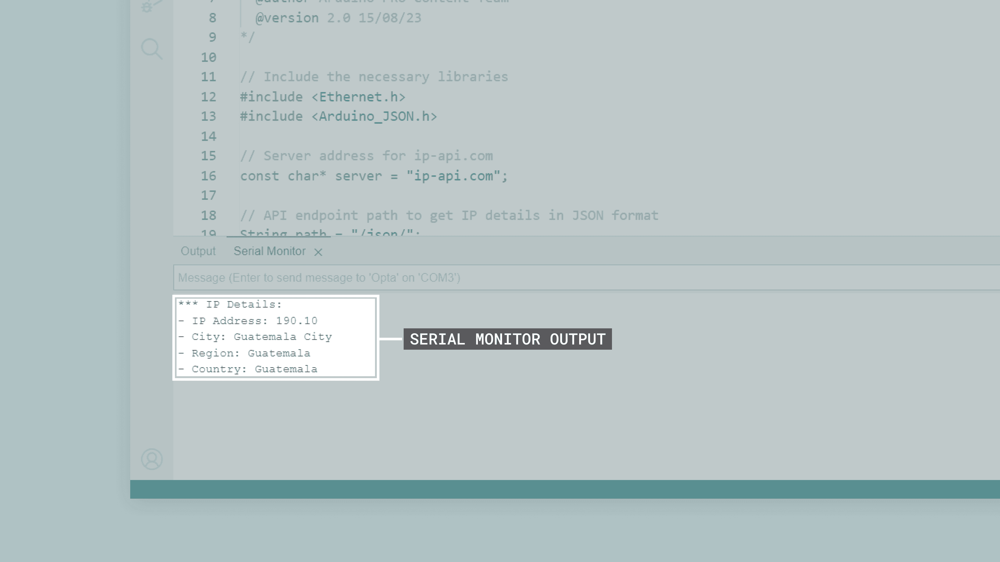

You can download the example code [here](assets/opta_ethernet_web_client.zip).

The Media Access Control (MAC) address is essential for computer networking and devices with Internet of Things (IoT) capabilities, such as the Opta™. To learn more into-depth about how to retrieve the MAC address of an Opta™ device using the Arduino ecosystem tools, check out the following tutorial:

- [Retrieve the Opta™ MAC Address](https://docs.arduino.cc/tutorials/opta/mac-address)

### RS-485

Opta™ RS485 and WiFi variants have a built-in RS-485 interface, enabling the construction of robust and reliable data transmission systems. RS-485 interface is still the most widely used protocol for Point Of Sale (POS), industrial, and telecommunications applications. The wide common-mode range enables data transmission over longer cable lengths and in noisy environments such as the floor of a factory. Also, the high input impedance of the receivers allows more devices to be attached to the lines.

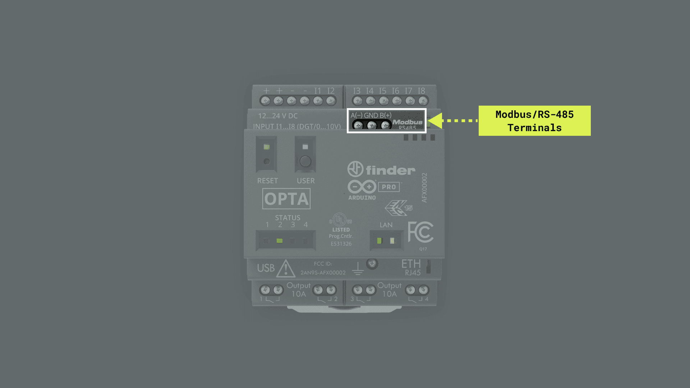

***The Opta™ RS485 and WiFi variants' RS-485 interface operates in a half-duplex mode. This means it can send or receive data at any given time, but not simultaneously.***


RS-485 data lines in Opta™ RS485 and Opta™ WiFi variants are labeled as described in the following table:

| **EIA-485 Specification Labels** | **Opta™ Labels** |
|:--------------------------------:|:----------------:|
|                `A`               |      `A(-)`      |
|                `B`               |      `B(+)`      |

***RS-485 data lines labels differ between manufacturers. Most manufacturers will use `+` and `–` to label the data lines or variations such as `D+` and `D-`. Some manufacturers will label inputs as A and B but get the polarity backward, so A is positive and B negative. Although predicting how other manufacturers will mark these lines is impossible, practical experience suggests that the `-` line should be connected to the A terminal, and the `+` line should be connected to the B terminal. Reversing the polarity will not damage an RS-485 device but will not communicate.***


To enable communication on Opta™ devices via its RS-485 interface, you can use the [`ArduinoRS485` library](https://www.arduino.cc/reference/en/libraries/arduinors485/). Let's use an example code demonstrating some of its RS-485 capabilities. Here is an example of using the `ArduinoRS485` library to transmit messages via the RS-485 interface on an Opta™ device.

```arduino
/*
  Opta's Basic RS-485 Communication

  Name: opta_basic_rs485_example.ino
  Purpose: This sketch tests the RS-485 interface of 
  Opta RS485 and Opta WiFi devices.

  @author Arduino PRO Content Team
  @version 2.0 22/07/23
*/
#include <ArduinoRS485.h>

// Set the baudrate to be used by the RS-485 interface.
constexpr auto baudrate { 115200 };

/**
  Configure the RS-485 interface. It initializes the
  interface with the specified baud rate and explicitly 
  disables data reception to avoid potential data 
  collision in this half-duplex communication standard.

  @param baudrate (int)
*/
void configureRS485(const int baudrate) {
    const auto bitduration { 1.f / baudrate };
    const auto wordlen { 9.6f }; // Or 10.0f depending on the channel configuration
    const auto preDelayBR { bitduration * wordlen * 3.5f * 1e6 };
    const auto postDelayBR { bitduration * wordlen * 3.5f * 1e6 }

    RS485.begin(baudrate);
    RS485.setDelays(preDelayBR, postDelayBR);
    RS485.noReceive();
}

/**
  Send a text message through the RS485 interface. Writes 
  the intended message to the transmission buffer, appends
  carriage return and newline characters for message 
  termination, and finally ends the transmission. 

  @param message (char)
*/
size_t printlnRS485(char* message) {
    RS485.beginTransmission();
    auto len = strlen(message);
    RS485.write(message, len);
    RS485.write('\r');
    RS485.write('\n');
    RS485.endTransmission();
}

void setup() {
    configureRS485(baudrate);
    printlnRS485("- RS-485 interface configured!");
}

void loop() {
    delay(2000);
    // Wait for two seconds and then sends a test message via the RS485 interface.
    printlnRS485("- This is a message transmitted via RS-485!");
}
```

The sketch starts with the `configureRS485()` function, which initializes the RS-485 interface with the defined baud rate and turns off data receiving. The `printlnRS485()` function handles the transmission of text messages. It starts the transmission, sends the message followed by a carriage return and newline character, and ends the transmission. The `setup()` function calls the `configureRS485()` function to configure the RS-485 interface and then sends a confirmation message. The `loop()` function repeatedly sends a message every two seconds using the `printlnRS485()` function.

To learn more into-depth about the RS-485 interface in Opta™ devices, check out the following tutorial:

- [Getting Started with RS-485 on Opta™](https://docs.arduino.cc/tutorials/opta/getting-started-with-rs485)

### Modbus (RTU/TCP)

Opta™ RS485 and WiFi variants incorporate a built-in Modbus interface, enabling the implementation of robust and reliable data transmission systems. Modbus, in its RTU version that utilizes RS-485 serial transmission or in its TCP version that operates over Ethernet, remains one of the most widely used protocols for industrial automation applications, building management systems, and process control, among others.


Modbus RTU, generally operating in half-duplex mode, with its capability to handle noisy and long-distance transmission lines, makes it an excellent choice for industrial environments. Modbus RTU communication is supported using the Arduino Opta's RS-485 physical interface. 

***Opta™ does not have internal terminator resistors, so they must be added following the Modbus protocol specification if necessary.***


Modbus TCP, taking advantage of Ethernet connectivity, allows easy integration with existing computer networks and facilitates data communication over long distances using the existing network infrastructure. It operates in full-duplex mode, allowing simultaneous sending and receiving of data.

The many nodes connected in a Modbus network, whether RTU or TCP, allow high flexibility and scalability in constructing automation and control systems.

To learn more about the Modbus interface in Opta™ devices, check out the following tutorials and application notes:

- [Getting Started with Modbus RTU on Opta™](https://docs.arduino.cc/tutorials/opta/getting-started-with-modbus-rtu)
- [Modbus TCP On Opta™ Using PLC IDE](https://docs.arduino.cc/tutorials/opta/opta-modbus-tcp-plc-ide)
- [Tank Level Monitoring with the Opta™](https://docs.arduino.cc/tutorials/opta/tank-level-app-note)
- [Tank Thermoregulation with Portenta Machine Control & Opta™](https://docs.arduino.cc/tutorials/opta/pmc-opta-temp-ctrl)
- [Energy Management with Opta™](https://docs.arduino.cc/tutorials/opta/energy-management-application-note)

### Wi-Fi®

Opta™ WiFi variant devices feature an onboard Wi-Fi® module that provides seamless wireless connectivity, allowing Opta™ to connect to Wi-Fi® networks and interact with other devices over-the-air (OTA).

Some of the key capabilities of Opta™'s onboard Wi-Fi® module are the following:

- **Wireless connectivity**: The onboard Wi-Fi® module supports IEEE 802.11b/g/n Wi-Fi® standards, enabling devices to establish reliable and high-speed wireless connections to access the Internet and communicate with other devices.
- **Secure communication**: The onboard module incorporates various security protocols such as WEP, WPA, WPA2, and WPA3, ensuring robust data encryption and protection against unauthorized access during wireless communication.
- **Onboard antenna**: Opta™ WiFi devices feature an onboard  Wi-Fi® antenna specifically designed, matched, and certified for the onboard Wi-Fi® module requirements.

The `Arduino Mbed OS Opta Boards` core has a built-in library that lets you use the onboard Wi-Fi® module right out of the box: the [`WiFi` library](https://www.arduino.cc/reference/en/libraries/wifi/). Let's walk through an example code demonstrating some of the module's capabilities.

The sketch below enables an Opta™ device to connect to the Internet via Wi-Fi® (like the Ethernet example). Once connected, it performs a `GET` request to the [`ip-api.com`](https://ip-api.com/) server to fetch details related to its IP address. It then parses the received JSON object using the [`Arduino_JSON` library](https://github.com/arduino-libraries/Arduino_JSON) to extract key IP details: IP address, city, region, and country. This data is then printed to the Arduino IDE's Serial Monitor.

You need to create first a header file named `arduino_secrets.h` to store your Wi-Fi® network credentials. To do this, add a new tab by clicking the ellipsis (the three horizontal dots) button on the top right of the Arduino IDE 2.

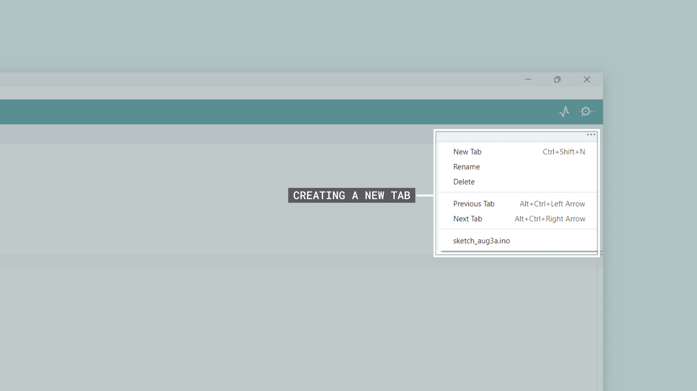


Put `arduino_secrets.h` as the "Name for new file" and enter the following code on the header file:

```arduino
char ssid[] = "SECRET_SSID"; // Your network SSID (name)
char password[] = "SECRET_PASS"; // Your network password (use for WPA, or use as key for WEP)
```

Replace `SECRET_SSID` with the name of your Wi-Fi® network and `SECRET_PASS` with the password of it and save the project. The example code is as follows: 

```arduino
/**
  WiFi Web Client
  Name: opta_wifi_web_client.ino
  Purpose: This sketch connects an Opta device to ip-api.com via WiFi
  and fetches IP details.

  @author Arduino PRO Content Team
  @version 2.2 16/08/23
*/

#include <WiFi.h>
#include <Arduino_JSON.h>

// Wi-Fi network details.
const char* ssid     = "YOUR_SSID";
const char* password = "YOUR_PASSWORD";

// Server address for ip-api.com.
const char* server = "ip-api.com";

// API endpoint path to get IP details in JSON format.
String path = "/json";

// Wi-Fi client instance for the communication.
WiFiClient client;

// JSON variable to store and process the fetched data.
JSONVar doc;

// Variable to ensure we fetch data only once.
bool dataFetched = false;

void setup() {
  // Begin serial communication at a baud rate of 115200.
  Serial.begin(115200);

  // Wait for the serial port to connect,
  // This is necessary for boards that have native USB.
  while (!Serial);

  // Start the Wi-Fi connection using the provided SSID and password.
  Serial.print("- Connecting to ");
  Serial.println(ssid);
  WiFi.begin(ssid, password);

  while (WiFi.status() != WL_CONNECTED) {
    delay(1000);
    Serial.print(".");
  }

  Serial.println();
  Serial.println("- Wi-Fi connected!");
  Serial.print("- IP address: ");
  Serial.println(WiFi.localIP());
}

void loop() {
  // Check if the IP details have been fetched.
  // If not, call the function to fetch IP details,
  // Set the flag to true after fetching.
  if (!dataFetched) {
    fetchIPDetails();
    dataFetched = true;
  }
}

/**
  Fetch IP details from defined server

  @param none
  @return IP details
*/
void fetchIPDetails() {
  if (client.connect(server, 80)) {
    // Compose and send the HTTP GET request.
    client.print("GET ");
    client.print(path);
    client.println(" HTTP/1.1");
    client.print("Host: ");
    client.println(server);
    client.println("Connection: close");
    client.println();

    // Wait and skip the HTTP headers to get to the JSON data.
    char endOfHeaders[] = "\r\n\r\n";
    client.find(endOfHeaders);

    // Read and parse the JSON response.
    String payload = client.readStringUntil('\n');
    doc = JSON.parse(payload);

    // Check if the parsing was successful. 
    if (JSON.typeof(doc) == "undefined") {
      Serial.println("- Parsing failed!");
      return;
    }

    // Extract and print the IP details.
    Serial.println("*** IP Details:");
    String query = doc["query"];
    Serial.print("- IP Address: ");
    Serial.println(query);
    String city = doc["city"];
    Serial.print("- City: ");
    Serial.println(city);
    String region = doc["regionName"];
    Serial.print("- Region: ");
    Serial.println(region);
    String country = doc["country"];
    Serial.print("- Country: ");
    Serial.println(country);
    Serial.println("");
  } else {
    Serial.println("- Failed to connect to server!");
  }

  // Close the client connection once done. 
  client.stop();
}
```

The sketch includes the `WiFi` and `Arduino_JSON`, which provide the necessary Wi-Fi® and JSON handling functionality. The `setup()` function initiates serial communication for debugging purposes and attempts to connect to a specified Wi-Fi® network. If the connection is not established, the sketch will keep trying until a successful connection is made.

Once the Wi-Fi® connection is established, the sketch is ready to connect to the `ip-api.com` server using the HTTP protocol. Specifically, an `HTTP GET` request is constructed to query details related to its IP address. The `GET` request is sent only once after the Wi-Fi® connection is active.

The `loop()` function is the heart of the sketch. It checks whether the data has been fetched or not. If the data still needs to be fetched, it tries to establish a connection to the server. If the connection is successful, the sketch sends an `HTTP GET` request, skips the HTTP headers of the response, and uses the `JSON.parse()` function from the `Arduino_JSON` library to parse the JSON object from the response. The parsed data extracts key IP details like IP address, city, region, and country, which are then printed to the Arduino IDE's Serial Monitor. Once the data is published, the client is disconnected to free up resources. Suppose the JSON parsing fails for any reason. In that case, an error message is outputted to the Arduino IDE's Serial Monitor, and the sketch immediately exits the current iteration of the `loop()` function.

Since the data is fetched only once, there's no need for repeatedly sending `HTTP GET` requests. After the initial fetch, you should see the details related to the IP address displayed in the Arduino IDE's Serial Monitor:

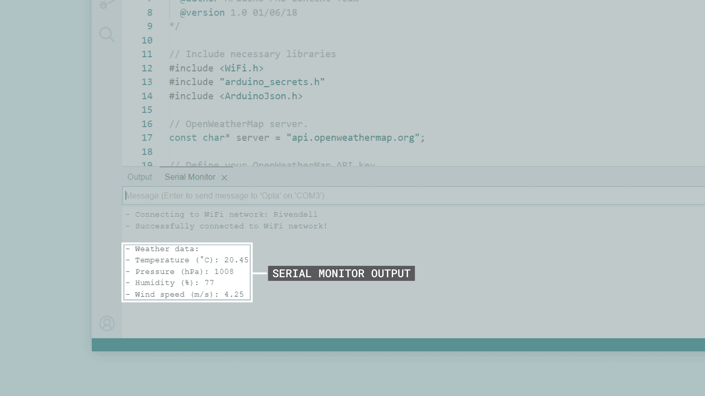

You can download the example code [here](assets/opta_wifi_web_client_example.zip).

The MAC address is essential for computer networking and devices with Internet of Things (IoT) capabilities, such as the Opta™. To learn more into-depth about how to retrieve the MAC address of an Opta™ device using the Arduino ecosystem tools, check out the following tutorial:

- [Retrieve the Opta™ MAC Address](https://docs.arduino.cc/tutorials/opta/mac-address)

### Bluetooth Low Energy®

Opta™ WiFi variant devices feature an onboard Bluetooth Low Energy® module, which supports Bluetooth 5.1 BR/EDR/LE up to 3 Mbps PHY data rate. Bluetooth 4.2 is supported by Arduino firmware.

To enable Bluetooth® communication on Opta™ devices, you can use the [`ArduinoBLE` library](https://www.arduino.cc/reference/en/libraries/arduinoble/). Let's use an example code demonstrating some of its Bluetooth® module's capabilities. Here is an example of using the ArduinoBLE library to create a voltage level monitor application, such as a 0 to 10 VDC sensor. The provided example code demonstrates the creation of a Bluetooth® Low Energy service and the characteristic of voltage values read from one of the analog input terminals of an Opta™ device to a central device, for example, a smartphone.

***You can use the [nRF Connect for Mobile](https://www.nordicsemi.com/Products/Development-tools/nrf-connect-for-mobile) app from Nordic Semiconductor® to test the functionality of the example code shown below. nRF Connect is a powerful tool that allows you to scan and explore Bluetooth Low Energy® devices and communicate with them.***

```arduino
/**
  Opta's Bluetooth Example
  Name: opta_bluetooth_example.ino
  Purpose: Read voltage level from an analog input terminal of an Opta device,
  then maps the voltage reading to a percentage value ranging from 0 to 100.

  @author Arduino PRO Content Team
  @version 1.1 23/07/23
*/

#include <ArduinoBLE.h>

// Define the voltage service and its characteristic.
BLEService voltageService("1101");
BLEUnsignedCharCharacteristic voltageLevelChar("2101", BLERead | BLENotify);

const int TERMINAL = A0;
const long interval = 200; // Delay interval in ms for voltage reading and LED blinking

BLEDevice central;

/**
  Read voltage level from an analog input terminal of an Opta device,
  then maps the voltage reading to a voltage value ranging from 0 to 10 VDC.

  @param none
  @return the voltage value (int).
*/
int readVoltageLevel() {
  int voltage = analogRead(TERMINAL);
  int voltageLevel = map(voltage, 0, 4095, 0, 10);
  return voltageLevel;
}

void setup() {
  // Initialize LED_USER as an output.
  pinMode(LED_USER, OUTPUT);
  digitalWrite(LED_USER, HIGH);

  // Initialize serial communication at 9600 bits per second.
  Serial.begin(9600);

  // Enable analog inputs on Opta.
  // Set the resolution of the ADC to 12 bits.
  analogReadResolution(12); 

  // Initialize the BLE module.
  if (!BLE.begin()) {
    Serial.println("- Starting BLE failed!");
    while (1); // In case of failure, loop indefinitely.
  }

  // Set the local name and advertised service for the BLE module.
  BLE.setLocalName("VoltageMonitor");
  BLE.setAdvertisedService(voltageService);
  voltageService.addCharacteristic(voltageLevelChar);
  BLE.addService(voltageService);

  // Start advertising the BLE service.
  BLE.advertise();
  Serial.println("- Bluetooth device active, waiting for connections...");
}

void loop() {
  // Get the current time since the Arduino started.
  unsigned long currentMillis = millis();
  
  // Static variables to hold the last time the tasks were performed.
  static unsigned long previousVoltageMillis = 0; // Last time the voltage was read
  static unsigned long previousLEDMillis = 0; // Last time the LED state changed

  // If the interval has passed, update the LED.
  if (currentMillis - previousLEDMillis >= interval) {
    // Save the current time to check against in the next loop iteration.
    previousLEDMillis = currentMillis;

    // Toggle the state of the LED.
    digitalWrite(LED_USER, !digitalRead(LED_USER));
  }

  // If a central device is connected.
  if (central) {
    if (central.connected()) {
      // Set the LED color to solid blue when connected.
      digitalWrite(LED_USER, HIGH);

      // If the interval has passed, update the voltage level.
      if (currentMillis - previousVoltageMillis >= interval) {
        // Save the current time to check against in the next loop iteration.
        previousVoltageMillis = currentMillis;

        // Read the voltage level and update the BLE characteristic with the voltage level value.
        int voltageLevel = readVoltageLevel();

        Serial.print("- Voltage level is: ");
        Serial.println(voltageLevel);
        voltageLevelChar.writeValue(voltageLevel);
      }
    }
    else {
      central = BLE.central();
      if (central) {
        Serial.print("- Connected to device: ");
        Serial.println(central.address());
      }
      else {
        Serial.print("- BLE not connected: ");
        Serial.println(central.address());
      }
    }
  }
  else {
    central = BLE.central();
    if (central) {
      Serial.print("- Connected to device: ");
      Serial.println(central.address());
    }
  }
}
```

After importing the necessary libraries and defining the Bluetooth® Low Energy service and characteristic, the `setup()` function initializes the Opta™ device and sets up the Bluetooth® Low Energy service and characteristic. The sketch then starts advertising the defined service to allow connections.

In the `loop()` function, the sketch constantly checks for a Bluetooth® Low Energy connection. When a central device connects to the device, the Opta's built-in USER LED stays solidly on, and the sketch begins continuously reading the voltage level from an analog input terminal, mapping it to a voltage value between 0 and 10 VDC, and transmitting it to the central device via the defined Bluetooth® Low Energy characteristic. If no central device is connected, the USER LED blinks regularly. The non-blocking approach of the sketch allows simultaneous tasks on it, such as sensor data reading and LED control.

You should be able now to connect to your Opta™ using a central device. The Bluetooth® Low Energy service and characteristic information are shown in the image below using the nRF Connect for Mobile app.

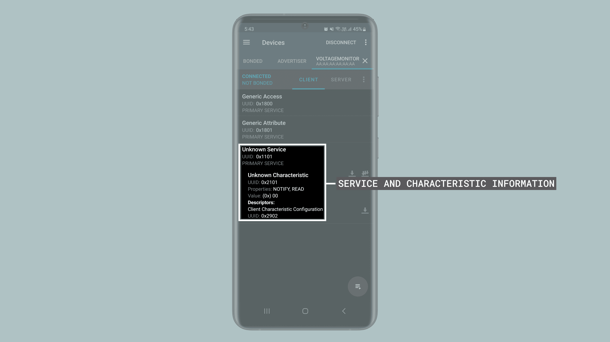

## OPC Unified Architecture (OPC UA)

This section explains the use of the [**OPC UA library**](https://github.com/arduino-libraries/Arduino_OPC_UA) designed for Opta.


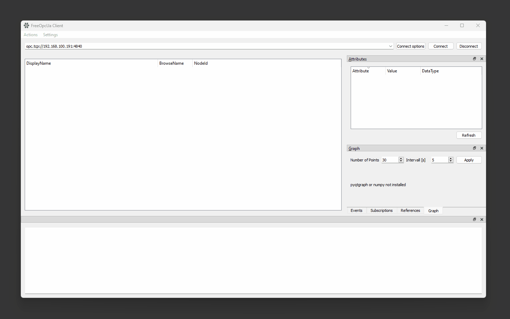

The library is based on the [**Fraunhofer open62541**](https://github.com/open62541/open62541) implementation of [**OPC UA**](https://en.wikipedia.org/wiki/OPC_Unified_Architecture), created specifically for the Opta family.

The [**OPC Unified Architecture (OPC UA)**](https://en.wikipedia.org/wiki/OPC_Unified_Architecture) is an industrial communication protocol widely used in automation and Industrial Internet of Things (IIoT) systems.

It provides a platform independent and secure method for exchanging information between devices and systems. **OPC UA** supports features like custom data modeling, authentication, encryption, and scalable architecture, making it a preferred choice for modern industrial applications.

The [**open62541** library](https://github.com/open62541/open62541) is an open-source implementation of the **OPC UA** standard. It is lightweight, efficient and written in C, making it ideal for embedded systems like the Opta. The library provides a flexible framework to create **OPC UA** servers and clients, ensuring compatibility with the standard while maintaining high performance.

The [**OPC UA library**](https://github.com/arduino-libraries/Arduino_OPC_UA) supports secure communication and interoperability for industrial automation applications, with the capability to automatically detect, configure, and expose up to **two** Arduino Opta Expansion Boards via **OPC UA**. Supported expansion boards include:

- Digital Expansion with mechanical relays (D1608E)
- Digital Expansion with solid-state relays (D1608S)
- Analog Expansion (A0602)

***The OPC UA library supports a maximum of __two__ Opta expansions connected simultaneously.***

### Setting up the OPC UA Server

To set up the **OPC UA** server, upload the [**`opta_opcua_server`** example](https://github.com/arduino-libraries/Arduino_OPC_UA/blob/main/examples/opta_opcua_server/opta_opcua_server.ino) to your Opta. This can be done using either the Arduino IDE or the Arduino CLI.

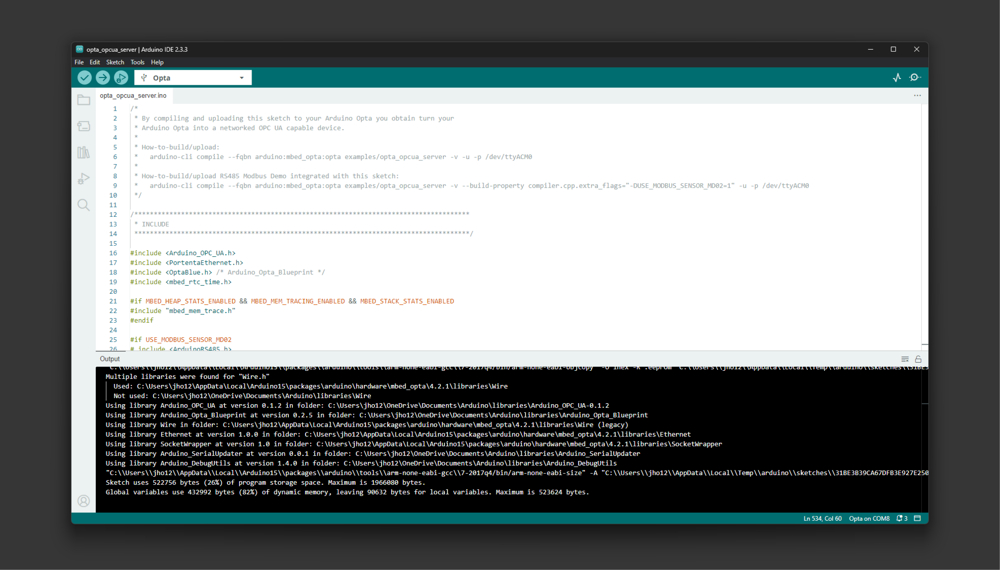

Run the following command to compile and upload the example if used with the Arduino CLI:

```bash
arduino-cli compile --fqbn arduino:mbed_opta:opta -v examples/opta_opcua_server -u -p /dev/ttyACM0
```

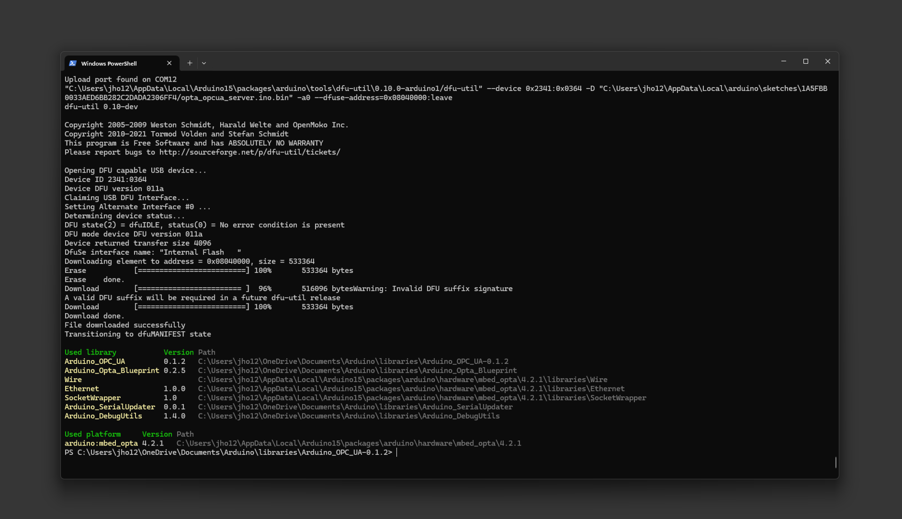

***If you are not familiar with the __Arduino CLI tool__, you can refer to the getting started documentation found [here](https://arduino.github.io/arduino-cli/1.1/getting-started/).***

Next, connect the Opta to a network via its Ethernet port. Please make sure the network has a DHCP-enabled router or switch to assign an IP address to the device.

Use a serial monitor to check the server status and retrieve the device's IP address. You can use the Arduino IDE Serial Monitor or other programs like [**Putty**](https://www.putty.org/) to establish a serial connection.

The output will display details such as the **discovery URL**. Below is an example of the server log output on the Arduino IDE Serial Monitor:

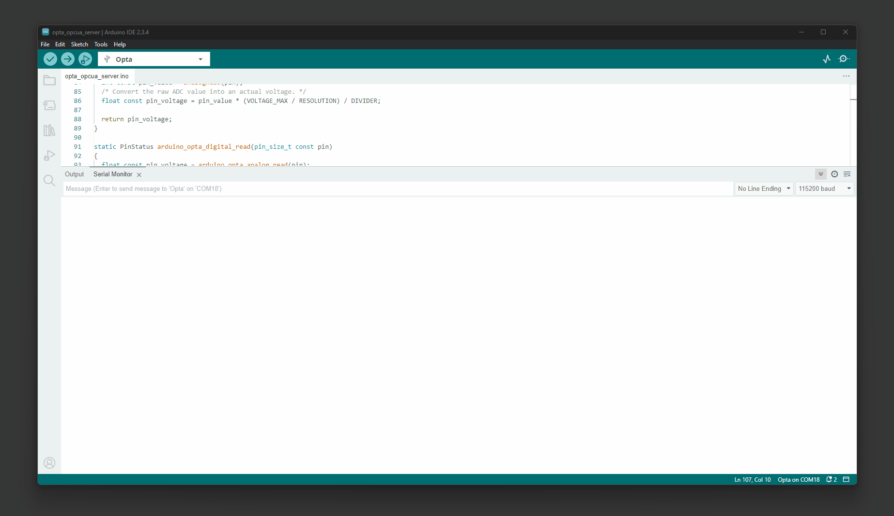

With [**Putty**](https://www.putty.org/), the following serial connection shows the server information:

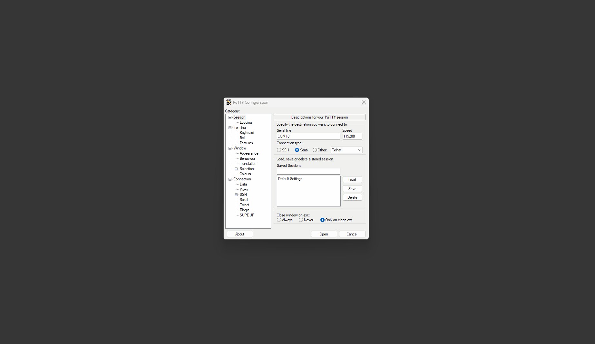

The output information is as follows and you should see similar information:

```bash
[2024-12-11 22:19:08.000 (UTC+0000)] info/eventloop	Starting the EventLoop
[2024-12-11 22:19:08.000 (UTC+0000)] warn/server	AccessControl: Unconfigured AccessControl. Users have all permissions.
[2024-12-11 22:19:08.000 (UTC+0000)] info/server	AccessControl: Anonymous login is enabled
[2024-12-11 22:19:08.000 (UTC+0000)] warn/server	x509 Certificate Authentication configured, but no encrypting SecurityPolicy. This can leak credentials on the network.
[2024-12-11 22:19:08.000 (UTC+0000)] info/server	Arduino Opta IP: 192.168.100.191
[2024-12-11 22:19:08.000 (UTC+0000)] info/server	Arduino Opta Variant: Arduino Opta WiFi
[2024-12-11 22:19:08.000 (UTC+0000)] info/server	OptaController 0 expansion modules detected.
[2024-12-11 22:19:08.000 (UTC+0000)] info/server	stack: size = 16384 | free = 15400 | used = 984 | max = 4248
[2024-12-11 22:19:08.000 (UTC+0000)] info/server	o1heap: capacity: 327520 | allocated: 66784 | peak_allocated: 68896
[2024-12-11 22:19:08.000 (UTC+0000)] info/server	Thread: 0x2405ADA4 ("application_unnamed_thread"), Stack size: 4248 / 16384
[2024-12-11 22:19:08.000 (UTC+0000)] info/server	Thread: 0x2405C960 ("rtx_idle"), Stack size: 328 / 896
[2024-12-11 22:19:08.000 (UTC+0000)] info/server	Thread: 0x2405D338 ("lwip_tcpip"), Stack size: 792 / 1200
[2024-12-11 22:19:08.000 (UTC+0000)] info/server	Thread: 0x2405DB60 ("shared_event_queue"), Stack size: 392 / 2048
[2024-12-11 22:19:08.000 (UTC+0000)] info/server	Thread: 0x2405D090 ("main"), Stack size: 2224 / 32768
[2024-12-11 22:19:08.000 (UTC+0000)] info/server	Thread: 0x2405C91C ("rtx_timer"), Stack size: 104 / 768
[2024-12-11 22:19:08.000 (UTC+0000)] info/server	Thread: 0x2406AE40 ("USBevt"), Stack size: 136 / 256
[2024-12-11 22:19:08.000 (UTC+0000)] info/server	Thread: 0x2405D250 ("stm32_emac_thread"), Stack size: 192 / 1024
[2024-12-11 22:19:08.000 (UTC+0000)] info/server	Heap size: 10393 / 90272 bytes
[2024-12-11 22:19:08.000 (UTC+0000)] warn/server	Maximum SecureChannels count not enough for the maximum Sessions count
[2024-12-11 22:19:08.000 (UTC+0000)] info/network	TCP	| Listening on all interfaces
[2024-12-11 22:19:08.000 (UTC+0000)] info/network	TCP 604424824	| Creating listen socket for "192.168.100.191" (with local hostname "192.168.100.191") on port 4840
[2024-12-11 22:19:08.000 (UTC+0000)] info/server	New DiscoveryUrl added: opc.tcp://192.168.100.191:4840
[2024-12-11 22:19:14.000 (UTC+0000)] info/server	Arduino Opta IP: 192.168.100.191
```

In this example, the output displays the **IP address**:

```bash
192.168.100.191
```

The **discovery URL** is as follows, which indicates the OPC UA server is running at:

```bash
opc.tcp://192.168.100.191:4840
```

You can now connect to the OPC UA server running on Opta.

### Connecting to the OPC UA Server

Once the server is running, you can use any OPC UA compatible client to connect to the server using the discovery URL. This allows interaction with the device and any connected expansion modules.

The [**opcua-client-gui**](https://github.com/FreeOpcUa/opcua-client-gui) client will be used to connect to the OPC UA server running on Opta in this section.

### Using OPC UA GUI Client for Testing

The [**opcua-client-gui**](https://github.com/FreeOpcUa/opcua-client-gui) client can be used if you are interested in testing or further interaction with the OPC UA server. To install the tool, please use the following commands:

```bash
cd /tmp
```

```bash
git clone https://github.com/FreeOpcUa/opcua-client-gui && cd opcua-client-gui
```

```bash
python -m venv .venv
```
```bash
source .venv/bin/activate
```

```bash
python3 -m pip install --upgrade pyopenssl
```

```bash
python3 -m pip install --upgrade .
```

If you are on a Windows OS platform, please follow the next steps:

1. Install [**WinPython**](https://winpython.github.io/) and install the version including **`pyqt5`**.

2. Use `pip` to install **opcua-client**:

```bash
pip install opcua-client
```

It is recommended that the command be run within the *`WinPython Command Prompt`* downloaded with [winpython](https://winpython.github.io/).

3. Run via the script `pip` created: `YOUR_INSTALL_PATH\Python\Python35\Scripts\opcua-client.exe`

It will launch the GUI and connect to the OPC UA server running on the Opta using the discovery URL. You will be able to see similar results as in the following clip:


With this, Opta is ready to handle the OPC UA protocol through simple [OPC UA GUI client](https://github.com/FreeOpcUa/opcua-client-gui). The interface allows browsing, subscribing to variables, writing values, and performing other interactions.

***For more information about the simple OPC UA GUI client and dedicatd installation instruction sets, please refer to [__opcua-client-gui__ repository](https://github.com/FreeOpcUa/opcua-client-gui).***

### Memory Debugging Insight

Additional configuration is possible for developers requiring detailed heap and stack memory usage information. The `mbed_app.json` configuration file should be modified to include memory and stack statistics macros to enable this feature.

The `mbed_app.json` file is found within [**`ArduinoCore-mbed`**](https://github.com/arduino/ArduinoCore-mbed/tree/main) at:

```bash
variants/OPTA/conf/mbed_app.json
```

Or the location can be referenced [here](https://github.com/arduino/ArduinoCore-mbed/blob/main/variants/OPTA/conf/mbed_app.json).

Add the following macros to enable memory and stack statistics:

```bash
"target.macros_add": [
  ...
+  "MBED_HEAP_STATS_ENABLED=1",
+  "MBED_STACK_STATS_ENABLED=1",
+  "MBED_MEM_TRACING_ENABLED=1"
]
```

After making these changes, recompile the core library using the following commands:

```bash
cd ArduinoCore-mbed
```

```bash
./mbed-os-to-arduino -a -g OPTA:OPTA
```

## Interrupts

**Opta's analog/digital programmable inputs and user-programmable button are interrupt-capable**. An interrupt is a signal that prompts Opta's microcontroller to stop its execution and start executing a special routine known as the Interrupt Service Routine (ISR). Once the ISR finishes, the microcontroller resumes executing its previous routine.

Interrupts are particularly useful when reacting instantly to an external event, such as a button press or a sensor signal. Without interrupts, you would have to constantly poll the status of a button or a sensor in the main loop of your running sketch. With interrupts, you can let your Opta's microcontroller do other tasks and only react when a desired event occurs.

***Due to Opta's microcontroller interrupt structure, interrupts in terminals `I1` (`A0`) and `I4` (`A3`) cannot be used simultaneously to avoid operational issues. It is important to note that, despite this limitation, any other combination of inputs can be used for interrupt detection. However, this means that, at most, seven of the eight available inputs can be used simultaneously for interrupts, as combinations containing both `I1` and `I4` are excluded from viable configurations.***

Interrupts can be used through the built-in functions of the Arduino programming language. To enable interrupts in your Opta's analog/digital programmable inputs and user-programmable button:

- Add the `attachInterrupt(digitalPinToInterrupt(pin), ISR, mode)`  instruction in your sketch's `setup()` function. Notice that the `pin` parameter can be `A0`, `A1`, `A2`, `A3`, `A4`, `A5`, `A6`, `A7`, or `BTN_USER`; the `ISR` parameter is the ISR function to call when the interrupt occurs, and the `mode` parameter defines when the interrupt should be triggered (`LOW`, `CHANGE`, `RISING`, or `FALLING`). 

The sketch below shows how to use Opta's programmable user button to control the sequence of status LEDs, `D0` to `D3`. In the original code shown in the [User Button section](#user-button), the user button's state was continuously checked inside the main loop of the sketch, and when a change was detected, the LEDs were updated accordingly. While this approach works for simple tasks, it becomes inefficient when your Opta™ has to perform more complex tasks or react to multiple inputs. In the modified code, we've set up an interrupt that triggers on a falling edge (`FALLING`) of the signal from the user button, which means it triggers when the button is pressed. 

```arduino
/**
  Opta's User Button Example (Interrupt)
  Name: opta_user_button_interrupt_example.ino
  Purpose: Configures Opta's user-programmable button to control the user LEDs
  using interrupts rather than polling the button's state. This example includes
  debouncing for the user button.
  
  @author Arduino PRO Content Team
  @version 2.0 23/07/23
*/

// Current and previous state of the button.
volatile bool buttonPressed = false;

// Counter to keep track of the LED sequence.
int counter = 0;

// Variables to implement button debouncing.
unsigned long lastDebounceTime  = 0;
unsigned long debounceDelay     = 150;

// Array to store LED pins.
int LEDS[] = {LED_D0, LED_D1, LED_D2, LED_D3};
int NUM_LEDS = 4;

void setup() {
  // Initialize Opta user LEDs.
  for(int i = 0; i < NUM_LEDS; i++) {
    pinMode(LEDS[i], OUTPUT);
  }
  
  // Set up the interrupt on USER_BTN to trigger on a rising edge (when the button is pressed)
  attachInterrupt(digitalPinToInterrupt(BTN_USER), buttonISR, FALLING);
}

/**
  Interrupt service routine (ISR)
  Set the variable buttonPressed to true

  @param None.
*/
void buttonISR() {
  buttonPressed = true;
}

void loop() {
  // If the button was pressed
  if (buttonPressed) {
    // Debouncing routine.
    if ((millis() - lastDebounceTime) > debounceDelay) {
      lastDebounceTime = millis();

      // Only increment the counter if the new button state is HIGH.
      if(counter < NUM_LEDS){
        counter++;
      }
      else{
        counter = 0;
      }
      
      // Reset the button pressed flag
      buttonPressed = false;
    }
  }

  // Control LED states.
  changeLights();
}

/**
  Control the status LEDs based on a counter value.
  Turns off all LEDs first, then turns on the LED 
  corresponding to the current counter value.

  @param None.
*/
void changeLights() {
  // Turn off all user LEDs.
  for(int i = 0; i < NUM_LEDS; i++) {
    digitalWrite(LEDS[i], LOW);
  }

  // Turn on the selected user LED.
  if(counter > 0) {
    digitalWrite(LEDS[counter - 1], HIGH);
  }
}
```

**Note**: The example code above employs a "debouncing" technique to ensure that the user button press is recognized as a singular event despite any rapid electrical fluctuations that can occur when physically pressing the button. Upon detecting a press through an interrupt, the sketch waits for a brief interval (150 milliseconds, set by the `debounceDelay` variable) before processing the press. This delay ensures that any additional "noise" or fluctuations don't trigger multiple registrations of the same press, ensuring precise LED sequencing operation.

To learn more into-depth about interrupts in Opta™ devices, check out the following tutorial:

- [Getting Started with Interrupts on Opta™](https://docs.arduino.cc/tutorials/opta/getting-started-with-interrupts)

## Real-Time Clock (RTC)

Opta™ device's (all variants) microcontroller (the STM32H747XI) features a low-power Real-Time Clock (RTC) with sub-second accuracy and hardware calendar accessible through specific RTC management methods from Mbed™️.

Some of the key capabilities of Opta's onboard RTC are the following:

- Calendar with subsecond, seconds, minutes, hours (12 or 24 formats), weekday, date, month, and years in BCD (binary-coded decimal) format.
- Automatic correction for 28, 29 (leap year), 30, and 31 days of the month.
- Two programmable alarms. 
- Timestamp feature, which can be used to save the calendar content.

The `Arduino Mbed OS Opta Boards` core has built-in libraries that let you use the device's onboard RTC, the `WiFi`, and `mbed_mktime` libraries; let's walk through an example code demonstrating some of the module's capabilities. The sketch below connects an Opta™ device to a Wi-Fi® network, synchronizes its onboard RTC with a Network Time Protocol (NTP) server using the [`NTPClient` library](https://www.arduino.cc/reference/en/libraries/ntpclient/), and prints the current RTC time to the Arduino IDE's Serial Monitor every 5 seconds. Install the `NTPClient` library using the Arduino IDE's Library Manager.

You need to create first a header file named `arduino_secrets.h` to store your Wi-Fi® network credentials. To do this, add a new tab by clicking the ellipsis (the three horizontal dots) button on the top right of the Arduino IDE 2.


Put `arduino_secrets.h` as the "Name for new file" and enter the following code on the header file:

```arduino
char ssid[] = "SECRET_SSID"; // Your network SSID (name)
char password[] = "SECRET_PASS"; // Your network password (use for WPA, or use as key for WEP)
```

Replace `SECRET_SSID` with the name of your Wi-Fi® network and `SECRET_PASS` with the password of it and save the project. The example code is as follows: 

```arduino
/**
  Opta's RTC Example
  Name: opta_rtc_example.ino
  Purpose: Connects an Opta device to a Wi-Fi network, synchronizes its onboard RTC
  with a NTP server and prints the current RTC time to the Serial Monitor every 5 seconds.

  @author Arduino PRO Content Team
  @version 1.0 23/07/23
*/

// Libraries used in the sketch.
#include <WiFi.h>
#include "arduino_secrets.h"
#include <NTPClient.h>
#include <mbed_mktime.h>

// Wi-Fi network credentials.
int status  = WL_IDLE_STATUS;

// NTP client configuration and RTC update interval.
WiFiUDP   ntpUDP;
NTPClient timeClient(ntpUDP, "pool.ntp.org", -6*3600, 0);
// Display time every 5 seconds.
unsigned long interval = 5000UL;
unsigned long lastTime = 0;

void setup() {
  Serial.begin(9600);
  while (!Serial) {
    ;
  }
  delay(5000);

  // Attempt Wi-Fi connection.
  while (status != WL_CONNECTED) {
    Serial.print("- Attempting to connect to WPA SSID: ");
    Serial.println(ssid);
    status = WiFi.begin(ssid, password);
    delay(500);
  }

  // NTP client object initialization and time update, display updated time on the Serial Monitor.
  timeClient.begin();
  timeClient.update();
  const unsigned long epoch = timeClient.getEpochTime();
  set_time(epoch);

  // Show the synchronized time.
  Serial.println();
  Serial.println("- TIME INFORMATION:");
  Serial.print("- RTC time: ");
  Serial.println(getLocalTime());
}

void loop() {
  // Display RTC time periodically.
  unsigned long currentTime = millis();
  if (currentTime - lastTime >= interval) {
    displayRTC();
    lastTime = currentTime;
  }
}

/**
  Display Opta's internal RTC time 

  @param none
  @return none
*/
void displayRTC() {
  Serial.println();
  Serial.println("- TIME INFORMATION:");
  Serial.print("- RTC time: ");
  Serial.println(getLocalTime());
}

/**
  Retrieves Opta's RTC time

  @param none
  @return Opta's RTC time in hh:mm:ss format
*/
String getLocalTime() {
  char buffer[32];
  tm t;
  _rtc_localtime(time(NULL), &t, RTC_FULL_LEAP_YEAR_SUPPORT);
  strftime(buffer, 32, "%k:%M:%S", &t);
  return String(buffer);
}

```

This sketch uses `WiFi.h`, `NTPClient.h`, and `mbed_mktime.h` libraries and methods to connect to a specific Wi-Fi® network using the provided credentials (network name and password). Once the internet connection has been established, the code synchronizes with a Network Time Protocol (NTP) server, using the `NTPClient.h` library, to obtain the current Coordinated Universal Time (UTC). This time is then converted to local time and used to set the device's internal RTC, thanks to the functionalities provided by `mbed_mktime.h` methods. 

Once the RTC has been synchronized in the setup, the sketch enters an infinite loop. In this loop, every 5 seconds, it retrieves the current time from the RTC and prints it to the serial monitor in a more readable format, using the tm structure provided by `mbed_mktime.h`. This ensures that even if the internet connection is interrupted or the system restarts, accurate time tracking is maintained as long as the RTC's power supply is not interrupted. You should see the following output in the Arduino IDE's Serial Monitor:

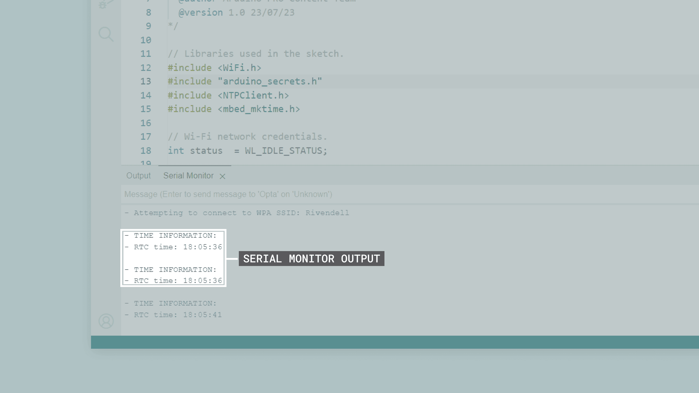

You can download the example code [here](assets/opta_rtc_example.zip). To learn more about date and time manipulation operations, check out the [`time` function documentation from Mbed™️](https://os.mbed.com/docs/mbed-os/v5.15/apis/time.html). Also, check out this real-world case described in the following application note where Opta's RTC:

- [Home Automation with Opta™️](https://docs.arduino.cc/tutorials/opta/home-automation-application-note)

## Arduino Cloud

All Opta™ variants are fully compatible with the [Arduino Cloud](https://cloud.arduino.cc/), simplifying how professional applications are developed and tracked. By using the IoT Cloud, you can, for example, monitor your Opta's input terminals, control your device's user LEDs and output relays remotely, and update your device's firmware OTA.  To learn more about the Arduino Cloud visit our [Getting Started with Arduino Cloud](https://docs.arduino.cc/arduino-cloud/guides/overview)

In case it is the first time you are using the IoT Cloud:

- To use the IoT Cloud, you need an account. If you do not have an account, create one for free here.
- To use the Arduino Cloud Editor or IoT Cloud, the Arduino Create Agent must be running on your computer. You can install the Arduino Create Agent here.

Let's walk through a step-by-step demonstration of how to use an Opta™ device with the IoT Cloud.

Log in to your IoT Cloud account; you should see the following:

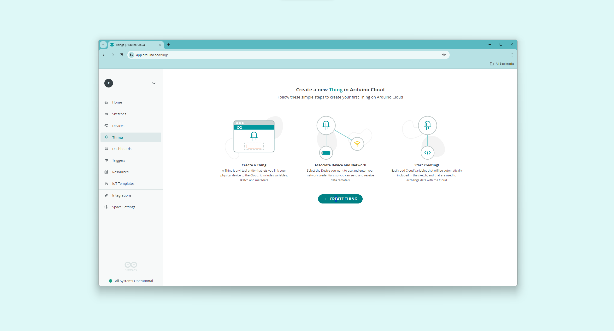

First, provision your Opta™ device on your IoT Cloud space. To do this, navigate to **Devices** and then click on the **ADD DEVICE** button:


The Setup Device pop-up window will appear. Navigate into **AUTOMATIC** and select the **Arduino board** option:

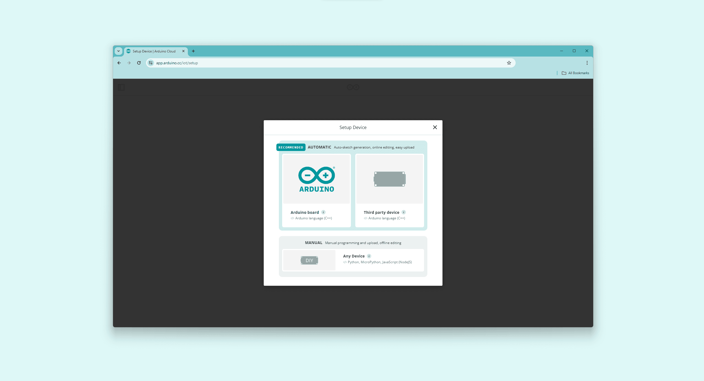

After a while, your Opta™ device should be discovered by the IoT Cloud, as shown below:

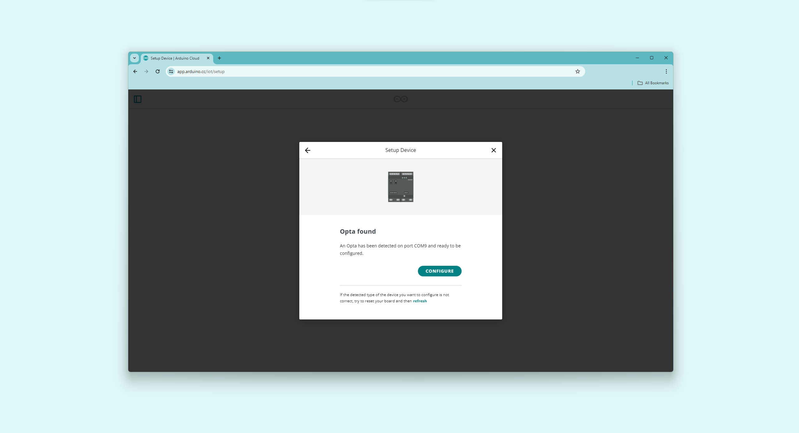

To set up your device, click the **CONFIGURE** button, assign a name to your device, and choose the preferred network connection method. The device supports both **Wi-Fi®** and **Ethernet** as connectivity options; thus, it can be configured for either connection type.

Based on the chosen connection type, the device will be configured accordingly. The user manual will show the configuration process for both Wi-Fi® and Ethernet connections.

### Via Ethernet Connection

To configure Opta™ with an Ethernet connection, after clicking **CONFIGURE**, please choose the **Ethernet** option.

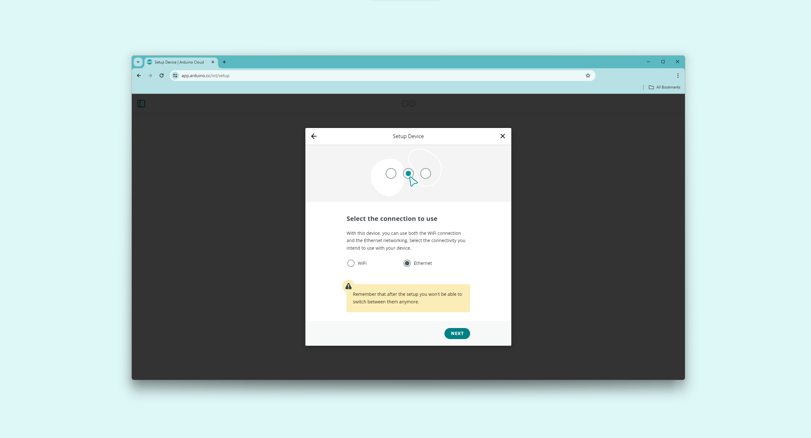

This will configure your Opta™ for secure Ethernet communication with the IoT Cloud, which may require some time to complete.

### Via Wi-Fi® Connection

To configure using the Wi-Fi® connection for the device, please choose the **WiFi** option after clicking the **CONFIGURE** button.

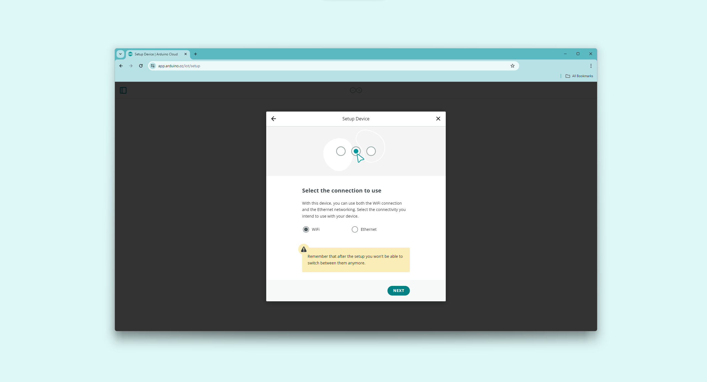

***To learn how to configure Opta™ in the Arduino Cloud using the two connectivity setup options, check out our tutorials for [Ethernet](https://docs.arduino.cc/arduino-cloud/hardware/ethernet) and [Wi-Fi](https://docs.arduino.cc/arduino-cloud/hardware/wifi)***

Your Opta™ will be configured to communicate securely with the IoT Cloud via a Wi-Fi® connection; this process can take a while.

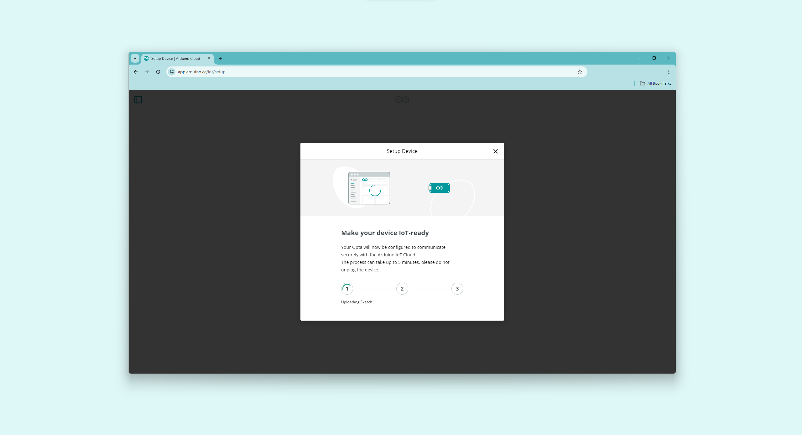

After configuring Opta™ with your choice of connection, the next step is creating a **"Thing"** to test the connection between your device and the IoT Cloud. Go to **Things** and click on **CREATE THING**, then name your thing.

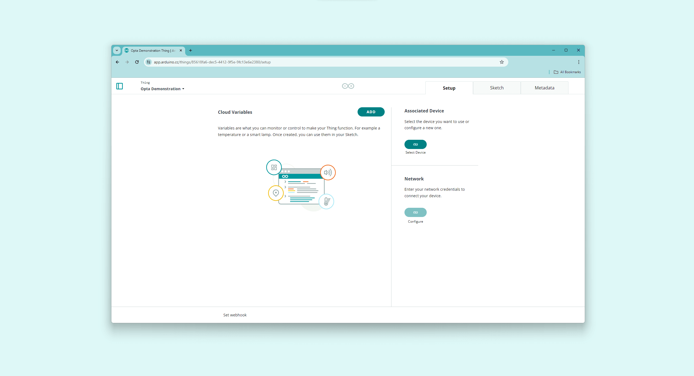

Navigate into **Associate Device** and click the **Select Device** button. Select your Opta™ device and associate it with your "Thing".

If Opta™ has been configured to use the **Ethernet connection**, no additional steps are required as DHCP is used to configure the Ethernet interface automatically.


If you need to use specific Ethernet interface settings, turn off the default settings in **Network** by clicking on **Change** to input custom parameters.

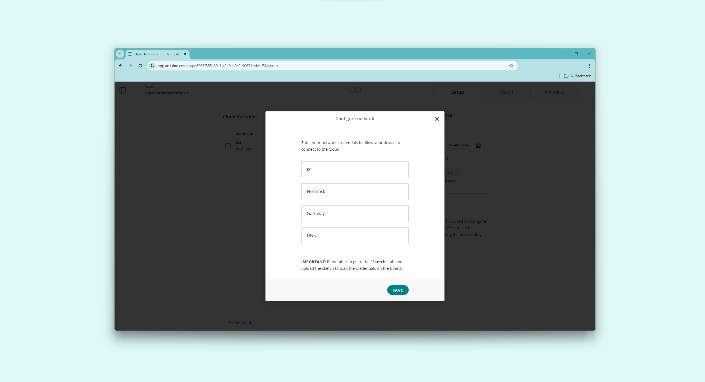

The required network credentials are:

- IP address
- Netmask
- Gateway
- DNS

To make the changes take effect with custom network credentials, please navigate to the **Sketch** tab and upload the sketch to load the credentials on the device. The sketch upload will be shown later in the process.

If Opta™ has been configured to use the **Wi-Fi® connection**, navigate to **Network**, click the **Configure** button, and enter your network credentials.

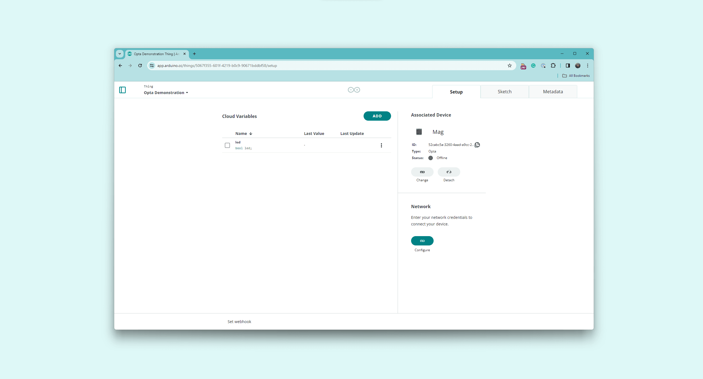

The project is ready to add variables to your "Thing"; navigate into **Cloud Variables** and click the **ADD** button.

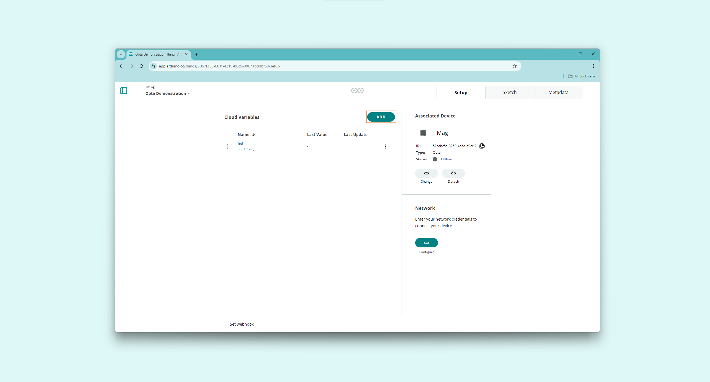

Add one variable with the following characteristics:

- **Name**: `led`
- **Variable type**: `boolean`
- **Variable permission**: `Read & Write`
- **Variable update policy**: `On change`

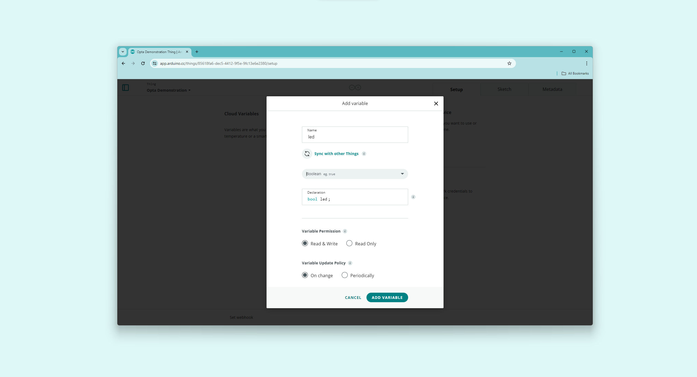

You should see the `led` variable in the Cloud Variables section. Navigate into **Dashboards** and select the **CREATE DASHBOARD** button; this will create a new dashboard and give your dashboard a name.

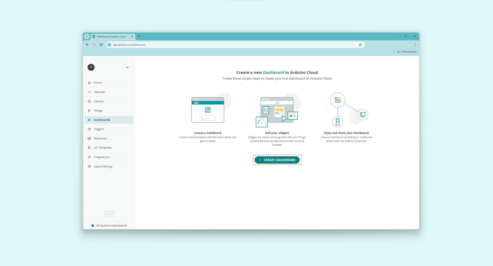

Add the following widgets to your dashboard:

- **Switch**:  Name the widget Switch and link it to the `led` variable you created before.
- **LED**: Name the widget **LED** and link it to the `led` variable you created before.

Your dashboard should look like the following:

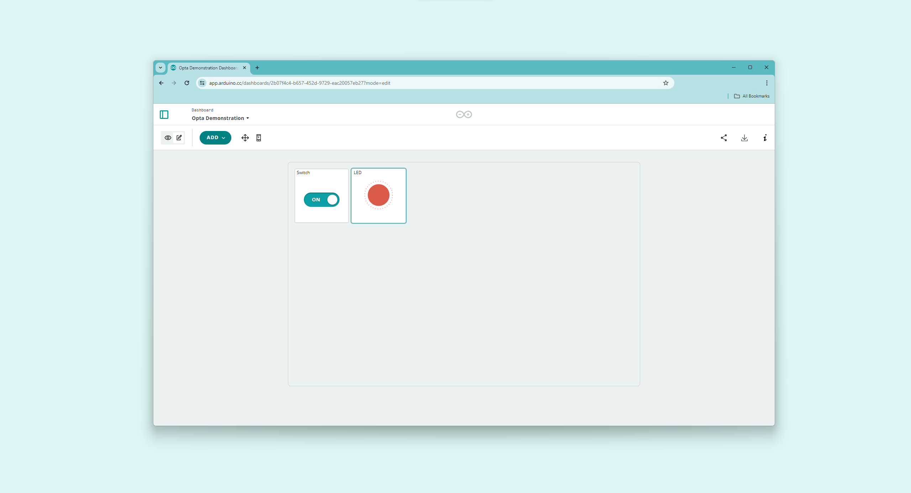

Go back to your **Things** and open the "Thing" you created. In the "Thing" setup page, navigate into Sketch, where you should see the online editor.

In the generated sketch, define `LED_D0` pin as an output in the `setup()` function:

```arduino
void setup() {
  // Initialize serial and wait for port to open:
  Serial.begin(9600);
  // This delay gives the chance to wait for a Serial Monitor without blocking if none is found
  delay(1500);

  // LED_D0 macro access the onboard green LED
  pinMode(LED_D0, OUTPUT);

  // Defined in thingProperties.h
  initProperties();

  // Connect to Arduino Cloud
  ArduinoCloud.begin(ArduinoIoTPreferredConnection);

  /*
     The following function allows you to obtain more information
     related to the state of network and IoT Cloud connection and errors
     the higher number the more granular information you’ll get.
     The default is 0 (only errors).
     Maximum is 4
 */
  setDebugMessageLevel(2);
  ArduinoCloud.printDebugInfo();
}
```

In the `onLedChange()` function, which was generated automatically by the Arduino Cloud when the variable `led` was created, you must associate the onboard green LED state with the `led` variable:

```arduino
/*
  Since Led is READ_WRITE variable, onLedChange() is
  executed every time a new value is received from IoT Cloud.
*/
void onLedChange()  {
  digitalWrite(LED_D0, !led);
}
```

The complete example code can be found below:

```arduino
/*
  Sketch generated by the Arduino Cloud

  Arduino Cloud Variables description

  The following variables are automatically generated and updated when changes are made to the Thing

  bool led;

  Variables which are marked as READ/WRITE in the Cloud Thing will also have functions
  which are called when their values are changed from the Dashboard.
  These functions are generated with the Thing and added at the end of this sketch.
*/

#include "thingProperties.h"

void setup() {
  // Initialize serial and wait for port to open:
  Serial.begin(9600);
  // This delay gives the chance to wait for a Serial Monitor without blocking if none is found
  delay(1500);

  // LED_D0 macro access the onboard green LED
  pinMode(LED_D0, OUTPUT);

  // Defined in thingProperties.h
  initProperties();

  // Connect to Arduino Cloud
  ArduinoCloud.begin(ArduinoIoTPreferredConnection);

  /*
     The following function allows you to obtain more information
     related to the state of network and IoT Cloud connection and errors
     the higher number the more granular information you’ll get.
     The default is 0 (only errors).
     Maximum is 4
 */
  setDebugMessageLevel(2);
  ArduinoCloud.printDebugInfo();
}

void loop() {
  ArduinoCloud.update();
  // Your code here
}

/*
  Since Led is READ_WRITE variable, onLedChange() is
  executed every time a new value is received from IoT Cloud.
*/
void onLedChange()  {
  digitalWrite(LED_D0, !led);
}
```

To upload the code to the Opta™ from the online editor, click the green **Verify** button to compile the sketch and check for errors, then click the green **Upload** button to program the board with the sketch.

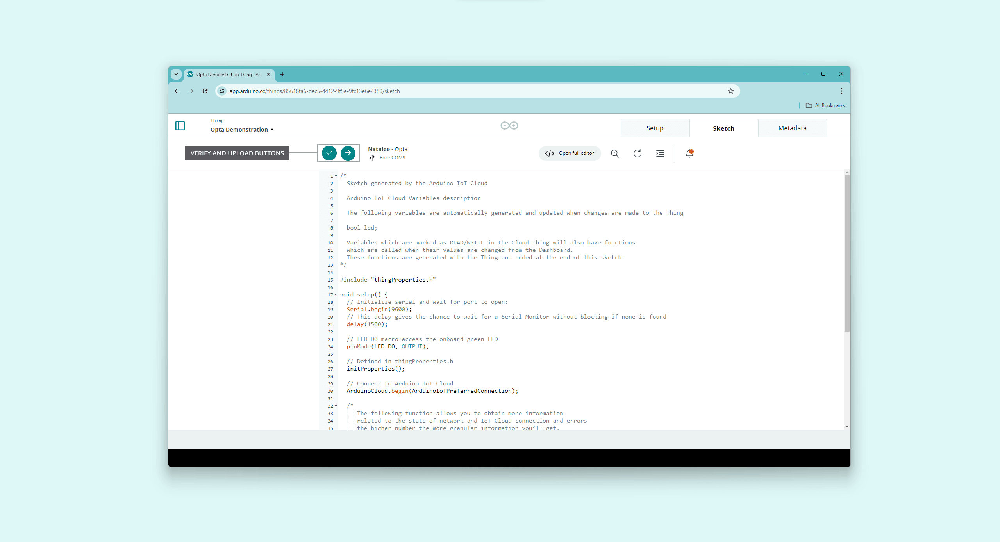

The code uses the `thingProperties.h` header, which contains essential network interface settings and definitions required for the above example code.

The Arduino Cloud creates This header file automatically, customized to the specific network interface settings and variables defined. It is advisable not to modify this file manually. Instead, any changes to variables should be made within the Arduino Cloud environment.

If Opta™ is set up with Wi-Fi® as the network interface, the `thingProperties.h` file will include settings such as the network SSID and password. The example code for this configuration is shown below:

```arduino
//code generated by Arduino IoT Cloud, DO NOT EDIT.

#include <ArduinoIoTCloud.h>
#include <Arduino_ConnectionHandler.h>

const char SSID[]     = SECRET_SSID;    // Network SSID (name)
const char PASS[]     = SECRET_OPTIONAL_PASS;    // Network password (use for WPA, or use as key for WEP)

void onLedChange();

bool led;

void initProperties(){

  ArduinoCloud.addProperty(led, READWRITE, ON_CHANGE, onLedChange);

}

WiFiConnectionHandler ArduinoIoTPreferredConnection(SSID, PASS);
```

Alternatively, if Opta™ is configured to use an Ethernet connection, the `thingProperties.h` file will include different settings such as _IP_, _DNS_, _Gateway_, and _Netmask_. The corresponding code for this configuration would be as follows:

```arduino
#include <ArduinoIoTCloud.h>
#include <Arduino_ConnectionHandler.h>

const char IP[]      = SECRET_OPTIONAL_IP;
const char DNS[]     = SECRET_OPTIONAL_DNS;
const char GATEWAY[] = SECRET_OPTIONAL_GATEWAY;
const char NETMASK[] = SECRET_OPTIONAL_NETMASK;

void onLedChange();

bool led;

void initProperties(){

  ArduinoCloud.addProperty(led, READWRITE, ON_CHANGE, onLedChange);

}

EthernetConnectionHandler ArduinoIoTPreferredConnection(IP, DNS, GATEWAY, NETMASK);
```

Navigate into **Dashboards** again, your board should connect to the Wi-Fi® network or via the Ethernet interface you configured before (you can follow the connection process with the online editor-integrated Serial Monitor). Your board's STATUS LED 1 (`LED_D0`) should light on or off when the position of the switch changes.

To learn more about Opta™ and the Arduino IoT Cloud, check out the following resources that can help you learn about the Arduino IoT Cloud and Opta™:

- [Opta™ Relay Management template](https://create.arduino.cc/iot/templates/relay-management)
- [Using PLC IDE With Arduino® IoT Cloud](https://docs.arduino.cc/tutorials/opta/plc-ide-cloud-support)


## Opta Expansions

| Characteristics                     | Details                                                                                               |
|-------------------------------------|-------------------------------------------------------------------------------------------------------|
| Supply Voltage                      | 12...24 V                                                                                             |
| Antipolarity protection             | Yes                                                                                                   |
| Overvoltage protection              | Yes (+20%)                                                                                            |
| Maximum Supported Expansion Modules | Up to 5                                                                                               |
| Inputs                              | 16x Digital (0-24 V) / Analog (0-10 V or 0-24 V) inputs                                               |
| Outputs                             | AFX00005: 8x Electromechanical Relays (250 VAC - 6 A), AFX00006: 8x Solid State Relays (24 VDC - 3 A) |
| Degree of Protection                | IP20                                                                                                  |
| Certifications                      | FCC, CE, UKCA                                                                                         |

### Snapping the Expansion

You can snap up to five expansions to your Opta™ Base module to multiply and mix your set of I/Os with seamless detection.

After removing the expansion port breakable plastic cover marked as AUX, from the Opta™ controller and from the expansion to expose the expansion port, plug the expansions on the right side of your Opta™ controller making sure to correctly align the **Aux connector** and the connection clips as shown in the image below:

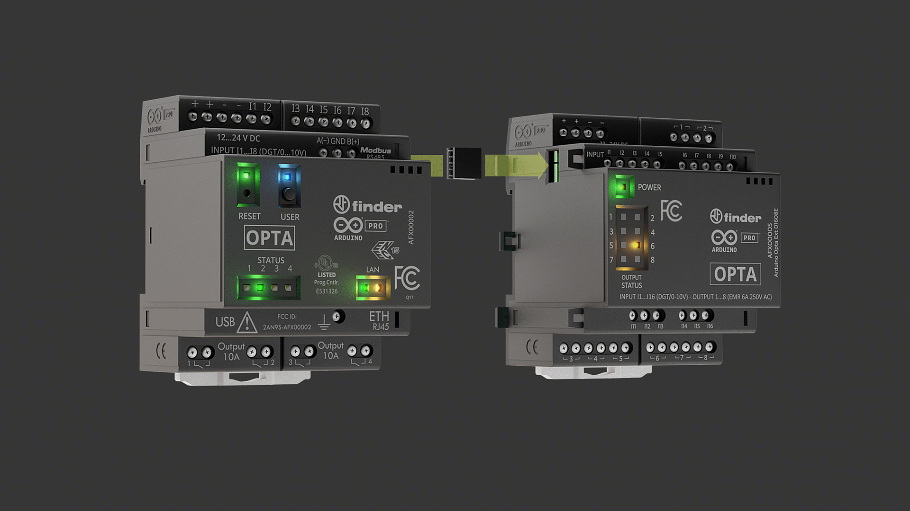

### Library Installation

To use the Opta™ Expansions with your Opta™ PLC, you need to install the `Arduino_Opta_Blueprint` library. To do so in the Arduino IDE, select the **Library Manager** from the left side menu, now search for _Opta Expansions_ and click on the install button.

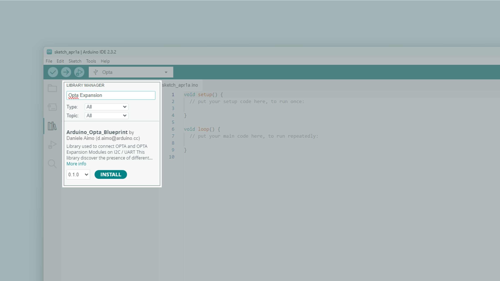

Install all the **library dependencies** suggested by clicking the **Install All** button:

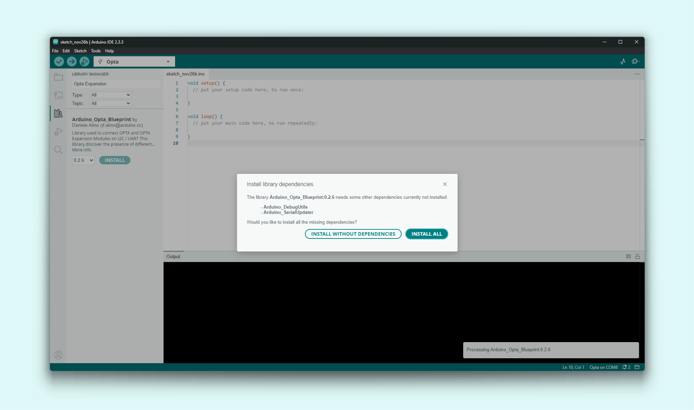

Once installed, you will have access to a variety of sketch examples showcasing the expansions capabilities and how to use them.

### Update Expansion Firmware

With the library installed, you can update the expansion firmware to ensure proper functionality and seamless detection.

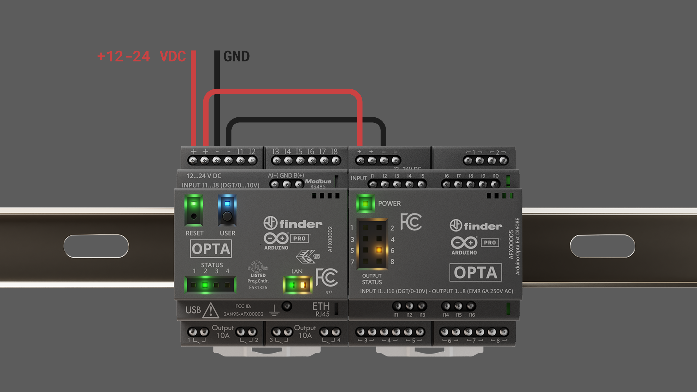

***__The expansions must be externally powered__ to operate and be detected by the Opta™ controller during the firmware update and regular operation. __The Aux port does not supply power for expansion__.***

In the Arduino IDE, navigate to **File > Examples > Arduino_Opta_Blueprint > updateExpansionFw**.

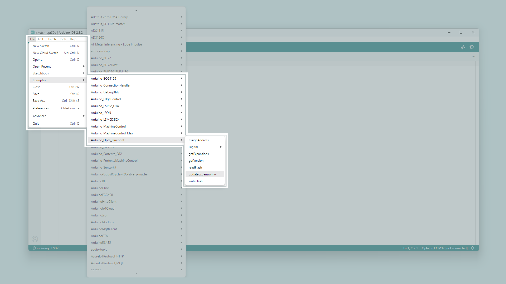

Upload the program to the Opta™ controller and **open the Arduino IDE Serial Monitor to start the firmware update process**.

***__Ensure the Arduino IDE Serial Monitor is open before starting the firmware update.__ The Opta™ controller will wait until the Serial Monitor is open, displays messages, and prompts you to confirm the update process manually.***

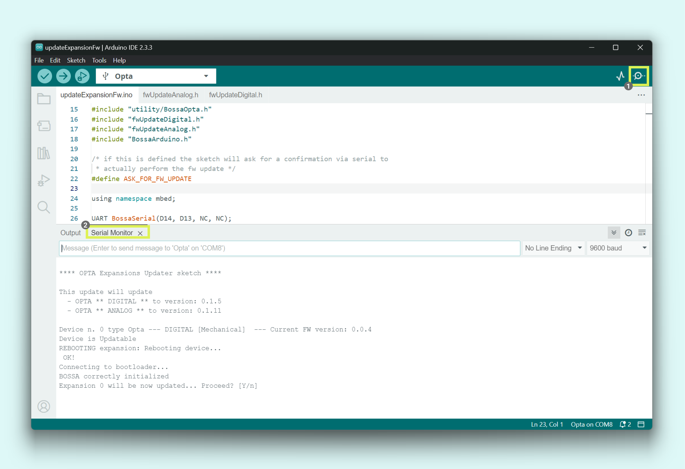

If your expansion is updatable, the Serial Monitor will display its current firmware and the new version that is available for the update.

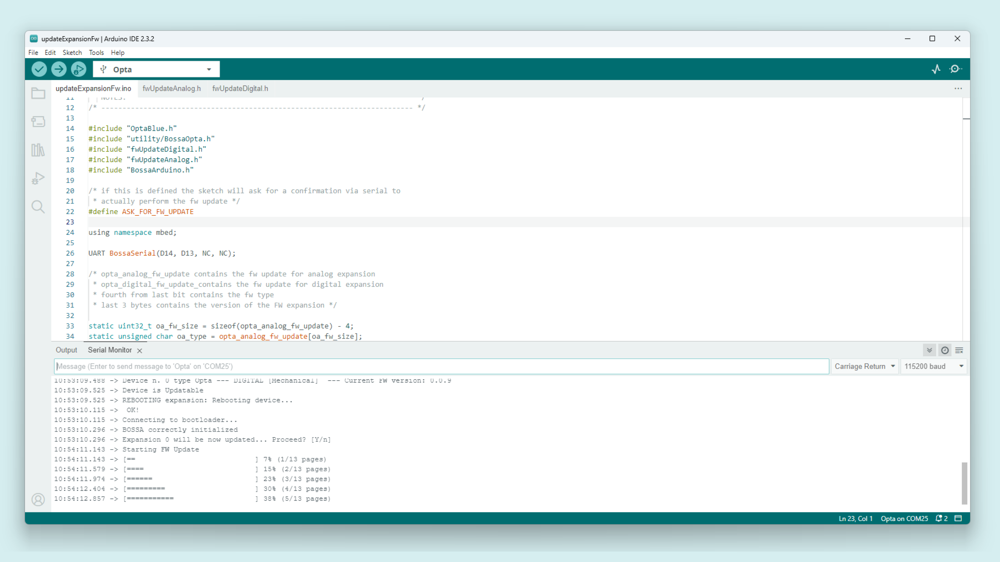

Enter **`Y`** in the Serial Monitor's input field to confirm and begin the firmware update.

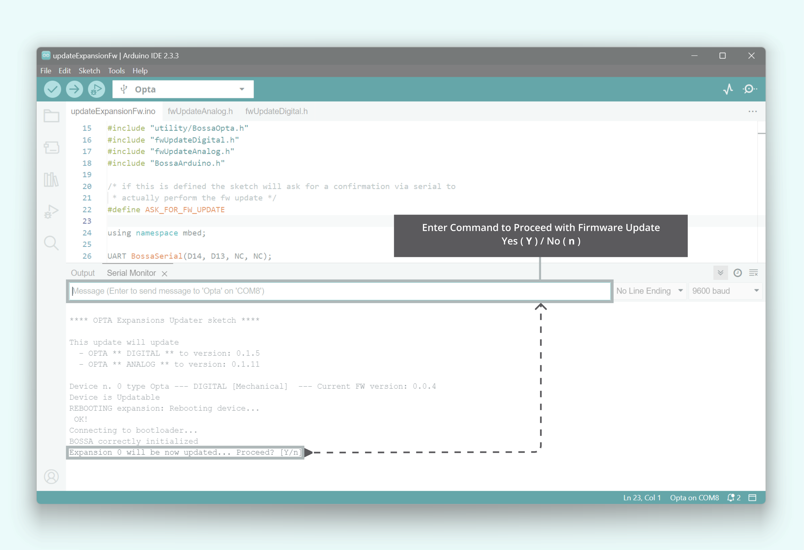

The following clip shows the complete process of updating the attached Opta Expansion:

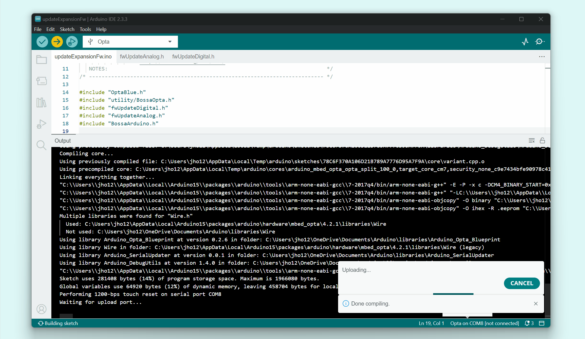

Once the update is complete, your Opta Expansion will have the latest firmware version.

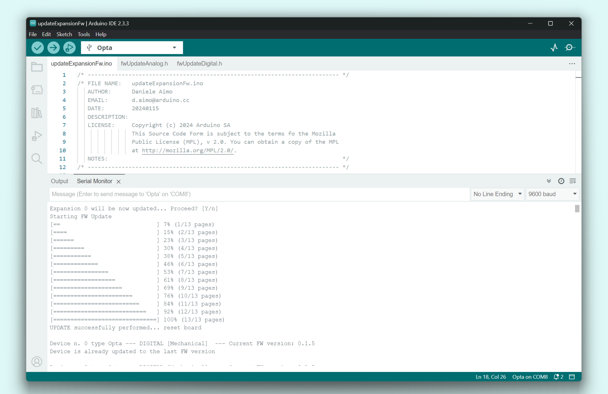

If you have multiple Opta Expansions connected, the process remains the same. The Serial Monitor will detect and display the current firmware versions for all attached expansions, and updates will be applied where available.

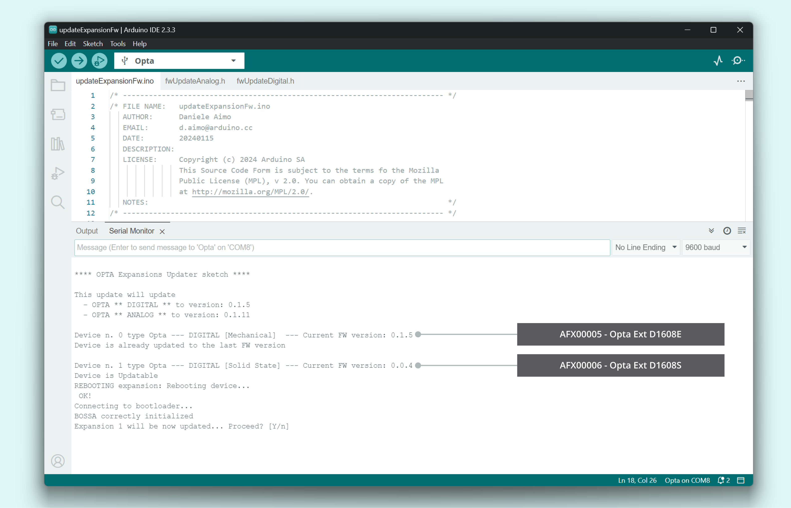

***The Opta™ controller module supports a maximum of __5 expansion modules__. Exceeding this limit may cause unexpected behavior. __Ensure no more than five modules are connected, and verify that the Aux connector and clips are securely installed__.***

The following clip shows the complete process of updating multiple attached Opta Expansions:

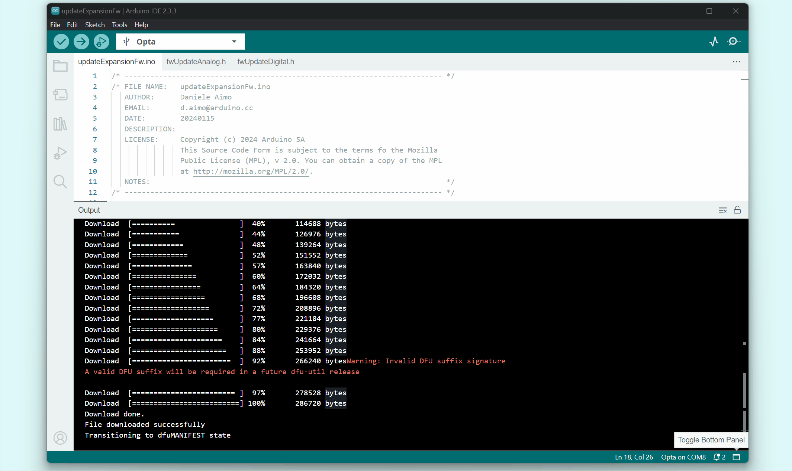

Once the update is complete, all Opta Expansions will have the latest firmware version.

### General Library Notes

This section aims to clarify some recommendations for your programming experience to be as smooth as possible in your solution-developing process. 

When you are using the `Arduino_Opta_Blueprint` library, please take into account that `OptaController.update()` must be called cyclically to support the hot plug of new expansions. In other words, by calling the update() function cyclically, the controller will discover new expansions when they are plugged in while the controller is already running.

Thanks to this function, the action of plugging in a new expansion will cause the controller to start a completely new discovery process and a new I2C address assignment.

`OptaController.update()` function DOES NOT:
* Check if an expansion has been removed and remove their objects
* Update any data from or to the expansion


The expansion object in the example above is defined using the `OptaController.getExpansion(i);` function, as follows:


```arduino
//For Digital Expansions
for(int i = 0; i < 5; i++) {  // check all the five available expansion slots
  DigitalMechExpansion mechExp = OptaController.getExpansion(i); 
  DigitalStSolidExpansion stsolidExp = OptaController.getExpansion(i);
}

//For Analog Expansions:
for(int i = 0; i < OptaController.getExpansionNum(); i++) {  // check all the available expansion slots
  AnalogExpansion exp = OptaController.getExpansion(i);
}
```
The above method will check if there is an Ext D1608E or Ext D1608S expansion connected in the `i` index from the five admitted. If any is found in the asked index, the expansion `mechExp` or `stsolidExp` turns to true. This will ensure which expansion the read state belongs to.

In the case of using analog expansions, the same method is used but checking for an Ext A0602 expansion. If any is found in the asked index, the `exp` object turns to true.

The library supports the `OptaController.getExpansionNum()`. This function always returns the number of expansions discovered during the last discovery / assign I2C address process. 

Since the discovery process is NOT performed if an expansion is removed or powered down, the value returned by this function DOES NOT change in case of the removal of one Expansion. To know if an expansion is missing, register a callback using `setFailedCommCb(callback)` (available on all the Expansion classes). 

The callback will be called any time an I2C expected answer is not received by the controller, allowing the user to know that expansion is missing. No "heartbeat" function is provided to understand if an expansion is missing since having an expansion and not regularly communicating with it is not a behavior meant by design.

### Opta Digital Expansions

Arduino Opta™ Digital Expansions are designed to multiply your Opta™ micro PLC capabilities with the addition of 16 programmable inputs for connecting your industrial sensors and 8 more relays to operate your machines. Designed in partnership with leading relay manufacturer Finder®, it allows professionals to scale up industrial and building automation projects while taking advantage of the Arduino ecosystem.

The Opta™ Digital Expansions come in two variants: 

* [The Arduino Opta® Ext D1608E (AFX00005)](https://store.arduino.cc/products/opta-ext-d1608e) with Electromechanical Relays.
* [The Arduino Opta® Ext D1608S (AFX00006)](https://store.arduino.cc/products/opta-ext-d1608s) with Solid State Relays.

The Opta Expansions can be controlled by any Opta controller variant: [Opta™ Lite](https://store.arduino.cc/products/opta-lite), [Opta™ RS485](https://store.arduino.cc/products/opta-rs485) or [Opta™ WiFi](https://store.arduino.cc/products/opta-wifi).

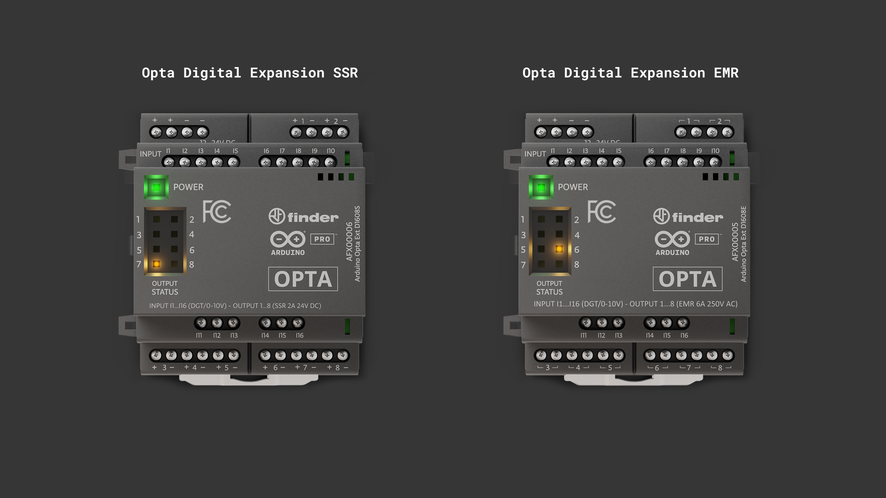

***The Opta™ expansions firmware must be updated to the latest version to ensure proper functioning. See this [section](#update-expansion-firmware) for a guided step-by-step.***

#### Powering Expansions

The Opta™ Digital Expansions must be externally powered to work. See the power specifications in the table below:

|       **Property**       | **Min** | **Typ** | **Max** | **Unit** |
|:------------------------:|:-------:|:-------:|:-------:|:--------:|
|      Supply voltage      |   12    |    -    |   24    |    V     |
|    Permissible range     |  10.2   |    -    |  27.6   |    V     |
| Power consumption (12 V) |    -    |    -    |    3    |    W     |
| Power consumption (24 V) |    -    |    -    |    3    |    W     |

In the image below there is an example of the power wiring of the expansions:


***The expansions must be externally powered to be operated and detected by the Opta™ controller.***

***The Opta™ controller module supports a maximum of __5 expansion modules__. Exceeding this limit may cause unexpected behavior. __Ensure no more than five modules are connected, and verify that the Aux connector and clips are securely installed__.***

#### Programmable Inputs

The Opta™ Expansions have **16x analog/digital programmable inputs** accessible through terminals `I1` to `I16`.

Both Ext D1608E and Ext D1608S variant inputs can be used as **digital** within the 0-24 VDC range or as **analog** inputs within the 0-10 VDC or 0-24 VDC range. The analog inputs are capable of operating with 0-10 VDC analog sensors as well as 0-24 VDC sensors. 

***The inputs are marked on plastic as DGT/0-10 V to maintain uniformity with the main Opta module and as conventionally the majority of industrial analog sensors work in the 0-10 V range.***

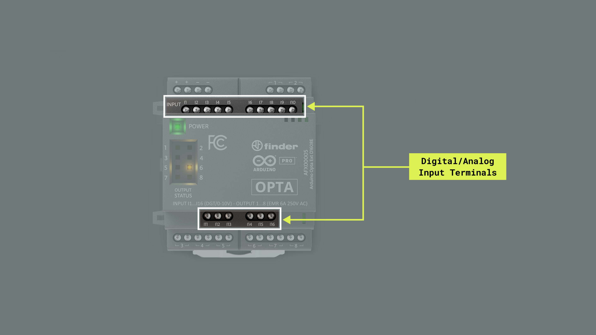

|      **Characteristics**      |        **Details**        |
|:-----------------------------:|:-------------------------:|
|       Number of inputs        | 16x Digital/Analog inputs |
| Inputs overvoltage protection |     Yes (up to 40 V)      |
|      Reverse protection       |            No             |
|        Input impedance        |          5.85 kΩ          |

Analog/digital input terminals are mapped as described in the following table:

| **Opta Digital Expansion Terminal** | **Arduino Pin Mapping** |
|:-----------------------------------:|:-----------------------:|
|                 I1                  |            0            |
|                 I2                  |            1            |
|                 I3                  |            2            |
|                 I4                  |            3            |
|                 I5                  |            4            |
|                 I6                  |            5            |
|                 I7                  |            6            |
|                 I8                  |            7            |
|                 I9                  |            8            |
|                 I10                 |            9            |
|                 I11                 |           10            |
|                 I12                 |           11            |
|                 I13                 |           12            |
|                 I14                 |           13            |
|                 I15                 |           14            |
|                 I16                 |           15            |

The **reading time** of digital and analog inputs is detailed in the table below:

| **Channel type** | **Number of inputs** |          **Function**          | **Time** |                                               **Notes**                                               |
|:----------------:|:--------------------:|:------------------------------:|:--------:|:-----------------------------------------------------------------------------------------------------:|
|     Digital      |     All at once      |    `digitalRead(pin, true)`    | ~580 µs  | This function even if used to read a "single pin" actually updates the value of all the digital pins. |
|     Digital      |     All at once      |    `updateDigitalInputs()`     | ~580 µs  |                 This function is also included in the measure `digitalRead(0, false)`                 |
|      Analog      |         One          | `getAnalogRead(channel, true)` | ~600 µs  |        Time does not change converting the value to physical unit (i.e. using `pinVoltage()`)         |
|      Analog      |     All at once      |     `updateAnalogInputs()`     | ~1.28 ms |                This function is also included in the measure `getAnalogRead(0, false)`                |

#### Digital 

|        **Characteristics**        |           **Details**            |
|:---------------------------------:|:--------------------------------:|
|       Digital Input voltage       |             0...24V              |
| Digital Input voltage logic level | VIL Max: 4 VDC. VHL Min: 5.9 VDC |
|       Digital Input current       |  4.12mA at 24V \| 2.05mA at 10V  |
|      Digital Input frequency      |              300 Hz              |
|  All inputs at once reading time  |             ~580 µs              |

The state of an input terminal, configured as digital, can be read using the built-in function `digitalRead()` as shown below:

```arduino
PinStatus state = <ExpObject>.digitalRead(<input>);
```
The following example will let you read all the digital inputs of every expansion connected at once, it can be found in the Opta Digital Expansions library by navigating to **File > Examples > Arduino_OptaBlueprint > getDigital**:

```arduino
#include "OptaBlue.h"

using namespace Opta;

/* -------------------------------------------------------------------------- */
void printExpansionType(ExpansionType_t t) {
/* -------------------------------------------------------------------------- */  
  if(t == EXPANSION_NOT_VALID) {
    Serial.print("Unknown!");
  }
  else if(t == EXPANSION_OPTA_DIGITAL_MEC) {
    Serial.print("DIGITAL [Mechanical]");
  }
  else if(t == EXPANSION_OPTA_DIGITAL_STS) {
    Serial.print("DIGITAL [Solid State]");
  }
  else if(t == EXPANSION_DIGITAL_INVALID) {
    Serial.print("DIGITAL [!!Invalid!!]");
  }
  else if(t == EXPANSION_OPTA_ANALOG) {
    Serial.print("ANALOG");
  }
  else {
    Serial.print("Unknown!");
  }
}

/* -------------------------------------------------------------------------- */
void printExpansionInfo(uint8_t index, ExpansionType_t type, uint8_t i2c_address) {
/* -------------------------------------------------------------------------- */
  Serial.print("Expansion[" + String(index) + "]:");
  Serial.print(" type ");
  printExpansionType(type);
  Serial.print(", I2C address: ");
  Serial.println(i2c_address);

}

/* -------------------------------------------------------------------------- */
/*                                 SETUP                                      */
/* -------------------------------------------------------------------------- */
void setup() {   
  Serial.begin(115200);
  delay(2000);

  OptaController.begin();
}

/* -------------------------------------------------------------------------- */
/*                                  LOOP                                      */
/* -------------------------------------------------------------------------- */
void loop() {
   
 OptaController.update();

  Serial.println();

  for(int i = 0; i < OPTA_CONTROLLER_MAX_EXPANSION_NUM; i++) {
    /* ask for a digital expansion 
     * just one of these will be a valid expansion */
    DigitalMechExpansion mechExp = OptaController.getExpansion(i); 
    DigitalStSolidExpansion stsolidExp = OptaController.getExpansion(i);
    /* always check for the validity of the expansion */
    if(mechExp) {
      /* get and print information about expansion */
      printExpansionInfo(mechExp.getIndex(), mechExp.getType(),
      mechExp.getI2CAddress());
      
      /* this will update the status of all the digital input 
       * the same can be achieved using digitalRead() function
       * with the second parameter equal true, however in this
       * case multiple i2c transaction are performed without
       * reason */
      mechExp.updateDigitalInputs();

      for(int k = 0; k < OPTA_DIGITAL_IN_NUM; k++) {
        /* this will return the pin status of the pin k */
        PinStatus v = mechExp.digitalRead(k);

        if(v == HIGH) {
          Serial.print("HH");
        }
        else {
          Serial.print("LL");
        }
        Serial.print(' ');
      }
      Serial.println();
    }

  
    /* always check for the validity of the expansion */
    if(stsolidExp) {
      /* get and print information about expansion */
        printExpansionInfo(stsolidExp.getIndex(), stsolidExp.getType(),
        stsolidExp.getI2CAddress());

      /* this will update the status of all the digital input 
       * the same can be achieved using digitalRead() function
       * with the second parameter equal true, however in this
       * case multiple i2c transaction are performed without
       * reason */
      stsolidExp.updateDigitalInputs();

      for(int k = 0; k < OPTA_DIGITAL_IN_NUM; k++) {
        /* this will return the pin status of the pin k */
        PinStatus v = stsolidExp.digitalRead(k);

        if(v == HIGH) {
          Serial.print("HH");
        }
        else {
          Serial.print("LL");
        }
        Serial.print(' ');
      }
      Serial.println();
    }
  }
  delay(1000);

}
```

To fully understand the example above, we recommend you to check the [General Library Notes](#general-library-notes) section.

The function `<ExpObject>.updateDigitalInputs();` updates all the inputs with their current states to prepare them to be read.

After the Opta™ controller is programmed with the example sketch, open the Arduino IDE Serial Monitor and you will see each input state as follows:

```
Expansion[0]: type DIGITAL [Mechanical], I2C address: 11
LL LL LL LL LL HH LL LL LL LL LL LL LL LL LL LL 
```

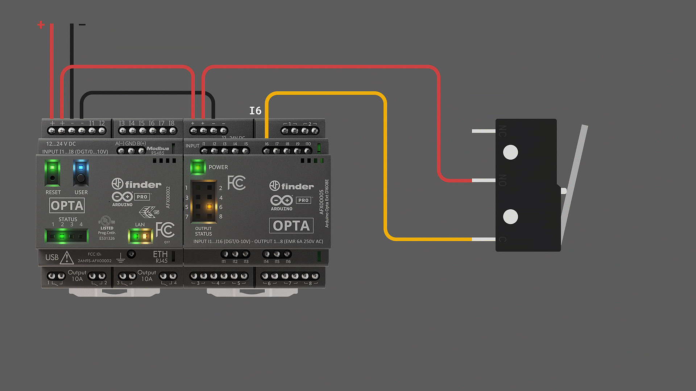

#### Analog 

|       **Characteristics**       | **Details** |
|:-------------------------------:|:-----------:|
|      Analog Input voltage       |   0...24V   |
|     Analog Input resolution     |   14 bits   |
|     Analog Input LSB value      |  1.733 mV   |
|            Accuracy             |   +/- 5%    |
|          Repeatability          |   +/- 2%    |
|     One input reading time      |  ~600 µs    |
| All inputs at once reading time |  ~1.28 ms   |

The state of an input terminal, configured as analog, can be read using the built-in function `analogRead()` as shown below:

```arduino
uint16_t raw_adc = <ExpObject>.analogRead(<input>);
```
The following example will let you read all the analog inputs of every expansion connected at once, it can be found in the Opta Digital Expansions library by navigating to **File > Examples > Arduino_OptaBlueprint > getAnalog**:

```arduino
#include "OptaBlue.h"

using namespace Opta;

/* -------------------------------------------------------------------------- */
void printExpansionType(ExpansionType_t t) {
/* -------------------------------------------------------------------------- */  
  if(t == EXPANSION_NOT_VALID) {
    Serial.print("Unknown!");
  }
  else if(t == EXPANSION_OPTA_DIGITAL_MEC) {
    Serial.print("DIGITAL [Mechanical]");
  }
  else if(t == EXPANSION_OPTA_DIGITAL_STS) {
    Serial.print("DIGITAL [Solid State]");
  }
  else if(t == EXPANSION_DIGITAL_INVALID) {
    Serial.print("DIGITAL [!!Invalid!!]");
  }
  else if(t == EXPANSION_OPTA_ANALOG) {
    Serial.print("ANALOG");
  }
  else {
    Serial.print("Unknown!");
  }
}

/* -------------------------------------------------------------------------- */
void printExpansionInfo(uint8_t index, ExpansionType_t type, uint8_t i2c_address) {
/* -------------------------------------------------------------------------- */
  Serial.print("Expansion[" + String(index) + "]:");
  Serial.print(" type ");
  printExpansionType(type);
  Serial.print(", I2C address: ");
  Serial.println(i2c_address);

}

/* -------------------------------------------------------------------------- */
/*                                 SETUP                                      */
/* -------------------------------------------------------------------------- */
void setup() { 
  Serial.begin(115200);
  delay(2000);

  OptaController.begin();
}

/* -------------------------------------------------------------------------- */
void printUint16(uint16_t v) {
/* -------------------------------------------------------------------------- */  
  if(v < 10) {
    Serial.print("    ");
  }
  else if(v < 100) {
    Serial.print("   ");

  }
  else if(v < 1000) {
    Serial.print("  ");

  }
  else if(v < 10000) {
     Serial.print(" ");
  }
  Serial.print(v);
}


/* -------------------------------------------------------------------------- */
/*                                  LOOP                                      */
/* -------------------------------------------------------------------------- */
void loop() {
 
 OptaController.update();

  for(int i = 0; i < OPTA_CONTROLLER_MAX_EXPANSION_NUM; i++) {
    /* ask for a digital expansion 
     * just one of these will be a valid expansion */
    DigitalMechExpansion mechExp = OptaController.getExpansion(i); 
    DigitalStSolidExpansion stsolidExp = OptaController.getExpansion(i);
    /* always check for the validity of the expansion */
    if(mechExp) {
      /* get and print information about expansion */
      printExpansionInfo(mechExp.getIndex(), mechExp.getType(),
      mechExp.getI2CAddress());
      /* get and print information about analog input status */
      for(int k = 0; k < OPTA_DIGITAL_IN_NUM; k++) {
        /* this will return the ad converter bits */
        uint16_t v = mechExp.analogRead(k);
        printUint16(v);
        Serial.print(" ");
        /* this will return the voltage at the pin k in Volts
         * we pass false as the last argument since we have
         * just read the analog value with the previous analogRead */
        float V = mechExp.pinVoltage(k,false);
        Serial.print("(" + String(V) + "V) ");
      }
      Serial.println();
    }

  
    /* always check for the validity of the expansion */
    if(stsolidExp) {
      /* get and print information about expansion */
        printExpansionInfo(stsolidExp.getIndex(), stsolidExp.getType(),
        stsolidExp.getI2CAddress());

      /* get and print information about analog input status */
      for(int k = 0; k < OPTA_DIGITAL_IN_NUM; k++) {
        uint16_t v = stsolidExp.analogRead(k);
        printUint16(v);
        Serial.print(" ");
        /* this will return the voltage at the pin k in Volts
         * we pass false as the last argument since we have
         * just read the analog value with the previous analogRead */
        float V = stsolidExp.pinVoltage(k,false);
        Serial.print("(" + String(V) + "V) ");
      }
      Serial.println();
    }
  }
  delay(1000);

}
```
To fully understand the example above, we recommend you to check the [General Library Notes](#general-library-notes) section.

The voltage of an analog input can be read using the built-in function `pinVoltage()` as shown below:

```arduino
float V = exp.pinVoltage(<input>, false); // read the <input> and returns a voltage value
```

After the Opta™ controller is programmed with the example sketch, open the Arduino IDE Serial Monitor and you will see each input voltage as follows:

```
Expansion[0]: type DIGITAL [Mechanical], I2C address: 11
 4320 (7.51V)     0 (0.00V)     0 (0.00V)     0 (0.00V)     0 (0.00V)     0 (0.00V)     0 (0.00V)     0 (0.00V)     0 (0.00V)     0 (0.00V)     0 (0.00V)     0 (0.00V)     0 (0.00V)     0 (0.00V)     0 (0.00V)     0 (0.00V) 
```

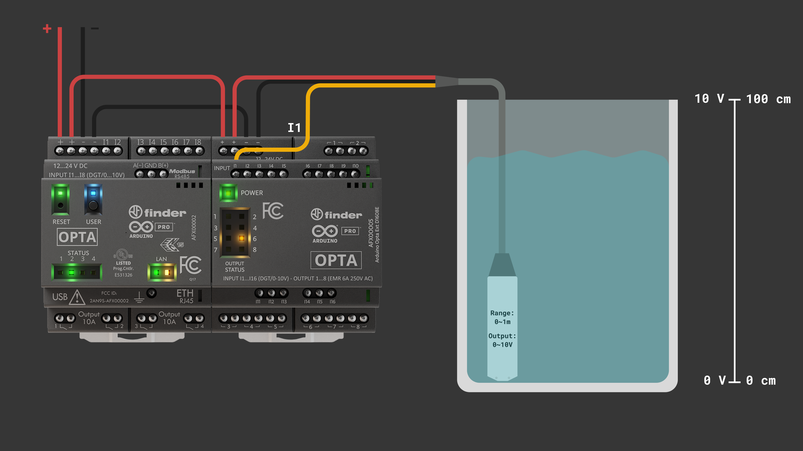


#### Outputs

The Opta™ Expansions have **8x relay outputs** accessible through terminals pairs `1` to `8`.

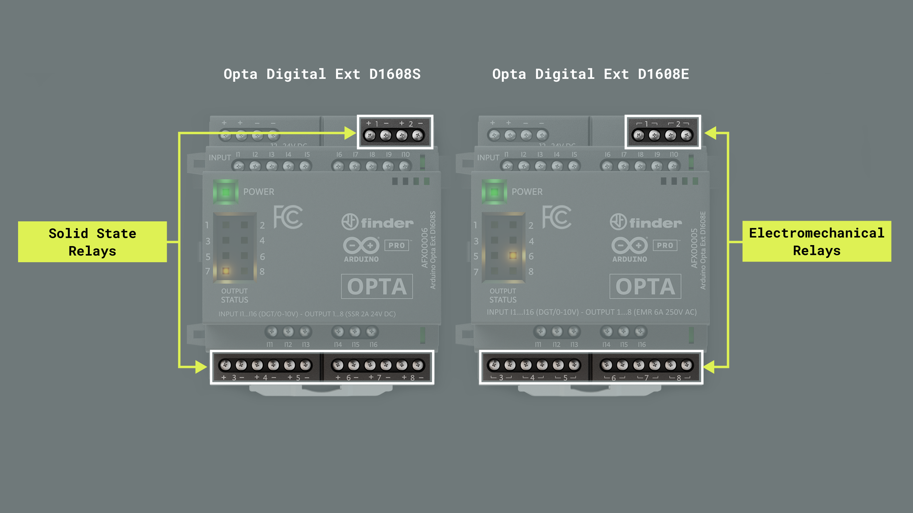

Relay Output terminals are mapped as described in the following table:

| **Opta Digital Expansion Terminal** | **Arduino Pin Mapping** |
| :---------------------------------: | :---------------------: |
|               Relay 1               |            0            |
|               Relay 2               |            1            |
|               Relay 3               |            2            |
|               Relay 4               |            3            |
|               Relay 5               |            4            |
|               Relay 6               |            5            |
|               Relay 7               |            6            |
|               Relay 8               |            7            |


The **Ext D1608E (EMR)** variant features 8x electromechanical relays with the following characteristics:

|             **Characteristics**             |                    **Details**                     |
|:-------------------------------------------:|:--------------------------------------------------:|
|              Number of outputs              | 8x Electromechanical Relays (Normally Open - SPST) |
|            Max current per relay            |                         6 A                         |
|         Max peak current per relay          |                        10 A                         |
|       Continuous current per terminal       |                         6 A                         |
|          Short-circuit protection           |             No, external fuse required             |
|             Relay rated voltage             |                      250 VAC                       |
|              Relay Max voltage              |                      400 VAC                       |
|               Rated load AC1                |                      1500 VA                       |
|          Rated load AC15 (230 VAC)          |                       300 VA                       |
|     Breaking capacity DC1: 24/110/220V      |                    6/0.2/0.12 A                     |
|           Minimum switching load            |                  500 mW (12 V/10 mA)                  |
|     Max output line length (unshielded)     |                       100 m                        |
| Relay response time from state 0 to state 1 |               5 ms for relay output                |
| Relay response time from state 1 to state 0 |               3 ms for relay output                |
|               Bounce time NO                |                        1 ms                        |
|               Bounce time NC                |                        6 ms                        |
|         Relay mechanical durability         |               10 million cycles (DC)               |
|         Relay electrical durability         |   60 thousand cycles with a resistive load (AC1)   |

The **Ext D1608S (SSR)** variant features 8x solid state relays with the following characteristics:

|          **Characteristics**          |                 **Details**                  |
|:-------------------------------------:|:--------------------------------------------:|
|           Number of outputs           | 8x Solid State Relays (Normally Open - SPST) |
|         Max current per relay         |                      3 A                      |
|      Max peak current per relay       |                 50 A (10 ms)                  |
|    Continuous current per terminal    |                      3 A                      |
|       Short-circuit protection        |          No, external fuse required          |
|          Relay rated voltage          |                    24 VDC                    |
|        Switching voltage range        |                 1.5...30 VDC                 |
|       Maximum blocking voltage        |                    33 VDC                    |
|            Rated load DC13            |                     36 W                     |
|       Minimum switching current       |                     1 mA                     |
|    Max "OFF-state" leakage current    |                   0.001 mA                   |
|     Max "OFF-state" voltage drop      |                    0.4 V                     |
| Relay response time from state 0 to 1 |           0.02 ms for relay output           |
| Relay response time from state 1 to 0 |           0.2 ms for relay output            |
|     Electrical life at rated load     |             > 10 million cycles              |


The state of an output terminal, in the Ext D1608S or Ext D1608E variant, can be set using the built-in function `digitalWrite()` as shown below:

```arduino
<ExpObject>.digitalWrite(<output>, <state>);
```
The following example will let you control all the relay outputs of every expansion connected at once, it can be found in the Opta Digital Expansions library by navigating to **File > Examples > Arduino_OptaBlueprint > setDigital**:

```arduino
#include "OptaBlue.h"

using namespace Opta;

/* -------------------------------------------------------------------------- */
void printExpansionType(ExpansionType_t t) {
/* -------------------------------------------------------------------------- */  
  if(Serial) {
    if(t == EXPANSION_NOT_VALID) {
      Serial.print("Unknown!");
    }
    else if(t == EXPANSION_OPTA_DIGITAL_MEC) {
      Serial.print("DIGITAL [Mechanical]");
    }
    else if(t == EXPANSION_OPTA_DIGITAL_STS) {
      Serial.print("DIGITAL [Solid State]");
    }
    else if(t == EXPANSION_DIGITAL_INVALID) {
      Serial.print("DIGITAL [!!Invalid!!]");
    }
    else if(t == EXPANSION_OPTA_ANALOG) {
      Serial.print("ANALOG");
    }
    else {
      Serial.print("Unknown!");
    }
  }
}

/* -------------------------------------------------------------------------- */
void printExpansionInfo(uint8_t index, ExpansionType_t type, uint8_t i2c_address) {
/* -------------------------------------------------------------------------- */
  if(Serial) {
    Serial.print("Expansion[" + String(index) + "]:");
    Serial.print(" type ");
    printExpansionType(type);
    Serial.print(", I2C address: ");
    Serial.println(i2c_address);
  }

}

/* -------------------------------------------------------------------------- */
/*                                 SETUP                                      */
/* -------------------------------------------------------------------------- */
void setup() {
   
  Serial.begin(115200);
  delay(2000);

  OptaController.begin();
}


/* -------------------------------------------------------------------------- */
/*                                  LOOP                                      */
/* -------------------------------------------------------------------------- */
void loop() {
  
 OptaController.update();

  static long int start_m = millis();
  static bool st = true;
      /* non blocking delay, this will run every 1000 ms */
  if(millis() - start_m > 500) {
    start_m = millis();

  for(int i = 0; i < OPTA_CONTROLLER_MAX_EXPANSION_NUM; i++) {
    /* ask for a digital expansion 
     * just one of these will be a valid expansion */
    DigitalMechExpansion mechExp = OptaController.getExpansion(i); 
    DigitalStSolidExpansion stsolidExp = OptaController.getExpansion(i);
    /* always check for the validity of the expansion */
    if(mechExp) {
      /* get and print information about expansion */
      printExpansionInfo(mechExp.getIndex(), mechExp.getType(),
      mechExp.getI2CAddress());

        /* this implement 2 states in the first one 
         * pin 0 2 4 6 are turned off and pin 1 3 5 7 are turned on */
        if(st) {
          mechExp.digitalWrite(0,LOW);  //turn off pin 0
          mechExp.digitalWrite(1,HIGH); //turn on pin 1
          mechExp.digitalWrite(2,LOW);  //turn off pin 2
          mechExp.digitalWrite(3,HIGH); //turn on pin 3
          mechExp.digitalWrite(4,LOW);  //turn off pin 4
          mechExp.digitalWrite(5,HIGH); //turn on pin 5
          mechExp.digitalWrite(6,LOW);  //turn off pin 6
          mechExp.digitalWrite(7,HIGH); //turn on pin 7

          /* once all pin are set send the new status to the
           * expansion */
          mechExp.updateDigitalOutputs();

          /* pin status can be sent to the expansion also setting the 
           * last parameter of digitalWrite to true (default is false) 
           * however this involves a lot of unnecessary I2C transaction */
        }
        else {
        /* in the second state 
         * pin 0 2 4 6 are turned on and pin 1 3 5 7 are turned off */
          mechExp.digitalWrite(0,HIGH);  //turn off pin 0
          mechExp.digitalWrite(1,LOW); //turn on pin 1
          mechExp.digitalWrite(2,HIGH);  //turn off pin 2
          mechExp.digitalWrite(3,LOW); //turn on pin 3
          mechExp.digitalWrite(4,HIGH);  //turn off pin 4
          mechExp.digitalWrite(5,LOW); //turn on pin 5
          mechExp.digitalWrite(6,HIGH);  //turn off pin 6
          mechExp.digitalWrite(7,LOW); //turn on pin 7

          /* once all pin are set send the new status to the
           * expansion */
          mechExp.updateDigitalOutputs();

          /* pin status can be sent to the expansion also setting the 
           * last parameter of digitalWrite to true (default is false) 
           * however this involves a lot of unnecessary I2C transaction */
        }
    }

  
    /* always check for the validity of the expansion */
    if(stsolidExp) {
      /* get and print information about expansion */
        printExpansionInfo(stsolidExp.getIndex(), stsolidExp.getType(),
        stsolidExp.getI2CAddress());

        /* if present state solid expansion will use a different pattern */
        if(st) {
          stsolidExp.digitalWrite(0,HIGH);  
          stsolidExp.digitalWrite(1,LOW);
          stsolidExp.digitalWrite(2,LOW); 
          stsolidExp.digitalWrite(3,HIGH);
          stsolidExp.digitalWrite(4,HIGH);
          stsolidExp.digitalWrite(5,LOW);
          stsolidExp.digitalWrite(6,LOW); 
          stsolidExp.digitalWrite(7,HIGH);

          /* once all pin are set send the new status to the
           * expansion */
          stsolidExp.updateDigitalOutputs();

          /* pin status can be sent to the expansion also setting the 
           * last parameter of digitalWrite to true (default is false) 
           * however this involves a lot of unnecessary I2C transaction */
        }
        else {
        /* in the second state 
         * pin 0 2 4 6 are turned on and pin 1 3 5 7 are turned off */
          stsolidExp.digitalWrite(0,LOW); 
          stsolidExp.digitalWrite(1,HIGH);
          stsolidExp.digitalWrite(2,HIGH); 
          stsolidExp.digitalWrite(3,LOW); 
          stsolidExp.digitalWrite(4,LOW); 
          stsolidExp.digitalWrite(5,HIGH); 
          stsolidExp.digitalWrite(6,HIGH); 
          stsolidExp.digitalWrite(7,LOW);

          /* once all pin are set send the new status to the
           * expansion */
          stsolidExp.updateDigitalOutputs();
        }
    } // if(stsolidExp[i]) {
  }
  if(st) {
    st = false;
  }
  else {
    st = true;
  }
 }
}
```
To fully understand the example above, we recommend you to check the [General Library Notes](#general-library-notes) section.

First, the desired relay states need to be defined with the `digitalWrite()` function, then with the `<ExpObject>.updateDigitalOutputs()` the states are sent to the expansion to control the relays with the defined states.

After the Opta™ controller is programmed with the example sketch, the relays of your expansions will be controlled as follows:

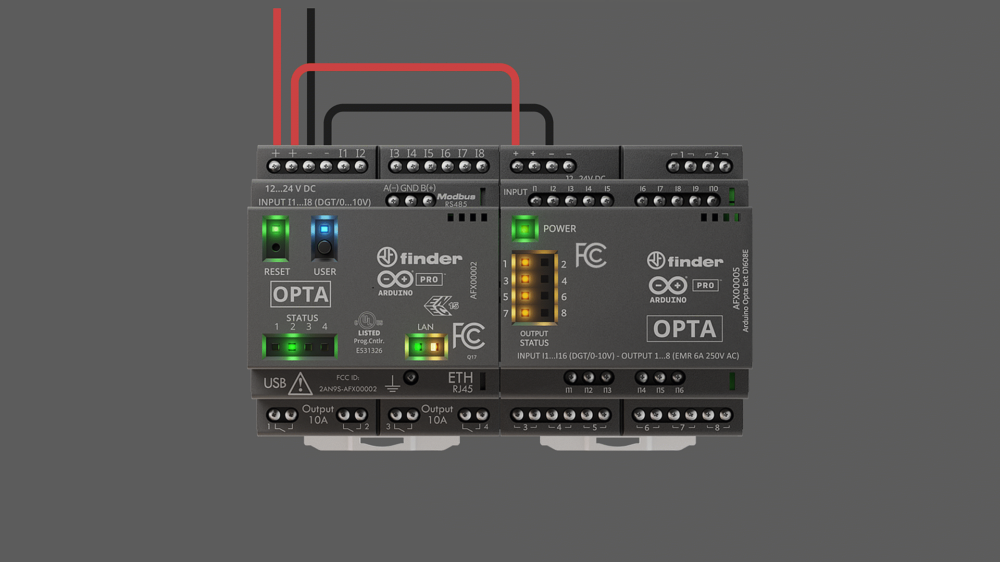

Here is an example of how to connect an AC load to the Opta Digital Ext D1608E (EMR):

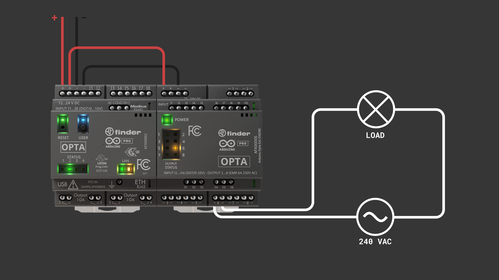

Here is an example of how to connect a DC load to the Opta Digital Ext D1608S (SSR):

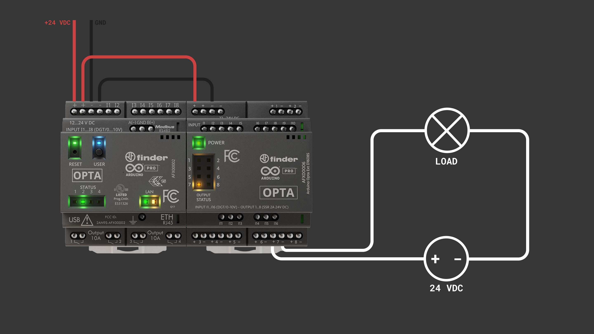

***The Opta™ controller module can support up to __5 expansion modules__. Connecting more than this may result in unexpected behavior. __Ensure the module limit is not exceeded and the Aux connector and clips are properly secured.__***

You can buy and find more information about the Opta™ Digital Expansions on the links below:

- [Opta™ Digital Expansion Product Page](https://docs.arduino.cc/hardware/opta-digital-ext)
- [Buy the Opta™ Digital Ext D1608E (EMR)](https://store.arduino.cc/products/Opta-Ext-D1608E)
- [Buy the Opta™ Digital Ext D1608S (SSR)](https://store.arduino.cc/products/Opta-Ext-D1608S)

### Opta Analog Expansions

Arduino Opta® Analog Expansions are designed to multiply your Opta® micro PLC capabilities with the addition of 8x channels that can be programmed as inputs or outputs for connecting your analog voltage, current, resistive temperature sensors or analog actuators in addition to 4x dedicated PWM outputs. It allows professionals to scale up industrial and building automation projects, diversifying the type of signals managed, while taking advantage of the Arduino ecosystem.

The Opta Expansions can be controlled by any Opta controller variant: [Opta™ Lite](https://store.arduino.cc/products/opta-lite), [Opta™ RS485](https://store.arduino.cc/products/opta-rs485) or [Opta™ WiFi](https://store.arduino.cc/products/opta-wifi).

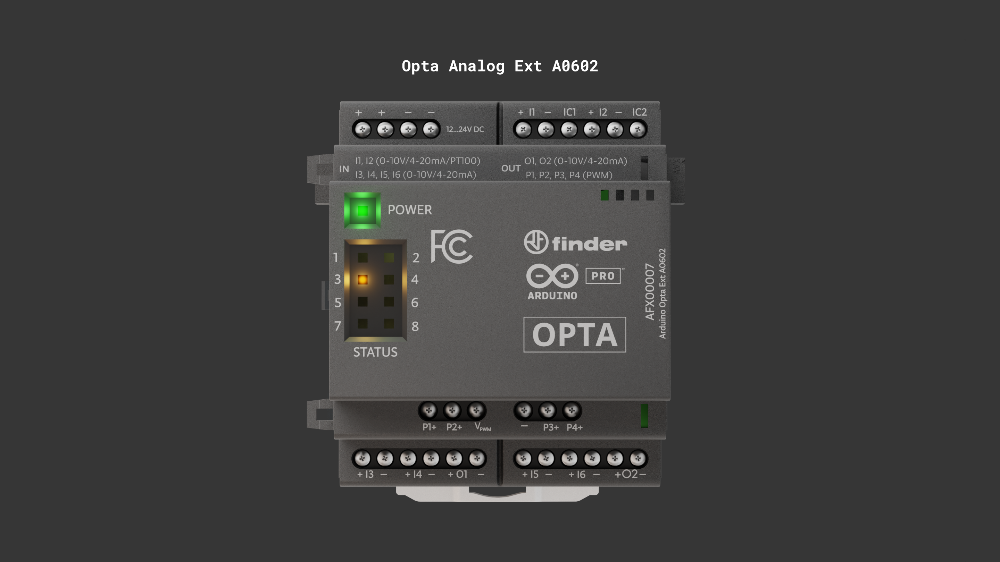

***The Opta™ expansions firmware must be updated to the latest version to ensure proper functioning. See this [section](#update-expansion-firmware) for a guided step-by-step procedure.***

#### Powering Expansions

The Opta™ Analog Expansions must be externally powered to work. See the power specifications in the table below:

|       **Property**       | **Min** | **Typ** | **Max** | **Unit** |
|:------------------------:|:-------:|:-------:|:-------:|:--------:|
|      Supply voltage      |   12    |    -    |   24    |    V     |
|    Permissible range     |  10.2   |    -    |  27.6   |    V     |
| Power consumption (12 V) |    -    |    -    |    3    |    W     |
| Power consumption (24 V) |    -    |    -    |    3    |    W     |

In the image below there is an example of the power wiring of the expansions:

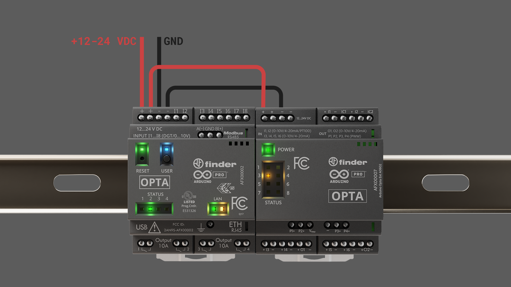

***The expansions must be externally powered to be operated and detected by the Opta™ controller.***

***The Opta™ controller module supports a maximum of __5 expansion modules__. Exceeding this limit may cause unexpected behavior. __Ensure no more than five modules are connected, and verify that the Aux connector and clips are securely installed__.***

#### Programmable Inputs

The Opta™ Analog Expansion has 8x analog channels, identified with a letter, `I` or `O`, between the two connection terminals: `+` for signal and `-` as GND, common to the other `-` terminals on the board. 
Each input can be used as:

|            **Mode**            | **Specification** |
|:------------------------------:|:-----------------:|
|     Digital input voltage      |     0...24 V      |
|      Analog input voltage      |     0...10 V      |
|      Analog input current      |     0...25 mA     |
| Analog temperature input (RTD) |     0...1 MΩ      |

***All the analog channels of the analog expansion can be used as inputs, including `O1` and `O2`, so a total of 8x analog inputs are available to the users.***

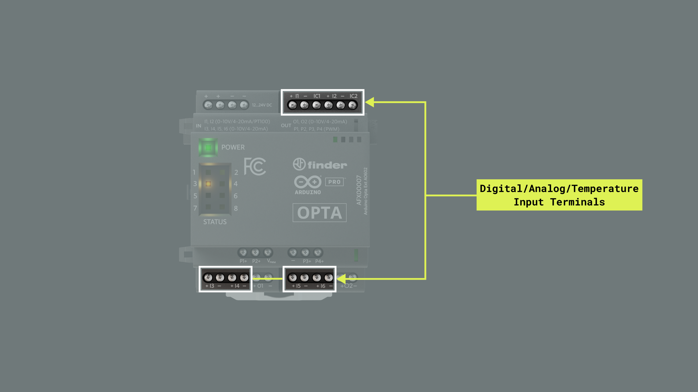


|       **Characteristics**       |                      **Details**                      |
|:-------------------------------:|:-----------------------------------------------------:|
|       Number of channels        |                          8x                           |
| Channels programmable as inputs |            I1, I2, I3, I4, O1, I5, I6, O2             |
|     Type of inputs accepted     | Digital Voltage and Analog (Voltage, Current and RTD) |
|  Inputs overvoltage protection  |                   Yes (Up to 40 V)                    |
|     Antipolarity protection     |                          No                           |
|     Analog Input resolution     |                        16 bits                        |
|         Noise Rejection         |   Optional noise rejection between 50 Hz and 60 Hz    |

Input terminals are mapped in the [Arduino_Opta_Blueprint](https://github.com/arduino-libraries/Arduino_Opta_Blueprint) library as described in the following table:

| **Opta Analog Expansion Terminal** | **Arduino Pin Mapping** |
|:----------------------------------:|:-----------------------:|
|                 I1                 |      0 or OA_CH_0       |
|                 I2                 |      1 or OA_CH_1       |
|                 I3                 |      2 or OA_CH_2       |
|                 I4                 |      3 or OA_CH_3       |
|                 O1                 |      4 or OA_CH_4       |
|                 I5                 |      5 or OA_CH_5       |
|                 I6                 |      6 or OA_CH_6       |
|                 O2                 |      7 or OA_CH_7       |

The **reading time** of digital and analog inputs is detailed in the table below:

| **Channel type** | **Number of inputs** |       **Function**       | **Time** |                                               **Notes**                                               |
|:----------------:|:--------------------:|:------------------------:|:--------:|:-----------------------------------------------------------------------------------------------------:|
|       RTD        |         One          |    `getRtd(channel)`     | ~600 µs  |                                                     -                                                 |
|      Analog      |         One          |    `getAdc(channel)`     | ~550 µs  |        Time does not change converting the value to physical unit (i.e. using `pinVoltage()`)         |
|      Analog      |     All at once      |  `updateAnalogInputs()`  | ~890 µs  |                   This function is also included in the measure `getAdc(0, false)`                    |
|     Digital      |     All at once      | `digitalRead(pin, true)` | ~480 µs  | This function even if used to read a "single pin" actually updates the value of all the digital pins. |
|     Digital      |     All at once      | `updateDigitalInputs()`  | ~480 µs  |                 This function is also included in the measure `digitalRead(0, false)`                 |


#### Digital Input Mode

The Analog Expansion input channels can be configured as digital inputs to read 0-10 V or 0-24 V digital sensors:

|       **Characteristics**       |                **Details**                |
|:-------------------------------:|:-----------------------------------------:|
|            Channels             |      I1, I2, I3, I4, O1, I5, I6, O2       |
|      Digital input voltage      |                 0...24 V                  |
|     Configurable threshold      | Yes (for supporting 0...10 V logic level) |
|      Digital input current      |     4.12 mA at 24V \| 2.05 mA at 10V      |
|     Digital input frequency     |                  300 Hz                   |
| All inputs at once reading time |                  ~480 µs                  |

The state of an input terminal configured as digital can be read using the built-in function `digitalRead()` as shown below:

```arduino
state = <ExpObject>.digitalRead(<input>);
```
Use the following wiring diagram as reference to test the example below:

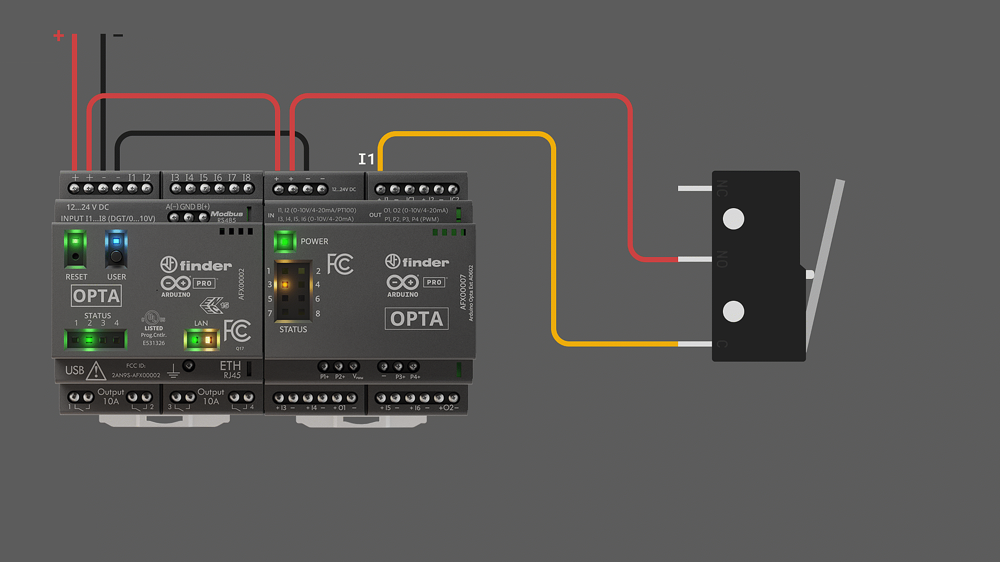

The following example will let you read all the digital inputs of every expansion connected at once, it can be found in the Opta Digital Expansions library by navigating to **File > Examples > Arduino_Opta_Blueprint > Analog > DI**:

```arduino
#include "OptaBlue.h"

#define PERIODIC_UPDATE_TIME 2000
#define DELAY_AFTER_SETUP 1000

/* -------------------------------------------------------------------------- */
void printExpansionType(ExpansionType_t t) {
  /* -------------------------------------------------------------------------- */
  if (t == EXPANSION_NOT_VALID) {
    Serial.print("Unknown!");
  } else if (t == EXPANSION_OPTA_DIGITAL_MEC) {
    Serial.print("Opta --- DIGITAL [Mechanical]  ---");
  } else if (t == EXPANSION_OPTA_DIGITAL_STS) {
    Serial.print("Opta --- DIGITAL [Solid State] ---");
  } else if (t == EXPANSION_DIGITAL_INVALID) {
    Serial.print("Opta --- DIGITAL [!!Invalid!!] ---");
  } else if (t == EXPANSION_OPTA_ANALOG) {
    Serial.print("~~~ Opta  ANALOG ~~~");
  } else {
    Serial.print("Unknown!");
  }
}

/* -------------------------------------------------------------------------- */
void printExpansionInfo() {
  /* -------------------------------------------------------------------------- */
  static long int start = millis();

  if (millis() - start > 5000) {
    start = millis();
    Serial.print("Number of expansions: ");
    Serial.println(OptaController.getExpansionNum());

    for (int i = 0; i < OptaController.getExpansionNum(); i++) {
      Serial.print("Expansion n. ");
      Serial.print(i);
      Serial.print(" type ");
      printExpansionType(OptaController.getExpansionType(i));
      Serial.print(" I2C address ");
      Serial.println(OptaController.getExpansionI2Caddress(i));
    }
  }
}

/* -------------------------------------------------------------------------- */
/*                                 SETUP                                      */
/* -------------------------------------------------------------------------- */
void setup() {
  /* -------------------------------------------------------------------------- */
  Serial.begin(115200);
  delay(2000);
  Serial.println("*** Opta Analog Digital Input example ***");

  OptaController.begin();

  for (int i = 0; i < OptaController.getExpansionNum(); i++) {

    for (int k = 0; k < OA_AN_CHANNELS_NUM; k++) {
      /* all channels are initialized in the same way as VOLTAGE ADC */
      AnalogExpansion::beginChannelAsDigitalInput(OptaController, i,  // the device
                                                  k,                  // the output channel you are using
                                                  true,               // filter comparator
                                                  false,              // invert comparator
                                                  true,               // use simple debounce algorithm
                                                  OA_DI_SINK_1,       // sink 120 uA
                                                  OA_DI_DEB_TIME_5,   // ~ 42 ms
                                                  false,              // use fix threshold
                                                  8.0,                // threshold at 8 V
                                                  24.0);              // unused in this c    }
    }
  }
}

/* the optaAnalogTask function runs every 2000 ms it set the pwm for all the
 * channels from with a period equal to 10 ms and a variable duty cycle from 10%
 * to 70% */

/* -------------------------------------------------------------------------- */
void optaAnalogTask() {
  /* -------------------------------------------------------------------------- */

  static long int start = millis();
  static bool stop_pwm = false;
  if (millis() - start > PERIODIC_UPDATE_TIME) {
    start = millis();

    for (int i = 0; i < OptaController.getExpansionNum(); i++) {
      AnalogExpansion exp = OptaController.getExpansion(i);
      if (exp) {
        for (int j = 0; j < 8; j++) {
          int value = exp.digitalRead((uint8_t)j, true);
          Serial.print("DI channel ");
          Serial.print(j);
          Serial.print(" value ");
          Serial.println(value);
        }
        Serial.println();
      }
    }
  }
}

/* -------------------------------------------------------------------------- */
/*                                  LOOP                                      */
/* -------------------------------------------------------------------------- */
void loop() {
  /* -------------------------------------------------------------------------- */
  OptaController.update();
  optaAnalogTask();
}

```

To fully understand the example above, we recommend you to check the [General Library Notes](#general-library-notes) section.

The function `optaAnalogTask()` updates all the inputs with their current states and prints out the values.

After the Opta™ controller is programmed with the example sketch, open the Arduino IDE Serial Monitor and you will see each input state as follows:

```
DI channel 0 value 1
DI channel 1 value 0
DI channel 2 value 0
DI channel 3 value 0
DI channel 4 value 0
DI channel 5 value 0
DI channel 6 value 0
DI channel 7 value 0
```


#### Analog Voltage Input Mode

The Analog Expansion input channels can be configured for 0-10 V analog sensors. 

|       **Characteristics**       |                      **Details**                       |
|:-------------------------------:|:------------------------------------------------------:|
|            Channels             |             I1, I2, I3, I4, O1, I5, I6, O2             |
|      Analog input voltage       |                        0...10 V                        |
|     Analog Input resolution     |                        16 bits                         |
|     Analog input LSB value      |                       152.59 uV                        |
|            Accuracy             |                         +/- 1%                         |
|          Repeatability          |                         +/- 1%                         |
|         Input impedance         | Min: 175 kΩ (when internal 200 kΩ resistor is enabled) |
|     One input reading time      |                        ~550 µs                         |
| All inputs at once reading time |                        ~890 µs                         |

The raw value of an input terminal configured as analog can be read using the built-in function `analogRead()` as shown below:

```arduino
uint16_t raw_adc = <ExpObject>.analogRead(<input>);
```
Also, it can be directly converted to a voltage reading using the `pinVoltage()` function as:

```arduino
float value =	exp.pinVoltage(<input>);
```

Use the following wiring diagram as reference to test the example below:

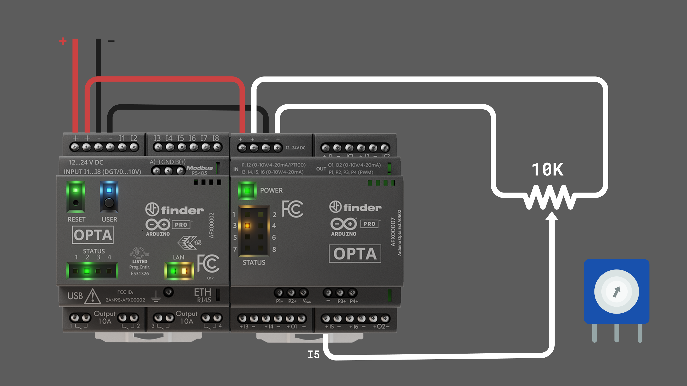

The following example will let you read all the analog inputs of every expansion connected at once, it can be found in the Opta Analog Expansions library by navigating to **File > Examples > Arduino_Opta_Blueprint > Analog > ADC**:

```arduino
#include "OptaBlue.h"

#define PERIODIC_UPDATE_TIME 500
#define DELAY_AFTER_SETUP 5000

using namespace Opta;


/* -------------------------------------------------------------------------- */
void printExpansionType(ExpansionType_t t) {
/* -------------------------------------------------------------------------- */
  if(t == EXPANSION_NOT_VALID) {
    Serial.print("Unknown!");
  }
  else if(t == EXPANSION_OPTA_DIGITAL_MEC) {
    Serial.print("Opta --- DIGITAL [Mechanical]  ---");
  }
  else if(t == EXPANSION_OPTA_DIGITAL_STS) {
    Serial.print("Opta --- DIGITAL [Solid State] ---");
  }
  else if(t == EXPANSION_DIGITAL_INVALID) {
    Serial.print("Opta --- DIGITAL [!!Invalid!!] ---");
  }
  else if(t == EXPANSION_OPTA_ANALOG) {
    Serial.print("~~~ Opta  ANALOG ~~~");
  }
  else {
    Serial.print("Unknown!");
  }
}

/* -------------------------------------------------------------------------- */
void printExpansionInfo() {
/* -------------------------------------------------------------------------- */
  static long int start = millis();
  
  if(millis() - start > 5000) {
    start = millis();
    Serial.print("Number of expansions: ");
    Serial.println(OptaController.getExpansionNum());

    for(int i = 0; i < OptaController.getExpansionNum(); i++) {
      Serial.print("Expansion n. ");
      Serial.print(i);
      Serial.print(" type ");
      printExpansionType(OptaController.getExpansionType(i));
      Serial.print(" I2C address ");
      Serial.println(OptaController.getExpansionI2Caddress(i));
    }
  }  
}

/* -------------------------------------------------------------------------- */
/*                                 SETUP                                      */
/* -------------------------------------------------------------------------- */
void setup() {
/* -------------------------------------------------------------------------- */
  Serial.begin(115200);
  delay(2000);

  OptaController.begin();
  

  for(int i = 0; i < OptaController.getExpansionNum(); i++) {

    for(int k = 0; k < OA_AN_CHANNELS_NUM;k++){
      /* all channels are initialized in the same way as VOLTAGE ADC */
      AnalogExpansion::beginChannelAsAdc(OptaController, i, // the device
                            k, // the output channel you are using
			    OA_VOLTAGE_ADC, // adc type
			    true, // enable pull down
			    false, // disable rejection
			    false, // disable diagnostic
			    0); // disable averaging
    }
  }

}


/* -------------------------------------------------------------------------- */
void optaAnalogTask() {
/* -------------------------------------------------------------------------- */
  static long int start = millis();
  if(millis() - start > PERIODIC_UPDATE_TIME) {
    start = millis();
    for(int i = 0; i < OptaController.getExpansionNum(); i++) {
      AnalogExpansion exp = OptaController.getExpansion(i);
      
      if(exp) {  
	      Serial.println("\nAnalog Expansion n. " +  String(exp.getIndex()));
        
  
        for(int j = 0; j < OA_AN_CHANNELS_NUM; j++) {
          Serial.print(" - ch " + String(j));
	        int value =	exp.analogRead((uint8_t)j);
	        Serial.println(" -> ADC " + String(value));
	      }
        Serial.println();
      }
    }
  }
}

/* -------------------------------------------------------------------------- */
/*                                  LOOP                                      */
/* -------------------------------------------------------------------------- */
void loop() {
/* -------------------------------------------------------------------------- */    
  OptaController.update();
  optaAnalogTask();

}
```

After the Opta™ controller is programmed with the example sketch, open the Arduino IDE Serial Monitor and you will see each input reading as follows:

```
Analog Expansion n. 0
 - ch 0 -> ADC 0
 - ch 1 -> ADC 0
 - ch 2 -> ADC 0
 - ch 3 -> ADC 0
 - ch 4 -> ADC 0
 - ch 5 -> ADC 25112
 - ch 6 -> ADC 0
 - ch 7 -> ADC 0
```

To fully understand the example above, we recommend you to check the [General Library Notes](#general-library-notes) section.

The expansion channels are configured as **analog voltage inputs** using the function `beginChannelAsAdc()` alongside the following parameters:

```arduino
AnalogExpansion::beginChannelAsAdc(OptaController, // the expansion object
                i, // the device (connected expansion index from 0 to 5)
                k, // the output channel you are using (0 to 7)
			    OA_VOLTAGE_ADC, // adc type (voltage input)
			    true, // enable pull down
			    false, // disable rejection
			    false, // disable diagnostic
			    0); // disable averaging
```

You can also use the simplified dedicated method using the function `beginChannelAsVoltageAdc()` as follows:

```arduino
exp.beginChannelAsVoltageAdc(<exp channel>); // pass the desired input as argument
```
The function `optaAnalogTask()` reads all the analog input raw ADC values and prints out them. If you want to show the voltage reading instead use the following function:

```arduino
//Change 
int value =	exp.analogRead((uint8_t)j); // get the raw ADC reading
//for
float value = exp.pinVoltage((uint8_t)j); // get the ADC reading and returns it as a voltage
```

#### Analog Current Input Mode

The Analog Expansion input channels can be configured for current loop instrumentation using the 0/4-20 mA standard. 

|            **Characteristics**            |                 **Details**                 |
|:-----------------------------------------:|:-------------------------------------------:|
|                 Channels                  |       I1, I2, I3, I4, O1, I5, I6, O2        |
|           Analog input current            |                  0...25 mA                  |
|          Analog input LSB value           |                  381.5 nA                   |
| Short circuit current limit (per channel) | Min: 25 mA, Max 35 mA (externally powered)  |
| Programmable current limit (per channel)  |      0.5 mA to 24.5 mA (loop powered)       |
|                 Accuracy                  |                   +/- 1%                    |
|               Repeatability               |                   +/- 1%                    |
|          One input reading time           |                   ~550 µs                   |
|      All inputs at once reading time      |                   ~890 µs                   |

The current of an input terminal configured in current mode can be read using the built-in function `pinCurrent()` as shown below:

```arduino
float value = exp.pinCurrent(<input>);
```
Use the following wiring diagram as reference to test the example below:

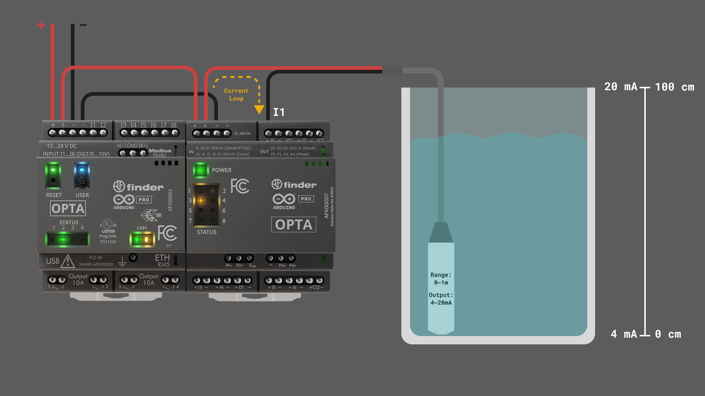

The following example will let you measure the current in all the analog inputs of every expansion connected at once.

***This sketch is a __simplified version__ created for learning purposes of the one found in __File > Examples > Arduino_Opta_Blueprint > Analog > ADC__. Please check the example available at the library in case you need to know more.***

Copy and paste this code on a new sketch in your Arduino IDE:

```arduino
#include "OptaBlue.h"

#define PERIODIC_UPDATE_TIME 500
#define DELAY_AFTER_SETUP 5000

using namespace Opta;


/* -------------------------------------------------------------------------- */
void printExpansionType(ExpansionType_t t) {
/* -------------------------------------------------------------------------- */
  if(t == EXPANSION_NOT_VALID) {
    Serial.print("Unknown!");
  }
  else if(t == EXPANSION_OPTA_DIGITAL_MEC) {
    Serial.print("Opta --- DIGITAL [Mechanical]  ---");
  }
  else if(t == EXPANSION_OPTA_DIGITAL_STS) {
    Serial.print("Opta --- DIGITAL [Solid State] ---");
  }
  else if(t == EXPANSION_DIGITAL_INVALID) {
    Serial.print("Opta --- DIGITAL [!!Invalid!!] ---");
  }
  else if(t == EXPANSION_OPTA_ANALOG) {
    Serial.print("~~~ Opta  ANALOG ~~~");
  }
  else {
    Serial.print("Unknown!");
  }
}

/* -------------------------------------------------------------------------- */
void printExpansionInfo() {
/* -------------------------------------------------------------------------- */
  static long int start = millis();
  
  if(millis() - start > 5000) {
    start = millis();
    Serial.print("Number of expansions: ");
    Serial.println(OptaController.getExpansionNum());

    for(int i = 0; i < OptaController.getExpansionNum(); i++) {
      Serial.print("Expansion n. ");
      Serial.print(i);
      Serial.print(" type ");
      printExpansionType(OptaController.getExpansionType(i));
      Serial.print(" I2C address ");
      Serial.println(OptaController.getExpansionI2Caddress(i));
    }
  }  
}

/* -------------------------------------------------------------------------- */
/*                                 SETUP                                      */
/* -------------------------------------------------------------------------- */
void setup() {
/* -------------------------------------------------------------------------- */
  Serial.begin(115200);
  delay(2000);

  OptaController.begin();
  

  for(int i = 0; i < OptaController.getExpansionNum(); i++) {

    for(int k = 0; k < OA_AN_CHANNELS_NUM;k++){
      /* all channels are initialized in the same way as VOLTAGE ADC */
      AnalogExpansion::beginChannelAsAdc(OptaController, i, // the device
                            k, // the output channel you are using
			    OA_CURRENT_ADC, // adc type
			    false, // enable pull down
			    false, // disable rejection
			    false, // disable diagnostic
			    0); // disable averaging
    }
  }

}


/* -------------------------------------------------------------------------- */
void optaAnalogTask() {
/* -------------------------------------------------------------------------- */
  static long int start = millis();
  if(millis() - start > PERIODIC_UPDATE_TIME) {
    start = millis();
    for(int i = 0; i < OptaController.getExpansionNum(); i++) {
      AnalogExpansion exp = OptaController.getExpansion(i);
      
      if(exp) {  
	      Serial.println("\nAnalog Expansion n. " +  String(exp.getIndex()));
        
        
        for(int j = 0; j < OA_AN_CHANNELS_NUM; j++) {
          Serial.print(" - ch " + String(j));
	        float value =	exp.pinCurrent((uint8_t)j);
	        Serial.println(" -> Current " + String(value) + " mA");
	      }
        Serial.println();
      }
    }
  }
}

/* -------------------------------------------------------------------------- */
/*                                  LOOP                                      */
/* -------------------------------------------------------------------------- */
void loop() {
/* -------------------------------------------------------------------------- */    
  OptaController.update();
  optaAnalogTask();

}
```
After the Opta™ controller is programmed with the example sketch, open the Arduino IDE Serial Monitor and you will see each input reading as follows:

```
Analog Expansion n. 0
 - ch 0 -> Current 18.20 mA
 - ch 1 -> Current 0.00 mA
 - ch 2 -> Current 0.00 mA
 - ch 3 -> Current 0.00 mA
 - ch 4 -> Current 0.00 mA
 - ch 5 -> Current 0.00 mA
 - ch 6 -> Current 0.00 mA
 - ch 7 -> Current 0.00 mA
```

To fully understand the example above, we recommend you to check the [General Library Notes](#general-library-notes) section.

The expansion channels are configured as **analog current inputs** using the function `beginChannelAsAdc()` alongside the following parameters:

```arduino
AnalogExpansion::beginChannelAsAdc(OptaController, // the expansion object
                i, // the device (connected expansion index from 0 to 5)
                k, // the output channel you are using (0 to 7)
			    OA_CURRENT_ADC, // adc type (current input)
			    false, // enable pull down
			    false, // disable rejection
			    false, // disable diagnostic
			    0); // disable averaging
```

You can also use the simplified dedicated method using the function `beginChannelAsCurrentAdc()` as follows:

```arduino
exp.beginChannelAsCurrentAdc(<exp channel>); // pass the desired input as argument
```

The function `optaAnalogTask()` reads all the analog input current values and prints out them.

There is another approach for interfacing 4-20 mA sensors that consists of defining the channel as a **voltage DAC** and adding a **current ADC** to the same channel, connecting the sensor to the channel and measuring the current of the loop. 

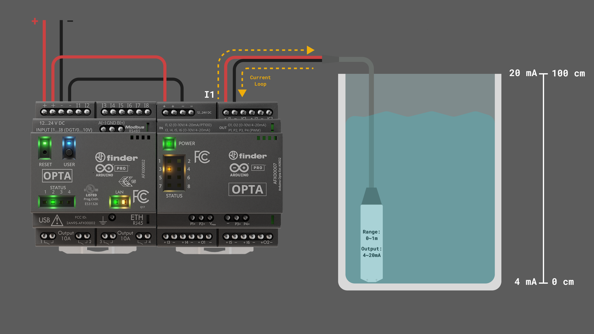

Use the following example sketch instead:

```arduino
#include "OptaBlue.h"

#define PERIODIC_UPDATE_TIME 2000
#define DELAY_AFTER_SETUP 200

#define SENSOR_CH 0 // define the sensor channel 

/* -------------------------------------------------------------------------- */
void printExpansionType(ExpansionType_t t) {
  /* -------------------------------------------------------------------------- */
  if (t == EXPANSION_NOT_VALID) {
    Serial.print("Unknown!");
  } else if (t == EXPANSION_OPTA_DIGITAL_MEC) {
    Serial.print("Opta --- DIGITAL [Mechanical]  ---");
  } else if (t == EXPANSION_OPTA_DIGITAL_STS) {
    Serial.print("Opta --- DIGITAL [Solid State] ---");
  } else if (t == EXPANSION_DIGITAL_INVALID) {
    Serial.print("Opta --- DIGITAL [!!Invalid!!] ---");
  } else if (t == EXPANSION_OPTA_ANALOG) {
    Serial.print("~~~ Opta  ANALOG ~~~");
  } else {
    Serial.print("Unknown!");
  }
}

/* -------------------------------------------------------------------------- */
void printExpansionInfo() {
  /* -------------------------------------------------------------------------- */
  static long int start = millis();

  if (millis() - start > 5000) {
    start = millis();
    Serial.print("Number of expansions: ");
    Serial.println(OptaController.getExpansionNum());

    for (int i = 0; i < OptaController.getExpansionNum(); i++) {
      Serial.print("Expansion n. ");
      Serial.print(i);
      Serial.print(" type ");
      printExpansionType(OptaController.getExpansionType(i));
      Serial.print(" I2C address ");
      Serial.println(OptaController.getExpansionI2Caddress(i));
    }
  }
}

/* -------------------------------------------------------------------------- */
/*                                 SETUP                                      */
/* -------------------------------------------------------------------------- */
void setup() {
  /* -------------------------------------------------------------------------- */
  Serial.begin(115200);
  delay(2000);

  OptaController.begin();

  for (int i = 0; i < OptaController.getExpansionNum(); i++) {
    AnalogExpansion exp = OptaController.getExpansion(i);

    if (exp) {
      // start the channel as a voltage DAC 
      exp.beginChannelAsDac(SENSOR_CH,        //channel index
                            OA_VOLTAGE_DAC,   //DAC type
                            false,            //limit current (set to false so it can power the sensor current loop)
                            false,            //No slew rate
                            OA_SLEW_RATE_0);  //Slew rate setting.
      
      Serial.println("Setting DAC output to 11 V on expansion n. " + String(exp.getIndex()));
      exp.pinVoltage(SENSOR_CH, 11.0, true);  // set channel 0 output to 11 V (Max voltage output)
      delay(200); // give time for the channel to be set up
      // add a current ADC to the same channel
      exp.addCurrentAdcOnChannel(SENSOR_CH);
      
    }
  }
}


/* -------------------------------------------------------------------------- */
void optaAnalogTask() {
  /* -------------------------------------------------------------------------- */

  static long int start = millis();

  /* using this the code inside the if will run every PERIODIC_UPDATE_TIME ms
     assuming the function is called repeatedly in the loop() function */

  if (millis() - start > PERIODIC_UPDATE_TIME) {
    start = millis();


    for (int i = 0; i < OptaController.getExpansionNum(); i++) {
      AnalogExpansion exp = OptaController.getExpansion(i);
      if (exp) {
        float value = exp.pinCurrent(SENSOR_CH);
        Serial.println("- ch" + String(SENSOR_CH) + " -> Current " + String(abs(value)) + " mA");
      }
    }
  }
}

/* -------------------------------------------------------------------------- */
/*                                  LOOP                                      */
/* -------------------------------------------------------------------------- */
void loop() {
  /* -------------------------------------------------------------------------- */
  OptaController.update();
  //printExpansionInfo();
  optaAnalogTask();
}

```
After the Opta™ controller is programmed with the example sketch, open the Arduino IDE Serial Monitor and you will see each input reading as follows:

```
Setting DAC output to 11 V on expansion n. 0
- ch0 -> Current 18.20 mA
- ch0 -> Current 18.20 mA
- ch0 -> Current 18.20 mA
- ch0 -> Current 18.20 mA
```

The key section of the example from above is in the `setup()` function, specifically in the way we initialize the channel to be used for the measurement:

```arduino
// start the channel as a voltage DAC 
      exp.beginChannelAsDac(SENSOR_CH,        //channel index
                            OA_VOLTAGE_DAC,   //DAC type
                            false,            //limit current (set to false so it can power the sensor current loop)
                            false,            //No slew rate
                            OA_SLEW_RATE_0);  //Slew rate setting.
      
      Serial.println("Setting DAC output to 11 V on expansion n. " + String(exp.getIndex()));
      exp.pinVoltage(SENSOR_CH, 11.0, true);  // set channel 0 output to 11 V (Max voltage output)
      delay(200); // give time for the channel to be set up
      // add a current ADC to the same channel
      exp.addCurrentAdcOnChannel(SENSOR_CH);
```

First, the channel is initialized as a voltage DAC with the "limit current" parameter disabled, a voltage is set in the output that will power the current loop and then a current ADC is added to the same channel, this way we can use the `pinCurrent()` function to measure the current output of the sensor.


#### Analog RTD Input Mode

The Analog Expansion input channels can be used for temperature metering with **PT100** RTDs.

|  **Characteristics**   |          **Details**           |
|:----------------------:|:------------------------------:|
|    3 wires channels    |             I1, I2             |
|    2 wires channels    | I1, I2, I3, I4, O1, I5, I6, O2 |
|      Input range       |            0...1 MΩ            |
|      Bias voltage      |             2.5 V              |
| One input reading time |            ~600 µs             |


2 wires RTDs can be connected to any of the eight channels as follows:

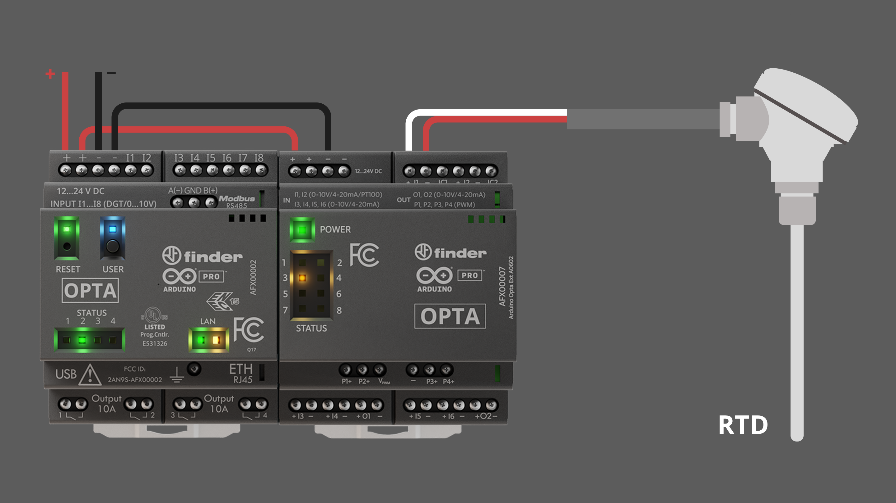

3 wires RTDs has generally two wires with the same color.

- Connect the two wires with the same color to the `-` and the `ICx` screw terminals respectively.
- Connect the wire with a different color to the `+` screw terminal.

***3 wires RTD can only be measured by channels __I1__ and __I2__.***

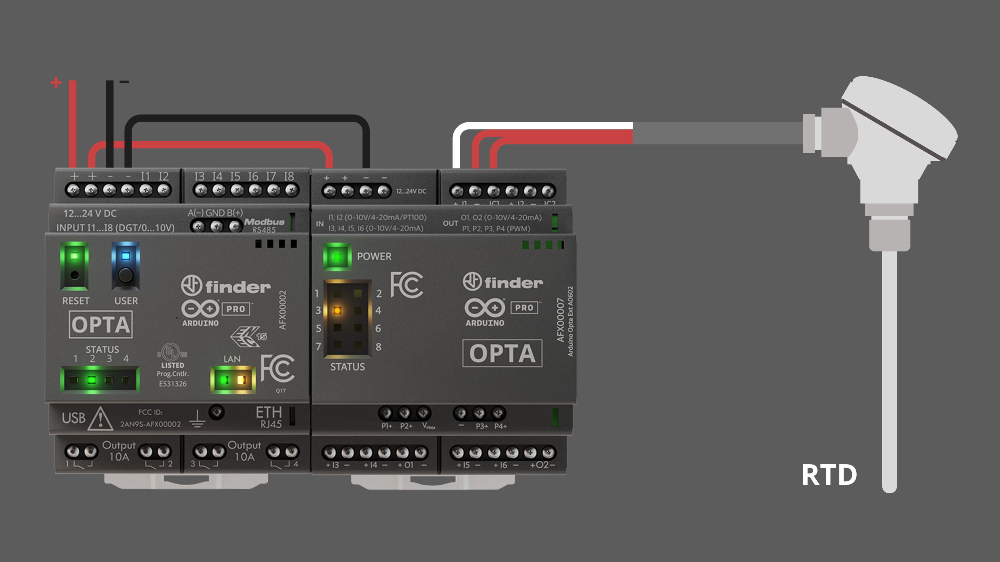

To perform measurements of an input terminal configured as RTD use the built-in function `getRtd()` as shown below:

```arduino
float value = exp.getRtd(<input>);  // this returns the resistive value measured in the input in ohms
```

For the following example a 2 wires **PT100** will be used connected to **I1**. The sketch below will let you measure the resistance and convert it to a temperature value.

***This sketch is a __simplified version__ created for learning purposes of the one found in __File > Examples > Arduino_Opta_Blueprint > Analog > RTD__. Please check the example available at the library in case you need to know more.***

Copy and paste this code on a new sketch in your Arduino IDE:

```arduino
#include "OptaBlue.h"

#define PERIODIC_UPDATE_TIME 2000
#define DELAY_AFTER_SETUP 1000

// RTD constants
float a = 0.0039083;
float b = -0.0000005775;

/* -------------------------------------------------------------------------- */
void printExpansionType(ExpansionType_t t) {
  /* -------------------------------------------------------------------------- */
  if (t == EXPANSION_NOT_VALID) {
    Serial.print("Unknown!");
  } else if (t == EXPANSION_OPTA_DIGITAL_MEC) {
    Serial.print("Opta --- DIGITAL [Mechanical]  ---");
  } else if (t == EXPANSION_OPTA_DIGITAL_STS) {
    Serial.print("Opta --- DIGITAL [Solid State] ---");
  } else if (t == EXPANSION_DIGITAL_INVALID) {
    Serial.print("Opta --- DIGITAL [!!Invalid!!] ---");
  } else if (t == EXPANSION_OPTA_ANALOG) {
    Serial.print("~~~ Opta  ANALOG ~~~");
  } else {
    Serial.print("Unknown!");
  }
}

/* -------------------------------------------------------------------------- */
void printExpansionInfo() {
  /* -------------------------------------------------------------------------- */
  static long int start = millis();

  if (millis() - start > 5000) {
    start = millis();
    Serial.print("Number of expansions: ");
    Serial.println(OptaController.getExpansionNum());

    for (int i = 0; i < OptaController.getExpansionNum(); i++) {
      Serial.print("Expansion n. ");
      Serial.print(i);
      Serial.print(" type ");
      printExpansionType(OptaController.getExpansionType(i));
      Serial.print(" I2C address ");
      Serial.println(OptaController.getExpansionI2Caddress(i));
    }
  }
}

/* -------------------------------------------------------------------------- */
/*                                 SETUP                                      */
/* -------------------------------------------------------------------------- */
void setup() {
  /* -------------------------------------------------------------------------- */
  Serial.begin(115200);
  delay(2000);
  Serial.println("*** Opta Analog RTD example ***");

  OptaController.begin();

  for (int i = 0; i < OptaController.getExpansionNum(); i++) {

    for (int k = 0; k < OA_AN_CHANNELS_NUM; k++) {
      /* all channels are initialized in the same way as RTD */
      AnalogExpansion::beginChannelAsRtd(OptaController, i,  // the device
                                         k,                  // the output channel you are using
                                         false,              // use 3 wire RTD
                                         0.8);               // current used on RTD in mA
    }
  }
}

/* -------------------------------------------------------------------------- */
void optaAnalogTask() {
  /* -------------------------------------------------------------------------- */

  static long int start = millis();
  if (millis() - start > PERIODIC_UPDATE_TIME) {
    start = millis();

    for (int i = 0; i < OptaController.getExpansionNum(); i++) {
      AnalogExpansion aexp = OptaController.getExpansion(i);
      if (aexp) {
        Serial.println("Expansion n. " + String(aexp.getIndex()));
        for (int j = 0; j < 8; j++) {
          float value = aexp.getRtd((uint8_t)j);
          if (value != -1.00 && value < 1000000.0) {   // if the channel reading is valid
            Serial.print("ch ");
            Serial.print(j);
            Serial.print(" -> ");
            Serial.print(value);
            Serial.print(" Ω");
            float temp = (-(1.0 / 100.0) * (50.0 * a - 10*sqrt(b * value + 25.0 * pow(a, 2.0) - 100.0 * b))) / b;
            Serial.print(" -> ");
            Serial.print(temp);
            Serial.print(" C");
            Serial.println();
          }
        }
      }
    }
  }
}

/* -------------------------------------------------------------------------- */
/*                                  LOOP                                      */
/* -------------------------------------------------------------------------- */
void loop() {
  /* -------------------------------------------------------------------------- */
  OptaController.update();
  //printExpansionInfo();
  optaAnalogTask();
}
```

After the Opta™ controller is programmed with the example sketch, open the Arduino IDE Serial Monitor and you will see each input reading as follows:

```
Expansion n. 0
ch 0 -> 109.73 Ω -> 24.99 C
```

To fully understand the example above, we recommend you to check the [General Library Notes](#general-library-notes) section.

The expansion channels are configured as **RTD inputs** using the function `beginChannelAsRtd` alongside the following parameters:

```arduino
AnalogExpansion::beginChannelAsRtd(OptaController, i,  // the device
                                         k,                  // the output channel you are using
                                         false,              // use 3 wire RTD
                                         0.8);               // current used on RTD in mA
```

The current parameter in the function above will depend on your RTD type, study your sensor datasheet to find the more suitable for it, in this case, the **PT100** used recommends a **0.8 mA** current. 

The function `optaAnalogTask()` reads all the RTDs connected and converts their resistive value to a temperature.

#### Programmable Outputs

|         **Characteristics**         |               **Details**                |
|:-----------------------------------:|:----------------------------------------:|
|         Number of channels          | 8x, (2x used simultaneously recommended) |
|  Channels programmable as outputs   |      I1, I2, I3, I4, O1, I5, I6, O2      |
|      Type of outputs supported      |        Analog voltage and current        |
|           DAC resolution            |                 13 bits                  |
| Charge pump for zero voltage output |                   Yes                    |
|        Number of PWM outputs        |                    4x                    |

The Opta™ Analog Expansions have **eight analog programmable outputs** accessible through terminals `I1` to `I6` and `O1` to `O2` that can be used as:

|            **Mode**            |             **Specification**             |
|:------------------------------:|:-----------------------------------------:|
|      Analog output voltage      |                 0...11 V                  |
|      Analog output current      |                 0...25 mA                 |

Analog output terminals are mapped as described in the following table:

| **Opta Analog Expansion Terminal** | **Arduino Pin Mapping** |
|:----------------------------------:|:-----------------------:|
|                 I1                 |      0 or OA_CH_0       |
|                 I2                 |      1 or OA_CH_1       |
|                 I3                 |      2 or OA_CH_2       |
|                 I4                 |      3 or OA_CH_3       |
|                 O1                 |      4 or OA_CH_4       |
|                 I5                 |      5 or OA_CH_5       |
|                 I6                 |      6 or OA_CH_6       |
|                 O2                 |      7 or OA_CH_7       |


***All available channels of the analog expansion can be used as outputs, including `I1` to `I6`, so there are 8 accessible analog outputs actually, but due to power dissipation limitations, it is recommended to have up to 2 channels set at output at the same time.***

***At 25°C of ambient temperature, all the 8 channels set as outputs have been tested at the same time while outputting more than 24 mA at 10 V each (>0.24W per channel).***

Also, it features **4 PWM outputs** accessible through terminals `P1` to `P4`. 

PWM output terminals are mapped in the [Arduino_Opta_Blueprint](https://github.com/arduino-libraries/Arduino_Opta_Blueprint) library as described in the following table:

| **Opta Analog Expansion Terminal** | **Arduino Pin Mapping** |
|:----------------------------------:|:-----------------------:|
|                 P1                 |    8 or OA_PWM_CH_0     |
|                 P2                 |    9 or OA_PWM_CH_1     |
|                 P3                 |    10 or OA_PWM_CH_2    |
|                 P4                 |    11 or OA_PWM_CH_3    |

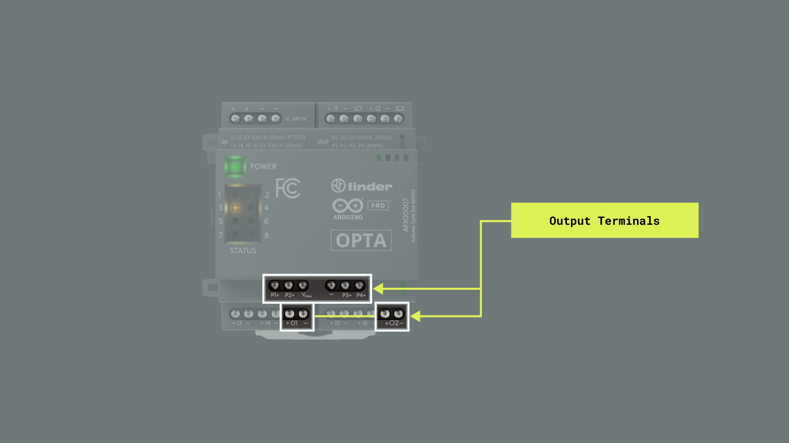

The **writing time** of analog outputs is detailed in the table below:

| **Channel type** | **Number of outputs** |           **Function**           | **Time** |                                                  **Notes**                                                   |
|:----------------:|:---------------------:|:--------------------------------:|:--------:|:------------------------------------------------------------------------------------------------------------:|
|       DAC        |          One          |  `setDac(channel, value, true)`  | ~560 µs  |                                                                                                              |
|       DAC        |      All at once      |     `updateAnalogOutputs()`      | ~960 µs  |                This function is also included in the function `setDac(channel, value, false)`                |
|       PWM        |          One          | `setPwm(channel, period, pulse)` | ~700 µs  | In case the new setting is equal to the old one no message is sent and the function execution takes a few µs |


#### Analog Voltage Output Mode

This output mode lets you control voltage-driven actuators or communicate with other devices through analog voltages.

|             **Characteristics**              |                                                          **Details**                                                          |
|:--------------------------------------------:|:-----------------------------------------------------------------------------------------------------------------------------:|
|                   Channels                   |                                                I1, I2, I3, I4, O1, I5, I6, O2                                                 |
|            Analog output voltage             |                                                           0...11 V                                                            |
|             Resistive load range             |                                                        500 Ω...100 kΩ                                                         |
|           Maximum capacitive load            |                                                             2 μF                                                              |
| Short-circuit current per channel (sourcing) | Min: 25 mA, Typ: 29 mA, Max: 32 mA (lower limit bit = 0 (default)) \| Min: 5.5 mA, Typ: 7 mA, Max: 9 mA (lower limit bit = 1) |
| Short-circuit current per channel (sinking)  |                                             Min: 3.0 mA, Typ: 3.8 mA, Max: 4.5 mA                                             |
|                   Accuracy                   |                                                            +/- 1%                                                             |
|                Repeatability                 |                                                            +/- 1%                                                             |
|           One output writing time            |                                                            ~560 µs                                                            |
|       All outputs at once writing time       |                                                            ~960 µs                                                            |

To set a voltage in an analog output terminal use the built-in function `pinVoltage()` as shown below:

```arduino
exp.pinVoltage(ch, <voltage>, true); // the first argument is to define the output channel, the second, the voltage output
```
You can also configure the output voltage using the `setDac()` function as follows:

```arduino
exp.setDac(ch, <dac_value>); // the first argument is to define the output channel, the second, the DAC output in bits
```

The following example will let you set an output voltage on every channel at once, increasing it sequentially.

***This sketch is a __simplified version__ created for learning purposes of the one found in __File > Examples > Arduino_Opta_Blueprint > Analog > DAC__. Please check the example available at the library in case you need to know more.***

Copy and paste this code on a new sketch in your Arduino IDE:

```arduino
#include "OptaBlue.h"

#define PERIODIC_UPDATE_TIME 5000
#define DELAY_AFTER_SETUP 200

/* -------------------------------------------------------------------------- */
void printExpansionType(ExpansionType_t t) {
  /* -------------------------------------------------------------------------- */
  if (t == EXPANSION_NOT_VALID) {
    Serial.print("Unknown!");
  } else if (t == EXPANSION_OPTA_DIGITAL_MEC) {
    Serial.print("Opta --- DIGITAL [Mechanical]  ---");
  } else if (t == EXPANSION_OPTA_DIGITAL_STS) {
    Serial.print("Opta --- DIGITAL [Solid State] ---");
  } else if (t == EXPANSION_DIGITAL_INVALID) {
    Serial.print("Opta --- DIGITAL [!!Invalid!!] ---");
  } else if (t == EXPANSION_OPTA_ANALOG) {
    Serial.print("~~~ Opta  ANALOG ~~~");
  } else {
    Serial.print("Unknown!");
  }
}

/* -------------------------------------------------------------------------- */
void printExpansionInfo() {
  /* -------------------------------------------------------------------------- */
  static long int start = millis();

  if (millis() - start > 5000) {
    start = millis();
    Serial.print("Number of expansions: ");
    Serial.println(OptaController.getExpansionNum());

    for (int i = 0; i < OptaController.getExpansionNum(); i++) {
      Serial.print("Expansion n. ");
      Serial.print(i);
      Serial.print(" type ");
      printExpansionType(OptaController.getExpansionType(i));
      Serial.print(" I2C address ");
      Serial.println(OptaController.getExpansionI2Caddress(i));
    }
  }
}

/* -------------------------------------------------------------------------- */
/*                                 SETUP                                      */
/* -------------------------------------------------------------------------- */
void setup() {
  /* -------------------------------------------------------------------------- */
  Serial.begin(115200);
  delay(2000);

  OptaController.begin();

  for (int device = 0; device < OptaController.getExpansionNum(); device++) {

    for (int ch = 0; ch < OA_AN_CHANNELS_NUM; ch++) {

      /* odd channel are configured as voltage DAC */
      AnalogExpansion::beginChannelAsDac(OptaController,
                                         device,
                                         ch,
                                         OA_VOLTAGE_DAC,
                                         true,
                                         false,
                                         OA_SLEW_RATE_0);
    }
  }
}


/* -------------------------------------------------------------------------- */
void optaAnalogTask() {
  /* -------------------------------------------------------------------------- */

  static long int start = millis();

  /* using this the code inside the if will run every PERIODIC_UPDATE_TIME ms
     assuming the function is called repeatedly in the loop() function */

  if (millis() - start > PERIODIC_UPDATE_TIME) {
    start = millis();

    static uint16_t dac_value = 0;

    dac_value += 1000;
    if (dac_value > 6000) {
      /* go in falling state */
      dac_value = 0;
    }
    
    for (int i = 0; i < OptaController.getExpansionNum(); i++) {
      AnalogExpansion exp = OptaController.getExpansion(i);
      if (exp) {
        Serial.println("Setting dac value " + String(dac_value) + " on expansion n. " + String(exp.getIndex()));
        for (int ch = 0; ch < OA_AN_CHANNELS_NUM; ch++) {
          exp.setDac(ch, dac_value);
        }
      }
    }
  }
}

/* -------------------------------------------------------------------------- */
/*                                  LOOP                                      */
/* -------------------------------------------------------------------------- */
void loop() {
  /* -------------------------------------------------------------------------- */
  OptaController.update();
  printExpansionInfo();
  optaAnalogTask();
}
```

After the Opta™ controller is programmed with the example sketch, you can measure the voltage on the expansion outputs and experience the following behavior:

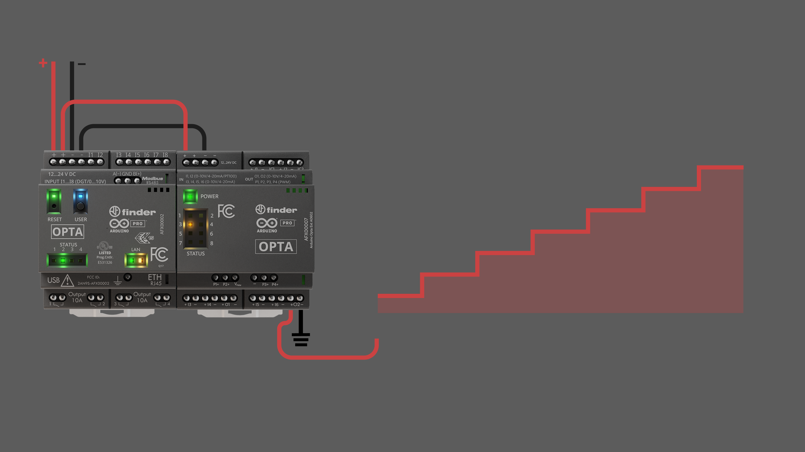

To fully understand the example above, we recommend you to check the [General Library Notes](#general-library-notes) section.

The expansion channels are configured as **voltage output** using the function `beginChannelAsDac()` alongside the following parameters:

```arduino
      AnalogExpansion::beginChannelAsDac(OptaController,  // object class
                                         device,  // the device
                                         ch,  // the output channel
                                         OA_VOLTAGE_DAC,  // output mode
                                         true,  // enable current limit
                                         false, // enable slew
                                         OA_SLEW_RATE_0); // set slew rate
```

The function `optaAnalogTask()` increases sequentially the `dac_value` variable to set the voltage output on the expansion channels.

#### Analog Current Output Mode

This output mode lets you control current-driven actuators or communicate with other devices through analog current.

|            **Characteristics**             |                **Details**                |
|:------------------------------------------:|:-----------------------------------------:|
|                  Channels                  |      I1, I2, I3, I4, O1, I5, I6, O2       |
|           Analog output current            |                 0...25 mA                 |
| Maximum output voltage when sourcing 25 mA |               11.9 V ± 20%                |
|            Open circuit voltage            |               16.9 V ± 20%                |
|             Output  impedance              |          Min: 1.5 MΩ, Typ: 4 MΩ           |
|                  Accuracy                  | 1% in 0-10 mA range, 2% in 10-24 mA range |
|               Repeatability                | 1% in 0-10 mA range, 2% in 10-24 mA range |
|          One output writing time           |                  ~560 µs                  |
|      All outputs at once writing time      |                  ~960 µs                  |

To set a current in an analog output terminal use the built-in function `pinCurrent()` as shown below:

```arduino
exp.pinCurrent(ch, <current>, true); // the first argument is to define the output channel, the second, the current output
```

The following example will let you set an output current on every channel at once, increasing it sequentially.

***This sketch is a __simplified version__ created for learning purposes of the one found in __File > Examples > Arduino_Opta_Blueprint > Analog > DAC__. Please check the example available at the library in case you need to know more.***

Copy and paste this code on a new sketch in your Arduino IDE:

```arduino
#include "OptaBlue.h"

#define PERIODIC_UPDATE_TIME 5000
#define DELAY_AFTER_SETUP 200

/* -------------------------------------------------------------------------- */
void printExpansionType(ExpansionType_t t) {
  /* -------------------------------------------------------------------------- */
  if (t == EXPANSION_NOT_VALID) {
    Serial.print("Unknown!");
  } else if (t == EXPANSION_OPTA_DIGITAL_MEC) {
    Serial.print("Opta --- DIGITAL [Mechanical]  ---");
  } else if (t == EXPANSION_OPTA_DIGITAL_STS) {
    Serial.print("Opta --- DIGITAL [Solid State] ---");
  } else if (t == EXPANSION_DIGITAL_INVALID) {
    Serial.print("Opta --- DIGITAL [!!Invalid!!] ---");
  } else if (t == EXPANSION_OPTA_ANALOG) {
    Serial.print("~~~ Opta  ANALOG ~~~");
  } else {
    Serial.print("Unknown!");
  }
}

/* -------------------------------------------------------------------------- */
void printExpansionInfo() {
  /* -------------------------------------------------------------------------- */
  static long int start = millis();

  if (millis() - start > 5000) {
    start = millis();
    Serial.print("Number of expansions: ");
    Serial.println(OptaController.getExpansionNum());

    for (int i = 0; i < OptaController.getExpansionNum(); i++) {
      Serial.print("Expansion n. ");
      Serial.print(i);
      Serial.print(" type ");
      printExpansionType(OptaController.getExpansionType(i));
      Serial.print(" I2C address ");
      Serial.println(OptaController.getExpansionI2Caddress(i));
    }
  }
}

/* -------------------------------------------------------------------------- */
/*                                 SETUP                                      */
/* -------------------------------------------------------------------------- */
void setup() {
  /* -------------------------------------------------------------------------- */
  Serial.begin(115200);
  delay(2000);

  OptaController.begin();

  for (int device = 0; device < OptaController.getExpansionNum(); device++) {

    for (int ch = 0; ch < OA_AN_CHANNELS_NUM; ch++) {

      /* odd channel are configured as voltage DAC */
      AnalogExpansion::beginChannelAsDac(OptaController,
                                         device,
                                         ch,
                                         OA_CURRENT_DAC,
                                         true,
                                         false,
                                         OA_SLEW_RATE_0);
    }
  }
}


/* -------------------------------------------------------------------------- */
void optaAnalogTask() {
  /* -------------------------------------------------------------------------- */

  static long int start = millis();

  /* using this the code inside the if will run every PERIODIC_UPDATE_TIME ms
     assuming the function is called repeatedly in the loop() function */

  if (millis() - start > PERIODIC_UPDATE_TIME) {
    start = millis();

    static uint16_t current = 0;

    current += 4;
    if (current > 20) {
      /* reset current */
      current = 0;
    }

    for (int i = 0; i < OptaController.getExpansionNum(); i++) {
      AnalogExpansion exp = OptaController.getExpansion(i);
      if (exp) {
        Serial.println("Setting current value " + String(current) + "mA on expansion n. " + String(exp.getIndex()));
        for (int ch = 0; ch < OA_AN_CHANNELS_NUM; ch++) {
          exp.pinCurrent(ch, current, true);
        }
      }
    }
  }
}

/* -------------------------------------------------------------------------- */
/*                                  LOOP                                      */
/* -------------------------------------------------------------------------- */
void loop() {
  /* -------------------------------------------------------------------------- */
  OptaController.update();
  printExpansionInfo();
  optaAnalogTask();
}
```

After the Opta™ controller is programmed with the example sketch, you can measure the current on the expansion outputs and experience the following behavior:

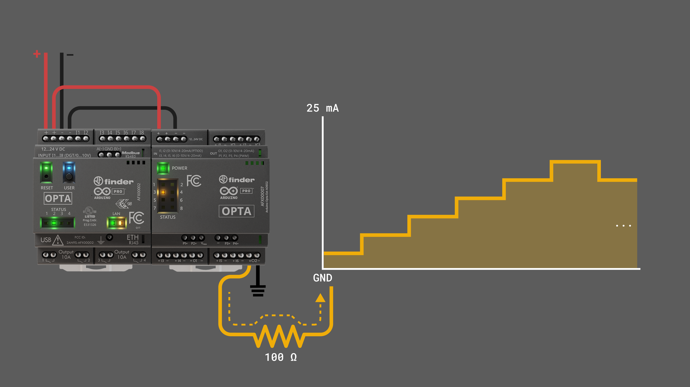

To fully understand the example above, we recommend you to check the [General Library Notes](#general-library-notes) section.

The expansion channels are configured as **current output** using the function `beginChannelAsDac()` alongside the following parameters:

```arduino
      AnalogExpansion::beginChannelAsDac(OptaController,  // object class
                                         device,  // the device
                                         ch,  // the output channel
                                         OA_CURRENT_DAC,  // output mode
                                         true,  // enable current limit
                                         false, // enable slew
                                         OA_SLEW_RATE_0); // set slew rate
```

The function `optaAnalogTask()` increases sequentially the `current` variable to set the current output on the expansion channels.


***Make sure to use a resistor value that makes it possible for the output to achieve the desired current. For example, if a 3 kΩ resistor is used and you want a 10 mA output, the channel must source the resistor with 30 V, which is not possible.***

#### PWM Output

The Analog Expansion has 4x PWM output channels **(P1...P4)**. They are software configurable and for them to work you must provide the **V<sub>PWM</sub>** pin with the desired voltage.

|  **V<sub>PWM</sub> Voltage**   |      **Details**      |
|:------------------------------:|:---------------------:|
|            Channels            |    P1, P2, P3, P4     |
|    Source voltage supported    |   8...24 VDC + 20%    |
|             Period             |     Programmable      |
|           Duty-cycle           | Programmable (0-100%) |
| Max current draw (per channel) |        100 mA         |
|         Max frequency          |         10kHz         |
|    One output writing time     |        ~700 µs        |


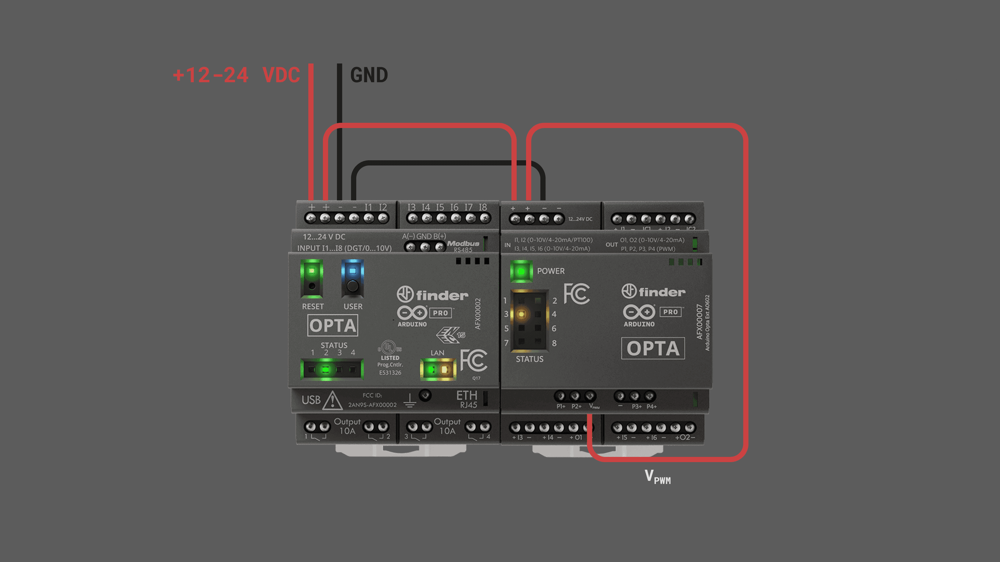

To configure a PWM output terminal use the built-in function `setPWM()` as shown below:

```arduino
exp.setPwm(ch, <period_us>, <pulse_us>); // the first argument is to define the output channel, the second, the signal period and the last one, the pulse ON time of the signal. 
```

The following example will let you set a **PWM** signal on channel **P1**, increasing and decreasing its duty-cycle sequentially.

***This sketch is a __simplified version__ created for learning purposes of the one found in __File > Examples > Arduino_Opta_Blueprint > Analog > PWM__. Please check the example available at the library in case you need to know more.***

Copy and paste this code on a new sketch in your Arduino IDE:

```arduino
#include "OptaBlue.h"


/* -------------------------------------------------------------------------- */
void printExpansionType(ExpansionType_t t) {
  /* -------------------------------------------------------------------------- */
  if (t == EXPANSION_NOT_VALID) {
    Serial.print("Unknown!");
  } else if (t == EXPANSION_OPTA_DIGITAL_MEC) {
    Serial.print("Opta --- DIGITAL [Mechanical]  ---");
  } else if (t == EXPANSION_OPTA_DIGITAL_STS) {
    Serial.print("Opta --- DIGITAL [Solid State] ---");
  } else if (t == EXPANSION_DIGITAL_INVALID) {
    Serial.print("Opta --- DIGITAL [!!Invalid!!] ---");
  } else if (t == EXPANSION_OPTA_ANALOG) {
    Serial.print("~~~ Opta  ANALOG ~~~");
  } else {
    Serial.print("Unknown!");
  }
}

/* -------------------------------------------------------------------------- */
void printExpansionInfo() {
  /* -------------------------------------------------------------------------- */
  static long int start = millis();

  if (millis() - start > 5000) {
    start = millis();
    Serial.print("Number of expansions: ");
    Serial.println(OptaController.getExpansionNum());

    for (int i = 0; i < OptaController.getExpansionNum(); i++) {
      Serial.print("Expansion n. ");
      Serial.print(i);
      Serial.print(" type ");
      printExpansionType(OptaController.getExpansionType(i));
      Serial.print(" I2C address ");
      Serial.println(OptaController.getExpansionI2Caddress(i));
    }
  }
}

/* -------------------------------------------------------------------------- */
/*                                 SETUP                                      */
/* -------------------------------------------------------------------------- */
void setup() {
  /* -------------------------------------------------------------------------- */
  Serial.begin(115200);
  delay(2000);

  OptaController.begin();
}

/* the optaAnalogTask function runs every 2000 ms it set the pwm for all the
 * channels from with a period equal to 10 ms and a variable duty cycle from 10%
 * to 70% */

/* -------------------------------------------------------------------------- */
void optaAnalogTask() {
  /* -------------------------------------------------------------------------- */

  static long int start = millis();
  static bool stop_pwm = false;
  if (millis() - start > 2000) {
    if (Serial.available()) {
      while (Serial.available()) {
        Serial.read();
      }
      stop_pwm = !stop_pwm;
    }
    start = millis();
    static uint16_t period = 10000;
    static uint16_t pulse = 0;
    static bool rising = 1;
    if (rising) {
      pulse += 1000;
      if (pulse > 7000) {
        rising = 0;
      }
    } else {
      pulse -= 1000;
      if (pulse <= 1000) {
        rising = 1;
      }
    }
    for (int i = 0; i < OptaController.getExpansionNum(); i++) {

      AnalogExpansion aexp = OptaController.getExpansion(i);

      if (aexp) {
        if (stop_pwm) {
          Serial.println("PWM stopped");
          aexp.setPwm(OA_FIRST_PWM_CH, 0, pulse);
        } else {
          Serial.println("PWM started");
          Serial.print("ON time set to: ");
          Serial.print(pulse);
          Serial.println(" us");
          aexp.setPwm(OA_FIRST_PWM_CH, period, pulse);
        }
      }
    }
  }
}

/* -------------------------------------------------------------------------- */
/*                                  LOOP                                      */
/* -------------------------------------------------------------------------- */
void loop() {
  /* -------------------------------------------------------------------------- */
  OptaController.update();
  //printExpansionInfo();
  optaAnalogTask();
}

```

After the Opta™ controller is programmed with the example sketch, you can measure the output signal with an oscilloscope on the expansion outputs and experience the following behavior:

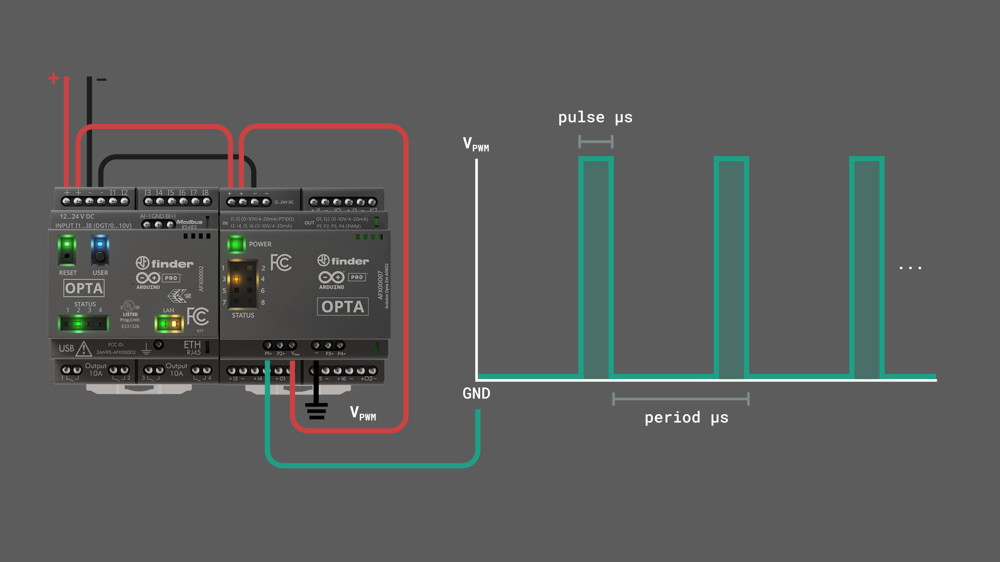

***The screw terminal marked as __-__ is connected to GND.***

To fully understand the example above, we recommend you to check the [General Library Notes](#general-library-notes) section.

The function `optaAnalogTask()` increases sequentially the `duty-cycle` variable to set the PWM output on the expansion channels and decrease it back generating a swiping output.

You can use the following auxiliary functions to manage and monitor the PWM outputs:

- `getPwmPeriod(<channel>)`: Get the PWM period of the defined channel in us
- `getPwmPulse(<channel>)`: Get the PWM pulse duration of the defined channel in us
- `getPwmFreqHz(<channel>)`: Get the PWM frequency of the defined channel in Hz
- `getPwmPulsePerc(<channel>)`: Get the PWM pulse duty-cycle of the defined channel in %

#### Expansion Status LEDs

| **Characteristics** | **Details** |
|:-------------------:|:-----------:|
|   Number of LEDs    |     8x      |

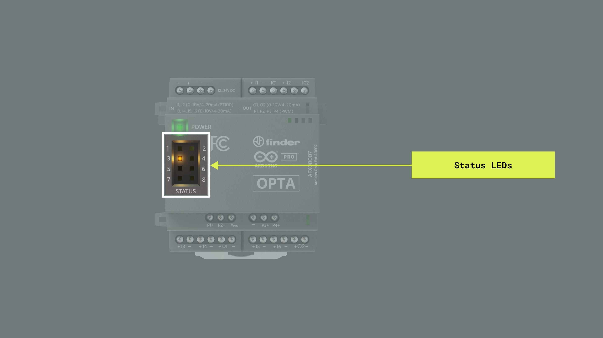

The Opta™ Analog Expansions have **eight status LEDs** on the front panel. They are mapped in the [Arduino_Opta_Blueprint](https://github.com/arduino-libraries/Arduino_Opta_Blueprint) library as described in the following table:

| **Opta Analog Expansion LED** | **Arduino Pin Mapping** |
|:-----------------------------:|:-----------------------:|
|             LED 1             |      0 or OA_LED_1      |
|             LED 2             |      1 or OA_LED_2      |
|             LED 3             |      2 or OA_LED_3      |
|             LED 4             |      3 or OA_LED_4      |
|             LED 5             |      4 or OA_LED_5      |
|             LED 6             |      5 or OA_LED_6      |
|             LED 7             |      6 or OA_LED_7      |
|             LED 8             |      7 or OA_LED_8      |

To control a status LED use the built-in function `switchLedOn()` or `switchLedOff()` as shown below:

```arduino
// Turn ON
exp.switchLedOn(<LED>, <update>); // define the LED to control and set to true or false the update parameter

// Turn OFF
exp.switchLedOff(<LED>, <update>); // define the LED to control and set to true or false the update parameter
```
If the `update` parameter is set to "false", then you will be setting the desired status of the LED but it won't be applied until you call `updateLeds()` function.

```arduino
exp.switchLedOn(OA_LED_1, false); // set the desired status to the queue
exp.updateLeds(); // apply the changes and update the current LED state
```

The following example will let you control the status LEDs sequentially, this sketch  can be found in **File > Examples > Arduino_Opta_Blueprint > Analog > LED**:

```arduino
#include "OptaBlue.h"

#define PERIODIC_UPDATE_TIME 2  //actually not used (it's DELAY_LED that leads the timing)
#define DELAY_AFTER_SETUP 1000
#define DELAY_LED 250

/* -------------------------------------------------------------------------- */
void printExpansionType(ExpansionType_t t) {
  /* -------------------------------------------------------------------------- */
  if (t == EXPANSION_NOT_VALID) {
    Serial.print("Unknown!");
  } else if (t == EXPANSION_OPTA_DIGITAL_MEC) {
    Serial.print("Opta --- DIGITAL [Mechanical]  ---");
  } else if (t == EXPANSION_OPTA_DIGITAL_STS) {
    Serial.print("Opta --- DIGITAL [Solid State] ---");
  } else if (t == EXPANSION_DIGITAL_INVALID) {
    Serial.print("Opta --- DIGITAL [!!Invalid!!] ---");
  } else if (t == EXPANSION_OPTA_ANALOG) {
    Serial.print("~~~ Opta  ANALOG ~~~");
  } else {
    Serial.print("Unknown!");
  }
}

/* -------------------------------------------------------------------------- */
void printExpansionInfo() {
  /* -------------------------------------------------------------------------- */
  static long int start = millis();

  if (millis() - start > 5000) {
    start = millis();
    Serial.print("Number of expansions: ");
    Serial.println(OptaController.getExpansionNum());

    for (int i = 0; i < OptaController.getExpansionNum(); i++) {
      Serial.print("Expansion n. ");
      Serial.print(i);
      Serial.print(" type ");
      printExpansionType(OptaController.getExpansionType(i));
      Serial.print(" I2C address ");
      Serial.println(OptaController.getExpansionI2Caddress(i));
    }
  }
}

/* -------------------------------------------------------------------------- */
/*                                 SETUP                                      */
/* -------------------------------------------------------------------------- */
void setup() {
  /* -------------------------------------------------------------------------- */
  Serial.begin(115200);
  delay(2000);
  Serial.println("*** Opta Analog LED example ***");

  OptaController.begin();
}


/* -------------------------------------------------------------------------- */
void optaAnalogTask() {
  /* -------------------------------------------------------------------------- */
  static bool st = true;
  static long int start = millis();

  static const char *msg_on = "ON";
  static const char *msg_off = "OFF";
  static char *msg_ptr = (char *)msg_on;

  if (millis() - start > PERIODIC_UPDATE_TIME) {
    start = millis();

    for (int i = 0; i < OptaController.getExpansionNum(); i++) {

      AnalogExpansion exp = OptaController.getExpansion(i);
      if (exp) {

        /* exp is true only if exp is an actual 
         * AnalogExpansion and false otherwise */

        for (int j = 0; j < 8; j++) {
          if (st) {
            msg_ptr = (char *)msg_on;
            exp.switchLedOn((uint8_t)j, false);
          } else {
            msg_ptr = (char *)msg_off;
            exp.switchLedOff((uint8_t)j, false);
          }
          exp.updateLeds();
          delay(250);
          Serial.print("switching LED ");
          Serial.print(j);
          Serial.print(" ");
          Serial.println(msg_ptr);
        }

        st = !st;
      }
    }
  }
}

/* -------------------------------------------------------------------------- */
/*                                  LOOP                                      */
/* -------------------------------------------------------------------------- */
void loop() {
  /* -------------------------------------------------------------------------- */
  OptaController.update();
  //printExpansionInfo();
  optaAnalogTask();
}
```
After the Opta™ controller is programmed with the example sketch, you can see the onboard LEDs blinking with a pattern and experience the following behavior:

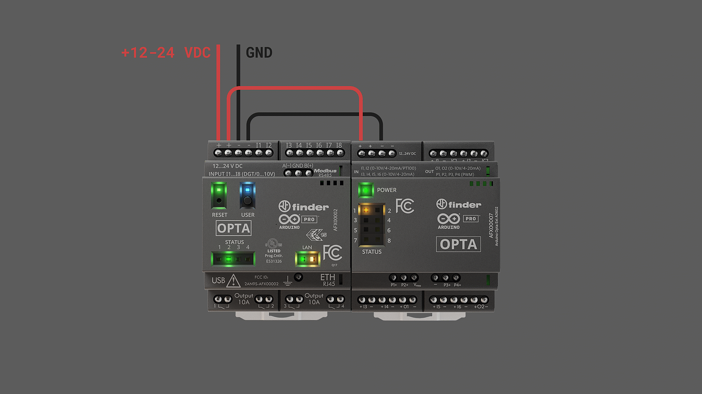

To fully understand the example above, we recommend you to check the [General Library Notes](#general-library-notes) section.

The function `optaAnalogTask()` turns on sequentially the **LEDs** and turns them off again.

***The Opta™ controller module can support up to __5 expansion modules__. Connecting more than this may result in unexpected behavior. __Ensure the module limit is not exceeded and the Aux connector and clips are properly secured.__***

You can buy and find more information about the Opta™ Analog Expansions on the links below:

- [Opta™ Analog Expansion Product Page](https://docs.arduino.cc/hardware/opta-analog-ext)
- [Buy the Opta™ Analog Ext A0602](https://store.arduino.cc/products/opta-ext-a0602)


## Support

If you encounter any issues or have questions while working with Opta™ devices, we provide various support resources to help you find answers and solutions.

### Help Center

Explore our Help Center, which offers a comprehensive collection of articles and guides for Opta™ devices. The Help Center is designed to provide in-depth technical assistance and help you make the most of your device.

- [Opta™ help center page](https://support.arduino.cc/hc/en-us/categories/360001637274-Hardware-Support)

### F.A.Q

Inside the Arduino Help Center you will find a Frequently Asked Questions (F.A.Q.) document with answers to the most commonly asked questions about this product. This resource is designed to address immediate questions and common concerns. If your question is not covered or require further personalized assistance, please do not hesitate to contact us.

- [Opta™ F.A.Q ](https://support.arduino.cc/hc/en-us/articles/13870453088924-FAQ-Arduino-Opta)

### Forum

Join our community forum to connect with other Opta™ devices users, share your experiences, and ask questions. The Forum is an excellent place to learn from others, discuss issues, and discover new ideas and projects related to Opta™.

- [Opta™ category in the Arduino Forum](https://forum.arduino.cc/c/hardware/opta/179)

### Contact Us

Please get in touch with our support team if you need personalized assistance or have questions not covered by the help and support resources described before. We're happy to help you with any issues or inquiries about Opta™ devices.

- [Contact us page](https://www.arduino.cc/en/contact-us/)
