## Overview

AWS IoT Core is a managed Cloud service that lets connected devices easily and securely interact with Cloud applications and other devices. AWS IoT Core can support billions of devices and trillions of messages and can process and route those messages to AWS endpoints and other devices reliably and securely. Devices can connect to AWS IoT Core using the following protocols: HTTP, WebSockets, and MQTT.

In this tutorial, you will learn how to securely connect an Opta™ device to AWS IoT Core using the MQTT protocol. MQTT (Message Queuing Telemetry Transport) is a highly lightweight machine-to-machine (M2M) connectivity protocol that uses a publish/subscribe messaging model. It is particularly suitable for Internet of Things (IoT) applications due to its bandwidth efficiency and ability to ensure message delivery over unstable networks. By the end of this tutorial, you will have the necessary skills to set up your Opta™ device to publish data to the AWS IoT Core and receive data from it.

## Goals

- Learn how to connect an Opta™ device to the AWS IoT Core.
- Learn how to generate a Certificate Signing Request (CSR) using the Arduino ecosystem tools.  

## Hardware and Software Requirements

### Hardware Requirements

- [Opta™ WiFi Lite](https://store.arduino.cc/products/opta-lite), [Opta™ RS485](https://store.arduino.cc/products/opta-rs485) or [Opta™ WiFi](https://store.arduino.cc/collections/pro-family/products/opta-wifi) (x1)
- [USB-C® cable](https://store.arduino.cc/products/usb-cable2in1-type-c) (x1)

### Software Requirements

- [Arduino IDE 1.8.10+](https://www.arduino.cc/en/software), [Arduino IDE 2](https://www.arduino.cc/en/software), or [Arduino Cloud Editor](https://create.arduino.cc/editor)
- [NTPClient library](https://github.com/arduino-libraries/NTPClient)
- [Arduino_JSON library](https://github.com/arduino-libraries/Arduino_JSON)
- [ArduinoECCX08 library](https://github.com/arduino-libraries/ArduinoECCX08)
- [ArduinoBearSSL library](https://github.com/arduino-libraries/ArduinoBearSSL)
- [ArduinoMqttClient library](https://github.com/arduino-libraries/ArduinoMqttClient)
- [Arduino_ConnectionHandler library](https://github.com/arduino-libraries/Arduino_ConnectionHandler)
- [Arduino Cloud Provider Examples library](https://github.com/arduino/ArduinoCloudProviderExamples)

## AWS IoT Core

AWS IoT Core is at the heart of the AWS IoT suite of services, providing a centralized platform where IoT devices can connect to the Cloud. Its robust framework supports millions of devices and billions of messages, seamlessly and securely routing those messages between devices and various AWS Cloud services. Some key features of AWS IoT Core are the following:

- **Scalability**: AWS IoT Core is designed to scale IoT applications quickly, managing connections and messaging without manually provisioning infrastructure.
- **Security**: A top priority with AWS IoT Core requiring devices to authenticate using X.509 certificates over TLS. This method ensures that the data exchanged between devices and the Cloud is encrypted and accessed only by authorized devices and services.
- **Device gateway**: The device gateway enables devices to communicate efficiently and securely with AWS IoT Core. It supports real-time and persistent connections and is optimized to ensure low latency and high throughput.
- **Message broker**: AWS IoT Core includes a message broker that handles messages to and from devices. It supports MQTT, a lightweight communication protocol ideal for IoT devices, including those with limited processing power or operating in environments with intermittent connectivity.
- **Device shadows**: AWS IoT Core also offers device shadows, virtual representations of your devices in the Cloud. This allows for interaction with devices even when they are offline. You can retrieve the last reported state and set desired future states for the devices.
- **Rule engine**: The AWS IoT Rules Engine processes and routes message data to other AWS services such as AWS Lambda, Amazon Kinesis, Amazon S3, and more. It can transform raw device data and control what data is stored, where, and how it's used.

### X.509 Certificates

X.509 certificates provide a robust layer of security for devices communicating with AWS IoT Core. When connecting using MQTT, these certificates are essential as they confirm the device's identity to AWS IoT Core, which is impossible with basic username and password authentication. This certificate-based system is part of the mutual authentication process, which is more secure than traditional credential-based methods.

With each device possessing a unique X.509 certificate, AWS IoT Core can ensure that the messages are secure and come from a trusted source. This method is fundamental in IoT ecosystems, where trust and identity verification are paramount to maintaining the system's integrity.

More information on X.509 certificate support on AWS IoT can be found [here](https://docs.aws.amazon.com/iot/latest/developerguide/x509-certs.html).

## Instructions

### Setting Up the Arduino IDE

This tutorial will need the latest version of the Arduino IDE; you can download it [here](https://www.arduino.cc/en/software). If it is your first time setting up an Opta™ device with the Arduino IDE, it is advisable to check its [User Manual](https://docs.arduino.cc/tutorials/opta/user-manual) first. In the Arduino IDE, you need to install the core for Opta™ devices; you can do this by navigating to **Tools > Board > Boards Manager**. In the Board Manager tab, search for `opta` and install the latest `Arduino Mbed OS Opta Boards` version.

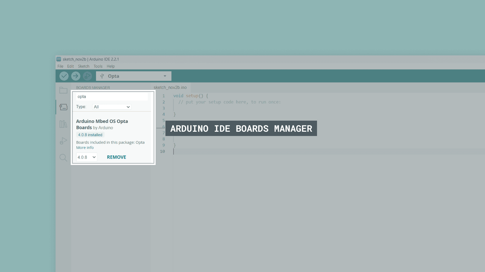

This tutorial also requires the latest version of the `NTPClient`, `Arduino_JSON`, `ArduinoECCX08`, `ArduinoBearSSL`, `ArduinoMqttClient`, `Arduino_ConnectionHandler` and `Arduino Cloud Provider Examples` libraries installed on the Arduino IDE. You can do this by navigating to **Tools > Manage Libraries** or clicking the Library Manager icon in the left tab of the IDE. In the Library Manager tab, search for `NTPClient`, `Arduino_JSON`, `ArduinoECCX08`, `ArduinoBearSSL`, `ArduinoMqttClient`, `Arduino_ConnectionHandler` and `Arduino Cloud Provider Examples` and install the latest version.

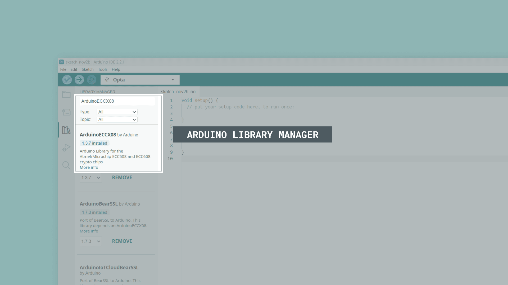

### Setting Up Your AWS Account

If you do not have an existing AWS account and user, refer to the online AWS documentation at [Set up your AWS account](https://docs.aws.amazon.com/iot/latest/developerguide/setting-up.html). To get started, follow the steps outlined in the sections below:

- [Sign up for an AWS account](https://docs.aws.amazon.com/iot/latest/developerguide/setting-up.html#aws-registration) 
- [Create an administrative user](https://docs.aws.amazon.com/iot/latest/developerguide/setting-up.html#create-an-admin) 
- [Open the AWS IoT console](https://docs.aws.amazon.com/iot/latest/developerguide/setting-up.html#iot-console-signin)

### Generating a Certificate Signing Request

As mentioned, AWS IoT Core requires devices that connect to it using the MQTT protocol to use X.509 certificates for authentication. We'll use an example sketch from the `ArduinoECCX08` library to generate a Certificate Signing Request (CSR) from an Opta™ device and then upload this CSR in the AWS console to create an X.509 certificate.

Open the `ECCX08CSR` example sketch by navigating to **File > Examples > ArduinoECCX08 > Tools**. To upload the code to your Opta™ device, click the **Verify** button to compile the sketch and check for errors; then click the **Upload** button to program the device with the sketch.

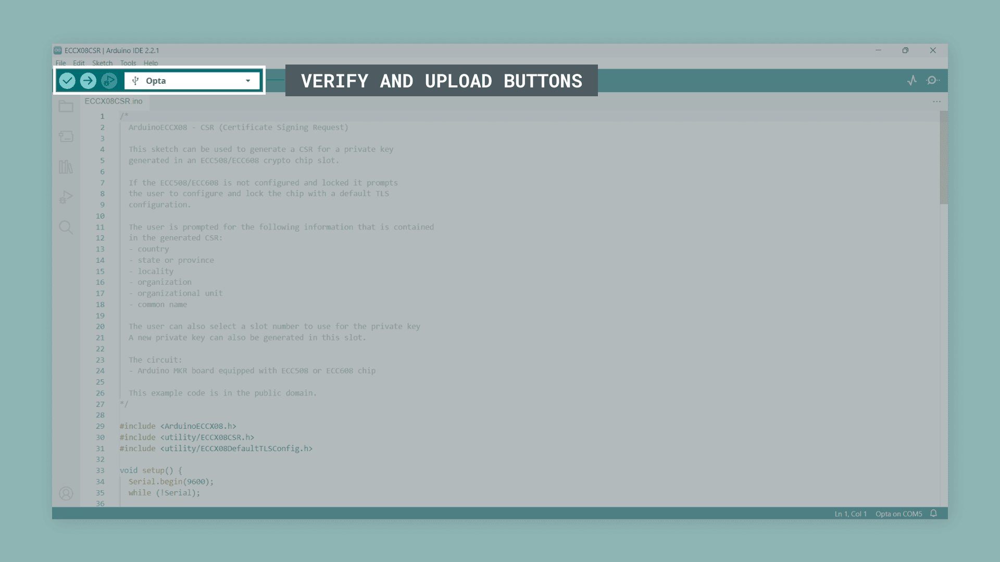

When finished, open the IDE's Serial Monitor. Ensure the line ending configuration is set to **Both NL & CR**, as shown in the image below.

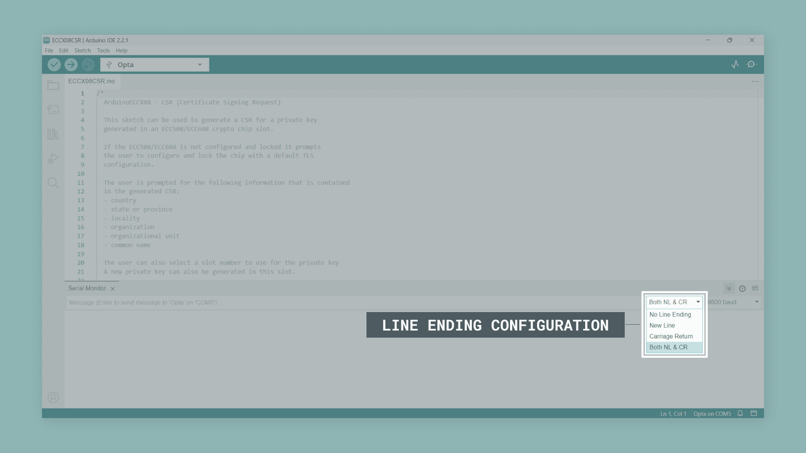

Provide the information requested by the example sketch to generate a new CSR for your Opta™ device. Copy the generated CSR from the IDE's Serial Monitor, including `-----BEGIN CERTIFICATE REQUEST-----` and `-----END CERTIFICATE REQUEST-----` and save it to a new `.txt` file or `.csr` file using your favorite text editor. You will upload this file to the AWS console next.

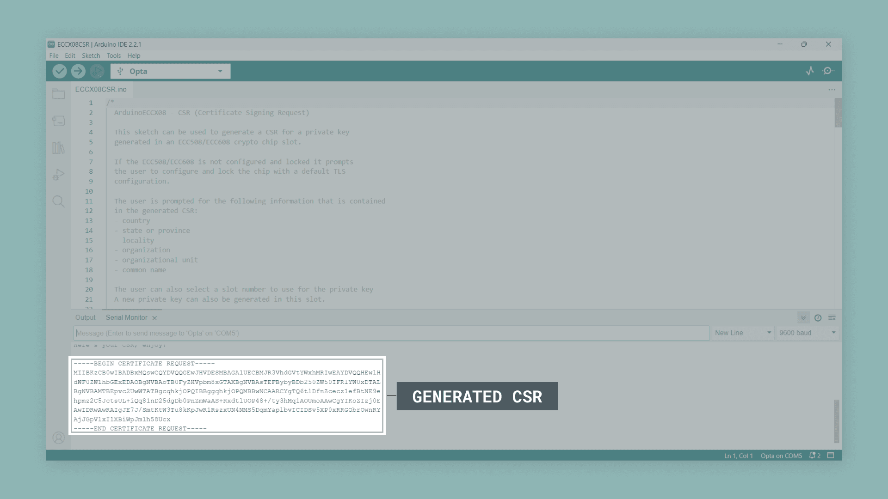

Now that we have a CSR to identify your Opta™ device, we need to login into the AWS IoT Core console and create a certificate.

### Creating Resources in AWS IoT Core

Refer to the online AWS documentation at [Create AWS IoT resources](https://docs.aws.amazon.com/iot/latest/developerguide/create-iot-resources.html). Follow the steps outlined in the following sections to provision resources for your device:

- [Create an AWS IoT policy](https://docs.aws.amazon.com/iot/latest/developerguide/create-iot-resources.html#create-iot-policy)
- [Create a thing object](https://docs.aws.amazon.com/iot/latest/developerguide/create-iot-resources.html#create-aws-thing) 

Pay special attention to the notes in the shared sections.

#### Opta™ Configuration as a Resource


Login to your AWS account; in the Console Home search bar, search for the "IoT Core" service and select it.

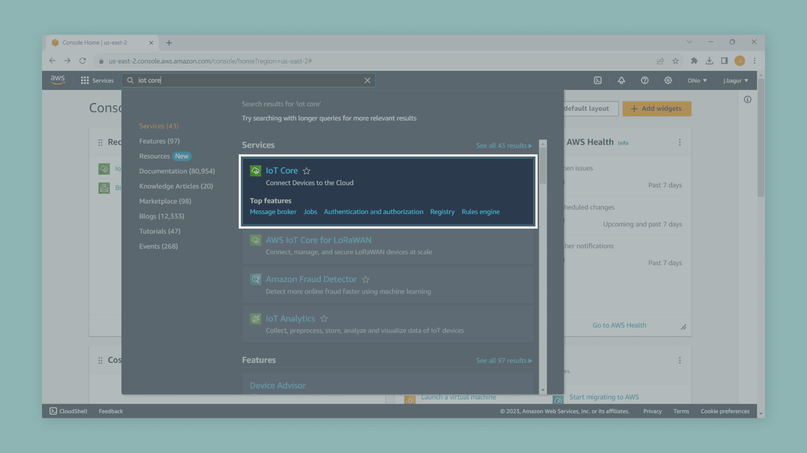

In the  IoT Core services area, navigate to the menu on the left side and choose **Manage > All devices > Things**, then select the **Create things** button.

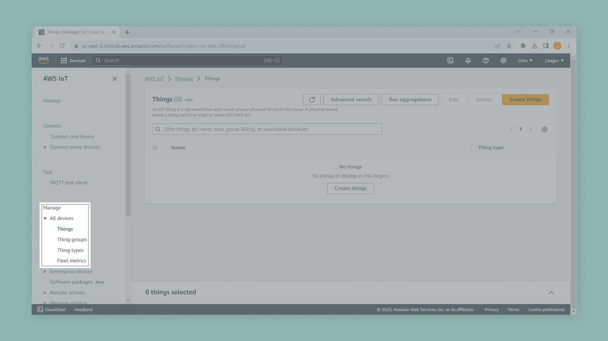

Once you click the **Create things** button, you will be transferred to a page where you can create a single or many things. Select the **Create single thing** option and then the **Next** button.

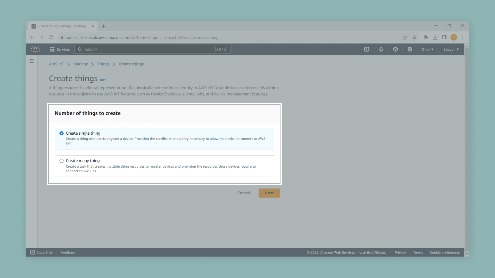

After selecting the Next button, you will be transferred to a page where you can name your Thing, **name your Thing as same as the common name that you defined in the generated CSR**, and then select the **Next** button. 

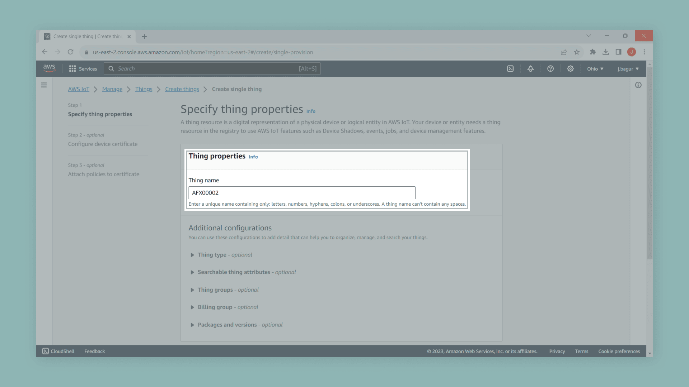

After selecting the Next button, you will be transferred to a page where you can upload the generated CSR. Choose the CSR file, then select the **Next** button.

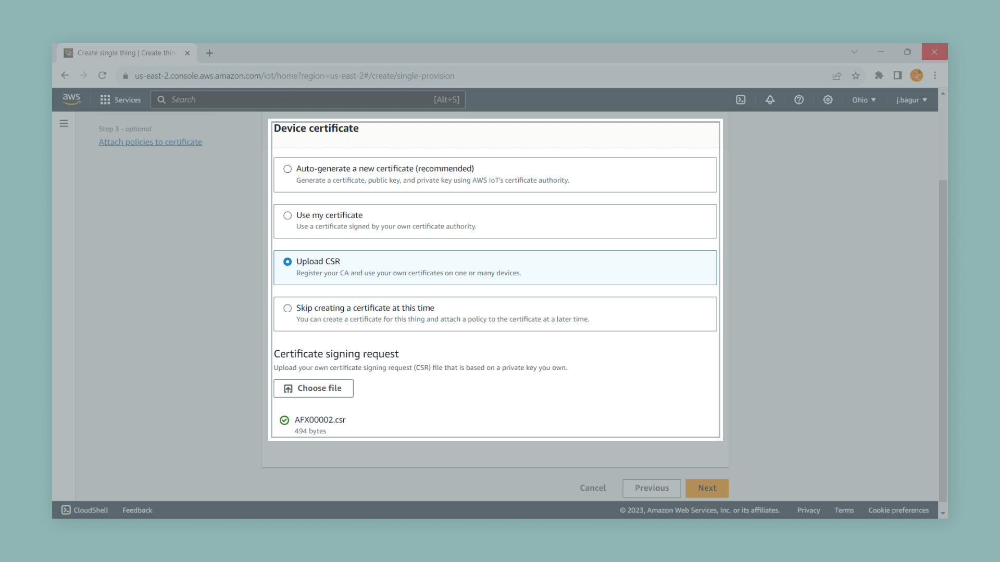

After selecting the Next Button, you will be transferred to a page where you can choose the **policies** you want to attach to your Thing, and then select the **Create thing** button.

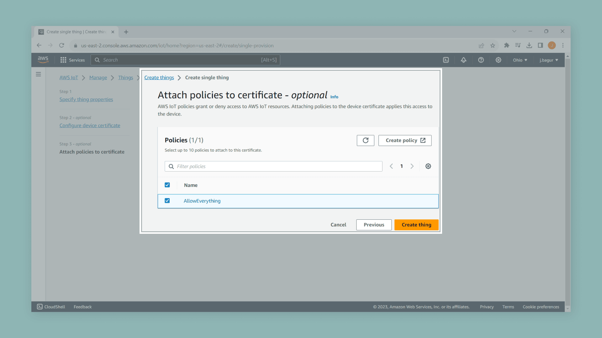

In the image shown below, you can see an example policy created for testing purposes only. **Please do not use this policy in production since it is a wide-open policy and is not the best practice and standards**. Refer to the online AWS documentation at [Create an AWS IoT policy](https://docs.aws.amazon.com/iot/latest/developerguide/create-iot-resources.html#create-iot-policy).

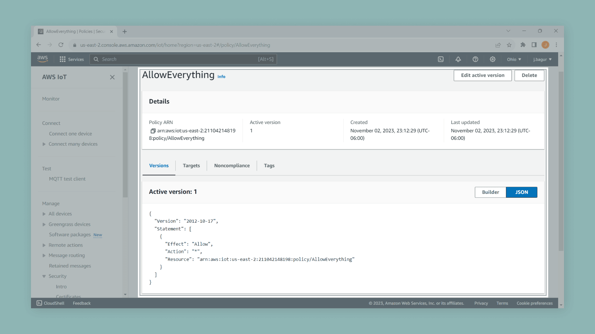

### Provisioning Your Device

Select the Thing you just created and navigate to the **Certificates** tab; select the **Certificate ID** as shown in the image below.

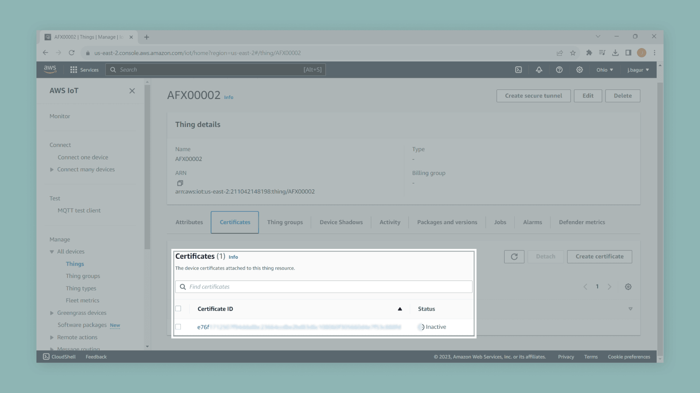

Once in the Certificate area, select the **Actions** dropdown menu and choose **Activate**. After the certificate is activated, the next step is to download the certificate. Save the downloaded certificate in a place where you can find the certificate for future action.

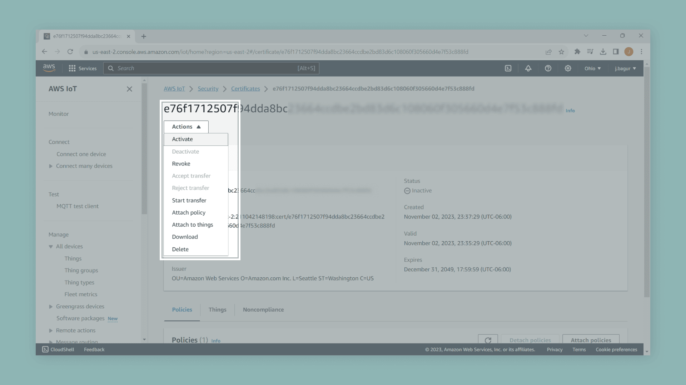

### Connecting Your Device To AWS IoT Core

The first step to connect your Opta™ device is getting the **device data endpoint** from your AWS account. In your AWS account, navigate to the menu on the left side and choose **Settings**; copy the provided endpoint.

The next step depends on the variant of your Opta™ device you have.

- **For Opta™ Lite (SKU: AFX00003)**: Open the AWS IoT Ethernet example sketch in the Arduino IDE using the File > Examples > Arduino Cloud Provider Examples > AWSIoT > AWS_IoT_Opta > **AWS_IoT_Opta_ethernet.ino**

- **For Opta™ RS485 (SKU: AFX0001)**: Open the AWS IoT Ethernet example sketch in the Arduino IDE using the File > Examples > Arduino Cloud Provider Examples > AWSIoT > AWS_IoT_Opta > **AWS_IoT_Opta_ethernet.ino**

- **For Opta™ WiFi (SKU: AFX00002)**: If you connect using Ethernet, open the AWS IoT Ethernet example sketch in the Arduino IDE using the File > Examples > Arduino Cloud Provider Examples > AWSIoT > AWS_IoT_Opta >AWS_IoT_Opta_ethernet > **AWS_IoT_Opta_ethernet.ino**. If you connect using Wi-Fi®, open the AWS IoT Wi-Fi® example sketch in the Arduino IDE using the File > Examples > Arduino Cloud Provider Examples > AWSIoT > AWS_IoT_Opta->AWS_IoT_Opta_wifi > **AWS_IoT_Opta_wifi.ino**

In the `arduino_secrets.h` tab update the Wi-Fi® Setting with the SSID and password of your Wi-Fi® network. Update the `secret_broker` with the device data endpoint captured before, and update the `secret_port` with the proper port used to connect to AWS IoT. Finally, open the certificate file you downloaded with a text editor and copy/paste the value in the sketch in the `secret_certificate` area. In the image below, the `arduino_secrets.h` tab for the `AWS_IoT_Opta_wifi.ino` sketch is shown.

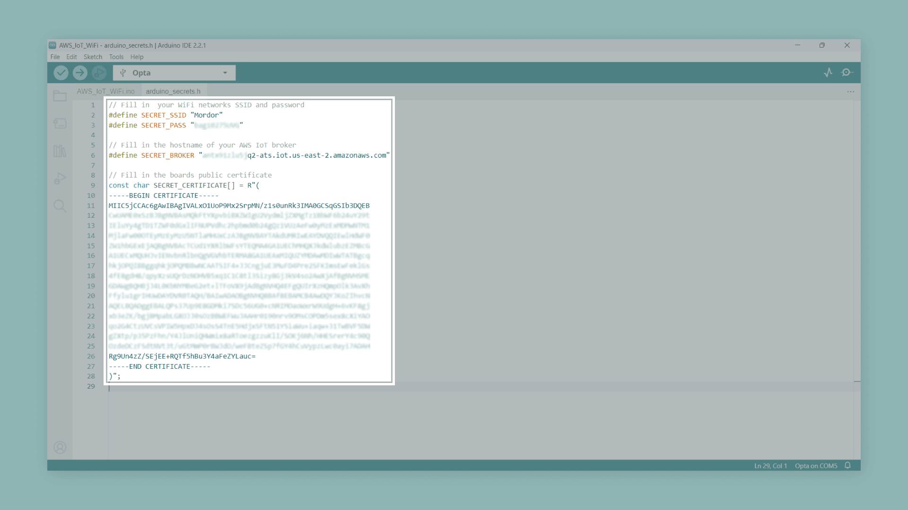

Within the `setup()`, the lines `sslClient.setEccSlot(0, certificate)` and the `mqttClient.setId(“clientID”)` are important. The `setECCSlot` function sets the slot you used before for the CSR; the `setId` function sets the name you gave to your Thing in the AWS IoT Core.

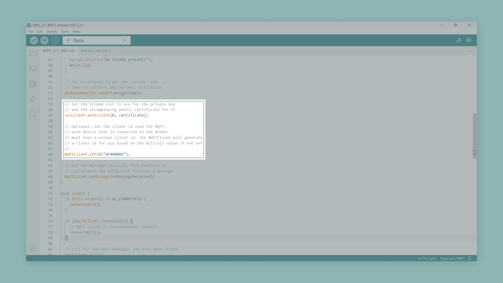

Once the example sketch is set with proper values, the next step is to upload the sketch and test it.

### Uploading the Example Sketch

After modifying the example sketch, click the **Verify** button to compile the sketch and check for errors; then click the **Upload** button to program the device with the sketch. Open the IDE's Serial Monitor to monitor the connection Wi-Fi connection of your device and its connection to  AWS.

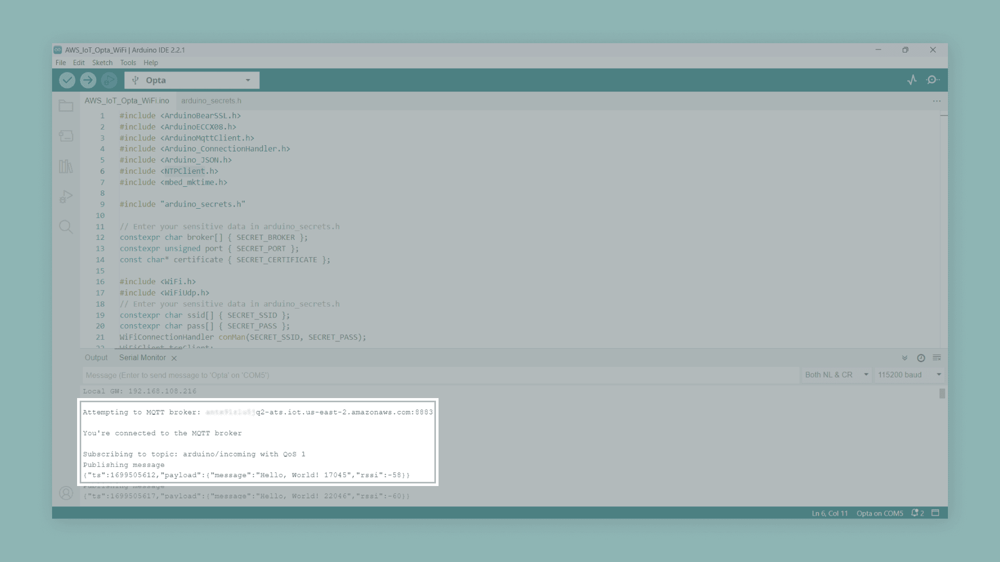

The example sketch automatically connects to an Ethernet or a Wi-Fi® network and the AWS IoT Core broker. Then, it subscribes to the `arduino/incoming` topic and sends messages to the `arduino/outgoing` topic every five seconds.

### Testing the Example Sketch

As soon as your Opta™ device is connected to the AWS IoT broker, it publishes automatically a simple message to the `arduino/outgoing` topic every five seconds. On the AWS IoT Core console, open the **MQTT test client** and add a subscription for the `arduino/outgoing` topic; choose the JSON formatting as the display option.

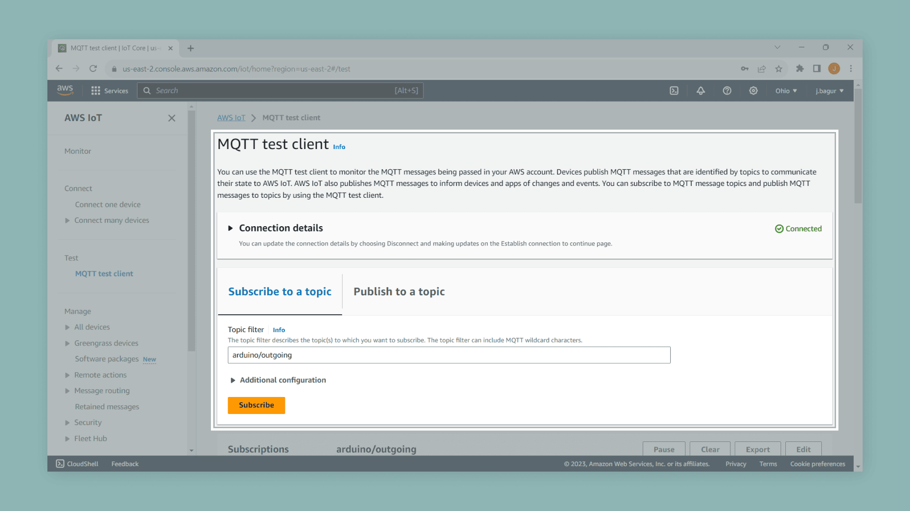

See messages arriving from your Opta™ device every five seconds.

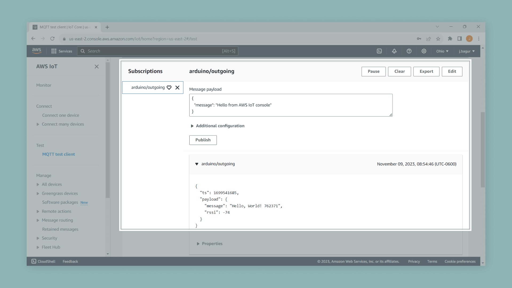

On the AWS IoT Core console, open the MQTT test client and select the "Publish to a topic" tab. Add `arduino/incoming` as Topic name and click the "Publish" button to send data to Opta™. Data in the "Message payload" text area shows on the Serial Monitor of the Arduino IDE.

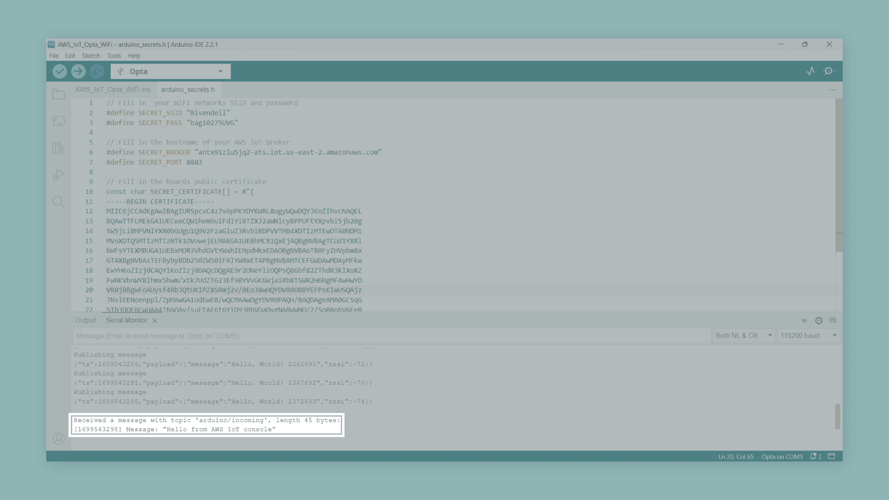

Please note the example sketch can parse only JSON messages in the form:

```json
{
  "message": "Hello from AWS IoT console"
}
```

The message can be modified as you like, remember to adapt the example sketch accordingly.

## Troubleshooting

For more information on AWS, refer to the AWS online documentation on [Troubleshooting AWS IoT](https://docs.aws.amazon.com/iot/latest/developerguide/iot_troubleshooting.html). For more details on Opta™ devices, refer to Opta™'s online documentation on [Arduino Docs](https://docs.arduino.cc/hardware/opta).

If your Opta™ device fails to connect to AWS IoT Core, check the following:

- **X.509 certificate**: it must be activated in AWS IoT Core.

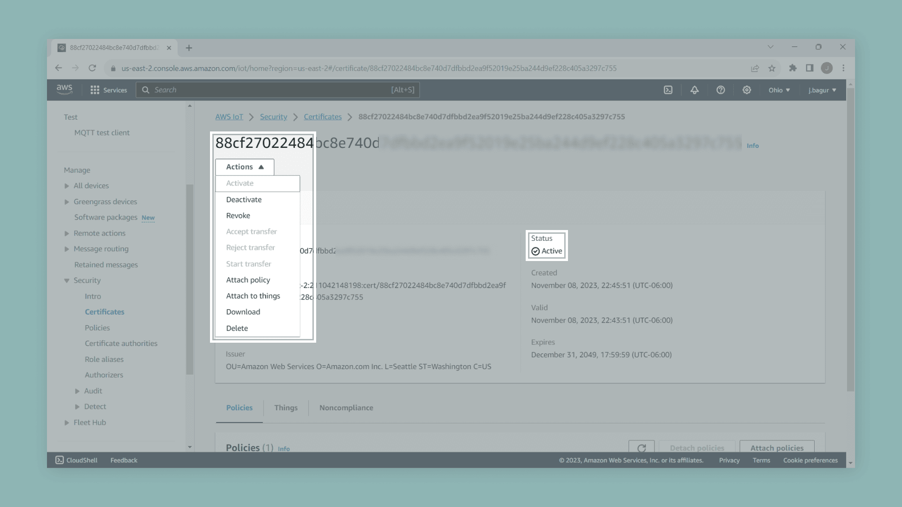

- **Example sketch**: all the fields from the `arduino_secrets.h` file must be compiled (`SECRET_SSID`, `SECRET_PASS`, `SECRET_BROKER`, `SECRET_PORT`, and `SECRET_CERTIFICATE`).


