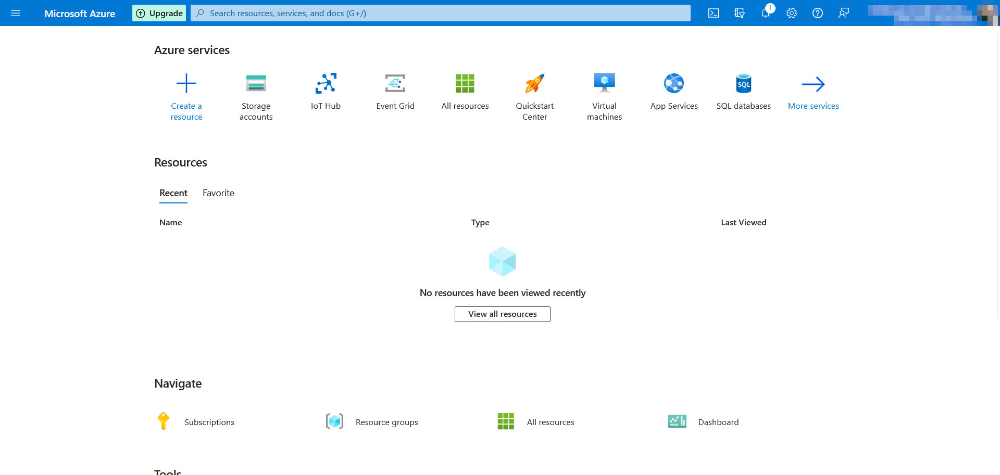
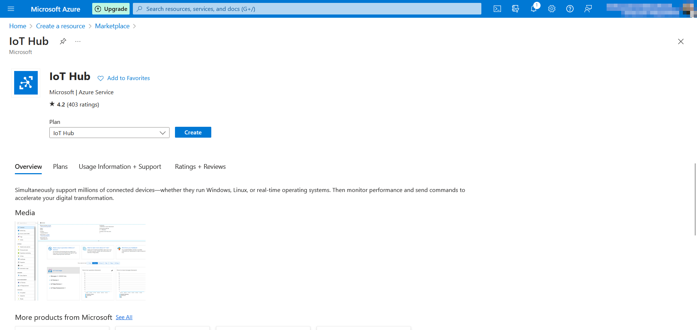
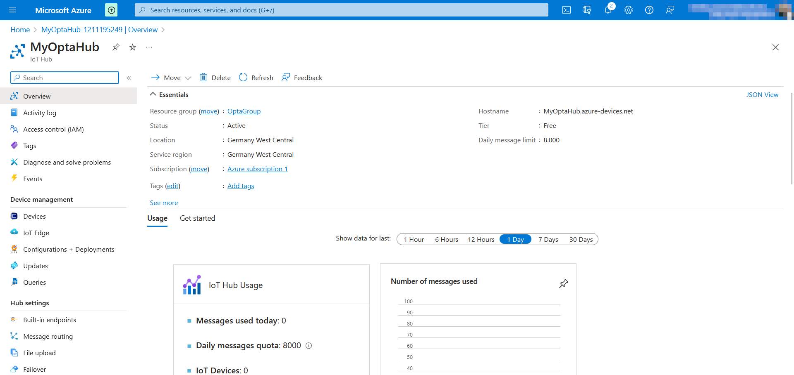

## Introduction

This tutorial demonstrates the integration of Opta™ with Azure IoT. You will proceed to create a reliable and secure IoT environment, harnessing the power of these two technologies.

## Goals

- **Initial Configuration:** Guide the user through the initial setup steps for Azure IoT and IoT Hub to establish a connection between Opta™ and Azure IoT.

- **Reliable Transmission:** How to reliably transmit data from Opta™ to Azure IoT.

- **Connectivity** Knowing the various connectivity methods offered by Opta™.

## Required Hardware and Software

### Required Hardware

- [Opta™ Lite](https://store.arduino.cc/products/opta-lite), [Opta™ RS485](https://store.arduino.cc/products/opta-rs485), or [Opta™ WiFi](https://store.arduino.cc/products/opta-wifi) (x1)
- [USB-C® cable](https://store.arduino.cc/products/usb-cable2in1-type-c) (x1)

### Required Software

- [Arduino IDE](https://www.arduino.cc/en/software)
- [Azure SDK for C library](https://www.arduino.cc/reference/en/libraries/azure-sdk-for-c/) (installable from the IDE, see next steps)

## Azure IoT

[Azure IoT](https://portal.azure.com) is a set of advanced Cloud services provided by the Microsoft Azure platform, designed to facilitate the development, management, and connectivity of IoT solutions. The goal of Azure IoT is to enable developers to build scalable, secure, and reliable IoT applications, transforming device data into meaningful insights and intelligent actions.

One of the key components of Azure IoT is IoT Hub, which plays a crucial role in managing connectivity between IoT devices and Cloud applications. The core features of IoT Hub include:

- **Connection Management:** IoT Hub facilitates secure and bidirectional connection management between IoT devices and the Cloud. It supports various communication protocols to adapt to the diverse needs of devices.

- **Automatic Scaling:** IoT Hub can easily handle a large number of devices dynamically and automatically, ensuring reliable connectivity even with a vast network of devices.

- **Advanced Security:** It provides robust security mechanisms, including end-to-end encryption, device authentication, and key management, to protect data transmitted between devices and Azure.

- **Remote Control:** Enables Cloud applications to send commands to devices and receive responses, facilitating remote control and automation of connected devices.

- **Device Management:** Provides device management functionalities such as registration, state monitoring, and lifecycle management, simplifying the operational management of IoT devices.

In summary, Azure IoT and IoT Hub provide a solid and secure foundation for building advanced IoT applications, allowing developers to focus on creating innovative solutions rather than dealing with the complexity of managing IoT device connections and data.

## Instructions

### Arduino IDE Configuration

If you haven't already installed the Arduino IDE, you can install it from [this page](https://www.arduino.cc/en/software).

Open the Library Manager from the menu **Sketch->Include Library->Manage Libraries**.

Search for the "Azure SDK for C" library using the Library Manager's search feature.


## Azure IoT Instructions

### IoT Hub Deployment

Sign in to your Microsoft account from the [Azure portal](https://portal.azure.com).

You will be presented with the home page where you can add resources to your subscription.



You'll need to add an IoT Hub to your subscription, so click on **Create a resource**, and the Azure resource store will appear.


You can use the search function to search for the keyword **"iot hub"**.


Among the search results, the resource we're interested in, IoT Hub, will appear as the first result. Click on **Create** to start creating your IoT Hub.


To create the new IoT Hub, fill in all the required fields on the page.

- Select your account's subscription; in this tutorial, it's **Azure subscription 1**.
- Create a new Resource Group; for this tutorial, the group **OptaGroup** was created.
- In the IoT hub name field, for this tutorial, **MyOptaHub** was chosen. Remember that the hub name will be used to indicate the connection host in the code that you'll need to customize later.
- In the Region field, for this tutorial, **Germany West Central** was used.
- In the Tier field, select **Free** or a plan that suits your needs.

The daily message limit for the **Free** plan is 8,000 and cannot be changed otherwise.

After entering all the necessary information, you should have something similar to the following images:


After entering all the necessary information, you can click on **Review + create**, skipping the other configurations.

A final summary prompts you to check that the entered information is correct, after which you can click on **Create** to complete the Hub creation and move on to the next steps.




You will be redirected to the creation and registration status page of the new IoT Hub; the operation takes a few moments.


Subsequently, you will receive a message confirming that the IoT Hub is created and configured.


You can click on **Go to resource** to access the IoT Hub dashboard.



Now you can add a device to your Hub; the new device will allow the connection to your Opta™. To add a new device, click on **Devices** under the **Device management** section on the left side of your Hub.


On the page that appears, click on **Add Device**.

- In this tutorial, the device ID **MyOpta** was used.
- Keep **Symmetric key** for **Authentication type**.
- Keep the **Auto generate keys** and **Connect this device to an IoT hub** settings enabled.

You will then have a page with fields filled in similar to this:


By clicking on **Save**, you will be redirected back to the list of devices.


Click on the name of the newly created device in the list of devices associated with your Hub. The device configuration page will be displayed. You don't need to make any changes to this page, but you will need to use the information provided on this page in the sketch to be uploaded to Opta™.

From the current page, the only information needed for the configuration is the **Device ID** and the **Primary key**. Once requested, you can easily copy them using the 'Copy' button next to each corresponding field.


The next step of the tutorial is dedicated to customizing and understanding the sample code.

## Sketch

### Introduction

In this section, some parts of the sample code provided by Microsoft are analyzed and explained, modified to be used correctly on Opta™.

The original project example can be found in the official library repository, accessible from [this page](https://github.com/Azure/azure-sdk-for-c-arduino/blob/main/examples/Azure_IoT_Hub_PortentaH7/Azure_IoT_Hub_PortentaH7.ino).

The example modified for Opta™ is available [here](assets/opta-azure-iot-tutorial-sketch.zip).

### Sketch Configuration for Connection

To establish a connection to Azure IoT, you don't need to make any changes to your sketch. All the configurations necessary to make the transmission of data from Opta™ to the Microsoft Cloud work are enclosed in a few lines of code.

In the file `Azure_IoT_Hub_Opta.ino`, at lines 6 and 7, you have the option to set the connection as Wi-Fi® or Ethernet based on the uncommented definition.

If you are using Ethernet, the code should be set up like this:

```cpp
/*--- Connection Type ---*/
// Comment or uncomment the define based on the type of connectivity used.
#define ETHERNET //at line 6
//#define WIFI  //at line 7
```

If you are using Wi-Fi, the code should be set up like this:

```cpp
/*--- Connection Type ---*/
// Comment or uncomment the define based on the type of connectivity used.
#define ETHERNET //at line 6
//#define WIFI //at line 7
```

During the compilation of your sketch, the necessary parts of the code will be compiled based on the chosen connectivity.

The information for Azure IoT are instead present in the file **iot_configs.h**, in this file there are all the definitions necessary for the correct setup of the connection.


You will need some of the information present on the device configuration page on Azure. As mentioned earlier, you can copy the necessary information and modify the code accordingly:

```arduino
// Wifi
#define IOT_CONFIG_WIFI_SSID "MyWifi" // Change it to your Wi-Fi network name
#define IOT_CONFIG_WIFI_PASSWORD "12345678" // Change it to your Wi-Fi network password
#define IOT_CONFIG_WIFI_CONNECT_RETRY_MS 10000

// Azure IoT
#define IOT_CONFIG_IOTHUB_FQDN "MyOptaHub.azure-devices.net" // Host
#define IOT_CONFIG_DEVICE_ID "MyOpta" // Device ID, chosen by you during device creation
#define IOT_CONFIG_DEVICE_KEY "RAK5epqOa5i6FncyOz6PkYdwYKMrWDGdTAIoTJXJ1lc=" // Primary key, yours will be similar to this but not this
```

The **IOT_CONFIG_WIFI_SSID** definition assumes the value of your Wi-Fi network's SSID, while **IOT_CONFIG_WIFI_PASSWORD** represents the password associated with that network.

Note that **IOT_CONFIG_IOTHUB_FQDN** contains the hostname, easily obtainable by copying the name of your IoT Hub. In the context of this tutorial, the chosen name is **MyOptaHub**.

The hostname that facilitates the connection of Opta™ to Azure IoT is consistently **azure-devices.net**. You will need to add the name of your hub before this hostname as follows: **MyHubID.azure-devices.net**. Consequently, for this tutorial, it becomes **MyOptaHub.azure-devices.net**.

The **IOT_CONFIG_DEVICE_ID** definition specifies the device identifier, and for this tutorial, **MyOpta** was selected.

Finally, **IOT_CONFIG_DEVICE_KEY** requires entering the device's private key.

### Other Code Customizations

In the **iot_configs.h** file, you find a definition that allows indicating in milliseconds the time that must elapse between sending one telemetry message and the next. The relevant definition is **IOT_CONFIG_TELEMETRY_FREQUENCY_MS** on line 19.

In the code, it is set to 300,000 milliseconds or 5 minutes:


```arduino
// Publish 1 message every 5 minutes
#define IOT_CONFIG_TELEMETRY_FREQUENCY_MS 300000
```
You can customize the value in milliseconds to change the time interval between sending messages.

In the **Azure_IoT_Hub_Opta.ino** file, you will find a portion of code represented by the **generateTelemetry()** function at line 329, which is called to allow sending the message to Azure IoT:


```arduino
/*
 * generateTelemetry:
 * Simulated telemetry.  
 * In your application, this function should retrieve real telemetry data from the device and format
 * it as needed.
 */
static char* generateTelemetry() 
{
  telemetryPayload =  String("{ \"msgCount\": ") + telemetrySendCount + " }";
  telemetrySendCount++;

  return (char*)telemetryPayload.c_str();
}
```

You can modify this function by changing the value of **telemetryPayload** and send values from your sensors or custom messages. In the example, a counter that increments its value with each send is sent.

You can modify this function to send a different message, for example, a classic "Hello, World":

```arduino
static char* generateTelemetry() 
{
  telemetryPayload =  String("Hello, World!");
  return (char*)telemetryPayload.c_str();
}
```

### Uploading the Sketch

If the modifications made to the code meet your requirements, you can upload the code to your Opta™ and check if a message confirming the successful sending of telemetry data is displayed in the serial monitor:


You can verify the actual reception of messages from the dashboard of our IoT Hub:


### Conclusion

In conclusion to this tutorial, we have explored and customized a sample sketch provided by Microsoft to enable the connection of Opta™ to Azure IoT. Here's a summary of the activities performed:

- **Analysis of the Sample Sketch:** We examined a sample sketch provided by Microsoft for connecting to Azure IoT, available in the official library repository.
- **Modifications for Opta™:** We made the necessary changes to the sketch to adapt it and use it correctly with Opta™, customizing definitions and configurations.
- **Azure IoT Configuration:** We explained how to obtain the necessary information from the device configuration on Azure IoT, including the hostname of your hub and the device key.
- **Integration with Azure IoT Hub:** We illustrated the process of configuring the definitions in the `iot_configs.h` file, which manages Wi-Fi connection and communication with Azure IoT Hub.
- **Code Customizations:** We provided guidance on further customizing the code, including adjusting the telemetry message sending interval and modifying the simulated data sent to Azure IoT.
- **Ethernet and Wi-Fi® Connectivity:** Now you can easily choose between Ethernet and Wi-Fi® connection by uncommenting the appropriate definition in the code. You've learned how to customize the sketch to fit your IoT needs quickly and effortlessly.

The tutorial provides a detailed guide to connect Opta™ to Azure IoT, allowing the secure and reliable transmission of data. This is just a starting point, and further customizations can be made based on the specific needs of the project. In case you want to dig deeper into the Azure IoT technology, check the [Azure IoT official documentation](https://learn.microsoft.com/en-us/azure/iot/).