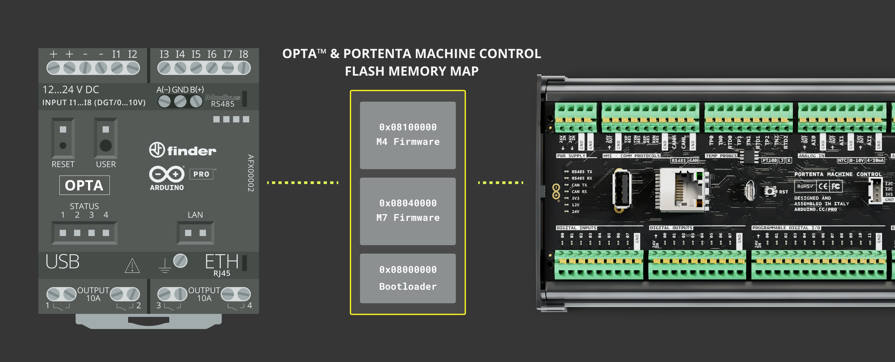
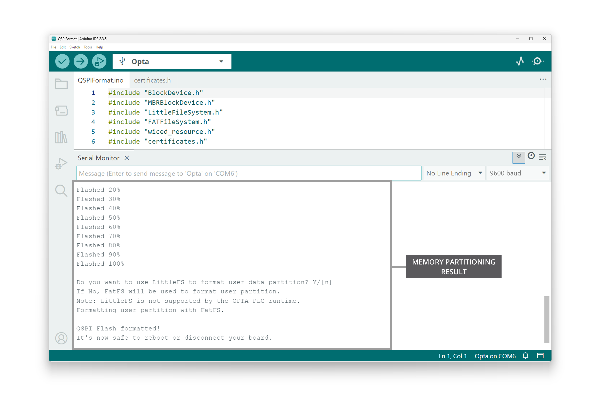

## Overview

The Opta™ is a secure, easy-to-use micro Programmable Logic Controller (PLC) with Industrial Internet of Things (IIoT) capabilities. The Portenta Machine Control is a centralized, energy-efficient industrial control unit capable of operating equipment and machinery. Both devices can be programmed with the [Arduino PLC IDE](https://www.arduino.cc/pro/software-plc-ide/), a tool that simplifies programming the device through any of the five programming languages defined by the IEC 61131-3 standard.

The Opta™ and the Portenta Machine Control can also be programmed with other tools from the Arduino ecosystem, such as the [Arduino IDE](https://www.arduino.cc/en/software) and the Arduino programming language. Suppose we are using Opta™ with the Arduino PLC IDE and want to start programming the device using the Arduino IDE and the rest of the Arduino ecosystem tools. In that case, we need to partition the device's memory to enable all available features. This applies to the Portenta Machine Control as well.

In this tutorial, we will use an Opta™ and learn how to partition the memory to enable all its functionalities to be programmed using the Arduino IDE and the Arduino programming language.



## Goals

- Learn how to partition the memory of an Opta™ device to be used with the Arduino IDE and other ecosystem tools
- Program an Opta™ device using the Arduino IDE and the Arduino programming language. 

## Hardware and Software Requirements

### Hardware Requirements

- [Opta™ Lite](https://store.arduino.cc/products/opta-lite), [Opta™ RS485](https://store.arduino.cc/products/opta-rs485), or [Opta™ WiFi](https://store.arduino.cc/products/opta-wifi) (x1)
- [Portenta Machine Control](https://store.arduino.cc/products/arduino-portenta-machine-control) (x1)
- USB-C® cable (x1)
- [Micro USB cable](https://store.arduino.cc/products/usb-2-0-cable-type-a-micro) (x1)

### Software Requirements

- [Arduino IDE 1.8.10+](https://www.arduino.cc/en/software), [Arduino IDE 2](https://www.arduino.cc/en/software), or [Arduino Web Editor](https://create.arduino.cc/editor)
- [The memory partitioning sketch and the certificate file](assets/memory_partitioning.zip)

## Memory Partitioning

Memory partitioning involves dividing a device's available memory into separate regions or partitions, each serving a specific purpose. This process is used to manage memory efficiently and ensure that different programs or functionalities of the device can coexist without interfering with each other.

In the context of the Opta™, partitioning the memory allows the device to accommodate different functionalities, such as its Wi-Fi® module firmware, Over-The-Air (OTA) updates functionality, and certificates storage, while still providing memory space for user programs developed in the Arduino IDE and the Arduino programming language. Similarly, it applies to the Portenta Machine Control as well.

Now, we will guide the process of partitioning an Opta™'s memory to enable the full range of its functionalities to be programmed using the Arduino IDE and the Arduino programming language.

## Instructions

### Setting Up the Arduino IDE 

This tutorial requires the latest version of the Arduino IDE, which can be downloaded [here](https://www.arduino.cc/en/software). In the Arduino IDE, you need to install the core for Opta™ devices. To do this, go to T**Tools > Board > Boards Manager** or click the **Boards Manager** icon in the left tab of the IDE. In the **Boards Manager** tab, search for `opta` and install the latest `Arduino Mbed OS Opta Boards` version.


***For the Portenta Machine Control, in the __Boards Manager__ tab, search for `portenta` and install the latest `Arduino Mbed OS Portenta Boards` core version.***

We are now ready to compile and upload Arduino sketches to an Opta™ device using the Arduino IDE. 

***Memory partitioning of an Opta™ or a Portenta Machine Control should use the latest core and libraries to ensure the system is up-to-date with the intended default configuration.***

### Partitioning Memory of an Opta™ Device

To partition the memory of an Opta™ device, you need an Arduino sketch that includes memory partition operations and a certificate file. These files can be downloaded directly from the [Software Requirements section](#software-requirements) or [here](assets/memory_partitioning.zip). Ensure both files are stored in the same directory, as shown in the following layout:

```
memory_partitioning
├── certificates.h
└── memory_partitioning.ino
```

***The complete sketch and the certificate files can be downloaded [__here__](assets/memory_partitioning.zip). __Please store both files in the same directory__.***

The sketch below shows the memory partition process to be applied for Opta™.

```arduino
// Include necessary libraries for working
#include <BlockDevice.h>
#include <FATFileSystem.h>
#include <LittleFileSystem.h>
#include <MBRBlockDevice.h>
#include "wiced_resource.h"
#include "certificates.h"

// Ensure that the M7 core is being used instead of the M4 core
#ifndef CORE_CM7
#error Update the WiFi firmware by uploading the sketch to the M7 core instead of the M4 core.
#endif

using namespace mbed;

// Create instances of block devices and filesystems for the QSPI Flash memory
BlockDevice* root;
MBRBlockDevice* wifi_data;
MBRBlockDevice* ota_data;
FATFileSystem wifi_data_fs("wlan");
FATFileSystem ota_data_fs("fs");

void setup() {
  // Set the built-in LED pin as an output and turn it off
  pinMode(LED_BUILTIN, OUTPUT);
  digitalWrite(LED_BUILTIN, LOW);

  // Initialize serial communication and wait up to 2.5 seconds for a connection
  Serial.begin(115200);
  for (auto startNow = millis() + 2500; !Serial && millis() < startNow; delay(500))
    ;

  // Blink the built-in LED 10 times as a visual indicator that the process is starting
  for (auto i = 0u; i < 10; i++) {
    digitalWrite(LED_BUILTIN, HIGH);
    delay(25);
    digitalWrite(LED_BUILTIN, LOW);
    delay(50);
  }

  // Initialize and erase the QSPI flash memory.
  Serial.println("Erasing the QSPIF");
  root = BlockDevice::get_default_instance();
  auto err = root->init();
  if (err != 0) {
    Serial.print("Error Initializing the QSPIF: ");
    Serial.println(err);
    while (true) {
      digitalWrite(LED_BUILTIN, HIGH);
      delay(50);
      digitalWrite(LED_BUILTIN, LOW);
      delay(150);
    }
  }

  // Create partitions for Wi-Fi firmware, OTA updates, and certificate storage
  // Get device geometry.
  const auto erase_size = root->get_erase_size();
  const auto size = root->size();
  const auto eraseSectors = size / erase_size;

  for (auto i = 0u; i < eraseSectors; i++) {
    err = root->erase(i * erase_size, erase_size);
    if (i % 64 == 0) {
      digitalWrite(LED_BUILTIN, HIGH);
      delay(25);
      digitalWrite(LED_BUILTIN, LOW);
    }
    if (err != 0) {
      Serial.print("Error erasing sector ");
      Serial.println(i);
      Serial.print(" [");
      Serial.print(i * erase_size);
      Serial.print(" - ");
      Serial.print(float{ i } / float{ eraseSectors } * 100);
      Serial.print("%] -> ");
      Serial.print(err ? "KO" : "OK");
      Serial.println();
      for (auto i = 0u; i < 2; i++) {
        digitalWrite(LED_BUILTIN, HIGH);
        delay(50);
        digitalWrite(LED_BUILTIN, LOW);
        delay(150);
      }
    }
  }

  Serial.println("Done");
  for (auto i = 0u; i < 5; i++) {
    digitalWrite(LED_BUILTIN, HIGH);
    delay(25);
    digitalWrite(LED_BUILTIN, LOW);
    delay(50);
  }

  // Format the partitions and create filesystem instances
  // WiFi Firmware and TLS TA certificates: 1 MB
  // Arduino OTA: 13 MB
  MBRBlockDevice::partition(root, 1, 0x0B, 0 * 1024 * 1024, 1 * 1024 * 1024);
  MBRBlockDevice::partition(root, 3, 0x0B, 14 * 1024 * 1024, 14 * 1024 * 1024);
  MBRBlockDevice::partition(root, 2, 0x0B, 1024 * 1024, 14 * 1024 * 1024);

  // Create the filesystem references
  wifi_data = new MBRBlockDevice(root, 1);
  ota_data = new MBRBlockDevice(root, 2);

  // Write Wi-Fi firmware and certificate data to the appropriate partitions
  Serial.print("Formatting WiFi partition... ");
  err = wifi_data_fs.reformat(wifi_data);
  if (err != 0) {
    Serial.println("Error formatting WiFi partition");
    while (true) {
      digitalWrite(LED_BUILTIN, HIGH);
      delay(50);
      digitalWrite(LED_BUILTIN, LOW);
      delay(150);
    }
  }

  Serial.println("done.");
  Serial.print("Formatting OTA partition...");
  err = ota_data_fs.reformat(ota_data);
  if (err != 0) {
    Serial.println("Error formatting OTA partition");
    while (true) {
      digitalWrite(LED_BUILTIN, HIGH);
      delay(50);
      digitalWrite(LED_BUILTIN, LOW);
      delay(150);
    }
  }

  Serial.println("done.");
  for (auto i = 0u; i < 10; i++) {
    digitalWrite(LED_BUILTIN, HIGH);
    delay(25);
    digitalWrite(LED_BUILTIN, LOW);
    delay(50);
  }

  Serial.println("QSPI Flash Storage Ready.");

  // Flash the memory-mapped Wi-Fi firmware and certificates
  extern const unsigned char wifi_firmware_image_data[];
  extern const resource_hnd_t wifi_firmware_image;
  FILE* fp = fopen("/wlan/4343WA1.BIN", "wb");
  const int file_size = 421098;
  int chunck_size = 1024;
  int byte_count = 0;

  Serial.println("Flashing /wlan/4343WA1.BIN file");
  printProgress(byte_count, file_size, 10, true);
  while (byte_count < file_size) {
    if (byte_count + chunck_size > file_size)
      chunck_size = file_size - byte_count;
    int ret = fwrite(&wifi_firmware_image_data[byte_count], chunck_size, 1, fp);
    if (ret != 1) {
      Serial.println("Error writing firmware data");
      break;
    }
    byte_count += chunck_size;
    printProgress(byte_count, file_size, 10, false);
  }
  fclose(fp);

  chunck_size = 1024;
  byte_count = 0;
  const uint32_t offset = 15 * 1024 * 1024 + 1024 * 512;

  Serial.println("Flashing memory mapped firmware");
  printProgress(byte_count, file_size, 10, true);
  while (byte_count < file_size) {
    if (byte_count + chunck_size > file_size)
      chunck_size = file_size - byte_count;
    int ret = root->program(wifi_firmware_image_data, offset + byte_count, chunck_size);
    if (ret != 0) {
      Serial.println("Error writing firmware data");
      break;
    }
    byte_count += chunck_size;
    printProgress(byte_count, file_size, 10, false);
  }

  chunck_size = 128;
  byte_count = 0;
  fp = fopen("/wlan/cacert.pem", "wb");

  Serial.println("Flashing certificates");
  printProgress(byte_count, cacert_pem_len, 10, true);
  while (byte_count < cacert_pem_len) {
    if (byte_count + chunck_size > cacert_pem_len)
      chunck_size = cacert_pem_len - byte_count;
    int ret = fwrite(&cacert_pem[byte_count], chunck_size, 1, fp);
    if (ret != 1) {
      Serial.println("Error writing certificates");
      break;
    }
    byte_count += chunck_size;
    printProgress(byte_count, cacert_pem_len, 10, false);
  }
  fclose(fp);

  fp = fopen("/wlan/cacert.pem", "rb");
  char buffer[128];
  int ret = fread(buffer, 1, 128, fp);
  Serial.write(buffer, ret);
  while (ret == 128) {
    ret = fread(buffer, 1, 128, fp);
    Serial.write(buffer, ret);
  }
  fclose(fp);

  Serial.println("\nFirmware and certificates updated!");
  Serial.println("It's now safe to reboot or disconnect your board.");
}

void loop() {
  // Empty loop function, main task is performed in the setup function
}

/**
  Get the size of a file
  
  @param bootloader fp (FP)
  @return files size
*/
long getFileSize(FILE* fp) {
  fseek(fp, 0, SEEK_END);
  int size = ftell(fp);
  fseek(fp, 0, SEEK_SET);

  return size;
}

/**
  Display the progress of the flashing process
  
  @params offset (uint32_t), size (uint32_t), threshold (uint32_t) and reset (bool)
  @return none
*/
void printProgress(uint32_t offset, uint32_t size, uint32_t threshold, bool reset) {
  static int percent_done = 0;
  if (reset == true) {
    percent_done = 0;
    Serial.println("Flashed " + String(percent_done) + "%");
  } else {
    uint32_t percent_done_new = offset * 100 / size;
    if (percent_done_new >= percent_done + threshold) {
      percent_done = percent_done_new;
      Serial.println("Flashed " + String(percent_done) + "%");
    }
  }
}
```

***If you encounter an error while in the compilation process, __please remember to have both script and certificate files in the same folder__. The certificate file is crucial for the memory partitioning process. The complete sketch and the certificate files can be downloaded [__here__](assets/memory_partitioning.zip).***

The sketch shown above performs four main tasks:

1. **Initialize and erase the QSPI Flash memory**: The sketch initializes the QSPI Flash memory of the Opta™ device and erases its content to prepare the memory for new firmware and data. One of the built-in LEDs of the device is used to indicate the progress of the memory-erasing process.

2. **Create partitions and format them in the QSPI Flash memory**: The sketch creates and formats partitions in the QSPI Flash memory for the Wi-Fi firmware, Over-The-Air (OTA) updates functionality and certificates storage.

3. **Write Wi-Fi firmware and certificate data**: The sketch writes the Wi-Fi firmware and certificate data to the appropriate partitions in the QSPI Flash memory and flashes the memory-mapped Wi-Fi firmware and certificates.

4. **Display progress in the Arduino IDE Serial Monitor**: The sketch provides a visual indication of the progress of the flashing process using one of the built-in LEDs of the Opta™ device and displays messages through the Arduino IDE Serial Monitor to inform the user about the current status of the flashing process.

To upload the code, click the **Verify** button to compile the sketch and check for errors, then click the **Upload** button to program the device with the sketch.


After a while, you should see information on the progress of the flashing process in the Serial Monitor, as shown in the image below.



If everything went as intended, you should see a success message in the Serial Monitor. Now, we are ready to start using the full capabilities of the Opta™ with the Arduino IDE.

**The process is similar for the Portenta Machine Control.** Once the same memory partition code uploads and finishes its operation, it should show similar results in the Arduino IDE's Serial Monitor as the Opta™. It will be ready to start using the full functionalities of the Portenta Machine Control with the Arduino IDE.

## Conclusion

In this tutorial, we showed how to partition the memory of an Opta™ device, enabling its full range of functionalities to be programmed using Arduino ecosystem tools such as the Arduino IDE and the Arduino programming language. We walked through initializing and erasing the QSPI Flash memory, partitioning and formatting the memory, and writing the Wi-Fi firmware and certificate data onto the device's memory.

We also showed that the same process can be applied to the Portenta Machine Control to achieve similar results.

## Next Steps

As you move forward, you can explore the extensive Arduino ecosystem, leverage various libraries and hardware add-ons, and create powerful, connected, and secure industrial solutions using the Opta™. Check out our [Opta™ User Manual](/tutorials/opta/user-manual) to learn more about its hardware and software features.

To learn more about using the Portenta Machine Control within the Arduino IDE to its full capability, please check out the [Portenta Machine Control User Manual](https://docs.arduino.cc/tutorials/portenta-machine-control/user-manual/) and the [Arduino Portenta Machine Control Library Guide](https://docs.arduino.cc/tutorials/portenta-machine-control/pmc-arduino-library/) for using the `Arduino_PortentaMachineControl` library.