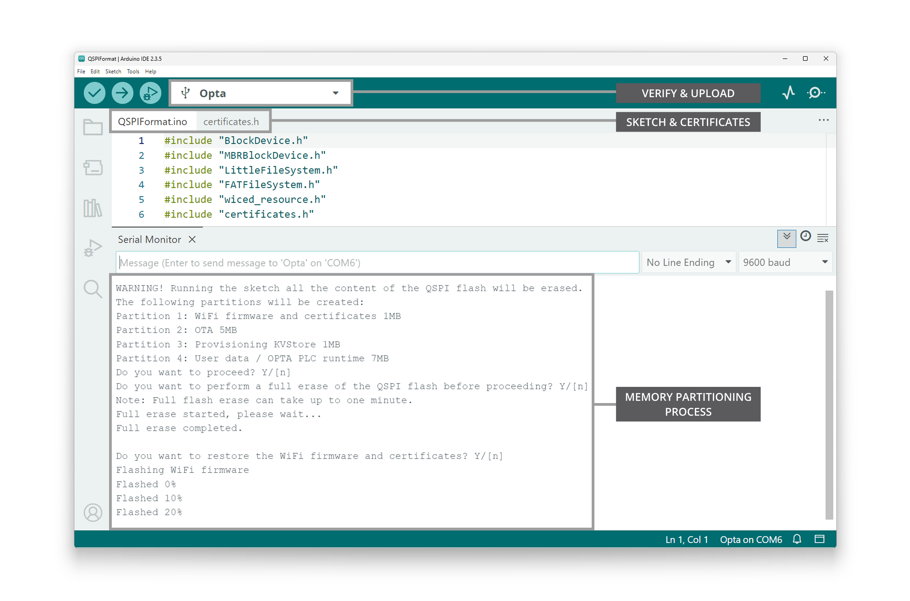

## Overview

The **Opta™** is a secure, easy-to-use micro Programmable Logic Controller (PLC) with Industrial Internet of Things (IIoT) capabilities. The **Portenta Machine Control** is a centralized, energy-efficient industrial control unit capable of operating equipment and machinery.

Both devices can be programmed with the [Arduino PLC IDE](https://www.arduino.cc/pro/software-plc-ide/), a tool that simplifies programming the device through any of the five programming languages defined by the IEC 61131-3 standard.

The Opta™ and the Portenta Machine Control can also be programmed with other tools from the Arduino ecosystem, such as the [Arduino IDE](https://www.arduino.cc/en/software) and the Arduino programming language. Suppose we are using Opta™ with the Arduino PLC IDE and want to start programming the device using the Arduino IDE and the rest of the Arduino ecosystem tools. In that case, we need to partition the device's memory to enable all available features. This applies to the Portenta Machine Control as well.


In this tutorial, we will use an Opta™ and Portenta Machine Control to learn how to partition the memory, enabling all functionalities to be programmed using the Arduino IDE and the Arduino programming language.

## Goals

- Learn how to partition the memory of an Opta™ and a Portenta Machine Control for use with the Arduino IDE and other ecosystem tools.
- Program an Opta™ and a Portenta Machine Control using the Arduino IDE and the Arduino programming language.

## Hardware and Software Requirements

### Hardware Requirements

- Opta™ ([Opta™ Lite](https://store.arduino.cc/products/opta-lite), [Opta™ RS485](https://store.arduino.cc/products/opta-rs485), or [Opta™ WiFi](https://store.arduino.cc/products/opta-wifi)) (x1) or [Portenta Machine Control](https://store.arduino.cc/products/arduino-portenta-machine-control) (x1)
- USB-C® cable (x1)
- [Micro USB cable](https://store.arduino.cc/products/usb-2-0-cable-type-a-micro) (x1)

### Software Requirements

Before beginning the memory partitioning process, ensure you have the following software requirements:

- [Arduino IDE 1.8.10+](https://www.arduino.cc/en/software), [Arduino IDE 2](https://www.arduino.cc/en/software), or [Arduino Cloud Editor](https://create.arduino.cc/editor)
- `Arduino Mbed OS Opta Boards` core
- [`Arduino Mbed OS Portenta Boards`](https://docs.arduino.cc/software/ide-v1/tutorials/getting-started/cores/arduino-mbed_portenta/) core

***The __QSPIFormat__ sketch required for memory partitioning is available in core __version 4.3.1 or higher__. To install or update your core, open the Arduino IDE, go to __Tools > Board > Boards Manager__, search for `Opta` or `Portenta`, and install or update to the latest version.***

## Memory Partitioning

Memory partitioning involves dividing a device's available memory into separate regions or partitions, each serving a specific purpose. This process is used to manage memory efficiently and ensure that different programs or functionalities of the device can coexist without interfering.

In the context of the Opta™, partitioning the memory allows the device to accommodate different functionalities, such as its Wi-Fi® module firmware, Over-The-Air (OTA) updates functionality, and certificate storage, while still providing memory space for user programs developed in the Arduino IDE and the Arduino programming language. Similarly, it applies to the Portenta Machine Control as well.

Now, we will guide you through partitioning the memory of an Opta™ and Portenta Machine Control to enable full programming capabilities using the Arduino IDE and the Arduino programming language.

## Setting Up the Arduino IDE

This tutorial requires the latest version of the Arduino IDE, which can be downloaded [here](https://www.arduino.cc/en/software).

In the Arduino IDE, you need to install the core for *Opta™*. To do this, go to **Tools > Board > Boards Manager** or click the **Boards Manager** icon in the left tab of the IDE. In the **Boards Manager** tab, search for `opta` and install the latest `Arduino Mbed OS Opta Boards` version.


For the *Portenta Machine Control*, in the __Boards Manager__ tab, search for `portenta` and install the latest `Arduino Mbed OS Portenta Boards` core version.

We are now ready to compile and upload Arduino sketches to an Opta™ or a Portenta Machine Control using the Arduino IDE. 

***Memory partitioning of an Opta™ or a Portenta Machine Control should use the __latest core__ and __libraries__ to ensure the system is up-to-date with the intended default configuration.***

## Partitioning the Memory of an Opta™

To partition the memory of an Opta™ device, you need an Arduino sketch that includes memory partition operations and a certificate file. The required sketch is called **QSPIFormat** and can be found in the Arduino IDE by navigating to **File > Examples > STM32H747_System**. The necessary files are organized in the following directory structure:

```
QSPIFormat
├── certificates.h
└── QSPIFormat.ino
```

***If you cannot find the __QSPIFormat__ sketch in your board's examples, please make sure you have installed the __latest Arduino Mbed OS Opta Boards core (version 4.3.1 or higher)__.***

The sketch below shows the memory partition process to be applied for Opta™.

```arduino
#include "BlockDevice.h"
#include "MBRBlockDevice.h"
#include "LittleFileSystem.h"
#include "FATFileSystem.h"
#include "wiced_resource.h"
#include "certificates.h"

#ifndef CORE_CM7
  #error Format QSPI flash by uploading the sketch to the M7 core instead of the M4 core.
#endif

using namespace mbed;

BlockDevice* root = BlockDevice::get_default_instance();
MBRBlockDevice wifi_data(root, 1);
MBRBlockDevice ota_data(root, 2);
MBRBlockDevice kvstore_data(root, 3);
MBRBlockDevice user_data(root, 4);
FATFileSystem wifi_data_fs("wlan");
FATFileSystem ota_data_fs("fs");
FileSystem * user_data_fs;

bool waitResponse() {
  bool confirmation = false;
  bool proceed = false;
  while (confirmation == false) {
    if (Serial.available()) {
      char choice = Serial.read();
      switch (choice) {
        case 'y':
        case 'Y':
          confirmation = true;
          proceed = true;
          break;
        case 'n':
        case 'N':
          confirmation = true;
          proceed = false;
          break;
        default:
          continue;
      }
    }
  }
  return proceed;
}

void printProgress(uint32_t offset, uint32_t size, uint32_t threshold, bool reset) {
  static int percent_done = 0;
  if (reset == true) {
    percent_done = 0;
    Serial.println("Flashed " + String(percent_done) + "%");
  } else {
    uint32_t percent_done_new = offset * 100 / size;
    if (percent_done_new >= percent_done + threshold) {
      percent_done = percent_done_new;
      Serial.println("Flashed " + String(percent_done) + "%");
    }
  }
}

void setup() {

  Serial.begin(115200);
  while (!Serial);

  Serial.println("\nWARNING! Running the sketch all the content of the QSPI flash will be erased.");
  Serial.println("The following partitions will be created:");
  Serial.println("Partition 1: WiFi firmware and certificates 1MB");
  Serial.println("Partition 2: OTA 5MB");
  Serial.println("Partition 3: Provisioning KVStore 1MB");
  Serial.println("Partition 4: User data / OPTA PLC runtime 7MB"),
  Serial.println("Do you want to proceed? Y/[n]");

  if (true == waitResponse()) {
    if (root->init() != BD_ERROR_OK) {
      Serial.println(F("Error: QSPI init failure."));
      return;
    }

    Serial.println("Do you want to perform a full erase of the QSPI flash before proceeding? Y/[n]");
    Serial.println("Note: Full flash erase can take up to one minute.");
    bool fullErase = waitResponse();
    if (fullErase == true) {
      Serial.println("Full erase started, please wait...");
      root->erase(0x0, root->size());
      Serial.println("Full erase completed.");
    } else {
      // Erase only the first sector containing the MBR
      root->erase(0x0, root->get_erase_size());
    }

    MBRBlockDevice::partition(root, 1, 0x0B, 0, 1 * 1024 * 1024);
    MBRBlockDevice::partition(root, 2, 0x0B, 1 * 1024 * 1024,  6 * 1024 * 1024);
    MBRBlockDevice::partition(root, 3, 0x0B, 6 * 1024 * 1024,  7 * 1024 * 1024);
    MBRBlockDevice::partition(root, 4, 0x0B, 7 * 1024 * 1024, 14 * 1024 * 1024);
    // use space from 15.5MB to 16 MB for another fw, memory mapped

    bool reformat = true;
    if (!wifi_data_fs.mount(&wifi_data)) {
      Serial.println("\nPartition 1 already contains a filesystem, do you want to reformat it? Y/[n]");
      wifi_data_fs.unmount();

      reformat = waitResponse();
    }

    if (reformat && wifi_data_fs.reformat(&wifi_data)) {
      Serial.println("Error formatting WiFi partition");
      return;
    }

    bool restore = true;
    if (reformat || fullErase) {
      Serial.println("\nDo you want to restore the WiFi firmware and certificates? Y/[n]");
      restore = waitResponse();
    }

    if (reformat && restore) {
      flashWiFiFirmwareAndCertificates();
    }

    if (fullErase && restore) {
      flashWiFiFirmwareMapped();
    }

    reformat = true;
    if (!ota_data_fs.mount(&ota_data)) {
      Serial.println("\nPartition 2 already contains a filesystem, do you want to reformat it? Y/[n]");
      ota_data_fs.unmount();

      reformat = waitResponse();
    }

    if (reformat && ota_data_fs.reformat(&ota_data)) {
      Serial.println("Error formatting OTA partition");
      return;
    }

    Serial.println("\nDo you want to use LittleFS to format user data partition? Y/[n]");
    Serial.println("If No, FatFS will be used to format user partition.");
    Serial.println("Note: LittleFS is not supported by the OPTA PLC runtime.");
    if (true == waitResponse()) {
      Serial.println("Formatting user partition with LittleFS.");
      user_data_fs = new mbed::LittleFileSystem("user");
    } else {
      Serial.println("Formatting user partition with FatFS.");
      user_data_fs = new mbed::FATFileSystem("user");
    }

    reformat = true;
    if (!user_data_fs->mount(&user_data)) {
      Serial.println("\nPartition 4 already contains a filesystem, do you want to reformat it? Y/[n]");
      user_data_fs->unmount();

      reformat = waitResponse();
    }

    if (reformat && user_data_fs->reformat(&user_data)) {
      Serial.println("Error formatting user partition");
      return;
    }

    Serial.println("\nQSPI Flash formatted!");
  }

  Serial.println("It's now safe to reboot or disconnect your board.");
}

const uint32_t file_size = 421098;
extern const unsigned char wifi_firmware_image_data[];

void flashWiFiFirmwareAndCertificates() {
  FILE* fp = fopen("/wlan/4343WA1.BIN", "wb");
  uint32_t chunck_size = 1024;
  uint32_t byte_count = 0;

  Serial.println("Flashing WiFi firmware");
  printProgress(byte_count, file_size, 10, true);
  while (byte_count < file_size) {
    if(byte_count + chunck_size > file_size)
      chunck_size = file_size - byte_count;
    int ret = fwrite(&wifi_firmware_image_data[byte_count], chunck_size, 1, fp);
    if (ret != 1) {
      Serial.println("Error writing firmware data");
      break;
    }
    byte_count += chunck_size;
    printProgress(byte_count, file_size, 10, false);
  }
  fclose(fp);

  fp = fopen("/wlan/cacert.pem", "wb");

  Serial.println("Flashing certificates");
  chunck_size = 128;
  byte_count = 0;
  printProgress(byte_count, cacert_pem_len, 10, true);
  while (byte_count < cacert_pem_len) {
    if(byte_count + chunck_size > cacert_pem_len)
      chunck_size = cacert_pem_len - byte_count;
    int ret = fwrite(&cacert_pem[byte_count], chunck_size, 1 ,fp);
    if (ret != 1) {
      Serial.println("Error writing certificates");
      break;
    }
    byte_count += chunck_size;
    printProgress(byte_count, cacert_pem_len, 10, false);
  }
  fclose(fp);
}

void flashWiFiFirmwareMapped() {
  uint32_t chunck_size = 1024;
  uint32_t byte_count = 0;
  const uint32_t offset = 15 * 1024 * 1024 + 1024 * 512;

  Serial.println("Flashing memory mapped WiFi firmware");
  printProgress(byte_count, file_size, 10, true);
  while (byte_count < file_size) {
    if (byte_count + chunck_size > file_size)
      chunck_size = file_size - byte_count;
    int ret = root->program(wifi_firmware_image_data, offset + byte_count, chunck_size);
    if (ret != 0) {
      Serial.println("Error writing memory mapped firmware");
      break;
    }
    byte_count += chunck_size;
    printProgress(byte_count, file_size, 10, false);
  }
}

void loop() {

}
```

The sketch shown above performs the following tasks:


1. **Initialize and erase the QSPI Flash memory**: The sketch initializes the QSPI Flash memory of the Opta™ and erases its content to prepare the memory for new firmware and data. One of the built-in LEDs of the device is used to indicate the progress of the memory-erasing process.

2. **Create partitions and format them in the QSPI Flash memory**: The sketch creates four partitions in the QSPI Flash memory:
- Partition 1: Wi-Fi firmware and certificates (1MB)
- Partition 2: OTA (Over-The-Air) (5MB)
- Partition 3: Provisioning KVStore (1MB)
- Partition 4: User data / OPTA PLC runtime (7MB)

3. **Write Wi-Fi firmware and certificate data**: The sketch writes the Wi-Fi firmware and certificate data to the appropriate partitions in the QSPI Flash memory and flashes the memory-mapped Wi-Fi firmware and certificates.

4. **Format the user data partition:** The sketch prompts you to choose between **LittleFS** or **FatFS** for formatting the user data partition. When using the Opta™ with the PLC IDE, you should select **`n` (No)** when prompted to choose user data partition format. This will use **FatFS** instead, which is required for proper compatibility with the PLC runtime.

***As indicated in the sketch output, __LittleFS__ is not supported by the OPTA PLC runtime.***

5. **Display progress in the Arduino IDE Serial Monitor**: The sketch provides a visual indication of the progress of the flashing process using one of the built-in LEDs of the Opta™ and through messages in the Arduino IDE Serial Monitor.


To upload the code, click the **Verify** button to compile the sketch and check for errors. Then, click the **Upload** button to program the device with the sketch. If two COM ports are available, which might happen after using the PLC IDE to program the device, select the COM port with the lower number.



When you run the **QSPIFormat** sketch on your Opta™ device, follow the prompts displayed in the Arduino IDE's Serial Monitor:

1. You'll first see a warning that all content of the QSPI flash will be erased, as well as information about the partitions that will be created.
2. The Serial Monitor will ask, `Do you want to proceed? Y/[n]`, type **`Y`** and press *Enter* to continue.
3. Next, it will ask, `Do you want to perform a full erase of the QSPI flash before proceeding? Y/[n]`. Please answer according to your needs.
4. The system will then erase the flash memory and show progress indicators for the Wi-Fi firmware, certificates and memory mapped Wi-Fi firmware.

At the end of the memory partitioning process, you'll be prompted if you want to use **LittleFS** to format user data partition.


When planning to use the Opta™ with the PLC IDE, you must enter **`n`** to format the user data partition with **FatFS**. This is required for proper compatibility with the PLC runtime. If you need to use **LittleFS** to format the user data partition, please enter **`Y`**.

You should see a brief success message in the Serial Monitor if everything went as intended. Your Opta™ device should now be properly partitioned and formatted, making it ready for use. The process typically takes a few minutes to complete, with progress indicators keeping you informed. The following clip shows the complete memory partitioning process from start to finish:


***__Note:__ If you encounter issues with the Opta™ when using the PLC IDE after memory partitioning with the __QSPIFormat__ sketch, please use the dedicated Opta memory partitioning code available for download [__here__](assets/opta_memory_partitioning.zip). __Please store both files in the same directory__.***

## Partitioning the Memory of a Portenta Machine Control

**The memory partitioning process for the Portenta Machine Control follows the same procedure as the Opta™.** You will need the latest `Arduino Mbed OS Portenta Boards` core version. If you do not have the latest version, please refer to the [Setting Up the Arduino IDE](#setting-up-the-arduino-ide) section before proceeding.

You will need an Arduino sketch with memory partition operations and a certificate file. The required sketch is called **QSPIFormat** and can be found in the Arduino IDE by navigating to **File > Examples > STM32H747_System**. The necessary files are organized in the following directory structure:

```
QSPIFormat
├── certificates.h
└── QSPIFormat.ino
```

***If you cannot find the __QSPIFormat__ sketch in your board's examples, please make sure you have installed the __latest Arduino Mbed OS Portenta Boards core (version 4.3.1 or higher)__.***

Compile and upload the following code to partition the memory of a Portenta Machine Control:

```arduino
#include "BlockDevice.h"
#include "MBRBlockDevice.h"
#include "LittleFileSystem.h"
#include "FATFileSystem.h"
#include "wiced_resource.h"
#include "certificates.h"

#ifndef CORE_CM7
  #error Format QSPI flash by uploading the sketch to the M7 core instead of the M4 core.
#endif

using namespace mbed;

BlockDevice* root = BlockDevice::get_default_instance();
MBRBlockDevice wifi_data(root, 1);
MBRBlockDevice ota_data(root, 2);
MBRBlockDevice kvstore_data(root, 3);
MBRBlockDevice user_data(root, 4);
FATFileSystem wifi_data_fs("wlan");
FATFileSystem ota_data_fs("fs");
FileSystem * user_data_fs;

bool waitResponse() {
  bool confirmation = false;
  bool proceed = false;
  while (confirmation == false) {
    if (Serial.available()) {
      char choice = Serial.read();
      switch (choice) {
        case 'y':
        case 'Y':
          confirmation = true;
          proceed = true;
          break;
        case 'n':
        case 'N':
          confirmation = true;
          proceed = false;
          break;
        default:
          continue;
      }
    }
  }
  return proceed;
}

void printProgress(uint32_t offset, uint32_t size, uint32_t threshold, bool reset) {
  static int percent_done = 0;
  if (reset == true) {
    percent_done = 0;
    Serial.println("Flashed " + String(percent_done) + "%");
  } else {
    uint32_t percent_done_new = offset * 100 / size;
    if (percent_done_new >= percent_done + threshold) {
      percent_done = percent_done_new;
      Serial.println("Flashed " + String(percent_done) + "%");
    }
  }
}

void setup() {

  Serial.begin(115200);
  while (!Serial);

  Serial.println("\nWARNING! Running the sketch all the content of the QSPI flash will be erased.");
  Serial.println("The following partitions will be created:");
  Serial.println("Partition 1: WiFi firmware and certificates 1MB");
  Serial.println("Partition 2: OTA 5MB");
  Serial.println("Partition 3: Provisioning KVStore 1MB");
  Serial.println("Partition 4: User data / OPTA PLC runtime 7MB"),
  Serial.println("Do you want to proceed? Y/[n]");

  if (true == waitResponse()) {
    if (root->init() != BD_ERROR_OK) {
      Serial.println(F("Error: QSPI init failure."));
      return;
    }

    Serial.println("Do you want to perform a full erase of the QSPI flash before proceeding? Y/[n]");
    Serial.println("Note: Full flash erase can take up to one minute.");
    bool fullErase = waitResponse();
    if (fullErase == true) {
      Serial.println("Full erase started, please wait...");
      root->erase(0x0, root->size());
      Serial.println("Full erase completed.");
    } else {
      // Erase only the first sector containing the MBR
      root->erase(0x0, root->get_erase_size());
    }

    MBRBlockDevice::partition(root, 1, 0x0B, 0, 1 * 1024 * 1024);
    MBRBlockDevice::partition(root, 2, 0x0B, 1 * 1024 * 1024,  6 * 1024 * 1024);
    MBRBlockDevice::partition(root, 3, 0x0B, 6 * 1024 * 1024,  7 * 1024 * 1024);
    MBRBlockDevice::partition(root, 4, 0x0B, 7 * 1024 * 1024, 14 * 1024 * 1024);
    // use space from 15.5MB to 16 MB for another fw, memory mapped

    bool reformat = true;
    if (!wifi_data_fs.mount(&wifi_data)) {
      Serial.println("\nPartition 1 already contains a filesystem, do you want to reformat it? Y/[n]");
      wifi_data_fs.unmount();

      reformat = waitResponse();
    }

    if (reformat && wifi_data_fs.reformat(&wifi_data)) {
      Serial.println("Error formatting WiFi partition");
      return;
    }

    bool restore = true;
    if (reformat || fullErase) {
      Serial.println("\nDo you want to restore the WiFi firmware and certificates? Y/[n]");
      restore = waitResponse();
    }

    if (reformat && restore) {
      flashWiFiFirmwareAndCertificates();
    }

    if (fullErase && restore) {
      flashWiFiFirmwareMapped();
    }

    reformat = true;
    if (!ota_data_fs.mount(&ota_data)) {
      Serial.println("\nPartition 2 already contains a filesystem, do you want to reformat it? Y/[n]");
      ota_data_fs.unmount();

      reformat = waitResponse();
    }

    if (reformat && ota_data_fs.reformat(&ota_data)) {
      Serial.println("Error formatting OTA partition");
      return;
    }

    Serial.println("\nDo you want to use LittleFS to format user data partition? Y/[n]");
    Serial.println("If No, FatFS will be used to format user partition.");
    Serial.println("Note: LittleFS is not supported by the OPTA PLC runtime.");
    if (true == waitResponse()) {
      Serial.println("Formatting user partition with LittleFS.");
      user_data_fs = new mbed::LittleFileSystem("user");
    } else {
      Serial.println("Formatting user partition with FatFS.");
      user_data_fs = new mbed::FATFileSystem("user");
    }

    reformat = true;
    if (!user_data_fs->mount(&user_data)) {
      Serial.println("\nPartition 4 already contains a filesystem, do you want to reformat it? Y/[n]");
      user_data_fs->unmount();

      reformat = waitResponse();
    }

    if (reformat && user_data_fs->reformat(&user_data)) {
      Serial.println("Error formatting user partition");
      return;
    }

    Serial.println("\nQSPI Flash formatted!");
  }

  Serial.println("It's now safe to reboot or disconnect your board.");
}

const uint32_t file_size = 421098;
extern const unsigned char wifi_firmware_image_data[];

void flashWiFiFirmwareAndCertificates() {
  FILE* fp = fopen("/wlan/4343WA1.BIN", "wb");
  uint32_t chunck_size = 1024;
  uint32_t byte_count = 0;

  Serial.println("Flashing WiFi firmware");
  printProgress(byte_count, file_size, 10, true);
  while (byte_count < file_size) {
    if(byte_count + chunck_size > file_size)
      chunck_size = file_size - byte_count;
    int ret = fwrite(&wifi_firmware_image_data[byte_count], chunck_size, 1, fp);
    if (ret != 1) {
      Serial.println("Error writing firmware data");
      break;
    }
    byte_count += chunck_size;
    printProgress(byte_count, file_size, 10, false);
  }
  fclose(fp);

  fp = fopen("/wlan/cacert.pem", "wb");

  Serial.println("Flashing certificates");
  chunck_size = 128;
  byte_count = 0;
  printProgress(byte_count, cacert_pem_len, 10, true);
  while (byte_count < cacert_pem_len) {
    if(byte_count + chunck_size > cacert_pem_len)
      chunck_size = cacert_pem_len - byte_count;
    int ret = fwrite(&cacert_pem[byte_count], chunck_size, 1 ,fp);
    if (ret != 1) {
      Serial.println("Error writing certificates");
      break;
    }
    byte_count += chunck_size;
    printProgress(byte_count, cacert_pem_len, 10, false);
  }
  fclose(fp);
}

void flashWiFiFirmwareMapped() {
  uint32_t chunck_size = 1024;
  uint32_t byte_count = 0;
  const uint32_t offset = 15 * 1024 * 1024 + 1024 * 512;

  Serial.println("Flashing memory mapped WiFi firmware");
  printProgress(byte_count, file_size, 10, true);
  while (byte_count < file_size) {
    if (byte_count + chunck_size > file_size)
      chunck_size = file_size - byte_count;
    int ret = root->program(wifi_firmware_image_data, offset + byte_count, chunck_size);
    if (ret != 0) {
      Serial.println("Error writing memory mapped firmware");
      break;
    }
    byte_count += chunck_size;
    printProgress(byte_count, file_size, 10, false);
  }
}

void loop() {

}
```

Once the memory partition code is uploaded, follow the instructions and wait for the process to finish. The upload target for the Portenta Machine Control is `Arduino Portenta H7`, which will be automatically detected by the Arduino IDE.

The Arduino IDE's Serial Monitor should display memory partition process and results similar to those of the Opta™.


After this, you will be ready to use the full functionalities of the Portenta Machine Control.

## Conclusion

In this tutorial, we showed how to partition the memory of an Opta™ and a Portenta Machine Control, enabling its full range of functionalities to be programmed using the Arduino ecosystem tools such as the Arduino IDE and the Arduino programming language.

We walked through initializing and erasing the QSPI Flash memory, partitioning and formatting the memory, and writing the Wi-Fi firmware and certificate data onto the device's memory.

## Next Steps

As you move forward, you can explore the extensive Arduino ecosystem, leverage various libraries and hardware add-ons, and create powerful, connected, and secure industrial solutions using the Opta™. Check out our [Opta™ User Manual](/tutorials/opta/user-manual) to learn more about its hardware and software features.

To learn more about using the Portenta Machine Control within the Arduino IDE to its full capability, please check out the [Portenta Machine Control User Manual](https://docs.arduino.cc/tutorials/portenta-machine-control/user-manual/) and the [Arduino Portenta Machine Control Library Guide](https://docs.arduino.cc/tutorials/portenta-machine-control/pmc-arduino-library/) for using the `Arduino_PortentaMachineControl` library.