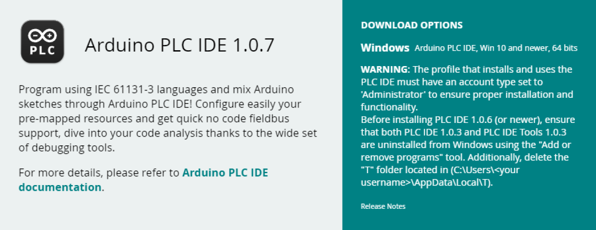
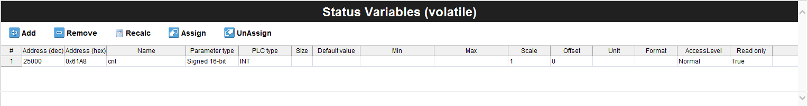
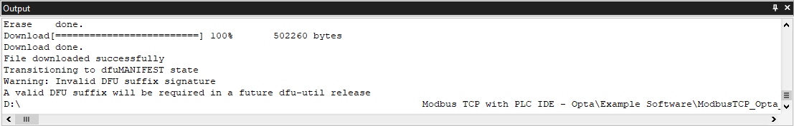
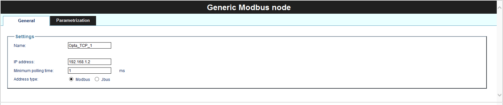
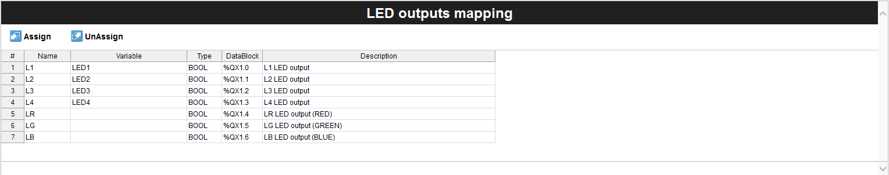

## Overview

Opta™ is distinguished by its industrial-grade hardware that ensures durability and consistent performance even in the most challenging environments. A highlight of its design is the inclusion of multiple connectivity options, notably Modbus TCP via the RJ-45 port.


In this tutorial, you will learn how to implement Modbus TCP based communication between two Opta™ devices using Arduino PLC IDE.

## Goals

- Learn how to configure the workspace environment to work with Modbus TCP using Arduino PLC IDE.
- Learn how to configure Modbus TCP for Opta™ using Arduino PLC IDE.
- Learn how to verify that Opta™ has been correctly set up using a Modbus TCP communication example.

## Required Hardware and Software

### Hardware Requirements

- [Opta™](https://store.arduino.cc/collections/pro-family) (x2)
- [USB-C® cable](https://store.arduino.cc/products/usb-cable2in1-type-c) (x2)
- RJ-45 LAN cable (x2)
- Ethernet Switch (Recommended) (x1)

### Software Requirements

- [Arduino PLC IDE software](https://www.arduino.cc/en/software#arduino-plc-ide)
- If you have an Opta™, you do not need any license key to activate your product. Go to section [__License Activation With Pre-Licensed Products (Opta™)__](https://docs.arduino.cc/software/plc-ide/tutorials/plc-ide-setup-license#7-license-activation-with-pre-licensed-products-opta) to know more.
- [Opta™ Modbus TCP PLC IDE Project Example File](assets/ModbusTCP_Opta_Example.zip)

## Modbus TCP

The Modbus protocol is a messaging service structure that uses Client/Server communication. It is an *application protocol*, with its data management independent of the transmission method.

The **Modbus TCP/IP**, often referred to as **Modbus TCP**, is a variant of the Modbus RTU protocol that uses the TCP/IP interface over Ethernet to exchange data between compatible devices. Here are some key elements to understand about Modbus TCP:

* The **Transmission Control Protocol (TCP)** is responsible for the exchange of packets.

* The **Internet Protocol (IP)** defines the addresses for routing message destinations.

* A particular feature of Modbus TCP concerns how it maintains data integrity. Since Modbus TCP encapsulates the basic data frame within the TCP frame, Modbus's usual checksum field is not used. Instead, the checksum method from the Ethernet TCP/IP layer ensures data integrity.

* Modbus TCP/IP sticks to TCP/IP networking standards on Ethernet, using the Modbus messaging service as its data handler. The connected devices are typically Modbus TCP/IP Client and Server devices. However, interconnections can also be established through routers, gateways or bridges, forming a TCP/IP network.

***Controller/Peripheral was formerly known as Master/Slave. The Modbus Organization no longer supports the use of this terminology. Devices formerly known as Master are referred to as Controller/Client and devices formerly known as Slaves are referred to as Peripheral/Server.***

## Modbus TCP & PLC IDE

This tutorial will guide you through setting up two Opta™ devices with Modbus TCP using the Arduino PLC IDE. Understanding the overall process of implementation is crucial for successful deployment.

Refer to the following diagram for a concise visualization of how Opta™ is configured and deployed with Modbus TCP:


The entire procedure is divided into three distinct stages:

* __Modbus TCP Configuration__ is the essential step in initializing the Opta™ device with Modbus TCP and other properties. A key component of this stage is the IP configuration, which is important for Modbus TCP communication and will be defined within the Arduino sketch.

 The Modbus TCP role, Client or Server, is assigned to the Opta™ device during this stage. Based on this role within the Modbus TCP, either the *`Status variables`* are set or the Modbus node is defined to determine the communicating devices using this protocol.

* __PLC Program__ is created after the device is initialized and configured for Modbus TCP and other basic settings. At this stage, there is no need for complex configurations or specific Modbus TCP programming in the PLC code.

 The process is designed for ease of use. The system automatically handles data exchange through Modbus TCP by referencing predefined variables in the PLC code. This approach leverages the device's initial setup, reducing repetitive tasks and ensuring efficient communication.

* __System Operation__ refers to the expected result after configuring Modbus TCP and running the PLC program based on the developer's logic. This setup allows the device to communicate seamlessly with others using Modbus TCP.

The accompanying diagram highlights the uniformity of Modbus TCP configurations across Arduino devices within the PLC IDE. A key advantage of this system is its flexibility. The PLC program works reliably regardless of specific Modbus TCP settings. This independence ensures the system's adaptability and compatibility across diverse applications.

The PLC code is also highly customizable, offering support for the IEC61131-3 standard. It allows developers to choose from multiple programming languages within the standard, allowing simplicity in program creation.

With this overview in mind, let’s explore the details further.

## Instructions

### Setting Up the Arduino PLC IDE

To get the Arduino PLC IDE software, go to the [official software website](https://www.arduino.cc/pro/software-plc-ide) and choose to download the PLC IDE installer file. The software is named **`Arduino PLC IDE Installer`**.



The software requires **Windows 10** or a newer operating system version for the x64 architecture.

The Arduino PLC IDE installer contains the IDE and all the required drivers, libraries, and cores. The following sections will help you install the software properly.

***For more details regarding Arduino PLC IDE setup, please take a look at [Arduino PLC IDE Setup and Board's License Activation](https://docs.arduino.cc/tutorials/portenta-machine-control/plc-ide-setup-license) tutorial.***

### Hardware Setup

The setup requires two Opta™ devices and the PLC IDE to enable Modbus TCP communication in this tutorial.

#### Connection and Ethernet Switch Integration

Connect the Ethernet LAN (RJ-45) cables to the `ETH RJ45` ports on both devices. The diagram below illustrates the setup:


This configuration includes an Ethernet switch, facilitating communication monitoring between the two Opta™ devices using the PLC IDE. While the Ethernet switch simplifies real-time data exchange, expandability and monitoring, it is *optional*. For simpler setups, the RJ-45 cable can connect the devices directly.

#### Field Deployment Setup

The Opta™ devices can connect directly to field applications without requiring an Ethernet switch. Additional Modbus TCP compatible devices can be added to the communication line as needed, making the setup scalable. Refer to the diagram below for this base configuration:


### Workspace Pre-Configuration

Before using Modbus TCP on Opta™ within the PLC IDE, there are a few important considerations to understand. The following sections provide a brief overview of these aspects.

#### PLC IDE Project Configuration & Licenses Management

Proper project setup and license management are key to making the most of the Arduino PLC IDE's features for industrial automation. Ensuring the workspace is configured correctly will help streamline development and avoid potential issues.

To get started, we strongly recommend reviewing [this tutorial](https://docs.arduino.cc/tutorials/portenta-machine-control/plc-ide-setup-license) for a comprehensive guide on setting up the PLC IDE and managing licenses effectively. It will help you navigate the current tutorial with ease.

#### Opta™ Basic Configuration

To set up Modbus TCP communication, it is necessary to determine the IP address of each Opta™ device. When connected to a network infrastructure via an RJ-45 cable and Ethernet switch with default settings, an IP address is automatically assigned to the Opta™ by an external *Dynamic Host Configuration Protocol (DHCP)* server. You can use an IP scanner, such as [Angry IP Scanner](https://angryip.org/), to identify the assigned address and use it as the device address for the Opta™.

Alternatively, you can manually configure a specific IP address using the **Ethernet.begin()** method. This approach is ideal when specific IP addresses are required to meet network policies. The IP settings can be defined through a sketch available in the `Resources` tab of the PLC IDE. Below is an example of what the manual IP configuration might look like:


***The __Ethernet.begin(ip, dns, gateway, subnet)__ method delays initialization by 60 seconds if the RJ-45 cable is disconnected or Ethernet settings (e.g., IP address) are incorrect. To adjust the timeout period, use the __Ethernet.begin(NULL, ip, dns, gateway, subnet, connection_timeout)__ method, which allows customization of the `connection_timeout` parameter for establishing the Data Layer connection.***

Once the IP configuration is complete, the virtual serial port simplifies communication between the computer and Opta™ for development within the Arduino PLC IDE. To connect to the Opta™ device:

1. Enable the Modbus RTU feature.
2. Navigate to `On-line -> Set up communication` in the PLC IDE.
3. Select the highest secondary USB port number.


Proper setup is important for interfacing with the PLC IDE and Opta™. Once the Opta™ properties are all set, you can connect and monitor the status of both devices.

#### Modbus TCP Client and Server Mode

The following image shows the interface available in the Modbus TCP configuration panel in the PLC IDE:


There are two options on the Modbus TCP configuration panel:

- Modbus TCP Master
- Modbus TCP Slave always enabled. Unit Identifier: 255

If the **Modbus TCP Master** option is left unchecked, the Opta™ device automatically adopts the role of a Modbus TCP Server with its designated Unit Identifier. In this mode, there is no need to manage the Unit Identifier manually. Communication is ensured based on the configured IP address, even when multiple devices share the same Unit Identifier.

When the **Modbus TCP Master** option is checked, the Opta™ device works in both Client and Server roles, with the Client role taking priority. In this mode, an additional option, *`General Modbus Node`* becomes available under the `Ethernet` configuration tab. The following section will explain this feature and its functionality in detail.

#### General Modbus Node Configuration

The *General Modbus Node* feature allows you to specify details about devices compatible with the Modbus messaging service.


Under the `General` tab, you must provide the IP address of the Modbus TCP compatible device to establish communication. Additional properties can be configured based on your preferences or project requirements.

If you initially configure Opta™ as a Modbus TCP Master and add a General Modbus Node, the Node option will remain even if you later disable the Client role. In such cases, the Node's configuration field will shift, requiring you to specify a Modbus address within the `1 ... 247` range.

#### PLC IDE Modbus Custom Editor

An alternative way to add a Modbus node is through the *Modbus Custom Editor*, available under the `Ethernet` configuration tab. To open it, navigate to `Tools -> Run Modbus Custom Editor` in the PLC IDE.

This tool allows you to define device details and preconfigure Modbus functions. The configuration can later be deployed by adding it under the `Ethernet` configuration tab.


The Modbus Custom Editor is particularly useful for storing frequently used device configurations compatible with the Modbus protocol.

### Project Overview

With the prerequisites and tools for Modbus TCP configuration on Opta™ devices using the PLC IDE ready, this example project will show how to establish Modbus TCP communication between two Opta™ devices.

The project modifies the default example code using a counter (`cnt`) variable. The counter data will be transmitted, providing real-time handshake verification between the two Opta™ devices. For this tutorial, Ethernet properties will be assigned manually to each Opta™.

The status LED and relay of the *Modbus TCP Master Opta™* will activate based on counter information received from the *Modbus TCP Slave Opta™*. The tutorial will guide you through configuring the Modbus TCP role for each Opta™.

For those wishing to skip the step by step procedure, the complete example project can be downloaded [here](assets/ModbusTCP_Opta_Example.zip). Every essential configuration and component has been included, ensuring it's ready to be compiled and uploaded to the corresponding Opta™ device.

You can download the complete example project [here](assets/ModbusTCP_Opta_Example.zip) if you prefer to jump right into it. The project includes all essential configurations and components, making it ready to compile and upload to the corresponding Opta™ devices.

The following sections will detail the configuration process for each Opta™ based on its specific role in Modbus TCP communication.

#### Modbus TCP Server Opta™

To configure Opta™ as a Modbus TCP Server, open the `Ethernet` tab in the `Resources` panel of the PLC IDE. Since the `Modbus TCP Slave mode` is always enabled by default, no additional changes are required in this window. Proper Ethernet configuration is essential for the Opta™ to work correctly with Modbus TCP.

When initializing a project file in the PLC IDE, the Ethernet properties in the sketch are typically commented out. These lines must be uncommented to activate the configuration. After making the necessary adjustments, the sketch should be manually downloaded to Opta™ through the `Opta™ Configuration` window.

The Modbus TCP Server Opta™ will use the following Ethernet settings within the sketch:

```arduino

void setup()
{
    // Configure static IP address
    IPAddress ip(192, 168, 1, 2);
    IPAddress dns(192, 168, 1, 23);
    IPAddress gateway(192, 168, 1, 23);
    IPAddress subnet(255, 255, 255, 0);
    // If the cable is not connected this will block the start of PLC with about 60s of timeout!
    Ethernet.begin(ip, dns, gateway, subnet);
}
```

These properties — `ip`, `dns`, `gateway`, and `subnet` — are provided as arguments to the `Ethernet.begin()` method, setting its properties for Opta™. The `ip(192, 168, 1, 2)` sets the static IP address of the Modbus TCP Server Opta™ and other properties, `(dns, gateway, subnet)` can be adjusted based on network requirements.

The following image shows the `Status variables (volatile)` window. Here, we will define the `cnt` variable, assigning its access address and datatype for Modbus TCP transmission.



The `cnt` status variable uses the following parameters:

* Address: 25000 (dec) / 0x61A8 (hex)
* Name: cnt
* PLC type: INT

After setup is ready, go to `Resources -> Opta`, select the corresponding port, and start the `Manual sketch download`. Activate the Modbus RTU feature and select the highest secondary USB port number under `On-line -> Set up communication`.


Once connected, navigate to `On-line -> Connect` to establish communication. A successful connection will display a status message in the bottom right corner of the PLC IDE, indicating the device is connected.


The connection statuses are denoted as follows:

- `(1)` Opta™ connected without a PLC code.
- `(2)` Opta™ connected with an uploaded PLC code.

Next, add the main PLC code under the `main` tab in the `Project` panel.

```arduino
cnt := cnt + 1;

IF cnt >= 2750 THEN
    cnt := 0;
END_IF;
```

This code increments the `cnt` variable and resets it to `0` once it reaches `2750`. To compile and upload the code, click the `Download PLC code` option or press `F7`. A successful upload will look like this:



With these steps completed, the Opta™ device is now configured as a Modbus TCP Server. The next section will guide you through configuring another Opta™ device as a Modbus TCP Client.

#### Modbus TCP Client Opta™

To set Opta™ as a Modbus TCP Client, navigate to the `Ethernet` tab found under the `Resources` panel in the PLC IDE. Here, check the `Modbus TCP Master` option. As previously discussed [here](#modbus-tcp-client-and-server-mode), this action will assign Opta™ as a Client. Do not worry about the greyed-out Server option.

To establish communication with the configured Modbus TCP Server Opta™, add a Modbus node by right-clicking on the `Ethernet` tab in the `Resources` panel. Once the `Add` option appears, select it to create a *Generic Modbus node*. For this example, configure the node with the following parameters:

* Name: Opta_TCP_1
* IP address: 192.168.1.2
* Minimum polling time: 1 ms
* Address type: Modbus

Ensure the IP address matches the one assigned to the Server Opta™ or any other compatible device you add. The resulting configuration should resemble the following image:



Once the Modbus node is defined, specify the Modbus function to retrieve the counter (`cnt`) data from the Server Opta™. Right click `Opta_TCP_1` (or the chosen name) and select the `Add` option. This will open a device catalog window displaying the available Modbus functions:


Select the **Modbus FC-04 (Read Input Registers)** function and configure the `General` tab with the following parameters:

* Start address: 25000
* Polling time: 0 ms (Continuous Read)
* Timeout: 1000 ms


Next, define a variable to store the counter data retrieved from the Server Opta™. Navigate to the `Input Reg.` tab in the Modbus function configuration window. Add a variable named `counter_rec` to hold the received data. The configuration should look like this:


The Modbus TCP Client Opta™ will use the following Ethernet properties.

```arduino

void setup()
{
    // Configure static IP address
    IPAddress ip(192, 168, 1, 1);
    IPAddress dns(192, 168, 1, 3);
    IPAddress gateway(192, 168, 1, 3);
    IPAddress subnet(255, 255, 255, 0);
    // If the cable is not connected this will block the start of PLC with about 60s of timeout!
    Ethernet.begin(ip, dns, gateway, subnet);
}
```

The `ip(192, 168, 1, 1)` represents the IP address of the Modbus TCP Client Opta™. These properties can be adjusted as needed, but ensure the `subnet` matches your network configuration.

The client Opta™ employs status LEDs and relays in this tutorial's example. The status LEDs can be defined with variables of your choice. For this example, it could use `LED1` to `LED4` designations for corresponding status LEDs.

The client Opta™ uses status LEDs and relays in this example. Define variables for LEDs (`LED1` to `LED4`) and relays (`relay_1` to `relay_4`) under the Local IO Mapping tab:

- Assign LEDs under the `LED Outputs` section.
- Assign relays under the `Relay Outputs` section.

If skipped, compilation errors will happen due to missing variable definitions. The setup should appear as follows:



A table with designated variable names for relays is shown below:


The main program below will be used to fetch counter data, control status LEDs, and manage corresponding relays.

```arduino
counter := counter_rec;

IF counter >= 500 THEN
	relay_1 := TRUE;
	LED1 := TRUE;
END_IF;

IF counter >= 1000 THEN 
	relay_2 := TRUE;
	LED2 := TRUE;
END_IF;

IF counter >= 1500 THEN 
	relay_3 := TRUE;
	LED3 := TRUE;
END_IF;

IF counter >= 2000 THEN 
	relay_4 := TRUE;
	LED4 := TRUE;
END_IF;

IF counter >= 2500 THEN
	relay_1 := FALSE;
	relay_2 := FALSE;
	relay_3 := FALSE;
	relay_4 := FALSE;
	LED1 := FALSE;
	LED2 := FALSE;
	LED3 := FALSE;
	LED4 := FALSE;
END_IF;
```

The `counter` is a global variable defined under `Global_vars`, while `counter_rec` is the Modbus variable storing data retrieved from the Server Opta™. This variable was configured during the *Read Input Registers Modbus function* setup.

Once the main PLC code is compiled and downloaded, the workspace interface for the Client Opta™ should resemble the following:


Finally, Opta™ is now ready as a Modbus TCP Client.

### Testing Modbus TCP Communication Between Opta™ Devices (PLC IDE)

You can download the complete example project [here](assets/ModbusTCP_Opta_Example.zip).

Run the main PLC code on both Opta™ devices with the hardware setup described in [this section](#hardware-setup). The following results can be observed on the client Opta™ at specific counter values:

* Counter value = `500`: The status LED #1 and relay #1 will turn on
* Counter value = `1000`: The status LED #2 and relay #2 will turn on
* Counter value = `1500`: The status LED #3 and relay #3 will turn on
* Counter value = `2000`: The status LED #4 and relay #4 will turn on
* Counter value = `2500`: All status LEDs and relays will turn off

For a visual representation of this behavior, refer to the following clip:


In the clip, the left window shows the Modbus TCP Client Opta™, while the right window displays the Modbus TCP Server Opta™.

## Conclusion

This tutorial covered the configuration of the workspace environment for Modbus TCP communication using the Arduino PLC IDE and Opta™ devices.

Additionally, through a hands-on example project, you have learned to verify that Opta™ is correctly set up and that Modbus TCP communication is working. This project showed the control of Opta™ device's onboard features, such as relays and status LEDs, based on a custom example.

### Next Steps

Now that you have learned to implement the Modbus TCP between Opta™ devices using Arduino PLC IDE, try expanding the setup by integrating additional Modbus TCP compatible devices into the communication network.

Additionally, you can explore the possibilities by leveraging the onboard features of the Opta™ device combined with the Modbus TCP communication network. This combination offers a nice enhancement solution for industrial management systems.

For more information regarding the Modbus RTU protocol implementation on an Opta™, it may interest you to check out ["Getting Started with Modbus RTU on Opta™"](https://docs.arduino.cc/tutorials/opta/getting-started-with-modbus-rtu) tutorial.