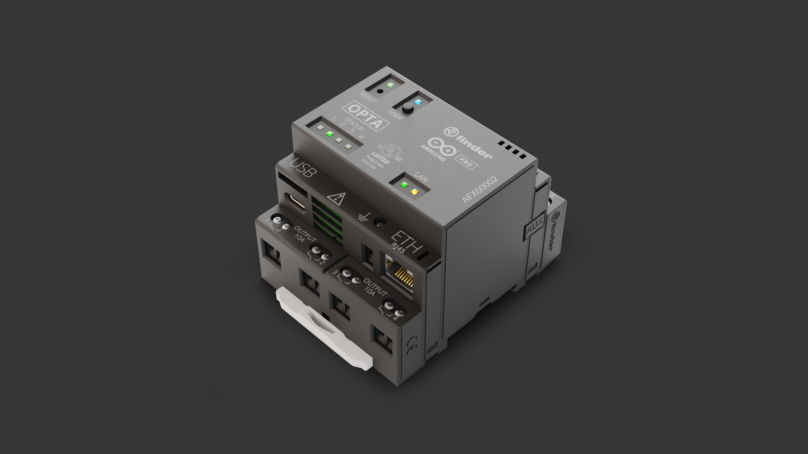

## Introduction

The home automation systems allow to control electronic devices remotely and to perform automatic routines based on the user's programming preferences, making domestic environments more convenient, comfortable, and efficient, also optimizing energy costs.

Home automation applications allow, for example, smart lights management and HVAC control. Thanks to its industrial IoT capabilities, Opta™️ is an excellent product for home automation applications.



## Goals

This application note shows a home automation system based on an Opta™️, capable of controlling a roller window shade, also known as roller blind, based on a programmed scenario. The application note's goals are to:

- Implement the roller window shade control (opening and closing) upon a programmed scenario
- Get inputs from limit switches included in the roller window shade's control system, for feedback and security reinforcement
- Control and monitor the roller window shade via [Arduino Cloud](https://create.arduino.cc/iot/)

## Hardware and Software Requirements

### Hardware Requirements

- [Opta™️ PLC with wireless connectivity support](https://store.arduino.cc/products/opta-wifi) (x1)
- [USB-C® cable](https://store.arduino.cc/products/usb-cable2in1-type-c) (x1)
- 12 V / 30 RPM DC motor (x1)

- Full-bridge motor driver (x1)
- A 3D printed case for the DC motor and its driver (.stl files of the case can be downloaded here)
- Normally Open (NO) Single Pole Double Throw (SPDT) limit switch (x2)
- 24AWG twisted-pair cable (for electrical connections)
- 12 V / 2 A DC power supply (x1)


### Software Requirements

- [Arduino IDE 1.8.10+](https://www.arduino.cc/en/software), [Arduino IDE 2.0+](https://www.arduino.cc/en/software), or [Arduino Cloud Editor](https://create.arduino.cc/editor)
- If you choose an offline Arduino IDE, you must install the following libraries: [`WiFi`](https://www.arduino.cc/reference/en/libraries/wifi/) and [`NTPClient`](https://github.com/arduino-libraries/NTPClient)
- For the IoT capabilities and features of the Opta™️, we will use [Arduino Cloud](https://create.arduino.cc/iot/things) (you will need to create an account if you don't have one yet)

## Hardware Setup Overview

The following diagram shows the electrical connections of the intended application:


The Opta™️ controls a DC motor via a driver using the digital output terminals `D0` and `D1`; two NO SPDT limit switches are connected to digital input terminals `I3` and `I4` of the Opta™️. A 12V DC/2A power supply is used to power the Opta™️, the DC motor, and the rest of the application.


***Note: The maximum voltage of Opta™️ digital input pins is 24 VDC.***

## Demonstration Description

### Application Overview

The first task of the program is to create the connection between the Opta™️ and the predefined Wi-Fi® network by the user in the Arduino IoT Cloud; when the Wi-Fi® connection is established, the internal real-time clock (RTC) of the Opta™️ will be synced using a Network Time Protocol (NTP) server.

Opta™️ RTC will be synced with the NTP server periodically (in this example, every 30 minutes) for security and reliability reasons.

***The NTP is a protocol used to synchronize the clocks of servers and clients across the Internet; it is intended to synchronize computers participating in the network within a few milliseconds of Coordinated Universal Time (UTC). You can read more about the NTP protocol [here](https://en.wikipedia.org/wiki/Network_Time_Protocol).***

After the RTC is synced, Opta™️ will be programmed for **opening** and **closing** the roller window shades using the DC motor, at specific hours every day:

- The roller window shade will open automatically in the morning as the sun rises (e.g. 6:00 AM) and close in the evening (e.g. 6:00 PM)
- The NO SPDT limit switches will provide Opta™️ a feedback for the sun shield's upper or lower end limit, triggering the motor's stop

### Example Sketch of the Application

Hereafter the sketch explained. Note that **this code must be updated considering the proper parameters of your roller window shade and DC motor characteristics**.

The first part  of the sketch includes some definitions needed to:

- Enable a Wi-Fi® connection to a network
- Set the the NTP client configuration
- Declare variables related to the RTC update interval and the programmed scenarios for the control of the shade

```arduino
// Libraries used in the sketch
#include <WiFi.h>
#include <NTPClient.h>
#include <mbed_mktime.h>

// Wi-Fi network credentials (replace with your network credentials)
char ssid[] = "YOUR_WIFI_SSID";   
char pass[] = "YOUR_WIFI_PASSWORD";
int status  = WL_IDLE_STATUS;

// NTP client configuration and RTC update interval
WiFiUDP   ntpUDP;
NTPClient timeClient(ntpUDP, "pool.ntp.org", -6*3600, 0);
unsigned long interval = 60*30*1000UL;
unsigned long lastTime = 0;

// Programmed scenarios
int local_hour;
int local_minutes;
int programmed_hour_1 = 6;
int programmed_hour_2 = 18;
int programmed_minutes_1 = 0;
int programmed_minutes_2 = 0;
```

For Wi-Fi® connectivity, we will use [`WiFi`](https://www.arduino.cc/reference/en/libraries/wifi/) library.

For the connection to an NTP server and to retrieve time information from it, we will use [`NTPClient`](https://github.com/arduino-libraries/NTPClient).

We are going to use specific RTC management methods from Mbed™️ to handle the internal RTC of the Opta™️ microcontroller. More information regarding those methods can be found [here](https://os.mbed.com/docs/mbed-os/v6.15/mbed-os-api-doxy/mbed__mktime_8h_source.html).

From the code shown above, there are two important lines:

```arduino
WiFiUDP   ntpUDP;
NTPClient timeClient(ntpUDP, "pool.ntp.org", -6*3600, 0);
```

The parameters of the `timeClient` object are as follows:

- The first parameter defines the type of connection with the NTP server (via UDP).
- The second parameter specifies the NTP server used for retrieving the date and time used for updating the internal RTC of the Opta™️; in this case we are going to use `pool.ntp.org`.
- The third parameter defines the time offset (your timezone) in seconds.
- Finally, the fourth parameter defines an update interval of the NTP client (in milliseconds).

These are some time offset examples to use for different timezones:

- GMT +1: `3600`
- GMT +8: `28800`
- GMT -1: `-3600`
- GMT 0: `0`

The variables `programmed_hour_1`, `programmed_hour_2`, `programmed_minutes_1`, and `programmed_minutes_2` are used to open or close the roller window shade at two specific times of the day. They can be changed according to your needs. 

The Opta™️ setup is shown as follows:

```arduino
// Opta initialization
void setup() {
  Serial.begin(9600);
  while (!Serial) {
    ;
  }
  delay(5000);

  // Attempt Wi-Fi connection
  while (status != WL_CONNECTED) {
    Serial.print("- Attempting to connect to WPA SSID: ");
    Serial.println(ssid);
    status = WiFi.begin(ssid, pass);
    delay(500);
  }
  
  // Display Wi-Fi network information
  Serial.println();
  Serial.println("- NETWORK INFORMATION");
  Serial.print("- You're now connected to the network ");
  printCurrentNet();
  printWifiData();
  delay(5000);

  // NTP client object initialization and time update, display updated time on the Serial Monitor
  timeClient.begin();
  updateTime();
  
  // Digital inputs, digital outputs, built-in LEDs initialization
  pinMode(LED_D0, OUTPUT);
  pinMode(LED_D1, OUTPUT);
  pinMode(D0, OUTPUT);
  pinMode(D1, OUTPUT);
  pinMode(A2, INPUT);
  pinMode(A3, INPUT);

  // Stop the roller window shade from moving
  digitalWrite(LED_D0, LOW);
  digitalWrite(LED_D1, LOW);
  stop_shade();
}
```

There are five essential steps in the setup function:

- The serial port is initialized to `9600` bauds; it will be used in the application for debugging purposes.
- A Wi-Fi® connection is attempted; the application will not start unless the Wi-Fi® connection is established successfully.
- After establishing a Wi-Fi® connection, the connected network information is displayed using the `printCurrentNet()` and `printWifiData()` functions in the Arduino IDE Serial Monitor. This information will be used for debugging purposes.
- The NTP client is initialized, and Opta™️ PLC's RTC is aligned with the updated time retrieved from the NTP server.

- Two digital inputs, two digital outputs, and two built-in LEDs of Opta™️ are initialized, the roller window shade is stopped using the `stop_shade()` function. The built-in LEDs of Opta™️ are used in the application as visual feedback for user feedback and debugging purposes.


The main loop shown below:

```arduino
void loop() {
  // Check and verify if it's time to move up or down the roller window shade

  local_hour = getLocalHour();
  local_minutes = getLocalMinutes();

  if (programmed_hour_1 == local_hour && programmed_minutes_1 == local_minutes) {
    Serial.println("- Rolling down shade!");
    roll_down_shade();
  } else if (programmed_hour_2 == local_hour && programmed_minutes_2 == local_minutes) {
    Serial.println("- Rolling up shade!");
    roll_up_shade();
  } else {
    stop_shade();
  }

  // Update time client periodically
  unsigned long currentTime = millis();
  if (currentTime - lastTime >= interval) {
    updateTime();
    lastTime = currentTime;
  }
} 
```

The main loop can be divided into two essential steps:

- The `getLocalHour()` and `getLocalMinutes()` functions are used to acquire Opta™'s local time (from its RTC); this is then compared to the programmed scenarios times (in this example, 6:00 AM and 6:00 PM). The roller window shade must be opened or closed if Optas™'s RTC time matches the programmed scenarios.
- The Opta™️ RTC is updated periodically (every 30 minutes in the example) using the `updateTime()` function.

### Complete Example Sketch of the Application

The complete example sketch explained before is shown below; pay attention to the `updateTime()`, `getLocalTime()`, `getLocalHour()`, `roll_down_shade()`, `roll_up_shade()`, `stop_shade()`, `printWifiData()`, and `printCurrentNet()` functions:

```arduino
/**
  Home Automation with Opta (Application Note)
  Name: window_shade_roller_opta.ino
  Purpose: Open or close a roller window shade based on a programmed scenario

  @author: José Bagur and Taddy Chung
  @version: 1.3 (15/02/23)
*/

// Libraries used in the sketch
#include <WiFi.h>
#include <NTPClient.h>
#include <mbed_mktime.h>

// Wi-Fi network credentials
char ssid[] = "YOUR_WIFI_SSID";   
char pass[] = "YOUR_WIFI_PASSWORD";
int status  = WL_IDLE_STATUS;

// NTP client configuration and RTC update interval
WiFiUDP   ntpUDP;
NTPClient timeClient(ntpUDP, "pool.ntp.org", -6*3600, 0);
unsigned long interval = 60*30*1000UL;
unsigned long lastTime = 0;

// Programmed scenarios for opening or closing the shade
int local_hour;
int local_minutes;
int programmed_hour_1 = 6;
int programmed_hour_2 = 18;
int programmed_minutes_1 = 0;
int programmed_minutes_2 = 0;

bool shade_state = false; 


// Opta initialization
void setup() {
  Serial.begin(9600);
  while (!Serial) {
    ;
  }
  delay(5000);

  // Attempt Wi-Fi connection
  while (status != WL_CONNECTED) {
    Serial.print("- Attempting to connect to WPA SSID: ");
    Serial.println(ssid);
    status = WiFi.begin(ssid, pass);
    delay(500);
  }
  
  // Display Wi-Fi network information
  Serial.println();
  Serial.println("- NETWORK INFORMATION");
  Serial.print("- You're now connected to the network ");
  printCurrentNet();
  printWifiData();
  delay(5000);

  // NTP client object initialization and time update, display updated time on the Serial Monitor
  timeClient.begin();
  updateTime();
  
  // Digital inputs, digital outputs, built-in LEDs initialization
  pinMode(LED_D0, OUTPUT);
  pinMode(LED_D1, OUTPUT);
  pinMode(D0, OUTPUT);
  pinMode(D1, OUTPUT);
  pinMode(A2, INPUT);
  pinMode(A3, INPUT);

  // Stop the roller window shade from moving
  digitalWrite(LED_D0, LOW);
  digitalWrite(LED_D1, LOW);
  stop_shade();
}

void loop() {
  // Check and verify if it's time to move up or down the roller window shade

  local_hour = getLocalHour();
  local_minutes = getLocalMinutes();

  if (programmed_hour_1 == local_hour && programmed_minutes_1 == local_minutes) {
    Serial.println("- Rolling down shade!");
    roll_down_shade();
  } else if (programmed_hour_2 == local_hour && programmed_minutes_2 == local_minutes) {
    Serial.println("- Rolling up shade!");
    roll_up_shade();
  } else {
    stop_shade();
  }

  // Update time client periodically
  unsigned long currentTime = millis();
  if (currentTime - lastTime >= interval) {
    updateTime();
    lastTime = currentTime;
  }
}

/**
  Updates Opta's internal RTC using a NTP server

  @param none
  @return none
*/
void updateTime() {
  Serial.println();
  Serial.println("- TIME INFORMATION:");
  timeClient.update();
  const unsigned long epoch = timeClient.getEpochTime();
  set_time(epoch);
  Serial.print("- UTC time: ");
  Serial.println(getLocalTime());
  Serial.print("- Unix time: ");
  Serial.println(epoch);
}

/**
  Retrieves Opta's RTC time

  @param none
  @return Opta's RTC time in hh:mm:ss format
*/
String getLocalTime() {
  char buffer[32];
  tm t;
  _rtc_localtime(time(NULL), &t, RTC_FULL_LEAP_YEAR_SUPPORT);
  strftime(buffer, 32, "%k:%M:%S", &t);
  return String(buffer);
}

/**
  Retrieves Opta's RTC hour

  @param none
  @return Opta's RTC hour (int)
*/
int getLocalHour() {
  int hour;
  tm t;
  _rtc_localtime(time(NULL), &t, RTC_FULL_LEAP_YEAR_SUPPORT);
  hour = t.tm_hour;
  return hour;
}

/**
  Retrieves Opta's RTC minutes

  @param none
  @return Opta's RTC minutes (int)
*/
int getLocalMinutes() {
  int minutes;
  tm t;
  _rtc_localtime(time(NULL), &t, RTC_FULL_LEAP_YEAR_SUPPORT);
  minutes = t.tm_min;
  return minutes;
}

/**
  Rolls down the shade

  @param none
  @return none
*/
void roll_down_shade() {
  while(digitalRead(A2) == LOW) { 
    Serial.println("- ROLLING DOWN SHADE!");
    digitalWrite(D0, HIGH);
    digitalWrite(D1, LOW);
    digitalWrite(LED_D0, HIGH);
    digitalWrite(LED_D1, LOW);
  } 
  
  Serial.println("- STOP SHADE!");
  digitalWrite(LED_D0, LOW);
  digitalWrite(LED_D1, LOW);
  stop_shade();
  shade_state = false; 
}

/**
  Rolls up the shade

  @param none
  @return none
*/
void roll_up_shade() {
  while(digitalRead(A3) == LOW) { 
    Serial.println("- ROLLING UP SHADE!");
    digitalWrite(D0, LOW);
    digitalWrite(D1, HIGH);
    digitalWrite(LED_D0, LOW);
    digitalWrite(LED_D1, HIGH);
  }
  
  Serial.println("- STOP SHADE!");
  digitalWrite(LED_D0, LOW);
  digitalWrite(LED_D1, LOW);
  stop_shade();
  shade_state = true;  
}

/**
  Stops the shade from moving up or down

  @param none
  @return none
*/
void stop_shade() {
  digitalWrite(D0, LOW);
  digitalWrite(D1, LOW);
}

/**
  Prints local Wi-Fi network IP and MAC address

  @param none
  @return none
*/
void printWifiData() {
  // Display network IP
  IPAddress ip = WiFi.localIP();
  Serial.print("- IP address: ");
  Serial.println(ip);

  // Display MAC address
  byte mac[6];
  WiFi.macAddress(mac);
  Serial.print("- MAC address: ");
  Serial.print(mac[5], HEX);
  Serial.print(":");
  Serial.print(mac[4], HEX);
  Serial.print(":");
  Serial.print(mac[3], HEX);
  Serial.print(":");
  Serial.print(mac[2], HEX);
  Serial.print(":");
  Serial.print(mac[1], HEX);
  Serial.print(":");
  Serial.println(mac[0], HEX);
}

/**
  Prints connected Wi-Fi network SSID, BSSID, RSSI and encryption type

  @param none
  @return none
*/
void printCurrentNet() {
  // Display network SSID
  Serial.println(WiFi.SSID());
  
  // Display network BSSID
  byte bssid[6];
  WiFi.BSSID(bssid);
  Serial.print("- BSSID: ");
  Serial.print(bssid[5], HEX);
  Serial.print(":");
  Serial.print(bssid[4], HEX);
  Serial.print(":");
  Serial.print(bssid[3], HEX);
  Serial.print(":");
  Serial.print(bssid[2], HEX);
  Serial.print(":");
  Serial.print(bssid[1], HEX);
  Serial.print(":");
  Serial.println(bssid[0], HEX);

  // Display network RSSI
  long rssi = WiFi.RSSI();
  Serial.print("- Signal strength (RSSI): ");
  Serial.println(rssi);

  // Display network encryption 
  byte encryption = WiFi.encryptionType();
  Serial.print("- Encryption type: ");
  Serial.println(encryption, HEX);
}
```

### Arduino Cloud Integration

The example code explained before can be modified to connect the roller window shade to the [Arduino Cloud](https://create.arduino.cc/iot/), leveraging the wireless connectivity features of the Opta™️; **remember that you must have an Arduino Cloud account**. With the Arduino Cloud integration, we are going to add more advanced functionalities such as remote programming, actuation and monitoring to the application:

- Change the programmed scenarios (hours and minutes).
- Open or close the roller window shade at any time.
- Monitor the roller window shade status (open or close).

***If you are new to the Arduino Cloud, check out this [getting started guide](https://docs.arduino.cc/arduino-cloud/guides/overview).***

After associating your Opta™️ device to your Arduino Cloud account, create a thing; in this example, we called the thing "Shade Controller." In the "Shade Controller" thing, create the Cloud variables explained below:

Variable: `programmed_hour_1`
- Type: `int`
- Permission: `Read & Write`
- Update policy: `On change`
- Description: this variable defines the hour of the first programmed scenario.

Variable: `programmed_hour_2`
- Type: `int`
- Permission: `Read & Write`
- Update policy: `On change`
- Description: this variable defines the hour of the second programmed scenario.

Variable: `programmed_minutes_1`
- Type: `int`
- Permission: `Read & Write`
- Update policy: `On change`
- Description: this variable defines the minutes of the first programmed scenario.

Variable: `programmed_minutes_2`
- Type: `int`
- Permission: `Read & Write`
- Update policy: `On change`
- Description: this variable defines the minutes of the second programmed scenario.

Variable: `open_shade`
- Type: `bool`
- Permission: `Read & Write`
- Update policy: `On change`
- Description: this variable is used to open the roller window shade if it is set to `true`.

Variable: `close_shade`
- Type: `bool`
- Permission: `Read & Write`
- Update policy: `On change`
- Description: this variable is used to close the roller window shade if it is set to `true`.

Variable: `shade_shade`
- Type: `bool`
- Permission: `Read & Write`
- Update policy: `Periodically`
- Description: this variable is used to monitor the current status of the roller window shade, `true` for open and `false` for closed.


We will use a dashboard and widgets to modify the variables explained before. An example dashboard is shown below:


In the dashboard shown above:

-  **`Value`**-type widgets are used to show the current value of the `programmed_hour_1`, `programmed_hour_2`, `programmed_minutes_1`, and `programmed_minutes_2` variables. These widgets can also be used to modify the value of the linked variables.

-  **`LED`**-type widget shows the current status of the `shade_state` variable, green when the shade is open and red when the shade is closed.

-  **`Push button`** widgets are used to open or close the shade anytime.

The complete example sketch with the Arduino Cloud integration is shown below:

```arduino
#include <NTPClient.h>
#include <mbed_mktime.h>
#include "thingProperties.h"

// NTP client configuration and RTC update interval
WiFiUDP   ntpUDP;
NTPClient timeClient(ntpUDP, "pool.ntp.org", -6 * 3600, 0);
unsigned long interval = 60 * 30 * 1000UL;
unsigned long lastTime = 0;

int local_hour;
int local_minutes;

void setup() {
  Serial.begin(9600);
  delay(1500);

  // Arduino Cloud initialization
  initProperties();
  ArduinoCloud.begin(ArduinoIoTPreferredConnection);
  setDebugMessageLevel(2);
  ArduinoCloud.printDebugInfo();
  
  while (ArduinoCloud.connected() == 0) {
    ArduinoCloud.update();
		Serial.println("- Waiting for connection to Arduino Cloud");
		delay(1000);
	}

  // NTP client object initialization and time update, display updated time on the Serial Monitor
  timeClient.begin();
  updateTime();

  // Digital inputs, digital outputs, built-in LEDs initialization
  pinMode(LED_D0, OUTPUT);
  pinMode(LED_D1, OUTPUT);
  pinMode(D0, OUTPUT);
  pinMode(D1, OUTPUT);
  pinMode(A0, INPUT);
  pinMode(A1, INPUT);

  // Stop the roller window shade from moving
  stop_shade();
  open_shade = false;
  close_shade = false;
  programmed_hour_1 = 6;
  programmed_hour_2 = 18;
  programmed_minutes_1 = 0;
  programmed_minutes_2 = 0;
  
}

void loop() {
  // Update Arduino Cloud
  ArduinoCloud.update();
  delay(1000);
  
  // Check and verify if it's time to move up or down the roller window shade

  local_hour = getLocalHour();
  local_minutes = getLocalMinutes();

  if (programmed_hour_1 == local_hour && programmed_minutes_1 == local_minutes) {
    Serial.println("- Rolling down shade!");
    roll_down_shade();
  } else if (programmed_hour_2 == local_hour && programmed_minutes_2 == local_minutes) {
    Serial.println("- Rolling up shade!");
    roll_up_shade();
  } else {
    stop_shade();
  }

  // Update time client periodically
  unsigned long currentTime = millis();
  if (currentTime - lastTime >= interval) {
    updateTime();
    lastTime = currentTime;
  }
}

/**
  Updates Opta's internal RTC using a NTP server

  @param none
  @return none
*/
void updateTime() {
  Serial.println();
  Serial.println("- TIME INFORMATION:");
  timeClient.update();
  const unsigned long epoch = timeClient.getEpochTime();
  set_time(epoch);
  Serial.print("- UTC time: ");
  Serial.println(getLocalTime());
  Serial.print("- Unix time: ");
  Serial.println(epoch);
}

/**
  Retrieves Opta's RTC time

  @param none
  @return Opta's RTC time in hh:mm:ss format
*/
String getLocalTime() {
  char buffer[32];
  tm t;
  _rtc_localtime(time(NULL), &t, RTC_FULL_LEAP_YEAR_SUPPORT);
  strftime(buffer, 32, "%k:%M:%S", &t);
  return String(buffer);
}

/**
  Retrieves Opta's RTC hour

  @param none
  @return Opta's RTC hour (int)
*/
int getLocalHour() {
  int hour;
  tm t;
  _rtc_localtime(time(NULL), &t, RTC_FULL_LEAP_YEAR_SUPPORT);
  hour = t.tm_hour;
  return hour;
}

/**
  Retrieves Opta's RTC minutes

  @param none
  @return Opta's RTC minutes (int)
*/
int getLocalMinutes() {
  int minutes;
  tm t;
  _rtc_localtime(time(NULL), &t, RTC_FULL_LEAP_YEAR_SUPPORT);
  minutes = t.tm_min;
  return minutes;
}

/**
  Rolls down the shade

  @param none
  @return none
*/
void roll_down_shade() {
  while(digitalRead(A0) == LOW) { 
    Serial.println("- ROLLING DOWN SHADE!");
    digitalWrite(D0, HIGH);
    digitalWrite(D1, LOW);
    digitalWrite(LED_D0, HIGH);
    digitalWrite(LED_D1, LOW);
    ArduinoCloud.update();
    delay(1000);
  } 
  
  Serial.println("- STOP SHADE!");
  digitalWrite(LED_D0, LOW);
  digitalWrite(LED_D1, LOW);
  stop_shade();
  shade_state = false; 
}

/**
  Rolls up the shade

  @param none
  @return none
*/
void roll_up_shade() {
  while(digitalRead(A1) == LOW) { 
    Serial.println("- ROLLING UP SHADE!");
    digitalWrite(D0, LOW);
    digitalWrite(D1, HIGH);
    digitalWrite(LED_D0, LOW);
    digitalWrite(LED_D1, HIGH);
    ArduinoCloud.update();
    delay(1000);
  }
  
  Serial.println("- STOP SHADE!");
  digitalWrite(LED_D0, LOW);
  digitalWrite(LED_D1, LOW);
  stop_shade();
  shade_state = true;  
}

/**
  Stops the shade from moving up or down

  @param none
  @return none
*/
void stop_shade() {
  digitalWrite(LED_D0, LOW);
  digitalWrite(LED_D1, LOW);
  digitalWrite(D0, LOW);
  digitalWrite(D1, LOW);
}

/*
  Since ProgrammedHour1 is READ_WRITE variable, onProgrammedHour1Change() is
  executed every time a new value is received from IoT Cloud.
*/
void onProgrammedHour1Change()  {
  Serial.println(programmed_hour_1);
}

/*
  Since ProgrammedHour2 is READ_WRITE variable, onProgrammedHour2Change() is
  executed every time a new value is received from IoT Cloud.
*/
void onProgrammedHour2Change()  {
  Serial.println(programmed_hour_2);
}


/*
  Since ProgrammedMinutes1 is READ_WRITE variable, onProgrammedMinutes1Change() is
  executed every time a new value is received from IoT Cloud.
*/
void onProgrammedMinutes1Change()  {
  Serial.println(programmed_minutes_1);
}

/*
  Since ProgrammedMinutes2 is READ_WRITE variable, onProgrammedMinutes2Change() is
  executed every time a new value is received from IoT Cloud.
*/
void onProgrammedMinutes2Change()  {
  Serial.println(programmed_minutes_2);
}
/*
  Since CloseShade is READ_WRITE variable, onCloseShadeChange() is
  executed every time a new value is received from IoT Cloud.
*/
void onCloseShadeChange()  {
  if (close_shade == true) {
    Serial.println("CAMBIO CLOSE SHADE TRUE");
    close_shade = false;
    roll_down_shade();
  }
}
/*
  Since OpenShade is READ_WRITE variable, onOpenShadeChange() is
  executed every time a new value is received from IoT Cloud.
*/
void onOpenShadeChange()  {
  if (open_shade == true) {
    Serial.println("CAMBIO OPEN SHADE TRUE");
    open_shade = false;
    roll_up_shade();
  }
}
/*
  Since ShadeState is READ_WRITE variable, onShadeStateChange() is
  executed every time a new value is received from IoT Cloud.
*/
void onShadeStateChange()  {
  Serial.println(shade_state);
}
```

## Conclusion

This application note shows how to implement an effective home automation system that can control roller window shades with Opta™️. By leveraging the internal RTC of the Opta™️ and NTP server time data, the proposed system can accurately and automatically control the shades based on pre-programmed scenarios. Additionally, the proposed system can be easily monitored and controlled through the Arduino Cloud, providing users with remote management capabilities.
