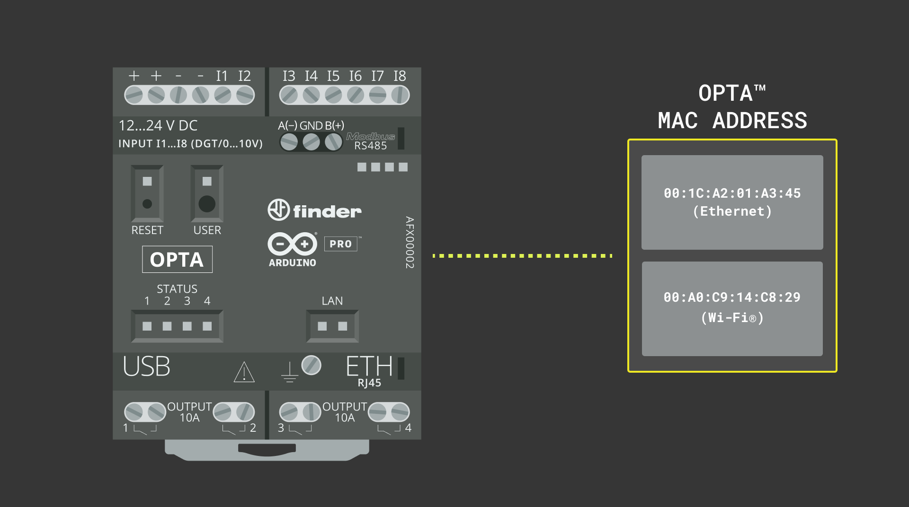
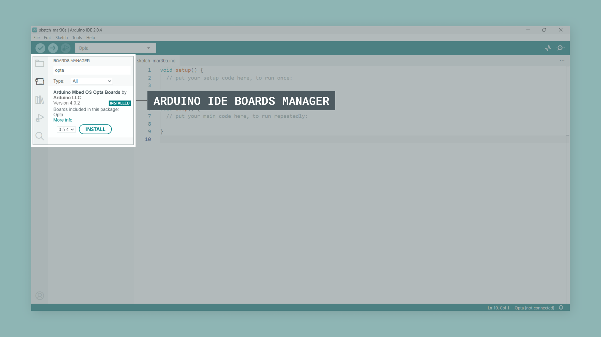
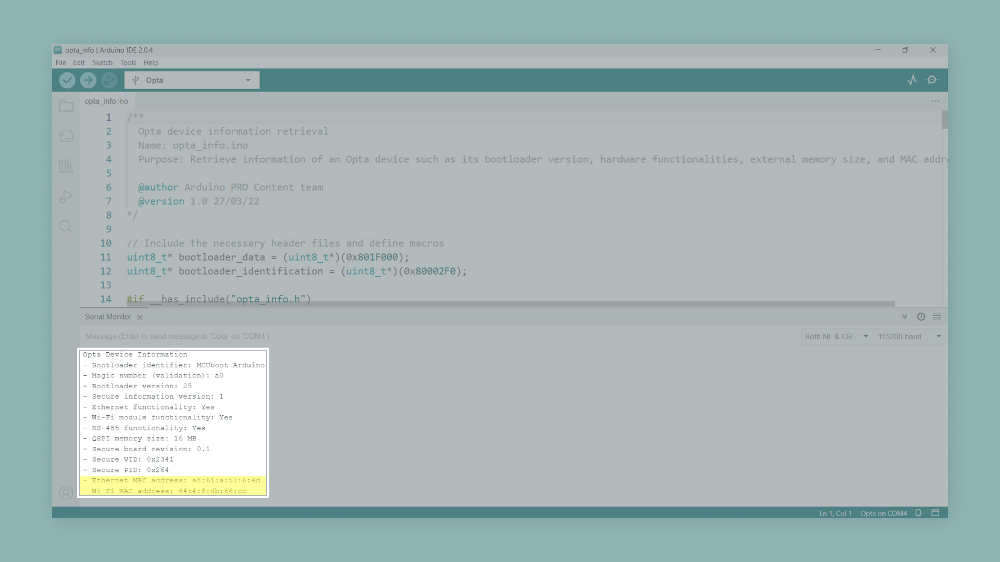

## Overview

The Media Access Control (MAC) address is essential for computer networking and devices with Internet of Things (IoT) capabilities, such as the [Opta™](/hardware/opta). In this tutorial, we will learn how to retrieve the MAC address of an Opta™ device using the Arduino ecosystem tools.



## Goals

- Learn how to retrieve the MAC address of an Opta™ device.
- Learn how to use the Arduino ecosystem tools to get information from Arduino hardware devices.

## Hardware and Software Requirements

### Hardware Requirements

- [Opta™ Lite](https://store.arduino.cc/products/opta-lite), [Opta™ RS485](https://store.arduino.cc/products/opta-rs485), or [Opta™ WiFi](https://store.arduino.cc/products/opta-wifi) (x1) (x1)
- [USB-C® cable](https://store.arduino.cc/products/usb-cable2in1-type-c) (x1)

### Software Requirements

- [Arduino IDE 1.8.10+](https://www.arduino.cc/en/software), [Arduino IDE 2](https://www.arduino.cc/en/software), or [Arduino Cloud Editor](https://create.arduino.cc/editor)
- [The MAC address retrieval example sketch](assets/opta_info.ino)

## MAC Address Basics


A MAC address is a unique value associated with a network adapter. They are also known, or usually referred to, as the **hardware or physical address** of electronic devices with networking capabilities. The MAC address is used to identify and distinguish it from other devices connected to a network; which allows it to send and receive data to specific devices in the network.

***A MAC address uniquely identifies a network adapter in a Local Area Network (LAN).***

MAC addresses are 48-bit numbers written in one of the following 12 hexadecimal digits formats:

- `MMMMMMSSSSSS`
- `MM MM MM SS SS SS`
- `MMMM MMSS SSSS`
- `MM:MM:MM:SS:SS:SS`
- `MMMM:MMSS:SSSS`
- `MM.MM.MM.SS.SS.SS`
- `MMMM.MMSS.SSSS`

The first half of the 12-digit number (the first 24 bits) identifies the adapter manufacturer (identified with an M); the second half of the 12-digit number represents a serial number (identified with an S) assigned to the adapter by its manufacturer. For example:

- `00:A0:C9:14:C8:29`

In the MAC address shown above, `00A0C9` indicates that the adapter manufacturer is Intel®, and `14C829` is the serial number assigned by Intel to the adapter. 

### Opta™ MAC Address

Opta™ is available in three variants; **all of them have an Ethernet connection and its corresponding MAC address and, in the case of the most advanced variant with Wi-Fi®/Bluetooth®, an additional MAC address to identify the additional Wi-Fi®/Bluetooth® module**. Let's learn how to retrieve the MAC addresses of an Opta™ device using the Arduino ecosystem tools.

## Instructions

### Setting Up the Arduino IDE 

This tutorial will need the latest version of the Arduino IDE; you can download it [here](https://www.arduino.cc/en/software). If it is your first time setting up the Opta™ with the Arduino IDE, check the [Opta™ User Manual](https://docs.arduino.cc/tutorials/opta/user-manual) first. In the Arduino IDE, we need to install the core for Opta™ devices; this can be done by navigating to **Tools > Board > Boards Manager**. In the Board Manager tab, search for `Opta` and install the latest `Arduino Mbed OS Opta Boards` version.



Now we are ready to start compiling and uploading sketches to an Opta™ device using the Arduino IDE. 

### Retrieving the MAC Address of an Opta™ Device

Opta™ device information is stored in a secured memory space. The example code shown below shows how that memory space can be accessed using predefined functions of the Opta™ core: 

```arduino
/**
  Opta device information retrieval 
  Name: opta_info.ino
  Purpose: Retrieve information of an Opta device such as its bootloader version, hardware functionalities, external memory size, and MAC address.

  @author Arduino PRO Content team
  @version 1.0 27/03/22
*/

// Include the necessary header files and define macros
uint8_t* bootloader_data = (uint8_t*)(0x801F000);
uint8_t* bootloader_identification = (uint8_t*)(0x80002F0);

#if __has_include("opta_info.h")
  #include "opta_info.h"
  #define GET_OPTA_OTP_BOARD_INFO
  OptaBoardInfo* info;
  OptaBoardInfo* boardInfo();
#endif

void setup() {
  Serial.begin(115200);
  while (!Serial) {}
  delay(2500);

  Serial.println("Opta Device Information");

  uint8_t currentBootloaderVersion = bootloader_data[1];
  String currentBootloaderIdentifier = String(bootloader_identification, 15);

  if (!currentBootloaderIdentifier.equals("MCUboot Arduino")) {
    currentBootloaderIdentifier = "Arduino loader";
  }

  Serial.println("- Bootloader identifier: " + currentBootloaderIdentifier);
  Serial.println("- Magic number (validation): " + String(bootloader_data[0], HEX));
  Serial.println("- Bootloader version: " + String(bootloader_data[1]));

#if defined(GET_OPTA_OTP_BOARD_INFO)
  printOptaSecureInfo();
#endif
}

#if defined(GET_OPTA_OTP_BOARD_INFO)

/**
  Checks if the magic number is 0xB5. If it is, prints the secure information of the device in the Serial Monitor.
  
  @params none
  @return none
*/
void printOptaSecureInfo() {
  info = boardInfo();
  if (info->magic == 0xB5) {
    Serial.println("- Secure information version: " + String(info->version));
    Serial.println("- Ethernet functionality: " + String(info->_board_functionalities.ethernet == 1 ? "Yes" : "No"));
    Serial.println("- Wi-Fi module functionality: " + String(info->_board_functionalities.wifi == 1 ? "Yes" : "No"));
    Serial.println("- RS-485 functionality: " + String(info->_board_functionalities.rs485 == 1 ? "Yes" : "No"));
    Serial.println("- QSPI memory size: " + String(info->external_flash_size) + " MB");
    Serial.println("- Secure board revision: " + String(info->revision >> 8) + "." + String(info->revision & 0xFF));
    Serial.println("- Secure VID: 0x" + String(info->vid, HEX));
    Serial.println("- Secure PID: 0x" + String(info->pid, HEX));
    Serial.println("- Ethernet MAC address: " + String(info->mac_address[0], HEX) + ":" + String(info->mac_address[1], HEX) + ":" + String(info->mac_address[2], HEX) + ":" + String(info->mac_address[3], HEX) + ":" + String(info->mac_address[4], HEX) + ":" + String(info->mac_address[5], HEX));
    if (info->_board_functionalities.wifi == 1) {
      Serial.println("- Wi-Fi MAC address: " + String(info->mac_address_2[0], HEX) + ":" + String(info->mac_address_2[1], HEX) + ":" + String(info->mac_address_2[2], HEX) + ":" + String(info->mac_address_2[3], HEX) + ":" + String(info->mac_address_2[4], HEX) + ":" + String(info->mac_address_2[5], HEX));
    }
  } else {
    Serial.println("- No secure information available!");
    printBootloaderInfo();
  }
}
#endif

/**
  Prints clock source, USB speed, Ethernet functionality, Wi-Fi functionality, RAM memory size, QSPI memory size, video output functionality, and secure element functionality.
  
  @params none
  @return none
*/
void printBootloaderInfo() {
  Serial.println("- Clock source: " + getClockSource(bootloader_data[2]));
  Serial.println("- USB Speed: " + getUSBSpeed(bootloader_data[3]));
  Serial.println("- Ethernet functionality: " + String(bootloader_data[4] == 1 ? "Yes" : "No"));
  Serial.println("- Wi-Fi functionality: " + String(bootloader_data[5] == 1 ? "Yes" : "No"));
  Serial.println("- RAM size: " + getRAMSize(bootloader_data[6]));
  Serial.println("- QSPI memory size: " + String(bootloader_data[7]) + " MB");
  Serial.println("- Video output functionality: " + String(bootloader_data[8] == 1 ? "Yes" : "No"));
  Serial.println("- Secure element functionality: " + String(bootloader_data[9] == 1 ? "Yes" : "No"));
}

/**
  Convert a flag in the bootloader data to USB speed information.
  
  @param bootloader flag (uint8_t)
  @return USB speed information as a String
*/
String getUSBSpeed(uint8_t flag) {
  switch (flag) {
    case 1:
      return "USB 2.0/Hi-Speed (480 Mbps)";
    case 2:
      return "USB 1.1/Full-Speed (12 Mbps)";
    default:
      return "N/A";
  }
}

/**
  Convert a flag in the bootloader data to clock source information.
  
  @param bootloader flag (uint8_t)
  @return clock source information as a String
*/
String getClockSource(uint8_t flag) {
  switch (flag) {
    case 0x8:
      return "External oscillator";
    case 0x4:
      return "External crystal";
    case 0x2:
      return "Internal clock";
    default:
      return "N/A";
  }
}

/**
  Convert a flag in the bootloader data to RAM size information.
  
  @param bootloader flag (uint8_t)
  @return RAM size information as a String
*/
String getRAMSize(uint8_t flag) {
  if (flag == 0) {
    return "N/A";
  }
  return (String(flag) + "MB");
}

void loop() {
  delay(1000);
}
```

To upload the code, click the **Verify** button to compile the sketch and check for errors; then click the **Upload** button to program the device with the sketch. 


The code above retrieves information from an Opta™ device, including its MAC address, and prints it to the Arduino IDE's Serial Monitor. The information shown includes the bootloader version and identifier, secure board information, and general board information.

***Please note that there are versions of the Opta™ with bootloader version `<v24`, which do not store the bootloader identifier at `0x80002F0`. Therefore, it will show `v255`, since the memory area is empty.***



- The `printOptaSecureInfo()` function checks if the magic number of the `OptaBoardInfo` structure is `0xB5`, indicating that secure information is available. If it is, it prints the secure information to the IDE's Serial Monitor, including the board's functionalities (Ethernet, Wi-Fi®/Bluetooth® capabilities, and RS-485 capabilities), QSPI memory size, board revision, VID, PID, and the MAC address of the Ethernet port. If the board has Wi-Fi®/Bluetooth® capabilities, the function will also print the MAC address of the Wi-Fi®/Bluetooth® module. 
- If the magic number doesn't match, it prints a message indicating that no secure information is available and proceeds to print the bootloader information using the `printBootloaderInfo()` function. The `printBootloaderInfo()` function prints the following information to the IDE's Serial Monitor: clock source, USB speed, Ethernet functionality, Wi-Fi®/Bluetooth® module functionality, RAM size, QSPI memory size, video output functionality, and secure element functionality.

## Conclusion

In this tutorial, we have learned how to retrieve the MAC address(es) of an Opta™ device using the Arduino ecosystem tools. Following the provided steps and sketch, you can access essential information about your Opta™ device, such as its bootloader version, hardware functionalities, and MAC address. Understanding this information can be beneficial when working on networking and device identification projects. This knowledge allows you to explore and build more advanced projects using the Opta™ and Arduino ecosystem tools.

### Next Steps

Now that you know how to retrieve the MAC address of an Opta™ device, have a look at the Opta™ [User Manual](https://docs.arduino.cc/tutorials/opta/user-manual#communication) to learn how to use its connectivity features such as Wi-Fi®, Bluetooth® and Ethernet capabilities.
