## Overview
In this tutorial, you will learn how to use Opta™ Digital Expansions AFX00005 and AFX00006 alongside an Opta™ controller.

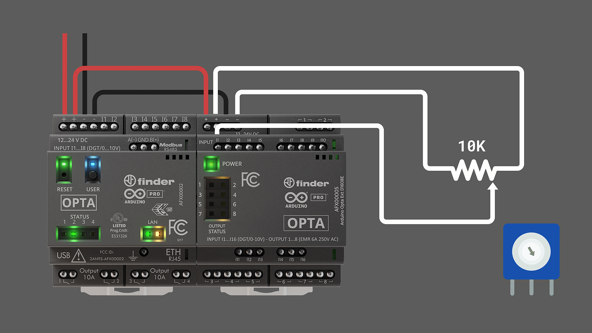

We will create a demo application from scratch, in which we will read the voltage from an analog sensor and control the expansion relay outputs based on the voltage level measured.

## Goals

- Learn how to use Opta™ Digital Expansions with the PLC IDE
- Learn how to enhance your Opta™ controller's capabilities using Opta™ expansions
- Leverage Arduino Pro products for real industrial applications

## Hardware and Software Requirements

### Hardware
- [Opta™](https://store-usa.arduino.cc/collections/opta-family) (x1)
- [AFX00005 - Opta Ext D1608E](https://store.arduino.cc/products/Opta-Ext-D1608E) (x1)
- [AFX00006 - Opta Ext D1608S](https://store.arduino.cc/products/Opta-Ext-D1608S) (x1)
- 12-24 VDC/0.5 A power supply (x1)
- [USB-C® cable](https://store-usa.arduino.cc/products/usb-cable2in1-type-c) (x1)

### Software
- The [Arduino PLC IDE](https://www.arduino.cc/pro/software-plc-ide) 

## Instructions 

### Snapping the Expansion

You can connect up to **five expansions to your Opta™** controller module to multiply and diversify your I/O set with seamless detection.

Remove the breakable plastic cover marked as AUX from the expansion port on the Opta™ controller and the expansion module to expose the ports.

Attach the expansions to the right side of your Opta™ controller. Ensure that the **Aux connector** and the connection clips are correctly aligned, as shown in the image below:

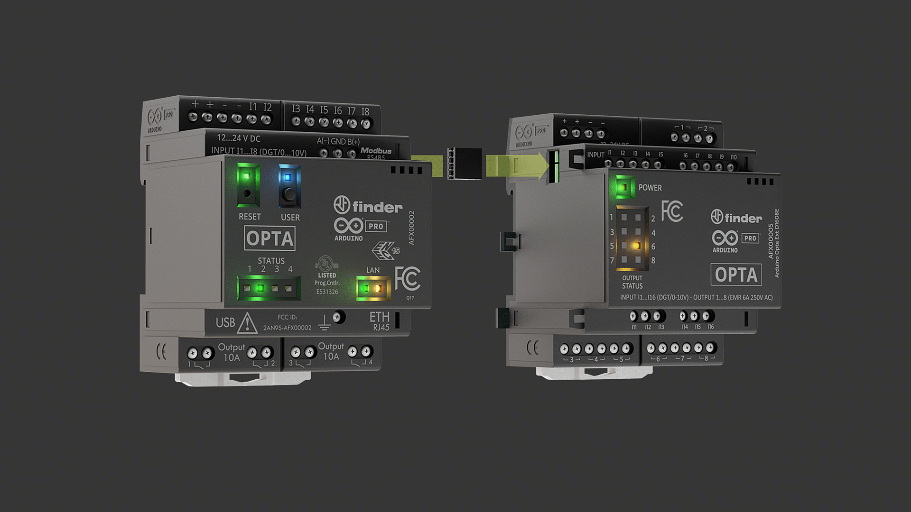

The expansions must be powered externally in order to be detected and properly work.

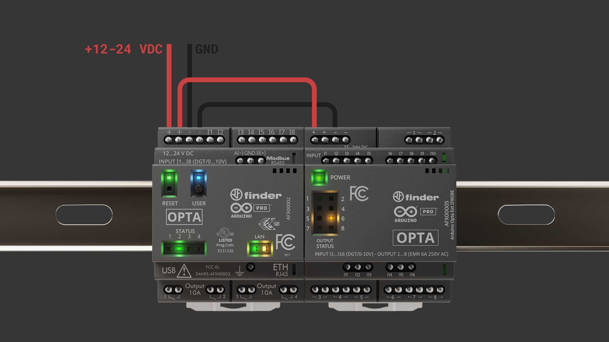

***The Opta™ controller module supports a maximum of __5 expansion modules__. Exceeding this limit may cause unexpected behavior. __Ensure no more than five modules are connected, and verify that the Aux connector and clips are securely installed__.***

### Update Expansion Firmware

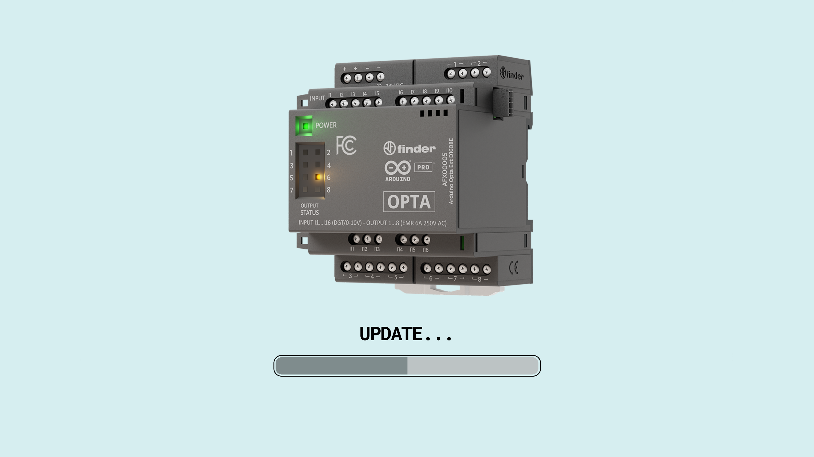

***The Opta™ expansions firmware must be updated to the latest version to ensure proper functioning. See this [section](https://docs.arduino.cc/tutorials/opta/user-manual/#update-expansion-firmware) for a guided step-by-step procedure.***

### Solution Wiring

The following wiring setup will be used for the solution explained in this tutorial.

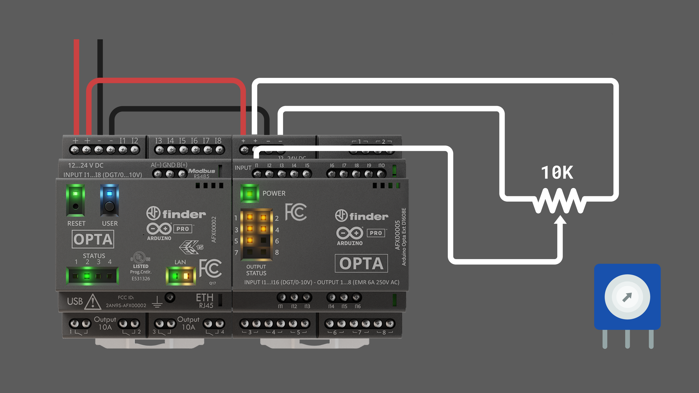

- In the **Opta™**, connect the power supply to the respective inputs on the screw terminals.
- From the **Opta™** power screw terminals, wire the power to the Opta™ expansion.
- Connect the sensor output to the **I1** input of the Opta™ expansion, specifically the variable tap of the potentiometer.
- Power the sensor using its respective power source, which in this case is the power screw terminals of the expansion.

### Opta™ Micro PLC Setup

After downloading the [PLC IDE](https://www.arduino.cc/en/software#arduino-plc-ide), follow the installation process from the following [guide](https://docs.arduino.cc/software/plc-ide/tutorials/plc-ide-setup-license/). 

Open the PLC IDE and create a new project for the Opta™.

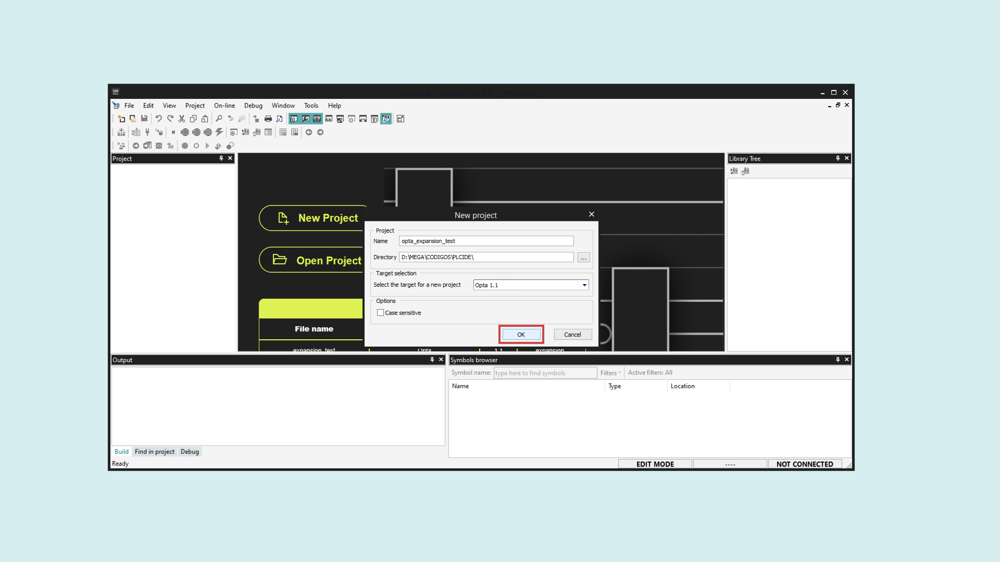

Connect the Opta controller to your PC using a USB-C® cable. Then, upload the runtime for Opta™ by selecting its Serial Port and clicking on the **Download** button.

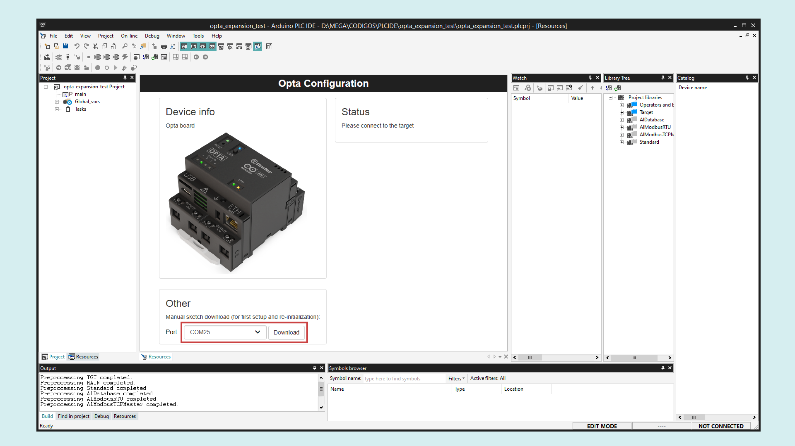

Once the runtime is flashed, navigate to **On-line > Set up communication**. With the **Modbus** protocol selected, open its properties and select the new virtual serial port (different from the one used in the previous step). Click "OK" to confirm.

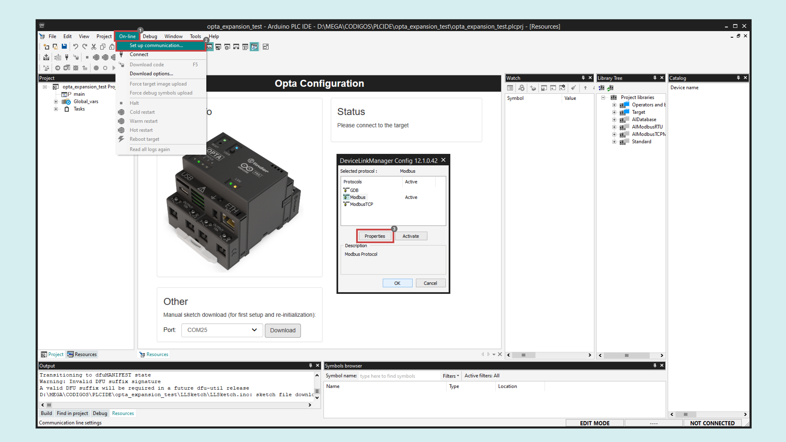
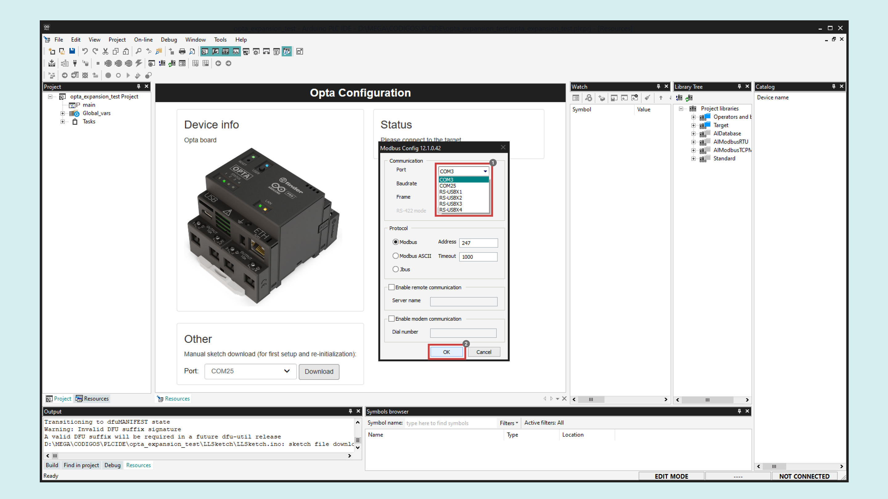

***Modbus is the default serial protocol used to communicate the Opta™ with the PC.***

Next, click the **Connect** button in the upper left corner and wait for the base program to upload. A green **Connected** flag will appear in the lower right corner if the connection is successful.

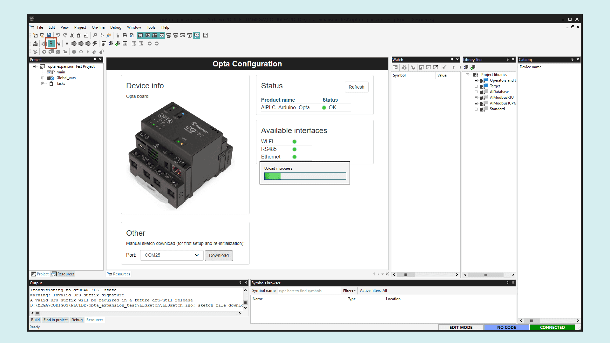

***The Opta™ is pre-licensed, meaning no additional license purchase is required for use with the PLC IDE.***

If the Opta™ status displays **No License**, click the **Activate PLC runtime** button to activate it. For more details, refer to this [guide](https://docs.arduino.cc/tutorials/portenta-machine-control/plc-ide-setup-license/#7-license-activation-with-pre-licensed-products-opta).

### Solution Setup

To enable the Opta™ Digital Expansion features in the PLC IDE, navigate to the **Resources** tab and select **I/O Expansions** in the configuration tree. Then click **Scan** to allow the IDE to search for connected expansions.

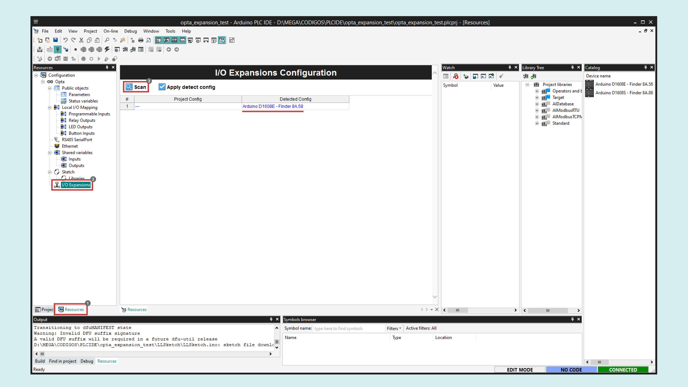

Once the available expansion appears in the **Detected config** column, enable it by clicking on **Apply detect config**. Verify that the **Project config** column is updated.

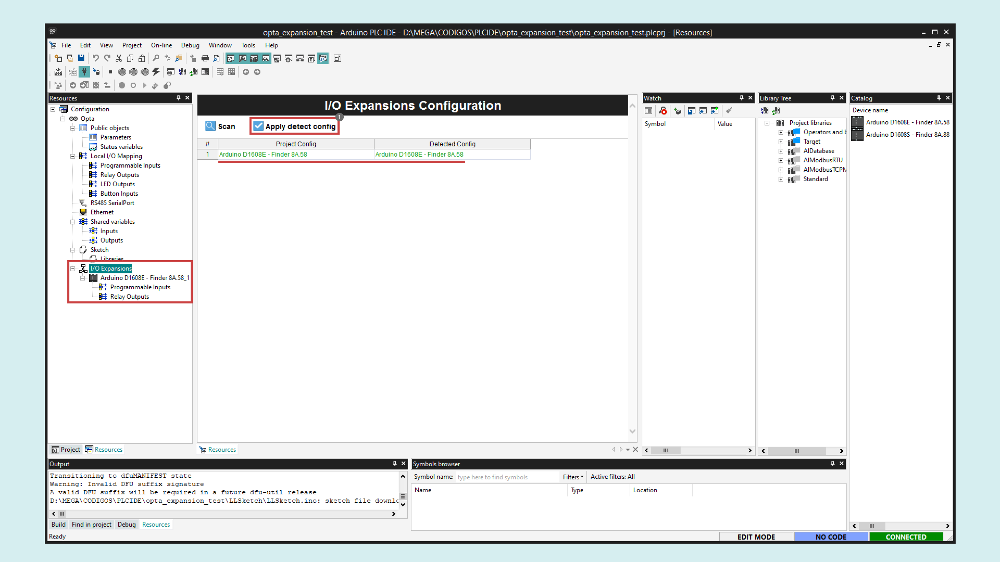

To set up the sensor input for the potentiometer, navigate to **Programmable Inputs** under your desired expansion in the left resources menu. Define a **variable** name, **sensor** in this case, and set the **IOType** to **Analog**.

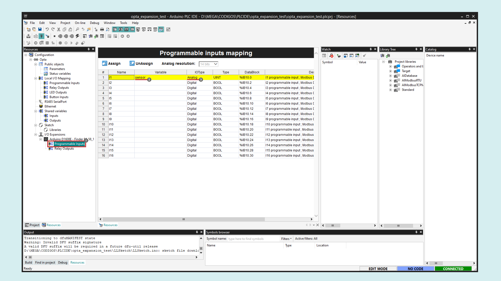

To set up the Opta™ expansion outputs, proceed to **Relay Outputs** under your desired expansion in the left resources menu. In this instance, define **variable** names for each output, **out_1** to **out_8**.

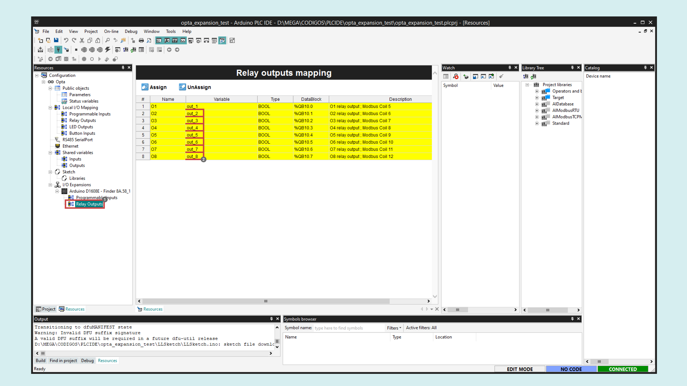

For the main code of our solution, navigate to the **Project** tab in the left panel, select **Main** in the project tree, and right-click on the **Local variables** window to insert some variables.

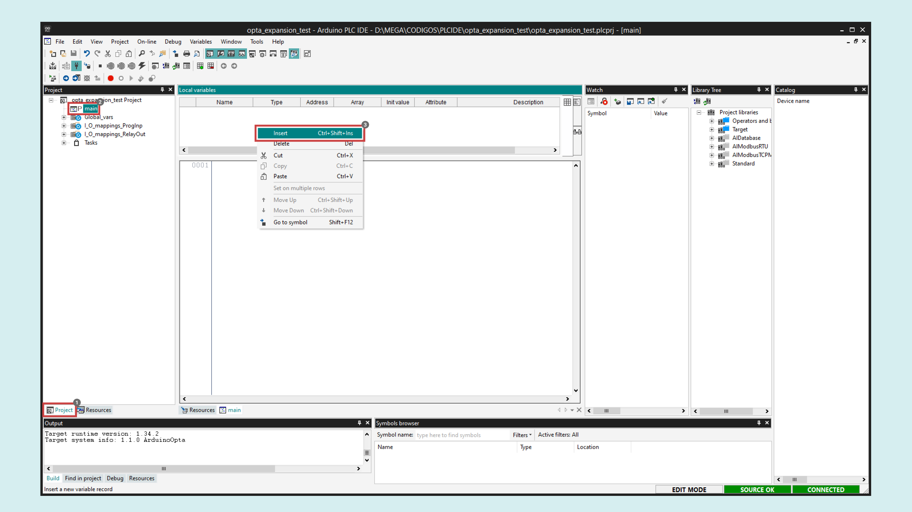

Insert the following three variables with their respective _type_ and _attribute_:

| Name  | Type | Init value | Attribute |
|-------|------|------------|-----------|
| VSTEP | REAL | -          | -         |
| VCC   | REAL | 12         | CONSTANT  |
| VIN   | REAL | -          | -         |

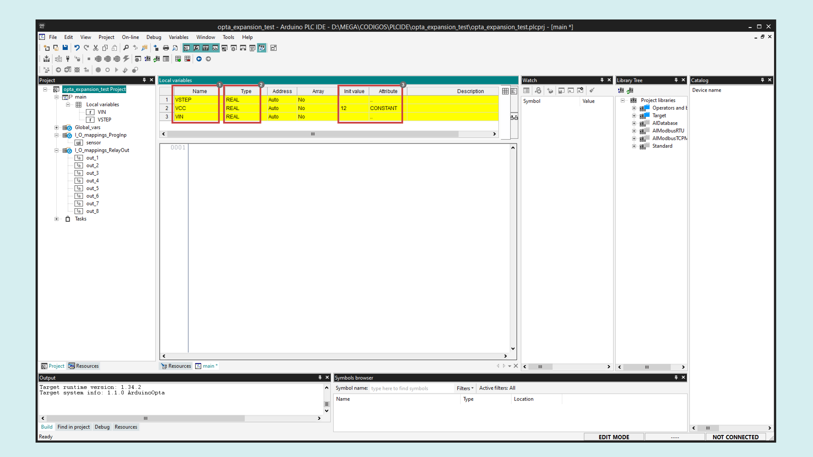

- **VSTEP** will store the voltage step threshold to activate the relay outputs sequentially. 
- **VCC** is a constant representing the 12 VDC used to power the Opta™ Digital Expansion.
- **VIN** will store the voltage read at the sensor input.

Copy and paste the following sketch to the **Main code** text editor:

```
VSTEP := VCC/8;

VIN := sensor*1.733E-3;

IF  VIN >= VSTEP*1 THEN
    out_1 := TRUE;
ELSE
    out_1 := FALSE;
END_IF;

IF VIN >= VSTEP*2 THEN 
    out_2 := TRUE;
ELSE
    out_2 := FALSE;
END_IF;

IF VIN >= VSTEP*3 THEN 
    out_3 := TRUE;
ELSE
    out_3 := FALSE;   
END_IF;

IF VIN >= VSTEP*4 THEN 
    out_4 := TRUE;
ELSE
    out_4 := FALSE;   
END_IF;

IF VIN >= VSTEP*5 THEN
    out_5 := TRUE;
ELSE
    out_5 := FALSE;
END_IF;

IF VIN >= VSTEP*6 THEN 
    out_6 := TRUE;
ELSE
    out_6 := FALSE;
END_IF;

IF VIN >= VSTEP*7 THEN 
    out_7 := TRUE;
ELSE
    out_7 := FALSE;   
END_IF;

IF VIN >= VSTEP*8 THEN 
    out_8 := TRUE;
ELSE
    out_8 := FALSE;   
END_IF;
```

Compile the project by clicking on the compilation button found in the upper left corner of the IDE. If no errors are shown, upload the program to the Opta™ controller by clicking the upload button highlighted next to it.

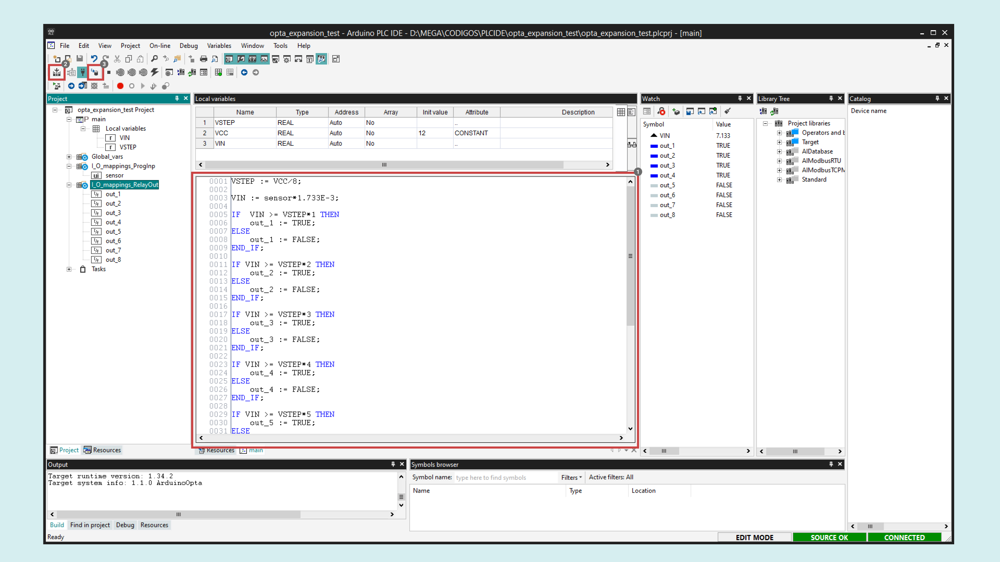

You can monitor the project variables in real-time while the project is running by dragging and dropping the desired variables from the left project panel to the **Watch** window:

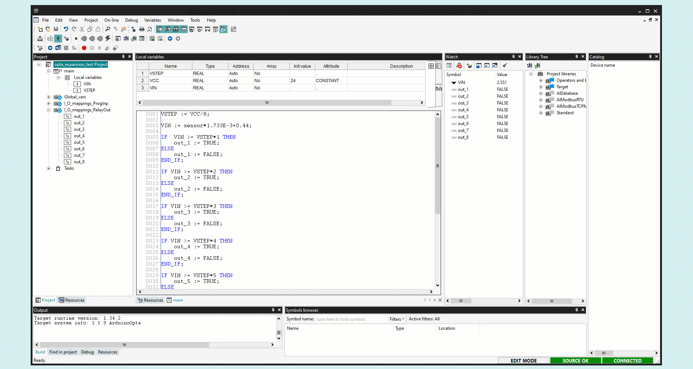

Finally, your solution is ready. The Opta™ expansion relay outputs will activate sequentially as the sensor output increases. 

Turn the potentiometer and observe how the **VIN** variable displays the voltage being read. The outputs activate as their respective thresholds are reached:


### Conclusion 

In this tutorial, you have learned how to use an Opta™ Digital Expansion by demonstrating a simple application that reads an analog input and controls the expansion relay outputs.

As you can see, the configuration process is straightforward, and the results are as expected. This serves as an excellent starting point for adapting the techniques covered here to develop your professional solutions.

#### Next Steps

Extend your knowledge about the Opta™ controller and the PLC IDE by following these tutorials:

- [Arduino PLC IDE Setup & Device License Activation](https://docs.arduino.cc/tutorials/portenta-machine-control/plc-ide-setup-license/)
- [Programming Introduction with Arduino PLC IDE](https://docs.arduino.cc/tutorials/portenta-machine-control/plc-programming-introduction/)
- [Tank Level Monitoring with the Opta™](https://docs.arduino.cc/tutorials/opta/tank-level-app-note/)
- [Modbus TCP with Portenta Machine Control & Opta™](https://docs.arduino.cc/tutorials/portenta-machine-control/pmc-opta-modbus-tcp/)
