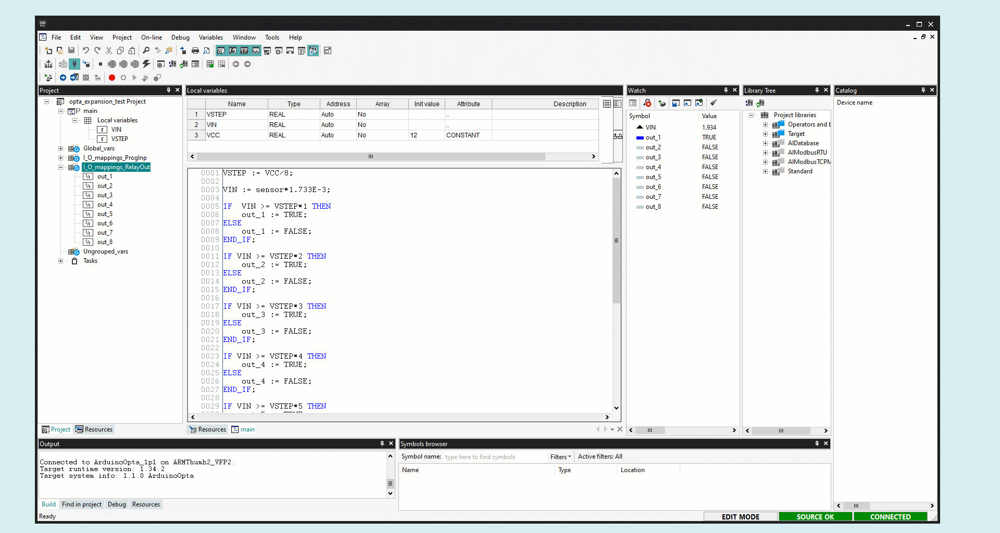

## Overview
In this tutorial you are going to learn how to use the Opta™ Digital Expansions alongside an Opta™ controller.


We are going to create a demo application from scratch where we will read the voltage of an analog sensor and control the expansion relay outputs as a function of the voltage level read.

## Goals

- Discover how to use the Opta™ Digital Expansions using the PLC IDE
- Learn how to extend your Opta™ controller capabilities using Opta™ expansions
- Leverage Arduino Pro products for real industrial applications

## Hardware and Software Requirements

### Hardware
- [Opta™](https://store-usa.arduino.cc/collections/opta-family) (x1)
- [Opta Ext D1608E](https://store.arduino.cc/products/Opta-Ext-D1608E) (x1)
- [Opta Ext D1608S](https://store.arduino.cc/products/Opta-Ext-D1608S) (x1)
- 12-24 VDC/0.5 A power supply (x1)
- [USB-C® cable](https://store-usa.arduino.cc/products/usb-cable2in1-type-c) (x1)

### Software
- The [Arduino PLC IDE](https://www.arduino.cc/pro/software-plc-ide) 

## Instructions 

### Snapping the Expansion

You can snap up to five expansions to your Opta™ controller module to multiply and mix your set of I/Os with seamless detection.

After removing the expansion port breakable plastic cover marked as AUX, from the Opta™ controller and from the expansion to expose the expansion port, plug the expansions on the right side of your Opta™ controller making sure to correctly align the **Aux connector** and the connection clips as shown in the image below:


### Solution Wiring

The following wiring will be used for the solution explained in this tutorial.


- In the **Opta™**, connect the power supply to the respective inputs on the screw terminals.
- From the **Opta™** power screw terminals wire the power to the Opta™ expansion.
- Connect the sensor output to the **I1** input of the Opta™ expansion, in this case, the variable tap of the potentiometer.
- Power the sensor with its respective power source. In this case, the power screw terminals of the expansion.

### Opta™ Micro PLC Setup

After downloading the [PLC IDE](https://www.arduino.cc/en/software#arduino-plc-ide), open it and create a new project for the Opta™.


Connect the Opta controller to your PC using a USB-C® cable. Upload the runtime for Opta™ by selecting its Serial Port and clicking on the **Download** button.


Once the runtime is flashed, navigate to **On-line > Set up communication**, with the **Modbus** protocol selected, open its properties and select the new virtual serial port (different from the previous step), then click "OK". 


***Modbus is the default serial protocol used to communicate the Opta™ with the PC.***

Now, in the upper left corner, click on the **Connect** button and wait for the base program to be uploaded. A green **Connected** flag should appear in the lower right corner if everything goes well.


***The Opta™ is Pre-Licensed so you don't have to buy any license to use it with the PLC IDE***

If the Opta™ status says **No License**, click on the **Activate PLC runtime** button to activate it. Learn more about this case in this [guide](https://docs.arduino.cc/tutorials/portenta-machine-control/plc-ide-setup-license/#7-license-activation-with-pre-licensed-products-opta).

### Solution Setup

To enable the Opta™ Digital Expansion features on the PLC IDE, navigate to the **Resources** tab, **I/O Expansions** in the configuration tree, then click in **Scan** so the IDE searches for the connected expansions.


The available expansion will appear in the **Detected config** column, to enable it, click on **Apply detected config** and make sure that the **Present config** column updates.


To set up the sensor input for the potentiometer, in the left resources menu, navigate to **Programmable inputs** below your desired expansion, define a **variable** name, **sensor** in this case and set the **IOType** to **Analog**.


To set up the Opta™ expansion outputs, in the left resources menu, navigate to **Relay Outputs** below your desired expansion and define a **variable** name for each output, **out_1** to **out_8** in this case.


For the main code of our solution, navigate to the **Project** tab in the left panel, **Main** in the project tree and right-click in the **Local variables** window to insert some variables.


Insert the following three variables alongside their _type_ and _attribute_:

| Name  | Type | Init value | Attribute |
|-------|------|------------|-----------|
| VSTEP | REAL | -          | -         |
| VCC   | REAL | 12         | CONSTANT  |
| VIN   | REAL | -          | -         |


- **VSTEP** will store the voltage step threshold to activate the relay outputs sequentially. 
- **VCC** will be a constant with the voltage used to power the Opta™ Digital Expansion. In this case we are using 12 VDC.
- **VIN** will store the voltage read in the sensor input.

Copy and paste the following sketch to the **Main code** text editor:

```
VSTEP := VCC/8;

VIN := sensor*1.733E-3;

IF  VIN >= VSTEP*1 THEN
    out_1 := TRUE;
ELSE
    out_1 := FALSE;
END_IF;

IF VIN >= VSTEP*2 THEN 
    out_2 := TRUE;
ELSE
    out_2 := FALSE;
END_IF;

IF VIN >= VSTEP*3 THEN 
    out_3 := TRUE;
ELSE
    out_3 := FALSE;   
END_IF;

IF VIN >= VSTEP*4 THEN 
    out_4 := TRUE;
ELSE
    out_4 := FALSE;   
END_IF;

IF VIN >= VSTEP*5 THEN
    out_5 := TRUE;
ELSE
    out_5 := FALSE;
END_IF;

IF VIN >= VSTEP*6 THEN 
    out_6 := TRUE;
ELSE
    out_6 := FALSE;
END_IF;

IF VIN >= VSTEP*7 THEN 
    out_7 := TRUE;
ELSE
    out_7 := FALSE;   
END_IF;

IF VIN >= VSTEP*8 THEN 
    out_8 := TRUE;
ELSE
    out_8 := FALSE;   
END_IF;
```

Compile the project by clicking on the compilation button found in the upper left corner of the IDE, if no error is shown, upload the program to the Opta™ controller by clicking the upload button highlighted next to it.


You can monitor the project variables in real-time while the project is running by dragging and dropping the desired variables from the left project panel to the **Watch** window:



Finally, your solution is ready, while your sensor output increases, the Opta™ expansion relay outputs will activate sequentially. 

Turn the potentiometer and see the **VIN** variable showing the read voltage value at the same time the outputs activate when the respective thresholds are reached:


### Conclusion 

In this tutorial you learned how to use an Opta™ Digital Expansion, demonstrating a simple application of reading an analog input and controlling the expansion relay outputs.

As you can notice, the configuration process is very straightforward and the results were as expected, being a good starting point to adapt the work done here to create your own professional solution.

#### Next Steps

Extend your knowledge about the Opta™ controller and the PLC IDE by following these tutorials:

- [Arduino PLC IDE Setup & Device License Activation](https://docs.arduino.cc/tutorials/portenta-machine-control/plc-ide-setup-license/)
- [Programming Introduction with Arduino PLC IDE](https://docs.arduino.cc/tutorials/portenta-machine-control/plc-programming-introduction/)
- [Tank Level Monitoring with the Opta™](https://docs.arduino.cc/tutorials/opta/tank-level-app-note/)
- [Modbus TCP with Portenta Machine Control & Opta™](https://docs.arduino.cc/tutorials/portenta-machine-control/pmc-opta-modbus-tcp/)
