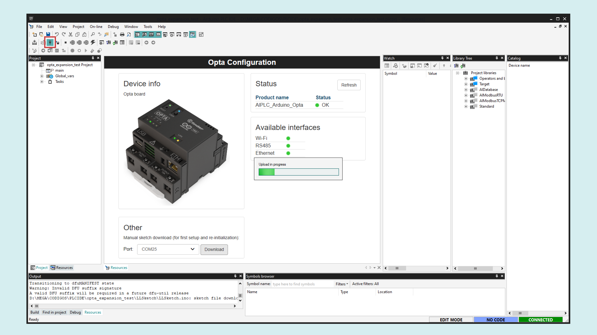

## Overview

## Goals

## Hardware and Software Requirements

### Hardware
- [Opta™](https://store-usa.arduino.cc/collections/opta-family) (x1)
- [Opta Ext D1608E](https://store.arduino.cc/products/Opta-Ext-D1608E) (x1)
- [Opta Ext D1608S](https://store.arduino.cc/products/Opta-Ext-D1608S) (x1)
- 12-24 VDC/0.5 A power supply (x1)
### Software
- The [Arduino PLC IDE](https://www.arduino.cc/pro/software-plc-ide) (including Arduino PLC IDE Tools)

## Instructions 

### Snapping the Expansion

You can snap up to five expansions to your Opta™ Base module to multiply and mix your set of I/Os with seamless detection.

After removing the expansion port breakable plastic cover marked as AUX, from the Opta™ controller and from the expansion to expose the expansion port, plug the expansions on the right side of your Opta™ controller making sure to correctly align the **Aux connector** and the connection clips as shown in the image below:

### Solution Wiring

- In the **Opta™**, connect the power supply to the respective inputs on the screw terminals.
- From the **Opta™** power screw terminals wire the power to the Opta expansion.
- Connect the sensor output to the **I1** input of the Opta expansion, in this case, the variable tap of the potentiometer.
- Power the sensor with its respective power source. In this case, the power screw terminals of the expansion.

### Opta™ Micro PLC Setup

After downloading the [PLC IDE](https://www.arduino.cc/en/software#arduino-plc-ide), open it and create a new project for the Opta™.

Upload the runtime for Opta™ by selecting its serial port and clicking on the **Download** button.

Once the runtime is flashed, navigate to **On-line > Set up communication**, with the **Modbus** protocol selected, open its properties and select the new virtual serial port (different from the previous step), then click "OK". 

***Modbus is the default serial protocol used to communicate the Opta™ with the PC.***

Now, in the upper left corner, click on the **Connect** button and wait for the base program to be uploaded. A green **Connected** flag should appear in the lower right corner if everything goes well.

***The Opta™ is Pre-Licensed so you don't have to buy any license to use it with the PLC IDE***

If the Opta status says **No License**, click on the **Activate PLC runtime** button to activate it. Learn more about this case in this [guide](https://docs.arduino.cc/tutorials/portenta-machine-control/plc-ide-setup-license/#7-license-activation-with-pre-licensed-products-opta).

### Solution Setup

To enable the Opta Digital Expansion features on the PLC IDE, navigate to the **Resources** tab, **I/O Expansions** in the configuration tree, then click in **Scan** so the IDE searches for the connected expansions.

The available expansion will appear in the **Detected config** column, to enable it, click on **Apply detected config** and make sure that the **Present config** column updates.

To set up the sensor input for the potentiometer, in the left resources menu, navigate to **Programmable inputs** below your desired expansion, define a **variable** name, **sensor** in this case and set the **IOType** to **Analog**.

To set up the Opta expansion outputs, in the left resources menu, navigate to **Relay Outputs** below your desired expansion and define a **variable** name for each output, **out_1** to **out_8** in this case.

For the main code of our solution, navigate to the 

### Troubleshooting - LED behavior

- RED: the Opta controller couldn't initialize the expansion. Verify the power and connection of the expansion, then reset the Opta controller.
- BLUE:

- GREEN: the expansion is properly initiated and ready to use.

### Final Test

You can leave each device connected separately to the internet router or connect them together directly with one ethernet cable. The first option will let you update the preferred device remotely as you can access it through the local network.

Now you can expose the temperature sensor to some heat and monitor it from the PLC IDE. The Opta™ relay outputs and LEDs will close and turn on when the temperature surpasses the programmed thresholds respectively.

### Conclusion 

In this tutorial you learned how to communicate two Arduino PRO products using the Modbus TCP protocol, demonstrating a simple application of sharing temperature data to control the outputs of the devices.

As you can notice, the configuration process is very straightforward and the results were as expected, being a good starting point to adapt the work done here to create your own professional solution.

#### Next Steps

Extend your knowledge about the Portenta Machine Control, PLC IDE and the variety of industrial protocols it supports by following these tutorials:

- [Programming Introduction with Arduino PLC IDE](https://docs.arduino.cc/tutorials/portenta-machine-control/plc-programming-introduction/)
- [Tank Thermoregulation with Portenta Machine Control & Opta™](https://docs.arduino.cc/tutorials/portenta-machine-control/pmc-opta-temp-ctrl/)
- [Connect an RTD/Thermocouple to the Portenta Machine Control](https://docs.arduino.cc/tutorials/portenta-machine-control/rtd-thermocouple-pmc/)
- [Arduino PLC IDE Setup & Device License Activation](https://docs.arduino.cc/tutorials/portenta-machine-control/plc-ide-setup-license/)