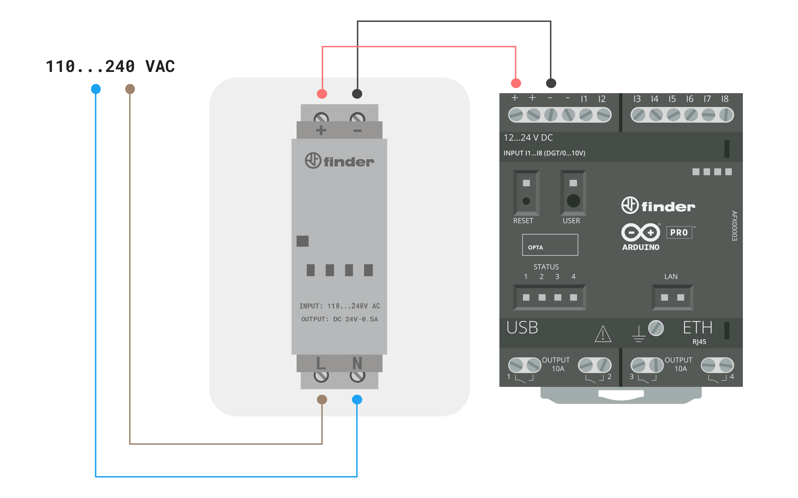
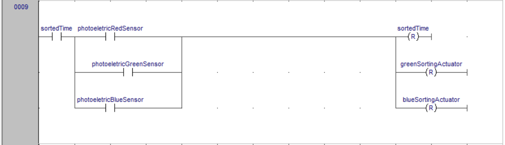
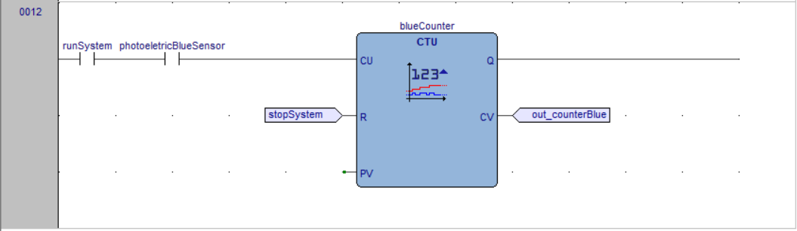

## Introduction

Industrial conveyor and sorting systems are essential for automating logistics and production processes across various industries. These systems are engineered to optimize the transport and classification of products along the production line, thereby enhancing operational efficiency and reducing handling time. By leveraging conveyor belts and advanced sorting mechanisms, it becomes possible to automate repetitive and complex tasks, ensuring a more streamlined and accurate workflow. Such systems are critical in environments that demand high productivity and precision, including distribution centers, manufacturing plants, and processing facilities. For instance, they are commonly used in warehouses and distribution centers to move and sort packages and products to different areas based on criteria such as destination, size or type.

Considering this type of industrial system, we will use the Opta™ micro PLC and its capability to connect with Arduino Cloud to control a conveyor and sorting system that can separate items based on their color. The entire system will be integrated into the cloud, providing real-time control and monitoring.


Due to the use of the Opta™ micro PLC, this solution will be cost-effective and offer remote access, allowing for monitoring and control of the status of the key elements of the application.

**Target audience:** PLC programmers, Automation engineers, Industrial IoT engineers and Electrical engineers.

### Goals

The main objective of this application is to demonstrate the capability of the Opta™ micro PLC in controlling simple conveyor and item separation systems, while providing remote real-time control and monitoring. The goals are as follows:

- Monitor the states of the systems involved.
- Monitor important information such as the quantity of items separated by each element.
- Control the entire system, allowing it to be started and stopped remotely.
- Integrate the two systems, conveyor and sorting, to ensure they work perfectly together.
- Create an Arduino Cloud dashboard that syncs in real time to inform and alert the user.

## Hardware and Software Requirements


### Hardware Requirements

- [Opta™ WiFi](https://store.arduino.cc/products/opta-wifi) (x1)
- 24 VDC Power Supply (x1) <!-- # ToDo: See if we have a link for this -->
- Photoeletric Sensor (3x)
- RGB Color Sensor (1x)
- Power Relay 24 V (Optional x4)
- 18 AWG Wiring Cable
- [USB Type-C® Cable](https://store.arduino.cc/products/usb-cable2in1-type-c) (x1)
- [Micro-USB cable](https://store.arduino.cc/products/usb-2-0-cable-type-a-micro) (x1)

### Software Requirements

- [Arduino PLC IDE](https://docs.arduino.cc/software/plc-ide/)
- [Arduino Cloud Editor](https://create.arduino.cc/editor)
- The [Conveyor and Sorting Systems Ladder Program](assets/ConveyorSortingSystem.zip)
- The [Arduino Create Agent](https://cloud.arduino.cc/download-agent/) to provision the Opta WiFi on the Arduino Cloud.
- The [**Arduino Cloud**](https://cloud.arduino.cc/). If you do not have an account, you can create one for free inside [**cloud.arduino.cc**](https://cloud.arduino.cc/home/?get-started=true).
- [Application Arduino Sketches](assets/ConveyorSortingSystem.zip)

### Recommended Skills

- **Electrical knowledge:** wiring and safety protocols.
- **Programming:** basic logic understanding.
- **Technical documentation:** reading schematics.
- **Hands-on experience:** tool handling.

## Conveyor and Sorting System Setup

An overview of the electrical connections of the conveyor and sorting system is shown in the diagram below:


The Opta PLC will be powered by an external 24 VDC power supply connected to its screw terminals labeled `+` and `-` respectively.



The RGB color sensor and the three photoletric sensors will be connected to inputs `I1`, `I2`, `I3`, `I4`, `I5` and `I6` respectively.


***The wiring connections shown above are displayed separately for easier comprehension, but all of them are simultaneously connected to the Opta.***

## Conveyor and Sorting System Overview

The Opta Micro PLC is responsible for controlling the entire system by reading color and presence sensors, executing control logic to manage the outputs, including operating the conveyor motor to move it and controlling electrical actuators to perform item separation based on detected colors. Additionally, the Opta Micro PLC will provide the states of the variables, inputs, and outputs of the system for updating data in the Arduino Cloud via Wi-Fi® connection.


The system is activated when the 'Start' button is pressed, initiating the operation of both the feeder conveyor and the sorting conveyor. The feeder conveyor is responsible for transporting objects from the initial loading point toward the sorting area and the sorting conveyor is responsible to receive the object from the feeder conveyor and transport it to the designated area for sorting. The object move along the feeder conveyor until the RGB color sensor detects a specific color.

Once a color is detected, the feeder conveyor continues to run briefly to ensure the object successfully transfers to the sorting conveyor before stopping. Simultaneously, the specific actuator corresponding to the detected color is activated, creating a physical barrier that pushes the object off the sorting conveyor and into the designated area. A photoelectric sensor positioned in each designated area, one for each color being sorted, confirms that the object has been successfully sorted. After confirmation, the feeder conveyor restarts and the system continues this loop until the 'Stop' button is pressed, stopping the entire operation. At any time, you can monitor the operating status and control the system through the Arduino Cloud.

In this way, the Opta will serve as both a programmable logic controller and a gateway to the Dashboard in the Arduino Cloud, in the web application.


### Sensors Deployment

- The **RGB Color Sensor** will be responsible for detecting the color of the item. It will be placed at the system's entry, so the color of the item will be detected first by this sensor, allowing the item to be sorted accordingly to its color.
- The **Photoeletric Sensor** this sensor will be responsible for detecting the presence of the item at the separation position, activating the actuator responsible for separating the item. Three of these sensors will be used, one for each color of the items being separated, placed at the separation position.

### Actuators Deployment

- The **Solid State Relay** is used to activate loads that are not supported by the PLC output. This way, the PLC can control equipment requiring higher load capacity, such as activating the two conveyor motors for item movement and the two item separation actuators.

## Step-by-Step Guide for System Operation

1. **System Start**
   - **Action:** Press the Start button.
   - **Description:** The system is activated, initiating the operation of both the feeder conveyor and the sorting conveyor.

2. **Activation of Conveyors**
   - **Action:** The feeder and sorting conveyors start operating simultaneously.
   - **Description:** The feeder conveyor moves objects from the initial loading point toward the RGB color sensor area.

3. **Color Detection**
   - **Action:** Objects move along the feeder conveyor until the RGB color sensor detects a specific color.
   - **Description:** The RGB color sensor detects the color of the object on the feeder conveyor.

4. **Action After Detection**
   - **Action:** The feeder conveyor continues to run briefly after color detection.
   - **Description:** The feeder conveyor remains active for a short period to ensure the object successfully transfers to the sorting conveyor.

5. **Actuator Activation**
   - **Action:** Activate the specific actuator corresponding to the detected color.
   - **Description:** The actuator is triggered, creating a physical barrier that pushes the object off the sorting conveyor and into the designated area.

6. **Sorting Confirmation**
   - **Action:** Confirm the object has been sorted.
   - **Description:** A photoelectric sensor, positioned in the designated area for each color, confirms that the object has been successfully sorted.

7. **System Stop**
   - **Action:** Press the stop button.
   - **Description:** The system is stoped, stopping all operations and deactivating the conveyors and actuator.

8. **Remote Monitoring and Control**
   - **Action:** Monitor and control the system via the Arduino Cloud.
   - **Description:**  At any time, you can check the operating status and control the system remotely using the Arduino Cloud interface

## Opta Ladder Code

After understanding the step-by-step operation of the system, the ladder code below was created to represent the entire logic of the conveyor and sorting system.

To facilitate understanding of the code, it has been divided and explained separately. You can download the complete code [here](assets/ConveyorSortingSystem.zip).

Step-by-Step Breakdown:

The **Rung 01**


- `in_cloudStartButton`: This input represents a start button signal from the Arduino Cloud. When this input is active (high), it indicates that the start command has been issued from the cloud.
- `startButton`: This input represents a physical start button. When pressed, this input becomes active (high), indicating that the start command has been given physically.
- `startSystem`: This is a coil (output) that gets activated when the system should start. When this output is active (high), it indicates that the system is in the starting state.
- `out_cloudStartButtonStatus`: This output signal communicates the status of the Start button to the Arduino Cloud. When the Start button is physically pressed, this variable updates to reflect the button’s status in the Arduino Cloud.

**Resume**: This rung enables the system to start based on either a cloud command (in_cloudStartButton) or a physical start button (startButton). If either input is active, the system starts (startSystem is energized) and a feedback signal (out_cloudStartButtonStatus) is sent to the Arduino Cloud.

The **Rung 02**


- `in_cloudStopButton`: This input represents a stop button signal from the Arduino Cloud. When this input is active (high), it indicates that the stop command has been issued from the cloud.
- `stopButton`: This input represents a physical stop button. When pressed, this input becomes active (high), indicating that the stop command has been given physically.
- `stopSystem`: This is a coil (output) that gets activated when the system should stop. When this output is active (high), it indicates that the system is in a stopped state.
- `out_cloudStopButtonStatus`: This output signal communicates the status of the Stop button to the Arduino Cloud. When the Stop button is physically pressed, this variable updates to reflect the button’s status in the Arduino Cloud.

**Resume**: This rung stops the system based on either a cloud command (in_cloudStopButton) or a physical stop button (stopButton). When either input is active, the system stops (stopSystem is energized), and a feedback signal (out_cloudStopButtonStatus) is sent to the Arduino Cloud.

The **Rung 03**


- `startSystem`: This input is energized when the system is in starting mode. It is activated by the logic from previous steps that command the system to start.
- `stopSystem`: This input is activated when the system is in stopping mode. It is energized based on the logic from previous steps that command the system to stop.
- `runSystem`: This is a coil (output) that gets energized when the system is in the running state. When this output is active, it indicates that the system is currently operational.

**Resume**: This rung controls the system's transition to the running state. The system will enter the running state (runSystem is energized) if a start command is given (startSystem is active) and no stop command is present (stopSystem is inactive). Once the system is running, it will remain in this state until a stop command is issued.

The **Rung 04**


- `runSystem`: This input is energized when the system is in the running state. It indicates that the overall system is opera+tional.
- `sortedTime`: This input represents a timing condition related to the brief stop of the entry conveyor when a color is detected.
- `sortingConveyor`: This is a coil (output) that is energized to activate the sorting conveyor, which is responsible for moving objects to the sorting area.
- `entryConveyor`: This is a coil (output) that is energized to activate the entry conveyor, responsible for moving objects into the sorting conveyor.

**Resume**: This rung ensures that the `sortingConveyor` runs whenever the system is operational (`runSystem` is active). The `entryConveyor` will also run under the same condition, but only if the `sortedTime` has not yet triggered (i.e., if `sortedTime` is still in its normally closed state). This setup ensures that the conveyors operate in coordination with the system's running state and the sorting process timing.

The **Rung 05**


- `colorGreenSensor`: This input represents the color sensor that detects whether an object is green. When this sensor is active (high), it indicates that a green object has been detected.
- `greenSortingActuator`: This is a coil (output) that, when energized, activates the mechanism responsible for sorting green objects. The (S) symbol indicates that this output is a "Set" coil, meaning it will remain energized once triggered. This keeps the actuator activated until a "Reset" signal is given, confirming that the item has been sorted.

**Resume**: This rung triggers the green sorting mechanism (`greenSortingActuator`) when a green object is detected by the sensor (`colorGreenSensor`). The actuator will stay activated until reset, ensuring that the green object is sorted correctly.

The **Rung 06**


- `colorBlueSensor`: This input represents the color sensor that detects whether an object is blue. When this sensor is active (high), it indicates that a blue object has been detected.
- `blueSortingActuator`: This is a coil (output) that, when energized, activates the mechanism responsible for sorting blue objects. The (S) symbol indicates that this output is a "Set" coil, meaning it will remain energized once triggered. This keeps the actuator activated until a "Reset" signal is given, confirming that the item has been sorted.

**Resume**: This rung triggers the blue sorting mechanism (`blueSortingActuator`) when a blue object is detected by the sensor (`colorGreenSensor`). The actuator will stay activated until reset, ensuring that the blue object is sorted correctly.

The **Rung 07**


- `colorRedSensor`: This input represents a sensor that detects whether an object is red. When this sensor is active (high), it indicates that a red object has been detected.
- `colorGreenSensor`: This input represents a sensor that detects whether an object is green. When this sensor is active (high), it indicates that a green object has been detected.
- `colorBlueSensor`: This input represents a sensor that detects whether an object is blue. When this sensor is active (high), it indicates that a blue object has been detected.
- `objectDetected`: This is a coil (output) that, when energized, indicates that an object has been detected by one of the color sensors. The (S) symbol indicates that this output is a "Set" coil, meaning it will remain energized once triggered until explicitly reset later in the logic. This will be used to give enough time for the object to pass from the entry conveyor to the sorting conveyor.

**Resume**: This rung sets the `objectDetected` flag whenever an object of any of the specified colors (red, green, or blue) is detected by the respective sensors. The `objectDetected` output remains energized, signaling that an object is present until it is reset.

The **Rung 08**


- `objectDetected`: This input was energized in the previous rung to indicate that an object has been detected. When this input is energized, the logic contained in this rung can operate.
- `sortedTime`: This input represents a timing condition related to the sorting process. When this variable is set, the `entryConveyor` turns off and enables the next rung to operate.
- `entryConveyorTON`: This is an On-Delay Timer (TON). When its input (IN) is energized, it starts timing. After one second, when the preset time (PT) elapses, the timer's output (Q) becomes active, setting the `objectDetected` and `sortedTime` variables. This TON is used to delay the activation of the `sortedTime` variable, ensuring that the object has enough time to pass from the entry conveyor to the sorting conveyor before the entry conveyor turns off.

**Resume**: This rung controls the timing sequence for turning off the `entryConveyor` after an object is detected. When an object is detected (`objectDetected` is energized) and `sortedTime` is inactive, the `entryConveyorTON` timer starts counting down. After a delay of one second, the timer activates, which then resets the `objectDetected` flag and sets the `sortedTime` flag. This ensures that the object has enough time to move from the entry conveyor to the sorting conveyor before the entry conveyor is turned off, allowing the next part of the sorting process to proceed.

The **Rung 09**



- `sortedTime`: When this input is active (high), it allows the rest of the rung's logic to execute, signaling that the object has moved through the system and is ready for sorting.
- `photoelectricRedSensor`: This input represents a photoelectric sensor located in the area where sorted red objects should be. Detecting the presence of an object in this area confirms that the red object has been successfully sorted.
- `photoelectricGreenSensor`: This input represents a photoelectric sensor located in the area where sorted green objects should be. Detecting the presence of an object in this area confirms that the green object has been successfully sorted.
- `photoelectricBlueSensor`: This input represents a photoelectric sensor located in the area where sorted blue objects should be. Detecting the presence of an object in this area confirms that the blue object has been successfully sorted.
- `greenSortingActuator`: This is a reset coil, which deactivates the `greenSortingActuator` because the green object has been sorted.
- `blueSortingActuator`: This is a reset coil, which deactivates the `blueSortingActuator` because the blue object has been sorted.

**Resume**: This rung resets the sorting logic after an item has been successfully sorted, confirmed by any of the photoelectric sensors located in the area reserved for sorted items. When the sorting process is complete, the green and blue sorting actuators are reset, and the `sortedTime` flag is cleared. This prepares the system for the next sorting cycle.

The **Rung 10**


- `runSystem`: This input is energized when the system is in the running state. It allows the counting process to occur only when the system is operational.
- `photoelectricRedSensor`: This input represents a sensor that detects the presence of a red object. When this sensor is active, it indicates that a red object has been detected, triggering the counting process.
- `redCounter`: This is a counter (CTU - Count Up) that increments its count each time the conditions on the left side of the rung (inputs) are met. The counter continues counting until the system is stopped, which resets the counter. This block is used to count when a red object is detected and increments the variable responsible for tracking the number of sorted red objects (`out_counterRed`).
- `stopSystem`: This input is used to reset the counter. When activated, it resets the count to zero, effectively restarting the counting process.
- `out_counterRed`: This is used to track the number of sorted red objects and transmit the count to the Arduino Cloud. This allows the exact number of sorted red objects to be displayed on the Arduino Cloud Dashboard in real-time.

**Resume**: This rung counts the number of red objects detected while the system is running. The `out_counterRed` increments each time a red object passes the `photoelectricRedSensor`, and the count continues until the system is stopped. The `out_counterRed` variable also allows the number of sorted red objects to be displayed on the Arduino Cloud Dashboard in real-time.

The **Rung 11**


- `runSystem`: This input is energized when the system is in the running state. It allows the counting process to occur only when the system is operational.
- `photoelectricGreenSensor`: This input represents a sensor that detects the presence of a green object. When this sensor is active, it indicates that a green object has been detected, triggering the counting process.
- `greenCounter`: This is a counter (CTU - Count Up) that increments its count each time the conditions on the left side of the rung (inputs) are met. The counter continues counting until the system is stopped, which resets the counter. This block is used to count when a green object is detected and increments the variable responsible for tracking the number of sorted green objects (`out_counterGreen`).
- `stopSystem`: This input is used to reset the counter. When activated, it resets the count to zero, effectively restarting the counting process.
- `out_counterGreen`: This is used to track the number of sorted green objects and transmit the count to the Arduino Cloud. This allows the exact number of sorted green objects to be displayed on the Arduino Cloud Dashboard in real-time.

**Resume**: This rung counts the number of green objects detected while the system is running. The `out_counterGreen` increments each time a green object passes the `photoelectricGreenSensor`, and the count continues until the system is stopped. The `out_counterGreen` variable also allows the number of sorted green objects to be displayed on the Arduino Cloud Dashboard in real-time.


The **Rung 12**



- `runSystem`: This input is energized when the system is in the running state. It allows the counting process to occur only when the system is operational.
- `photoelectricBlueSensor`: This input represents a sensor that detects the presence of a blue object. When this sensor is active, it indicates that a blue object has been detected, triggering the counting process.
- `blueCounter`: This is a counter (CTU - Count Up) that increments its count each time the conditions on the left side of the rung (inputs) are met. The counter continues counting until the system is stopped, which resets the counter. This block is used to count when a blue object is detected and increments the variable responsible for tracking the number of sorted blue objects (`out_counterBlue`).
- `stopSystem`: This input is used to reset the counter. When activated, it resets the count to zero, effectively restarting the counting process.
- `out_counterBlue`: This is used to track the number of sorted blue objects and transmit the count to the Arduino Cloud. This allows the exact number of sorted blue objects to be displayed on the Arduino Cloud Dashboard in real-time.

**Resume**: This rung counts the number of blue objects detected while the system is running. The `out_counterBlue` increments each time a blue object passes the `photoelectricBlueSensor`, and the count continues until the system is stopped. The `out_counterBlue` variable also allows the number of sorted blue objects to be displayed on the Arduino Cloud Dashboard in real-time.

## Opta Sketch Code

You can download the code for the Opta PLC [here](assets/ConveyorSortingSystem.zip).

To integrate Arduino Cloud with Opta, it is essential to write Arduino Sketch code (based on C++) within the Opta PLC IDE. This code is crucial for establishing reliable communication, enabling the control and monitoring of Opta's variables, inputs, and outputs.

The first step to ensure proper functionality is to add the necessary libraries. These libraries are collections of pre-written code that developers can integrate into their projects to perform specific functions or tasks. They offer ready-made solutions to common challenges, saving time and effort, and are essential for establishing effective communication between the Opta and the Arduino Cloud.

### Required Libraries for Opta and Arduino Cloud Integration

To ensure proper functionality and establish effective communication between the Opta and the Arduino Cloud, the following libraries and their respective minimum versions are required:

| Library                        | Version | Description                                                                 |
|--------------------------------|---------|-----------------------------------------------------------------------------|
| **ArduinoIoTCloud**            | 1.15.1  | This library allows connecting to the Arduino IoT Cloud service. It provides a ConnectionManager to handle connection/disconnection, property-change updates and events callbacks. |
| **Arduino_ConnectionHandler**   | 0.8.1   | Arduino Library for network connection management (WiFi, GSM, NB, [Ethernet]). |
| **ArduinoECCX08**              | 1.3.8   | Arduino Library for the Atmel/Microchip ECC508 and ECC608 crypto chips. |
| **ArduinoMqttClient**          | 0.1.8   | Allows you to send and receive MQTT messages using Arduino. |
| **Arduino_DebugUtils**         | 1.4.0   | Debugging module with different debug levels, timestamps and printf-style output. This class provides functionality useful for debugging sketches via printf-style statements. |
| **Arduino_Portenta_OTA**       | 1.2.1   | Firmware update for the Portenta H7. This library allows performing a firmware update on the Arduino Portenta H7. The firmware can be stored in various different locations such as within the microcontroller's flash, on an external SD card or on the QSPI flash chip. |
| **Arduino_SecureElement**      | 0.1.2   | This library allows usage of Arduino boards secure elements in a common and unified way. |

These libraries are indexed. They are certified to ensure optimal performance and reliability. Using them will accelerate your development process and strengthen the durability of your applications, especially in industrial environments. By incorporating these libraries with the specified versions, developers can efficiently establish and maintain secure and reliable communication between Opta and the Arduino Cloud, enabling robust control, monitoring, and remote updates.

### Arduino Sketch Code

With the necessary libraries in place, we can now create code that seamlessly integrates the Opta device with the Arduino Cloud. The provided code is designed to establish a stable and secure connection between the Opta device and the Arduino Cloud, allowing you to monitor and control the conveyor and sorting system remotely. This enables real-time interaction with your system, ensuring that any changes in the system's status are immediately reflected in the cloud and vice versa.

```arduino
#include <ArduinoIoTCloud.h> // Library for Arduino IoT Cloud functionalities
#include <Arduino_ConnectionHandler.h> // Library for managing connections to Arduino Cloud

// WiFi network credentials
const char SSID[]     = "NETWORK_SSID";    // Network SSID (name)
const char PASS[]     = "NETWORK_PASS";    // Network password (use for WPA, or use as key for WEP)

// Function prototypes for handling changes in cloud variables
void onStartButtonChange();
void onStopButtonChange();

// Variables linked to Arduino Cloud properties
bool cloudStartButton;
bool cloudStopButton;
bool cloudRunningSystem;
int  cloudRedSorted;
int  cloudGreenSorted;
int  cloudBlueSorted;

// WiFi connection handler for connecting to Arduino Cloud
WiFiConnectionHandler ArduinoIoTPreferredConnection(SSID, PASS);

void setup() {
  // Initialize serial and wait for port to open:
  Serial.begin(9600);
  // This delay gives the chance to wait for a Serial Monitor without blocking if none is found
  delay(1500); 

  // Defined in thingProperties.h
  initProperties();

  // Connect to Arduino Cloud
  ArduinoCloud.begin(ArduinoIoTPreferredConnection);
  
  /*
     The following function allows you to obtain more information
     related to the state of network and IoT Cloud connection and errors
     the higher number the more granular information you’ll get.
     The default is 0 (only errors).
     Maximum is 4
 */
  setDebugMessageLevel(2);
  ArduinoCloud.printDebugInfo();
}

void loop() {
  // Continuously update the cloud with the latest values of cloud variables
  ArduinoCloud.update();
  
  // Synchronize local cloud variables with the current status of the PLC outputs
  cloudStartButton   = PLCOut.out_cloudStartButtonStatus;
  cloudStopButton    = PLCOut.out_cloudStopButtonStatus;
  cloudRunningSystem = PLCOut.out_cloudRunningSystem;
  cloudRedSorted     = PLCOut.out_counterRed;
  cloudGreenSorted   = PLCOut.out_counterGreen;
  cloudBlueSorted    = PLCOut.out_counterBlue;
}

void initProperties(){
  // Link each cloud variable to its corresponding property in the Arduino Cloud
  ArduinoCloud.addProperty(cloudStartButton, READWRITE, ON_CHANGE, onStartButtonChange);
  ArduinoCloud.addProperty(cloudStopButton, READWRITE, ON_CHANGE, onStopButtonChange);
  ArduinoCloud.addProperty(cloudRunningSystem, READ, ON_CHANGE, NULL);
  ArduinoCloud.addProperty(cloudRedSorted, READ, ON_CHANGE, NULL);
  ArduinoCloud.addProperty(cloudGreenSorted, READ, ON_CHANGE, NULL);
  ArduinoCloud.addProperty(cloudBlueSorted, READ, ON_CHANGE, NULL);
}

/*
  Callback function triggered when the cloud start button value changes.
  This function updates the local PLC input corresponding to the start button.
*/
void onStartButtonChange()  {
  // Add your code here to act upon CloudButton change
  PLCIn.in_cloudStartButton = cloudStartButton;
}

/*
  Callback function triggered when the cloud stop button value changes.
  This function updates the local PLC input corresponding to the stop button.
*/
void onStopButtonChange()  {
  // Add your code here to act upon CloudButton change
  PLCIn.in_cloudStopButton = cloudStopButton;
}
```
To explain the code, we will divide it into four sections: Global Declarations and Initialization, setup Function, loop Function, and initProperties and Callbacks.

### **First Section: Global Declarations and Initialization**

```arduino
#include <ArduinoIoTCloud.h> // Library for Arduino IoT Cloud functionalities
#include <Arduino_ConnectionHandler.h> // Library for managing connections to Arduino Cloud

// WiFi network credentials
const char SSID[]     = "NETWORK_SSID";    // Network SSID (name)
const char PASS[]     = "NETWORK_PASS";    // Network password (use for WPA, or use as key for WEP)

// Function prototypes for handling changes in cloud variables
void onStartButtonChange();
void onStopButtonChange();

// Variables linked to Arduino Cloud properties
bool cloudStartButton;
bool cloudStopButton;
bool cloudRunningSystem;
int  cloudRedSorted;
int  cloudGreenSorted;
int  cloudBlueSorted;

// WiFi connection handler for connecting to Arduino Cloud
WiFiConnectionHandler ArduinoIoTPreferredConnection(SSID, PASS);

```
**Explanation:**

1. **Library Inclusions**:
   - `#include <ArduinoIoTCloud.h>`: This library provides the necessary functions to connect and interact with the Arduino Cloud.
   - `#include <Arduino_ConnectionHandler.h>`: This library manages the connection between the device and the Arduino Cloud.

2. **Network Credentials**:
   - `const char SSID[] = "NETWORK_SSID";` and `const char PASS[] = "NETWORK_PASS";`: These constants store the WiFi network's SSID and password, necessary for connecting the device to the network. You need to replace `NETWORK_SSID` with your Wi-Fi network's SSID and `NETWORK_PASS` with your Wi-Fi password.

3. **Function Prototypes**:
   - `void onStartButtonChange();` and `void onStopButtonChange();`: These are function declarations for handling changes in the start and stop buttons state when received from the cloud.

4. **Cloud-Linked Variables**:
   - `bool cloudStartButton;`, `bool cloudStopButton;`, `bool cloudRunningSystem;`: These boolean variables represent the state of the start/stop buttons and the running system status in the cloud.
   - `int cloudRedSorted;`, `int cloudGreenSorted;`, `int cloudBlueSorted;`: These integer variables track the number of red, green, and blue items sorted and are synchronized with the cloud.

5. **WiFi Connection Handler**:
   - `WiFiConnectionHandler ArduinoIoTPreferredConnection(SSID, PASS);`: This object manages the WiFi connection to the Arduino Cloud using the provided SSID and password.

### **Second Section: Setup Function**

```arduino
void setup() {
  // Initialize serial and wait for port to open:
  Serial.begin(9600);
  // This delay gives the chance to wait for a Serial Monitor without blocking if none is found
  delay(1500); 

  // Defined in thingProperties.h
  initProperties();

  // Connect to Arduino Cloud
  ArduinoCloud.begin(ArduinoIoTPreferredConnection);
  
  /*
     The following function allows you to obtain more information
     related to the state of network and IoT Cloud connection and errors
     the higher number the more granular information you’ll get.
     The default is 0 (only errors).
     Maximum is 4
 */
  setDebugMessageLevel(2);
  ArduinoCloud.printDebugInfo();
}
```
**Explanation:**

The `setup` function in Arduino programming is a crucial function that executes once when the Arduino board is powered on or reset. It’s responsible for initializing settings and configuring the system before the main program starts running. In the `setup` function, you typically establish communication (such as starting the serial monitor), configure pin modes, connect to networks, and initialize variables and libraries. This function ensures the Arduino is fully prepared for the `loop` function that follows, allowing for continuous and smooth operation. In this sketch, we are setting up:

1. **Serial Communication Initialization**:
   - `Serial.begin(9600);`: Initializes the serial communication at a baud rate of 9600, allowing you to monitor the device's output through the Serial Monitor.

2. **Delay**:
   - `delay(1500);`: A delay of 1.5 seconds is introduced to ensure that the Serial Monitor has time to open before continuing.

3. **Properties Initialization**:
   - `initProperties();`: This function is defined later in the code and is responsible for linking the local variables with the Arduino Cloud properties.

4. **Arduino Cloud Connection**:
   - `ArduinoCloud.begin(ArduinoIoTPreferredConnection);`: This command connects the device to the Arduino Cloud using the specified WiFi credentials.

5. **Debugging Information**:
   - `setDebugMessageLevel(2);`: Sets the level of debug information. A higher number provides more detailed information about network and cloud connection states. The default is 0 (only errors), and the maximum is 4 (most detailed).
   - `ArduinoCloud.printDebugInfo();`: Prints debug information about the cloud connection to the Serial Monitor.

**Third Section: Loop Function**

```arduino
void loop() {
  // Continuously update the cloud with the latest values of cloud variables
  ArduinoCloud.update();
  
  // Synchronize local cloud variables with the current status of the PLC outputs
  cloudStartButton   = PLCOut.out_cloudStartButtonStatus;
  cloudStopButton    = PLCOut.out_cloudStopButtonStatus;
  cloudRunningSystem = PLCOut.out_cloudRunningSystem;
  cloudRedSorted     = PLCOut.out_counterRed;
  cloudGreenSorted   = PLCOut.out_counterGreen;
  cloudBlueSorted    = PLCOut.out_counterBlue;
}
```

**Explanation:**

The `loop` function in Arduino programming is a core function that runs continuously after the setup function has finished executing. This is where the main logic of your program resides. The `loop` function repeats over and over, allowing the Arduino to check inputs, control outputs, and perform tasks repeatedly as long as the board is powered on. It’s in this function that you’ll handle real-time operations, such as reading sensor data, controlling motors, or updating displays. By continuously executing the code within loop, the Arduino can respond dynamically to changes in its environment, ensuring ongoing and responsive operation. The loop function in this sketch is responsible for:

1. **Cloud Connection Maintenance**:
   - `ArduinoCloud.update();`: This function keeps the connection to the Arduino Cloud alive and synchronizes the cloud-linked variables with their current values.

2. **Start Button Status**:
   - `cloudStartButton = PLCOut.out_cloudStartButtonStatus;`: Synchronizes the variable in the PLC with the variable in the Arduino Cloud.

3. **Stop Button Status**:
   - `cloudStopButton = PLCOut.out_cloudStopButtonStatus;`: Synchronizes the variable in the PLC with the variable in the Arduino Cloud.

4. **System Running Status**:
   - `cloudRunningSystem = PLCOut.out_cloudRunningSystem;`: Synchronizes the variable in the PLC with the variable in the Arduino Cloud.

5. **Red Items Sorted Count**:
   - `cloudRedSorted = PLCOut.out_counterRed;`: Synchronizes the variable in the PLC with the variable in the Arduino Cloud.

6. **Green Items Sorted Count**:
   - `cloudGreenSorted = PLCOut.out_counterGreen;`: Synchronizes the variable in the PLC with the variable in the Arduino Cloud.

7. **Blue Items Sorted Count**:
   - `cloudBlueSorted = PLCOut.out_counterBlue;`: Synchronizes the variable in the PLC with the variable in the Arduino Cloud.

**Fourth Section:  InitProperties and Callbacks**

```arduino
void initProperties(){
  // Link each cloud variable to its corresponding property in the Arduino Cloud
  ArduinoCloud.addProperty(cloudStartButton, READWRITE, ON_CHANGE, onStartButtonChange);
  ArduinoCloud.addProperty(cloudStopButton, READWRITE, ON_CHANGE, onStopButtonChange);
  ArduinoCloud.addProperty(cloudRunningSystem, READ, ON_CHANGE, NULL);
  ArduinoCloud.addProperty(cloudRedSorted, READ, ON_CHANGE, NULL);
  ArduinoCloud.addProperty(cloudGreenSorted, READ, ON_CHANGE, NULL);
  ArduinoCloud.addProperty(cloudBlueSorted, READ, ON_CHANGE, NULL);
}

/*
  Callback function triggered when the cloud start button value changes.
  This function updates the local PLC input corresponding to the start button.
*/
void onStartButtonChange()  {
  // Add your code here to act upon CloudButton change
  PLCIn.in_cloudStartButton = cloudStartButton;
}

/*
  Callback function triggered when the cloud stop button value changes.
  This function updates the local PLC input corresponding to the stop button.
*/
void onStopButtonChange()  {
  // Add your code here to act upon CloudButton change
  PLCIn.in_cloudStopButton = cloudStopButton;
}
```

**Explanation:**

1. **`initProperties` Function**:
   - `ArduinoCloud.update();`:This function links the cloud variables with their respective properties in the Arduino Cloud. Each property is set with specific attributes:
     - **`READWRITE`**: The property can be read from and written to by the cloud.
     - **`READ`**: The property can only be read by the cloud.
     - **`ON_CHANGE`**: The associated function (callback) is called whenever the value of the property changes.
   - `onStartButtonChange` and `onStopButtonChange` are callback functions that execute whenever the `cloudStartButton` or `cloudStopButton` values change.

2. **Callback Functions**:
   - **`onStartButtonChange()`**: Updates the local start button state (`PLCIn.in_cloudStartButton`) whenever the `cloudStartButton` value changes in the cloud.
   - **`onStopButtonChange()`**: Updates the local stop button state (`PLCIn.in_cloudStopButton`) whenever the `cloudStopButton` value changes in the cloud.

***You can download the complete code from [here](assets/ConveyorSortingSystem.zip).***

### Arduino Cloud Dashboard

The Arduino Cloud provides a powerful platform for monitoring and controlling the conveyor and sorting system in real time. With this setup, you can remotely oversee the entire process and interact with key components of the system as they happen. The system tracks the total number of items sorted by color, red, green, and blue, allowing you to monitor how many of each have been processed.

In addition to tracking the sorted items, the Arduino Cloud also allows you to control the start and stop of the system. You can initiate or stop the system directly from the cloud interface, giving you full control over the operation from anywhere with an internet connection, all in real time.

This real-time integration ensures that you can both observe the performance of your sorting system and take direct action when needed, making it a versatile and effective tool for managing your operations instantly and efficiently.


Within the Arduino Cloud's dashboard, the system variables can be monitored with the following widgets:

- `Value`: Responsible for displaying the total number of items sorted by each color: red, green, and blue.
- `Push Button`: We use two push buttons, the start button and the stop button. With this widget, we can start and stop the system through the Arduino Cloud, just like a physical button.
  
This dashboard can be easily accessed from a PC, mobile phone, or tablet anywhere, providing instantaneous updates wherever we are. 

Additionally, we can set up various integrations to complement our project. For example, we can forward the dashboard data to an external service using Webhook, IFTTT automation, and Smart Home integrations.

## Full Conveyor and Sorting System Example

All the necessary files to replicate this application note can be found below:

- The complete code can be downloaded [here](assets/ConveyorSortingSystem.zip)

## Conclusion

In this application note, we have learned how to implement a conveyor and sorting system responsible for sorting items of three different colors: red, green, and blue.

This application demonstrates how Arduino's environment simplifies the workflow for developing smart solutions to meet real industrial needs. The Arduino PRO product line is a perfect fit for developing robust and reliable projects for the industry. The system can be controlled and monitored in real time using the Arduino Cloud, providing seamless interaction and management of the sorting process.

### Next Steps

Now that you know how to develop a smart conveyor and sorting system with the Opta PLC and the Arduino Cloud, it’s time to continue exploring all the capabilities of the Arduino Pro environment. Integrate it into your professional setup and enhance it with powerful solutions.

You can take this solution even further by incorporating advanced algorithms for real-time data analysis, such as tracking efficiency metrics or optimizing sorting accuracy based on specific sensor data.