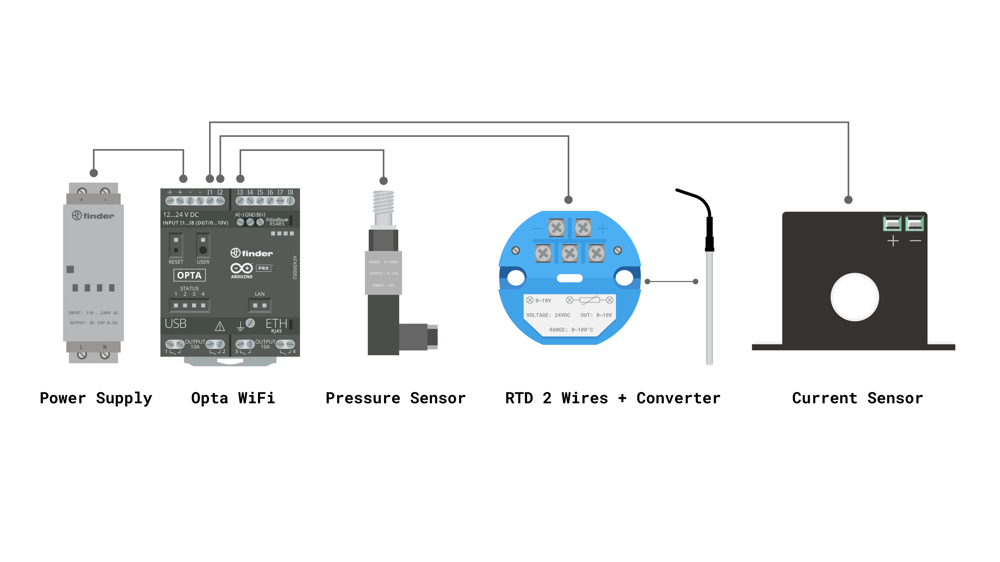
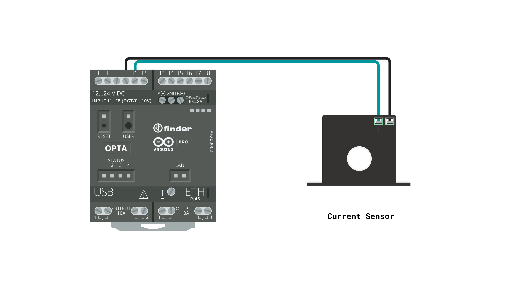

## Introduction

Upgrade your industrial air compressor with smart capabilities and connect it to the Arduino Cloud for advanced condition monitoring using the Opta™ micro PLC.


This affordable solution provides real-time remote data access, behavioral diagnostics, predictive maintenance, and efficient device management. It helps you maximize uptime, lower operational costs, and extend the lifespan of your equipment.

**Target audience:** PLC programmers, Automation engineers, Industrial IoT engineers and Electrical engineers.

### Goals

The goal of this application note is to showcase the capabilities of Opta PLC in transforming conventional industrial equipment into smart systems for monitoring and predictive maintenance purposes. The project's objectives are as follows:

- Monitor key performance indicators such as power consumption, temperature, and pressure of the compressor.
- Integrate additional sensing points, like vibration sensors, to monitor the status of motors and bearings.
- Connect the compressor using the Modbus TCP industry-standard protocol for seamless integration with existing systems.
- Leverage Arduino Cloud's powerful analytics to gain actionable insights into the compressor performance.
- Create an Arduino Cloud dashboard that syncs in real time to inform and alert the user.

## Hardware and Software Requirements


### Hardware Requirements

- [Opta™ WiFi](https://store.arduino.cc/products/opta-wifi) (x1)
- [Nicla Sense ME](https://store.arduino.cc/products/nicla-sense-me) (x1)
- 24 VDC Power Supply (x1)
- AC Current Sensor 0-10 V (x1)
- PT100 2-Wire RTD (x1)
- RTD to 0-10 V converter (x1)
- Pressure transmitter 0-10 V (x1)
- Power Relay 24 V (Optional x1)
- 18 AWG Wiring Cable
- [USB Type-C® Cable](https://store.arduino.cc/products/usb-cable2in1-type-c) (x1)
- [Micro-USB cable](https://store.arduino.cc/products/usb-2-0-cable-type-a-micro) (x1)

### Software Requirements

- [Arduino IDE 2](https://www.arduino.cc/en/software) or [Arduino Cloud Editor](https://create.arduino.cc/editor)
- The [Compressor Monitor sketches for Opta and Nicla Sense ME](assets/Opta_Nicla_Codes.zip)
- The [Arduino Create Agent](https://cloud.arduino.cc/download-agent/) to provision the Opta WiFi on the Arduino Cloud.
- The [**Arduino Cloud**](https://cloud.arduino.cc/). If you do not have an account, you can create one for free inside [**cloud.arduino.cc**](https://cloud.arduino.cc/home/?get-started=true).
- [Application Arduino Sketches](assets/Opta_Nicla_Codes.zip)

### Recommended Skills

- **Electrical knowledge:** wiring and safety protocols.
- **Programming:** basic logic understanding.
- **Technical documentation:** reading schematics.
- **Hands-on experience:** tool handling.

## Compressor Monitoring System Setup

The electrical connections for this application are shown in the diagram below:


We are going to detail every connection below:



The Opta PLC will be powered by an external 24 VDC power supply connected to its screw terminals labeled `+` and `-` respectively.


The current, temperature, and pressure sensors will be connected to inputs `I1`, `I2`, and `I3`, respectively.




***The sensor connections shown above are displayed separately for easier comprehension, but all of them are simultaneously connected to the Opta.***

The compressor power source will be wired through the Opta relay contact 1 and the current sensor.


## Compressor Monitoring System Overview

The monitoring system for the compressor integrates sensor data gathering, power control, and cloud communication using Opta's Wi-Fi® connection.

Opta is responsible for reading the sensors, uploading their data to the Cloud, controlling the compressor's power state, and sharing all sensor information via Modbus TCP.

The Nicla Sense ME uses its internal IMU to detect anomalous vibrations in the compressor motor. It connects with the Opta via BLE to share information on vibration status.


### Sensors Deployment

- The **Current Sensor**, along with the grid voltage, will help measure the compressor's power consumption for monitoring and overcurrent detection. It will be installed in the compressor's AC power line.
- The **Temperature Sensor** will measure the compressor's electric motor temperature for monitoring and high temperature detection. It will be attached to the compressor motor.
- The **Pressure Sensor** will measure the compressor's air pressure for monitoring and high pressure detection. It will be screwed into the compressor tank's pressure output.
- The **Nicla Sense ME** will detect anomalous vibrations. It will be fixed to the compressor motor or pump and powered by a battery or an external power source.

### Anomalies Detection

Every sensor will be used to detect anomalies. If any measured variable exceeds its nominal range, an anomaly alert will appear in the Arduino Cloud dashboard.

The sensor nominal thresholds are defined in the code as follows:

```arduino
#define CURRENT_LIMIT 12 // in Amps
#define PRESSURE_LIMIT 8 // in Bar
#define TEMP_LIMIT 85 // in Celsius
```


### Modbus TCP Data Output

The Opta will detect if an Ethernet cable is connected to its RJ45 terminal and will start sending the measured sensor data via Modbus TCP to a defined server address.

The variables will be sent to the registers in the following order:

| **Address** | **Sensor**  |
| :---------: | :---------: |
|    0x00     | Temperature |
|    0x01     |    Power    |
|    0x02     |  Pressure   |
|    0x03     |   Current   |

***Since Modbus Holding Registers are __uint16_t__, the data sent should be a positive integer between 0 and 65535. Therefore, the data is multiplied by a factor of 100. For example, a measured temperature of 42.5 °C will be sent as 4250.***

### Opta Code

You can download the code for the Opta PLC [here](assets/Opta_Nicla_Codes.zip).

Let's go through some important code sections to make this application fully operational, starting with the required libraries:

- `ArduinoBLE.h` enables support for Bluetooth® Low Energy (BLE) communication. Install it by searching for it in the Library Manager.
- `Ethernet.h` enables Ethernet support for Modbus TCP communication.
- `ArduinoModbus.h` and `ArduinoRS485.h` manage the Modbus TCP protocol. Search for **ArduinoModbus** and **ArduinoRS485** in the Library Manager to install them.
- `ArduinoIoTCloud.h` enables Arduino Cloud integration. Search for **ArduinoIoTCloud** in the Library Manager to install it.
- `Arduino_ConnectionHandler.h` manages the board's internet connectivity. Search for **Arduino_ConnectionHandler** in the Library Manager to install it.

There is a header included in the project code for the Arduino Cloud configuration:

- `thingProperties.h` includes the Wi-Fi® credentials and Arduino Cloud configuration.

```arduino
#include "thingProperties.h"
#include <ArduinoBLE.h>

// For Modbus TCP
#include <Ethernet.h>
#include <ArduinoRS485.h>  // ArduinoModbus depends on the ArduinoRS485 library
#include <ArduinoModbus.h>

// Ethernet + Modbus objects
EthernetClient ethClient;
ModbusTCPClient modbusTCPClient(ethClient);

IPAddress server(10, 0, 0, 227);  // update with the IP Address of your Modbus server

#define DEBUG false

// Anomalies thresholds
#define CURRENT_LIMIT 12 // in Amps
#define PRESSURE_LIMIT 8 // in Bar
#define TEMP_LIMIT 85 // in Celsius

// Sensor inputs
#define C_SENSOR A0
#define T_SENSOR A1
#define P_SENSOR A2

#define GRID_V 120.0  // replace this value with the Grid AC voltage

float P_I3 = 0;  // variable to store pressure (Bar)
float T_I2 = 0;  // variable to store temperature (C)
float C_I1 = 0;  // variable to store current (A)

byte AlertValue = 0;  // last alert value received.

bool control_once = 1;  // flow control variable

unsigned long previousMillis = 0;  // will store last time readings were done
const long interval = 1000;  // interval at which to repeat readings
```

In the `setup()` function, the different board peripherals are initialized, including:

- Serial communication
- LEDs and relay outputs
- ADC configuration
- Arduino Cloud properties
- Ethernet interface

```arduino
void setup() {
  // put your setup code here, to run once:
  Serial.begin(115200);
  // This delay gives the chance to wait for a Serial Monitor without blocking if none is found
  delay(1500);

  pinMode(RELAY1, OUTPUT);
  pinMode(LED_RELAY1, OUTPUT);
  pinMode(LEDB, OUTPUT);
  pinMode(LEDG, OUTPUT);

  // Set the resolution of the ADC to 12 bits.
  analogReadResolution(12);

  // Defined in thingProperties.h
  initProperties();

  // Connect to Arduino IoT Cloud
  ArduinoCloud.begin(ArduinoIoTPreferredConnection);

  /*
     The following function allows you to obtain more information
     related to the state of network and IoT Cloud connection and errors
     the higher number the more granular information you’ll get.
     The default is 0 (only errors).
     Maximum is 4
 */
  setDebugMessageLevel(2);
  ArduinoCloud.printDebugInfo();

  // Init Ethernet connection for Modbus TCP
  EthernetInit();
}
```

In the `loop()` function, the Wi-Fi® and BLE connections and sensor readings are continuously verified.

```arduino
void loop() {

  if (WiFi.status() == WL_CONNECTED) {  // If WiFi is successfully connected
    digitalWrite(LEDG, HIGH);           // Opta green LED ON

    if (control_once) {  // Once WiFi is ready, init Bluetooth LE once
      Serial.println("BLE Init");

      if (!BLE.begin()) {
        Serial.println("Starting BLE failed!");
        while (1) {
        }
      }

      BLE.scan();
      Serial.println("Scanning for peripherals.");
      control_once = 0;
    }

    // check if a peripheral has been discovered
    BLEDevice peripheral = BLE.available();

    if (peripheral) {
      // Check if the peripheral is called Nicla:
      if (peripheral.localName() != "Nicla") {
        return;
      }
      Serial.print("Found ");
      Serial.println(peripheral.localName());

      BLE.stopScan();
      // Nicla Sense ME node connection handler
      NiclaVibrationHandler(peripheral);

      BLE.scan();
    }

    // If there is not BLE connection this will manage the sensors reading
    unsigned long currentMillis = millis();

    if (currentMillis - previousMillis >= interval) {

      previousMillis = currentMillis;

      Serial.println("Not BLE Loop");

      BLE.scan();    // continue scanning for new BLE connection
      SensorRead();  // ADC sensor reading and conversions
    }

    ArduinoCloud.update();  // to maintain Cloud connectivity

  } else {  // If WiFi is not connected

    digitalWrite(LEDG, LOW);  // Opta green LED OFF
    control_once = 1;

    ArduinoCloud.update();  // to maintain Cloud connectivity
  }
}
```

The `SensorRead()` function reads the sensor data. Since the sensors are connected to the Opta's analog inputs, we can easily read them by sampling their respective ADC inputs. This function also checks the Ethernet connection to decide whether to send the sensor readings via Modbus TCP.

To convert the Opta's ADC raw readings into voltage, the following method can be used:

```arduino
Voltage = analogRead(<Input>) * (3.3 / 4095.0) / 0.30337;
```

***The formula above is derived from Opta's analog input frontend circuit.***

```arduino
void SensorRead() {

  T_I2 = (analogRead(T_SENSOR) * (3.3 / 4095.0) / 0.30337) * 10.0 - 0.31;  // RTD transmitter is limited to 0-100 C in the 0-10 V range.
  C_I1 = (analogRead(C_SENSOR) * (3.3 / 4095.0) / 0.30337) * 1.4235;       // Current sensor range is configurable, 0-10 A was used plus a calibration factor.
  P_I3 = (analogRead(P_SENSOR) * (3.3 / 4095.0) / 0.30337);                // Pressure sensor range is 0-10 Bar with a respective 0-10 V output.

  // update Arduino Cloud variables
  temp = T_I2;
  power = C_I1 * GRID_V; // Adjust GRID_V with your grid voltage
  press = P_I3;
  fault = faultCheck();

  Serial.print("Temperature: ");
  Serial.print(T_I2, 1);
  Serial.println(" C");
  Serial.print("Current: ");
  Serial.print(C_I1, 2);
  Serial.println(" A");
  Serial.print("Power: ");
  Serial.print(power, 2);
  Serial.println(" W");
  Serial.print("Pressure: ");
  Serial.print(P_I3, 1);
  Serial.println(" Bar");

  if (Ethernet.linkStatus() == LinkOFF) {
    Serial.println("Ethernet Cable Disconnected");

  } else if (Ethernet.linkStatus() == LinkON) {
    Serial.println("Sending Modbus Message");
    ModbusSend();
  }
}
```

The `ModbusSend()` function attempts to connect with the Modbus TCP server. If the connection is successful, it formats the sensor data to be sent.

```arduino
void ModbusSend() {
  if (!modbusTCPClient.connected()) {

    // client not connected, start the Modbus TCP client
    Serial.println("Attempting to connect to Modbus TCP server");

    if (!modbusTCPClient.begin(server, 502)) {
      Serial.println("Modbus TCP Client failed to connect!");
    } else {
      Serial.println("Modbus TCP Client connected");
    }
  } else {
    // client connected
    //Parse Float data to integer
    int Mod_T = T_I2 * 100;
    int Mod_Power = power * 100;
    int Mod_P = P_I3 * 100;
    int Mod_C = C_I1 * 100;

    // send the variables data
    if (modbusTCPClient.beginTransmission(HOLDING_REGISTERS, 0x00, 4)) {
      modbusTCPClient.write(Mod_T);
      modbusTCPClient.write(Mod_Power);
      modbusTCPClient.write(Mod_P);
      modbusTCPClient.write(Mod_C);
    }
    if (modbusTCPClient.endTransmission()) {
      Serial.println("Modbus Msg Sent Successfully");
    } else {
      Serial.println("Modbus Msg Not Sent");
    }
  }
}
```

There are other functions in the main code listed below:

- `EthernetInit()`: Initializes the Ethernet connection for Modbus TCP communication.
- `onPwrChange()`: Callback that controls the compressor power relay from the cloud.
- `NiclaVibrationHandler()`: Manages the BLE connection and gathers vibration alerts from the Nicla Sense ME.
- `faultCheck()`: Compares the current sensor values with the defined fault thresholds and reports the state.

***You can download the complete code from [here](assets/Opta_Nicla_Codes.zip).***

### Nicla Sense ME Code

You can download the code for the Nicla Sense ME [here](assets/Opta_Nicla_Codes.zip).

Let's go through some important code sections to make this application fully operational, starting with the required libraries:

- `Nicla_System.h` adds support for the Nicla core and extended functionalities for power management.
- `ArduinoBLE.h` enables support for Bluetooth® Low Energy (BLE) communication. Install it by searching for **ArduinoBLE** in the Library Manager.
- `Arduino_BHY2.h` provides the APIs for Nicla Sense ME board sensors. Search for **Arduino_BHY2** in the Library Manager to install it.

Initial settings are defined by specifying accelerometer samples, sampling frequency, sensor object, and time control variables.

```arduino
#include "Nicla_System.h"
#include <ArduinoBLE.h>
#include "Arduino_BHY2.h"

SensorXYZ accel(SENSOR_ID_ACC);  // IMU sensor object

#define VIBRATION_LIMIT 2000  // vibration threshold 

const uint16_t samples = 64;           //This value MUST ALWAYS be a power of 2
const double samplingFrequency = 512;  //IMU sampling frequency Hz
unsigned int sampling_period_us;

unsigned long vibration = 1;  // variable to store the vibration status

// Alert Service
BLEService alertService("1802");  // Immediate alert

// BLE Alert Characteristic
BLEUnsignedCharCharacteristic alertLevel("2A06",                // standard 16-bit characteristic UUID
                                         BLERead | BLENotify);  // remote clients will be able to get notifications if this characteristic changes

unsigned long microseconds;
long previousMillis = 0;  // last time the vibration level was checked, in ms
```

The Bluetooth® Low Energy services and characteristics are standardized for this specific application. The service is defined as `Immediate Alert (1802)`, ideal for notifying anomalous vibration events, and an `Alert Level Characteristic (2A06)`. These have specific and standardized Bluetooth® Low Energy UUIDs.

In the `setup()` function, the different board peripherals are initialized, including:

- Serial communication
- Nicla system for power management and LED control
- Onboard IMU sensor
- Bluetooth® Low Energy (BLE) communication

During the Bluetooth® Low Energy initialization, we define the device name as `Nicla` to make it easy for Opta to find it.

```arduino
void setup() {

  sampling_period_us = round(1000000 * (1.0 / samplingFrequency));

  Serial.begin(115200);  // initialize serial communication
  while (!Serial)
    ;

  // run this code once when Nicla Sense ME board turns on
  nicla::begin();       // initialize library
  nicla::leds.begin();  // initialize LEDs support

  nicla::setBatteryNTCEnabled(false);  // Set to false if your battery doesn't have an NTC thermistor.
  nicla::enableCharging(100);          // enable the battery charger and define the charging current in mA

  nicla::leds.setColor(red);

  BHY2.begin();

  accel.begin();

  // begin initialization
  if (!BLE.begin()) {
    Serial.println("starting BLE failed!");

    while (1)
      ;
  }

  /* Set a local name for the Bluetooth® Low Energy device
     This name will appear in advertising packets
     and can be used by remote devices to identify this Bluetooth® Low Energy device
  */
  BLE.setLocalName("Nicla");
  BLE.setAdvertisedService(alertService);      // add the service UUID
  alertService.addCharacteristic(alertLevel);  // add the battery level characteristic
  BLE.addService(alertService);                // add the alert service
  alertLevel.writeValue(0);                    // set initial value for this characteristic

  /* Start advertising Bluetooth® Low Energy.  It will start continuously transmitting Bluetooth® Low Energy
     advertising packets and will be visible to remote Bluetooth® Low Energy central devices
     until it receives a new connection */

  // start advertising
  BLE.advertise();

  Serial.println("Bluetooth® device active, waiting for connections...");
}
```

In the `loop()` function, we wait for the Bluetooth® connection. If it is connected, this will be indicated by a blue LED turning on. Every 1000 ms, the vibration status will be measured by calling the `updateVibrationStatus()` function.

```arduino
void loop() {
  // wait for a Bluetooth® Low Energy central
  BLEDevice central = BLE.central();

  // if a central is connected to the peripheral:
  if (central) {
    Serial.print("Connected to central: ");
    // print the central's BT address:
    Serial.println(central.address());

    // check the vibration level every 1000ms
    // while the central is connected:
    while (central.connected()) {
      nicla::leds.setColor(blue);
      long currentMillis = millis();
      // if 1000ms have passed, check the vibration:
      if (currentMillis - previousMillis >= 1000) {
        previousMillis = currentMillis;
        updateVibrationStatus();
      }
    }
    nicla::leds.setColor(red);
    Serial.print("Disconnected from central: ");
    Serial.println(central.address());
  }
}
```

The `updateVibrationStatus()` function averages the samples taken. If the vibration magnitude exceeds the defined limit, it will notify the Opta by sending a Bluetooth® message.

```arduino
void updateVibrationStatus() {
  /* Read the power management IC registers to retrieve the battery percentage
  */
  microseconds = micros();
  for (int i = 0; i <= samples; i++) {

    vibration += abs(accel.x());

    while (micros() - microseconds < sampling_period_us) {
      //empty loop
      BHY2.update();
    }
    microseconds += sampling_period_us;
  }

  vibration = vibration / samples;
  Serial.println(vibration);

  if (vibration >= VIBRATION_LIMIT) {
    alertLevel.writeValue(0);
  } else {
    alertLevel.writeValue(1);
  }
}
```

***You can download the complete code from [here](assets/Opta_Nicla_Codes.zip).***

### Arduino Cloud Dashboard

By leveraging the Arduino Cloud, we can seamlessly integrate a simple yet powerful dashboard to monitor and visualize the system status in real-time:


Within the Arduino Cloud's dashboard, the system variables can be monitored with the following widgets:

- ON/OFF compressor power switch widget.
- System variable gauges showing temperature, pressure, and power.
- Line charts for historical review of variable behavior.
- Vibration and fault state alert widgets for easy understanding of the compressor state.
  
This dashboard can be easily accessed from a PC, mobile phone, or tablet anywhere, providing instantaneous updates wherever we are. 

Additionally, we can set up various integrations to complement our project. For example, we can forward the dashboard data to an external service using **Webhook**, **IFTTT** automation, and **Smart Home** integrations.

## Full Compressor Monitoring System Example

All the necessary files to replicate this application note can be found below:

- The complete code can be downloaded [here](assets/Opta_Nicla_Codes.zip)

## Conclusion

In this application note, we have learned how to implement an industrial asset monitoring system by turning a conventional air compressor into a smart device.

This application shows how Arduino's environment simplifies the workflow for developing smart solutions to address real industrial needs. The Arduino PRO product line is a perfect fit for developing robust and reliable projects for the industry. We covered on-site sensor data sampling, Bluetooth® Low Energy communication, and real-time Cloud monitoring.

### Next Steps

Now that you know how to develop a smart air compressor monitoring system with the Opta PLC and the Nicla Sense ME, it is time to continue exploring all the capabilities of the Arduino Pro environment. Integrate it with your professional setup and enhance it with powerful solutions.

You can take this solution even further by integrating an **FFT** algorithm for the Nicla Sense ME, which would allow it to analyze specific vibration spectrums.