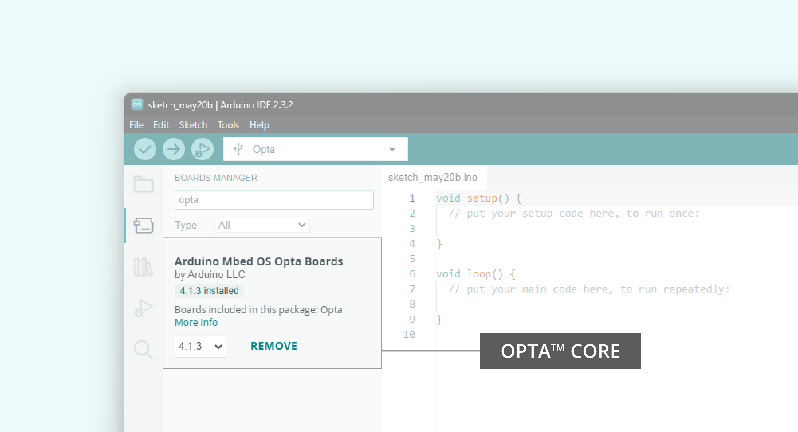
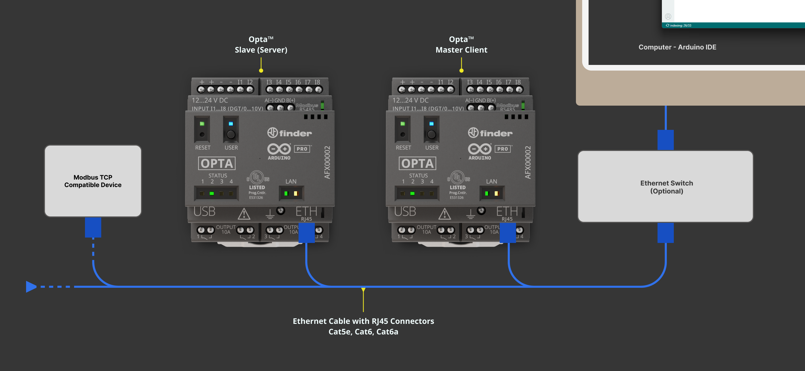

## Overview

The Opta™ offers industrial-grade hardware and software capabilities, along with the Arduino ecosystem tools such as the Arduino IDE and its libraries, allowing easy implementation of different Modbus communication protocols, including Modbus TCP.


In this tutorial, we will learn how to set up and use the Modbus TCP communication protocol over Ethernet between two Opta™ devices.

## Goals

- Learn how to set up the workspace environment for Modbus TCP using Arduino IDE.
- Learn how to use the Modbus TCP communication protocol between two Opta™ devices.
- Learn to verify that Opta™ has been correctly set up using a Modbus TCP communication example.

## Required Hardware and Software

### Hardware Requirements

- [Opta™ Lite](https://store.arduino.cc/products/opta-lite), [Opta™ RS485](https://store.arduino.cc/products/opta-rs485), or [Opta™ WiFi](https://store.arduino.cc/products/opta-wifi) (x2)
- 12 VDC / 1 A DIN rail power supply (x1)
- [USB-C® cable](https://store.arduino.cc/products/usb-cable2in1-type-c) (x1)
- Ethernet cable with RJ45 connectors - Cat5e, Cat6, Cat6e (x1)
- For the power supply and load: Use wires with cross-sectional areas between 13.3 mm² and 21.2 mm² (AWG sizes 6 to 4)

### Software Requirements

- [Arduino IDE 2.0+](https://www.arduino.cc/en/software) or [Arduino Web Editor](https://create.arduino.cc/editor)
- If you choose an offline Arduino IDE, you must install the following libraries via the IDE's Library Manager: [**ArduinoRS485**](https://github.com/arduino-libraries/ArduinoRS485) and [**ArduinoModbus**](https://github.com/arduino-libraries/ArduinoModbus).
- [Modbus TCP example code](assets/Opta_Modbus_TCP_Example.zip)

## Modbus Protocol

Modbus is a widely used, open, and royalty-free serial communication protocol based on a client/server architecture. It is commonly used in industrial electronic devices, such as Building Management Systems (BMS) and Industrial Automation Systems (IAS). BMS include HVAC control systems, lighting control systems, and fire alarm systems; IAS examples include manufacturing process control, robotic automation, and assembly line management.

Developed by Modicon (now Schneider Electric) in 1979, Modbus has become a standard communication protocol for industrial electronic devices, particularly those using programmable logic controllers (PLCs).

The Modbus protocol is frequently used to connect supervisory devices with Remote Terminal Units (RTUs) in Supervisory Control and Data Acquisition (SCADA) systems. Modbus ensures reliable communication between electronic devices through simple 16-bit messages, including a Cyclic Redundancy Check (CRC) for error-checking.

For more information on the Modbus protocol, check out this [Modbus article](https://docs.arduino.cc/learn/communication/modbus).

## Modbus TCP

The Modbus protocol is a messaging service that uses Client/Server or Controller/Peripheral communications. As an *application protocol*, it keeps its data handling separate from its transmission method.

**Modbus over TCP/IP**, commonly known as **Modbus TCP**, is a variant of the Modbus RTU protocol. It uses the TCP/IP interface over Ethernet for data transfer between compatible devices. Here are some key points about Modbus TCP:

* The **Transmission Control Protocol (TCP)** manages packet transmissions.

* The **Internet Protocol (IP)** sets the addresses to guide message routing.

* Modbus TCP maintains data integrity by encapsulating the primary data frame within a TCP frame, relying on the Ethernet TCP/IP layer’s checksum technique instead of the traditional Modbus checksum.

* Modbus over TCP/IP sticks to TCP/IP networking standards on Ethernet, using the Modbus messaging service as its data intermediary. Connections involve Modbus TCP/IP Client and Server devices, but routers, gateways, or bridges can also create a TCP/IP network.

***The terms __Controller__ and __Peripheral__ replace the outdated __Master__ and __Slave__ terminology. The Modbus Organization now refers to devices previously known as __Masters__ as __Controllers/Clients__ and devices previously known as __Slaves__ as __Peripherals/Servers__.***

## Instructions

### Setting Up the Arduino IDE

This tutorial requires the latest version of the Arduino IDE, which you can download [here](https://www.arduino.cc/en/software). In the Arduino IDE, you need to install the **`Arduino Mbed OS Opta Boards`** core for Opta™ devices.

To install the core for Opta™, navigate to **Tools > Board > Boards Manager** or click the **Boards Manager** icon in the left tab of the IDE.

In the Boards Manager tab, search for `opta` and install the latest `Arduino Mbed OS Opta Boards` core version.



### Installing the Required Libraries

Install the latest versions of the following libraries required for Modbus TCP communication:

- [**ArduinoModbus**](https://github.com/arduino-libraries/ArduinoModbus)
- [**ArduinoRS485**](https://github.com/arduino-libraries/ArduinoRS485)

You can easily install the libraries through the Library Manager of the Arduino IDE. The IDE's Library manager can be accessed using the **ctrl + shift + i** shortcut, by navigating to **Tools > Manage Libraries...**, or by navigating to the IDE's left panel and selecting the Library Manager icon (third option from the top).

### Connecting the Opta™ Over Ethernet LAN

Set up the connection by attaching the Ethernet LAN (RJ-45) cable to both devices using the `ETH RJ45` port. The image below shows how to connect both devices:



The setup in the image above includes an optional Ethernet switch that connects and monitors both Opta™ devices using the Arduino IDE. This configuration with the Ethernet switch can be used for this tutorial, but it can also be expanded to include other devices that support Modbus TCP.

### Code Overview

The following example aims to configure and use the Modbus TCP communication protocol over the Ethernet interface between two Opta™ devices.

Modbus is a well-known client-server protocol for its reliability. The Modbus client is responsible for sending requests, and the Modbus server provides the requested information when available. Multiple Modbus servers can be present, but only one Modbus client can be active.

One Opta™ device will be assigned as a client to handle writing coil values in this example. A secondary Opta™ device will perform as a server, polling for Modbus TCP requests and returning the appropriate values. The status LED 1 output will be a visual indicator for the Opta™ server.

The complete code for both devices, the client and server, are shown below. Compile and upload each example to the appointed Opta™ as you follow along with the following sections.

#### Modbus TCP Client

The Opta™ Client uses the following example:

```arduino
// Include necessary libraries for Ethernet and Modbus communication
#include <SPI.h>
#include <Ethernet.h>
#include <ArduinoRS485.h>
#include <ArduinoModbus.h>

EthernetClient ethClient;
ModbusTCPClient modbusTCPClient(ethClient);

// Define the IP address for Opta
IPAddress ip(10, 0, 0, 157);

// Define the IP Address of the Modbus TCP server (Opta device)
IPAddress server(10, 0, 0, 227);

void setup() {
    // Initialize serial communication at 9600 bauds,
    // wait for the serial port to connect
    Serial.begin(9600);
    while (!Serial);

    // Initialize Ethernet connection with the specified IP address
    // Using NULL for MAC to auto-assign the device's MAC address
    Ethernet.begin(NULL, ip); 

    // Check Ethernet hardware presence
    if (Ethernet.hardwareStatus() == EthernetNoHardware) {
        Serial.println("- Ethernet interface was not found!");
        while (true);
    }

    // Check Ethernet cable connection
    if (Ethernet.linkStatus() == LinkOFF) {
        Serial.println("- Ethernet cable is not connected!");
    }
}

void loop() {
    // Attempt to connect to Modbus TCP server if not already connected
    if (!modbusTCPClient.connected()) {
        Serial.println("- Attempting to connect to Modbus TCP server...");

        // Start Modbus TCP client
        if (!modbusTCPClient.begin(server, 502)) {
            Serial.println("- Failed to connect to Modbus TCP server!");
        } else {
            Serial.println("- Connected to Modbus TCP server!");
        }
    } else {
        // Modbus TCP client is connected, perform communication;
        // write a value to a coil at address 0x00
        if (!modbusTCPClient.coilWrite(0x00, 0x01)) {
            Serial.print("- Failed to write coil: ");
            Serial.println(modbusTCPClient.lastError());
        }

        // Wait for a second
        delay(1000);

        // Reset the coil at address 0x00
        if (!modbusTCPClient.coilWrite(0x00, 0x00)) {
            Serial.print("- Failed to reset coil: ");
            Serial.println(modbusTCPClient.lastError());
        }

        // Wait for a second
        delay(1000); 
    }
}
```

This example allows the Opta™ client to communicate with the Opta™ server over Modbus TCP. The client attempts to connect to the server and toggles a coil value at address 0x00 every second.

The IP configurations for the Opta™ client and server are defined in the following block:

```arduino
// Define the IP address for Opta
IPAddress ip(10, 0, 0, 157);

// Define the IP Address of the Modbus TCP server (Opta device)
IPAddress server(10, 0, 0, 227);
```

The Ethernet connection initialization process occurs within the following method inside the `setup()` function:

```arduino
// Field arguments - Ethernet.begin(<mac>, <IP>);
Ethernet.begin(NULL, ip); 
```

If both field arguments of the `Ethernet.begin(<mac>, <IP>);` are left empty, the **DHCP** configuration will be used. A **Static** IP address is used when the method is defined with a specific IP address, as in the example, which would be user assigned.

Defining `NULL` for the MAC address field will automatically assign a MAC address for the corresponding device.

#### Modbus TCP Server

In the Opta™ server, the main task is to poll for Modbus TCP requests and control status LED #1 based on the readings. It requires the same initial configuration as the Opta™ client. The main difference between the client and server devices lies in the `setup()` function:

```arduino
#include <SPI.h>
#include <Ethernet.h>
#include <ArduinoRS485.h>
#include <ArduinoModbus.h>

// Define the IP address for the Modbus TCP server
IPAddress ip(10, 0, 0, 227);

// Server will listen on Modbus TCP standard port 502
EthernetServer ethServer(502); 

// Create a Modbus TCP server instance
ModbusTCPServer modbusTCPServer;

// Define the pin for the LED
const int ledPin = LED_D0; // Use LED_D0 as the LED pin

void setup() {
  // Initialize serial communication at 9600 bauds,
  // wait for the serial port to connect,
  // initialize Ethernet connection with the specified IP address
  Serial.begin(9600);
  while (!Serial);
  Ethernet.begin(NULL, ip); 

  // Check Ethernet hardware and cable connections
  if (Ethernet.hardwareStatus() == EthernetNoHardware) {
    Serial.println("- Ethernet interface not found!");
    while (true);
  }
  if (Ethernet.linkStatus() == LinkOFF) {
    Serial.println("- Ethernet cable not connected!");
  }

  // Start the Modbus TCP server
  ethServer.begin();
  if (!modbusTCPServer.begin()) {
    Serial.println("- Failed to start Modbus TCP Server!");
    while (1);
  }

  // Configure the LED pin as an output
  pinMode(ledPin, OUTPUT);

  // Configure a single coil at address 0x00 for Modbus communication
  modbusTCPServer.configureCoils(0x00, 1);
}

void loop() {
  // Handle incoming client connections and process Modbus requests
  EthernetClient client = ethServer.available();
  if (client) {
    Serial.println("- Client connected!");

    // Accept and handle the client connection for Modbus communication
    modbusTCPServer.accept(client);

    // Update the LED state based on Modbus coil value
    while (client.connected()) {
      // Process Modbus requests
      modbusTCPServer.poll(); 
      updateLED();
    }

    Serial.println("Client disconnected.");
  }
}

/**
  * Updates the LED state based on the Modbus coil value.
  * Reads the current value of the coil from the Modbus TCP 
  * server and sets the LED state. If the coil value is high, 
  * the LED is turned on. If it is low, the LED is turned off
  *
  * @param None
  */
void updateLED() {
  // Read the current value of the coil at address 0x00
  int coilValue = modbusTCPServer.coilRead(0x00);
  
  // Set the LED state; HIGH if coil value is 1, LOW if coil value is 0
  digitalWrite(ledPin, coilValue ? HIGH : LOW);
}
```

This example sets up the Opta™ server to listen for incoming Modbus TCP connections and handle requests. It controls the **status LED #1 (`LED_D0`)** based on the coil value received from the client.

***You can find more information about Opta™ device's LEDs [here](https://docs.arduino.cc/tutorials/opta/user-manual/#leds).***

### Testing the Modbus TCP Client and Server

Once the Modbus TCP Client and Server code for each Opta™ device has been uploaded, the status LED #1 from Opta™ Server will be toggled based on the coil value from the Opta™ Client:


## Conclusion

This tutorial shows how to use the Arduino ecosystem tools to implement the Modbus TCP protocol between two Opta™ devices. With these examples, you can easily understand how to establish Modbus TCP communication between two Opta devices acting as a Server and a Client. This setup is scalable for connecting additional Modbus Server devices, such as another Opta™ or a Modbus TCP compatible module.

### Next Steps

Now that you know how to establish and use Modbus TCP communication with Opta™, you can explore the [Opta User Manual](/tutorials/opta/user-manual) to discover more about all the connectivity possibilities that Opta™ offers.

## Support

If you encounter any issues or have questions while working with Opta™ devices, we provide various support resources to help you find answers and solutions.

### Help Center

Explore our Help Center, which offers a comprehensive collection of articles and guides for Opta™ devices. The Help Center is designed to provide in-depth technical assistance and help you make the most of your device.

- [Opta™ help center page](https://support.arduino.cc/hc/en-us/categories/360001637274-Hardware-Support)

### Forum

Join our community forum to connect with other Opta™ devices users, share your experiences, and ask questions. The Forum is an excellent place to learn from others, discuss issues, and discover new ideas and projects related to Opta™.

- [Opta™ category in the Arduino Forum](https://forum.arduino.cc/c/hardware/opta/179)

### Contact Us

Please get in touch with our support team if you need personalized assistance or have questions not covered by the help and support resources described before. We're happy to help you with any issues or inquiries about Opta™ devices.

- [Contact us page](https://www.arduino.cc/en/contact-us/)  