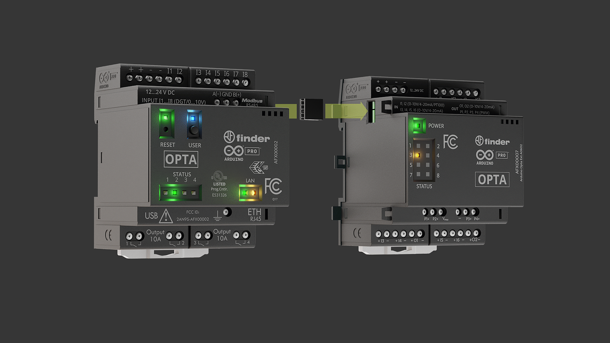
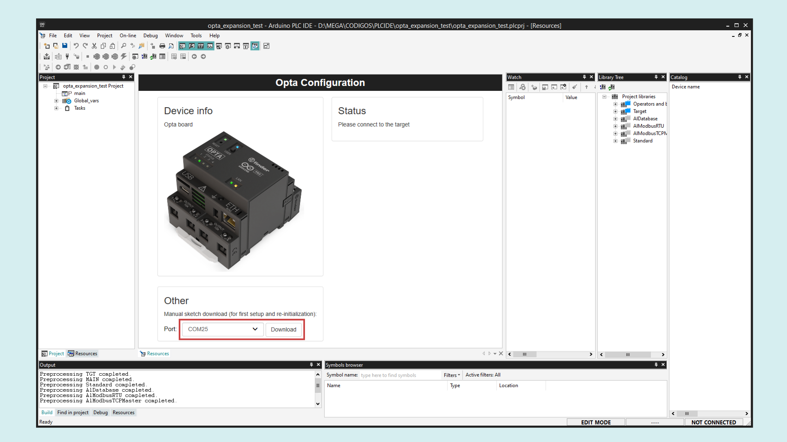
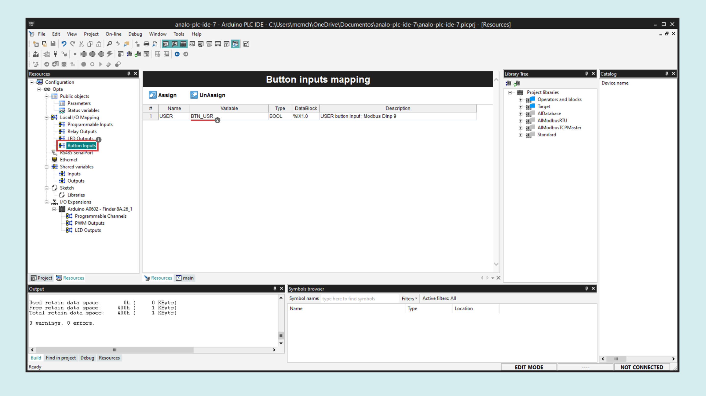

## Overview
In this tutorial you will learn how to use Opta™ Analog Expansion AFX00007 alongside an Opta™ controller using the Arduino PLC IDE.


We will go through every feature of the Analog Expansion and learn with simple examples how to leverage it for industrial sensor sampling and output controlling.

## Goals

- Learn how to use Opta™ Analog Expansion with the PLC IDE
- Learn how to enhance your Opta™ controller's capabilities using Opta™ Analog Expansions
- Leverage Arduino Pro products for real industrial applications

## Hardware and Software Requirements

### Hardware
- [Opta™](https://store-usa.arduino.cc/collections/opta-family) (x1)
- [AFX00007 - Opta Ext A0602](https://store.arduino.cc/products/Opta-Ext-A0602) (x1)
- 12-24 VDC/0.5 A power supply (x1)
- [USB-C® cable](https://store-usa.arduino.cc/products/usb-cable2in1-type-c) (x1)
- Stranded wire 4 mm<sup>2</sup> (12 AWG).

### Software
- The [Arduino PLC IDE v1.0.7 or higher](https://www.arduino.cc/pro/software-plc-ide) 
- [Arduino_Opta_Blueprint v0.2.3 or higher](https://github.com/arduino-libraries/Arduino_Opta_Blueprint) library to update Expansion Firmware.

***The Analog Expansion firmware must be updated to the 0.1.8 version or higher. To do it open the [Arduino IDE](https://www.arduino.cc/en/software), install the library [Arduino_Opta_Blueprint](https://github.com/arduino-libraries/Arduino_Opta_Blueprint) and open the example: Arduino_Opta_Blueprint -> UpdateExpansionFw.***

## Initial Configuration 

### Snapping the Expansion

You can connect up to **five expansions to your Opta™** controller module to multiply and diversify your I/O set with seamless detection.

Remove the breakable plastic cover marked as AUX from the expansion port on the Opta™ controller and the expansion module to expose the ports.

Attach the expansions to the right side of your Opta™ controller. Ensure that the **Aux connector** and the connection clips are correctly aligned, as shown in the image below:



The expansions must be powered externally in order to be detected and properly work.


***The Opta™ controller module supports a maximum of __5 expansion modules__. Exceeding this limit may cause unexpected behavior. __Ensure no more than five modules are connected, and verify that the Aux connector and clips are securely installed__.***

### Update Expansion Firmware


***The Opta™ expansions firmware must be updated to the latest version to ensure proper functioning. See this [section](https://docs.arduino.cc/tutorials/opta/user-manual/#update-expansion-firmware) for a guided step-by-step procedure.***

### Opta™ Micro PLC Setup

After downloading the [PLC IDE](https://www.arduino.cc/en/software#arduino-plc-ide), follow the installation process from the following [guide](https://docs.arduino.cc/software/plc-ide/tutorials/plc-ide-setup-license/). 

Open the PLC IDE and create a new project for Opta™.


Connect the Opta controller to your PC using a USB-C® cable. Then, upload the runtime for Opta™ by selecting its Serial Port and clicking on the **Download** button.



Once the runtime is flashed, navigate to **On-line > Set up communication**. With the **Modbus** protocol selected, open its properties and select the new virtual serial port (different from the one used in the previous step). Click "OK" to confirm.


***Modbus is the default serial protocol used to communicate the Opta™ with the PC.***

Next, click the **Connect** button in the upper left corner and wait for the base program to upload. A green **Connected** flag will appear in the lower right corner if the connection is successful.


***The Opta™ is pre-licensed, meaning no additional license purchase is required for use with the PLC IDE.***

If the Opta™ status displays **No License**, click the **Activate PLC runtime** button to activate it. The program will ask you to reset Opta but sometimes it could be also necessary to completely disconnect Opta from the computer and the external power and connect it again. For more details, refer to this [guide](https://docs.arduino.cc/tutorials/portenta-machine-control/plc-ide-setup-license/#7-license-activation-with-pre-licensed-products-opta).

### Analog Expansion Setup

To enable the Opta™ Analog Expansion features in the PLC IDE, navigate to the **Resources** tab and select **I/O Expansions** in the configuration tree. Then click **Scan** to allow the IDE to search for connected expansions.


***A popup warning may appear telling you that the configuration does not match, you can accept it and continue to the next step.***

Once the available expansion appears in the **Detected config** column, enable it by clicking on **Apply detect config**. Verify that the **Project config** column is updated.


## Programmable Inputs

The Opta™ Analog Expansion has 8x analog channels, identified with a letter, `I` or `O`, between the two connection terminals: `+` for signal and `-` as GND, common to the other `-` terminals on the board. 

Each input can be used as:

|            **Mode**            | **Specification** |
|:------------------------------:|:-----------------:|
|     Digital input voltage      |     0...24 V      |
|      Analog input voltage      |     0...10 V      |
|      Analog input current      |     0...25 mA     |
| Analog temperature input (RTD) |     0...1 MΩ      |

***All the analog channels of the analog expansion can be used as inputs, including `O1` and `O2`, so a total of 8x analog inputs are available to the users.***

### Digital Input Mode

To set up an input in digital mode, navigate to **Programmable Channels** under your desired expansion in the left **Resources** menu. Define a variable name to **I1**, `IN1` in this case and set the **IOType** to `Input - Digital`.


Now you can easily read this input state in your program no matter the programming language you are using.

For example in a **Ladder Diagram**:

- Create a new program in Ladder (LD), name it as you want, `digital_input` in this case and set the scanning speed to `fast`.


- Configure the LED "L1" assigning the variable `LED1` in **Resources > LED Outputs**. 


- Assign the variable `IN1` to your contact and the `LED1` to your coil as follows:


- Upload the program to your Opta and enable the **Live Debug Mode** to see the contacts and coils updating in real-time.


### Analog Voltage Input Mode

To set up an input in voltage mode, navigate to **Programmable Channels** under your desired expansion in the left **Resources** menu. Define a variable name to **I1**, `IN1` in this case and set the **IOType** to `Input - Voltage ADC`.


Now you can easily read this input voltage in your program. For example in a **Structured Text** program:

- Open your project main program navigating to the **Project** tab in the left panel, select **Main** in the project tree, and right-click on the **Local variables** window to insert a variable.


Insert the following variable with its respective _type_ to store the input voltage:

| **Name** | **Type** |
| :------: | :------: |
|  V_IN1   |   REAL   |


- In the main code editor clear the default counter example and add the following formula to convert the ADC raw reading to a voltage and store it in the `V_IN1` variable.

```
V_IN1 := IN1*10.0/65535.0; 
```

***The analog channel in voltage mode can measure up to 10 VDC and the ADC resolution is 16 bit, this is why we use the 65535 constant that corresponds to 2<sup>16</sup>-1.***

- Upload the program to your Opta and enable the **Live Debug Mode** to see the analog readings updating in real-time.


### Analog Current Input Mode

To set up an input in current mode, navigate to **Programmable Channels** under your desired expansion in the left **Resources** menu. Define a variable name to **I1**, `IN1` in this case and set the **IOType** to `Input - Current ADC`.


Now you can easily read this input current in your program. For example in a **Structured Text** program:

- Open your project main program navigating to the **Project** tab in the left panel, select **Main** in the project tree, and right-click on the **Local variables** window to insert a variable.


Insert the following variable with it respective _type_ to store the input current:

| **Name** | **Type** |
| :------: | :------: |
|  I_IN1   |   REAL   |


- In the main code editor clear the default counter example and add the following formula to convert the ADC raw reading to a current and store it in the `I_IN1` variable.

```
I_IN1 := IN1*25.0/65535.0;
```

***The analog channel in current mode can measure up to 25 mA and the ADC resolution is 16 bit, this is why we use the 65535 constant that corresponds to 2<sup>16</sup>-1.***

- Upload the program to your Opta and enable the **Live Debug Mode** to see the analog readings updating in real-time.


### Analog RTD Input Mode

To set up an input in RTD mode for temperature measurement, navigate to **Programmable Channels** under your desired expansion in the left **Resources** menu. Define a variable name to **I1**, `IN1` in this case and set the **IOType** to `Input - RTD 2 Wires` or `Input - RTD 3 Wires`.


***Channels I1 and I2 support 3 Wires RTD and 2 Wires RTD, all other channels only support 2 Wires RTD. If a 3 Wires RTD is defined, you need to set a current in mA for it, see your RTD datasheet.***

Now you can easily read this input resistance in your program. For example in a **Structured Text** program using a **PT100** sensor:

- Open your project main program navigating to the **Project** tab in the left panel, select **Main** in the project tree, and right-click on the **Local variables** window to insert a variable.


Insert the following variables with their respective _type_ and _attribute_:

| **Name** | **Type** | **Init value** | **Attribute** |
| :------: | :------: | :------------: | :-----------: |
|  T_IN1   |   REAL   |       -        |       -       |
|    a     |   REAL   |   0.0039083    |   CONSTANT    |
|    b     |   REAL   | -0.0000005775  |   CONSTANT    |


***__a__ and __b__ are PT100 constants.***

- In the main code editor clear the default counter example and add the following formula to convert the input resistive reading to a temperature and store it in the `T_IN1` variable.

```
T_IN1 := (-(1.0 / 100.0) * (50.0 * a - 10*sqrt(b * IN1 + 25.0 * pow(a, 2.0) - 100.0 * b))) / b;
```

***The analog channel in RTD mode can measure up to 1 MΩ and to convert the resistive value of it into temperature, the above quadratic equation is needed.***

- Upload the program to your Opta and enable the **Live Debug Mode** to see the temperature readings updating in real-time.


## Programmable Outputs

The Opta™ Analog Expansion has **8x analog programmable outputs** accessible through terminals `I1` to `I6` and `O1` to `O2` that can be used as:

|            **Mode**            |             **Specification**             |
|:------------------------------:|:-----------------------------------------:|
|      Analog output voltage      |                 0...11 V                  |
|      Analog output current      |                 0...25 mA                 |

***Due to power dissipation limitations, it is recommended to have up to 2 channels set at output at the same time. At 25°C of ambient temperature, all the 8x channels set as outputs have been tested at the same time while outputting more than 24 mA at 10 V each (>0.24 W per channel).***

### Analog Voltage Output Mode

To set up an output in voltage mode, navigate to **Programmable Channels** under your desired expansion in the left **Resources** menu. Define a variable name to **O1**, `OUT1` in this case and set the **IOType** to `Output - Voltage DAC`.


Now you can easily control this output voltage in your program. For example in a **Structured Text** program:

- In the main code editor clear the default counter example and use the following sketch to set the output voltage, it will increase from 0 to 11 V and then go back to 0 V.

```
OUT1 := OUT1 + 10;

IF OUT1 >= 8191 then
	OUT1 := 0;
END_IF;

// To define a specific voltage use the method below:
// OUT1 := <Voltage> * 8191.0 / 11.0; 
```

***The analog channel in voltage mode can generate up to 11 V and the DAC resolution is 13 bit, this is why we use the 8191 constant that corresponds to 2<sup>13</sup>-1.***

- To make sure the runtime can comply with the Analog Expansion actions programmed, modify the task speed by right-clicking in **Task > Fast** then clicking on **Task configuration** and setting the Fast task period to 50 ms.


- Upload the program to your Opta and enable the **Live Debug Mode** to see the output updating in real-time and use a voltmeter to measure the output.


### Analog Current Output Mode

To set up an output in current mode, navigate to **Programmable Channels** under your desired expansion in the left **Resources** menu. Define a variable name to **O1**, `OUT1` in this case and set the **IOType** to `Output - Current DAC`.


Now you can easily control this output current in your program. For example in a **Structured Text** program:

- In the main code editor clear the default counter example and use the following sketch to set the output current, it will increase from 0 to 25 mA and then go back to 0 mA.

```
OUT1 := OUT1 + 10;

IF OUT1 >= 8191 then
	OUT1 := 0;
END_IF;

// To define a specific current (mA) use the method below:
// OUT1 := <Current> * 8191.0 / 25.0; 
```

***The analog channel in current mode can generate up to 25 mA and the DAC resolution is 13 bit, this is why we use the 8191 constant that corresponds to 2<sup>13</sup>-1.***

- To make sure the runtime can comply with the Analog Expansion actions programmed, modify the task speed by right-clicking in **Task > Fast** then clicking on **Task configuration** and setting the Fast task period to 50 ms.


- Upload the program to your Opta and enable the **Live Debug Mode** to see the output updating in real-time and use an ammeter to measure the output on **O1**.


### PWM Output
The Analog Expansion has 4x PWM output channels **(P1...P4)**. They are software configurable and for them to work you must provide the **V<sub>PWM</sub>** pin with the desired voltage.

|  **V<sub>PWM</sub> Voltage**   |      **Details**      |
|:------------------------------:|:---------------------:|
|            Channels            |    P1, P2, P3, P4     |
|    Source voltage supported    |   8...24 VDC + 20%    |
|             Period             |     Programmable      |
|           Duty-cycle           | Programmable (0-100%) |
| Max current draw (per channel) |        100 mA         |
|         Max frequency          |         10kHz         |


To configure a PWM output, navigate to **PWM Outputs** under your desired expansion in the left **Resources** menu. Define a variable name to **P1 PERIOD** and **P1 PULSE**, `P1_PERIOD` and `P1_PULSE` respectively in this case.


Now you can easily control this output PWM period and pulse in your program. For example in a **Structured Text** program:

- Open your project main program by navigating to the **Project** tab in the left panel, select **Main** in the project tree, and right-click on the **Local variables** window to insert a variable.


Insert the following variable with its respective _type_ and _attribute_:

| **Name** | **Type** | **Init value** | **Attribute** |
| :------: | :------: | :------------: | :-----------: |
|  PERIOD  |   INT    |      1000      |   CONSTANT    |


***PERIOD and PULSE values are in microseconds.***

- In the main code editor clear the default counter example and use the following sketch to set the PWM signal period and pulse times.

```
P1_PERIOD := PERIOD;  // 1000 us period = 1 kHz

P1_PULSE := P1_PULSE + 10;

IF P1_PULSE >= 1000 then
	P1_PULSE := 0;
END_IF;
```

***The PWM output voltage is defined by the voltage applied to __V<sub>PWM</sub>__ from 8 to 24 V.***

- To make sure the runtime can comply with the Analog Expansion actions programmed, modify the task speed by right-clicking in **Task > Fast** then clicking on **Task configuration** and setting the Fast task period to 50 ms.


- Upload the program to your Opta and enable the **Live Debug Mode** to see the output updating in real-time and use an oscilloscope to measure the output on **P1**.


### Expansion Status LEDs

The Opta™ Analog Expansion has **8x status LEDs** on the front panel.

To control an LED, navigate to **LED Outputs** under your desired expansion in the left **Resources** menu and define a variable name to **L3**, `LED3` in this case.


Assign a variable to the Opta `USER` Button, `BTN_USR` in this case so we can use it to control the LED.



Now you can easily control the LED state by pressing the button with a simple program. For example in a **Ladder Diagram**:

- Create a new program in Ladder (LD), name it as you want, `ledControl` in this case and set the scanning speed to `fast`.


- Assign the variable `BTN_USR` to your contact and the `LED3` to your coil as follows:


- Upload the program to your Opta and enable the **Live Debug Mode** to see the contacts and coils updating in real-time.


### Conclusion 

In this tutorial, you have learned how to use an Opta™ Analog Expansion with the PLC IDE by demonstrating the use of each product features.

As you can see, the configuration process is straightforward, and the results are as expected. This serves as an excellent starting point for adapting the techniques covered here to develop your professional solutions.

#### Next Steps

Extend your knowledge about the Opta™ controller and the PLC IDE by following these tutorials:

- [Arduino PLC IDE Setup & Device License Activation](https://docs.arduino.cc/tutorials/portenta-machine-control/plc-ide-setup-license/)
- [Programming Introduction with Arduino PLC IDE](https://docs.arduino.cc/tutorials/portenta-machine-control/plc-programming-introduction/)
- [Tank Level Monitoring with the Opta™](https://docs.arduino.cc/tutorials/opta/tank-level-app-note/)
- [Modbus TCP with Portenta Machine Control & Opta™](https://docs.arduino.cc/tutorials/portenta-machine-control/pmc-opta-modbus-tcp/)