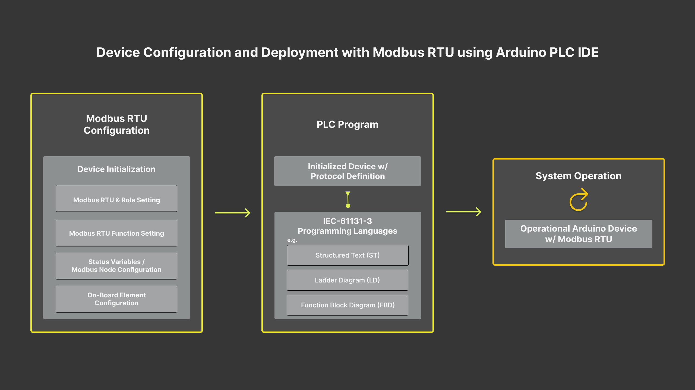
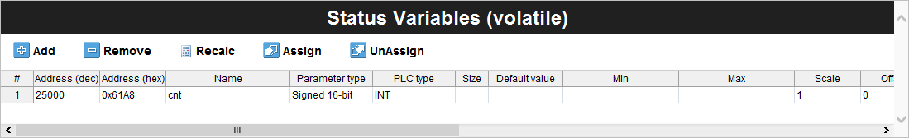
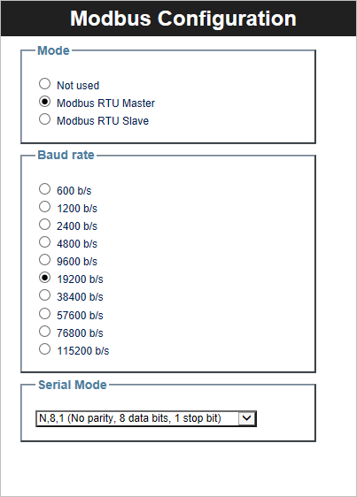
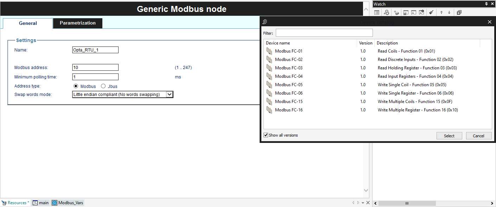
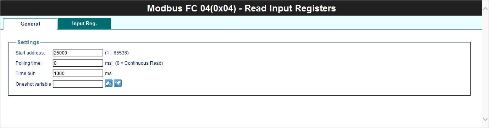
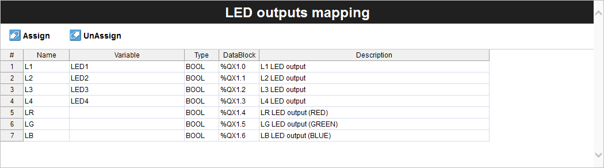
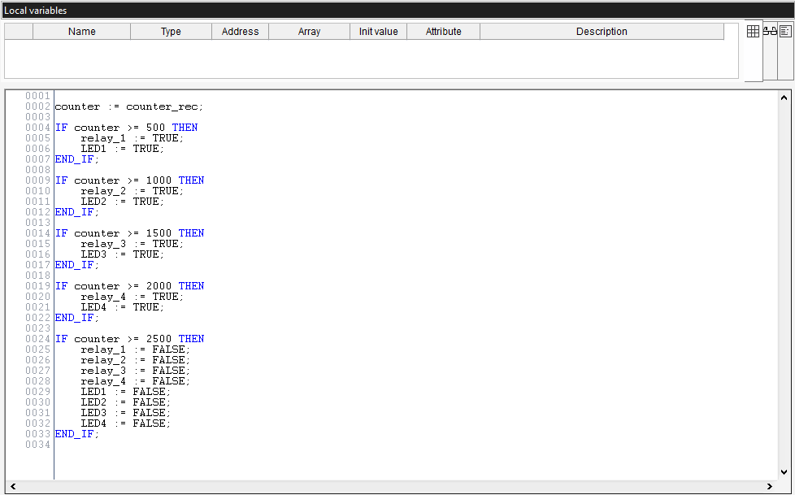
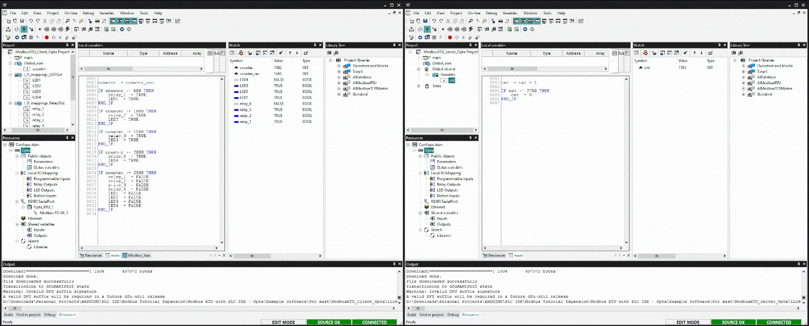

## Overview

Opta™ has scalable industrial-grade hardware with a wide range of connectivity choices. Opta™ is enhanced by the Arduino PLC IDE software, which makes the most of the device for solid field deployments. Opta™ supports Modbus protocols, and the Arduino PLC IDE makes it simple to implement them.


In this tutorial, you will learn how to implement Modbus RTU-based communication between two Opta™ devices using Arduino PLC IDE.

## Goals

- Learn how to configure the workspace environment to work with Modbus RTU using Arduino PLC IDE.
- Learn how to configure Modbus RTU for Opta™ using Arduino PLC IDE.
- Learn to verify that Opta™ has been correctly set up using a Modbus RTU communication example.

## Required Hardware and Software

### Hardware Requirements

- [Opta™](https://store.arduino.cc/collections/pro-family) (x2)
- [USB-C® cable](https://store.arduino.cc/products/usb-cable2in1-type-c) (x2)
- Cable with either specification for RS-485 connection (x3):
- STP/UTP 24-18AWG (Unterminated) 100 - 130 Ω rated
- STP/UTP 22-16AWG (Terminated) 100 - 130 Ω rated

### Software Requirements

- [Arduino PLC IDE Installer](https://www.arduino.cc/en/software#arduino-plc-ide)
- If you have an Opta™, you do not need any license key to activate your product. Learn more about this in [License Activation With Pre-Licensed Products (Opta™)](https://docs.arduino.cc/software/plc-ide/tutorials/plc-ide-setup-license#7-license-activation-with-pre-licensed-products-opta).
- [Opta™ Modbus RTU PLC IDE Project Example File](assets/ModbusRTU_Opta_Example.zip)

## Modbus Protocol

Modbus is an open, client/server architecture-based serial communication protocol free of licensing restrictions. It is commonly employed in industrial electrical equipment, particularly in Building Management Systems (BMS) and Industrial Automation Systems (IAS).

It was released by Modicon (now Schneider Electric) in 1979. Since then, it has become the de facto industry standard for industrial electronic devices communicating with PLCs.

In Supervisory Control and Data Acquisition (SCADA) systems, a Remote Terminal Unit (RTU) and a supervisory device are frequently connected via the Modbus communication protocol. Modbus messages have a straightforward 16-bit format and a Cyclic-Redundant Checksum (CRC) when communicating with electronic equipment.

***For more information regarding the Modbus RTU protocol implementation on an Opta™, you may want to check out [the "Getting Started with Modbus RTU on Opta™"](https://docs.arduino.cc/tutorials/opta/getting-started-with-modbus-rtu) tutorial.***

## Modbus RTU & PLC IDE

This tutorial will guide you through setting up two Opta™ devices with Modbus RTU using the Arduino PLC IDE and help us understand the overall implementation process.

The following diagram illustrates how Opta™ is configured and deployed with Modbus RTU:



The entire procedure is divided into three distinct stages:

* __Modbus RTU Configuration__ is the foundational step in initializing the Opta™ device with Modbus RTU and other intrinsic properties.
 
	The Modbus RTU role, Client or Server, is assigned to the Opta™ device during this stage. It includes the 'Baud rate' and 'Serial Mode' configurations, which are essential for Modbus RTU communication.
 
	Based on the device setting within the Modbus RTU, either the 'Status variables' are delineated, or the Modbus node is defined to determine the communicating devices using this protocol.

* __PLC Program__, established after device setup, is based on Modbus RTU and additional features. A significant advantage of this phase is the elimination of intricate configurations or specific programming tied to Modbus RTU within the PLC code.
 
	The procedure is designed for ease of use. By simply using predefined variables in the PLC code, the system handles data transfer through Modbus RTU. This approach benefits from the device's prior setup, minimizing repetitive tasks and promoting effective communication.

* __System Operation__ represents the anticipated outcome post the Modbus RTU configuration and the execution of the PLC program based on the developer's designed logic. Consequently, we can observe the device communicating with other devices through Modbus RTU.

The diagram presented shows the uniformity of the Modbus RTU setup across devices like Opta™ and the Portenta Machine Control using the PLC IDE. One main advantage of this system is its adaptability. Regardless of the specifics of the Modbus RTU setup, the PLC program consistently performs effectively. Its design ensures that it can be used in many different environments.

In addition, when developing the PLC code, there is no limitation to a single language. The system adheres to the IEC61131-3 standard, allowing one to select from the languages outlined in this standard. It ensures a balance between user convenience and accurate code development.

We can now delve into the specifics after providing an overview of the entire process.

## Instructions

### Setting Up the Arduino PLC IDE

To get the Arduino PLC IDE software, go to the [official software website of the Arduino PLC IDE](https://www.arduino.cc/pro/software-plc-ide) and choose to download the PLC IDE installer file. The software is named `Arduino PLC IDE Installer`.


The software requires **Windows 10** or a newer operating system version for the x64 architecture.

The Arduino PLC IDE installer contains the IDE and all the required drivers, libraries, and cores. The following sections will help you install the software properly.

***For more details regarding Arduino PLC IDE setup, please take a look at [Arduino PLC IDE Setup and Board's License Activation](https://docs.arduino.cc/tutorials/portenta-machine-control/plc-ide-setup-license) tutorial.***

### Hardware Setup

The two Opta™ devices will communicate using Modbus RTU, which is enabled by using the RS-485 interface for both devices. The following image shows the connection diagram for working with two Opta™ devices.


The Modbus RTU communication network can be scaled up by integrating additional protocol-compatible devices such as Opta™ or Portenta Machine Control.

***Opta™ does not come equipped with integrated termination resistors; therefore, it is essential to follow the Modbus protocol specifications, which require the addition of termination resistors. Should you experience inconsistencies in data transmission when using Opta™ alongside other Modbus RTU-compatible devices, it is advised to switch the A(-) and B(+) lines and initiate the process again.***

### Workspace Pre-Configuration

Some considerations must be made before properly enabling and using Modbus RTU on Opta™ using PLC IDE for appropriate Modbus RTU operation. The following subsections will explain such aspects.

***Check out [this tutorial](https://docs.arduino.cc/tutorials/portenta-machine-control/plc-ide-setup-license#3-project-setup) to familiarize yourself with the Arduino PLC IDE environment.***

#### Opta™ Basic Configuration

The Modbus RTU communication for Opta™ does not require special pre-configuration. You will only have to make a manual sketch download with the desired protocol role, its properties, and its onboard elements to be used. These onboard elements can be status LEDs and relays.

Opta™ can be initialized further in the process if additional configuration changes are required.

#### Modbus RTU Client and Server Mode

The PLC IDE software provides the option to set Opta™ as either a Modbus RTU Client, Server, or none of the previous modes. The option is configurable under `RS485 SerialPort` listed within the `Resources` tab.

Opta™ set as a Modbus RTU Client will provide 'Baud Rate' and 'Serial Mode' settings. The baud rate is available from 600 b/s to 115200 b/s. The serial mode offers a set of options conformed with the following elements:

- **Parity**: No Parity, Even Parity, Odd Parity
- **Data Bits**: 8 Data Bits (Only option for Data Bits)
- **Stop Bits**: 1 - 2 Stop Bits

On the other hand, Opta™ set as a Modbus RTU Server requires an additional configuration called 'Slave Settings'. It will ask you to define the Modbus address with a range between `1 .. 247`.

If you disable Modbus RTU for Opta™, you can select the option `none`. This option hides every Modbus RTU configuration parameter, turning off the protocol mode for Opta™.

#### General Modbus Node Configuration

The General Modbus Node allows the addition of information regarding the devices compatible with the Modbus messaging service.


It will require you to fill in basic information under the `General` tab and parameters to manage under the `Parametrization` tab. The basic information consists of:

- Name of the device to be communicated under Modbus protocol
- Modbus address (1..247)
- Minimum polling time [ms]
- Address type
- Swap words mode

This information will help identify and correctly communicate with the target device.

#### PLC IDE Modbus Custom Editor

The Modbus Custom Editor allows you to define a Modbus node with predefined parameters and variables. You can later add it using the `Add` option under `RS485 SerialPort`.

To open the Modbus Custom Editor window, go to `Tools -> Run Modbus Custom Editor` on PLC IDE.


It is helpful to have frequently deployed device configurations stored that are compatible with the Modbus protocol.

### Project Overview

The example project will test the Modbus RTU connection between two Opta™ devices after you have prepared the necessary prerequisites and tools.

The example project will slightly modify its default example code to incorporate a counter (`cnt`) variable, creating a live handshake verification procedure between two Opta™ devices and broadcasting the counter data.

Based on the counter data it receives from the "Modbus RTU Server Opta™," the "Modbus RTU Client Opta™" will activate the relay and the status LED. Using the role-specific sections, you may learn how to configure the Modbus RTU role for each Opta™ device.

You may access the entire example project [here](assets/ModbusRTU_Opta_Example.zip) to test it immediately. Every setting and component is ready to be assembled and uploaded to the corresponding Opta™.

The following sections will demonstrate how to set up each Opta™ according to its function in a Modbus RTU connection.

#### Modbus RTU Server Opta™

To set Opta™ as a Modbus RTU Server, navigate to the `RS485 SerialPort` tab in the PLC IDE's `Resources` panel. A window named `Modbus Configuration` will open, and we must select the `Modbus RTU Slave` option. For the tutorial example, we will use the following properties for server Opta™:

- **Baud Rate**: 19200 b/s
- **Serial Mode**: N,8,1 (No parity, 8 data bits, 1 stop bit)
- **Slave settings (Modbus address)**: 10


Alternative values can be used per requirements if needed.

The following image shows the `Status variables (volatile)` window. Here, we will define the `cnt` variable and assign its access address and datatype for Modbus RTU transmission.



The `cnt` status variable uses the following parameters:

* **Address**: 25000 (dec) / 0x61A8 (hex)
* **Name**: cnt
* **PLC type**: INT

With these settings ready, you **must go** to `Resources -> Opta,` select the corresponding port, and begin the `Manual sketch download` process. Then you **must go** to `On-line -> Set up Communication` and activate Modbus RTU with the higher USB port number assigned for Opta™.


Proceed with `On-line -> Connect`, and it will establish communication between your computer and the Opta™ server. If everything is fine, you can observe the message at the lower right corner of the PLC IDE software stating that it is connected.


Symbols `(1)` and `(2)` denote the connection statuses: Opta™ connected without a PLC code and Opta™ connected with an available PLC code, respectively.

Next, the main PLC code, also referred to as the primary code, must be compiled and uploaded to Opta™. To do this, navigate to the `main` tab within the `Project` panel and input the following code:

```arduino
cnt := cnt + 1;

IF cnt >= 2750 THEN
    cnt := 0;
END_IF;
```

The Opta™ server device's task runs a simple counter and resets whenever the counter reaches `2750`. Use the `Download PLC code` option or press `F7` to initiate the code's compilation and uploading process to Opta™. A successful upload will resemble the image provided below.


Upon completing these steps, you will have successfully configured an Opta™ device as a Modbus RTU Server. The following section will guide you through setting up another Opta™ as a Modbus RTU Client.

#### Modbus RTU Client Opta™

To set Opta™ as a Modbus RTU Client, navigate to the `RS485 SerialPort` tab in the PLC IDE's `Resources` panel. The `Modbus Configuration` panel will open, and we must select the `Modbus RTU Master` option. For the tutorial example, we will use the following properties for client Opta™:

- **Baud Rate**: 19200 b/s
- **Serial Mode**: N,8,1 (No parity, 8 data bits, 1 stop bit)



Alternative values can be used per requirements if needed.

To establish communication with a configured Modbus RTU Server on an Opta™ device, add a Modbus node by right-clicking the `RS485 SerialPort` tab in the `Resources` panel. After right-clicking, select the 'Add' option that appears. This action will allow you to introduce a 'Generic Modbus' node into the configuration. For this example, configure the node with the following parameters:

* **Name**: Opta_RTU_1
* **Modbus address**: 10
* **Minimum polling time**: 1 ms
* **Address type**: Modbus
* **Swap words mode**: Little-endian compliant (No words swapping)

For these settings, follow the configuration pattern used for the Modbus RTU Server Opta™. The most essential detail to set is the Modbus address. Ensure this address matches the one given to the server Opta™ or any other compatible device should you add more nodes. The setup should resemble the image provided:


Once you have established the Modbus node for the client Opta™, it is time to determine the Modbus function to fetch the counter (`cnt`) data from the server Opta™. Right-click on `Opta_RTU_1` or any other name you set with, and the 'Add' option will show up, displaying a device catalog window with all available Modbus functions:



To retrieve counter information from the server Opta™, select the 'Modbus FC-04 (Read Input Registers)' function. The 'General' tab needs to be configured with the following parameters to ensure correct data access:

* **Start address**: 25000
* **Polling time**: 0 ms (Continuous Read)
* **Timeout**: 1000 ms



Subsequently, you must define a variable to store the counter data retrieved from the server Opta™. To do this, navigate to the Modbus function configuration interface's `Input Reg.` tab. Introduce a variable named `counter_rec` to capture the data transmitted through the protocol.

The following image shows a visual representation of the anticipated configuration:


In this tutorial's demonstration, the client Opta™ is configured to use status LEDs and relays to respond to particular actions. We have the flexibility to assign variables to these status LEDs. For the present example, we will use designations ranging from `LED1` to `LED4` for the corresponding status LEDs.

For example, to use the `relay_1` and `LED1` variables for the first relay and status LED, respectively, these variables should be defined under the 'Local IO Mapping' section, specifically within 'Relay Outputs' and 'LED Outputs'. Neglecting this step will cause the program compilation to flag errors because of these undefined designations.

The following image shows a glimpse into how the configuration should appear within the PLC IDE interface:



Relays also need specific designations to reference them in the main PLC code. Below is a table presenting the variable names designated for the relays:


The program outlined below is designed to retrieve counter data, oversee status LEDs, and handle the corresponding relays. The proper functioning of Modbus RTU communication ensures the efficient execution of the tasks, as mentioned earlier.

```arduino
counter := counter_rec;

IF counter >= 500 THEN
	relay_1 := TRUE;
	LED1 := TRUE;
END_IF;

IF counter >= 1000 THEN 
	relay_2 := TRUE;
	LED2 := TRUE;
END_IF;

IF counter >= 1500 THEN 
	relay_3 := TRUE;
	LED3 := TRUE;
END_IF;

IF counter >= 2000 THEN 
	relay_4 := TRUE;
	LED4 := TRUE;
END_IF;

IF counter >= 2500 THEN
	relay_1 := FALSE;
	relay_2 := FALSE;
	relay_3 := FALSE;
	relay_4 := FALSE;
	LED1 := FALSE;
	LED2 := FALSE;
	LED3 := FALSE;
	LED4 := FALSE;
END_IF;
```

The variable `counter` serves as a global reference for the client Opta™. At the same time, `counter_rec` is the Modbus-specific variable that stores data fetched from the server Opta™. This variable was defined when configuring the `Read Input Registers` Modbus function.

Upon successful compilation and downloading of the main PLC code, the complete interface for the client Opta™ should resemble the image provided below:



Finally, Opta™ is now ready as a Modbus RTU Client.

### Testing Modbus RTU Communication Between Opta™ Devices (PLC IDE)

You can access the complete example project [here](assets/ModbusRTU_Opta_Example.zip). You can download the compressed file, extract it, and use the pre-configured example project for your Opta™ devices.

Set both Opta™ devices running with the corresponding main PLC code with the hardware setup explained in [this section](#hardware-setup). You will be able to observe the following results on client Opta™ repeatedly:

* Counter value = `500`: The status LED #1 and relay #1 will turn on
* Counter value = `1000`: The status LED #2 and relay #2 will turn on
* Counter value = `1500`: The status LED #3 and relay #3 will turn on
* Counter value = `2000`: The status LED #4 and relay #4 will turn on
* Counter value = `2500`: All status LEDs and relays will turn off

The following short clip briefly shows the expected behavior of the example project.



The left window shows the client Opta™, while the right window represents the server Opta™.

## Conclusion

In this tutorial, you have learned to configure the workspace environment to work with Modbus RTU using Arduino PLC IDE and verified that Opta™ has been correctly set up. Modbus RTU communication is effective using an example project that controls the Opta™ device's onboard features, such as relays and status LEDs, based on a customized example.

### Next Steps

Now that you have learned to implement the Modbus RTU between Opta™ devices using Arduino PLC IDE try adding additional Modbus RTU-compatible devices and creating a Modbus RTU communication network.

Further, explore the possibilities by combining the Opta™ device's onboard features with the Modbus RTU communication network and deploy it as an enhancement solution for industrial management systems.