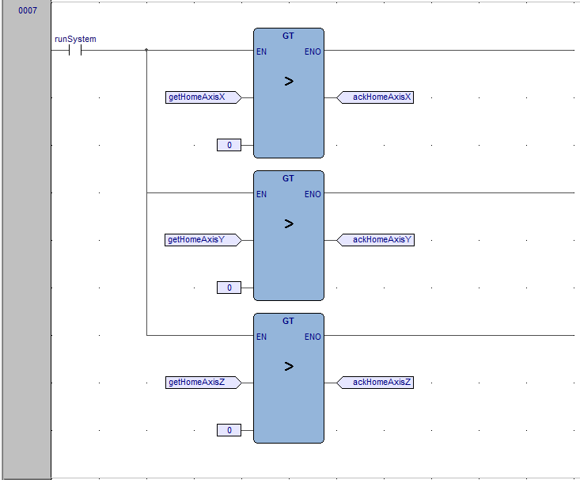

## Introduction

Packaging and labeling are essential processes in the production and distribution of products. Packaging involves enclosing and protecting items to ensure they remain safe from damage, contamination, or spoilage during storage and transport. It also improves the manageability of the product, making it easier to handle. Additionally, packaging enhances presentation, playing a key role in maintaining product quality and meeting safety standards.


Labeling complements this by providing crucial information such as barcodes, expiration dates and usage instructions. This ensures proper handling, traceability, and compliance with regulations. Together, packaging and labeling are critical for product identification, handling, safety, and customer satisfaction across industries.

Many industries rely heavily on packaging and labeling systems. In food and beverage, packaging keeps items fresh, while labels provide important details like nutritional information and expiration dates. In the pharmaceutical industry, precise labeling is crucial for dosage instructions and regulatory compliance. In electronics and e-commerce, packaging protects fragile items, and labels ensure accurate shipping and traceability. By integrating remote control and monitoring into packaging and labeling systems, industries can significantly enhance control over their production processes. 

Using Opta™ with Arduino Cloud, we can create an advanced, automated system that is fully remotely controlled. The Arduino Cloud dashboard provides a user-friendly interface, displaying all key metrics in real-time. This setup allows operators to monitor data and control machinery remotely, enabling them to track efficiency and address potential issues before they escalate, ensuring the system meets the demands of modern manufacturing.

Thanks to the use of Opta™, this solution will be cost-effective while offering remote access for monitoring and controlling the status of key elements within the application. Additionally, the system can be fully customized to meet specific needs, allowing us to design it exactly the way we want.

**Target audience:** PLC programmers, Automation engineers, Industrial IoT engineers and Electrical engineers.

### Goals

Our goal with this application is to showcase the capabilities of Opta™ in controlling a packaging and labeling system, while providing real-time remote monitoring and control. The specific goals are as follows:

- Create a ladder diagram program to manage the packaging and labeling process.
- Showcase the use of the Modbus RTU protocol with the RS-485 interface on the Opta.
- Monitor the status of all systems involved.
- Track key metrics, such as system state.
- Control the entire system, allowing it to be started and stopped remotely.
- Develop a real-time Arduino Cloud dashboard to keep users informed with synchronized data.

## Hardware and Software Requirements


### Hardware Requirements

- [Opta™ WiFi](https://store.arduino.cc/products/opta-wifi) (x1)
- [Arduino Pro Opta Ext D1608E](https://store.arduino.cc/collections/pro-family/products/opta-ext-d1608e) (x1)
- 24 VDC Power Supply (x1)
- Photoeletric Sensor (x4)
- Green normally open push button (1x)
- Red normally closed push button (1x)
- Power Relay 24 V (x4)
- Industrial Indicator Tower (1x)
- Conveyor belt (3x)
- Box Closing Machine (1x)
- Servo driver compatible with Modbus RTU over RS485 (x3)
- Servomotor compatible with the selected servo driver (x3)
- Labeling machine (1x)
- 14 AWG Wiring Cable
- [USB Type-C® Cable](https://store.arduino.cc/products/usb-cable2in1-type-c) (x1)

### Software Requirements

- [Arduino PLC IDE](https://docs.arduino.cc/software/plc-ide/)
- [Arduino Cloud Editor](https://create.arduino.cc/editor)
- [Packaging and Labeling Systems PLC Program](assets/Packaging_and_labeling.zip)
- The [Arduino Create Agent](https://cloud.arduino.cc/download-agent/) to provision the Opta WiFi on the Arduino Cloud.
- The [Arduino Cloud](https://cloud.arduino.cc/). If you do not have an account, you can create one for free inside [cloud.arduino.cc](https://cloud.arduino.cc/home/?get-started=true).

### Download the Project Code

[](assets/Packaging_and_labeling.zip)

Download the whole project code including the PLC IDE program [here](assets/Packaging_and_labeling.zip).

### Recommended Skills

- **Electrical knowledge:** Understanding wiring, safety protocols and interfaces like RS-485.
- **Programming:** Knowledge in ladder logic, Modbus RTU communication and Arduino sketches.
- **Technical documentation:** Ability to read schematics and system manuals.
- **Hands-on experience:** Experience with tools and setting up industrial systems.
- **Cloud integration:** Familiarity with Arduino Cloud for remote monitoring and control.

## Packaging and Labeling System Setup

In this section, an overview of the packaging and labeling system connections will be presented. To ensure clarity, the electrical connections are displayed in separate diagrams for easier understanding.

The following is an overview of the system’s inputs, outputs and Modbus connections:


The diagram below provides a summary of the connections for the packaging and labeling:


The diagram above illustrates all the equipment connected to the Opta. Both the Opta and its expansion module are powered by a 24V DC source. In the PLC input section, the connections for the start and stop push buttons, along with the four photoelectric sensors, are shown.

On the output side, are the connections to four relays that control the three conveyor belts and the box-closing machine. It’s important to note that the motors and the box-closing machine are not directly connected to the Opta outputs as a good practice to protect them. 

Instead, the Opta controls the external relays, which safely handle the current and voltage necessary to operate the motors and box-closing machine, protecting the PLC from overloads and potential damage. The Opta digital expansion outputs are connected to the industrial indicator tower.

Additionally, the Opta is connected via Modbus RTU to three servo drives and a labeling machine.

To ensure proper operation, the Opta and its expansion module require a stable power source. The Opta will be powered by an external 24 VDC power supply, which should be connected to the screw terminals labeled `+` and `-` respectively. The same applies to the Opta expansion module. This setup ensures that both devices receive the necessary voltage for consistent and reliable performance.


We will utilize three servo drives to construct the **Cartesian robot** responsible for capturing items and placing them into their respective boxes. To facilitate this process, the servo drives will be connected to the Opta PLC via Modbus RTU, using the RS-485 communication interface. The diagram below illustrates the connection setup for the servo drives.


The same approach will be applied to the labeling machine. We will use Modbus RTU with the RS-485 interface to control the machine responsible for labeling the materials. The diagram below illustrates this connection.


Next, we have the connections for the start and stop buttons. The start button, connected to `I1`, is configured as normally open (NO), meaning it activates the circuit when pressed. The stop button, connected to `I2`, is configured as normally closed (NC), meaning it deactivates the circuit when pressed.


The four photoelectric sensors are connected to inputs `I3`, `I4`, `I5`, and `I6` respectively. Each input is linked to a corresponding output of the photoelectric sensor, which operates in a binary (on/off) manner.

- Sensor on `I3` detects objects in the pick area.
- Sensor on `I4` detects open boxes in the packaging area. 
- Sensor on `I5` detects boxes at the entry of the box closing machine
- Sensor on `I6` detects boxes at the entry of the labeling machine. 
  
Each output will be either active (on) or inactive (off), depending on whether the sensor detects an object within its detection range.


The Opta's outputs are connected to relays that safely manage the current and voltage required to operate the motors and the box closing machine, preventing any potential damage to the Opta’s outputs. 

- Output `O1` is linked to the relay controlling the motor of the input conveyor. 
- Output `O2` is connected to the relay responsible for driving the motor of the packaging conveyor. 
- Output `O3` is connected to the relay that controls the motor for the box closing and labeling conveyor. 
- Output `O4` controls the relay for the actuator that closes the open box in the box closing machine.


The expansion module will be responsible for controlling the indicator tower. We will use the third to fifth outputs to ensure the wires are positioned at the bottom of the expansion module, facilitating the assembly of the electrical circuit. 

- Output `O3` in the expansion module will activate the green light.
- Output `O4` will control the yellow light.
- Output `O5` will be responsible for the red light.


***The wiring connections shown above are displayed separately for easier comprehension, but all of them are simultaneously connected to the Opta.***

## Packaging and Labeling Overview

The system is designed to receive an item on a feed conveyor, pick it up using an XYZ Cartesian robot controlled by three servo drives with Modbus RTU communication, and place it into an open box on a separate conveyor. Once the item is placed in the box, the conveyor will briefly activate to transfer the open box with the item inside to the next conveyor. 

There, the box will pass through a machine responsible for closing and sealing it. Following this, the box will move to another machine, also controlled via Modbus RTU, which will label the box to ensure that essential product information is included. Finally, the closed and labeled box will proceed to the next stages in the industrial process.

The image below illustrates the entire packaging and labeling system, as well as all the hardware used and its positioning within the entire system.


The Opta will be responsible for controlling the entire packaging and labeling system. It will execute control logic to read inputs, activate outputs, and perform read and write operations on other devices through the RS-485 interface using the Modbus RTU protocol. It will also provide system status and variable data in real-time to the Arduino Cloud, using a Wi-Fi® connection.

In order for this to be possible, we will create all the programming logic for the system's operation in a ladder diagram and the connectivity part with Arduino Cloud through code in Arduino Sketch. Both programs will run simultaneously on the Opta. But before discussing the ladder and Arduino programs, we first need to explain the operation of the entire packaging and labeling system.

The system is activated when the 'Start' button is pressed, and the first task it performs is the 'Home' operation for the XYZ Cartesian robot. This 'Home' operation moves the robot to a predefined starting position, establishing a reliable reference point for all subsequent tasks. This step is essential for maintaining accuracy and consistency in the robot's movements, as it prevents positioning errors over time. The robot achieves this by moving each axis (X, Y, and Z) to specific positions detected by sensors or fixed limits, which calibrates it for precise operations. This process ensures that the XYZ Cartesian robot is properly calibrated and ready for accurate performance.


After the home operation is completed, the system initiates the operation of both feeder conveyor belts: one for the object to be packed and the other for the packaging box. The first conveyor belt transports the object to the picking area, while the second belt brings an open box to the packaging area. In both cases, the items move along the belts until their respective presence sensors are activated, indicating that the object is in the picking area and the box is in the packaging area. In this way, both conveyor belts are halted while waiting for the pick-and-place operation.


Once the open box and the item to be packed are in position, the XYZ Cartesian robot performs a pick-and-place operation to transfer the item into the box. This robot consists of three servo drivers, each controlling a servomotor that drives one of the X, Y, or Z axes. The Opta controller manages these servo drivers individually via RS-485 Modbus RTU communication, using read-and-write commands on their Modbus map registers. This setup allows the Opta to precisely control each axis independently, guiding the robot through the necessary movements to execute the pick-and-place task accurately. After the operation, the item is securely placed inside the open box.


Now, the conveyor belt carrying the open box with the item inside briefly moves forward to transfer the box to the next conveyor belt. The open box with the item will now be closed in the box-closing machine. The conveyor transports it until a sensor in the box-closing machine detects the presence of the open box. At this point, the Opta activates an actuator responsible for closing and sealing the box. With the item now safely packed, the conveyor belt moves the package to the labeling machine.


The package's arrival in the labeling area is detected by a presence sensor. Upon detection, the Opta sends a command via RS-485 Modbus RTU communication to activate the labeling machine. The machine then accurately applies a label to the package, detailing essential information about the item inside. With the labeling complete, the package moves forward to undergo further processing in another area of the facility, outside the packaging and labeling process.


In essence, this outlines the complete process of the packaging and labeling system. The Opta manages each step and simultaneously functions as a gateway, transmitting real-time data to the Arduino Cloud. This way, you can monitor and control your system in real time.

### Sensors Deployment

- The **Photoeletric Sensor** this sensor will be responsible for detecting the presence of the item to be packaged and the box. Four of these sensors will be used, located on the two feeder conveyors: one responsible for bringing the open box and the other for bringing the item to be packaged. Another sensor will be placed in front of the box closing machine to indicate that there is a box ready to be sealed, and the last one will be located in front of the labeling machine, indicating that the package is ready to receive its label.

### Actuators Deployment

- The **Conveyor belt** is used to drive the package. Three conveyors will be used. Two conveyors are responsible for feeding the system, bringing the item to be packaged and the box that will hold the item, while the third conveyor is responsible for moving the open package to be closed by the box closing machine and labeled by the labeling machine. All conveyors will be controlled via a Solid State Relay, which is used to activate loads that are not supported by the PLC output. This way, the PLC can control equipment requiring a higher load capacity.

- The **Modbus Servo driver** is used to create the XYZ Cartesian robot, which will be used for picking up the item and placing it inside the box. These servo drivers will be controlled via Modbus RTU.

- The **box Closing Machine** is used to close and seal the open box containing the item. It will be controlled by a solid-state relay connected to an output from the Opta, which will act on an electromechanical actuator responsible for performing the closing and sealing operation.

- The **Labelling Machine** is used to label the package. It will be responsible for applying a label that contains crucial information about the package, and it will be controlled via Modbus RTU.

- The **Industrial Indicator Tower** is used to visually display the operating status of the system. It has three lights: the green light indicates that the system is operating correctly, the yellow light indicates that the system is on but not operating, and the red light indicates a fault or error in system operation.

## Step-by-Step Guide for System Operation

**System start**
- **Action:** Press the Start button.
- **Description:** The system is activated, starting the homing process of the XYZ Cartesian robot.

**Homing process**
- **Action:** The axes of the XYZ Cartesian robot begin the homing operation.
- **Description:** Each axis of the system will move to the Home position. This is done to ensure accurate positioning and repeatable movements throughout its operations.

**Activation of the feeder conveyors**
- **Action:** The conveyors responsible for bringing the item and the box are activated simultaneously.
- **Description:** The two conveyors are activated to bring the box and the item to a specific position, thus ensuring that the operation of picking up the item and placing it inside the box can begin.

**Pick and place operation**
- **Action:** Pick up the item and place it inside the open box.
- **Description:** When the presence sensors detect that both the item and the open box are in position, the pick-and-place operation begins. This operation is carried out by activating the three servo drivers working together to move to the item's location, pick it up, and transport it to place it inside the open box.

**Brief activation of the box feeder conveyor**
- **Action:** The conveyor containing the box with the item inside is momentarily activated.
- **Description:** The brief activation of the conveyor containing the item is done to ensure that the package reaches the next conveyor in the system.

**Box closing machine**
- **Action:** The open box will be closed and sealed in this process.
- **Description:** After the brief activation period of the box feeder conveyor, the open box containing the item is now on the closing and labeling conveyor, which is activated to move the box to the box closing machine. The presence of this open package is detected by a photoelectric sensor, which triggers the box closing machine to carry out the process of closing and sealing the package.

**Labeling machine**
- **Action:** The labeling process of the sealed package will be carried out.
- **Description:** After the package is closed and sealed by the box closing machine, the closing and labeling conveyor remains activated and moves the now-sealed package to the labeling area. Upon arrival in this area, a photoelectric sensor detects the package, triggering the labeling machine, which is activated to label the closed package. The package, now closed and labeled, continues along the closing and labeling conveyor to be handled in other factory processes.

**System Stop**
- **Action:** Press the stop button.
- **Description:** The system is stopped, stopping all operations and deactivating the conveyors and actuator. This operation can be performed at any time.

**Remote Monitoring and Control**
- **Action:** Monitor and control the system via the Arduino Cloud.
- **Description:**  At any time, you can check the operating status and control the system remotely using the Arduino Cloud interface.

## Opta Ladder Diagram

After understanding the step-by-step operation of the system, the ladder diagram below was created to represent the entire logic of the packaging and labeling system, and to make it easier to understand, it has been divided and explained separately. You can download the complete Arduino PLC IDE project [here](assets/Packaging_and_labeling.zip).

In the `Project` tab of the Arduino PLC IDE, you’ll find the workspace for creating and managing ladder diagrams. This is where you can develop and edit the logic for your project. To start building ladder logic, click on `Cycle` within this tab, however, the `Cycle` option will only appear if you've previously downloaded and opened the project in the Arduino PLC IDE. The screenshot below provides a visual guide to help you locate this section, making it easier to understand where to work on ladder diagrams within the software.


If you haven't previously downloaded and opened the Arduino PLC IDE project, and you're starting a new project instead, you'll need to create a new ladder diagram program. To do this, go to the `Project` tab at the top of the software, select `New object`, then choose `New program`. A pop-up window will appear where you can select `LD` for Ladder Diagram. After that, name your program and assign a `Task` to it. This will add a new ladder diagram to your project. The screenshot below provides a visual guide to help you find these options in the software.


### Mapping the Inputs and Outputs

In the Arduino PLC IDE, it's essential to link the PLC's physical inputs and outputs to variables that will be used in your program. These variables will represent the input states and manage the output controls.

To do this, go to the `Resources` tab, then to `Local I/O Mapping`, and select `Programmable Inputs` or `Relay Outputs` to associate inputs and outputs, respectively.

In the previous section, `Packaging and Labeling System Setup`, we reviewed the physical connections for the input elements. Based on this, we have the following:

- `I1`: Linked to the variable `startButton` is associated with detecting the state of the green start push button.
- `I2`: Linked to the variable `stopButton` is associated with detecting the state of the red stop push button.
- `I3`: Linked to the variable `objectDetectionSensor`, which indicates when the photoelectric sensor detects the presence of an object to be packed in the picking area.
- `I4`: Linked to the variable `boxPresenceSensor`, which indicates when the photoelectric sensor detects the presence of an open box in the packaging area.
- `I5`: Linked to the variable `boxClosureSensor`, which indicate when the photoelectric sensor detects the presence of an item packed in the open box in the area of the box-closing machine.
- `I6`: Associated with the variable `boxLabelingSensor`, which indicate when the photoelectric sensor detects the presence of an item packed in the closed box in the area of the labeling machine.

All input variables are of boolean type, meaning they can hold either a `True` or `False` value.

The image below illustrates the association between the physical input elements and the respective variables that will be used in the program.


Now, for the outputs, we have the following configuration:

The Opta outputs will be employed to activate the relays controlling the three conveyors and the box-closing machine, utilizing all four outputs available on the Opta. Consequently, the digital expansion module will be used to manage the signal tower, as no additional outputs are available on the Opta. The signal tower features three colors: red, yellow, and green, each of which will be individually controlled by a dedicated output on the expansion module.

The Opta outputs are configured as follows.

- `O1`: Linked to the variable `infeedConveyor`, which is responsible for activating the relay that will operate the conveyor motor bringing the item to the picking area.
- `O2`: Linked to the variable `packConveyor`, which is responsible for activating the relay that will operate the package conveyor motor, bringing the open box to the placing area.
- `O3`: Linked to the variable `sealingAndLabelingConveyor`, which is responsible for activating the relay that will trigger the third conveyor. This conveyor is responsible for bringing the open box with the item inside to the box-closing machine and then to the labeling machine.
- `O4`: Linked to the variable `boxSealingMachine`, which is responsible for activating the relay that will trigger the box-closing machine, which will close and seal the box.

The image below illustrates the association between the physical outputs in the Opta and the variables.


The outputs listed above were configured on the Opta. Next, we will configure the following outputs on the expansion module.

- `O3`: Linked to the variable `signalTowerGreenLight`, which is responsible for activating the green light on the signal tower. This green light means that everything is working properly.
- `O4`: Linked to the variable `signalTowerYellowLight`, which is responsible for activating the yellow light on the signal tower. The yellow light indicates that there is a warning in the system.
- `O5`: Linked to the variable `signalTowerRedLight`, which is responsible for activating the red light on the signal tower. The red light indicates a critical issue or an emergency stop in the system.


If you want to learn how to add the expansion module, please click on this [link](https://docs.arduino.cc/software/plc-ide/tutorials/opta-analog-expansion-plc-ide/).

### Mapping the Built-In LEDs on the Opta

The Opta features programmable built-in LEDs. We'll use these LEDs to indicate that the Opta is running by turning on the green LED. Additionally, each output LED will light up individually to show when a corresponding output is active.

To do this, go to the `Resources` tab, then to `Local I/O Mapping`, and choose `LED Outputs` to link the built-in LEDs with the variables.

The configuration of the built-in LEDs will be as listed below:

- `L1`: Linked to the variable `outputLED01`, which is responsible for illustrating the operation of output01 by activating LED L1.
- `L2`: Linked to the variable `outputLED02`, which is responsible for illustrating the operation of output02 by activating LED L2.
- `L3`: Linked to the variable `outputLED03`, which is responsible for illustrating the operation of output03 by activating LED L3.
- `L4`: Linked to the variable `outputLED04`, which is responsible for illustrating the operation of output04 by activating LED L4.
- `LG`: Linked to the variable `Run`, which is responsible for illustrating the operation of the Opta by activating the green light.

This configuration can be seen in the image below.


### Modbus Setup

Modbus RTU is a popular communication protocol used in industrial automation to connect devices like PLCs, sensors, and other equipment. It uses a master-slave setup, where one master device can control and exchange data with multiple slave devices over serial lines (such as RS-232 or RS-485). Modbus RTU sends data in a compact, efficient format, which helps maintain fast communication over longer distances. Known for its simplicity and reliability, it’s widely used to ensure different devices from various manufacturers can work together in industrial systems.

Modbus RTU with RS-485 is being utilized to control the three servo drivers and the labeling machine. To achieve this, we first need to configure Modbus on the Opta. Initially, we set the Opta as a Master so it can control the entire Modbus network. Next, we set the Modbus baud rate to 115200 b/s and select serial mode with no parity, 8 data bits, and 1 stop bit, as shown in the image below. This configuration is essential because, without it, the network won’t operate properly. It is important to know that all devices on this Modbus RTU network must have the same configurations for communication between them to be possible.


After this configuration, you need to create a Modbus node to set up information such as the name, Modbus address, minimum polling time, address type, and swap words mode. The figure below illustrates this configuration for the servo driver responsible for the X-axis On the side, you can also see the other Modbus nodes, totaling four in all, each differing by name and address.


The table below illustrates the configuration of the Modbus nodes.

| **Name**           | **Modbus address** | **Minimum polling time** | **Address Type** | **Swap Words mode** |
| ------------------ | ------------------ | ------------------------ | ---------------- | ------------------- |
| Servodriver_Axis_X | 1                  | 1                        | Modbus           | Little endian       |
| Servodriver_Axis_X | 2                  | 1                        | Modbus           | Little endian       |
| Servodriver_Axis_X | 3                  | 1                        | Modbus           | Little endian       |
| Labeling_Machine   | 4                  | 1                        | Modbus           | Little endian       |

In Modbus RTU, functions and addresses are essential for communication between a master device and slave devices. Each Modbus RTU message includes a function code that instructs the slave on a specific action. Common function codes include reading coils (Function 01) for binary output values, reading discrete inputs (Function 02) for binary input values, reading holding registers (Function 03) for internal data, and writing to coils or registers (Functions 05 and 06). Additionally, Function 16 (Write Multiple Registers) is used to write a series of values to consecutive holding registers, enabling batch updates to multiple data points. Addresses in Modbus RTU refer to specific memory locations within the device, each storing data points like sensor readings or control outputs. Unique addresses ensure that the master can accurately read or write data across the network, making Modbus RTU a reliable protocol for industrial communication.

In Opta, for each Modbus node created, we need to assign the functions we want them to perform. To know which functions and addresses to use, we need to understand the register map of the equipment we want to operate and determine what we wish to accomplish with these registers. In this case, we will use the register map of the MR-JE-A series servo driver from Mitsubishi as a reference, and our program will be designed specifically to control this model. The following images respectively illustrate the Modbus function and the linked variable.


You can access this [link](https://dl.mitsubishielectric.com/dl/fa/document/manual/servo/sh030150/sh030150c.pdf) to find the manual for the Mitsubishi MR-JE-A servo driver series and this [link](https://dl.mitsubishielectric.com/dl/fa/document/manual/servo/sh030177/sh030177c.pdf) to find the Modbus instruction map.

In the image, we can see that function FC 03 is used, which is responsible for reading holding-type registers only. We also have the configurations for starting address, polling time, timeout, and oneshot variable. The functions and addresses to be used for the servo driver are described in the table below.

| **Function**                    | **Start Address Decimal** | **Start Address Hex** | **Polling Time** | **Time out** | **Oneshot variable** | **Description**                                                                                                                                                                                                                                                                                                                                                                        | **Linked Variable** |
| ------------------------------- | ------------------------- | --------------------- | ---------------- | ------------ | -------------------- | -------------------------------------------------------------------------------------------------------------------------------------------------------------------------------------------------------------------------------------------------------------------------------------------------------------------------------------------------------------------------------------- | ------------------- |
| FC 03 - Read Holding Register   | 24640                     | 6040h                 | 0                | 1000         | N/A                  | At address 24640 is the Control Word, a 16-bit register that enables control of key operations (like turning the servo on/off or resetting alarms) via Modbus RTU by setting specific bits. By reading this address, we can retrieve information about the state of the Control Word.                                                                                                  | getControlWordAxis  |
| FC 03 - Read Holding Register   | 24641                     | 6041h                 | 0                | 1000         | N/A                  | At address 24641 is the Status Word, a 16-bit register that provides real-time feedback on the current status of the device. By reading the Status Word, operators or control systems can monitor the servo’s condition, determine if any alarms are present, and verify if the system is ready, active, or requires intervention.                                                     | getStatusAxis       |
| FC 16 - Write Multiple Register | 24640                     | 6040h                 | 0                | 1000         | N/A                  | At address 24640 is the Control Word. Now, instead of reading, we will write to the Control Word, allowing us to control the servo motor's operations.                                                                                                                                                                                                                                 | setControlWordAxis  |
| FC 16 - Write Multiple Register | 24672                     | 6060h                 | 0                | 1000         | N/A                  | The 6060h register, or "Mode of Operation" register, sets the control mode for the servo. Different values activate specific modes: -20 for position control, -21 for speed control, -22 for torque control, and 6 for homing mode, which moves the servo to a predefined home position. This register is crucial for configuring the servo’s control type for its intended operation. | setControlModeAxis  |
| FC 16 - Write Multiple Register | 10242                     | 2802h                 | 0                | 1000         | N/A                  | The 2802h register is used to set position data, specifying a position to which the servo driver should move the servo motor.                                                                                                                                                                                                                                                          | setPositionAxis     |

Now, for the labeling machine, we will use only coils, which are described in the table below.

| **Function**                  | **Start Address Decimal** | **Polling Time** | **Time out** | **Oneshot variable** | **Description**                                                                                        | **Linked Variable** |
| ----------------------------- | ------------------------- | ---------------- | ------------ | -------------------- | ------------------------------------------------------------------------------------------------------ | ------------------- |
| FC 05 - Write Single Coil     | 3000                      | 0                | 1000         | N/A                  | The address with the value 3000 is responsible for activating the labeling machine, making it operate. | labelingControl     |
| FC 03 - Read Holding Register | 4000                      | 0                | 1000         | N/A                  | The address with the value 4000 is responsible for reading the state of the labeling machine.          | labelingStatus      |

Remember, it is important that the devices on the Modbus network are configured to communicate with each other to enable data transmission over the network. We will not cover how to configure these devices, as each manual provides the correct method for doing so.

### Step-by-Step Ladder Diagram Breakdown

The **Rung 01**


- `Run`: This is an output that remains active while the Opta is running. This output is used to turn on the Opta's built-in green light.

**Resume**: This rung defines an output that stays active as long as the Opta is running. This output controls the Opta's built-in green light, serving as a visual indicator of the system's operational status.

The **Rung 02**


- `in_cloudStartButton`: This input represents a start button signal from the Arduino Cloud. When this input is active (high), it indicates that the start command has been issued from the cloud.
- `startButton`: This input represents a physical start button. When pressed, this input becomes active (high), indicating that the start command has been given physically.
- `startSystem`: This is a coil (output) that gets activated when the system should start. When this output is active (high), it indicates that the system is in the starting state.
- `out_cloudStartButtonStatus`: This output signal communicates the status of the Start button to the Arduino Cloud. When the Start button is physically pressed, this variable updates to reflect the button’s status in the Arduino Cloud.

**Resume**: This rung enables the system to start based on either a cloud command (`in_cloudStartButton`) or a physical start button (`startButton`). If either input is active, the system starts (`startSystem` is energized) and a feedback signal (`out_cloudStartButtonStatus`) is sent to the Arduino Cloud.

The **Rung 03**


- `in_cloudStopButton`: This input represents a stop button signal from the Arduino Cloud. When this input is active (high), it indicates that the stop command has been issued from the cloud.
- `stopButton`: This input represents a physical stop button. When pressed, this input becomes active (high), indicating that the stop command has been given physically.
- `stopSystem`: This is a coil (output) that gets activated when the system should stop. When this output is active (high), it indicates that the system is in a stopped state.
- `out_cloudStopButtonStatus`: This output signal communicates the status of the Stop button to the Arduino Cloud. When the Stop button is physically pressed, this variable updates to reflect the button’s status in the Arduino Cloud.

**Resume**: This rung stops the system based on either a cloud command (`in_cloudStopButton`) or a physical stop button (`stopButton`). When either input is active, the system stops (`stopSystem` is energized), and a feedback signal (`out_cloudStopButtonStatus`) is sent to the Arduino Cloud.

The **Rung 04**


- `startSystem`: This input is energized when the system is in starting mode. It is activated by the logic from previous steps that command the system to start.
- `stopSystem`: This input is activated when the system is in stopping mode. It is energized based on the logic from previous steps that command the system to stop.
- `runSystem`: This is a coil (output) that gets energized when the system is in the running state. When this output is active, it indicates that the system is currently operational.

**Resume**: This rung controls the system's transition to the running state. The system will enter the running state (`runSystem` is energized) if a start command is given (`startSystem` is active) and no stop command is present (`stopSystem` is inactive). Once the system is running, it will remain in this state until a stop command is issued.

The **Rung 05**


- `runSystem`: This input is energized when the system is in the running state. It indicates that the overall system is operational.
- `ackHome`: This input is a confirmation signal indicating that the system is in a known home position. 
- `MOVE` to `setControlModeAxisX`: When both the `runSystem` and `ackHome` conditions are met, this MOVE block assigns the value 6 to `setControlModeAxisX`, configuring the control mode for the X-axis.
- `MOVE` to `setControlModeAxisY`: Simultaneously, this MOVE block assigns the value 6 to `setControlModeAxisY`, configuring the control mode for the Y-axis.
- `MOVE` to `setControlModeAxisZ`: Likewise, this MOVE block assigns the value 6 to `setControlModeAxisZ`, configuring the control mode for the Z-axis.

**Resume**: This rung is responsible for initializing the control mode of three axes (X, Y, Z) by setting each axis's control mode variable to 6. Setting the value of 6 in the Control Word (register 24672) places the axes in home operation mode, enabling the execution of the home operation. This rung will only execute if `runSystem` is active and there is no acknowledgment that the home operation has been completed, as indicated by the `ackHome` variable. Once these conditions are met, the `MOVE` instructions configure each axis with the specified control mode, ensuring that all three axes are synchronized with the same operational mode.

The **Rung 06**


- `runSystem`: This input is energized when the system is in the running state. It indicates that the overall system is operational.
- `AND`: Each `AND block` performs a bitwise `AND` operation between the axis status word and the constant value 4096, which is represented as 1000000000000 in binary (equivalent to 2^12). This value corresponds to a specific bit in the status word that indicates whether the home position has been reached for each axis.
- `getStatusAxisX`: This variable represents the status word for the X-axis. The 12th bit (value 4096) within this status word indicates when the X-axis has reached its home position.
- `getStatusAxisY`: This variable represents the status word for the Y-axis. The 12th bit (value 4096) within this status word indicates when the Y-axis has reached its home position.
- `getStatusAxisZ`: This variable represents the status word for the Z-axis. The 12th bit (value 4096) within this status word indicates when the Z-axis has reached its home position.
- `getHomeAxisX`: This variable is activated when the X-axis has reached its home position.
- `getHomeAxisY`: This variable is activated when the Y-axis has reached its home position.
- `getHomeAxisZ`: This variable is activated when the Z-axis has reached its home position.

**Resume**: This rung verifies if each axis (X, Y, Z) is in the home position by checking the 12th bit in their respective status words (`getStatusAxisX`, `getStatusAxisY`, `getStatusAxisZ`). When `runSystem` is active, each `AND block` evaluates the status of the corresponding axis. If the 12th bit is set in the status word, the respective home status variable (`getHomeAxisX`, `getHomeAxisY`, `getHomeAxisZ`) is activated, indicating that the axis is at its home position.

The **Rung 07**



- `runSystem`: This input is energized when the system is in the running state. It indicates that the overall system is operational.
- `GT (Greater Than)`: Each GT (Greater Than) block compares the respective home position flag (e.g., `getHomeAxisX/Y/Z`) with zero. If the home position flag is greater than zero, it means the axis has reached its home position.
- `getHomeAxisX`: This variable is activated when the X-axis has reached its home position.
- `getHomeAxisY`: This variable is activated when the Y-axis has reached its home position.
- `getHomeAxisZ`: This variable is activated when the Z-axis has reached its home position.
- `ackHomeAxisX`: This variable is activated to acknowledge that the X-axis has reached its home position.
- `ackHomeAxisY`: This variable is activated to acknowledge that the Y-axis has reached its home position.
- `ackHomeAxisZ`: This variable is activated to acknowledge that the Z-axis has reached its home position.

**Resume**: This rung is responsible for setting acknowledgment flags for the home position of each axis (X, Y, Z). When `runSystem` is active, each `GT block` checks if the respective `getHomeAxis` flag is greater than zero. If true, the corresponding acknowledgment variable (`ackHomeAxisX`, `ackHomeAxisY`, `ackHomeAxisZ`) is set to active, confirming that the axis has reached its home position.

The **Rung 08**


- `ackHomeAxisX`: This variable is activated to acknowledge that the X-axis has reached its home position.
- `ackHomeAxisY`: This variable is activated to acknowledge that the Y-axis has reached its home position.
- `ackHomeAxisZ`: This variable is activated to acknowledge that the Z-axis has reached its home position.
- `ackHome`: This variable is activated to provide a single acknowledgment signal, confirming that the entire system is in the home position.

**Resume**: This rung serves as a confirmation that all axes (X, Y, Z) are in their home positions. When each of the individual acknowledgment variables (`ackHomeAxisX`, `ackHomeAxisY`, `ackHomeAxisZ`) is active, `ackHome` is set, providing a single acknowledgment signal that the entire system is in the home position. This consolidated signal is used by other parts of the program to ensure all axes are ready for the next operation.

The **Rung 09**


- `runSystem`: This input is energized when the system is in the running state. It indicates that the overall system is operational.
- `ackHome`: This variable is activated to provide a single acknowledgment signal, confirming that the entire system is in the home position.
- `OR`: Each `OR block` performs a bitwise OR operation between the axis control word and the value 8. In binary, 8 is represented as 1000, corresponding to a specific bit that initiates the homing operation.
- `getControlWordAxisX`: This variable is used to get the Control Word from the X-axis servodriver. The control word is a multi-bit register that controls motor actions, with each bit triggering specific functions like starting, stopping, or homing. 
- `getControlWordAxisY`: This variable is used to get the Control Word from the Y-axis servodriver. The control word is a multi-bit register that controls motor actions, with each bit triggering specific functions like starting, stopping, or homing. 
- `getControlWordAxisZ`: This variable is used to get the Control Word from the Z-axis servodriver. The control word is a multi-bit register that controls motor actions, with each bit triggering specific functions like starting, stopping, or homing.
- `setControlWordAxisX`: This variable is used to send commands to the X-axis motor by setting specific bits in its control word, enabling functions like starting, stopping, or homing.
- `setControlWordAxisY`: This variable is used to send commands to the Y-axis motor by setting specific bits in its control word, enabling functions like starting, stopping, or homing.
- `setControlWordAxisZ`: This variable is used to send commands to the Z-axis motor by setting specific bits in its control word, enabling functions like starting, stopping, or homing.

**Resume**: This rung is responsible for performing a bitwise OR operation to set only the eighth bit of the Control Word. This eighth bit is used to initiate the home operation for each axis, when active, this operation is started. The current state of each axis's Control Word is first captured with the respective `getControlWordAxis` variable, and then only the eighth bit of the Control Word is activated using a bitwise OR operation and the `setControlWordAxis` variable. Note that in `Rung 05`, the operation mode was set to home through the `Control Mode`, and in this rung, the home operation was initiated through the `Control Word`.

The **Rung 10**


- `runSystem`: This input is energized when the system is in the running state. It indicates that the overall system is operational.
- `ackHome`: This variable is activated to provide a single acknowledgment signal, confirming that the entire system is in the home position.
- `enableOperation`: This enables further movement commands.

**Resume**: This rung sets the `enableOperation` output to active only when the system is running and all axes are confirmed to be in the home position. This signal serves as a readiness indicator for subsequent operations in the program.

The **Rung 11**


- `enableOperation`: This input indicates that the system is ready for operation, meaning previous conditions have been met.
- `objectDetectionSensor`: This input represents a sensor that detects the presence of an object in the picking area.
- `infeedConveyor`: This output activates the conveyor, moving items to the picking area when the system is ready (`enableOperation` is active) and no object is currently detected (`objectDetectionSensor` is inactive).
- `outputLED01`: This output activates an indicator LED, signaling that the conveyor is running and ready to process objects.

**Resume**: This rung activates the `infeedConveyor` and `outputLED01` when the system is ready (`enableOperation` is active) and no object is detected by the sensor (`objectDetectionSensor` is inactive). This logic controls both the conveyor operation and the LED indicator. When a object in the picking area is detected, the `infeedConveyor` is haulted.

The **Rung 12**


- `enableOperation`: This input indicates that the system is ready for operation, meaning previous conditions have been met.
- `boxPresenceSensor`: This input represents a sensor that detects the presence of a box in the packing area.
- `packConveyor`: This output activates the conveyor to move the open box to the packing area when the system is ready (`enableOperation` is active) and no box is currently detected (`boxPresenceSensor` is inactive).
- `outputLED02`: This output activates an indicator LED, signaling that the packing conveyor is running.

**Resume**: This rung activates the `packConveyor` and `outputLED02` when the system is ready (`enableOperation` is active) and no box is detected by the sensor (`boxPresenceSensor` is inactive). This logic controls both the conveyor operation and the LED indicator. When a box is detected in the packing area, the `packConveyor` halts, waiting for the area to clear before resuming.

The **Rung 13**


- `enableOperation`: This input indicates that the system is ready for operation, meaning previous conditions have been met.
- `objectDetectionSensor`: This input detects the presence of an object in the picking area, confirming that there is something to pick.
- `boxPresenceSensor`: This input detects the presence of a box in the packing area, ensuring that there is a container ready to receive the picked item.
- `pickOperation`: This output sets the `pickOperation`, signaling that the picking operation should start. It activates only when all conditions are met: the system is ready, an object is detected in the picking area, and a box is present in the packing area.

**Resume**: This rung sets the `pickOperation` output to active when the system is ready (`enableOperation` is active), an object is detected by the `objectDetectionSensor`, and a box is detected by the `boxPresenceSensor`. This logic ensures that the picking operation only starts when the system is prepared, an item is available to pick, and a box is ready to receive it.

The **Rung 14**


- `pickOperation`: This indicates that the system is ready, an object is detected in the picking area, and a box is present in the packing area.
- `MOVE`: Each `MOVE block` assigns the value `-20` to the control mode variable for a specific axis (X, Y, and Z).
- `setControlModeAxisX`: This variable receives the value `-20`, configuring the X-axis for a position control mode, intended for the picking operation.
- `setControlModeAxisY`: This variable receives the value `-20`, configuring the Y-axis for a position control mode, intended for the picking operation.
- `setControlModeAxisZ`: This variable receives the value `-20`, configuring the Z-axis for a position control mode, intended for the picking operation.

**Resume**: This rung sets the control mode of each axis (X, Y, Z) to `-20` (Position control mode) when `pickOperation` is active, configuring them for the picking operation. By applying this control mode, the system prepares each axis for movement specific to picking tasks, ensuring coordinated and accurate positioning for the operation. Setting into the position control mode allows the servo motor to move each axis to precise target positions, ensuring accurate, repeatable movements for tasks like picking and placing.

The **Rung 15**


- `pickOperation`: This indicates that the system is ready, an object is detected in the picking area, and a box is present in the packing area.
- `MOVE`: Each `MOVE block` assigns a position value to a specific axis (X, Y, and Z) to reach the target coordinates for the picking operation.
- `setPositionAxisX`: This variable is set to `100`, positioning the X-axis at this target location for the picking operation.
- `setPositionAxisY`: This variable is set to `50`, positioning the Y-axis at a mid-point target for the picking operation.
- `setPositionAxisZ`: This variable is set to `100`, positioning the Z-axis at its target for reaching the pick position.

**Resume**: This rung positions each axis (X, Y, Z) at specific target coordinates when `pickOperation` is active, with values `100` for X and Z, and 50 for Y. These position values ensure each axis moves to the precise location needed for the picking operation, enabling accurate and synchronized positioning.

The **Rung 16**


- `pickOperation`: This indicates that the system is ready, an object is detected in the picking area, and a box is present in the packing area.
- `OR`: Each `OR block` performs a bitwise OR operation between the current control word of each axis and the value 8. Setting bit 4 (represented by the binary value 1000) activates the start command in the control word, initiating movement to the previously set position.
- `getControlWordAxisX`: This variable is used to get the Control Word from the X-axis servo driver. The control word is a multi-bit register that controls motor actions, with each bit triggering specific functions like starting, stopping, or homing. 
- `getControlWordAxisY`: This variable is used to get the Control Word from the Y-axis servo driver. The control word is a multi-bit register that controls motor actions, with each bit triggering specific functions like starting, stopping, or homing. 
- `getControlWordAxisZ`: This variable is used to get the Control Word from the Z-axis servo driver. The control word is a multi-bit register that controls motor actions, with each bit triggering specific functions like starting, stopping, or homing.
- `setControlWordAxisX`: This variable is used to send commands to the X-axis motor by setting specific bits in its control word, enabling functions like starting, stopping, or homing.
- `setControlWordAxisY`: This variable is used to send commands to the Y-axis motor by setting specific bits in its control word, enabling functions like starting, stopping, or homing.
- `setControlWordAxisZ`: This variable is used to send commands to the Z-axis motor by setting specific bits in its control word, enabling functions like starting, stopping, or homing.

**Resume**: This rung modifies the control word for each axis (X, Y, Z) by setting bit 4 when `pickOperation` is active, enabling a specific command that initiates movement in each axis’s control word. This prepares each axis to execute the picking operation, causing the axis to start moving to the previously set position.

The **Rung 17**


- `pickOperation`: This indicates that the system is ready, an object is detected in the picking area, and a box is present in the packing area.
- `AND`: Each `AND block` performs a bitwise AND operation between the status word of each axis and the value 1024. The binary representation of `1024` is `10000000000`, which likely corresponds to a specific bit in the status word that indicates whether the target position has been reached.
- `getStatusAxisX`: This variable represents the status word for the X-axis. The 11th bit (value 1024) within this status word indicates when the X-axis has reached its home position.
- `getStatusAxisY`: This variable represents the status word for the Y-axis. The 11th bit (value 1024) within this status word indicates when the Y-axis has reached its home position.
- `getStatusAxisZ`: This variable represents the status word for the Z-axis. The 11th bit (value 1024) within this status word indicates when the Z-axis has reached its home position.
- `getTargetReachedAxisX`: This variable is used to confirm that the X-axis has reached its target.
- `getTargetReachedAxisY`: This variable is used to confirm that the Y-axis has reached its target.
- `getTargetReachedAxisZ`: This variable is used to confirm that the Z-axis has reached its target.

**Resume**: This rung verifies if each axis (X, Y, Z) has reached its target position by performing a bitwise AND operation on each axis’s status word with the value 1024. When `pickOperation` is active, each `AND block` checks the relevant bit in the status word. If the target position is confirmed for an axis, the respective `getTargetReachedAxis` variable (X, Y, or Z) is set, signaling that the axis has arrived at its designated location for the picking operation.

The **Rung 18**


- `pickOperation`: This indicates that the system is ready, an object is detected in the picking area, and a box is present in the packing area.
- `GT (Greater Than)`: Each `GT (Greater Than)` block checks if the `getTargetReachedAxis` variable for each axis (X, Y, Z) is greater than zero. If it is, this indicates that the target position has been reached and triggers the corresponding acknowledgment variable.
- `getTargetReachedAxisX`: This variable is used to confirm that the X-axis has reached its target.
- `getTargetReachedAxisY`: This variable is used to confirm that the Y-axis has reached its target.
- `getTargetReachedAxisZ`: This variable is used to confirm that the Z-axis has reached its target.
- `ackTargetReachedAxisX`: This variable is used to confirm acknowledgment that the X-axis has reached its target.
- `ackTargetReachedAxisY`: This variable is used to confirm acknowledgment that the Y-axis has reached its target.
- `ackTargetReachedAxisZ`: This variable is used to confirm acknowledgment that the Z-axis has reached its target.

**Resume**: This rung confirms that each axis (X, Y, Z) has reached its target position by checking if the respective `getTargetReachedAxis` variable is greater than zero. When `pickOperation` is active and each axis’s target position is confirmed, the corresponding `ackTargetReachedAxis` variable is set, signaling that the position has been acknowledged. This acknowledgment can be used for further operations that require confirmation of target arrival for each axis.

The **Rung 19**


- `pickOperation`: This indicates that the system is ready, an object is detected in the picking area, and a box is present in the packing area.
- `MOVE`: The `MOVE block` assigns the value 50 to `setPositionAxisZ`, positioning the Z-axis at this specified target.
- `ackTargetReachedAxisX`: This variable is used to confirm acknowledgment that the X-axis has reached its target.
- `ackTargetReachedAxisY`: This variable is used to confirm acknowledgment that the Y-axis has reached its target.
- `ackTargetReachedAxisZ`: This variable is used to confirm acknowledgment that the Z-axis has reached its target.

**Resume**: This rung positions the Z-axis at 50 when all conditions are met: the picking operation is active (`pickOperation`) and each axis (X, Y, Z) has confirmed reaching its target (acknowledgments from `ackTargetReachedAxisX`, `ackTargetReachedAxisY`, and `ackTargetReachedAxisZ`), meaning that the picking operation has been successfully completed. Now only the upward movement of the Z-axis is set, to prevent it from colliding while moving to the place operation.

The **Rung 20**


- `pickOperation`: This indicates that the system is ready, an object is detected in the picking area, and a box is present in the packing area.
- `OR`: The `OR block` performs a bitwise OR operation between `getControlWordAxisZ` and the value 8. Setting bit 4 (represented by the binary value 1000) in `setControlWordAxisZ` enables a specific command, starting the Z-axis movement.
- `ackTargetReachedAxisX`: This variable is used to confirm acknowledgment that the X-axis has reached its target.
- `ackTargetReachedAxisY`: This variable is used to confirm acknowledgment that the Y-axis has reached its target.
- `ackTargetReachedAxisZ`: This variable is used to confirm acknowledgment that the Z-axis has reached its target.

**Resume**: This rung activates a start movement command in the Z-axis control word by setting bit 4 when the picking operation is active and all axes have acknowledged reaching their targets. This action sets the Z-axis to move upward, ensuring it clears any obstacles before transitioning to the place operation, thereby preventing potential collisions.

The **Rung 21**


- `pickOperation`: This indicates that the system is ready, an object is detected in the picking area, and a box is present in the packing area.
- `MOVE`: The first `MOVE block` assigns the value 300 to `setPositionAxisX`, positioning the X-axis at this specified coordinate for the next operation. The second `MOVE block` assigns the value 50 to `setPositionAxisY`, positioning the Y-axis at this specified coordinate.
- `ackTargetReachedAxisZ`: This variable is used to confirm acknowledgment that the Z-axis has reached its target.

**Resume**: This rung sets new target positions for the X and Y axes when the picking operation is active and the Z-axis has acknowledged reaching its target. The X-axis is moved to position 300, and the Y-axis is moved to position 50, preparing the system for a transition to the place operation.

The **Rung 22**


- `pickOperation`: This indicates that the system is ready, an object is detected in the picking area, and a box is present in the packing area.
- `OR`: Each `OR block` performs a bitwise OR operation between the current control word of the axis (X or Y) and the value 8. Setting bit 4 (binary 1000) in the control word enables a specific command, likely initiating movement to the target position.
- `getControlWordAxisX`: This variable is used to get the Control Word from the X-axis servo driver. The control word is a multi-bit register that controls motor actions, with each bit triggering specific functions like starting, stopping, or homing. 
- `getControlWordAxisY`: This variable is used to get the Control Word from the Y-axis servo driver. The control word is a multi-bit register that controls motor actions, with each bit triggering specific functions like starting, stopping, or homing. 
- `ackTargetReachedAxisZ`: This variable is used to confirm acknowledgment that the Z-axis has reached its target.

**Resume**: This rung activates a start movement command for both the X and Y axes by setting bit 4 in each control word when the picking operation is active and the Z-axis has acknowledged reaching its target. This prepares the X and Y axes to move to their previously defined positions, coordinating their movement in preparation for the place operation or the next step in the sequence.

The **Rung 23**


- `pickOperation`: This indicates that the system is ready, an object is detected in the picking area, and a box is present in the packing area.
- `MOVE`: Each `MOVE block` assigns the value 80 to `setPositionAxisZ`, positioning the Z-axis at this specified coordinate.
- `ackTargetReachedAxisX`: This variable is used to confirm acknowledgment that the X-axis has reached its target.
- `ackTargetReachedAxisY`: This variable is used to confirm acknowledgment that the Y-axis has reached its target.
- `setPositionAxisZ`: This variable is set to 80, positioning the Z-axis at its target for reaching the place position.

**Resume**: This rung sets the target position of the Z-axis to 80 when the picking operation is active and both the X and Y axes have acknowledged reaching their target positions. This movement of the Z-axis prepares it for the next stage, part of the place operation, ensuring it is correctly positioned to complete the sequence.

The **Rung 24**


- `pickOperation`: This indicates that the system is ready, an object is detected in the picking area, and a box is present in the packing area.
- `OR`: The `OR block` performs a bitwise OR operation between `getControlWordAxisZ` and the value 8. Setting bit 4 (binary 1000) in the control word enables a specific command in `setControlWordAxisZ`, to initiate the movement of the Z-axis.
- `ackTargetReachedAxisX`: This variable is used to confirm acknowledgment that the X-axis has reached its target.
- `ackTargetReachedAxisY`: This variable is used to confirm acknowledgment that the Y-axis has reached its target.

**Resume**: This rung sets bit 4 in the Z-axis control word, initiating a movement command for the Z-axis when the picking operation is active, and both the X and Y axes have acknowledged reaching their targets. This command is likely intended to start the Z-axis movement to the next position, coordinating the movement for the place operation and ensuring that all axes are properly positioned for the task. Ensuring that the place operation is performed by placing the item inside the open box.

The **Rung 25**


- `pickOperation`: This indicates that the system is ready, an object is detected in the picking area, and a box is present in the packing area.
- `MOVE`: The `MOVE block` assigns the value `20` to `setPositionAxisZ`, positioning the Z-axis at this specific coordinate.
- `setPositionAxisZ`: This variable is set to `80`, positioning the Z-axis at its target for reaching the place position.

**Resume**: This rung sets the target position of the Z-axis to `20` when the picking operation is active and the Z-axis has acknowledged reaching its previous target. This movement likely positions the Z-axis downward to perform the place operation, ensuring that the item is accurately placed in the designated location, such as inside an open box.

The **Rung 26**


- `pickOperation`: This indicates that the system is ready, an object is detected in the picking area, and a box is present in the packing area.
- `OR`: The `OR block` performs a bitwise OR operation between `getControlWordAxisZ` and the value 8. Setting bit 4 (binary 1000) in the control word enables a specific command in `setControlWordAxisZ`, to initiate the movement of the Z-axis.
- `setPositionAxisZ`: This variable is set to `80`, positioning the Z-axis at its target for reaching the place position.

**Resume**: This rung sets bit 4 in the Z-axis control word, activating a movement command for the Z-axis when the picking operation is active and the Z-axis has acknowledged reaching its target. This command moves the Z-axis to its final position to complete the place operation, ensuring accurate placement of the item into the designated area, such as inside a box.

The **Rung 27**


- `pickOperation (R)`: This output resets the `pickOperation` signal, indicating the end of the picking operation.
- `operationDone (S)`: This output sets the `operationDone` flag, confirming that the entire operation has been successfully completed.
- `setPositionAxisZ`: This variable is set to `80`, positioning the Z-axis at its target for reaching the place position.

**Resume**: This rung finalizes the pick and place operation by resetting `pickOperation` and setting `operationDone` once the Z-axis has reached its target position. The reset of `pickOperation` ends the active picking and placing sequence, while `operationDone` signals that the operation has been completed, allowing the system to proceed to the next task or operation cycle.

The **Rung 28**


- `pickOperation`: This condition checks if the picking operation is inactive.
- `operationDone`: This condition confirms that the operation has been completed.
- `packConveyor (S)`: This output starts the `packConveyor`, moving the completed package forward for further processing.
- `outputLED02`: This output activates `outputLED02`, indicating that the packing conveyor is running.
- `TON1`: `TON1` is a timer set for 1000 milliseconds (1 second). Once the conditions are met, the timer begins counting. When the timer completes, it triggers an action.
- `sealingAndLabelingConveyor (S)`: Starts the `sealingAndLabelingConveyor`, moving the package to the sealing and labeling station.

**Resume**: This rung activates the `packConveyor` and `outputLED02` once the picking operation is inactive and the operation is marked as complete. The `packConveyor` runs for 1 second, after which it stops and the `sealingAndLabelingConveyor` starts, moving the package to the next stage for sealing and labeling. This sequence ensures smooth transition between stages, with a brief delay to allow the package to clear the packing area and pass the package to the sealing and labeling conveyor.

The **Rung 29**


- `sealingAndLabelingConveyor`: This input indicates that the `sealingAndLabelingConveyor` is active, signaling that the package is in the sealing and labeling stage.
- `outputLED03`: This output activates `outputLED03`, likely as an indicator that the sealing and labeling conveyor is currently running, and the package is being processed in this stage.

**Resume**: This rung activates `outputLED03` when the `sealingAndLabelingConveyor` is active. The LED serves as a visual indicator that the package has entered the sealing and labeling phase, helping operators monitor the progress of the packaging process.

The **Rung 30**


- `sealingAndLabelingConveyor`: This input indicates that the `sealingAndLabelingConveyor` is active, signaling that the package is in the sealing and labeling stage.
- `boxClosureSensor`: This sensor detects whether the box is in the closing box machine area.
- `boxSealingMachine`: This output activates the `boxSealingMachine`, starting the closing operation on the open box.
- `outputLED04`: This output activates `outputLED04`, which serves as an indicator to show that the box closing machine is active and performing the sealing operation.

**Resume**: This rung starts the `boxSealingMachine` and turns on `outputLED04` when both the `sealingAndLabelingConveyor` is running and the `boxClosureSensor` confirms that the box is in place. This sequence ensures that the open boxes are closed and sealed.

The **Rung 31**


- `sealingAndLabelingConveyor`: This input indicates that the `sealingAndLabelingConveyor` is active, signaling that the package is in the sealing and labeling stage.
- `boxLabelingSensor`: This sensor detects that a box is present and positioned correctly for labeling.
- `labelingControl`: The variable `labelingControl` represents a coil at address 3000 in the labeling machine. When this coil is activated, it initiates the labeling process. 

**Resume**: This rung activates the `labelingControl` when the `sealingAndLabelingConveyor` is running and the `boxLabelingSensor` detects a box ready for labeling. This ensures that labeling only occurs when a box is correctly positioned, coordinating the labeling process with conveyor movement for efficient and accurate labeling.

The **Rung 32**


- `stopSystem`: This input indicates that the system stop command is active, triggering a shutdown sequence.
- `infeedConveyor (R)`: This output resets the `infeedConveyor`, stopping it as part of the shutdown.
- `packConveyor (R)`: This output resets the `packConveyor`, stopping it as part of the shutdown.
- `sealingAndLabelingConveyor (R)`: This output resets the `sealingAndLabelingConveyor`, stopping the conveyor in the sealing and labeling stage.
- `boxSealingMachine (R)`: This output resets the `boxSealingMachine`, stopping the sealing operation.
- `signalTowerRedLight`: This output activates the `signalTowerRedLight`, indicating that the system is in a stopped state.
- `labelingControl (R)`: This output resets `labelingControl`, stopping the labeling process.
- `getControlWordAxisX`: This variable is used to get the Control Word from the X-axis servo driver. The control word is a multi-bit register that controls motor actions, with each bit triggering specific functions like starting, stopping, or homing. 
- `getControlWordAxisY`: This variable is used to get the Control Word from the Y-axis servo driver. The control word is a multi-bit register that controls motor actions, with each bit triggering specific functions like starting, stopping, or homing. 
- `getControlWordAxisZ`: This variable is used to get the Control Word from the Z-axis servo driver. The control word is a multi-bit register that controls motor actions, with each bit triggering specific functions like starting, stopping, or homing.
- `setControlWordAxisX`: This variable is used to send commands to the X-axis motor by setting specific bits in its control word, enabling functions like starting, stopping, or homing.
- `setControlWordAxisY`: This variable is used to send commands to the Y-axis motor by setting specific bits in its control word, enabling functions like starting, stopping, or homing.
- `setControlWordAxisZ`: This variable is used to send commands to the Z-axis motor by setting specific bits in its control word, enabling functions like starting, stopping, or homing.
- `out_cloudSystemStopped`: This output variable signals that the system has stopped. When activated, it updates the Arduino Cloud to indicate that the packaging and labeling system is no longer running, allowing for real-time remote monitoring of the system’s operational status.
- `OR`: Each `OR block` performs a bitwise OR operation between the control word of each axis (X, Y, Z) and the value 128. Setting bit 8 (binary 10000000) in the control word applies a specific command, enabling a "halt" operation for each axis.

**Resume**: This rung initiates a system shutdown when `stopSystem` is active. It stops all conveyors, machines, and the labeling process while activating the `signalTowerRedLight` to indicate the stopped state. Additionally, each axis (X, Y, Z) is placed in a safe state by setting bit 128 in their respective control words, ensuring that all movements are safely halted in alignment with the system's shutdown protocol. The `out_cloudSystemStopped` variable is also activated, updating the Arduino Cloud to reflect the stopped state of the system, enabling real-time remote monitoring of its operational status.

The **Rung 33**


- `stopSystem`: This condition checks if the stop command is inactive, allowing the next condition to be evaluated.
- `runSystem`: This condition checks if the run command is also inactive.
- `signalTowerYellowLight`: This output activates the yellow light on the signal tower, indicating that the system is in an idle or standby state, with neither the stop nor run command currently active.
- `out_cloudSystemWarning`: This output activates a warning signal in the Arduino Cloud, indicating that the system has encountered a potential issue. When active, it alerts users remotely to check the system for any conditions that may need attention, ensuring proactive monitoring and quick response to warnings.

**Resume**: This rung turns on the `signalTowerYellowLight` when both `stopSystem` and `runSystem` are inactive. This light serves as an indicator that the system is in standby, waiting for a command to either start or stop operations. The yellow light provides a visual cue to operators that the system is ready but currently idle. Additionally, the `out_cloudSystemWarning` variable is activated in the Arduino Cloud to signal a standby or warning state, enabling remote monitoring so that operators can be alerted to check the system if needed.

The **Rung 34**


- `runSystem`: This input indicates that the system is in the running state, meaning operations are running.
- `signalTowerGreenLight`: This output activates the green light on the signal tower, indicating that the system is running and operational.
- `out_cloudSystemRunning`: This output variable indicates that the system is currently operational. When activated, it sends a signal to the Arduino Cloud, updating the dashboard to show that the packaging and labeling system is actively running.

**Resume**: This rung turns on the `signalTowerGreenLight` when `runSystem` is active, providing a visual signal that the system is fully operational. The green light serves as an indicator for operators that the system is currently executing tasks. Additionally, the `out_cloudSystemRunning` variable is activated, updating the Arduino Cloud to show that the system is running, enabling real-time remote monitoring and giving operators visibility into the system’s active production state.

The **Rung 35**


- `runSystem`: This input indicates that the system is in the running state, meaning operations are running.
- `labelingStatus`: This variable reads the labeling machine’s operation status to verify if the process was successful. A value above zero indicates a successful operation, while a value of zero indicates that the operation was unsuccessful.
- `GT (Greater Than)`: The `GT (Greater Than)` block checks if `labelingStatus` is greater than zero. If it is, this indicates that the package was successfully labeled, if not, it means the labeling was not completed.

**Resume**: This rung performs a comparison between the value read from the labeling machine operation status via Modbus and the value zero to check if the operation was indeed completed; if it’s greater than zero, the operation has been completed. In more detail, when `runSystem` is active, the rung enables a `Greater Than (GT)` comparison block, which checks if the `labelingStatus` value is greater than 0. If this condition is met, the `itemPackedLabeled` output is activated, indicating that at least one item has been labeled and packed.

The **Rung 36**


- `itemPackedLabeled`: This input indicates that an item has been successfully packed and labeled. When activated, it serves as a signal to increment the counter.
- `CTU (Counter Up)`: The `CTU block` is a counter that increments each time the `itemPackedLabeled` input is activated. It counts the cumulative number of packed and labeled items. The counter also has a reset input (R), which is linked to the `stopSystem` condition.
- `stopSystem`: This input condition is connected to the reset (R) input of the counter. When `stopSystem` is active, it resets the counter to zero, clearing the count of packed and labeled items. This ensures that the count restarts when the system is stopped and then restarted.
- `out_cloudTotalItemsPackedLabeled`: This output variable holds the current count from the counter, representing the total number of items that have been packed and labeled. It sends this value to the Arduino Cloud, allowing the dashboard to display the current total of processed items in real-time.

**Resume**: This rung increments the counter each time an item is confirmed as packed and labeled through the `itemPackedLabeled` input. The total count is reflected in the `out_cloudTotalItemsPackedLabeled` variable, which updates the Arduino Cloud with the cumulative number of processed items. Additionally, if `stopSystem` is activated, it resets the counter, clearing the count and ensuring a fresh start when the system resumes. This provides users with a clear, real-time display of the item count on the dashboard, allowing for efficient monitoring and control of production.

## Opta Sketch Code

You can download the code for the Opta [here](assets/Packaging_and_labeling.zip).

To integrate Arduino Cloud with Opta, it’s essential to write Arduino Sketch code (in C++) using the Arduino PLC IDE. This code is key for setting up reliable communication, allowing you to control and monitor Opta’s variables, inputs, and outputs.

To ensure everything works smoothly, begin by adding the necessary libraries. These libraries contain pre-written code that developers can use for specific functions or tasks. They provide efficient solutions to common challenges, saving time and effort, and are vital for establishing effective communication between Opta and Arduino Cloud.

### Required Libraries for Opta and Arduino Cloud Integration

To ensure proper functionality and reliable communication between the Opta and the Arduino Cloud, the following libraries (with their minimum required versions) must be installed:

| **Library**                   | **Version** | **Description**                                                                                                                                                                                                                                                           |
| ----------------------------- | ----------- | ------------------------------------------------------------------------------------------------------------------------------------------------------------------------------------------------------------------------------------------------------------------------- |
| **ArduinoIoTCloud**           | 1.15.1      | This library allows connecting to the Arduino IoT Cloud service. It provides a ConnectionManager to handle connection/disconnection, property-change updates and events callbacks.                                                                                        |
| **Arduino_ConnectionHandler** | 0.8.1       | Arduino Library for network connection management (WiFi, GSM, NB, [Ethernet]).                                                                                                                                                                                            |
| **ArduinoECCX08**             | 1.3.8       | Arduino Library for the Atmel/Microchip ECC508 and ECC608 crypto chips.                                                                                                                                                                                                   |
| **ArduinoMqttClient**         | 0.1.8       | Allows you to send and receive MQTT messages using Arduino.                                                                                                                                                                                                               |
| **Arduino_DebugUtils**        | 1.4.0       | Debugging module with different debug levels, timestamps and printf-style output. This class provides functionality useful for debugging sketches via printf-style statements.                                                                                            |
| **Arduino_Portenta_OTA**      | 1.2.1       | Firmware update for the Portenta H7. This library allows performing a firmware update on the Arduino Portenta H7. The firmware can be stored in various different locations such as within the microcontroller's flash, on an external SD card or on the QSPI flash chip. |
| **Arduino_SecureElement**     | 0.1.2       | This library allows usage of Arduino boards secure elements in a common and unified way.                                                                                                                                                                                  |

These libraries are indexed. They are certified to ensure optimal performance and reliability. Using them will accelerate your development process and strengthen the durability of your applications, especially in industrial environments. By incorporating these libraries with the specified versions, developers can efficiently establish and maintain secure and reliable communication between Opta and the Arduino Cloud, enabling robust control, monitoring, and remote updates.

In the Arduino PLC IDE, you can find the section to add libraries under the `Resources` tab, and then by clicking on `Libraries`. The image below illustrates the addition of these libraries.


### Arduino Sketch Code

After setting up the required libraries, the next step is to define shared input and output variables, which the code will use to establish a seamless connection between the Opta device and Arduino Cloud. This code is designed to ensure a reliable and secure link, enabling remote monitoring and control of the Packaging and Labeling System through the cloud. With this setup, you gain real-time interaction with your system, ensuring that any status changes are immediately synchronized between the cloud and your device.

To add the shared input and output variables, go to the `Resources` tab in the Arduino PLC IDE, select `Inputs` to add input variables, and `Outputs` to add output variables. The following images illustrate the shared input and output variables.


The following table contains the input variables shown in the image.

| **Variable**          | **Description**                                                                                                                                                                                                                |
| --------------------- | ------------------------------------------------------------------------------------------------------------------------------------------------------------------------------------------------------------------------------ |
| `in_cloudStartButton` | Captures the state of the start button from the Arduino Cloud. In other words, when the button is activated on the dashboard, this variable receives and stores its current state, allowing the system to respond accordingly. |
| `in_cloudStopButton`  | Captures the state of the stop button from the Arduino Cloud. When the stop button is pressed on the dashboard, this variable receives and stores its current state, allowing the system to respond accordingly.               |


The following table contains the output variables shown in the image.

| **Variable**                       | **Description**                                                                                                                                                                                                                       |
| ---------------------------------- | ------------------------------------------------------------------------------------------------------------------------------------------------------------------------------------------------------------------------------------- |
| `out_cloudStartButtonStatus`       | Sends the state of the start button to the Arduino Cloud. This variable updates the dashboard with the button's current status, allowing remote monitoring of whether the start button is active or inactive.                         |
| `out_cloudStopButtonStatus`        | Sends the state of the stop button to the Arduino Cloud. This variable updates the dashboard with the current status of the stop button, enabling remote monitoring of whether the stop button is engaged or disengaged.              |
| `out_cloudSystemRunning`           | Sends the current running status of the system to the Arduino Cloud. This variable updates the dashboard to indicate whether the system is actively running or not, allowing for remote monitoring of the system's operational state. |
| `out_cloudSystemWarning`           | Sends the system's warning status to the Arduino Cloud. This variable updates the dashboard to reflect whether any warnings are active, enabling remote monitoring of potential issues within the system.                             |
| `out_cloudStopButtonStatus`        | Sends the system's stopped status to the Arduino Cloud. This variable updates the dashboard to indicate whether the system is currently stopped, allowing for remote monitoring of its operational state.                             |
| `out_cloudTotalItemsPackedLabeled` | Sends the total count of packed and labeled items to the Arduino Cloud. This variable updates the dashboard with the cumulative number of processed items, providing real-time tracking of the system’s output.                       |

To find the section that contains the code in Arduino Sketch, go to the `Resources` tab and then select the `Sketch` option, as shown in the figure below. This is the section where we will place the code responsible for communicating with the Arduino Cloud.


Below is the code contained in the screenshot above:

```arduino
#include <ArduinoIoTCloud.h> // Library for Arduino IoT Cloud functionalities
#include <Arduino_ConnectionHandler.h> // Library for managing connections to Arduino Cloud

// WiFi network credentials
const char SSID[]     = "NETWORK_SSID";    // Network SSID (name)
const char PASS[]     = "NETWORK_PASS";    // Network password (use for WPA, or use as key for WEP)

// Function prototypes for handling changes in cloud variables
void onStartButtonChange();
void onStopButtonChange();

// Variables linked to Arduino Cloud properties
bool cloudStartButton;
bool cloudStopButton;
bool cloudSystemRunning;
bool cloudSystemWarning;
bool cloudSystemStopped;
int  cloudTotalItemsPackedLabeled;

// WiFi connection handler for connecting to Arduino Cloud
WiFiConnectionHandler ArduinoIoTPreferredConnection(SSID, PASS);

void setup() {
  // Initialize serial and wait for port to open:
  Serial.begin(9600);
  // This delay gives the chance to wait for a Serial Monitor without blocking if none is found
  delay(1500); 

  // Defined in thingProperties.h
  initProperties();

  // Connect to Arduino Cloud
  ArduinoCloud.begin(ArduinoIoTPreferredConnection);
  
  /*
     The following function allows you to obtain more information
     related to the state of network and IoT Cloud connection and errors
     the higher number the more granular information you’ll get.
     The default is 0 (only errors).
     Maximum is 4
 */
  setDebugMessageLevel(2);
  ArduinoCloud.printDebugInfo();
}

void loop() {
  // Continuously update the cloud with the latest values of cloud variables
  ArduinoCloud.update();
  
  // Synchronize local cloud variables with the current status of the PLC outputs
  cloudStartButton              = PLCOut.out_cloudStartButtonStatus;
  cloudStopButton               = PLCOut.out_cloudStopButtonStatus;
  cloudSystemRunning            = PLCOut.out_cloudSystemRunning;
  cloudSystemWarning            = PLCOut.out_cloudSystemWarning;
  cloudSystemStopped            = PLCOut.out_cloudSystemStopped;
  cloudTotalItemsPackedLabeled  = PLCOut.out_cloudTotalItemsPackedLabeled;
}

void initProperties(){
  // Link each cloud variable to its corresponding property in the Arduino Cloud
  ArduinoCloud.addProperty(cloudStartButton, READWRITE, ON_CHANGE, onStartButtonChange);
  ArduinoCloud.addProperty(cloudStopButton, READWRITE, ON_CHANGE, onStopButtonChange);
  ArduinoCloud.addProperty(cloudSystemRunning, READ, ON_CHANGE, NULL);
  ArduinoCloud.addProperty(cloudSystemWarning, READ, ON_CHANGE, NULL);
  ArduinoCloud.addProperty(cloudSystemStopped, READ, ON_CHANGE, NULL);
  ArduinoCloud.addProperty(cloudTotalItemsPackedLabeled, READ, ON_CHANGE, NULL);
}

/*
  Callback function triggered when the cloud start button value changes.
  This function updates the local PLC input corresponding to the start button.
*/
void onStartButtonChange()  {
  // Add your code here to act upon CloudButton change
  PLCIn.in_cloudStartButton = cloudStartButton;
}

/*
  Callback function triggered when the cloud stop button value changes.
  This function updates the local PLC input corresponding to the stop button.
*/
void onStopButtonChange()  {
  // Add your code here to act upon CloudButton change
  PLCIn.in_cloudStopButton = cloudStopButton;
}
```
To explain the code, we will divide it into four sections: 

- Global Declarations and Initialization
- Setup Function
- Loop Function
- initProperties and Callbacks.

### First Section: Global Declarations and Initialization

```arduino
#include <ArduinoIoTCloud.h> // Library for Arduino IoT Cloud functionalities
#include <Arduino_ConnectionHandler.h> // Library for managing connections to Arduino Cloud

// WiFi network credentials
const char SSID[]     = "NETWORK_SSID";    // Network SSID (name)
const char PASS[]     = "NETWORK_PASS";    // Network password (use for WPA, or use as key for WEP)

// Function prototypes for handling changes in cloud variables
void onStartButtonChange();
void onStopButtonChange();

// Variables linked to Arduino Cloud properties
bool cloudStartButton;
bool cloudStopButton;
bool cloudSystemRunning;
bool cloudSystemWarning;
bool cloudSystemStopped;
int  cloudTotalItemsPackedLabeled;

// WiFi connection handler for connecting to Arduino Cloud
WiFiConnectionHandler ArduinoIoTPreferredConnection(SSID, PASS);
```

**Explanation:**

1. **Library Inclusions**:

   `#include <ArduinoIoTCloud.h>`: This library provides the necessary functions to connect and interact with the Arduino Cloud.
   
   `#include <Arduino_ConnectionHandler.h>`: This library manages the connection between the device and the Arduino Cloud.

2. **Network Credentials**:

   `const char SSID[] = "NETWORK_SSID";` and `const char PASS[] = "NETWORK_PASS";`: These constants store the WiFi network's SSID and password, necessary for connecting the device to the network. You need to replace `NETWORK_SSID` with your Wi-Fi network's SSID and `NETWORK_PASS` with your Wi-Fi password.

3. **Function Prototypes**:

   `void onStartButtonChange();` and `void onStopButtonChange();`: These are function declarations for handling changes in the start and stop buttons state when received from the cloud.

4. **Cloud-Linked Variables**:

   `bool cloudStartButton;`, `bool cloudStopButton;`, `bool cloudSystemRunning;`,`cloudSystemWarning`, `cloudSystemStopped`: Each of these boolean variables represents a specific system state in the cloud: the start button, stop button, and the running, warning, and stopped statuses.

   `int out_cloudTotalItemsPackedLabeled;`: This is an integer-type variable that sends the total count of packed and labeled items to the Arduino Cloud.

5. **WiFi Connection Handler**:

   `WiFiConnectionHandler ArduinoIoTPreferredConnection(SSID, PASS);`: This object manages the WiFi connection to the Arduino Cloud using the provided SSID and password.

### Second Section: Setup Function

```arduino
void setup() {
  // Initialize serial and wait for port to open:
  Serial.begin(9600);
  // This delay gives the chance to wait for a Serial Monitor without blocking if none is found
  delay(1500); 

  // Defined in thingProperties.h
  initProperties();

  // Connect to Arduino Cloud
  ArduinoCloud.begin(ArduinoIoTPreferredConnection);
  
  /*
     The following function allows you to obtain more information
     related to the state of network and IoT Cloud connection and errors
     the higher number the more granular information you’ll get.
     The default is 0 (only errors).
     Maximum is 4
 */
  setDebugMessageLevel(2);
  ArduinoCloud.printDebugInfo();
}
```

**Explanation:**

The `setup` function in Arduino programming is a crucial function that executes once when the Arduino board is powered on or reset. It’s responsible for initializing settings and configuring the system before the main program starts running. In the `setup` function, you typically establish communication (such as starting the serial monitor), configure pin modes, connect to networks, and initialize variables and libraries. This function ensures the Arduino is fully prepared for the `loop` function that follows, allowing for continuous and smooth operation. In this sketch, we are setting up:

**Serial Communication Initialization**:
- `Serial.begin(9600);`: Initializes the serial communication at a baud rate of 9600 bps, allowing you to monitor the device's output through the Serial Monitor.

**Delay**:
- `delay(1500);`: A delay of 1.5 seconds is introduced to ensure that the Serial Monitor has time to open before continuing.

**Properties Initialization**:
- `initProperties();`: This function is defined later in the code and is responsible for linking the local variables with the Arduino Cloud properties.

**Arduino Cloud Connection**:
- `ArduinoCloud.begin(ArduinoIoTPreferredConnection);`: This command connects the device to the Arduino Cloud using the specified WiFi credentials.

**Debugging Information**:
- `setDebugMessageLevel(2);`: Sets the level of debug information. A higher number provides more detailed information about network and cloud connection states. The default is 0 (only errors), and the maximum is 4 (most detailed).
- `ArduinoCloud.printDebugInfo();`: Prints debug information about the cloud connection to the Serial Monitor.

### Third Section: Loop Function

```arduino
void loop() {
  // Continuously update the cloud with the latest values of cloud variables
  ArduinoCloud.update();
  
  // Synchronize local cloud variables with the current status of the PLC outputs
  cloudStartButton              = PLCOut.out_cloudStartButtonStatus;
  cloudStopButton               = PLCOut.out_cloudStopButtonStatus;
  cloudSystemRunning            = PLCOut.out_cloudSystemRunning;
  cloudSystemWarning            = PLCOut.out_cloudSystemWarning;
  cloudSystemStopped            = PLCOut.out_cloudSystemStopped;
  cloudTotalItemsPackedLabeled  = PLCOut.out_cloudTotalItemsPackedLabeled;
}
```

**Explanation:**

The `loop` function in Arduino programming is a core function that runs continuously after the setup function has finished executing. This is where the main logic of your program resides. The `loop` function repeats over and over, allowing the Arduino to check inputs, control outputs, and perform tasks repeatedly as long as the board is powered on. It’s in this function that you’ll handle real-time operations, such as reading sensor data, controlling motors, or updating displays. By continuously executing the code within loop, the Arduino can respond dynamically to changes in its environment, ensuring ongoing and responsive operation. The loop function in this sketch is responsible for:

**Cloud Connection Maintenance**:
- `ArduinoCloud.update();`: This function continuously updates the cloud with any changes in the values of variables, enabling the dashboard to display the most current data and keeping the cloud in real-time sync with the device's state.

**Start Button Status**:
- `cloudStartButton = PLCOut.out_cloudStartButtonStatus;`: Synchronizes the variable in the PLC with the variable in the Arduino Cloud.

**Stop Button Status**:
- `cloudStopButton = PLCOut.out_cloudStopButtonStatus;`: Synchronizes the variable in the PLC with the variable in the Arduino Cloud.

**Running System Status**:
- `cloudSystemRunning = PLCOut.out_cloudSystemRunning;`: Synchronizes the variable in the PLC with the variable in the Arduino Cloud.

**Warning System Status**:
- `cloudSystemWarning = PLCOut.out_cloudSystemWarning;`: Synchronizes the variable in the PLC with the variable in the Arduino Cloud.

**Stopped System Status**:
- `cloudSystemStopped = PLCOut.out_cloudSystemStopped;`: Synchronizes the variable in the PLC with the variable in the Arduino Cloud.

**Total Items Packed and Labeled Count**:
- `cloudTotalItemsPackedLabeled = PLCOut.out_cloudTotalItemsPackedLabeled;`: Synchronizes the variable in the PLC with the variable in the Arduino Cloud.

### Fourth Section: InitProperties and Callbacks

```arduino
void initProperties(){
  // Link each cloud variable to its corresponding property in the Arduino Cloud
  ArduinoCloud.addProperty(cloudStartButton, READWRITE, ON_CHANGE, onStartButtonChange);
  ArduinoCloud.addProperty(cloudStopButton, READWRITE, ON_CHANGE, onStopButtonChange);
  ArduinoCloud.addProperty(cloudSystemRunning, READ, ON_CHANGE, NULL);
  ArduinoCloud.addProperty(cloudSystemWarning, READ, ON_CHANGE, NULL);
  ArduinoCloud.addProperty(cloudSystemStopped, READ, ON_CHANGE, NULL);
  ArduinoCloud.addProperty(cloudTotalItemsPackedLabeled, READ, ON_CHANGE, NULL);
}

/*
  Callback function triggered when the cloud start button value changes.
  This function updates the local PLC input corresponding to the start button.
*/
void onStartButtonChange()  {
  // Add your code here to act upon CloudButton change
  PLCIn.in_cloudStartButton = cloudStartButton;
}

/*
  Callback function triggered when the cloud stop button value changes.
  This function updates the local PLC input corresponding to the stop button.
*/
void onStopButtonChange()  {
  // Add your code here to act upon CloudButton change
  PLCIn.in_cloudStopButton = cloudStopButton;
}
```

**Explanation:**

**initProperties Function**:

   `ArduinoCloud.update();`: This function links the cloud variables with their respective properties in the Arduino Cloud. Each property is set with specific attributes:
- **`READWRITE`**: The property can be read from and written to by the cloud.
- **`READ`**: The property can only be read by the cloud.
- **`ON_CHANGE`**: The associated function (callback) is called whenever the value of the property changes.
- `onStartButtonChange` and `onStopButtonChange` are callback functions that execute whenever the `cloudStartButton` or `cloudStopButton` values change.

**Callback Functions**:
- **`onStartButtonChange()`**: Updates the local start button state (`PLCIn.in_cloudStartButton`) whenever the `cloudStartButton` value changes in the cloud.
- **`onStopButtonChange()`**: Updates the local stop button state (`PLCIn.in_cloudStopButton`) whenever the `cloudStopButton` value changes in the cloud.

***You can download the complete code from [here](assets/Packaging_and_labeling.zip).***

### Arduino Cloud Dashboard

The Arduino Cloud provides a reliable platform for real-time monitoring and control of the Packaging and Labeling System. This setup enables you to remotely view and interact with important components of the process as it operates. The system tracks key metrics, such as the total count of packed and labeled items and provides live updates on statuses like running, warning, and stopped. Additionally, you can start and stop the system remotely, giving you complete control over operations from anywhere.

This real-time integration allows you to monitor the performance of your packaging and labeling system while enabling immediate action when needed. It serves as a versatile and powerful tool for managing operations with speed and efficiency.


Within the Arduino Cloud's dashboard, the system variables can be monitored with the following widgets:

- `Image`: Displays a visual of the entire packaging and labeling system.
- `LED`: A simple indicator to show if a component is active or inactive through an LED light.
- `Value`: Shows the total count of packed and labeled items.
- `Push Button`: Includes two push-buttons, start and stop, that allow control of the system via Arduino Cloud, simulating the function of physical buttons to initiate or stop operations. Additionally, the buttons will display their status in the Arduino Cloud when they are physically pressed, ensuring real-time synchronization between physical and virtual controls.
  
This dashboard is easily accessible from a PC, mobile phone, or tablet, providing instant updates no matter where you are.

Additionally, various integrations can be set up to enhance the project. For instance, data from the dashboard can be sent to external services via Webhooks, IFTTT automation, and Smart Home integrations.

## Full Packaging and Labelling System Example

All the necessary files to replicate this application note can be found below:

[](assets/Packaging_and_labeling.zip)

- The complete code can be downloaded [here](assets/Packaging_and_labeling.zip)

## Conclusion

This application note demonstrates the implementation of a packaging and labeling system using Arduino Opta and Arduino Cloud, enabling real-time monitoring and remote control of the entire process. Through Arduino Cloud, users can remotely start and stop the system, track the total number of packed and labeled items, and monitor statuses such as running, stopped, and warning states, providing clear visibility into the system’s operational health. This setup offers an intuitive, centralized approach to overseeing and managing the packaging and labeling process, making it a practical solution for industrial needs.

The project highlights how Arduino's platform streamlines the development of smart solutions that meet real-world industrial requirements. Leveraging the Arduino PRO product line, this solution is ideally suited for creating industrial-grade applications. Through Arduino Cloud, users can effortlessly monitor and control the system in real time, enabling seamless interaction with the packaging and labeling workflow. This integration provides an intuitive, accessible approach to managing complex operations, empowering users to monitor status updates, track the total number of packed and labeled items, control system start and stop functions, and make adjustments from virtually anywhere.

### Next Steps

Now that you know how to develop a packaging and labeling system with Opta and Arduino Cloud, it’s time to explore the full potential of the Arduino Pro environment. Integrate this solution into your professional setup and enhance it with powerful tools.

You can take this system even further by implementing advanced algorithms for real-time data analysis, such as tracking production efficiency or optimizing labeling precision based on sensor feedback. This will allow you to create a more responsive, data-driven packaging solution that meets industrial demands.