## Introduction

Motor health is crucial for ensuring the efficiency and reliability of industrial systems. Undetected performance anomalies can lead to costly downtime, unplanned maintenance, and even complete system failure. By closely monitoring deviations in motor operating patterns, it becomes possible to perform preventive maintenance and address potential issues before they escalate. For instance, an increase in motor vibration outside normal operating parameters may indicate the need for maintenance, helping to prevent breakdowns and ensure continued operation. The rise of connected technologies has made real-time monitoring of motor behavior more accessible and effective, enabling proactive maintenance and improved operational performance in industrial environments.

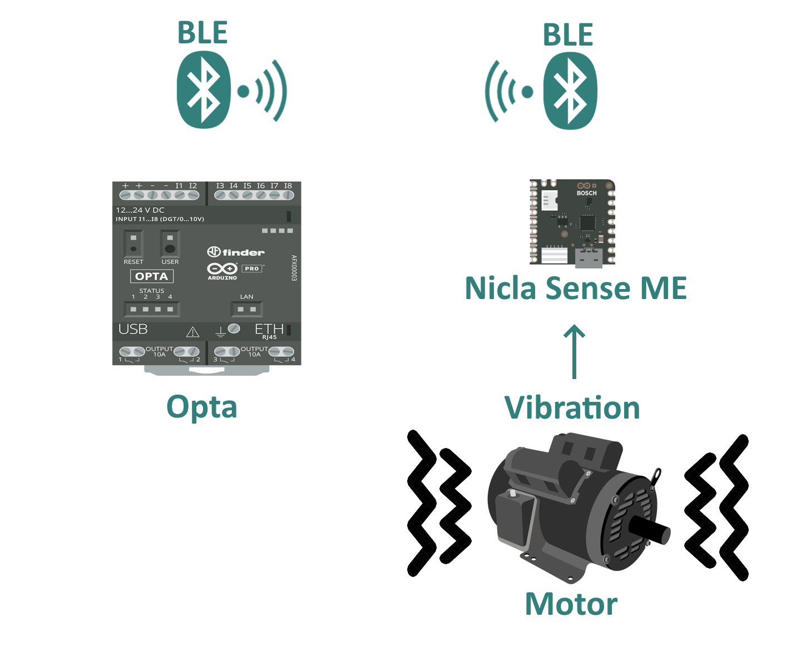

This application note introduces an innovative approach to motor anomaly detection by combining the power of the Arduino Nicla Sense ME, machine learning using the Edge Impulse platform, and the Arduino Opta™. The Nicla Sense ME, equipped with accelerometer sensor, captures vibration data directly from the motor. This data is wirelessly transmitted via Bluetooth BLE from the Nicla Sense ME to the Opta™, which then forwards it to the Edge Impulse platform. Using Edge Impulse's intuitive interface, a machine learning model is created, configured, and trained to detect anomalies by analyzing the collected data.

By deploying the trained model back to the Opta™, the system is capable of performing real-time motor monitoring, enabling interventions when abnormal motor behavior is detected. This approach not only enables early detection of potential motor issues but also minimizes unplanned downtime and ensures a seamless, data-driven maintenance workflow. The integration of advanced sensing, machine learning, and industrial-grade hardware makes this solution scalable and adaptable to a wide range of industrial applications. Whether for manufacturing, energy production, or other sectors reliant on motor-driven operations, this solution provides a robust tool for enhancing system reliability and efficiency, aligning seamlessly with the principles of Industry 4.0 by enabling smart, connected, and data-driven industrial environments.

**Target audience:** PLC programmers, Automation engineers, Industrial IoT engineers and Electrical engineers.

### Goals

The goal of this application note is to demonstrate a motor anomaly detection and monitoring system using a combination of the Arduino Nicla Sense ME, Opta™, and machine learning with the Edge Impulse platform. The project's objectives are the following:

- Capture motor vibration data using the onboard accelerometer sensor of the Nicla Sense ME.
- Transmit vibration data wirelessly via Bluetooth® Low Energy from the Nicla Sense ME to the Opta™.
- Forward the collected data from the Opta™ to the Edge Impulse platform for analysis and machine learning model development.
- Create, configure, and train a Machine Learning model in Edge Impulse platform to identify motor anomalies based on the collected data.
- Deploy the trained Machine Learning model to the Opta™ to enable real-time anomaly detection and predictive maintenance.
- Provide a scalable and efficient solution aligned with Industry 4.0 principles for smarter, data-driven industrial applications.

## Hardware and Software Requirements

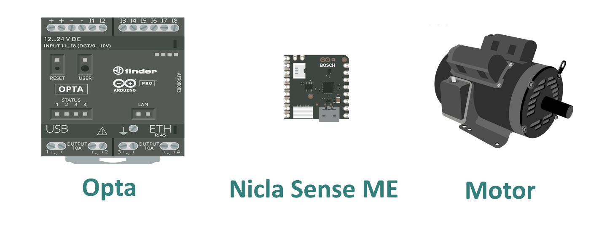

### Hardware Requirements

- [Arduino Opta™](https://store.arduino.cc/products/opta-wifi).
- [Arduino Nicla Sense ME](https://store.arduino.cc/products/nicla-sense-me?queryID=3c7201e519a8c8fc5b6c32a342879e88).
- 24 VDC Power Supply.
- 3.7 V LiPo battery.
- [USB Type-C® Cable](https://store.arduino.cc/products/usb-cable2in1-type-c).
- [USB Type-A/Micro Cable](https://store.arduino.cc/products/usb-2-0-cable-type-a-micro?queryID=24d4c7013937ee2a44100ee69986d54f).
- A motor.
- A computer with internet access

### Software Requirements

- [Arduino PLC IDE](https://docs.arduino.cc/software/plc-ide/)
- You must install the following libraries: `ArduinoBLE` and `Arduino_BHY2`. To install them using the Arduino IDE Library Manager, go to `Sketch` > `Include Library` > `Manage Libraries`, search for `ArduinoBLE`, and install it. Then, repeat the process to the `Arduino_BHY2` library.
- You will need an account on the Edge Impulse platform and to install the Edge Impulse® CLI. By clicking [here](https://docs.edgeimpulse.com/docs), you will be redirected to the `Getting Started` page, where you can follow the necessary step-by-step instructions.
- The [Arduino Nicla Sense ME Firmware](assets/Nicla_Opta_ML_Vibration_Anomaly_Detection.zip) to capture the data and send to the Opta™ via Bluetooth BLE.
- The [Arduino Opta™ Firmware](assets/Nicla_Opta_ML_Vibration_Anomaly_Detection.zip) to capture the vibration data sent by the Nicla Sense ME via Bluetooth BLE and transfer it to the Edge Impulse platform.
- The [Opta™ Deployment Firmware](assets/Nicla_Opta_ML_Vibration_Anomaly_Detection.zip) to enables real-time monitoring of the motor's condition.

> **Note:** The deployment code may not work for your motor, as it contains the machine learning algorithm trained specifically for the motor used in this application note.

### Machine Learning Model for Motor Anomaly Detection

Machine learning is a programming approach that enables devices to analyze raw sensor data, extract key features, and use them to recognize patterns or make predictions based on prior training. In this application note, machine learning is applied to identify motor anomalies by analyzing vibration data collected through the Nicla Sense ME.

To identify potential issues with the motor, a machine learning model was trained using the Edge Impulse platform. This model analyzes vibration patterns from the motor and predicts whether the motor is operating normally or exhibiting signs of anomalies.

First, the Nicla Sense ME was flashed with [Arduino Nicla Sense ME Firmware](assets/Nicla_Opta_ML_Vibration_Anomaly_Detection.zip) that collects and transmits vibration data to the Opta™ via Bluetooth BLE. Similarly, the Opta™ was flashed with [Arduino Opta™ Firmware](assets/Nicla_Opta_ML_Vibration_Anomaly_Detection.zip) designed to receive the vibration data from the Nicla Sense ME and forward it to the Edge Impulse platform for further processing.

To transmit the data collected on the Opta™, it is necessary to use the Edge Impulse CLI, which must have been previously installed and configured. Using the Data Forwarder, it is possible to send the data to the Edge Impulse platform. To learn how to use the Data Forwarder, click [here](https://docs.edgeimpulse.com/docs/tools/edge-impulse-cli/cli-data-forwarder).

Once the data was collected, we used Edge Impulse’s machine learning tools to design a machine learning model capable of identifying anomalies in motor vibrations. The trained model is then deployed back to the Opta™ to monitor motor health in real-time and detect anomalies as they occur.

Here is our model design:

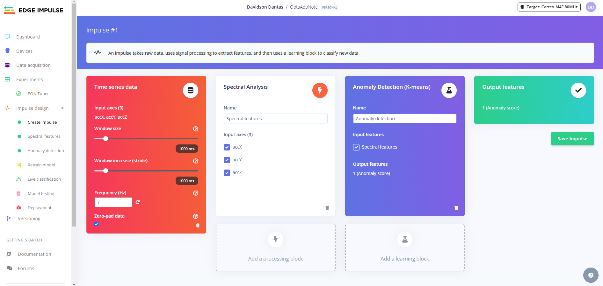

As the Nicla Sense ME communicates with the Opta™ via Bluetooth BLE, the following characteristics can be applied as an example to ensure compatibility with the onboard Bosch sensors:

In the time series data block:

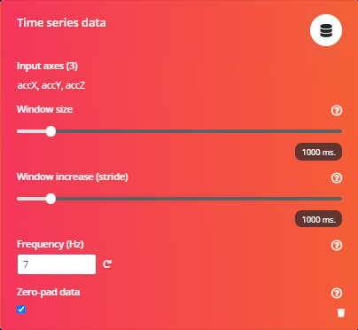

- **Window size**: 1000 ms
- **Window increase**: 1000 ms
- **Frequency**: 7 Hz

**Time series data** is critical in this application as it captures vibration measurements over consistent time intervals. The vibration data is composed of readings from the three accelerometers on the Nicla Sense ME, corresponding to the X, Y, and Z axes. By analyzing these three-dimensional vibration values, the machine learning model can more accurately detect how vibrations evolve over time, identify patterns, and pinpoint deviations indicative of motor anomalies.

In the spectral analysis block:

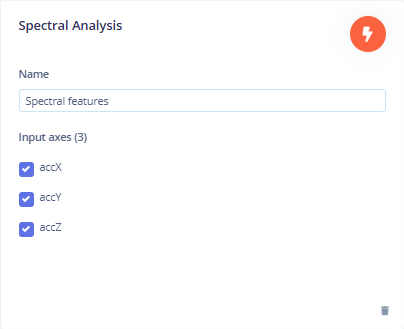

**Spectral Analysis** plays a crucial role in this application as it transforms raw vibration data into the frequency domain, uncovering patterns or anomalies that are not readily apparent in time-series data. By highlighting unique frequency components, this process significantly enhances the model's ability to detect motor issues, such as imbalance or misalignment, with improved precision.

In the K-means:

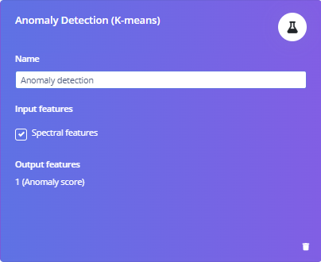

**Anomaly Detection (K-means)** is a key component of this application, enabling the system to differentiate between normal and abnormal motor behavior. By organizing the processed data into clusters based on shared characteristics, this method identifies deviations that signify potential anomalies. Specifically, the system separates the data into two clusters: one representing normal behavior and the other representing anomalous behavior. This approach effectively improves the system's capability to recognize unusual vibrations, which may indicate issues like wear, imbalance, or misalignment.

Here is our Spectral features:

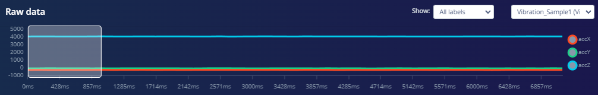

The "Raw Data" image shows a single vibration sample with acceleration data along three axes: accX (red), accY (green), and accZ (blue). The x-axis represents time in milliseconds, while the y-axis displays acceleration values. The accZ axis exhibits higher amplitude vibrations compared to accX and accY, which remain relatively flat, indicating minimal activity along those directions. This sample highlights raw sensor behavior, serving as a foundational step for identifying patterns or anomalies during further analysis.

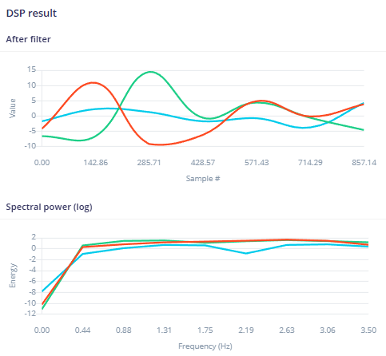

The "DSP Result" image shows the processed vibration data after applying digital signal processing (DSP). The "After Filter" graph illustrates the filtered time-series signals for the three axes: accX (red), accY (green), and accZ (blue), with the x-axis representing sample numbers and the y-axis showing the signal amplitude. These filtered signals are cleaned to remove noise, making them suitable for further analysis. The "Spectral Power (log)" graph displays the frequency-domain representation of the data, where the x-axis represents frequency (Hz) and the y-axis indicates the logarithmic power of each frequency component. Each colored line corresponds to an axis, emphasizing dominant frequency components. This step is essential for extracting features used in machine learning to identify motor anomalies effectively.

Here is our Anomaly Explorer:

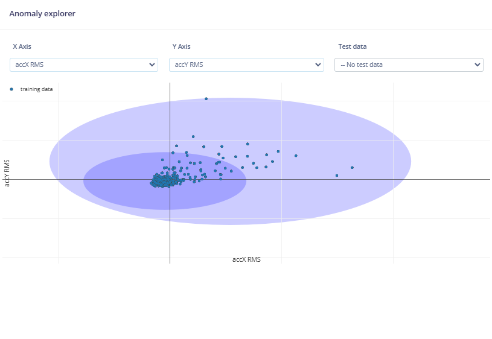

The "Anomaly Explorer" shows training data based on two features: "accX RMS" (Root Mean Square of acceleration along the X-axis) and "accY RMS" (along the Y-axis), which are related to vibration signals. The blue dots represent the training data, showing a central clustering pattern, while the two concentric ellipses define confidence regions: the inner ellipse encompasses most normal data, and the outer ellipse marks the threshold for anomalies. Data outside the outer ellipse would be flagged as anomalous, helping identify deviations from normal behavior. Currently, no test data is displayed, as indicated by the "No test data" selection.

> **Note**: It is important to note that the model’s performance may vary if implemented in an environment different from the one used for training. To ensure consistent results, it is recommended to gather new datasets from the specific deployment environment, retrain the model, and redeploy it for better adaptability.

For redeployment, use the Edge Impulse uploader to replace the existing model with the updated version, ensuring the system uses the most current model for anomaly detection.

## Anomaly Detection System Setup

This application does not require complex wiring for operation. However, the Nicla Sense ME and Opta™ must be connected to appropriate power supplies and positioned within the range of Bluetooth® Low Energy (BLE) to ensure communication. Additionally, the Opta™ needs to be connected to a computer via a USB-C cable, with the computer having internet access to transmit the data to the Edge Impulse platform.

The Nicla Sense ME will be mounted on the motor to accurately capture vibrations during its operational state. The collected vibration data is transmitted wirelessly via Bluetooth® Low Energy (BLE) to the Opta™, which then forwards the data to a computer. The computer, with an active internet connection, sends this data to the Edge Impulse platform. This process ensures that the vibration data from the Nicla Sense ME is effectively transmitted to the Edge Impulse platform, where it can be used to train the machine learning model created within the platform.

Deployment Setup:

- **Nicla Sense ME**: Positioned securely on the motor housing to measure vibration data and powered by a LiPo battery.
- **Opta™**: Installed within BLE communication range (a few meters) of the Nicla Sense ME. The Opta™ is powered via a 24 VDC power source.
- **Computer**: Ensures internet connectivity for transmitting data from the Opta™ to the Edge Impulse platform.

## Anomaly Detection System Overview

The Nicla Sense ME, mounted on the motor, serves as a sensor to capture vibration data during the motor's operation. These vibrations are monitored to detect anomalies that could indicate potential motor issues.

The vibration data is wirelessly transmitted via Bluetooth® Low Energy (BLE) to the Opta™, which acts as an intermediary, forwarding the data to a connected computer via a USB-C cable. The computer, with an active internet connection, uploads the data to the Edge Impulse platform, where the machine learning model processes and analyzes it to identify patterns indicative of anomalies.

Using the trained machine learning model, a code is generated to embed the model on the Opta™ for real-time motor monitoring. This code must be manually adapted to integrate with the Nicla Sense ME sensor, enabling it to receive vibration data via Bluetooth BLE. These adaptations are critical to ensure accurate real-time detection of motor anomalies.

### Nicla Sense ME Code

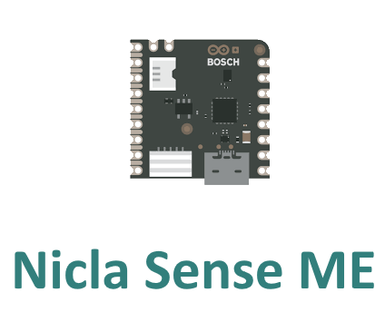

This is the initial code required for the setup. It runs on the Nicla Sense ME, configuring it to function as a Bluetooth Low Energy (BLE) peripheral. The code reads real-time accelerometer data from the X, Y, and Z axes and transmits it wirelessly to the Opta™, which operates as the BLE central device.

In this application note, key code sections will be explored to ensure the motor anomaly detection system becomes fully operational. The discussion will commence with a review of the necessary libraries:

- The `ArduinoBLE.h` enables Bluetooth® Low Energy (BLE) communication, allowing the Nicla Sense ME to transmit accelerometer data wirelessly to the Opta™. You can install this library by searching for it in the Library Manager within your Arduino IDE. For more details and documentation, visit the official [ArduinoBLE library documentation](https://docs.arduino.cc/libraries/arduinoble/).

- Additionally, `Arduino_BHY2.h` is included to interface with the Bosch BHY2 sensor hub integrated into the Nicla Sense ME, enabling the collection of accelerometer data (X, Y, and Z axes). You can install this library by searching for it in the Library Manager within your Arduino IDE. For more details and documentation, visit the official [Arduino_BHY2 library documentation](https://docs.arduino.cc/libraries/arduino_bhy2/).

The Bluetooth® Low Energy (BLE) services and characteristics are specifically configured to support the features of this application. The primary service is designed to handle the transmission of accelerometer data for monitoring motor anomalies, making it ideal for real-time vibration analysis. A characteristic is defined to send the accelerometer's X, Y, and Z-axis data, which correspond to the motor's vibration levels. These three data points are combined and transmitted together in a single buffer. Both the service and characteristic are assigned unique and standardized BLE UUIDs to ensure seamless interaction between the Nicla Sense ME and the Opta™.

The code bellow represents the first part of the Nicla Sense ME code, and it is responsible for sets up the Nicla Sense ME for Bluetooth® Low Energy (BLE) communication to transmit accelerometer data (X, Y, and Z axes) as a single 6-byte buffer (`bufferSize`). It uses the `ArduinoBLE` and `Arduino_BHY2` libraries to initialize BLE functionality and access the accelerometer sensor. A BLE service (`niclaService`) and characteristic (`sensorCharacteristic`) are defined with unique UUIDs, allowing the central device (Opta™) to recognize and read vibration data efficiently. Data is sent every 100 milliseconds.

The code can be downloaded [here](assets/Nicla_Opta_ML_Vibration_Anomaly_Detection.zip).

```arduino
#include <ArduinoBLE.h>   // Include the ArduinoBLE library for Bluetooth functionality
#include "Arduino_BHY2.h" // Include the library for working with the Bosch sensors

// Constants and Definitions
#define bufferSize 6  // Buffer size for accelerometer data

// BLE UUIDs
const char* deviceServiceUuid = "19b10000-e8f2-537e-4f6c-d104768a1214";  // Service UUID
const char* deviceServiceCharacteristicUuid = "19b10001-e8f2-537e-4f6c-d104768a1214";  // Characteristic UUID

// Accelerometer Sensor
SensorXYZ accel(SENSOR_ID_ACC);

// BLE Service and Characteristic
BLEService niclaService(deviceServiceUuid);
BLECharacteristic sensorCharacteristic(deviceServiceCharacteristicUuid, BLERead | BLEWrite, bufferSize);

// Timing Variables
const long interval = 100;         // Interval of 100ms between data transmissions
```

The code below represents the second part of the Nicla Sense ME code and is responsible for initializing the system components necessary for its functionality. This includes setting up Serial communication, initializing the sensor system (BHY2) to access the onboard accelerometer, and configuring Bluetooth® Low Energy (BLE) communication for data transmission.

Using the `ArduinoBLE` and `Arduino_BHY2` libraries, the code prepares the Nicla Sense ME to act as a BLE peripheral device. It initializes the BHY2 sensor system and the accelerometer to collect vibration data. Bluetooth functionality is then configured with a BLE service (`niclaService`) and a characteristic (`sensorCharacteristic`) that enable a central device, such as the Opta™, to connect and interact with the Nicla Sense ME. The BLE device name is set to `Nicla` making it easily recognizable during device discovery.

Once all components are initialized, the program starts advertising the BLE service, allowing the device to be discovered by a central device. This setup enables the Nicla Sense ME to transmit accelerometer data effectively in subsequent parts of the program. Debugging feedback is provided via Serial communication to inform the user of the system's status or any initialization issues.

```arduino
void setup() {
  // Initialize Serial Communication
  Serial.begin(115200);  // Set baud rate to 115200
  while (!Serial);       // Wait until the Serial monitor is opened

   // Initialize the BHY2 sensor system
  if (!BHY2.begin()) {
    Serial.println("Failed to initialize BHY2!");
    while (1);
  }

  // Initialize the accelerometer
  if (!accel.begin()) {
    Serial.println("Failed to initialize accelerometer!");
    while (1);
  }

  // Initialize Bluetooth communication
  if (!BLE.begin()) {
    Serial.println("Failed to start Bluetooth!");
    while (1);
  }

  // Set the Bluetooth device name
  BLE.setDeviceName("Nicla"); // Name of the BLE device (visible to central devices)

  // Configure BLE service and characteristics
  BLE.setAdvertisedService(niclaService);               // Set the BLE service to be advertised
  niclaService.addCharacteristic(sensorCharacteristic); // Add the characteristic to the service
  BLE.addService(niclaService);                         // Add the service to the BLE stack

  // Start Bluetooth advertising to make the device discoverable
  BLE.advertise();
  Serial.println("Bluetooth initialized and waiting for a connection...");
}
```

The code below represents the main loop of the Nicla Sense ME program and is responsible for managing the continuous operation of the system. This includes monitoring for Bluetooth® Low Energy (BLE) connections, retrieving data from the onboard accelerometer, and transmitting the data to a connected central device.

The program ensures that the Nicla Sense ME can maintain a BLE connection with a central device, such as the Opta™. It continuously checks if a central device is connected. Once a connection is established, the program enters a loop to regularly retrieve accelerometer data, update sensor values, and transmit the motion data to the connected device.

Accelerometer data from the X, Y, and Z axes is collected and stored in a 6-byte buffer (`data[]`). This buffer is then written to the BLE characteristic (`sensorCharacteristic`), making it available for the central device to read. The data is updated every 100 milliseconds, using a non-blocking timer to ensure consistent performance. Debugging information, including the accelerometer values and connection status, is printed to the Serial monitor.

If the BLE connection is lost, the program detects the disconnection and prints a message indicating the loss of the central device. The loop then continues to wait for a new central device connection, ensuring the system remains operational. This setup allows the Nicla Sense ME to function as a reliable BLE peripheral for real-time motion data transmission.

```arduino
void loop() {
  // Check if there is a Bluetooth connection
  BLEDevice central = BLE.central(); // Get the central device, if connected
  Serial.println("Searching for central device...");

  if(central) {
    // A central device is connected
    Serial.print("Connected to: ");
    Serial.println(central.address()); // Print the address of the central device
    
    while(central.connected()){
      static unsigned long lastUpdateTime = millis(); // Track the last update time
      BHY2.update(); // Update sensor data

      // Check if 100ms have passed since the last update
      if (millis() - lastUpdateTime >= interval) {
        lastUpdateTime = millis(); // Update the last update time

        byte data[bufferSize];  // Buffer for 6 bytes (X, Y, Z accelerometer data)

        // Retrieve accelerometer values
        int16_t accX = accel.x();
        int16_t accY = accel.y();
        int16_t accZ = accel.z();

        // Print accelerometer values to the Serial monitor for debugging
        Serial.print("Accelerometer X: ");
        Serial.print(accX);
        Serial.print(" Y: ");
        Serial.print(accY);
        Serial.print(" Z: ");
        Serial.println(accZ);

        // Copy accelerometer data into the buffer
        memcpy(data, &accX, sizeof(accX));     // Copy X-axis data
        memcpy(data + 2, &accY, sizeof(accY)); // Copy Y-axis data
        memcpy(data + 4, &accZ, sizeof(accZ)); // Copy Z-axis da

        // Write the buffer data to the BLE characteristic
        sensorCharacteristic.writeValue(data, sizeof(data));
      }
    }

    // If the connection is lost, print a message
    Serial.println("Disconnected from central device!");
  }

  delay(100); // Short delay to reduce loop frequency when not connected
}
```

###  Opta™ Code

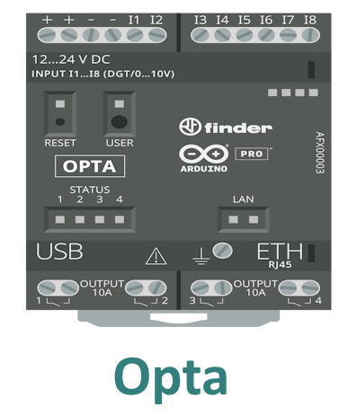

This code demonstrates the configuration of the Opta™ as a central Bluetooth Low Energy (BLE) device, designed to connect to the Nicla Sense ME, which functions as a BLE peripheral. The program scans for BLE devices advertising a specific service UUID, connects to the first matching peripheral, and retrieves accelerometer data from its X, Y, and Z axes. The data is transmitted in real-time using a BLE characteristic.

This code is a critical part of a motor anomaly detection system, enabling the Opta™ to receive vibration data wirelessly for further processing in the Edge Impulse Platform.

- Similar to its use in the Nicla Sense ME code, the `ArduinoBLE.h` library will be utilized to implement Bluetooth® Low Energy (BLE) communication. In this code, it enables the Opta™ to function as a BLE central device, capable of discovering and connecting to BLE peripherals like the Nicla Sense ME. To install this library, search for `ArduinoBLE` in the Arduino IDE Library Manager. For more information and detailed documentation, visit the official [ArduinoBLE library documentation](https://docs.arduino.cc/libraries/arduinoble/).

The code is configured to scan for a BLE peripheral that advertises a specific service UUID. Once connected, the Opta™ accesses a characteristic that provides accelerometer data from the peripheral. The accelerometer's X, Y, and Z data points are transmitted together in a single 6-byte buffer.

The first part of the code sets up the foundational elements for Bluetooth® Low Energy (BLE) communication and accelerometer data handling. It includes the `ArduinoBLE` library to enable BLE functionality and defines unique UUIDs for the service and characteristic used to identify the peripheral device. The code initializes constants, including the buffer size for accelerometer data, and configures the Serial communication interface to transmit data to the Edge Impulse platform.

The code can be downloaded [here](assets/Nicla_Opta_ML_Vibration_Anomaly_Detection.zip).

```arduino
#include <ArduinoBLE.h>  // Include the ArduinoBLE library for Bluetooth functionality

// Constants and Definitions
#define bufferSize 6  // Buffer size for accelerometer data

// UUIDs for the BLE service and characteristic
const char* serviceUuid = "19b10000-e8f2-537e-4f6c-d104768a1214";  // Service UUID
const char* characteristicUuid = "19b10001-e8f2-537e-4f6c-d104768a1214";  // Characteristic UUID

void setup() {
  // Initialize Serial Communication
  Serial.begin(115200);
  while (!Serial);

  // Initialize Bluetooth communication
  if (!BLE.begin()) {
    Serial.println("Failed to initialize Bluetooth!");
    while (1);
  }
}
```

The second part enable the Opta™ to function as a BLE central device for real-time data acquisition. The code begins by scanning for BLE peripherals advertising a specific service UUID, identifying compatible devices, such as the Nicla Sense ME. Once a peripheral is discovered, the Opta™ attempts to connect, retrieves its attributes, and accesses the defined BLE characteristic containing accelerometer data.

After establishing a connection, the code continuously reads accelerometer data from the X, Y, and Z axes, transmitted as a 6-byte buffer from the peripheral. The accelerometer values are parsed, processed, and sent via the Serial monitor, which is used by the Edge Impulse platform to acquire the data necessary for training the Machine Learning model. The data is sent with the accelerometer value for each axis followed by a comma (",") because this is the standard format for data transmission via serial in Edge Impulse. The protocol is straightforward: the device should send data at a baud rate of 115,200, with one line per reading, and individual sensor data separated by either a comma (",") or a TAB. If the connection is lost, the system handles the disconnection and restarts the scanning process to find another compatible device.

```arduino
void loop() {
  // Start scanning for BLE peripheral devices with the specified service UUID
  Serial.println("Scanning for BLE devices...");
  BLE.scanForUuid(serviceUuid);

  // Check if a peripheral device has been discovered
  BLEDevice peripheral = BLE.available();

  if (peripheral) {
    // Print information about the discovered peripheral
    Serial.print("Device found: ");
    Serial.println(peripheral.address());
    Serial.print("Name: ");
    Serial.println(peripheral.localName());

    // Stop scanning
    BLE.stopScan();
  }

  // Attempt to connect to the discovered peripheral
  if (peripheral.connect()) {
    Serial.println("Connected to peripheral device!");
  } else {
    Serial.println("Failed to connect to peripheral device!");
    return;
  }

  // Discover attributes of the connected peripheral
  Serial.println("Discovering peripheral device attributes...");
  if (peripheral.discoverAttributes()) {
    Serial.println("Peripheral device attributes discovered!");
  } else {
    Serial.println("Failed to discover peripheral attributes!");
    peripheral.disconnect();
    return;
  }

  // Access the service and characteristic from the connected peripheral
  BLEService niclaService = peripheral.service(serviceUuid);
  BLECharacteristic sensorCharacteristic = peripheral.characteristic(characteristicUuid);

  while (peripheral.connected()) {
    // Check if the characteristic can be read
    if (sensorCharacteristic.canRead()) {
      byte data[bufferSize];  // Array to store the 6 bytes of data received
      int16_t accX, accY, accZ; // Variables for accelerometer values

      // Read the characteristic value into the data array
      sensorCharacteristic.readValue(data, sizeof(data));

      // Parse the accelerometer data
      memcpy(&accX, data, sizeof(accX));     // X-axis
      memcpy(&accY, data + 2, sizeof(accY)); // Y-axis
      memcpy(&accZ, data + 4, sizeof(accZ)); // Z-axis
      
      // Print accelerometer data to the Serial monitor
      Serial.print(accX);
      Serial.print(",");
      Serial.print(accY);
      Serial.print(",");
      Serial.println(accZ);
    }

    delay(100); // Wait 100ms before the next read
  }

  // Handle disconnection from the peripheral
  Serial.println("Connection lost.");
  peripheral.disconnect();
  
  delay(500);
}
```
With both codes running — the Nicla Sense ME code functioning as a peripheral, sending accelerometer data via BLE, and the Opta™ code acting as a central device, receiving this data via BLE and transmitting the readings to the computer via serial communication over a USB connection — you need a computer with internet access to forward the data to the Edge Impulse platform. To do this, run the command `edge-impulse-data-forwarder` in the terminal. Once the program is running and the necessary configurations are selected, the computer will forward the data to the Edge Impulse platform. You can then access your project under the `Data Acquisition` tab to start collecting data samples. For more information, refer to the official [Edge Impulse documentation](https://docs.edgeimpulse.com/docs/tools/edge-impulse-cli/cli-data-forwarder).

###  Opta™ Deployment Code

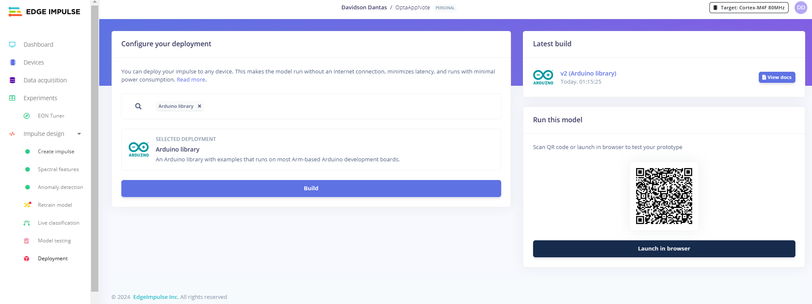

To deploy a trained Edge Impulse model, go to the `Deployment` tab in the Edge Impulse project, select `Arduino Library`, and click `Build` to generate the complete library. Download the generated library `Your_project_name.zip` file and import it into Arduino IDE by selecting `Sketch` > `Include Library` > Add `Your_project_name.ZIP` Library. This allows the model to run locally on the device without an internet connection, reducing latency, enhancing real-time performance, and minimizing power consumption. For more details, visit the [Edge Impulse documentation](https://docs.edgeimpulse.com/docs/run-inference/arduino-library#download-the-arduino-library).

After the deployment, it was possible to create the code that integrates Bluetooth Low Energy (BLE) functionality with Edge Impulse's machine learning inferencing framework to classify accelerometer data in real-time. It starts by initializing BLE communication and scanning for a specific peripheral device broadcasting a service with a known UUID. Once the device is found, it connects, discovers its attributes, and accesses a characteristic that provides accelerometer data. The code continuously reads 6 bytes of accelerometer data (representing the X, Y, and Z axes) from the BLE characteristic, processes it, and stores it in a buffer. This data is then transformed into a signal format compatible with Edge Impulse's inferencing engine. Using the pre-trained machine learning model deployed as a custom library generated by Edge Impulse's deployment feature, the code classifies accelerometer data, specifically vibration data, to detect anomalies. If the BLE connection is lost, the program automatically attempts to reconnect. Throughout the process, debug information and classification results are printed to the Serial monitor for real-time feedback.

The code is divided into four parts for better understanding, similar to what was done previously.

The first part of the code sets up the foundational elements for Bluetooth Low Energy (BLE) communication and machine learning inferencing using the `ArduinoBLE` library and the Edge Impulse generate library. It includes constants for defining the `BLE service` and `characteristic UUIDs`, which are used to identify and interact with a BLE peripheral device. The `bufferSize` is set to 6 to handle accelerometer data (X, Y, Z axes). Two key BLE variables are defined: `peripheral`, which represents the BLE device to connect to, and `sensorCharacteristic`, which represents the characteristic that provides accelerometer data. The `debug_nn` variable is used to toggle debug output for machine learning inferencing. The prototype of the function `connectToPeripheral()` is also declared, which is responsible for connecting to a BLE peripheral and initializing the characteristic.

```arduino
#include <ArduinoBLE.h>             // Include the ArduinoBLE library for Bluetooth functionality
#include <OptaAppNote_inferencing.h> // Include Edge Impulse inferencing library

// Constants and Definitions
#define bufferSize 6                // BLE buffer size for accelerometer data
const char* serviceUuid = "19b10000-e8f2-537e-4f6c-d104768a1214"; // Service UUID
const char* characteristicUuid = "19b10001-e8f2-537e-4f6c-d104768a1214"; // Characteristic UUID

// Private variables
static bool debug_nn = false;       // Set this to true to see debug info

// BLE variables
BLEDevice peripheral;               // BLE peripheral device object
BLECharacteristic sensorCharacteristic; // BLE characteristic object to interact with the peripheral

// Prototype of the function
bool connectToPeripheral();
```

The second part of the code, begins by establishing Serial communication at a baud rate of 115,200 and waits for the connection to ensure debugging output is displayed correctly. A message indicating the start of Edge Impulse inferencing is printed to the Serial monitor. The function then initializes the BLE stack using the `BLE.begin()` method, and if BLE fails to initialize, it halts execution and reports an error. Finally, it validates the Edge Impulse classifier configuration to ensure the raw sample frame matches the expected format of three axes (X, Y, Z). If the configuration is invalid, an error message is printed, and the function stops further execution.

```arduino
void setup() {
    Serial.begin(115200);           // Start Serial communication
    while (!Serial);                // Wait for the Serial connection (for debugging)

    Serial.println("Edge Impulse Inferencing with BLE Data");

    // Initialize BLE functionality
    if (!BLE.begin()) {
        Serial.println("Failed to initialize Bluetooth!");
        while (1);
    }

    // Ensure classifier configuration is valid
    if (EI_CLASSIFIER_RAW_SAMPLES_PER_FRAME != 3) {
        ei_printf("ERR: EI_CLASSIFIER_RAW_SAMPLES_PER_FRAME should be equal to 3 (the 3 sensor axes)\n");
        return;
    }

    Serial.println("Scanning for BLE devices...");
}
```

The third part of the code is responsible for managing the main operational loop, which includes maintaining the BLE connection, collecting accelerometer data, and performing machine learning inference. It begins by checking if the BLE peripheral is connected. If the connection is lost, the `connectToPeripheral()` function is called to re-establish the connection. If reconnection fails, the program pauses briefly and retries.

Once the connection is confirmed, the code introduces a 2-second delay to stabilize the process and prepare for data sampling. It then allocates a buffer to store accelerometer data and enters a loop to read data from the BLE characteristic. The accelerometer data is transmitted as a 6-byte buffer (X, Y, and Z axes), which is parsed and stored in the inference buffer. This raw data is also printed to the Serial monitor.

After the data is collected, it is converted into a signal format compatible with Edge Impulse's inferencing engine. The program then runs the classifier on the processed data using the pre-trained machine learning model. The classification results, including predictions and timing metrics, are printed to the Serial monitor. If anomaly detection is enabled, the anomaly score is also displayed. The loop ensures continuous data acquisition and inference, dynamically reconnecting to the BLE peripheral if necessary.

```arduino
void loop() {
    // Reconnect if the peripheral is disconnected
    if (!peripheral || !peripheral.connected()) {
        if (!connectToPeripheral()) {
            delay(500);
            return;
        }
    }

    ei_printf("\nStarting inferencing in 2 seconds...\n");
    delay(2000); // Delay for 2 seconds before starting

    ei_printf("Sampling BLE Data...\n");

    // Allocate a buffer for the inference input
    float buffer[EI_CLASSIFIER_DSP_INPUT_FRAME_SIZE] = { 0 };

    for (size_t ix = 0; ix < EI_CLASSIFIER_DSP_INPUT_FRAME_SIZE; ix += 3) {
        if (sensorCharacteristic.canRead()) {
            byte data[bufferSize]; // Temporary buffer for BLE data (6 bytes)
            int16_t accX, accY, accZ; // Variables to store accelerometer values

            // Read BLE characteristic value
            sensorCharacteristic.readValue(data, sizeof(data));

            // Extract accelerometer values (X, Y, Z) from the buffer
            memcpy(&accX, data, sizeof(accX));     // X-axis
            memcpy(&accY, data + 2, sizeof(accY)); // Y-axis
            memcpy(&accZ, data + 4, sizeof(accZ)); // Z-axis

            // Store the extracted values into the inference buffer
            buffer[ix + 0] = static_cast<float>(accX);
            buffer[ix + 1] = static_cast<float>(accY);
            buffer[ix + 2] = static_cast<float>(accZ);

            // Print the received data to the Serial monitor
            Serial.print("Received Data: ");
            Serial.print(accX);
            Serial.print(",");
            Serial.print(accY);
            Serial.print(",");
            Serial.println(accZ);
        }

        delay(10); // Simulate continuous sampling
    }

    // Convert the raw buffer into a signal for Edge Impulse inferencing
    signal_t signal;
    int err = numpy::signal_from_buffer(buffer, EI_CLASSIFIER_DSP_INPUT_FRAME_SIZE, &signal);
    if (err != 0) {
        ei_printf("Failed to create signal from buffer (%d)\n", err);
        return;
    }

    // Run the classifier on the collected data
    ei_impulse_result_t result = { 0 };
    err = run_classifier(&signal, &result, debug_nn);
    if (err != EI_IMPULSE_OK) {
        ei_printf("ERR: Failed to run classifier (%d)\n", err);
        return;
    }

    // Print classification results
    ei_printf("Predictions ");
    ei_printf("(DSP: %d ms., Classification: %d ms., Anomaly: %d ms.)",
        result.timing.dsp, result.timing.classification, result.timing.anomaly);
    ei_printf(": \n");
    for (size_t ix = 0; ix < EI_CLASSIFIER_LABEL_COUNT; ix++) {
        ei_printf("    %s: %.5f\n", result.classification[ix].label, result.classification[ix].value);
    }
#if EI_CLASSIFIER_HAS_ANOMALY == 1
    ei_printf("    anomaly score: %.3f\n", result.anomaly);
#endif
}

#if !defined(EI_CLASSIFIER_SENSOR) || EI_CLASSIFIER_SENSOR != EI_CLASSIFIER_SENSOR_ACCELEROMETER
#error "Invalid model for current sensor"
#endif
```

The fourth part of the code is the `connectToPeripheral()`, a function responsible for connecting to a BLE peripheral device and initializing the characteristic that provides accelerometer data. It scans for devices advertising the specified service UUID, retrieves and prints the device's address and name, and attempts to connect. If the connection or attribute discovery fails, the function disconnects and retries. Once connected, it accesses the service and characteristic using predefined UUIDs and verifies their availability. If successful, it returns true, indicating the peripheral is ready for data acquisition, otherwise, it returns false.

```arduino
// Connect to a BLE peripheral and initialize the characteristic
bool connectToPeripheral() {
    // Start scanning for BLE devices advertising the specified service UUID
    BLE.scanForUuid(serviceUuid);
    peripheral = BLE.available(); // Get the first discovered peripheral

    if (!peripheral) {
        Serial.println("No BLE device found. Retrying...");
        delay(1000); // Retry after 1 second
        return false;
    }

    // Print peripheral information
    Serial.print("Device found: ");
    Serial.println(peripheral.address());
    Serial.print("Name: ");
    Serial.println(peripheral.localName());

    // Stop scanning and connect
    BLE.stopScan();
    if (!peripheral.connect()) {
        Serial.println("Failed to connect to peripheral device!");
        return false;
    }

    Serial.println("Connected to peripheral device!");

    // Discover attributes
    if (!peripheral.discoverAttributes()) {
        Serial.println("Failed to discover peripheral attributes!");
        peripheral.disconnect();
        return false;
    }

    // Access service and characteristic
    BLEService niclaService = peripheral.service(serviceUuid);
    sensorCharacteristic = niclaService.characteristic(characteristicUuid);

    // Check if the characteristic is available
    if (!sensorCharacteristic) {
        Serial.println("Characteristic not found!");
        peripheral.disconnect();
        return false;
    }

    Serial.println("Characteristic found!");
    return true;
}
```

## Full Motor Anomaly Detection Example

All the necessary files to replicate this application notes can be found below:

- You can download a compressed file containing all the necessary codes [here](assets/Nicla_Opta_ML_Vibration_Anomaly_Detection.zip). This file contains the following codes: Nicla Sense ME Firmware, Opta™ Firmware, and Opta™ Deployment Firmware.
- **Nicla Sense ME Firmware:** This code configures the Nicla Sense ME as a BLE peripheral to collect vibration data from the motor and transmit it wirelessly via Bluetooth® Low Energy (BLE).
- **Opta™ Firmware:** This code sets up the Opta™ as a BLE central device to receive vibration data from the Nicla Sense ME and forward it to the connected computer via serial communication.
- **Opta™ Deployment Firmware:** This code embeds the trained machine learning model into the Opta™ for real-time motor anomaly detection, allowing it to process vibration data and identify anomalies locally.
- The Machine Learning Tools project is public [here](https://studio.edgeimpulse.com/public/580971/live) so you can clone it and modify it to adapt it to your needs by improving the dataset or model architecture for a custom deployment.

## Conclusion

In this application note, we explored the implementation of a Machine Learning-based project powered by Edge Impulse and Arduino tools, leveraging the Nicla Sense ME and the Opta™. This application serves as a practical demonstration of how the Arduino ecosystem simplifies the development of intelligent solutions for real-world challenges. By integrating powerful algorithms with an accessible workflow, users can create robust systems with minimal complexity.

Our example focused on motor anomaly detection, covering key functionalities such as accelerometer data acquisition, Bluetooth® Low Energy communication, and integration with the Edge Impulse platform for training and deploying a Machine Learning model. Additionally, we demonstrated how to use the Edge Impulse Data Forwarder to send sensor readings for real-time monitoring and model refinement, showcasing the potential of Arduino's environment to enable smart industrial applications.

### Next Steps

Now that you’ve learned how to develop a Motor Anomaly Detection system with Machine Learning, the Nicla Sense ME and the Opta™, it’s time to further explore the full potential of the Arduino Pro ecosystem. By integrating these tools into your professional setup, you can create powerful and intelligent solutions to enhance efficiency and reliability.

You can expand your application by training your own Machine Learning model with vibration data from various motor conditions or by utilizing additional sensors on the Nicla Sense ME, such as temperature sensors, for comprehensive environmental monitoring and motor health evaluation. With these tools, you can transform your existing manufacturing setup into a smarter, more proactive system tailored to your needs.