## Introduction

Packaging and labeling are essential processes in the production and distribution of products. Packaging involves enclosing and protecting items to ensure they remain safe from damage, contamination, or spoilage during storage and transport. It also improves the manageability of the product, making it easier to handle, store, and transport. Additionally, packaging enhances presentation, playing a key role in maintaining product quality and meeting safety standards.

Labeling complements this by providing crucial information such as barcodes, expiration dates and usage instructions. This ensures proper handling, traceability, and compliance with regulations. Together, packaging and labeling are critical for product identification, handling, safety, and customer satisfaction across industries.

Many industries rely heavily on packaging and labeling systems. In food and beverage, packaging keeps items fresh, while labels provide important details like nutritional information and expiration dates. In the pharmaceutical industry, precise labeling is crucial for dosage instructions and regulatory compliance. In electronics and e-commerce, packaging protects fragile items, and labels ensure accurate shipping and traceability. By integrating remote control and monitoring into packaging and labeling systems, industries can significantly enhance control over their production processes. 

Using Opta™ with Arduino Cloud, we can create an advanced, automated system that is fully remotely controlled. The Arduino Cloud dashboard provides a user-friendly interface, displaying all key metrics in real-time. This setup allows operators to monitor data and control machinery remotely, enabling them to track efficiency and address potential issues before they escalate, ensuring the system meets the demands of modern manufacturing.

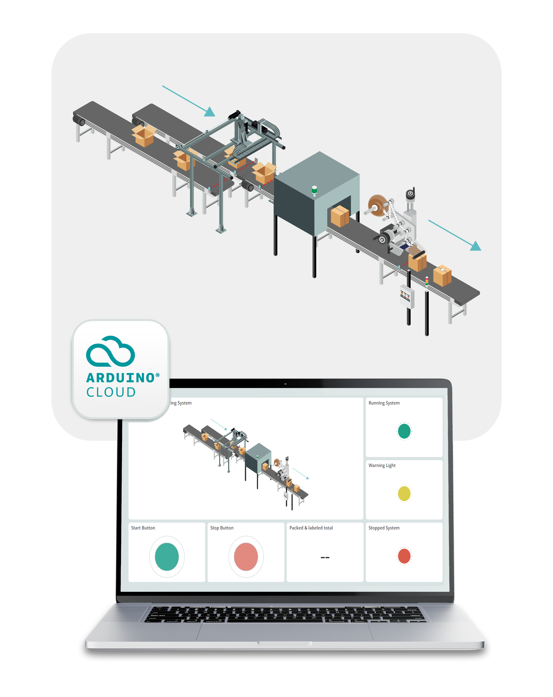

Thanks to the use of Opta™, this solution will be cost-effective while offering remote access for monitoring and controlling the status of key elements within the application. Additionally, the system can be fully customized to meet specific needs, allowing us to design it exactly the way we want.

**Target audience:** PLC programmers, Automation engineers, Industrial IoT engineers and Electrical engineers.

### Goals

Our goal with this application is to showcase the capabilities of Opta™ in controlling a packaging and labeling system, while providing real-time remote monitoring and control. The specific goals are as follows:

- Create a ladder diagram program to manage the packaging and labeling process.
- Showcase the use of the Modbus RTU protocol with the RS-485 interface on the Opta.
- Monitor the status of all systems involved.
- Track key metrics, such as system state.
- Control the entire system, allowing it to be started and stopped remotely.
- Develop a real-time Arduino Cloud dashboard to keep users informed with synchronized data.

## Hardware and Software Requirements


### Hardware Requirements

- [Opta™ WiFi](https://store.arduino.cc/products/opta-wifi) (x1)
- [Arduino Pro Opta Ext A0602](https://store.arduino.cc/products/opta-ext-a0602?srsltid=AfmBOoqr2e45Yp2GgU1lytuJLGE8CK399uocy5RmOJqEDBh1B2xi_j4e) (x1)
- 24 VDC Power Supply (x1)
- Photoeletric Sensor (x4)
- Green normally open push button (1x)
- Red normally closed push button (1x)
- Power Relay 24 V (x4)
- Industrial Indicator Tower (1x)
- Conveyor belt (3x)
- Carton Closing Machine (1x)
- Servodriver compatible with Modbus RTU over RS485 (x3)
- Servomotor compatible with the selected servodriver (x3)
- Labeling machine (1x)
- 14 AWG Wiring Cable
- [USB Type-C® Cable](https://store.arduino.cc/products/usb-cable2in1-type-c) (x1)

### Software Requirements

- [Arduino PLC IDE](https://docs.arduino.cc/software/plc-ide/)
- [Arduino Cloud Editor](https://create.arduino.cc/editor)
- [Packaging and Labeling Systems PLC Program](assets/Packaging_and_labeling.zip)
- The [Arduino Create Agent](https://cloud.arduino.cc/download-agent/) to provision the Opta WiFi on the Arduino Cloud.
- The [Arduino Cloud](https://cloud.arduino.cc/). If you do not have an account, you can create one for free inside [cloud.arduino.cc](https://cloud.arduino.cc/home/?get-started=true).

### Recommended Skills

- **Electrical knowledge:** Understanding wiring, safety protocols and interfaces like RS-485.
- **Programming:** Knowledge in ladder logic, Modbus RTU communication and Arduino sketches.
- **Technical documentation:** Ability to read schematics and system manuals.
- **Hands-on experience:** Experience with tools and setting up industrial systems.
- **Cloud integration:** Familiarity with Arduino Cloud for remote monitoring and control.

## Packaging and Labeling System Setup

In this section, an overview of the packaging and labeling system connections will be presented. To ensure clarity, the electrical connections are displayed in separate diagrams for easier understanding.

The following is an overview of the system’s inputs, outputs and Modbus connections:

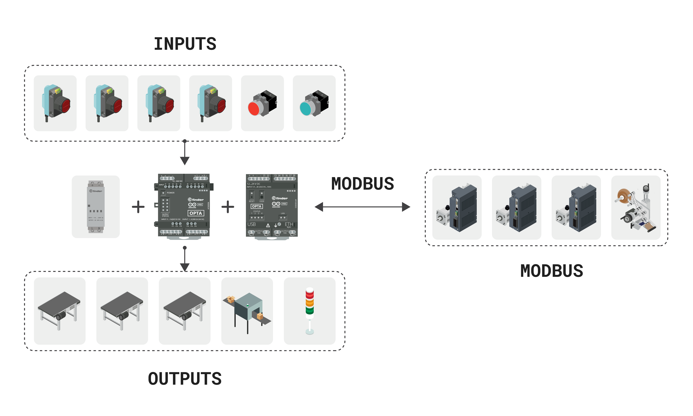

The diagram below provides a summary of the connections for the packaging and labeling:

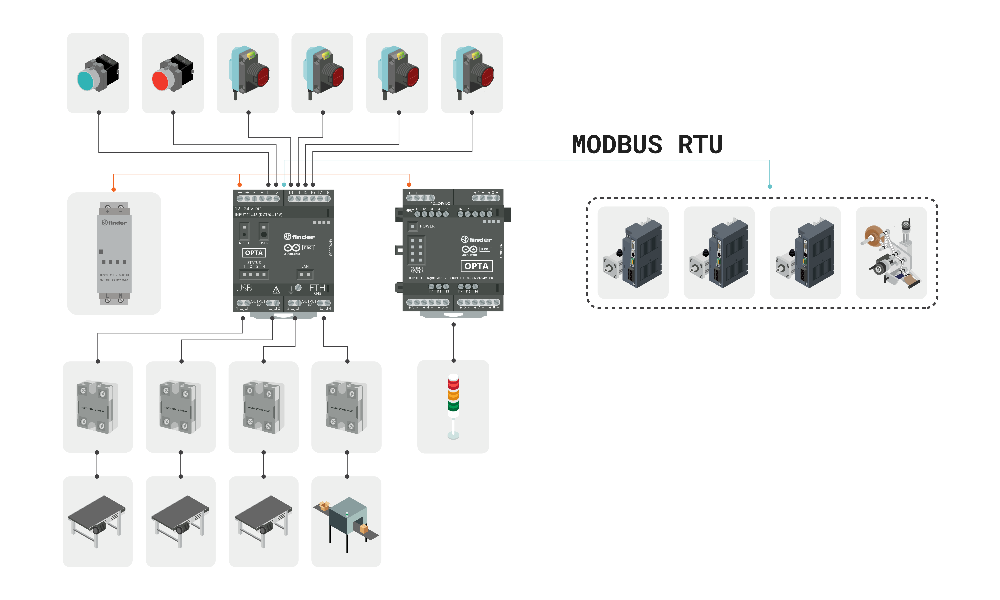

The diagram above illustrates all the equipment connected to the Opta. Both the Opta and its expansion module are powered by a 24V DC source. In the PLC input section, the connections for the start and stop push buttons, along with the four photoelectric sensors, are shown.

On the output side, there are connections to four relays that control the three conveyor belts and the box-closing machine. It’s important to note that the motors and the box-closing machine are not directly connected to the Opta outputs, as these outputs cannot supply the required current. Instead, the Opta controls the relays, which safely handle the current and voltage necessary to operate the motors and box-closing machine, protecting the PLC from overloads and potential damage. The outputs of the Opta expansion module are connected to the industrial indicator tower.

Additionally, the Opta is connected via Modbus RTU to three servo drives and a labeling machine.

To ensure proper operation, the Opta and its expansion module require a stable power source. The Opta will be powered by an external 24 VDC power supply, which should be connected to the screw terminals labeled `+` and `-` respectively. The same applies to the Opta expansion module. This setup ensures that both devices receive the necessary voltage for consistent and reliable performance.


We will utilize three servo drives to construct the Cartesian robot responsible for capturing items and placing them into their respective boxes. To facilitate this process, the servo drives will be connected to the Opta PLC via Modbus RTU, using the RS-485 communication interface. The diagram below illustrates the connection setup for the servo drives.

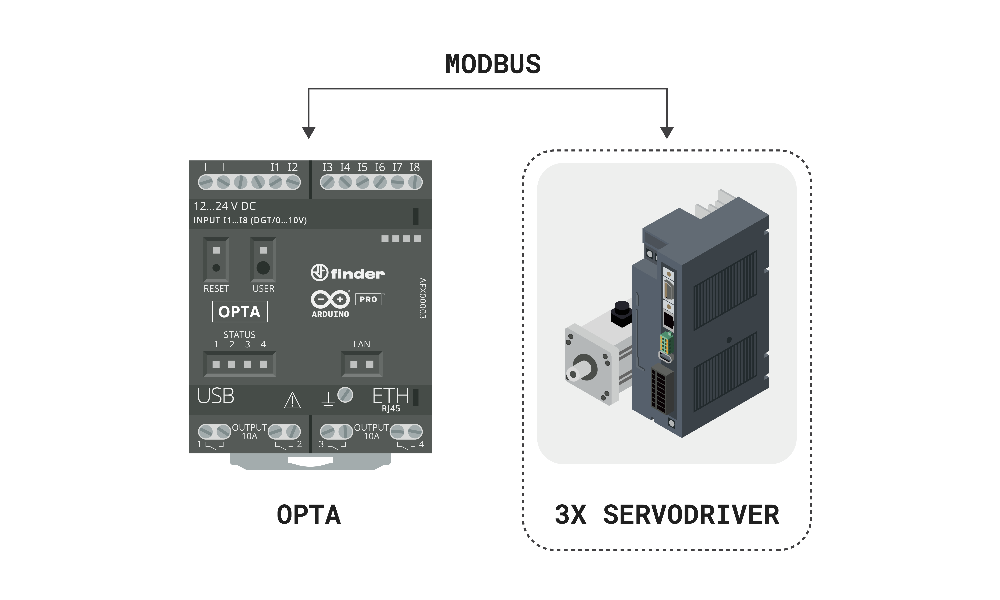

The same approach will be applied to the labeling machine. We will use Modbus RTU with the RS-485 interface to control the machine responsible for labeling the materials. The diagram below illustrates this connection.

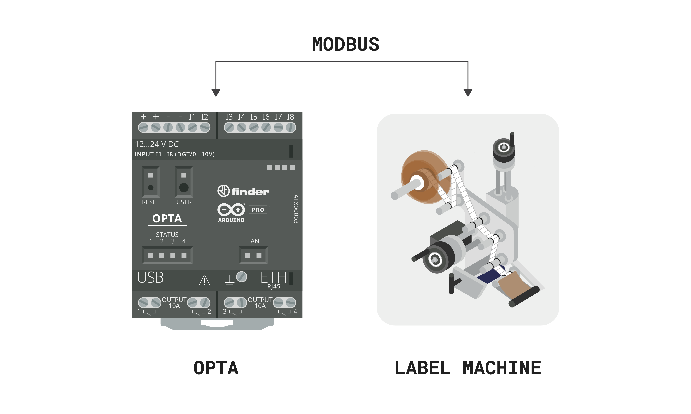


Next, we have the connections for the start and stop buttons. The start button, connected to `I1`, is configured as normally open (NO), meaning it activates the circuit when pressed. The stop button, connected to `I2`, is configured as normally closed (NC), meaning it deactivates the circuit when pressed.

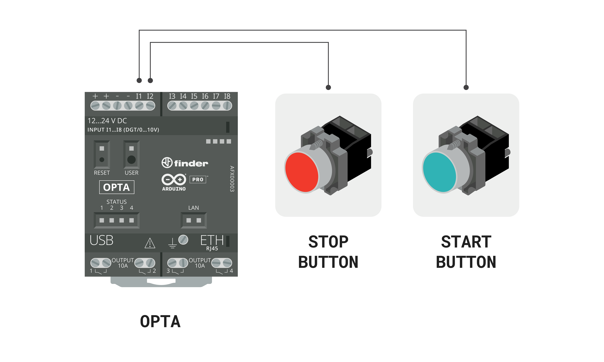

The four photoelectric sensors are connected to inputs `I3`, `I4`, `I5`, and `I6` respectively. Each input is linked to a corresponding output of the photoelectric sensor, which operates in a binary (on/off) manner. The sensor connected to `I3` detects objects in the pick area, while the sensor connected to `I4` detects open boxes in the packaging area. The sensor connected to `I5` detects boxes at the entry of the carton closing machine, and the last photoelectric sensor, connected to `I6`, detects boxes at the entry of the labeling machine. Each output will be either active (on) or inactive (off), depending on whether the sensor detects an object within its detection range.


The Opta's outputs are connected to relays that safely manage the current and voltage required to operate the motors and the box closing machine, preventing any potential damage to the Opta’s outputs. Output `O1` is linked to the relay controlling the motor of the input conveyor, while output `O2` is connected to the relay responsible for driving the motor of the packaging conveyor. Output `O3` is connected to the relay that controls the motor for the box closing and labeling conveyor. Finally, output `O4` controls the relay for the actuator that closes the open box in the carton closing machine.


The expansion module will be responsible for controlling the indicator tower. We will use the third to fifth outputs to ensure the wires are positioned at the bottom of the expansion module, facilitating the assembly of the electrical circuit. Output `O3` in the expansion module will activate the green light, `O4` will control the yellow light, and `O5` will be responsible for the red light.

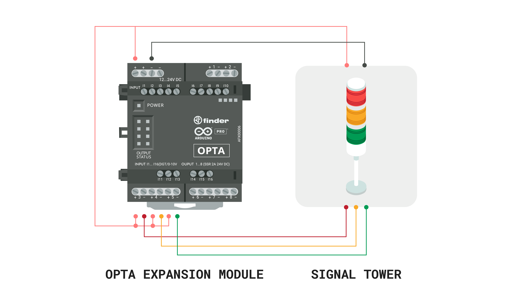

***The wiring connections shown above are displayed separately for easier comprehension, but all of them are simultaneously connected to the Opta.***

## Packaging and Labeling Overview

The system is designed to receive an item on a feed conveyor, pick it up using an XYZ Cartesian robot controlled by three servo drives with Modbus RTU communication, and place it into an open box on a separate conveyor. Once the item is placed in the box, the conveyor will briefly activate to transfer the open box with the item inside to the next conveyor. There, the box will pass through a machine responsible for closing and sealing it. Following this, the box will move to another machine, also controlled via Modbus RTU, which will label the box to ensure that essential product information is included. Finally, the closed and labeled box will proceed to the next stages in the industrial process.

The image below illustrates the entire packaging and labeling system, as well as all the hardware used and its positioning within the entire system.


The Opta will be responsible for controlling the entire packaging and labeling system. It will execute control logic to read inputs, activate outputs, and perform read and write operations on other devices through the RS-485 interface using the Modbus RTU protocol. It will also provide system status and variable data in real-time to the Arduino Cloud, using a Wi-Fi® connection.

In order for this to be possible, we will create all the programming logic for the system's operation in a ladder diagram and the connectivity part with Arduino Cloud through code in Arduino Sketch. Both programs will run simultaneously on the Opta. But before discussing the ladder and Arduino programs, we first need to explain the operation of the entire packaging and labeling system.

The system is activated when the 'Start' button is pressed, and the first task it performs is the 'Home' operation for the XYZ Cartesian robot. This 'Home' operation moves the robot to a predefined starting position, establishing a reliable reference point for all subsequent tasks. This step is essential for maintaining accuracy and consistency in the robot's movements, as it prevents positioning errors over time. The robot achieves this by moving each axis (X, Y, and Z) to specific positions detected by sensors or fixed limits, which calibrates it for precise operations. This process ensures that the XYZ Cartesian robot is properly calibrated and ready for accurate performance.

After the home operation is completed, the system initiates the operation of both feeder conveyor belts: one for the object to be packed and the other for the packaging box. The first conveyor belt transports the object to the picking area, while the second belt brings an open box to the packaging area. In both cases, the items move along the belts until their respective presence sensors are activated, indicating that the object is in the picking area and the box is in the packaging area. In this way, both conveyor belts are halted while waiting for the pick-and-place operation.

Once the open box and the item to be packed are in position, the XYZ Cartesian robot performs a pick-and-place operation to transfer the item into the box. This robot consists of three servodrivers, each controlling a servomotor that drives one of the X, Y, or Z axes. The Opta controller manages these servodrivers individually via RS-485 Modbus RTU communication, using read-and-write commands on their Modbus map registers. This setup allows the Opta to precisely control each axis independently, guiding the robot through the necessary movements to execute the pick-and-place task accurately. After the operation, the item is securely placed inside the open box.

Now, the conveyor belt carrying the open box with the item inside briefly moves forward to transfer the box to the next conveyor belt. The open box with the item will now be closed in the box-closing machine. The conveyor transports it until a sensor in the box-closing machine detects the presence of the open box. At this point, the Opta activates an actuator responsible for closing and sealing the box. With the item now safely packed, the conveyor belt moves the package to the labeling machine.

The package's arrival in the labeling area is detected by a presence sensor. Upon detection, the Opta sends a command via RS-485 Modbus RTU communication to activate the labeling machine. The machine then accurately applies a label to the package, detailing essential information about the item inside. With the labeling complete, the package moves forward to undergo further processing in another area of the facility, outside of the packaging and labeling process.

In essence, this outlines the complete process of the packaging and labeling system. The Opta manages each step and simultaneously functions as a gateway, transmitting real-time data to the Arduino Cloud. This way, you can monitor and control your system in real time.

### Sensors Deployment

- The **Photoeletric Sensor** this sensor will be responsible for detecting the presence of the item to be packaged and the box. Four of these sensors will be used, located on the two feeder conveyors: one responsible for bringing the open box and the other for bringing the item to be packaged. Another sensor will be placed in front of the carton closing machine to indicate that there is a box ready to be sealed, and the last one will be located in front of the labeling machine, indicating that the package is ready to receive its label.

### Actuators Deployment

- The **Conveyor belt** is used to drive the package. Three conveyors will be used. Two conveyors are responsible for feeding the system, bringing the item to be packaged and the box that will hold the item, while the third conveyor is responsible for moving the open package to be closed by the carton closing machine and labeled by the labeling machine. All conveyors will be controlled via a Solid State Relay, which is used to activate loads that are not supported by the PLC output. This way, the PLC can control equipment requiring a higher load capacity.

- The **Modbus Servodriver** is used to create the XYZ Cartesian robot, which will be used for picking up the item and placing it inside the box. These servo drivers will be controlled via Modbus RTU.

- The **Carton Closing Machine** is used to close and seal the open box containing the item. It will be controlled by a solid-state relay connected to an output from the Opta, which will act on an electromechanical actuator responsible for performing the closing and sealing operation.

- The **Labelling Machine** is used to label the package. It will be responsible for applying a label that contains crucial information about the package, and it will be controlled via Modbus RTU.

- The **Industrial Indicator Tower** is used to visually display the operating status of the system. It has three lights: the green light indicates that the system is operating correctly, the yellow light indicates that the system is on but not operating, and the red light indicates a fault or error in system operation.

## Step-by-Step Guide for System Operation

**System start**
- **Action:** Press the Start button.
- **Description:** The system is activated, starting the homing process of the XYZ Cartesian robot.

**Homing process**
- **Action:** The axes of the XYZ Cartesian robot begin the homing operation.
- **Description:** Each axis of the system will move to the Home position. This is done to ensure accurate positioning and repeatable movements throughout its operations.

**Activation of the feeder conveyors**
- **Action:** The conveyors responsible for bringing the item and the box are activated simultaneously.
- **Description:** The two conveyors are activated to bring the box and the item to a specific position, thus ensuring that the operation of picking up the item and placing it inside the box can begin.

**Pick and place operation**
- **Action:** Pick up the item and place it inside the open box.
- **Description:** When the presence sensors detect that both the item and the open box are in position, the pick-and-place operation begins. This operation is carried out by activating the three servo drivers working together to move to the item's location, pick it up, and transport it to place it inside the open box.

**Brief activation of the box feeder conveyor**
- **Action:** The conveyor containing the box with the item inside is momentarily activated.
- **Description:** The brief activation of the conveyor containing the item is done to ensure that the package reaches the next conveyor in the system.

**Carton closing machine**
- **Action:** The open box will be closed and sealed in this process.
- **Description:** After the brief activation period of the box feeder conveyor, the open box containing the item is now on the closing and labeling conveyor, which is activated to move the box to the carton closing machine. The presence of this open package is detected by a photoelectric sensor, which triggers the carton closing machine to carry out the process of closing and sealing the package.

**Labeling machine**
- **Action:** The labeling process of the sealed package will be carried out.
- **Description:** After the package is closed and sealed by the carton closing machine, the closing and labeling conveyor remains activated and moves the now-sealed package to the labeling area. Upon arrival in this area, a photoelectric sensor detects the package, triggering the labeling machine, which is activated to label the closed package. The package, now closed and labeled, continues along the closing and labeling conveyor to be handled in other factory processes.

**System Stop**
- **Action:** Press the stop button.
- **Description:** The system is stopped, stopping all operations and deactivating the conveyors and actuator. This operation can be performed at any time.

**Remote Monitoring and Control**
- **Action:** Monitor and control the system via the Arduino Cloud.
- **Description:**  At any time, you can check the operating status and control the system remotely using the Arduino Cloud interface.

## Opta Ladder Diagram

After understanding the step-by-step operation of the system, the ladder diagram below was created to represent the entire logic of the packaging and labeling system, and to make it easier to understand, it has been divided and explained separately. You can download the complete Arduino PLC IDE project [here](assets/Packaging_and_labeling.zip).

In the `Project` tab of the Arduino PLC IDE, you will find the section where the ladder diagram is written and managed. This is the workspace where you can create and edit the logic for your project using ladder diagrams. By clicking on `Cycle` within this tab, you'll access the area dedicated to building the ladder logic. However, you will only see the `Cycle` option if you have previously downloaded the Arduino PLC IDE project and opened it using the Arduino PLC IDE. The screenshot below will help you visually locate this section, making it easier to understand where the ladder diagram will be developed within the software.


However, if you haven't previously downloaded the Arduino PLC IDE project and opened it, but instead this is a new project, you will need to create a new program for the ladder diagram. To do this, go to the `Project` tab at the top of the software, select `New object`, and then click on `New program`. A pop-up window will appear where you can choose the `LD` option for Ladder Diagram. After selecting `LD`, give your program a name and assign a `Task` to it. This will create a new ladder diagram in your project. The screenshot below will help you visually locate these options, making it easier to navigate within the software.


**Mapping the Inputs and Outputs**

In the Arduino PLC IDE, it is important to associate the physical inputs and outputs of the PLC with variables that will be used throughout your program. This way, the associated variables will represent the states of the inputs and control the outputs.

To do this, go to the `Resources` tab, then to `Local I/O Mapping`, and select `Programmable Inputs` or `Relay Outputs` to associate inputs and outputs, respectively.

In the previous section, `Conveyor and Sorting System Setup`, the physical connections of the input elements were shown. With this in mind, we have the following:
- `I1`: Associated with the variable `colorRedSensor`, which will indicate when the RGB color sensor detects the color red.
- `I2`: Associated with the variable `colorGreenSensor`, which will indicate when the RGB color sensor detects the color green.
- `I3`: Associated with the variable `colorBlueSensor`, which will indicate when the RGB color sensor detects the color blue.
- `I4`: Associated with the variable `photoeletricRedSensor`, which will indicate when the photoelectric sensor detects the presence of the red-colored object.
- `I5`: Associated with the variable `photoeletricGreenSensor`, which will indicate when the photoelectric sensor detects the presence of the green-colored object.
- `I6`: Associated with the variable `photoeletricBlueSensor`, which will indicate when the photoelectric sensor detects the presence of the blue-colored object.
- `I7`: Associated with the variable `startButton`, which will detect the state of the start push button.
- `I8`: Associated with the variable `stopButton`, which will detect the state of the stop push button.

All input variables are of the boolean type, capable of taking the values 'True' or 'False'.

The image below illustrates the association between the physical input elements and the respective variables that will be used in the program.

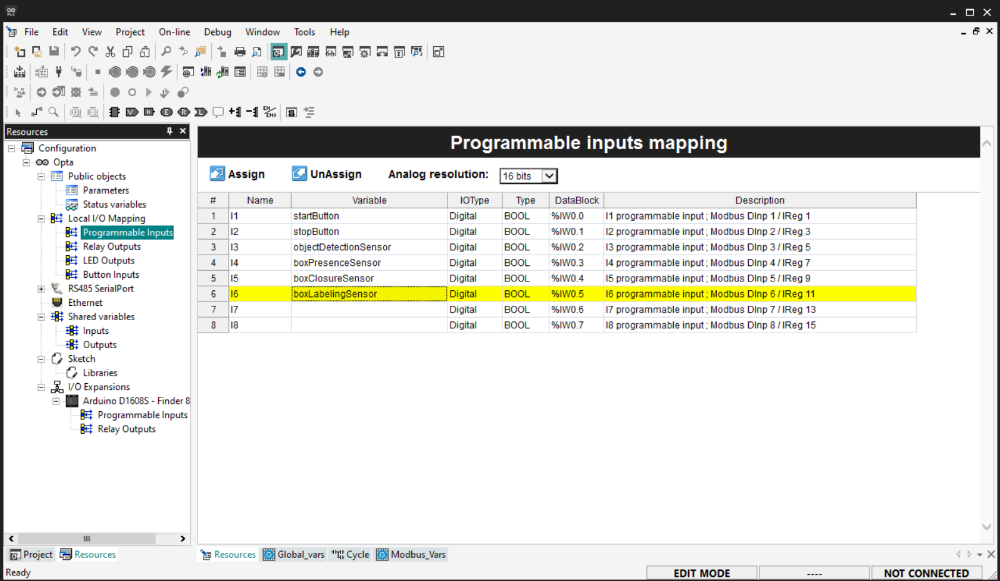

Now, for the outputs, we have the following configuration:
- `O1`: Associated with the variable `entryConveyor`, which is responsible for activating the relay that will operate the entry conveyor motor.
- `O2`: Associated with the variable `sortingConveyor`, which is responsible for activating the relay that will operate the sorting conveyor motor.
- `O3`: Associated with the variable `greenSortingActuator`, which is responsible for activating the relay that will trigger the sorting actuator for green-colored objects.
- `O4`: Associated with the variable `blueSortingActuator`, which is responsible for activating the relay that will trigger the sorting actuator for blue-colored objects.

The image below illustrates the association between the physical outputs and the variables.

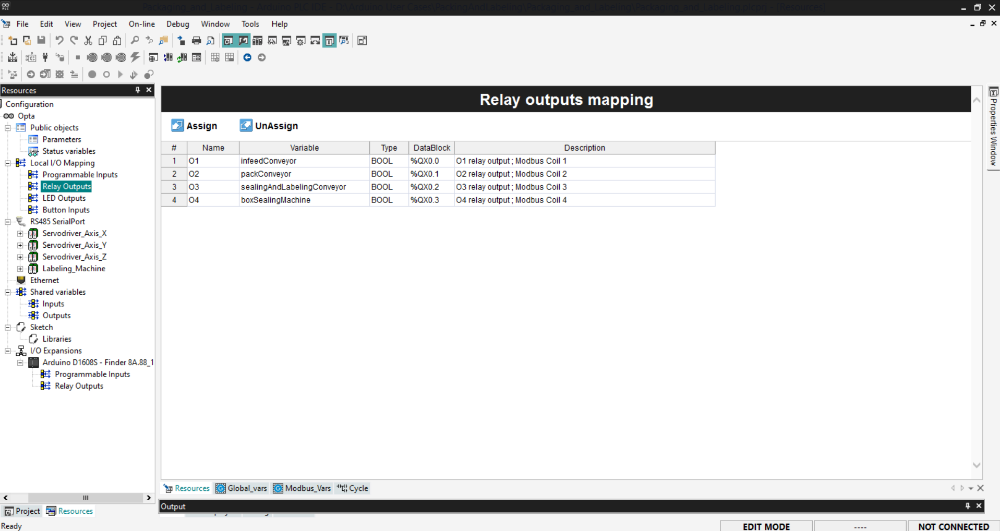

**Step-by-Step Ladder Logic Breakdown:**

The **Rung 01**

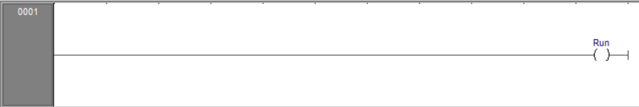

- `in_cloudStartButton`: This input represents a start button signal from the Arduino Cloud. When this input is active (high), it indicates that the start command has been issued from the cloud.
- `startButton`: This input represents a physical start button. When pressed, this input becomes active (high), indicating that the start command has been given physically.
- `startSystem`: This is a coil (output) that gets activated when the system should start. When this output is active (high), it indicates that the system is in the starting state.
- `out_cloudStartButtonStatus`: This output signal communicates the status of the Start button to the Arduino Cloud. When the Start button is physically pressed, this variable updates to reflect the button’s status in the Arduino Cloud.

**Resume**: This rung enables the system to start based on either a cloud command (`in_cloudStartButton`) or a physical start button (`startButton`). If either input is active, the system starts (`startSystem` is energized) and a feedback signal (`out_cloudStartButtonStatus`) is sent to the Arduino Cloud.

The **Rung 02**


- `in_cloudStopButton`: This input represents a stop button signal from the Arduino Cloud. When this input is active (high), it indicates that the stop command has been issued from the cloud.
- `stopButton`: This input represents a physical stop button. When pressed, this input becomes active (high), indicating that the stop command has been given physically.
- `stopSystem`: This is a coil (output) that gets activated when the system should stop. When this output is active (high), it indicates that the system is in a stopped state.
- `out_cloudStopButtonStatus`: This output signal communicates the status of the Stop button to the Arduino Cloud. When the Stop button is physically pressed, this variable updates to reflect the button’s status in the Arduino Cloud.

**Resume**: This rung stops the system based on either a cloud command (`in_cloudStopButton`) or a physical stop button (`stopButton`). When either input is active, the system stops (`stopSystem` is energized), and a feedback signal (`out_cloudStopButtonStatus`) is sent to the Arduino Cloud.

The **Rung 03**

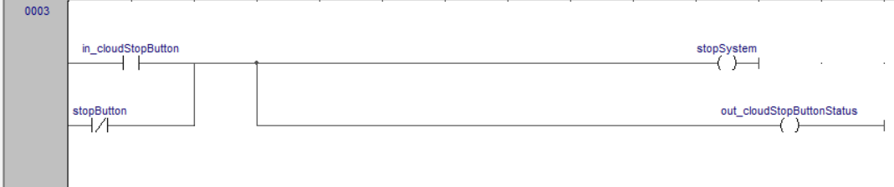

- `startSystem`: This input is energized when the system is in starting mode. It is activated by the logic from previous steps that command the system to start.
- `stopSystem`: This input is activated when the system is in stopping mode. It is energized based on the logic from previous steps that command the system to stop.
- `runSystem`: This is a coil (output) that gets energized when the system is in the running state. When this output is active, it indicates that the system is currently operational.

**Resume**: This rung controls the system's transition to the running state. The system will enter the running state (`runSystem` is energized) if a start command is given (`startSystem` is active) and no stop command is present (`stopSystem` is inactive). Once the system is running, it will remain in this state until a stop command is issued.

The **Rung 04**

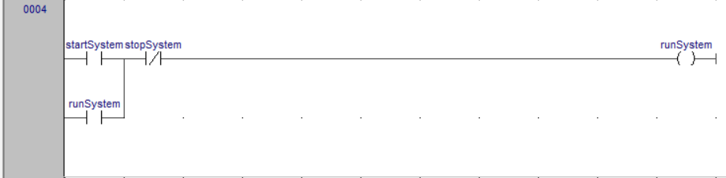

- `runSystem`: This input is energized when the system is in the running state. It indicates that the overall system is operational.
- `sortedTime`: This input represents a timing condition related to the brief stop of the entry conveyor when a color is detected.
- `sortingConveyor`: This is a coil (output) that is energized to activate the sorting conveyor, which is responsible for moving objects to the sorting area.
- `entryConveyor`: This is a coil (output) that is energized to activate the entry conveyor, responsible for moving objects into the sorting conveyor.

**Resume**: This rung ensures that the `sortingConveyor` runs whenever the system is operational (`runSystem` is active). The `entryConveyor` will also run under the same condition, but only if the `sortedTime` has not yet triggered (i.e., if `sortedTime` is still in its normally closed state). This setup ensures that the conveyors operate in coordination with the system's running state and the sorting process timing.

The **Rung 05**

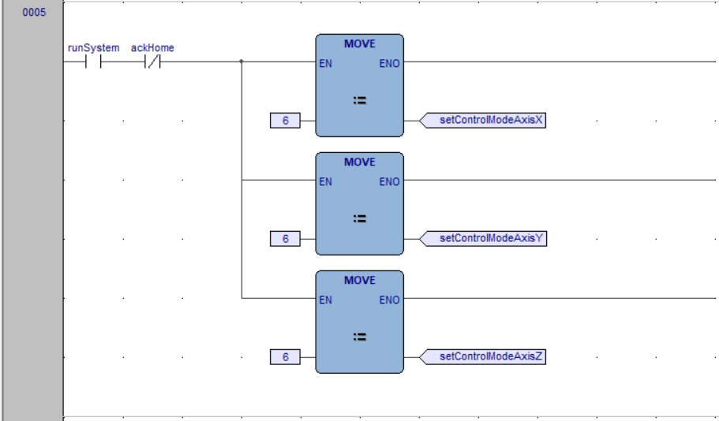

- `colorGreenSensor`: This input represents the color sensor that detects whether an object is green. When this sensor is active (high), it indicates that a green object has been detected.
- `greenSortingActuator`: This is a coil (output) that, when energized, activates the mechanism responsible for sorting green objects. The (S) symbol indicates that this output is a "Set" coil, meaning it will remain energized once triggered. This keeps the actuator activated until a "Reset" signal is given, confirming that the item has been sorted.

**Resume**: This rung triggers the green sorting mechanism (`greenSortingActuator`) when a green object is detected by the sensor (`colorGreenSensor`). The actuator will stay activated until reset, ensuring that the green object is sorted correctly.

The **Rung 06**

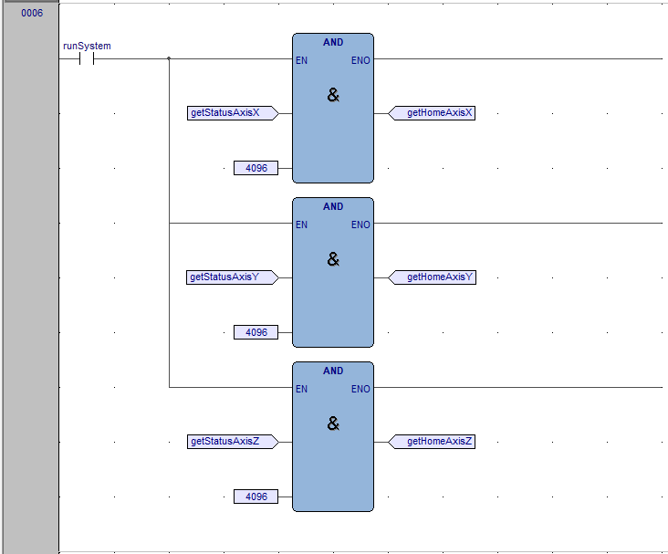

- `colorBlueSensor`: This input represents the color sensor that detects whether an object is blue. When this sensor is active (high), it indicates that a blue object has been detected.
- `blueSortingActuator`: This is a coil (output) that, when energized, activates the mechanism responsible for sorting blue objects. The (S) symbol indicates that this output is a "Set" coil, meaning it will remain energized once triggered. This keeps the actuator activated until a "Reset" signal is given, confirming that the item has been sorted.

**Resume**: This rung triggers the blue sorting mechanism (`blueSortingActuator`) when a blue object is detected by the sensor (`colorBlueSensor`). The actuator will stay activated until reset, ensuring that the blue object is sorted correctly.

The **Rung 07**


- `colorRedSensor`: This input represents a sensor that detects whether an object is red. When this sensor is active (high), it indicates that a red object has been detected.
- `colorGreenSensor`: This input represents a sensor that detects whether an object is green. When this sensor is active (high), it indicates that a green object has been detected.
- `colorBlueSensor`: This input represents a sensor that detects whether an object is blue. When this sensor is active (high), it indicates that a blue object has been detected.
- `objectDetected`: This is a coil (output) that, when energized, indicates that an object has been detected by one of the color sensors. The (S) symbol indicates that this output is a "Set" coil, meaning it will remain energized once triggered until explicitly reset later in the logic. This will be used to give enough time for the object to pass from the entry conveyor to the sorting conveyor.

**Resume**: This rung sets the `objectDetected` flag whenever an object of any of the specified colors (red, green, or blue) is detected by the respective sensors. The `objectDetected` output remains energized, signaling that an object is present until it is reset.

The **Rung 08**


- `objectDetected`: This input was energized in the previous rung to indicate that an object has been detected. When this input is energized, the logic contained in this rung can operate.
- `sortedTime`: This input represents a timing condition related to the sorting process. When this variable is set, the `entryConveyor` turns off and enables the next rung to operate.
- `entryConveyorTON`: This is an On-Delay Timer (TON). When its input (IN) is energized, it starts timing. After one second, when the preset time (PT) elapses, the timer's output (Q) becomes active, setting the `objectDetected` and `sortedTime` variables. This TON is used to delay the activation of the `sortedTime` variable, ensuring that the object has enough time to pass from the entry conveyor to the sorting conveyor before the entry conveyor turns off.

**Resume**: This rung controls the timing sequence for turning off the `entryConveyor` after an object is detected. When an object is detected (`objectDetected` is energized) and `sortedTime` is inactive, the `entryConveyorTON` timer starts counting down. After a delay of one second, the timer activates, which then resets the `objectDetected` flag and sets the `sortedTime` flag. This ensures that the object has enough time to move from the entry conveyor to the sorting conveyor before the entry conveyor is turned off, allowing the next part of the sorting process to proceed.

The **Rung 09**


- `sortedTime`: When this input is active (high), it allows the rest of the rung's logic to execute, signaling that the object has moved through the system and is ready for sorting.
- `photoelectricRedSensor`: This input represents a photoelectric sensor located in the area where sorted red objects should be. Detecting the presence of an object in this area confirms that the red object has been successfully sorted.
- `photoelectricGreenSensor`: This input represents a photoelectric sensor located in the area where sorted green objects should be. Detecting the presence of an object in this area confirms that the green object has been successfully sorted.
- `photoelectricBlueSensor`: This input represents a photoelectric sensor located in the area where sorted blue objects should be. Detecting the presence of an object in this area confirms that the blue object has been successfully sorted.
- `greenSortingActuator`: This is a reset coil, which deactivates the `greenSortingActuator` because the green object has been sorted.
- `blueSortingActuator`: This is a reset coil, which deactivates the `blueSortingActuator` because the blue object has been sorted.

**Resume**: This rung resets the sorting logic after an item has been successfully sorted, confirmed by any of the photoelectric sensors located in the area reserved for sorted items. When the sorting process is complete, the green and blue sorting actuators are reset, and the `sortedTime` flag is cleared. This prepares the system for the next sorting cycle.

The **Rung 10**


- `runSystem`: This input is energized when the system is in the running state. It allows the counting process to occur only when the system is operational.
- `photoelectricRedSensor`: This input represents a sensor that detects the presence of a red object. When this sensor is active, it indicates that a red object has been detected, triggering the counting process.
- `redCounter`: This is a counter (CTU - Count Up) that increments its count each time the conditions on the left side of the rung (inputs) are met. The counter continues counting until the system is stopped, which resets the counter. This block is used to count when a red object is detected and increments the variable responsible for tracking the number of sorted red objects (`out_counterRed`).
- `stopSystem`: This input is used to reset the counter. When activated, it resets the count to zero, effectively restarting the counting process.
- `out_counterRed`: This is used to track the number of sorted red objects and transmit the count to the Arduino Cloud. This allows the exact number of sorted red objects to be displayed on the Arduino Cloud Dashboard in real-time.

**Resume**: This rung counts the number of red objects detected while the system is running. The `out_counterRed` increments each time a red object passes the `photoelectricRedSensor`, and the count continues until the system is stopped. The `out_counterRed` variable also allows the number of sorted red objects to be displayed on the Arduino Cloud Dashboard in real-time.

The **Rung 11**


- `runSystem`: This input is energized when the system is in the running state. It allows the counting process to occur only when the system is operational.
- `photoelectricGreenSensor`: This input represents a sensor that detects the presence of a green object. When this sensor is active, it indicates that a green object has been detected, triggering the counting process.
- `greenCounter`: This is a counter (CTU - Count Up) that increments its count each time the conditions on the left side of the rung (inputs) are met. The counter continues counting until the system is stopped, which resets the counter. This block is used to count when a green object is detected and increments the variable responsible for tracking the number of sorted green objects (`out_counterGreen`).
- `stopSystem`: This input is used to reset the counter. When activated, it resets the count to zero, effectively restarting the counting process.
- `out_counterGreen`: This is used to track the number of sorted green objects and transmit the count to the Arduino Cloud. This allows the exact number of sorted green objects to be displayed on the Arduino Cloud Dashboard in real-time.

**Resume**: This rung counts the number of green objects detected while the system is running. The `out_counterGreen` increments each time a green object passes the `photoelectricGreenSensor`, and the count continues until the system is stopped. The `out_counterGreen` variable also allows the number of sorted green objects to be displayed on the Arduino Cloud Dashboard in real-time.

The **Rung 12**


- `runSystem`: This input is energized when the system is in the running state. It allows the counting process to occur only when the system is operational.
- `photoelectricBlueSensor`: This input represents a sensor that detects the presence of a blue object. When this sensor is active, it indicates that a blue object has been detected, triggering the counting process.
- `blueCounter`: This is a counter (CTU - Count Up) that increments its count each time the conditions on the left side of the rung (inputs) are met. The counter continues counting until the system is stopped, which resets the counter. This block is used to count when a blue object is detected and increments the variable responsible for tracking the number of sorted blue objects (`out_counterBlue`).
- `stopSystem`: This input is used to reset the counter. When activated, it resets the count to zero, effectively restarting the counting process.
- `out_counterBlue`: This is used to track the number of sorted blue objects and transmit the count to the Arduino Cloud. This allows the exact number of sorted blue objects to be displayed on the Arduino Cloud Dashboard in real-time.

**Resume**: This rung counts the number of blue objects detected while the system is running. The `out_counterBlue` increments each time a blue object passes the `photoelectricBlueSensor`, and the count continues until the system is stopped. The `out_counterBlue` variable also allows the number of sorted blue objects to be displayed on the Arduino Cloud Dashboard in real-time.

## Opta Sketch Code

You can download the code for the Opta [here](assets/ConveyorSortingSystem.zip).

To integrate Arduino Cloud with Opta, it is essential to write Arduino Sketch code (based on C++) within the Arduino PLC IDE. This code is crucial for establishing reliable communication, enabling the control and monitoring of Opta's variables, inputs, and outputs.

The first step to ensure proper functionality is to add the necessary libraries. These libraries are collections of pre-written code that developers can integrate into their projects to perform specific functions or tasks. They offer ready-made solutions to common challenges, saving time and effort, and are essential for establishing effective communication between the Opta and the Arduino Cloud.

### Required Libraries for Opta and Arduino Cloud Integration

To ensure proper functionality and establish effective communication between the Opta and the Arduino Cloud, the following libraries and their respective minimum versions are required:

| **Library**                   | **Version** | **Description**                                                                                                                                                                                                                                                           |
| ----------------------------- | ----------- | ------------------------------------------------------------------------------------------------------------------------------------------------------------------------------------------------------------------------------------------------------------------------- |
| **ArduinoIoTCloud**           | 1.15.1      | This library allows connecting to the Arduino IoT Cloud service. It provides a ConnectionManager to handle connection/disconnection, property-change updates and events callbacks.                                                                                        |
| **Arduino_ConnectionHandler** | 0.8.1       | Arduino Library for network connection management (WiFi, GSM, NB, [Ethernet]).                                                                                                                                                                                            |
| **ArduinoECCX08**             | 1.3.8       | Arduino Library for the Atmel/Microchip ECC508 and ECC608 crypto chips.                                                                                                                                                                                                   |
| **ArduinoMqttClient**         | 0.1.8       | Allows you to send and receive MQTT messages using Arduino.                                                                                                                                                                                                               |
| **Arduino_DebugUtils**        | 1.4.0       | Debugging module with different debug levels, timestamps and printf-style output. This class provides functionality useful for debugging sketches via printf-style statements.                                                                                            |
| **Arduino_Portenta_OTA**      | 1.2.1       | Firmware update for the Portenta H7. This library allows performing a firmware update on the Arduino Portenta H7. The firmware can be stored in various different locations such as within the microcontroller's flash, on an external SD card or on the QSPI flash chip. |
| **Arduino_SecureElement**     | 0.1.2       | This library allows usage of Arduino boards secure elements in a common and unified way.                                                                                                                                                                                  |

These libraries are indexed. They are certified to ensure optimal performance and reliability. Using them will accelerate your development process and strengthen the durability of your applications, especially in industrial environments. By incorporating these libraries with the specified versions, developers can efficiently establish and maintain secure and reliable communication between Opta and the Arduino Cloud, enabling robust control, monitoring, and remote updates.

In the Arduino PLC IDE, you can find the section to add libraries under the `Resources` tab, and then by clicking on `Libraries`. The image below illustrates the addition of these libraries.

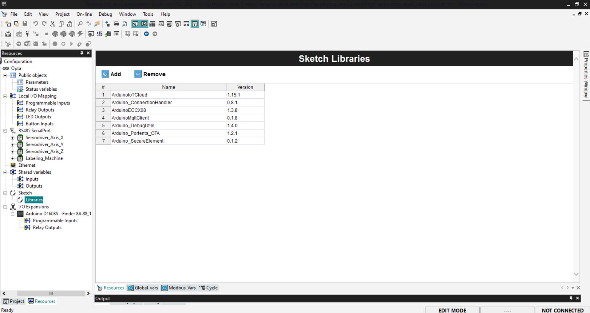

### Arduino Sketch Code

With the necessary libraries in place, we can now create code that seamlessly integrates the Opta device with the Arduino Cloud. The provided code is designed to establish a stable and secure connection between the Opta device and the Arduino Cloud, allowing you to monitor and control the conveyor and sorting system remotely. This enables real-time interaction with your system, ensuring that any changes in the system's status are immediately reflected in the cloud and vice versa.

To find the section that contains the code in Arduino Sketch, go to the `Resources` tab and then select the `Sketch` option, as shown in the figure below. This is the section where we will place the code responsible for communicating with the Arduino Cloud.


And below is the code contained in the screenshot above:

```arduino
#include <ArduinoIoTCloud.h> // Library for Arduino IoT Cloud functionalities
#include <Arduino_ConnectionHandler.h> // Library for managing connections to Arduino Cloud

// WiFi network credentials
const char SSID[]     = "NETWORK_SSID";    // Network SSID (name)
const char PASS[]     = "NETWORK_PASS";    // Network password (use for WPA, or use as key for WEP)

// Function prototypes for handling changes in cloud variables
void onStartButtonChange();
void onStopButtonChange();

// Variables linked to Arduino Cloud properties
bool cloudStartButton;
bool cloudStopButton;
bool cloudRunningSystem;
int  cloudRedSorted;
int  cloudGreenSorted;
int  cloudBlueSorted;

// WiFi connection handler for connecting to Arduino Cloud
WiFiConnectionHandler ArduinoIoTPreferredConnection(SSID, PASS);

void setup() {
  // Initialize serial and wait for port to open:
  Serial.begin(9600);
  // This delay gives the chance to wait for a Serial Monitor without blocking if none is found
  delay(1500); 

  // Defined in thingProperties.h
  initProperties();

  // Connect to Arduino Cloud
  ArduinoCloud.begin(ArduinoIoTPreferredConnection);
  
  /*
     The following function allows you to obtain more information
     related to the state of network and IoT Cloud connection and errors
     the higher number the more granular information you’ll get.
     The default is 0 (only errors).
     Maximum is 4
 */
  setDebugMessageLevel(2);
  ArduinoCloud.printDebugInfo();
}

void loop() {
  // Continuously update the cloud with the latest values of cloud variables
  ArduinoCloud.update();
  
  // Synchronize local cloud variables with the current status of the PLC outputs
  cloudStartButton   = PLCOut.out_cloudStartButtonStatus;
  cloudStopButton    = PLCOut.out_cloudStopButtonStatus;
  cloudRunningSystem = PLCOut.out_cloudRunningSystem;
  cloudRedSorted     = PLCOut.out_counterRed;
  cloudGreenSorted   = PLCOut.out_counterGreen;
  cloudBlueSorted    = PLCOut.out_counterBlue;
}

void initProperties(){
  // Link each cloud variable to its corresponding property in the Arduino Cloud
  ArduinoCloud.addProperty(cloudStartButton, READWRITE, ON_CHANGE, onStartButtonChange);
  ArduinoCloud.addProperty(cloudStopButton, READWRITE, ON_CHANGE, onStopButtonChange);
  ArduinoCloud.addProperty(cloudRunningSystem, READ, ON_CHANGE, NULL);
  ArduinoCloud.addProperty(cloudRedSorted, READ, ON_CHANGE, NULL);
  ArduinoCloud.addProperty(cloudGreenSorted, READ, ON_CHANGE, NULL);
  ArduinoCloud.addProperty(cloudBlueSorted, READ, ON_CHANGE, NULL);
}

/*
  Callback function triggered when the cloud start button value changes.
  This function updates the local PLC input corresponding to the start button.
*/
void onStartButtonChange()  {
  // Add your code here to act upon CloudButton change
  PLCIn.in_cloudStartButton = cloudStartButton;
}

/*
  Callback function triggered when the cloud stop button value changes.
  This function updates the local PLC input corresponding to the stop button.
*/
void onStopButtonChange()  {
  // Add your code here to act upon CloudButton change
  PLCIn.in_cloudStopButton = cloudStopButton;
}
```
To explain the code, we will divide it into four sections: 
- Global Declarations and Initialization
- Setup Function
- Loop Function
- initProperties and Callbacks.

### First Section: Global Declarations and Initialization

```arduino
#include <ArduinoIoTCloud.h> // Library for Arduino IoT Cloud functionalities
#include <Arduino_ConnectionHandler.h> // Library for managing connections to Arduino Cloud

// WiFi network credentials
const char SSID[]     = "NETWORK_SSID";    // Network SSID (name)
const char PASS[]     = "NETWORK_PASS";    // Network password (use for WPA, or use as key for WEP)

// Function prototypes for handling changes in cloud variables
void onStartButtonChange();
void onStopButtonChange();

// Variables linked to Arduino Cloud properties
bool cloudStartButton;
bool cloudStopButton;
bool cloudRunningSystem;
int  cloudRedSorted;
int  cloudGreenSorted;
int  cloudBlueSorted;

// WiFi connection handler for connecting to Arduino Cloud
WiFiConnectionHandler ArduinoIoTPreferredConnection(SSID, PASS);

```

**Explanation:**

1. **Library Inclusions**:

   `#include <ArduinoIoTCloud.h>`: This library provides the necessary functions to connect and interact with the Arduino Cloud.
   
   `#include <Arduino_ConnectionHandler.h>`: This library manages the connection between the device and the Arduino Cloud.

2. **Network Credentials**:

   `const char SSID[] = "NETWORK_SSID";` and `const char PASS[] = "NETWORK_PASS";`: These constants store the WiFi network's SSID and password, necessary for connecting the device to the network. You need to replace `NETWORK_SSID` with your Wi-Fi network's SSID and `NETWORK_PASS` with your Wi-Fi password.

3. **Function Prototypes**:

   `void onStartButtonChange();` and `void onStopButtonChange();`: These are function declarations for handling changes in the start and stop buttons state when received from the cloud.

4. **Cloud-Linked Variables**:

   `bool cloudStartButton;`, `bool cloudStopButton;`, `bool cloudRunningSystem;`: These boolean variables represent the state of the start/stop buttons and the running system status in the cloud.

   `int cloudRedSorted;`, `int cloudGreenSorted;`, `int cloudBlueSorted;`: These integer variables track the number of red, green, and blue items sorted and are synchronized with the cloud.

5. **WiFi Connection Handler**:

   `WiFiConnectionHandler ArduinoIoTPreferredConnection(SSID, PASS);`: This object manages the WiFi connection to the Arduino Cloud using the provided SSID and password.

### Second Section: Setup Function

```arduino
void setup() {
  // Initialize serial and wait for port to open:
  Serial.begin(9600);
  // This delay gives the chance to wait for a Serial Monitor without blocking if none is found
  delay(1500); 

  // Defined in thingProperties.h
  initProperties();

  // Connect to Arduino Cloud
  ArduinoCloud.begin(ArduinoIoTPreferredConnection);
  
  /*
     The following function allows you to obtain more information
     related to the state of network and IoT Cloud connection and errors
     the higher number the more granular information you’ll get.
     The default is 0 (only errors).
     Maximum is 4
 */
  setDebugMessageLevel(2);
  ArduinoCloud.printDebugInfo();
}
```

**Explanation:**

The `setup` function in Arduino programming is a crucial function that executes once when the Arduino board is powered on or reset. It’s responsible for initializing settings and configuring the system before the main program starts running. In the `setup` function, you typically establish communication (such as starting the serial monitor), configure pin modes, connect to networks, and initialize variables and libraries. This function ensures the Arduino is fully prepared for the `loop` function that follows, allowing for continuous and smooth operation. In this sketch, we are setting up:

**Serial Communication Initialization**:
- `Serial.begin(9600);`: Initializes the serial communication at a baud rate of 9600 bps, allowing you to monitor the device's output through the Serial Monitor.

**Delay**:
- `delay(1500);`: A delay of 1.5 seconds is introduced to ensure that the Serial Monitor has time to open before continuing.

**Properties Initialization**:
- `initProperties();`: This function is defined later in the code and is responsible for linking the local variables with the Arduino Cloud properties.

**Arduino Cloud Connection**:
- `ArduinoCloud.begin(ArduinoIoTPreferredConnection);`: This command connects the device to the Arduino Cloud using the specified WiFi credentials.

**Debugging Information**:
- `setDebugMessageLevel(2);`: Sets the level of debug information. A higher number provides more detailed information about network and cloud connection states. The default is 0 (only errors), and the maximum is 4 (most detailed).
- `ArduinoCloud.printDebugInfo();`: Prints debug information about the cloud connection to the Serial Monitor.

### Third Section: Loop Function

```arduino
void loop() {
  // Continuously update the cloud with the latest values of cloud variables
  ArduinoCloud.update();
  
  // Synchronize local cloud variables with the current status of the PLC outputs
  cloudStartButton   = PLCOut.out_cloudStartButtonStatus;
  cloudStopButton    = PLCOut.out_cloudStopButtonStatus;
  cloudRunningSystem = PLCOut.out_cloudRunningSystem;
  cloudRedSorted     = PLCOut.out_counterRed;
  cloudGreenSorted   = PLCOut.out_counterGreen;
  cloudBlueSorted    = PLCOut.out_counterBlue;
}
```

**Explanation:**

The `loop` function in Arduino programming is a core function that runs continuously after the setup function has finished executing. This is where the main logic of your program resides. The `loop` function repeats over and over, allowing the Arduino to check inputs, control outputs, and perform tasks repeatedly as long as the board is powered on. It’s in this function that you’ll handle real-time operations, such as reading sensor data, controlling motors, or updating displays. By continuously executing the code within loop, the Arduino can respond dynamically to changes in its environment, ensuring ongoing and responsive operation. The loop function in this sketch is responsible for:

**Cloud Connection Maintenance**:
- `ArduinoCloud.update();`: This function keeps the connection to the Arduino Cloud alive and synchronizes the cloud-linked variables with their current values.

**Start Button Status**:
- `cloudStartButton = PLCOut.out_cloudStartButtonStatus;`: Synchronizes the variable in the PLC with the variable in the Arduino Cloud.

**Stop Button Status**:
- `cloudStopButton = PLCOut.out_cloudStopButtonStatus;`: Synchronizes the variable in the PLC with the variable in the Arduino Cloud.

**System Running Status**:
- `cloudRunningSystem = PLCOut.out_cloudRunningSystem;`: Synchronizes the variable in the PLC with the variable in the Arduino Cloud.

**Red Items Sorted Count**:
- `cloudRedSorted = PLCOut.out_counterRed;`: Synchronizes the variable in the PLC with the variable in the Arduino Cloud.

**Green Items Sorted Count**:
- `cloudGreenSorted = PLCOut.out_counterGreen;`: Synchronizes the variable in the PLC with the variable in the Arduino Cloud.

**Blue Items Sorted Count**:
- `cloudBlueSorted = PLCOut.out_counterBlue;`: Synchronizes the variable in the PLC with the variable in the Arduino Cloud.

### Fourth Section: InitProperties and Callbacks

```arduino
void initProperties(){
  // Link each cloud variable to its corresponding property in the Arduino Cloud
  ArduinoCloud.addProperty(cloudStartButton, READWRITE, ON_CHANGE, onStartButtonChange);
  ArduinoCloud.addProperty(cloudStopButton, READWRITE, ON_CHANGE, onStopButtonChange);
  ArduinoCloud.addProperty(cloudRunningSystem, READ, ON_CHANGE, NULL);
  ArduinoCloud.addProperty(cloudRedSorted, READ, ON_CHANGE, NULL);
  ArduinoCloud.addProperty(cloudGreenSorted, READ, ON_CHANGE, NULL);
  ArduinoCloud.addProperty(cloudBlueSorted, READ, ON_CHANGE, NULL);
}

/*
  Callback function triggered when the cloud start button value changes.
  This function updates the local PLC input corresponding to the start button.
*/
void onStartButtonChange()  {
  // Add your code here to act upon CloudButton change
  PLCIn.in_cloudStartButton = cloudStartButton;
}

/*
  Callback function triggered when the cloud stop button value changes.
  This function updates the local PLC input corresponding to the stop button.
*/
void onStopButtonChange()  {
  // Add your code here to act upon CloudButton change
  PLCIn.in_cloudStopButton = cloudStopButton;
}
```

**Explanation:**

**initProperties Function**:

   `ArduinoCloud.update();`: This function links the cloud variables with their respective properties in the Arduino Cloud. Each property is set with specific attributes:
- **`READWRITE`**: The property can be read from and written to by the cloud.
- **`READ`**: The property can only be read by the cloud.
- **`ON_CHANGE`**: The associated function (callback) is called whenever the value of the property changes.
- `onStartButtonChange` and `onStopButtonChange` are callback functions that execute whenever the `cloudStartButton` or `cloudStopButton` values change.

**Callback Functions**:
- **`onStartButtonChange()`**: Updates the local start button state (`PLCIn.in_cloudStartButton`) whenever the `cloudStartButton` value changes in the cloud.
- **`onStopButtonChange()`**: Updates the local stop button state (`PLCIn.in_cloudStopButton`) whenever the `cloudStopButton` value changes in the cloud.

***You can download the complete code from [here](assets/ConveyorSortingSystem.zip).***

### Arduino Cloud Dashboard

The Arduino Cloud provides a powerful platform for monitoring and controlling the conveyor and sorting system in real time. With this setup, you can remotely oversee the entire process and interact with key components of the system as they happen. The system tracks the total number of items sorted by color, red, green, and blue, allowing you to monitor how many of each have been processed.

In addition to tracking the sorted items, the Arduino Cloud also allows you to control the start and stop of the system. You can initiate or stop the system directly from the cloud interface, giving you full control over the operation from anywhere with an internet connection, all in real time.

This real-time integration ensures that you can both observe the performance of your sorting system and take direct action when needed, making it a versatile and effective tool for managing your operations instantly and efficiently.


Within the Arduino Cloud's dashboard, the system variables can be monitored with the following widgets:

- `Value`: Responsible for displaying the total number of items sorted by each color: red, green, and blue.
- `Push Button`: We use two push buttons, the start button and the stop button. With this widget, we can start and stop the system through the Arduino Cloud, just like a physical button.
  
This dashboard can be easily accessed from a PC, mobile phone, or tablet anywhere, providing instantaneous updates wherever we are. 

Additionally, we can set up various integrations to complement our project. For example, we can forward the dashboard data to an external service using Webhook, IFTTT automation, and Smart Home integrations.

## Full Packaging and Labelling System Example

All the necessary files to replicate this application note can be found below:

- The complete code can be downloaded [here](assets/Packaging_and_labeling.zip)

## Conclusion

In this application note, we have learned how to implement a conveyor and sorting system responsible for sorting items of three different colors: red, green, and blue.

This application demonstrates how Arduino's environment simplifies the workflow for developing smart solutions to meet real industrial needs. The Arduino PRO product line is a perfect fit for developing robust and reliable projects for the industry. The system can be controlled and monitored in real time using the Arduino Cloud, providing seamless interaction and management of the sorting process.

### Next Steps

Now that you know how to develop a smart conveyor and sorting system with the Opta and the Arduino Cloud, it’s time to continue exploring all the capabilities of the Arduino Pro environment. Integrate it into your professional setup and enhance it with powerful solutions.

You can take this solution even further by incorporating advanced algorithms for real-time data analysis, such as tracking efficiency metrics or optimizing sorting accuracy based on specific sensor data.