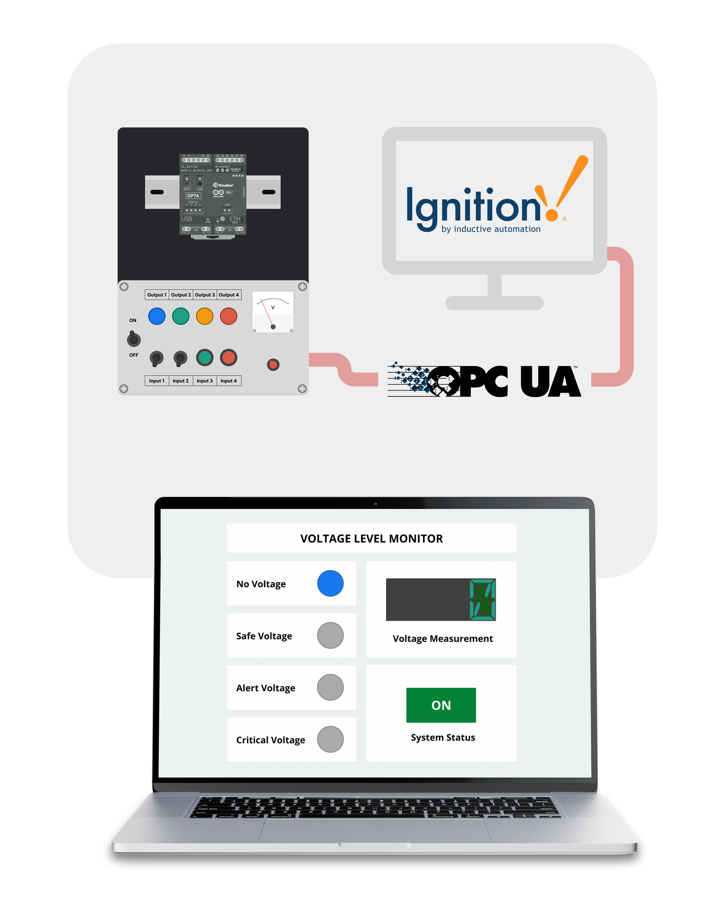
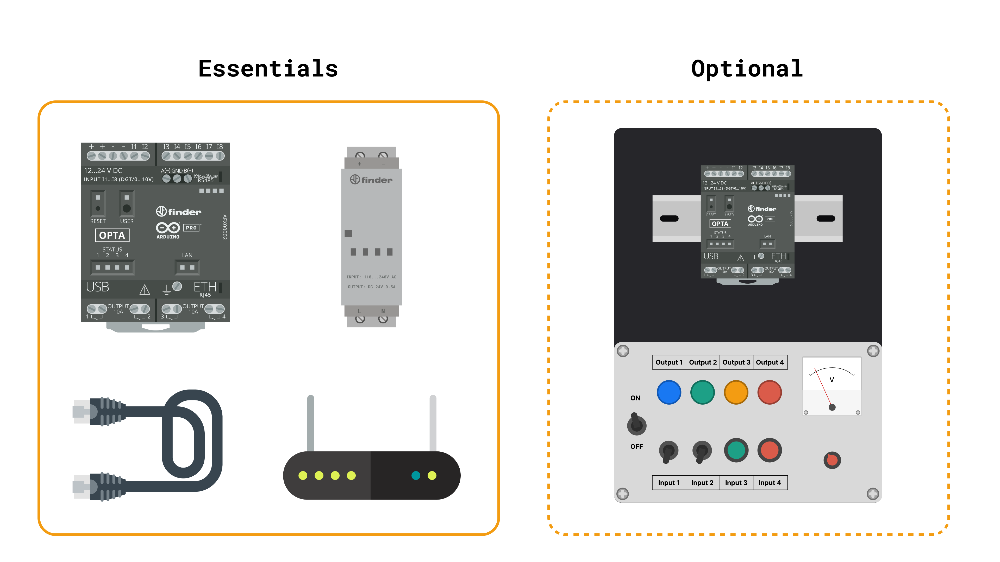
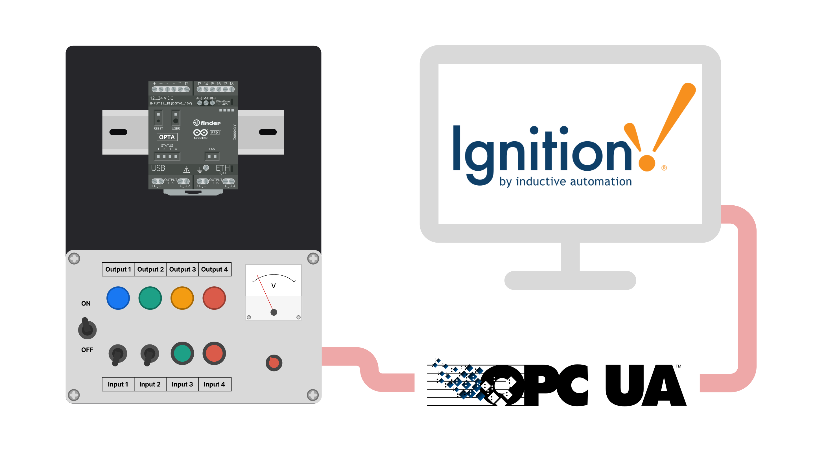
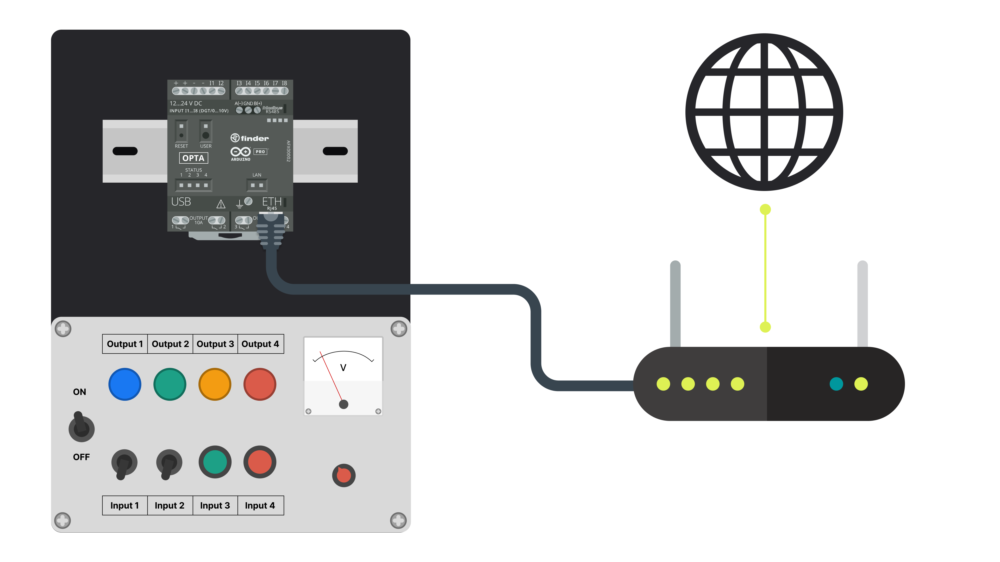
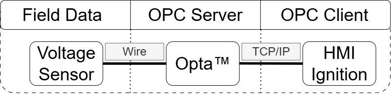
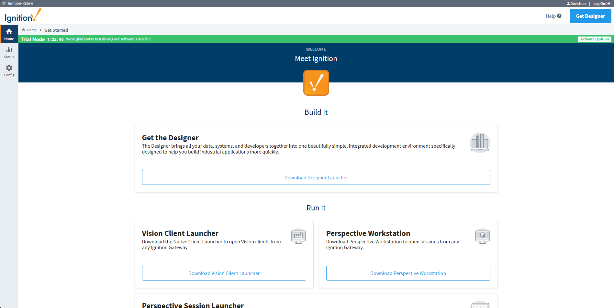
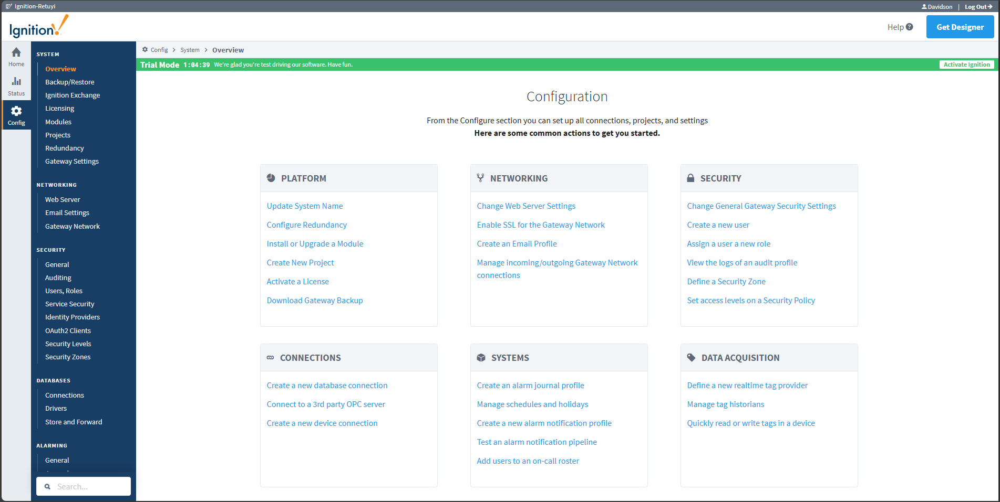
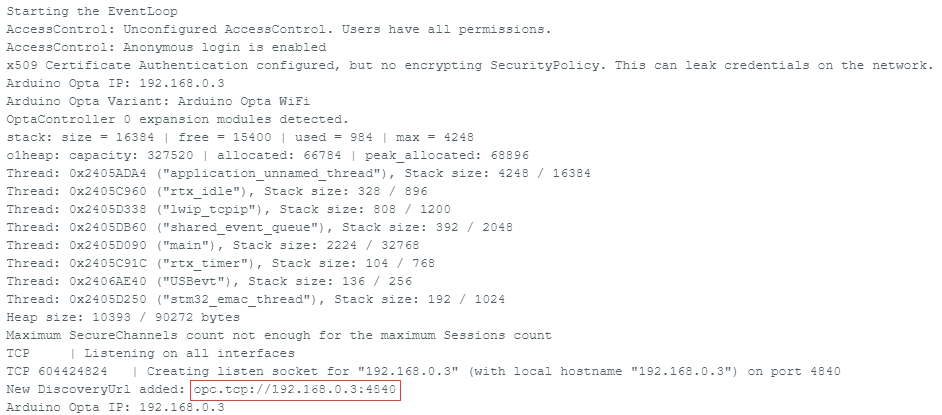
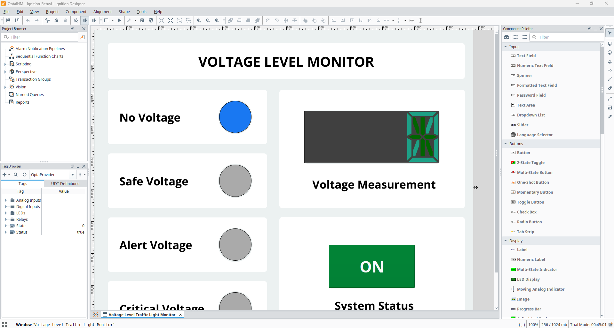
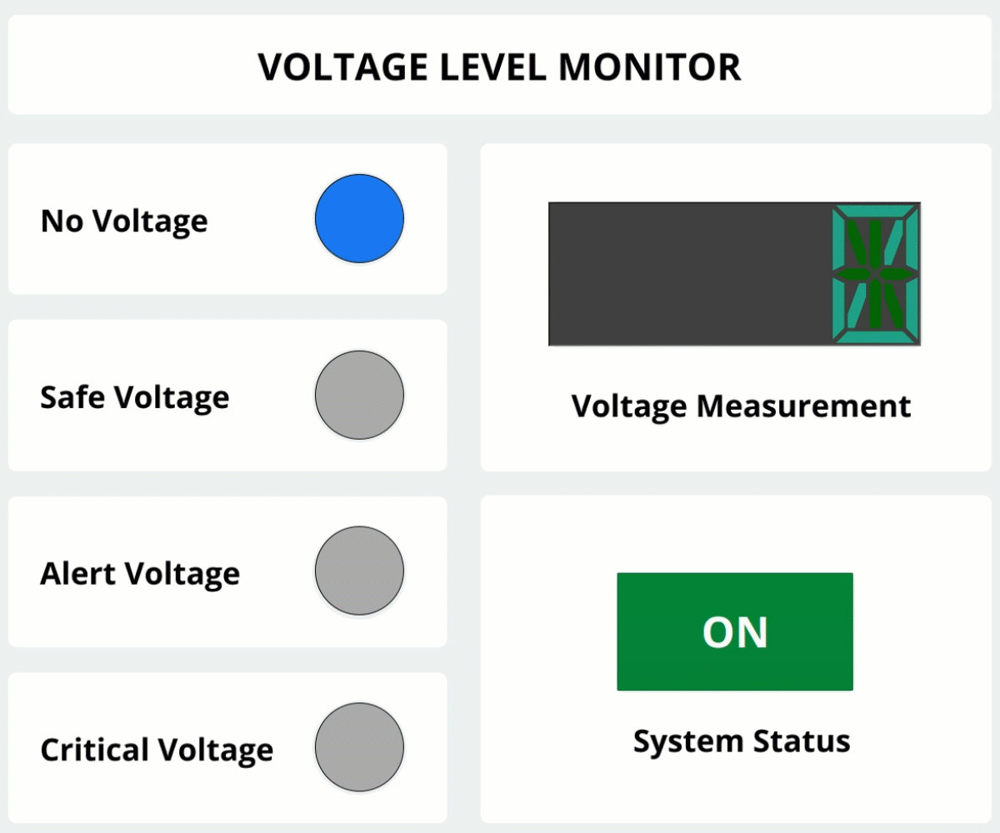

## Introduction

Human-Machine Interfaces (HMIs) play a vital role in enabling effective interaction between operators and industrial systems, supporting efficient control, monitoring, and decision-making processes. By providing clear visualization and intuitive controls, HMIs enable operators to monitor system status and respond to issues in real time. For example, visual indicators for voltage levels can help operators identify and address potential problems before they impact operations.

HMIs can be implemented locally, via a dedicated hardware unit or via a server with thin clients. In this application note we will focus on the latter, due to a growing trend in adopting this approach for new industrial systems. We have chosen Ignition HMI software from the [Ignition Platform suite](https://inductiveautomation.com/ignition/), a powerful software that simplifies the creation of high-performance HMIs.

The functionality of HMIs depends on efficient and reliable communication across all connected components. This is achieved through the integration of robust communication protocols. One such protocol is Open Platform Communications Unified Architecture (OPC-UA), recognized for its flexibility, security, and compatibility with a wide range of automation platforms. Through OPC-UA, HMIs can ensure reliable data exchange and interoperability, further optimizing industrial system performance.



This application note highlights the OPTA™ device's capability to utilize the OPC-UA protocol for seamless communication. Specifically, OPC-UA facilitates data exchange between the Ignition platform and the Opta™ device to create an HMI (Human-Machine Interface) that monitors the voltage level from an analog input on the Opta™. This HMI displays the voltage level and provides visual indicators to represent the status of the voltage.

As an open, standardized architecture, OPC-UA enables interoperability between devices and systems, regardless of manufacturer or technology. When integrated with HMIs, it supports reliable data exchange, enabling remote monitoring, detailed information collection, and precise process control. Its ability to handle data enables features such as configuration parameters, alarms, events, and historical data, enhancing operational efficiency and supporting informed decision-making.

Moreover, OPC-UA is highly scalable, making it ideal for various industrial environments, from small installations to large distributed automation systems. It ensures secure, reliable communication, which is essential in industries where data integrity and security are paramount.

**Target audience:** PLC programmers, Automation engineers, Industrial IoT engineers and Electrical engineers.

### Goals

The goal of this application note is to demonstrate the Opta™ device's capability to utilize the OPC-UA protocol for communication with the Ignition platform to create an intuitive HMI, showcasing how this protocol can facilitate efficient and secure data exchange in industrial environments. The project's objectives are the following:

- Create an Arduino sketch that converts the Opta™ into an OPC-UA server accessible to clients on the OPC-UA network. 
- Include a function to capture the voltage level from the analog input of the Opta™ and activate output relays accordingly.
- Transmit the voltage level and relay status data from the Opta™ to the Ignition platform using the OPC-UA protocol.
- Create an HMI in the Ignition platform that utilizes the data fed from the Opta™ via the OPC-UA protocol.
- Use the created HMI to monitor the voltage level read by the Opta™ and display statuses.

## Hardware and Software Requirements



### Hardware Requirements

- [Arduino Opta™](https://store.arduino.cc/products/opta-wifi) (x1)
- 24 VDC Power Supply (x1)
- Ethernet RJ45 cable (x1)
- [USB Type-C® Cable](https://store.arduino.cc/products/usb-cable2in1-type-c) (x1)
- Wired internet access
  
Optionally, to leverage the pre-built setup, we recommend the following kit:

- [Opta™ Kit PLC Trainer Pro](https://www.plccable.com/arduino-ide-opta-kit-plc-trainer-pro-industrial-iot-ethernet-afx00003/) (x1)

<div style="text-align:justify;">

***We will use the Opta™ Kit PLC Trainer Pro because it already includes output lights, analog voltage read feature, and comes pre-assembled, making it easy and convenient to use. If you don't have the Opta™ Kit PLC Trainer, you can build your own circuit using LEDs to monitor the Opta™ outputs and a potentiometer connected to the analog input.***

</div>

### Software Requirements

- [Arduino PLC IDE](https://docs.arduino.cc/software/plc-ide/).
- [Arduino_OPC_UA library](https://github.com/arduino-libraries/Arduino_OPC_UA), install it using the Arduino IDE Library Manager. 
- [Ignition platform](https://inductiveautomation.com/scada-software/) account. Create one for free [here](https://docs.inductiveautomation.com/docs/8.1/getting-started/quick-start-guide/download-and-install).
- The [Arduino Opta™ Firmware](assets/opta-project-code.zip).
- The [Ignition HMI Design](assets/opta-project-code.zip), to be opened with the Ignition Designer software.

<div style="text-align:justify;">

***The `Arduino_OPC_UA` library is based on the _Fraunhofer open62541_ implementation of OPC UA, optimized for the Opta family. It supports secure and efficient communication for industrial automation applications. Additionally, it allows for automatic detection and configuration of up to two Arduino Opta Expansion Boards, such as the Digital Expansion (D1608E/D1608S) and Analog Expansion (A0602). For more details and documentation, visit the library's [Github repository](https://github.com/arduino-libraries/Arduino_OPC_UA).***

***The trial account of the Ignition platform can be used without any limitations for this application. It provides all the necessary features.***
</div>

### Download the Project Code

[](assets/opta-project-code.zip)

Download the whole project code [here](assets/opta-project-code.zip).

## OPC-UA Protocol

Before continuing to discuss this application note, let's briefly explain what the OPC-UA protocol is.

The OPC-UA protocol is a modern communication standard designed for industrial automation and IIoT applications. It provides a secure, platform-independent, and scalable framework for exchanging data between devices and systems. In this application, the protocol facilitates seamless communication between the Arduino Opta™ and the Ignition platform, enabling the creation of an HMI for real-time monitoring and control.



OPC-UA operates on a client-server model, where the server (e.g., the Arduino Opta™) gathers and organizes data, making it accessible as structured nodes. The client (e.g., the Ignition platform) requests or subscribes to this data to receive real-time updates. Additionally, the protocol supports bidirectional communication, allowing clients to send commands back to servers to trigger specific actions. 

Data exchange in OPC-UA is both secure and efficient, leveraging features such as encryption, authentication, and access control. While it is typically transported over TCP/IP to ensure reliable and ordered communication, OPC-UA is transport-independent, allowing it to operate over other protocols such as HTTPS or WebSockets. This flexibility makes OPC-UA highly adaptable to various environments and ideal for integrating diverse devices and systems, even in complex industrial settings.

The Arduino Opta™ acts as an OPC-UA server, exposing analog voltage readings and relay states as nodes that the Ignition platform (as the OPC-UA client) accesses. This setup enables dynamic data visualization on the HMI, where voltage levels and relay statuses are displayed in real time. While this application note focuses on reading commands, the OPC-UA protocol also supports sending commands from the HMI back to the Opta™, showcasing its potential for building interactive and responsive systems.

Key strengths of the OPC-UA protocol include:

- **Interoperability**: Standardized data exchange formats allow seamless integration with other OPC-UA-compliant devices and platforms, ensuring flexibility and scalability for future upgrades.
- **Security**: Features like encryption, authentication, and access control protect communication between the Opta™ and the Ignition platform from unauthorized access or tampering.
- **Scalability**: OPC-UA supports applications ranging from small-scale monitoring of single devices to large-scale industrial processes.

By leveraging OPC-UA, this solution offers a robust and efficient framework for monitoring and control. The integration of the Opta™ and the Ignition platform highlights the protocol’s advantages, including secure communication, seamless interoperability, and scalability, making it an ideal choice for modern industrial automation.

## OPC-UA Voltage Detection System Setup

This application does not require complex wiring for operation. However, the Arduino Opta™ must be connected to an appropriate power supply and an RJ45 Ethernet cable to establish the TCP/IP connection for OPC-UA communication with the Ignition platform. Ensure that the Ignition platform can detect and access the network address of the Arduino Opta™. Additionally, the Opta™ must be connected to a computer via a USB-C cable for initial setup and configuration.



The Opta™ reads the voltage level, controls relay outputs, and acts as an OPC-UA server. It organizes this data into structured nodes and makes it accessible via a TCP/IP connection to the Ignition platform, which functions as an OPC-UA client. The Ignition platform uses this data to create a Human-Machine Interface (HMI), enabling real-time monitoring of voltage levels and relay statuses.

Deployment Setup:
- **Arduino Opta™**: Connected to an analog voltage source for monitoring and powered by a 24 VDC power supply. The Opta™ reads voltage levels, controls relay outputs, and communicates with the Ignition platform via the OPC-UA protocol, acting as an OPC-UA server.
- **Ignition Platform**: Functions as an OPC-UA client, hosting the HMI for real-time visualization of voltage data and relay statuses. The platform also supports bidirectional communication with the Opta™, enabling control of the relays directly from the HMI.
- **Computer**: Used for the initial configuration of the Opta™, creating the design of the HMI in the Ignition Designer software, and running the HMI using the Ignition Vision software. The computer must be connected to the internet for firmware updates, library installations, and any required setup task.

## OPC-UA Voltage Detection System Overview

The Arduino Opta™, connected to an analog voltage sensor, acts as a central device for monitoring voltage levels. The voltage sensor captures field data and transmits it to the analog input of the Opta™, which processes it and acts as an OPC-UA server.



The voltage readings are organized into structured nodes and transmitted via a TCP/IP connection using the OPC-UA protocol to the Ignition platform, which functions as an OPC-UA client. The Ignition platform hosts a Human-Machine Interface (HMI) that visualizes voltage data, allowing operators to monitor system performance and voltage levels effectively.

For initial configuration, the Opta™ must be connected to a computer via a USB-C cable. The computer is also used to set up the HMI in the Ignition Designer software, ensuring seamless communication between the Opta™ and the platform. This setup enables secure and efficient voltage monitoring in industrial environments.

### Opta™ Code

This code configures the Arduino Opta™ as an OPC-UA server, enabling seamless communication with the Ignition platform. The program reads voltage levels from an analog input, processes the data to classify it into predefined thresholds, and activates relays to control indicator lights corresponding to the voltage range. The data is transmitted to the Ignition platform via the OPC-UA protocol, allowing monitoring and interaction through an intuitive Human-Machine Interface (HMI).

The code can be downloaded [here](assets/opta-project-code.zip).

This section of the code establishes the foundational elements required for implementing the OPC UA protocol and additional functionalities in the Arduino Opta™ application. It begins by including essential libraries:

- `Arduino_OPC_UA` for OPC UA communication, enabling the Opta™ to act as an OPC UA server.
- `PortentaEthernet` for network connectivity.
- `OptaBlue` for handling Opta-specific features.

To ensure efficient operation, memory allocation for the OPC UA server is configured with a dedicated `stack` and `heap`. Key global variables are declared, including the OPC UA server instance (`UA_Server`), memory heap instance (`O1HeapInstance`), and pointers for managing the Opta™ device and its expansion modules.

Utility functions simplify input handling:

- `arduino_opta_analog_read()` reads analog voltage from a specified pin, converts it to a voltage value, and returns it as a `float`.
- `arduino_opta_digital_read()` interprets the analog voltage as a digital signal, returning either `HIGH` or `LOW` based on a voltage threshold.

Finally, the code redirects standard output to the Serial interface for debugging logs and development messages.

```arduino

/**************************************************************************************
 * INCLUDE
 **************************************************************************************/

#include <Arduino_OPC_UA.h>
#include <PortentaEthernet.h>
#include <OptaBlue.h> /* Arduino_Opta_Blueprint */
#include <mbed_rtc_time.h>

#if MBED_HEAP_STATS_ENABLED && MBED_MEM_TRACING_ENABLED && MBED_STACK_STATS_ENABLED
#include "mbed_mem_trace.h"
#endif

/**************************************************************************************
 * GLOBAL VARIABLES
 **************************************************************************************/

static size_t const OPC_UA_SERVER_THREAD_STACK_SIZE = 16*1024UL;
template <size_t SIZE> struct alignas(uint32_t) OPC_UA_STACK final : public std::array<uint8_t, SIZE> {};
static OPC_UA_STACK<OPC_UA_SERVER_THREAD_STACK_SIZE> OPC_UA_SERVER_THREAD_STACK;

static size_t const OPC_UA_SERVER_THREAD_HEAP_SIZE = 320*1024UL;
template <size_t SIZE> struct alignas(O1HEAP_ALIGNMENT) OPC_UA_HEAP final : public std::array<uint8_t, SIZE> {};
static OPC_UA_HEAP<OPC_UA_SERVER_THREAD_HEAP_SIZE> OPC_UA_SERVER_THREAD_HEAP;

UA_Server * opc_ua_server = nullptr;
O1HeapInstance * o1heap_ins = nullptr;
rtos::Thread opc_ua_server_thread(osPriorityNormal, OPC_UA_SERVER_THREAD_STACK.size(), OPC_UA_SERVER_THREAD_STACK.data());

opcua::Opta::SharedPtr opta_opcua;
opcua::OptaExpansionManager::SharedPtr opta_expansion_manager_opcua;

/**************************************************************************************
 * DEFINES
 **************************************************************************************/

REDIRECT_STDOUT_TO(Serial)

/**************************************************************************************
 * LOCAL FUNCTIONS
 **************************************************************************************/

static float arduino_opta_analog_read(pin_size_t const pin)
{
  static float const VOLTAGE_MAX = 3.3;      // Maximum voltage that can be read
  static float const RESOLUTION  = 4096.0;   // 12-bit resolution
  static float const DIVIDER     = 0.3034;   // Voltage divider

  /* Read the actual analog value from the pin. */
  int const pin_value = analogRead(pin);
  /* Convert the raw ADC value into an actual voltage. */
  float const pin_voltage = pin_value * (VOLTAGE_MAX / RESOLUTION) / DIVIDER;

  return pin_voltage;
}

static PinStatus arduino_opta_digital_read(pin_size_t const pin)
{
  float const pin_voltage = arduino_opta_analog_read(pin);

  if (pin_voltage > 5.f) /* Half of the full range as measurable by the ADC. */
    return HIGH;
  else
    return LOW;
}

static void controlRelaysBasedOnVoltage();
```

This section of the code is the `setup()` function, which initializes the Arduino Opta™ system and prepares it to operate as an OPC UA server. It begins by configuring serial communication at a baud rate of `115200`, primarily for debugging purposes.

The Ethernet interface is then initialized to establish network connectivity. If this step fails, the program enters an infinite loop, signaling a critical error. Upon successful Ethernet initialization, the code attempts to synchronize the Opta™’s onboard Real-Time Clock (RTC) with a Network Time Protocol (NTP) server to ensure accurate timestamps for OPC UA operations. If NTP synchronization is unsuccessful, it defaults to using the compilation date and time.

The Opta’s expansion module controller is initialized and updated to detect any connected expansion modules, enabling dynamic configuration for additional I/O capabilities. The code then allocates memory for the `OPC UA server` using the `o1heapInit` function, ensuring sufficient resources for server operations. If heap initialization fails, the program halts with an error message.

A new thread is started to run the OPC UA server. Within this thread, the server is created and configured to listen on the default OPC UA port, `4840`. The server’s IP address is logged for reference. The hardware variant of the Opta™ is identified and logged, and all analog input pins (A0 to A7) are pre-initialized for voltage readings with a 12-bit resolution for accurate measurement.

The code defines the Opta™ as an OPC UA object, exposing its analog inputs, digital inputs, and relay outputs as OPC UA nodes. These nodes allow external systems, such as the Ignition platform, to monitor and interact with the Opta’s inputs and outputs. Additionally, expansion modules, if detected, are dynamically exposed as OPC UA nodes, including their analog inputs, digital inputs, relay outputs, PWM channels, and LEDs.

Debugging information about thread stack usage and heap memory allocation is logged to monitor the system's resource utilization. Optional diagnostic information, such as heap and stack statistics, is also printed if enabled.

Finally, the `setup()` function configures the built-in LED pin as an output, providing visual feedback during operation. This comprehensive initialization ensures that the Arduino Opta™ is fully prepared for secure and efficient operation in industrial automation environments. It also sets the stage for seamless interaction with OPC UA clients, such as the Ignition platform, for monitoring and control purposes.

```arduino
void setup()
{
  Serial.begin(115200);
  auto const start = millis();
  for (; !Serial && (millis() - start) < 1000; ) { }

  /* Initialize Ethernet interface and print obtained IP to Serial. */
  if (!Ethernet.begin()) {
    Serial.println("\"Ethernet.begin()\" failed.");
    for (;;) { }
  }

  /* Try and obtain the current time via NTP and configure the Arduino
   * Opta's onboard RTC accordingly. The RTC is then used inside the
   * open62541 Arduino wrapper to obtain the correct timestamps for
   * the OPC UA server.
   */
  EthernetUDP udp_client;
  auto const epoch = opcua::NTPUtils::getTime(udp_client);
  if (epoch > 0) {
    set_time(epoch); /* Directly set RTC of Arduino Opta. */
  } else {
    set_time(opcua::timeToStr(__DATE__)); /* Configure Arduino Opta with time at compile time as last time of defense. */
  }

  /* Initialize Opta Expansion module controller. */
  OptaController.begin();
  OptaController.update();

  /* Initialize heap memory. */
  o1heap_ins = o1heapInit(OPC_UA_SERVER_THREAD_HEAP.data(), OPC_UA_SERVER_THREAD_HEAP.size());
  if (o1heap_ins == nullptr) {
    Serial.println("\"o1heapInit\" failed.");
    for (;;) { }
  }
  UA_mallocSingleton  = o1heap_malloc;
  UA_freeSingleton    = o1heap_free;
  UA_callocSingleton  = o1heap_calloc;
  UA_reallocSingleton = o1heap_realloc;

  opc_ua_server_thread.start(
    +[]()
    {
      /* Create a server listening on port 4840 (default) */
      opc_ua_server = UA_Server_new();

      /* Printing OPC UA server IP and port. */
      UA_LOG_INFO(UA_Log_Stdout, UA_LOGCATEGORY_SERVER,
                  "Arduino Opta IP: %s", Ethernet.localIP().toString().c_str());

      /* Determine the Arduino OPC UA hardware variant. */
      opcua::OptaVariant::Type opta_type;
      if (!opcua::OptaVariant::getOptaVariant(opta_type)) {
        UA_LOG_ERROR(UA_Log_Stdout, UA_LOGCATEGORY_SERVER, "opcua::OptaVariant::getOptaVariant(...) failed");
        return;
      }
      UA_LOG_INFO(UA_Log_Stdout, UA_LOGCATEGORY_SERVER, "Arduino Opta Variant: %s", opcua::OptaVariant::toString(opta_type).c_str());

      /* Read all analog inputs at least once to have them pre-configured as ADCs. */
      std::list<pin_size_t> const ADC_PIN_LIST = { A0, A1, A2, A3, A4, A5, A6, A7 };
      for (auto const adc_pin : ADC_PIN_LIST)
        arduino_opta_analog_read(adc_pin);
      /* Configure analog solution to 12-Bit. */
      analogReadResolution(12);

      /* Define the Arduino Opta as a OPC UA object. */
      opta_opcua = opcua::Opta::create(opc_ua_server, opta_type);
      if (!opta_opcua) {
        UA_LOG_ERROR(UA_Log_Stdout, UA_LOGCATEGORY_SERVER, "opcua::Opta::create(...) failed");
        return;
      }

      /* Add the various digital input pins. */
      opta_opcua->addAnalogInput(opc_ua_server, "Analog Input I1", []() { return arduino_opta_analog_read(A0); });
      opta_opcua->addAnalogInput(opc_ua_server, "Analog Input I2", []() { return arduino_opta_analog_read(A1); });
      opta_opcua->addAnalogInput(opc_ua_server, "Analog Input I3", []() { return arduino_opta_analog_read(A2); });
      opta_opcua->addAnalogInput(opc_ua_server, "Analog Input I4", []() { return arduino_opta_analog_read(A3); });
      opta_opcua->addAnalogInput(opc_ua_server, "Analog Input I5", []() { return arduino_opta_analog_read(A4); });
      opta_opcua->addAnalogInput(opc_ua_server, "Analog Input I6", []() { return arduino_opta_analog_read(A5); });
      opta_opcua->addAnalogInput(opc_ua_server, "Analog Input I7", []() { return arduino_opta_analog_read(A6); });
      opta_opcua->addAnalogInput(opc_ua_server, "Analog Input I8", []() { return arduino_opta_analog_read(A7); });

      /* Add the various digital input pins. */
      opta_opcua->addDigitalInput(opc_ua_server, "Digital Input I1", []() { return arduino_opta_digital_read(A0); });
      opta_opcua->addDigitalInput(opc_ua_server, "Digital Input I2", []() { return arduino_opta_digital_read(A1); });
      opta_opcua->addDigitalInput(opc_ua_server, "Digital Input I3", []() { return arduino_opta_digital_read(A2); });
      opta_opcua->addDigitalInput(opc_ua_server, "Digital Input I4", []() { return arduino_opta_digital_read(A3); });
      opta_opcua->addDigitalInput(opc_ua_server, "Digital Input I5", []() { return arduino_opta_digital_read(A4); });
      opta_opcua->addDigitalInput(opc_ua_server, "Digital Input I6", []() { return arduino_opta_digital_read(A5); });
      opta_opcua->addDigitalInput(opc_ua_server, "Digital Input I7", []() { return arduino_opta_digital_read(A6); });
      opta_opcua->addDigitalInput(opc_ua_server, "Digital Input I8", []() { return arduino_opta_digital_read(A7); });

      /* Add the various relay outputs. */
      opta_opcua->addRelayOutput(opc_ua_server, "Relay 1", [](bool const value) { pinMode(RELAY1, OUTPUT); digitalWrite(RELAY1, value); pinMode(LED_D0, OUTPUT); digitalWrite(LED_D0, value); });
      opta_opcua->addRelayOutput(opc_ua_server, "Relay 2", [](bool const value) { pinMode(RELAY2, OUTPUT); digitalWrite(RELAY2, value); pinMode(LED_D1, OUTPUT); digitalWrite(LED_D1, value);});
      opta_opcua->addRelayOutput(opc_ua_server, "Relay 3", [](bool const value) { pinMode(RELAY3, OUTPUT); digitalWrite(RELAY3, value); pinMode(LED_D2, OUTPUT); digitalWrite(LED_D2, value);});
      opta_opcua->addRelayOutput(opc_ua_server, "Relay 4", [](bool const value) { pinMode(RELAY4, OUTPUT); digitalWrite(RELAY4, value); pinMode(LED_D3, OUTPUT); digitalWrite(LED_D3, value);});

      /* Add the various LED outputs. */
      if (opta_type == opcua::OptaVariant::Type::WiFi) {
        opta_opcua->addLedOutput(opc_ua_server, "User LED", [](bool const value) { pinMode(LEDB, OUTPUT); digitalWrite(LEDB, value); });
      }

      /* Check availability of expansion modules. */
      uint8_t opta_expansion_num = OptaController.getExpansionNum();
      UA_LOG_INFO(UA_Log_Stdout, UA_LOGCATEGORY_SERVER, "OptaController %d expansion modules detected.", opta_expansion_num);
      for(uint8_t i = 0; i < opta_expansion_num; i++)
        UA_LOG_INFO(UA_Log_Stdout, UA_LOGCATEGORY_SERVER, "Expansion %d: type = %d (\"%16s\"), I2C address= 0x%02X",
                    i, OptaController.getExpansionType(i), opcua::ExpansionType::toStr(OptaController.getExpansionType(i)).c_str(), OptaController.getExpansionI2Caddress(i));

      /* Create Arduino Opta Expansion Manager (if necessary). */
      if (opta_expansion_num) {
        opta_expansion_manager_opcua = opcua::OptaExpansionManager::create(opc_ua_server);
        if (!opta_expansion_manager_opcua) {
          UA_LOG_ERROR(UA_Log_Stdout, UA_LOGCATEGORY_SERVER, "opcua::OptaExpansionManager::create(...) failed");
          return;
        }
      }

      /* Limit the maximum amount of concurrently supported OPC UA expansion
       * modules, as exposing expansion modules via OPC UA is a RAM hungry affair,
       * and we are fairly limited in terms of available RAM.
       */
      if (opta_expansion_num > OPCUA_MAX_OPTA_EXPANSION_NUM)
      {
        UA_LOG_WARNING(UA_Log_Stdout, UA_LOGCATEGORY_SERVER, "Enabling only %d expansion modules (RAM constraints).", OPCUA_MAX_OPTA_EXPANSION_NUM);
        opta_expansion_num = OPCUA_MAX_OPTA_EXPANSION_NUM;
      }

      /* Expose Arduino Opta expansion module IO via OPC UA. */
      for(uint8_t i = 0; i < opta_expansion_num; i++)
      {
        ExpansionType_t const exp_type = OptaController.getExpansionType(i);

        if (exp_type == EXPANSION_OPTA_DIGITAL_MEC || exp_type == EXPANSION_OPTA_DIGITAL_STS)
        {
          opcua::DigitalExpansion::SharedPtr exp_dig = nullptr;
          if (exp_type == EXPANSION_OPTA_DIGITAL_MEC)
            exp_dig = opta_expansion_manager_opcua->createDigitalMechanicalExpansion(i);
          else
            exp_dig = opta_expansion_manager_opcua->createDigitalSolidStateExpansion(i);

          /* Expose digital/analog pins via OPC UA. */
          for (uint8_t d = 0; d < OPTA_DIGITAL_IN_NUM; d++)
          {
            char analog_in_name[32] = {0};
            snprintf(analog_in_name, sizeof(analog_in_name), "Analog Input I%d", d + 1);
            exp_dig->addAnalogInput(
              opc_ua_server,
              analog_in_name,
              [i, d]()
              {
                return reinterpret_cast<DigitalExpansion *>(OptaController.getExpansionPtr(i))->pinVoltage(d);
              });

            char digital_in_name[32] = {0};
            snprintf(digital_in_name, sizeof(digital_in_name), "Digital Input I%d", d + 1);
            exp_dig->addDigitalInput(
              opc_ua_server,
              digital_in_name,
              [i, d]()
              {
                return reinterpret_cast<DigitalExpansion *>(OptaController.getExpansionPtr(i))->digitalRead(d, true);
              });
          }

          /* Expose mechanical relays via OPC UA. */
          for (uint8_t r = 0; r < OPTA_DIGITAL_OUT_NUM; r++)
          {
            char mech_relay_name[32] = {0};
            snprintf(mech_relay_name, sizeof(mech_relay_name), "Relay %d", r + 1);
            exp_dig->addRelayOutput(
              opc_ua_server,
              mech_relay_name,
              [i, r](bool const value)
              {
                reinterpret_cast<DigitalExpansion *>(OptaController.getExpansionPtr(i))->digitalWrite(r, value ? HIGH : LOW);
              });
          }
        }
        else if (exp_type == EXPANSION_OPTA_ANALOG)
        {
          auto const exp_analog = opta_expansion_manager_opcua->createAnalogExpansion(i);

          std::list<int> ANALOG_EXPANSION_MODULE_ANALOG_INPUT_LIST = {OA_CH_0, OA_CH_1, OA_CH_2, OA_CH_3, OA_CH_5, OA_CH_6};

          int input_num = 1;
          for (int const a : ANALOG_EXPANSION_MODULE_ANALOG_INPUT_LIST)
          {
            /* Configure analog expansion module analog channels as analog inputs. */
            AnalogExpansion::beginChannelAsAdc(OptaController,
                                               i, /* expansion module number */
                                               a, /* analog channel of expansion module */
                                               OA_VOLTAGE_ADC, /* ADC type */
                                               true, /* enable pull down */
                                               false, /* disable rejection */
                                               false, /* disable diagnostic */
                                               0); /* disable averaging */

            /* Expose analog inputs as readable OPC UA properties. */
            char analog_in_name[32] = {0};
            snprintf(analog_in_name, sizeof(analog_in_name), "Analog Input I%d", input_num);
            exp_analog->addAnalogInput(
              opc_ua_server,
              analog_in_name,
              [i, a]()
              {
                return reinterpret_cast<AnalogExpansion *>(OptaController.getExpansionPtr(i))->pinVoltage(a);
              });
            input_num++;
          }

          std::list<int> ANALOG_EXPANSION_MODULE_ANALOG_OUTPUT_LIST = {OA_CH_4, OA_CH_7};

          int output_num = 1;
          for (int const a : ANALOG_EXPANSION_MODULE_ANALOG_OUTPUT_LIST)
          {
            /* Configure analog expansion module analog channels as analog outputs. */
            AnalogExpansion::beginChannelAsDac(OptaController,
                                               i, /* expansion module number */
                                               a, /* analog channel of expansion module */
                                               OA_VOLTAGE_DAC, /* DAC type */
                                               true, /* limit current */
                                               false, /* disable slew rate */
                                               OA_SLEW_RATE_0);

            /* Expose analog inputs as readable OPC UA properties. */
            char analog_out_name[32] = {0};
            snprintf(analog_out_name, sizeof(analog_out_name), "Analog Output O%d", output_num);
            exp_analog->addAnalogOutput(
              opc_ua_server,
              analog_out_name,
              [i, a]()
              {
                return reinterpret_cast<AnalogExpansion *>(OptaController.getExpansionPtr(i))->pinVoltage(a);
              },
              [i, a](float const voltage)
              {
                reinterpret_cast<AnalogExpansion *>(OptaController.getExpansionPtr(i))->pinVoltage(a, voltage);
              });
            output_num++;
          }

          /* Configure PWM outputs. */
          int pwm_output_num = 1;
          for (int p = OA_PWM_CH_FIRST; p <= OA_PWM_CH_LAST; p++)
          {
            char pwm_out_name[32] = {0};
            snprintf(pwm_out_name, sizeof(pwm_out_name), "PWM%d", pwm_output_num);
            exp_analog->addPwmOutput(
              opc_ua_server,
              pwm_out_name,
              [i, p](uint32_t const pwm_period_us, uint32_t const pwm_pulse_width_us)
              {
                reinterpret_cast<AnalogExpansion *>(OptaController.getExpansionPtr(i))->setPwm(p, pwm_period_us, pwm_pulse_width_us);
              },
              [i, p](void) -> uint32_t
              {
                return reinterpret_cast<AnalogExpansion *>(OptaController.getExpansionPtr(i))->getPwmPeriod(p);
              },
              [i, p](void) -> uint32_t
              {
                return reinterpret_cast<AnalogExpansion *>(OptaController.getExpansionPtr(i))->getPwmPulse(p);
              });
            pwm_output_num++;
          }

          /* Configure controllable LEDs of analog expansion module. */
          for (int l = 0; l < OA_LED_NUM; l++)
          {
            char led_name[32] = {0};
            snprintf(led_name, sizeof(led_name), "LED%d", l + 1);
            exp_analog->addLedOutput(
              opc_ua_server,
              led_name,
              [i, l](bool const value)
              {
                AnalogExpansion * ana_exp_ptr = reinterpret_cast<AnalogExpansion *>(OptaController.getExpansionPtr(i));
                  if (value)
                    ana_exp_ptr->switchLedOn(l);
                  else
                    ana_exp_ptr->switchLedOff(l);
              });
          }
        }
      }

      /* Print some threading related message. */
      UA_LOG_INFO(UA_Log_Stdout, UA_LOGCATEGORY_SERVER,
                  "stack: size = %d | free = %d | used = %d | max = %d",
                  opc_ua_server_thread.stack_size(),
                  opc_ua_server_thread.free_stack(),
                  opc_ua_server_thread.used_stack(),
                  opc_ua_server_thread.max_stack());

      /* Log some data concerning heap allocation. */
      UA_LOG_INFO(UA_Log_Stdout, UA_LOGCATEGORY_SERVER,
                  "o1heap: capacity: %d | allocated: %d | peak_allocated: %d",
                  o1heapGetDiagnostics(o1heap_ins).capacity,
                  o1heapGetDiagnostics(o1heap_ins).allocated,
                  o1heapGetDiagnostics(o1heap_ins).peak_allocated);

#if MBED_HEAP_STATS_ENABLED && MBED_MEM_TRACING_ENABLED && MBED_STACK_STATS_ENABLED
      /* Print stack/heap memory information. For information how to enable it
       * see https://os.mbed.com/blog/entry/Tracking-memory-usage-with-Mbed-OS/
       */
      size_t const num_thds = osThreadGetCount();
      mbed_stats_stack_t *stack_stats = (mbed_stats_stack_t *) malloc(num_thds * sizeof(mbed_stats_stack_t));
      mbed_stats_stack_get_each(stack_stats, num_thds);

      mbed_stats_thread_t * thd_stats = (mbed_stats_thread_t *) malloc(num_thds * sizeof(mbed_stats_thread_t));
      mbed_stats_thread_get_each(thd_stats, num_thds);

      for (int i = 0; i < num_thds; i++)
        UA_LOG_INFO(UA_Log_Stdout, UA_LOGCATEGORY_SERVER, "Thread: 0x%lX (\"%s\"), Stack size: %lu / %lu",
                    stack_stats[i].thread_id, thd_stats[i].name, stack_stats[i].max_size, stack_stats[i].reserved_size);
      free(stack_stats);
      free(thd_stats);

      mbed_stats_heap_t heap_stats;
      mbed_stats_heap_get(&heap_stats);
      UA_LOG_INFO(UA_Log_Stdout, UA_LOGCATEGORY_SERVER, "Heap size: %lu / %lu bytes", heap_stats.current_size, heap_stats.reserved_size);
#endif

      /* Run the server (until ctrl-c interrupt) */
      UA_StatusCode const status = UA_Server_runUntilInterrupt(opc_ua_server);
    });

  pinMode(LED_BUILTIN, OUTPUT);
}
```

This section of the code defines the `loop()` function, which manages the continuous operation of the Arduino Opta™ system. It is responsible for updating the system’s state, managing connected expansion boards, handling communication, and executing periodic tasks to ensure smooth functionality as an OPC UA server.

The `loop()` begins by calling the `OptaController.update()` method, which refreshes the status of the Opta™ and its connected peripherals. This keeps the system synchronized and responsive to any changes in the connected hardware.

The function then checks the number of expansion boards connected to the Opta™. If the number exceeds the maximum supported expansions (`OPCUA_MAX_OPTA_EXPANSION_NUM`), it is capped at the allowable limit. Each detected expansion board is iterated over, and its digital outputs are updated based on the board type. Mechanical relay expansion boards are updated using the `updateDigitalOutputs()` method specific to their type, while solid-state relay boards are updated using their corresponding method. This ensures that all expansion modules operate reliably and stay in sync with the system.

A visual feedback mechanism is implemented by toggling the built-in LED on the Opta™ board every 500 milliseconds. This LED serves as a heartbeat signal, providing an indication that the device is running and the `loop()` is executing properly.

Every 5 seconds, the Opta™ logs its current IP address to the Serial Monitor using the OPC UA logging system. This provides ongoing confirmation of the device’s network connectivity and OPC UA server status, aiding in debugging and monitoring.

Finally, the `controlRelaysBasedOnVoltage()` function is called. This function handles logic for reading an analog voltage input and controlling the relays on the Opta™ to reflect voltage levels. This ensures that the relays are updated in real time based on the current analog input, enabling precise and dynamic control of the relays.

This `loop()` function is the operational backbone of the system, ensuring that the Opta™ remains up-to-date, responsive to inputs, and actively communicates with connected clients via the OPC UA protocol.

```arduino
void loop()
{
  /* Always call update as fast as possible */
  OptaController.update();

  /* Determine the number of expansion boards available and call update on them. */
  uint8_t opta_expansion_num = OptaController.getExpansionNum();
  if (opta_expansion_num > OPCUA_MAX_OPTA_EXPANSION_NUM)
    opta_expansion_num = OPCUA_MAX_OPTA_EXPANSION_NUM;
  /* Periodically call their respective update methods. */
  for(uint8_t i = 0; i < opta_expansion_num; i++)
  {
    ExpansionType_t const exp_type = OptaController.getExpansionType(i);
    if (exp_type == EXPANSION_OPTA_DIGITAL_MEC)
      reinterpret_cast<DigitalMechExpansion *>(OptaController.getExpansionPtr(i))->updateDigitalOutputs();
    else if (exp_type == EXPANSION_OPTA_DIGITAL_STS)
      reinterpret_cast<DigitalStSolidExpansion *>(OptaController.getExpansionPtr(i))->updateDigitalOutputs();
  }

  /* Toggle main LED signalling progress. */
  digitalWrite(LED_BUILTIN, !digitalRead(LED_BUILTIN));
  delay(500);

  /* Periodically print OPC UA server IP and port. */
  static auto prev_ip_print = millis();
  auto const now = millis();
  if ((now - prev_ip_print) > 5000)
  {
    UA_LOG_INFO(UA_Log_Stdout, UA_LOGCATEGORY_SERVER, "Arduino Opta IP: %s", Ethernet.localIP().toString().c_str());
    prev_ip_print = now;
  }

  controlRelaysBasedOnVoltage();
}
```

This part of the code implements the `controlRelaysBasedOnVoltage()` function, which dynamically manages the states of four relays based on the voltage level read from the analog pin `A4`. This pin corresponds to the voltage input on the Opta™ Kit PLC Trainer. The function integrates directly with the OPC UA server, updating the relay states in real time to ensure efficient communication and monitoring.

The function starts by reading the voltage from the analog input pin `A4` using the `arduino_opta_analog_read()` function. The measured voltage is stored in the variable `voltage`, which is the primary input for determining the state of each relay. Four boolean variables, `relay1State`, `relay2State`, `relay3State`, and `relay4State`, are initialized to `false`. These variables represent the states of each relay and will be updated based on the voltage level.

The function evaluates the voltage value against predefined thresholds to decide which relay should be activated. If the voltage is less than `0.3`, only `relay1State` is set to true. If the voltage is between `0.3` (inclusive) and `6.0` (exclusive), the function sets `relay2State` to true. For voltage levels between `6.0` (inclusive) and `8.0` (exclusive), `relay3State` is activated. Finally, if the voltage is `8.0` or higher, `relay4State` is set to true. This logic ensures that only one relay is active at a time, corresponding to the voltage range.

After determining the states, the function updates the relay states on the OPC UA server. For each relay, it initializes a `UA_Variant` object to hold the boolean state and assigns the respective relay state using the `UA_Variant_setScalar()` function. The `UA_Server_writeValue()` function is then used to update the value on the OPC UA server. The relays are mapped to specific numeric Node IDs: `50077` for `Relay 1`, `50078` for `Relay 2`, `50079` for `Relay 3`, and `50080` for `Relay 4`.

```arduino
static void controlRelaysBasedOnVoltage() {
    // Read the voltage from the analog pin A4
    float voltage = arduino_opta_analog_read(A4);

    // Variables to store relay states
    UA_Boolean relay1State = false;
    UA_Boolean relay2State = false;
    UA_Boolean relay3State = false;
    UA_Boolean relay4State = false;

    // Determine relay states based on voltage thresholds
    if (voltage < 0.3) {
        relay1State = true;
    } else if (voltage >= 0.3 && voltage < 6.0) {
        relay2State = true;
    } else if (voltage >= 6.0 && voltage < 8.0) {
        relay3State = true;
    } else {
        relay4State = true;
    }

    // Write relay states to the OPC UA server using Numeric Node IDs
    UA_Variant relayVariant;
    UA_Variant_setScalar(&relayVariant, &relay1State, &UA_TYPES[UA_TYPES_BOOLEAN]);
    UA_Server_writeValue(opc_ua_server, UA_NODEID_NUMERIC(0, 50077), relayVariant);

    UA_Variant_setScalar(&relayVariant, &relay2State, &UA_TYPES[UA_TYPES_BOOLEAN]);
    UA_Server_writeValue(opc_ua_server, UA_NODEID_NUMERIC(0, 50078), relayVariant);

    UA_Variant_setScalar(&relayVariant, &relay3State, &UA_TYPES[UA_TYPES_BOOLEAN]);
    UA_Server_writeValue(opc_ua_server, UA_NODEID_NUMERIC(0, 50079), relayVariant);

    UA_Variant_setScalar(&relayVariant, &relay4State, &UA_TYPES[UA_TYPES_BOOLEAN]);
    UA_Server_writeValue(opc_ua_server, UA_NODEID_NUMERIC(0, 50080), relayVariant);
}
```

This code turns an Arduino Opta™ into an OPC UA-compatible device, enabling real-time data monitoring and control via Ethernet. It initializes an OPC UA server, reads analog/digital inputs, controls relays based on voltage thresholds, and exposes device states as OPC UA nodes for external systems. The system supports expansion modules, synchronizes time using NTP, and provides real-time feedback through LEDs and logs.

## Ignition Platform

The Ignition, developed by Inductive Automation, is a comprehensive industrial automation software suite designed to build and deploy applications for monitoring, control, data acquisition, and analytics in industrial environments. It combines ease of use with powerful capabilities, enabling seamless integration with a wide range of devices and systems. Ignition is widely adopted across various industries, including manufacturing, energy, water/wastewater, and transportation, due to its flexibility, scalability and open architecture. 


You will need an account on the `Ignition platform`. Click [here](https://docs.inductiveautomation.com/docs/8.1/getting-started/quick-start-guide/download-and-install) to be redirected to the `Get Started` page, where you can follow the step-by-step instructions to create your account and begin using the platform.

***Use the [official provider installer](https://docs.inductiveautomation.com/docs/8.1/getting-started/quick-start-guide/download-and-install) to install the Ignition software, including the Ignition Designer and Ignition Vision tools, by following the step-by-step guides provided on the Ignition platform. If you need assistance, click [here](https://www.docs.inductiveautomation.com/) to access the official documentation.***

The Ignition Platform serves as a comprehensive industrial application platform designed to connect, monitor, and control a wide range of industrial devices and systems. With its open architecture, it integrates seamlessly with various hardware, databases, and communication protocols, making it a key component for SCADA, HMI, IIoT, and MES applications. Ignition allows users to visualize and interact with real-time and historical data through web-based interfaces and customizable dashboards.

Ignition communicates with industrial devices, including PLCs, RTUs, and sensors, using protocols like OPC UA, Modbus, and BACnet. In this specific application, it connects to the Arduino Opta™ via the OPC UA protocol to access analog inputs, relay states, and other exposed nodes. This ensures seamless data exchange and control between the platform and the hardware.

Data collected from connected devices is organized into "tags", which serve as variables in Ignition. These tags are updated in real-time and can also be stored in databases for historical analysis. This data organization forms the foundation for effective monitoring and decision-making.

Users can design interactive dashboards and HMIs using the Ignition Designer tool. These visualizations enable operators to display real-time data, charts, alarms, and controls, offering intuitive interfaces for interacting with the system. Additionally, Ignition provides advanced alarm management, allowing users to configure notifications via email, SMS, or voice calls when specific conditions or thresholds are met.

The platform also supports direct interaction with devices from its HMI screens, enabling operators to adjust parameters, toggle states, and control processes in real-time. For modern IIoT and cloud-based applications, Ignition integrates with protocols like MQTT, facilitating edge-to-cloud communication and enabling remote monitoring and control capabilities. This robust and flexible platform is a critical tool for industrial automation and IIoT solutions.

### Ignition Gateway

The Ignition Gateway is the central management hub for the Ignition platform. It is a web-based interface that serves as the core of the system, allowing users to configure, manage, and monitor all aspects of their Ignition deployment. The Gateway acts as the backbone for communication, data processing, and interaction between industrial devices, databases, and user interfaces.

After completing the installation, access the Gateway Web Interface by navigating to `http://localhost:8088` in your browser (or the server’s IP address if it's hosted remotely). From this interface, users can configure the system, connect devices, monitor operations, and deploy applications. Log in using the default credentials (admin/password) or create your own credentials during setup. If you don't have a license, Ignition operates in trial mode, which allows you to use the platform for two hours. Once the trial time expires, you can log in again to reset the timer.



Once logged in, you can decide to continue using the trial mode or activate a license by navigating to the **Config > Licensing** section in the Gateway Web Interface. To extend the functionality of your project, additional modules can be installed under **Config > Modules**. These modules allow you to add specific features to your application as needed.



To connect your devices to Ignition, navigate to **Config > OPC Client > OPC Connections** in the Gateway Web Interface. Add a new OPC connection, such as for an Arduino Opta™, and configure the necessary settings, including its IP address, OPC UA server endpoint, and authentication credentials. Once the configuration is complete, verify the connection to ensure successful communication. Additionally, the Config tab allows you to manage and customize the entire Ignition Gateway, making it the central location for all system configurations. 

To locate the Arduino Opta™ OPC UA server endpoint and other necessary settings, run the application code while ensuring the Opta™ is powered and connected to a network accessible by your Ignition Gateway. Refer to the debugging messages displayed in the Serial Monitor for the required details. You can download the project code by clicking [here](assets/opta-project-code.zip). 



To begin designing your application, launch the Ignition Designer from the **Home > Designer Launcher** section of the Gateway. The Designer Launcher enables you to create a new project where you can design HMI screens, dashboards, and control panels using intuitive drag-and-drop tools.

### Ignition Designer

The Ignition Designer is a core component of the Ignition platform, serving as a powerful development environment for creating and managing industrial applications such as SCADA, HMI, IIoT, and MES solutions. The Designer provides a user-friendly, drag-and-drop interface that allows engineers, operators, and developers to design screens, dashboards, and control systems.

With Ignition Designer, you can build interactive applications that visualize, control, and analyze data from connected devices in real time. It supports modular development, enabling you to add various components like charts, graphs, alarms, and controls to suit your specific industrial needs.



Once the Designer workspace is open, you can start building your application by organizing components and configuring data. Tags represent the data points you want to visualize or control, such as values from OPC UA devices or calculated expressions. Drag components like buttons, charts, or labels from the Palette onto the workspace to construct the layout of your application. Arrange these components to build interactive screens or dashboards tailored to your requirements.

To connect your components to real-time data, bind them to the appropriate tags. This allows the Designer to display live data or historical trends, depending on your configuration. For instance, you can use a chart component to display trends by binding it to historical tags. If alarms or notifications are needed, configure alarms for specific tags by setting thresholds and specifying actions such as sending email or SMS notifications.

The Designer also provides a Preview Mode, which enables you to test the interactivity and functionality of your application before deploying it. During testing, you can verify real-time updates, ensure that controls are operating correctly, and make adjustments as necessary. Once you are satisfied with your design, publish the project directly from the Designer to deploy it to the Ignition Gateway.

Published projects can be accessed through the Ignition Vision Client for desktop applications or the Perspective Module for web and mobile access. The Ignition Designer serves as a powerful, flexible tool for creating robust and visually appealing industrial applications, making it an essential part of the Ignition platform. Its modular design, real-time capabilities, and ease of use allow developers and engineers to efficiently design solutions for monitoring and controlling industrial systems.

### Ignition Vision

The Ignition Vision Module is a powerful tool for real-time monitoring and control of industrial processes. It allows users to create dynamic HMIs and SCADA interfaces that provide live data visualization, alarms, and control functionalities. Designed for desktop and workstation environments, Vision enables operators to interact seamlessly with their processes, supporting advanced features like multi-monitor displays, historical data visualization, and customizable dashboards. It’s ideal for local control rooms with desktop-based interaction.

This application note highlights the capabilities of the Opta™ device in leveraging the OPC-UA protocol to communicate seamlessly with the Ignition platform, enabling the creation of an intuitive HMI. The focus is on demonstrating how the OPC-UA protocol facilitates efficient and secure data exchange in industrial environments. Central to this setup is the Ignition Gateway, which acts as the backbone of the system. It manages communication, processes data, and facilitates interaction between the Ignition environment and the Opta™. Through the OPC-UA protocol, data from the Opta™ is extracted and made available to the Gateway, which then supplies it to the Ignition Designer for HMI development and to the Ignition Vision for running the HMI.

The process involved using the Ignition Designer to design and configure the HMI, where data consumed from the Ignition Gateway was utilized. The Ignition Gateway facilitated communication and data exchange between the Opta™ device and the Ignition platform via the OPC-UA protocol, acting as the system's core. With the Gateway providing real-time data to the Designer, the finalized HMI is accessible as a desktop application through the Ignition Vision software. Below is a gif showcasing the HMI in action, allowing users to monitor voltage levels in real time.



The HMI, developed using the Ignition Platform, is a **Voltage Level Monitor** specifically designed for real-time monitoring and management of system voltage levels. The interface categorizes voltage states into **No Voltage**, **Safe Voltage**, **Alert Voltage**, and **Critical Voltage**, using clear color-coded indicators for immediate operator recognition. A dedicated Voltage Measurement section displays precise, real-time readings, while a **System Status** indicator ensures operators are informed of the system's operational state.

The animation below showcases the functionality of the Opta™ as it reads voltage from the analog input and activates the LED indicators based on the measured voltage levels. This visually represents the real-world application illustrated in the HMI.


## HMI for Voltage Monitoring Full Example

All the necessary files to replicate this application note can be found [here](assets/opta-project-code.zip):

This file contains the following codes:

- **Arduino Opta™ Firmware:** Sets up the Opta™ as an OPC-UA server, enabling it to share analog input voltage level data and the status of its output relays with clients on the OPC-UA network. The firmware also manages the output relays, triggering indicator lights based on the measured voltage levels.
- **Ignition Designer code:** The file containing the design required to recreate the HMI interface for this application.

***Note: The configurations of your Ignition Gateway should be adjusted according to your setup, as well as the settings in the Ignition Designer, such as assigning tags to the elements.***

## Conclusion

In conclusion, this application note demonstrates the seamless integration of the Arduino Opta™ and the Ignition platform through the OPC-UA protocol, highlighting its potential in modern industrial automation. The Opta™ efficiently captures voltage data via its analog inputs, manages relay outputs, and serves as an OPC-UA server, providing structured data to the Ignition Gateway. The Ignition Designer utilizes this data to create an intuitive HMI, accessible through the Ignition Vision Module, enabling real-time monitoring and control.

This setup exemplifies the efficiency and reliability of using OPC-UA for secure data exchange in industrial environments. By leveraging the Ignition platform's powerful tools and the Opta™'s capabilities, users can achieve enhanced system visibility, streamlined process management, and improved responsiveness. This project not only underscores the versatility of these technologies but also serves as a foundation for future implementations in a wide range of industrial applications.

### Next Steps

Now that you’ve explored the development of an intuitive HMI system using the Arduino Opta™ and the Ignition platform, it's time to dive deeper into the capabilities of the Arduino Pro ecosystem to enhance your industrial automation solutions. By integrating the Opta™ and Ignition into your professional setup, you can create scalable and intelligent systems for efficient process monitoring and control.

You can expand this application by adding new functionalities, such as incorporating additional sensors to monitor parameters like temperature, humidity, or pressure, enabling a more comprehensive analysis of your system. Consider utilizing the Ignition Perspective Module to extend the HMI to mobile devices for greater accessibility, or explore Ignition’s advanced features for alarm management and historical data analysis.
