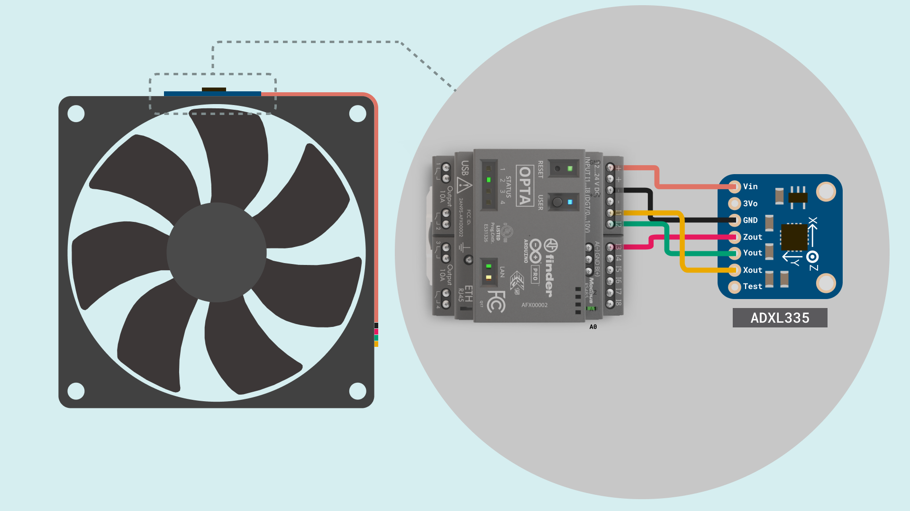
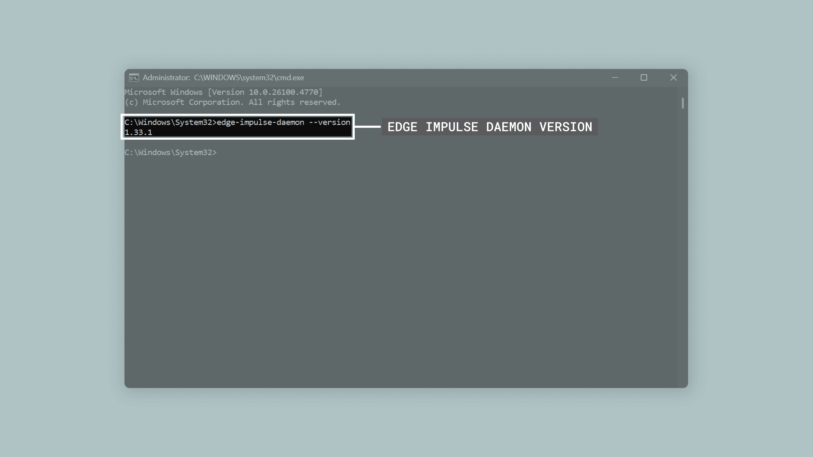
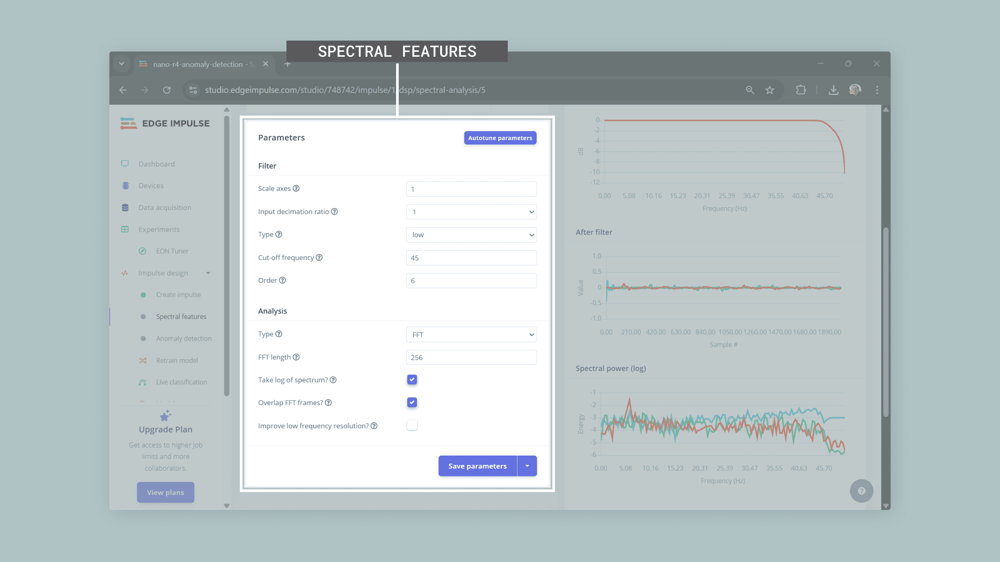
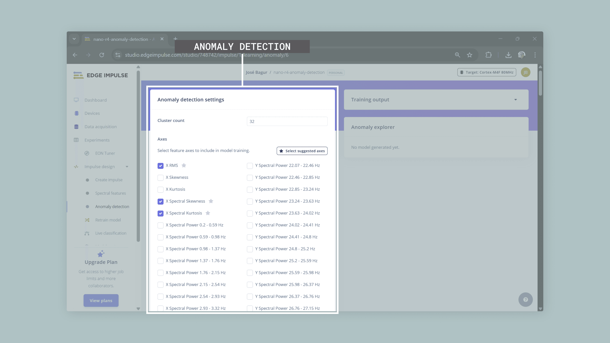
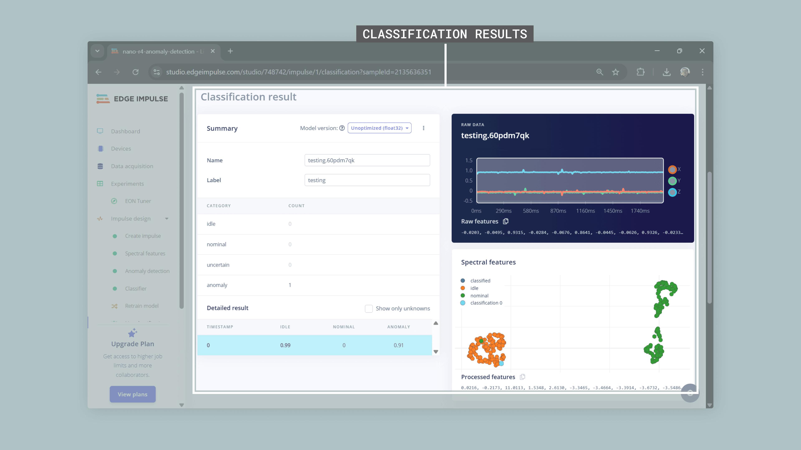
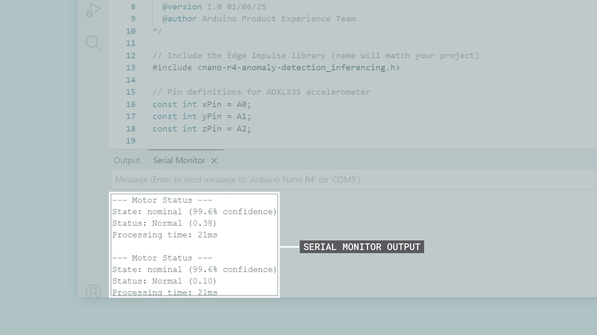

## Introduction

Motor condition monitoring is essential in industrial settings, where unexpected equipment failures can lead to significant downtime and high maintenance costs. This application note shows how to build a motor anomaly detection system using the Opta™ micro PLC, an accelerometer and Edge Impulse®.

The developed system monitors vibration patterns in real-time to identify unusual operating conditions that may signal mechanical problems, wear or potential failures. The system uses machine learning to detect vibration patterns that differ from normal motor operation, enabling predictive maintenance. By leveraging Opta's industrial-grade design and powerful dual-core microcontroller, this solution integrates directly into existing industrial environments with DIN rail mounting and robust I/O capabilities.

## Goals

This application note will help you to:

- Build a motor anomaly detection system that monitors vibration patterns in real-time using an accelerometer connected to the Opta's analog inputs.
- Collect and analyze vibration data from motors to create baseline patterns and detect changes.
- Train a machine learning model using Edge Impulse to detect anomalies based on vibration data.
- Deploy the trained model directly to the Opta™ for real-time anomaly detection without needing cloud connectivity.
- Set up visual feedback through the board's built-in user LED and relay outputs to signal detected anomalies and system status.
- Create industrial predictive maintenance solutions using the Opta's edge computing capabilities.

## Hardware and Software Requirements

### Hardware Requirements

- [Opta™ WiFi](https://store.arduino.cc/products/opta-wifi) (x1) (Opta™ Lite or Opta™ RS485 variants are also compatible)
- [ADXL335 accelerometer breakout board](https://www.adafruit.com/product/163) (x1)
- [USB-C® cable](https://store.arduino.cc/products/usb-cable2in1-type-c) (x1)
- 12-24 VDC power supply for the Opta™ (x1)
- Jumper wires or industrial cabling for connecting the accelerometer to screw terminals (x1 set)
- Motor or rotating equipment for testing (for example, an industrial motor or fan) (x1)
- Power supply for the motor (if needed) (x1)

### Software Requirements

- [Arduino IDE 2.0+](https://www.arduino.cc/en/software) or [Arduino Web Editor](https://create.arduino.cc/editor)
- [Arduino Mbed OS Opta Boards core](https://github.com/arduino/ArduinoCore-mbed) (needed for the Opta™)
- [Edge Impulse account](https://studio.edgeimpulse.com/) (free tier available)
- [Edge Impulse CLI tools](https://docs.edgeimpulse.com/docs/cli-installation) for data collection

***The Opta™ features a dual-core STM32H747XI microcontroller with an Arm® Cortex®-M7 running at 480 MHz and an Arm® Cortex®-M4 running at 240 MHz, 2 MB Flash memory, 1 MB SRAM and 16 MB external QSPI Flash, providing substantial processing power and memory for machine learning tasks. For complete hardware specifications, see the [Opta™ documentation](https://docs.arduino.cc/hardware/opta/).***

## Hardware Setup Overview

The electrical connections for the motor anomaly detection system are shown in the diagram below.

**ADXL335 Accelerometer Setup**



This diagram shows the system components using the ADXL335 accelerometer. **The Opta™ acts as the main controller**, while **the ADXL335 accelerometer collects vibration data** from the motor through analog connections to the Opta™'s configurable input terminals.

The ADXL335 accelerometer connects to the Opta™ using its configurable analog input terminals (`I1`, `I2`, `I3`). The Opta™ is powered by a 12-24 VDC external power supply, while the ADXL335 requires a separate regulated +3.3 VDC or +5 VDC power source through its breakout board's onboard voltage regulator.

***__Important note__: The Opta™'s analog inputs are designed for 0-10 VDC industrial signals. The ADXL335 outputs a lower voltage range (typically 0-3.3 VDC). While the sensor signals can be read directly, the effective resolution will be reduced since only the lower portion of the input range is used. For production deployments, consider adding signal conditioning circuitry to scale the ADXL335 output to the full 0-10 VDC input range.***

***__Important note__: This power setup is for testing and demonstration only. In real industrial environments, proper power system design should include electrical isolation, noise filtering, surge protection and compliance with industrial safety standards for your specific application.***

### Circuit Connections

The following connections establish the interface between the Opta™ and the ADXL335 accelerometer:

| **ADXL335 Pin** | **Opta™ Terminal** |          **Description**          |
|:---------------:|:------------------:|:---------------------------------:|
|      `VCC`      |         -          | External +5 VDC regulated supply  |
|      `GND`      |         -          | Common ground reference           |
|       `X`       |        `I1`        |       X-axis analog output        |
|       `Y`       |        `I2`        |       Y-axis analog output        |
|       `Z`       |        `I3`        |       Z-axis analog output        |
|       `ST`      |   Not connected    |      Self-test (optional)         |

***__Important note__: The ADXL335 breakout board requires a separate regulated power supply (+3.3 VDC or +5 VDC depending on the breakout board version), as the Opta™'s screw terminals are designed for industrial I/O signaling rather than powering external sensors. Ensure a common ground reference between the ADXL335 power supply and the Opta™.***

### Physical Mounting Considerations

Proper accelerometer mounting is essential for effective vibration monitoring. The sensor must be securely attached to the motor housing or equipment using appropriate mechanical fasteners.  A good mechanical connection between the mounting surface and the sensor ensures accurate vibration transmission and reliable measurements.

The Opta™ itself should be installed on a standard EN60715 DIN rail, keeping it away from high-vibration areas to avoid false readings. Route sensor cables separately from power lines to minimize electrical noise interference.

***For this application note, we will use a computer cooling fan to simulate motor operation and demonstrate the anomaly detection system. The ADXL335 accelerometer can be mounted on top of the fan using a custom 3D-printed enclosure, providing a stable and consistent mounting solution for testing.***

## Understanding Motor Vibration Analysis

Motor vibrations contain valuable information about the mechanical condition of the equipment. Normal motor operation produces characteristic vibration patterns that stay relatively consistent during healthy operation. Abnormal conditions show up as changes in vibration amplitude, frequency content or timing patterns.

### Common Motor Faults

Common motor faults that can be detected through vibration analysis include:

- **Bearing wear**: Creates higher frequency components and increased vibration levels across all axes.
- **Misalignment**: Produces specific frequency patterns related to rotational speed, typically appearing in radial directions.
- **Imbalance**: Results in increased vibration at the main rotational frequency, primarily in radial directions.
- **Looseness**: Causes widespread increases in vibration across multiple frequencies and directions.
- **Electrical issues**: May create vibrations at twice the line frequency due to magnetic field changes.

### The Role of Sensors in Vibration Monitoring

Effective motor condition monitoring relies on sensors that can accurately detect and measure mechanical vibrations. These sensors must capture the small changes in vibration patterns that indicate developing faults or abnormal operating conditions. The choice of sensor technology directly affects the system's ability to detect problems early and provide reliable maintenance information.

**ADXL335 Analog Accelerometer**

The [ADXL335 accelerometer](https://www.analog.com/media/en/technical-documentation/data-sheets/adxl335.pdf) provides accurate, real-time measurements of motor vibrations with several key advantages:

- **3-axis measurement**: Captures vibrations in X, Y, and Z directions.
- **Analog output**: Direct compatibility with the Opta's analog input terminals without needing complex digital interfaces.
- **Low power consumption**: Only 320 μA current consumption makes it suitable for continuous monitoring applications.
- **Wide frequency range**: Up to 1600 Hz bandwidth on the X and Y axes (550 Hz on the Z axis) covers most common motor fault frequencies across all three measurement directions.

The ADXL335 technical specifications include:

| **Specification** |          **Value**          |                     **Notes**                    |
|:-----------------:|:---------------------------:|:------------------------------------------------:|
| Measurement range |       ±3g on all axes       |   Appropriate for common motor vibration levels  |
|    Sensitivity    |       300 mV/g typical      |  Provides good resolution for vibration analysis. The code uses a measured calibrated value of 303 mV/g for this specific breakout board. |
|       Output      | Ratiometric analog voltages |       +1.65 VDC represents 0g acceleration       |
|    Power supply   |      +1.8 to +3.6 VDC      | Usually regulated to +3.3 VDC on breakout boards |

Signal processing considerations include selecting appropriate sampling rates based on the expected frequency content of motor vibrations, typically following the Nyquist rule to avoid aliasing. The Opta's STM32H747XI microcontroller provides a high-resolution ADC and substantial processing power on both its Cortex®-M7 and Cortex®-M4 cores, enabling real-time signal analysis and machine learning inference simultaneously.

## Simple Vibration Monitor Example Sketch

Now that we have covered the hardware components and the basics of vibration analysis, let's look at the software that enables vibration data collection. Before implementing intelligent anomaly detection, we need to collect training data representing normal motor operation for Edge Impulse, a platform that simplifies embedded AI development.

Edge Impulse needs training data in a specific format to build effective anomaly detection models. Our data collection sketch formats the accelerometer readings so Edge Impulse can analyze normal operation patterns and create a model that identifies when new data differs from these patterns.

This section breaks down the example sketch and guides you through its functionality. We will explore how the accelerometer is initialized, how vibration data is collected at consistent intervals, and how the results are formatted for Edge Impulse data collection and model training.

The complete example sketch is shown below.

```arduino
/**
  Motor Vibration Data Collection for Edge Impulse
  Name: motor_vibration_collector.ino
  Purpose: This sketch reads 3-axis acceleration data from an ADXL335 
  accelerometer connected to an Opta™ micro PLC. 
  The data is formatted for Edge Impulse data collection and training.
  
  @version 1.0 01/06/25
  @author Arduino Product Experience Team
*/

// Pin definitions for ADXL335 (mapped to Opta™ input terminals)
// I1 = A0, I2 = A1, I3 = A2
const int xPin = A0;  // I1: X-axis
const int yPin = A1;  // I2: Y-axis
const int zPin = A2;  // I3: Z-axis

// Opta™ ADC specifications
const float VOLTAGE_MAX = 3.3;    // Maximum voltage at the MCU ADC
const float RESOLUTION  = 4095.0; // 12-bit ADC max value
const float DIVIDER     = 0.3034; // Opta™ internal voltage divider ratio

// ADXL335 specifications (calibrated values for this specific breakout board)
const float supplyMidPointmV = 1237.0;  // Measured 0g bias point in mV
const float mVperg = 303.0;             // Measured sensitivity (mV/g)

// Sampling parameters
const int sampleRate = 100;                          // 100 Hz
const unsigned long sampleTime = 1000 / sampleRate;  // 10 ms between samples

// Data collection variables
unsigned long lastSample = 0;

void setup() {
  Serial.begin(115200);
  while (!Serial);

  // Configure ADC resolution to 12 bits
  analogReadResolution(12);

  Serial.println("- Motor Vibration Data Collector (ADXL335 + Opta)");
  Serial.println("- Analog accelerometer initialized");
  Serial.println("- Streaming continuous data for Edge Impulse");
  Serial.println("- Data format: X_accel,Y_accel,Z_accel");

  delay(1000);
}

void loop() {
  unsigned long currentTime = millis();

  if (currentTime - lastSample >= sampleTime) {
    // Read raw ADC values from Opta™ analog input terminals
    int xRaw = analogRead(xPin);
    int yRaw = analogRead(yPin);
    int zRaw = analogRead(zPin);

    // Convert ADC values to actual input voltage (mV) 
    // accounting for Opta™ internal voltage divider
    float xVoltmV = (xRaw * (VOLTAGE_MAX / RESOLUTION) / DIVIDER) * 1000.0;
    float yVoltmV = (yRaw * (VOLTAGE_MAX / RESOLUTION) / DIVIDER) * 1000.0;
    float zVoltmV = (zRaw * (VOLTAGE_MAX / RESOLUTION) / DIVIDER) * 1000.0;

    // Convert to acceleration in g units
    float xAccel = (xVoltmV - supplyMidPointmV) / mVperg;
    float yAccel = (yVoltmV - supplyMidPointmV) / mVperg;
    float zAccel = (zVoltmV - supplyMidPointmV) / mVperg;

    // Output CSV format for Edge Impulse
    Serial.print(xAccel, 4);
    Serial.print(",");
    Serial.print(yAccel, 4);
    Serial.print(",");
    Serial.println(zAccel, 4);

    lastSample = currentTime;
  }
}
```

The following sections will help you understand the main components of the example sketch, which can be divided into the following areas:

- Hardware configuration and calibration
- Data collection timing and control
- Signal processing and conversion
- Edge Impulse data formatting

### Hardware Configuration and Calibration

Before we can collect vibration data, we need to configure the Opta™ to interface with the ADXL335 accelerometer and set its calibration parameters. The Opta™'s input terminals (`I1`-`I8`) are mapped to Arduino pin names `A0`-`A7` in the board's core. Each terminal features an internal voltage divider that scales the input voltage down to the microcontroller's ADC range.

The configuration includes terminal assignments, ADC specifications and calibration parameters:

```arduino
// Pin definitions for ADXL335 (mapped to Opta™ input terminals)
// I1 = A0, I2 = A1, I3 = A2
const int xPin = A0;  // Terminal I1: X-axis
const int yPin = A1;  // Terminal I2: Y-axis
const int zPin = A2;  // Terminal I3: Z-axis

// Opta™ ADC specifications
const float VOLTAGE_MAX = 3.3;    // Maximum voltage at the MCU ADC
const float RESOLUTION  = 4095.0; // 12-bit ADC max value
const float DIVIDER     = 0.3034; // Opta™ internal voltage divider ratio

// ADXL335 specifications (calibrated values for this specific breakout board)
const float supplyMidPointmV = 1237.0;  // Measured 0g bias point in mV
const float mVperg = 303.0;             // Measured sensitivity (mV/g)
```

In this code:

- Terminal assignments map each accelerometer axis to specific input terminals on the Opta™ (I1, I2, I3 corresponding to `A0`, `A1`, `A2` in the Arduino core)
- ADC specifications define the 12-bit resolution, the 3.3 VDC maximum voltage at the microcontroller and the internal voltage divider ratio of approximately 0.3034
- ADXL335 specifications use calibrated values measured from the actual breakout board
- The voltage divider ratio is essential for the Opta™: the input terminals accept 0-10 VDC, but the internal voltage divider scales this down to approximately 0-3 VDC for the microcontroller's ADC

***__Important note__: ADXL335 breakout boards typically include onboard voltage regulators that convert the input voltage to a lower voltage (usually +3.3 VDC or less) to power the accelerometer chip. This means the actual supply voltage to the ADXL335 may be different from what you expect. The values shown in this code (`supplyMidPointmV = 1237.0` and `mVperg = 303.0`) are calibrated for a specific breakout board and may need adjustment for your hardware.***

***__Important note__: The ADXL335 outputs a voltage range of approximately 0-3.3 VDC, which is only the lower portion of the Opta™'s 0-10 VDC analog input range. While the sensor signals can be read correctly, the effective ADC resolution is reduced because only about one-third of the input range is used. For production deployments requiring higher resolution, consider adding signal conditioning circuitry (such as an operational amplifier configured as a non-inverting amplifier) to scale the ADXL335 output to better match the Opta™'s full 0-10 VDC input range.***

### Data Collection Timing and Control

To ensure accurate vibration analysis and successful machine learning training, we need consistent timing for data collection. These parameters control how data is gathered:

```arduino
// Sampling parameters
const int sampleRate = 100;                          // 100 Hz
const unsigned long sampleTime = 1000 / sampleRate;  // 10 ms between samples
```

In this code:

- Sample rate of 100 Hz captures enough frequency response for detecting most motor faults
- Sample time calculation automatically determines the precise timing needed between measurements
- The system streams data continuously without requiring manual start/stop commands

### Signal Processing and Conversion

Once we have the raw sensor readings, we need to convert them into useful acceleration values. The conversion process for the Opta™ involves an additional step compared to typical Arduino boards: accounting for the internal voltage divider that scales the 0-10 VDC input range down to the microcontroller's ADC range.

The conversion transforms ADC readings into calibrated acceleration data in three stages: raw ADC readings to MCU-voltage, MCU-voltage to the actual input voltage (reversing the divider), and the actual input voltage to acceleration in g units.

```arduino
// Read raw ADC values from Opta™ analog input terminals
int xRaw = analogRead(xPin);
int yRaw = analogRead(yPin);
int zRaw = analogRead(zPin);

// Convert ADC values to actual input voltage (mV) 
// accounting for Opta™ internal voltage divider
float xVoltmV = (xRaw * (VOLTAGE_MAX / RESOLUTION) / DIVIDER) * 1000.0;
float yVoltmV = (yRaw * (VOLTAGE_MAX / RESOLUTION) / DIVIDER) * 1000.0;
float zVoltmV = (zRaw * (VOLTAGE_MAX / RESOLUTION) / DIVIDER) * 1000.0;

// Convert to acceleration in g units
float xAccel = (xVoltmV - supplyMidPointmV) / mVperg;
float yAccel = (yVoltmV - supplyMidPointmV) / mVperg;
float zAccel = (zVoltmV - supplyMidPointmV) / mVperg;
```

In this code:

- Timing control maintains consistent sample intervals, which is essential for proper frequency analysis
- ADC conversion uses Opta™'s 12-bit resolution and accounts for the internal voltage divider by dividing by the `DIVIDER` constant (0.3034), effectively recovering the actual voltage at the input terminal
- The multiplication by 1000.0 converts the result from volts to millivolts, matching the ADXL335 calibration values
- Acceleration calculation applies the calibrated zero-point and sensitivity values to get accurate g-force measurements

***__Important note__: For accurate measurements, you should calibrate your specific ADXL335 breakout board by placing it flat on a table with the Z-axis pointing up and measuring the actual voltage outputs. The X and Y axes should read approximately the same voltage (this is your zero-g bias point), while the Z-axis should read higher due to gravity (1g acceleration). The difference between the Z-axis voltage and the zero-g bias point gives you the sensitivity in mV/g. This calibration accounts for variations in onboard regulators and manufacturing tolerances.***

### Edge Impulse Data Formatting

The final step formats our acceleration data so it can be used with Edge Impulse data collection tools:

```arduino
// Output CSV format for Edge Impulse
Serial.print(xAccel, 4);
Serial.print(",");
Serial.print(yAccel, 4);
Serial.print(",");
Serial.println(zAccel, 4);
```

In this code:

- CSV format with four decimal places gives us the precision needed for machine learning training
- Single-line output per sample makes it easy to integrate with the Edge Impulse data forwarder
- Comma separation follows the standard CSV format that most data processing tools expect

After uploading the example sketch to the Opta™, you should see output in the Arduino IDE's Serial Monitor similar to this:


### Complete Example Sketch

Download the complete data collection example sketch [here](assets/motor_vibration_collector.zip).

[](assets/motor_vibration_collector.zip)

## Connecting the Vibration Monitor to Edge Impulse

As vibration-based condition monitoring becomes more important for predictive maintenance, connecting our data collection system to Edge Impulse enables the development of intelligent anomaly detection models. Edge Impulse provides a complete platform for embedded machine learning, allowing us to transform raw vibration data into useful insights about motor health.

In this section, we will connect the vibration monitor to Edge Impulse platform to collect training data, develop machine learning models and deploy intelligent anomaly detection directly to the Opta™. This connection transforms our simple vibration monitor into an intelligent system that can detect motor anomalies without needing cloud connectivity.

***If you are new to Edge Impulse, please check out [this tutorial](https://docs.edgeimpulse.com/docs/tutorials/end-to-end-tutorials/time-series/continuous-motion-recognition/) for an introduction to the platform.***

### Setting up Edge Impulse Account and Project

The first step involves creating an Edge Impulse account and setting up a new project for motor anomaly detection. These steps establish the foundation for machine learning model development:

1. **Create Account**: Register for a free Edge Impulse account at [studio.edgeimpulse.com](https://studio.edgeimpulse.com/)
2. **New Project**: Create a new project with the following settings:

- Enter a project name (for example, "`opta-anomaly-detection`")
- Choose project type: Personal (free tier with 60 min job limit, 4 GB data limit)
- Choose project setting: Private (recommended for this application)


3. **Project Configuration**: Once created, the project will be ready for data collection. Sampling frequency and window settings will be configured later during impulse design.

### Data Collection with Edge Impulse CLI

The Edge Impulse CLI provides tools for streaming data directly from the Arduino to the Edge Impulse platform. This eliminates manual file transfers and enables efficient data collection.

#### Installing Edge Impulse CLI

Before you can collect data from the Arduino, you need to install the Edge Impulse CLI tools on your computer. The installation process varies depending on your operating system.

Prerequisites:

- Node.js 14 or higher
- Python 3

For detailed installation instructions specific to your operating system, follow the [official Edge Impulse CLI installation guide](https://docs.edgeimpulse.com/docs/tools/edge-impulse-cli/cli-installation).

Verify the installation with the following command:

```bash
edge-impulse-daemon --version
```



#### Setting up Data Forwarding

Now that you have the CLI installed, you can set up data forwarding to stream vibration data directly from your Opta™ to Edge Impulse.

Connect your Opta™ to your computer via USB-C cable and upload the data collection sketch. Then open a terminal and run the following command:

```bash
edge-impulse-data-forwarder
```

The tool will guide you through the setup process:

1. **Login**: Enter your Edge Impulse username/email and password when prompted
2. **Select Device**: Choose the correct serial port for your Arduino (for example, `COM5`)
3. **Data Detection**: The tool will automatically detect the data frequency (100 Hz) and number of sensor axes (3)
4. **Name Axes**: When asked "What do you want to call them?", enter: `X`,`Y`,`Z`
5. **Device Name**: Give your device a name (for example, `opta`)
6. **Project Connection**: If you have multiple projects, the tool will ask which Edge Impulse project you want to connect the device to. Select your motor anomaly detection project.


Once configured, the forwarder will stream data from your Opta™ board to Edge Impulse. You can verify the device connection by checking the "Devices" tab in Edge Impulse Studio. You can then start collecting training data for your machine learning model.


#### Data Collection Process

With the data forwarder running, you can now collect training data for your anomaly detection model. For effective anomaly detection, you need high-quality data representing normal motor operation in different states.

Start by mounting the accelerometer securely to the motor housing. You will collect two types of normal operation data:

1. **Idle data collection**: With the motor turned off, **collect 10 to 15 minutes of "idle" operation** data through multiple two second windows. This captures the baseline vibration environment without motor operation. Label all data as `idle` in Edge Impulse Studio.

2. **Nominal data collection**: With the motor running under normal operating conditions, **collect 10 to 15 minutes of "nominal" operation** data through multiple two second windows. Vary motor load conditions slightly to capture different normal operating scenarios. Label all data as `nominal` in Edge Impulse Studio.

Edge Impulse can automatically split your collected data into **training (80%) and testing (20%) sets**. The 20 to 30 minutes total of data ensures you have enough samples for both training the model and validating its performance on unseen data.


After data collection, review the collected samples in Edge Impulse Studio for consistency. Check for proper amplitude ranges and no clipping, verify sample rate consistency and timing accuracy and remove any corrupted or unusual samples from the training set.

***__Important note__: The anomaly detection model learns what "normal" looks like from both idle and nominal data. Any future vibration patterns that significantly differ from these learned patterns will be flagged as anomalies. This approach allows the system to detect unknown fault conditions without needing examples of actual motor failures.***
   
### Training the Anomaly Detection Model

Once you have collected sufficient `idle` and `nominal` operation data, the next step involves configuring and training the machine learning model for anomaly detection.

#### Impulse Design Configuration

Within Edge Impulse Studio, configure the impulse design with appropriate processing and learning blocks. Navigate to the "Impulse design" tab and set up the following blocks: 

1. **Input Block**: Configure time series data with window size of 2000 ms, window increase of 80 ms, and frequency of 100 Hz to match your data collection sampling rate.
2. **Processing Block**: Add "Spectral Analysis" block for frequency domain feature extraction
3. **Classification Learning Block**: Add "Classification (Keras)" to distinguish between `idle` and `nominal` operating states.
4. **Learning Block**: Select "Anomaly Detection (K-means)" for unsupervised learning approach


This dual approach provides a more robust monitoring system where the classifier identifies the current operating state (idle vs nominal) while the anomaly detector flags unusual patterns that don't fit either normal category.

#### Feature Extraction Configuration

The spectral analysis block extracts relevant features from the raw vibration signals. Configure the following parameters for optimal motor fault detection:

- **Type**: Low-pass filter to focus on motor fault frequencies
- **Cut-off frequency**: 45 Hz to capture relevant motor vibration characteristics while staying below the Nyquist frequency
- **Order**: 6 for effective filtering
- **FFT length**: 256 points for sufficient frequency resolution
- **Take log of spectrum**: Enable this option to compress the dynamic range of the frequency data
- **Overlap FFT frames**: Enable this option to increase the number of features extracted from each window



***__Important note__: The spectral analysis converts time-domain vibration signals into frequency-domain features. This is crucial because motor faults often appear as specific frequency patterns (like bearing wear creating high-frequency components or imbalance showing up at rotational frequency). The K-means clustering algorithm groups similar frequency patterns together, creating a map of normal operation that can identify when new data doesn't fit the established patterns.***

#### Model Training Process

Follow these steps to train the anomaly detection model using the collected idle and nominal operation data:

1. **Generate Features**: Before clicking "Generate features", enable "Calculate feature importance" to identify which frequency bands are most relevant for distinguishing between idle and nominal states. Then click "Generate features" to extract spectral features from all training data. Edge Impulse will process your data and create the feature vectors needed for training.
2. **Feature Explorer**: Review the feature explorer visualization to verify data quality and feature separation between your idle and nominal classes.


3. **Train Classification Model**:Navigate to the "Classifier" tab and configure the neural network with the following settings:

- Number of training cycles: 30
- Learning rate: 0.0005
- Neural network architecture: Configure dense layers with 32 neurons (first layer) and 16 neurons (second layer) to provide good pattern recognition capability for vibration data. Start training and monitor the accuracy metrics.


1. **Train Anomaly Detection Model**: Navigate to the "Anomaly detection" tab and configure K-means clustering with 32 clusters for pattern recognition. Use "Select suggested axes" to automatically choose the most relevant spectral features based on the calculated feature importance, then start training.



5. **Model Validation**: Test both models using the validation data to ensure the classifier accurately distinguishes between idle and nominal states, and the anomaly detector properly identifies normal operation patterns.

***__Important note__: The feature explorer shows how well your idle and nominal data separate in the feature space. Good separation means the model can clearly distinguish between different operating states. If the data points overlap significantly, you may need to collect more diverse data or adjust your sensor mounting.***

The classification model learns to distinguish between known operating states, while the anomaly detection model creates clusters representing all normal operation patterns. This combination allows the system to both identify the current operating mode and detect unusual conditions that don't fit any normal pattern.


***__Important note__: The 32 clusters create a detailed map of normal operation patterns. Each cluster represents a different "type" of normal vibration signature. When new data doesn't fit well into any existing cluster, it's flagged as an anomaly. More clusters provide finer detail but require more training data.***

#### Model Validation and Testing

After training completion, validate both model performances using the following methods:

- **Live Classification**: Use the "Live classification" feature of Edge Impulse to test both the classifier and anomaly detector with new motor data to verify their detection capabilities
- **Classification Performance**: Review the confusion matrix and accuracy metrics for the neural network classifier to ensure it properly distinguishes between idle and nominal states
- **Anomaly Detection Analysis**: Review the clustering visualization and anomaly scores to understand how well the model separates normal patterns
- **Threshold Adjustment**: During deployment and real-world testing, you may need to adjust the anomaly detection threshold based on observed false alarm rates and detection sensitivity
- **Validation Testing**: Test both models with known normal conditions to reduce false positives and ensure reliable operation



***__Important note__: The anomaly threshold is critical for system performance. A lower threshold makes the system more sensitive and catches subtle problems but may trigger false alarms. A higher threshold reduces false alarms but might miss early-stage faults.***

### Model Deployment

After successful training and validation of both models, deploy them as an Arduino library for embedded inference:

1. **Deployment Section**: Navigate to the "Deployment" tab in Edge Impulse Studio
2. **Arduino Library**: Select "Arduino library" as the deployment target
3. **Optimization Settings**: Choose `int8` quantization for memory efficiency on the Opta™
4. **Model Analysis**:Review memory usage and inference timing estimates
5. **Download Library**: Download the generated Arduino library ZIP file
6. **Library Installation**: Install in the Arduino IDE using "Sketch > Include Library > Add .ZIP Library"


The generated library includes optimized inference code for both the neural network classifier and K-means anomaly detector, specifically compiled for the Opta's Arm® Cortex®-M4 and M7 processors. This enables efficient real-time classification of operating states (idle/nominal) and detection of anomalous conditions with low computational overhead.

## Improving the Vibration Monitor with Machine Learning

Now that we have trained our machine learning models, we can create a smart vibration monitor that automatically detects motor problems in real-time.

The enhanced system does two things: it identifies whether the motor is running (nominal) or stopped (idle), and it alerts you when it detects unusual vibration patterns that might indicate a problem. This all happens directly on the Opta™ without needing an internet connection. The system leverages the dual-core STM32H747XI microcontroller's processing capabilities for edge inference.

The smart monitoring system can do the following:

- Tell if the motor is running or stopped
- Detect unusual vibrations that might indicate problems
- Flash a status LED and activate a relay output when something seems wrong
- Work continuously without needing internet or cloud services

The complete enhanced example sketch is shown below:

```arduino
/**
  Intelligent Motor Anomaly Detection System
  Name: motor_anomaly_detection.ino
  Purpose: This sketch implements real-time motor anomaly detection using
  an ADXL335 accelerometer and an Edge Impulse machine learning model 
  deployed on the Opta™ micro PLC for predictive maintenance.
  
  @version 1.0 01/06/25
  @author Arduino Product Experience Team
*/

// Include the Edge Impulse library (name will match your project)
#include <opta-anomaly-detection_inferencing.h>

// Pin definitions for ADXL335 accelerometer (mapped to Opta™ input terminals)
// I1 = A0, I2 = A1, I3 = A2
const int xPin = A0;  // Terminal I1: X-axis
const int yPin = A1;  // Terminal I2: Y-axis
const int zPin = A2;  // Terminal I3: Z-axis

// Opta™ ADC specifications
const float VOLTAGE_MAX = 3.3;    // Maximum voltage at the MCU ADC
const float RESOLUTION  = 4095.0; // 12-bit ADC max value
const float DIVIDER     = 0.3034; // Opta™ internal voltage divider ratio

// ADXL335 specifications (calibrated values for this specific breakout board)
const float supplyMidPointmV = 1237.0;  // Measured 0g bias point in mV
const float mVperg = 303.0;             // Measured sensitivity (mV/g)

// Edge Impulse model parameters
const int samplingFreq = EI_CLASSIFIER_FREQUENCY;
const int sampleLength = EI_CLASSIFIER_RAW_SAMPLE_COUNT;

// Data buffer for model inference
float features[EI_CLASSIFIER_DSP_INPUT_FRAME_SIZE];
int featureIndex = 0;

// Detection parameters
const float anomalyThreshold = 0.6;      // Increased from 0.3 to reduce false alarms
const float confidenceThreshold = 0.7;   // Minimum confidence for classification
const int alertDuration = 2000;          // Minimum time between alerts (ms)

// Opta™ status LEDs and relay outputs
// LED_D0 to LED_D3 are the four status LEDs on the Opta™
// D0 to D3 are the four relay outputs
const int statusLED = LED_D0;            // Status LED for system state
const int alertLED  = LED_D1;            // Alert LED for anomaly indication
const int alertRelay = D0;              // Relay output for external alarm

// System status variables
unsigned long lastInference = 0;
unsigned long lastAlert = 0;
bool systemReady = false;

// Performance tracking
int totalInferences = 0;
int anomalyCount = 0;

/**
  Initializes the accelerometer, LEDs, relay outputs and machine learning
  system. Configures the Opta™ for optimal performance with the Edge Impulse
  model and prepares for real-time anomaly detection.
*/
void setup() {
  // Initialize serial communication
  Serial.begin(115200);
  while (!Serial);

  // Configure ADC resolution to 12 bits
  analogReadResolution(12);

  ei_printf("Motor Anomaly Detection System (ADXL335 + Opta)\n");
  ei_printf("Analog accelerometer initialized\n");

  // Configure status LEDs
  pinMode(statusLED, OUTPUT);
  pinMode(alertLED, OUTPUT);
  digitalWrite(statusLED, LOW);
  digitalWrite(alertLED, LOW);

  // Configure relay output for external alarm
  pinMode(alertRelay, OUTPUT);
  digitalWrite(alertRelay, LOW);

  ei_printf("Initializing Edge Impulse model...\n");

  // Display model information
  ei_printf("Model: %s\n", EI_CLASSIFIER_PROJECT_NAME);
  ei_printf("Sampling frequency: %d Hz\n", samplingFreq);
  ei_printf("Sample window: %.1f seconds\n", (float)sampleLength / samplingFreq);
  ei_printf("Anomaly threshold: %.2f\n", anomalyThreshold);
  ei_printf("Confidence threshold: %.2f\n", confidenceThreshold);

  // Allow sensor stabilization
  delay(2000);
  systemReady = true;

  // Turn on status LED to indicate system is running
  digitalWrite(statusLED, HIGH);

  ei_printf("System ready - Starting motor monitoring...\n");
  ei_printf("Classifications, Anomaly Score, Status, Timing\n");
}

/**
  Main loop that continuously monitors motor vibrations and performs
  real-time classification and anomaly detection using the embedded
  machine learning models.
*/
void loop() {
  if (systemReady) {
    // Collect vibration data for inference
    collectVibrationWindow();

    // Perform classification and anomaly detection
    performInference();

    // Brief delay between inference cycles
    delay(500);
  }
}

/**
  Collects a complete window of vibration data for machine learning inference.
  Reads the ADXL335 accelerometer through the Opta™ analog input terminals.
*/
void collectVibrationWindow() {
  featureIndex = 0;
  unsigned long sampleInterval = 1000000 / samplingFreq; // Microseconds per sample

  // Collect samples according to model requirements
  for (int sample = 0; sample < (sampleLength / 3); sample++) {
    unsigned long sampleStart = micros();

    // Read raw ADC values from Opta™ analog input terminals
    int xRaw = analogRead(xPin);
    int yRaw = analogRead(yPin);
    int zRaw = analogRead(zPin);

    // Convert ADC values to actual input voltage (mV)
    // accounting for Opta™ internal voltage divider
    float xVoltmV = (xRaw * (VOLTAGE_MAX / RESOLUTION) / DIVIDER) * 1000.0;
    float yVoltmV = (yRaw * (VOLTAGE_MAX / RESOLUTION) / DIVIDER) * 1000.0;
    float zVoltmV = (zRaw * (VOLTAGE_MAX / RESOLUTION) / DIVIDER) * 1000.0;

    // Convert to acceleration in g units
    float xAccel = (xVoltmV - supplyMidPointmV) / mVperg;
    float yAccel = (yVoltmV - supplyMidPointmV) / mVperg;
    float zAccel = (zVoltmV - supplyMidPointmV) / mVperg;

    // Store in feature buffer for inference
    features[featureIndex++] = xAccel;
    features[featureIndex++] = yAccel;
    features[featureIndex++] = zAccel;

    // Wait for next sample time
    while (micros() - sampleStart < sampleInterval) {
      // Precise timing wait
    }
  }
}

/**
  Performs classification and anomaly detection with improved confidence
  handling and better false alarm reduction.
*/
void performInference() {
  ei_impulse_result_t result = { 0 };

  // Create signal structure for Edge Impulse
  signal_t features_signal;
  features_signal.total_length = sampleLength;
  features_signal.get_data = &getFeatureData;

  // Run the Edge Impulse classifier
  EI_IMPULSE_ERROR inferenceResult = run_classifier(&features_signal, &result, false);

  if (inferenceResult == EI_IMPULSE_OK) {
    totalInferences++;

    // Find the classification with highest confidence
    String motorState = "uncertain";
    float maxConfidence = 0.0;
    String bestClass = "unknown";

    for (uint16_t i = 0; i < EI_CLASSIFIER_LABEL_COUNT; i++) {
      if (result.classification[i].value > maxConfidence) {
        maxConfidence = result.classification[i].value;
        bestClass = ei_classifier_inferencing_categories[i];
      }
    }

    // Apply confidence threshold
    if (maxConfidence >= confidenceThreshold) {
      motorState = bestClass;
    }

    // Simplified multiline output
    ei_printf("\n--- Motor Status ---\n");
    ei_printf("State: %s (%.1f%% confidence)\n", motorState.c_str(), maxConfidence * 100);

#if EI_CLASSIFIER_HAS_ANOMALY
    bool isAnomaly = false;

    if (result.anomaly > anomalyThreshold) {
      isAnomaly = true;
      anomalyCount++;
      ei_printf("Alert: ANOMALY DETECTED (%.2f)\n", result.anomaly);
    } else {
      ei_printf("Status: Normal (%.2f)\n", result.anomaly);
      // Ensure alert outputs are off during normal operation
      digitalWrite(alertLED, LOW);
      digitalWrite(alertRelay, LOW);
    }

    if (isAnomaly) {
      triggerAnomalyAlert();
    }
#else
    ei_printf("Status: %s\n", motorState.c_str());
#endif

    ei_printf("Processing time: %dms\n", result.timing.dsp + result.timing.classification);

    // Show performance statistics every 10 inferences
    if (totalInferences % 10 == 0) {
      float anomalyRate = (float)anomalyCount / totalInferences * 100.0;
      ei_printf("Stats: %.1f%% anomalies detected (%d/%d)\n", anomalyRate, anomalyCount, totalInferences);
    }

    // Update timing
    lastInference = millis();

  } else {
    // Handle inference errors
    ei_printf("Inference error: %d\n", inferenceResult);

    // Flash alert LED to indicate system error
    digitalWrite(alertLED, HIGH);
    delay(100);
    digitalWrite(alertLED, LOW);
  }
}

/**
  Enhanced anomaly alert with rate limiting and industrial outputs.
  Activates both the status LED and relay output for external alarm systems.
*/
void triggerAnomalyAlert() {
  unsigned long currentTime = millis();

  // Rate limit alerts to prevent excessive notifications
  if (currentTime - lastAlert > alertDuration) {
    // Activate relay output for external alarm
    digitalWrite(alertRelay, HIGH);

    // Visual alert pattern on the alert LED
    for (int i = 0; i < 3; i++) {
      digitalWrite(alertLED, HIGH);
      delay(150);
      digitalWrite(alertLED, LOW);
      delay(150);
    }

    // Log anomaly event with timestamp
    ei_printf("*** ANOMALY DETECTED at %lu ms - CHECK EQUIPMENT ***\n", currentTime);

    lastAlert = currentTime;
  }
}

/**
  Callback function for Edge Impulse library to access feature data.
  Provides the machine learning model with vibration data in the
  required format for inference processing.
*/
int getFeatureData(size_t offset, size_t length, float *out_ptr) {
  memcpy(out_ptr, features + offset, length * sizeof(float));
  return 0;
}
```

The following sections will help you understand the main components of the enhanced example sketch, which can be divided into the following areas:

- Edge Impulse library integration
- Real-time data collection and buffering
- Machine learning inference execution
- Anomaly detection and alert system

### Edge Impulse Library Integration

The enhanced sketch starts by including the Edge Impulse library with the necessary constants and configuring the Opta™'s hardware resources for both sensing and alerting.

```arduino
// Include the Edge Impulse library (name will match your project)
#include <opta-anomaly-detection_inferencing.h>

// Detection parameters
const float anomalyThreshold = 0.6;      // Reduced false alarms
const float confidenceThreshold = 0.7;   // Minimum confidence for classification

// Data buffer for the models
float features[EI_CLASSIFIER_DSP_INPUT_FRAME_SIZE];
```

The library contains both the classification model (to identify if the motor is idle or running) and the anomaly detection model (to spot unusual vibrations).

The calibrated constants use measured values from the actual sensor rather than theoretical values for better accuracy:

```arduino
// ADXL335 specifications (calibrated for this specific breakout board)
const float supplyMidPointmV = 1237.0;  // Measured 0g bias point in mV
const float mVperg = 303.0;             // Measured sensitivity (mV/g)
```

The Opta™ provides multiple output options for signaling detected anomalies. The sketch uses the onboard status LEDs for visual feedback and a relay output for triggering external alarm systems, which is a key advantage of using an industrial micro PLC for this application:

```arduino
// Opta™ status LEDs and relay outputs
const int statusLED = LED_D0;   // Status LED for system state
const int alertLED  = LED_D1;   // Alert LED for anomaly indication
const int alertRelay = D0;      // Relay output for external alarm
```

### Real-Time Data Collection and Buffering

The system collects vibration data for the machine learning models to analyze. The `collectVibrationWindow()` function reads the ADXL335 through the Opta™'s analog input terminals, applying the voltage divider correction to recover accurate voltage values.

```arduino
void collectVibrationWindow() {
  featureIndex = 0;
  unsigned long sampleInterval = 1000000 / samplingFreq;

  for (int sample = 0; sample < (sampleLength / 3); sample++) {
    unsigned long sampleStart = micros();

    // Read raw ADC values from Opta™ analog input terminals
    int xRaw = analogRead(xPin);
    int yRaw = analogRead(yPin);
    int zRaw = analogRead(zPin);

    // Convert ADC values to actual input voltage (mV)
    // accounting for Opta™ internal voltage divider
    float xVoltmV = (xRaw * (VOLTAGE_MAX / RESOLUTION) / DIVIDER) * 1000.0;
    float yVoltmV = (yRaw * (VOLTAGE_MAX / RESOLUTION) / DIVIDER) * 1000.0;
    float zVoltmV = (zRaw * (VOLTAGE_MAX / RESOLUTION) / DIVIDER) * 1000.0;

    // Convert to acceleration in g units
    float xAccel = (xVoltmV - supplyMidPointmV) / mVperg;
    float yAccel = (yVoltmV - supplyMidPointmV) / mVperg;
    float zAccel = (zVoltmV - supplyMidPointmV) / mVperg;

    // Store in feature buffer for inference
    features[featureIndex++] = xAccel;
    features[featureIndex++] = yAccel;
    features[featureIndex++] = zAccel;

    // Wait for next sample time
    while (micros() - sampleStart < sampleInterval) {
      // Precise timing wait
    }
  }
}
```

This function reads vibration data from the ADXL335 accelerometer through the Opta™'s input terminals and converts it to the format needed by the machine learning models. The conversion accounts for the Opta™'s internal voltage divider (0.3034 ratio) that scales the 0-10 VDC input range down to the microcontroller's ADC range. The function collects exactly 200 samples (two seconds of data) and maintains precise timing to match the training data.

### Machine Learning Inference Execution

The system analyzes the collected vibration data using both machine learning models to determine motor state and detect anomalies.

```arduino
void performInference() {
  ei_impulse_result_t result = { 0 };

  signal_t features_signal;
  features_signal.total_length = sampleLength;
  features_signal.get_data = &getFeatureData;

  EI_IMPULSE_ERROR inferenceResult = run_classifier(&features_signal, &result, false);

  if (inferenceResult == EI_IMPULSE_OK) {
    // Find the best classification
    String motorState = "uncertain";
    float maxConfidence = 0.0;

    for (uint16_t i = 0; i < EI_CLASSIFIER_LABEL_COUNT; i++) {
      if (result.classification[i].value > maxConfidence) {
        maxConfidence = result.classification[i].value;
        motorState = ei_classifier_inferencing_categories[i];
      }
    }

    // Check if we're confident enough
    if (maxConfidence < confidenceThreshold) {
      motorState = "uncertain";
    }

    // Check for anomalies
    bool isAnomaly = (result.anomaly > anomalyThreshold);

    // Display results and trigger alerts
    // ... output code ...
  }
}
```

This function runs both models on the collected data. The classification model determines if the motor is idle or running, while the anomaly detection model checks if the vibration patterns look unusual. The system only makes a classification if it is confident enough in the result. The Opta™'s powerful Cortex®-M7 core running at 480 MHz provides fast inference execution, keeping the total processing time well within real-time requirements.

### Anomaly Detection and Alert System

The system provides feedback when it detects problems with the motor, using both visual indicators and the Opta™'s industrial relay outputs for integration with external alarm systems.

```arduino
void triggerAnomalyAlert() {
  unsigned long currentTime = millis();

  if (currentTime - lastAlert > alertDuration) {
    // Activate relay output for external alarm
    digitalWrite(alertRelay, HIGH);

    // Visual alert pattern on the alert LED
    for (int i = 0; i < 3; i++) {
      digitalWrite(alertLED, HIGH);
      delay(150);
      digitalWrite(alertLED, LOW);
      delay(150);
    }

    // Log the event
    ei_printf("*** ANOMALY DETECTED at %lu ms - CHECK EQUIPMENT ***\n", currentTime);

    lastAlert = currentTime;
  }
}
```

When the system detects unusual vibration patterns, it activates relay output D0 (which can trigger external alarm systems such as sirens, indicator lights or SCADA notifications), flashes the onboard alert LED three times and prints a warning message. The alert system prevents spam by waiting at least 2 seconds between alerts, even if multiple anomalies are detected. During normal operation, the relay and alert LED are deactivated to ensure clean signaling.

***__Important note__: The Opta's relay outputs are rated for 250 VAC / 10A, making them suitable for directly driving industrial alarm devices. However, ensure that any connected alarm equipment is properly rated and that wiring complies with local electrical safety standards.***

After uploading the enhanced sketch to the Opta™, you should see the following output in the Arduino IDE's Serial Monitor during normal operation:



When an anomaly is detected, the alert LED will flash three times, the relay output will activate for external alarm systems, and the serial output will display the anomaly score above the configured threshold along with a warning message.

### Complete Enhanced Example Sketch

The complete intelligent motor anomaly detection sketch can be downloaded [here](assets/motor_anomaly_detection.zip).

[](assets/motor_anomaly_detection.zip)

## Advanced: Dual-Core Anomaly Detection

The Opta's STM32H747XI microcontroller features two independent processor cores: an Arm® Cortex®-M7 running at 480 MHz and an Arm® Cortex®-M4 running at 240 MHz. This section shows how to split the anomaly detection system across both cores for a more responsive and industrially robust architecture.

### Dual-Core Architecture Overview

The single-core implementation from the previous section runs data collection and machine learning inference sequentially on the M7 core. While this works well, it means the system cannot collect new vibration data while processing the previous window. By distributing tasks across both cores, we can separate real-time I/O operations from compute-intensive inference:

- **M4 core (I/O core)**: Reads the ADXL335 accelerometer through the analog input terminals, controls status LEDs and relay outputs, and manages the alert system. This core handles all time-sensitive I/O operations.
- **M7 core (inference core)**: Runs the Edge Impulse machine learning model and logs diagnostic information to the Serial Monitor. This core handles the computationally intensive inference workload.

The two cores communicate using the `RPC.h` library, which provides a bidirectional data stream over shared memory. The M4 core sends raw acceleration data to the M7 core as binary floats, and the M7 core sends back a compact result containing the motor state and anomaly score.

***__Important note__: This dual-core approach requires two separate sketches, one for each core, and a specific Flash memory configuration. Make sure to follow the setup and upload procedures described below carefully.***

### Arduino IDE Setup

Before uploading the dual-core sketches, configure the Arduino IDE for dual-core operation:

1. Open the Arduino IDE and select your Opta™ board under **Tools > Board > Arduino Mbed OS Opta Boards > Arduino Opta**.
2. Set the Flash memory split under **Tools > Flash Split > 1.5MB M7 + 0.5MB M4**. This allocates enough memory for the Edge Impulse model on the M7 core and the data collection sketch on the M4 core.
3. Upload the **M7 sketch first** by selecting **Tools > Target Core > Main Core**, then upload.
4. Upload the **M4 sketch second** by selecting **Tools > Target Core > M4 Co-processor**, then upload.

***__Important note__: Always upload the M7 sketch first. The M7 core is responsible for booting the M4 core through `RPC.begin()`. If the M4 sketch is uploaded without a valid M7 sketch, the M4 core will not start.***

### M7 Core Sketch: Inference Engine

The M7 core sketch receives vibration data from the M4 core, runs the Edge Impulse classifier and sends the result back. This sketch is intentionally minimal, focusing exclusively on machine learning inference.

```arduino
/**
  Motor Anomaly Detection - M7 Inference Core
  Name: anomaly_detection_m7.ino
  Purpose: Receives vibration data from the M4 core via RPC,
  runs Edge Impulse inference and returns the result.
  Upload this sketch FIRST with Target Core set to "Main Core".

  @version 1.0 01/06/25
  @author Arduino Product Experience Team
*/

#include <RPC.h>
#include <opta-anomaly-detection_inferencing.h>

// Feature buffer for inference
float features[EI_CLASSIFIER_DSP_INPUT_FRAME_SIZE];
const int TOTAL_BYTES = EI_CLASSIFIER_DSP_INPUT_FRAME_SIZE * sizeof(float);

// Detection thresholds
const float ANOMALY_THRESHOLD    = 0.6;
const float CONFIDENCE_THRESHOLD = 0.7;

// Performance tracking
int totalInferences = 0;
int anomalyCount    = 0;

/**
  Callback for Edge Impulse to access the feature buffer.
*/
int getFeatureData(size_t offset, size_t length, float *out_ptr) {
  memcpy(out_ptr, features + offset, length * sizeof(float));
  return 0;
}

void setup() {
  Serial.begin(115200);
  RPC.begin();  // This also boots the M4 core

  Serial.println("[M7] Edge Impulse inference engine ready");
  Serial.print("[M7] Model: ");
  Serial.println(EI_CLASSIFIER_PROJECT_NAME);
  Serial.print("[M7] Expecting ");
  Serial.print(TOTAL_BYTES);
  Serial.println(" bytes per window");
}

void loop() {
  // Wait until a full feature window arrives from M4
  if (RPC.available() >= TOTAL_BYTES) {
    // Read the feature buffer
    uint8_t *featureBytes = (uint8_t *)features;
    RPC.readBytes(featureBytes, TOTAL_BYTES);

    // Run inference
    signal_t signal;
    signal.total_length = EI_CLASSIFIER_DSP_INPUT_FRAME_SIZE;
    signal.get_data     = &getFeatureData;

    ei_impulse_result_t result = { 0 };
    EI_IMPULSE_ERROR err = run_classifier(&signal, &result, false);

    // Prepare result: 1 byte state + 4 bytes anomaly score
    uint8_t state    = 0xFF;  // Error state
    float anomaly    = 0.0;

    if (err == EI_IMPULSE_OK) {
      totalInferences++;

      // Find the classification with highest confidence
      float maxConf = 0.0;
      uint8_t bestIdx = 0;

      for (uint16_t i = 0; i < EI_CLASSIFIER_LABEL_COUNT; i++) {
        if (result.classification[i].value > maxConf) {
          maxConf = result.classification[i].value;
          bestIdx = i;
        }
      }

      state = (maxConf >= CONFIDENCE_THRESHOLD) ? bestIdx : 0xFE; // 0xFE = uncertain

      #if EI_CLASSIFIER_HAS_ANOMALY
        anomaly = result.anomaly;
        if (anomaly > ANOMALY_THRESHOLD) anomalyCount++;
      #endif

      // Log to Serial Monitor
      Serial.print("[M7] State: ");
      Serial.print(ei_classifier_inferencing_categories[bestIdx]);
      Serial.print(" (");
      Serial.print(maxConf * 100, 1);
      Serial.print("%) | Anomaly: ");
      Serial.print(anomaly, 3);
      Serial.print(" | Time: ");
      Serial.print(result.timing.dsp + result.timing.classification);
      Serial.println(" ms");

      if (totalInferences % 10 == 0) {
        float rate = (float)anomalyCount / totalInferences * 100.0;
        Serial.print("[M7] Stats: ");
        Serial.print(rate, 1);
        Serial.print("% anomalies (");
        Serial.print(anomalyCount);
        Serial.print("/");
        Serial.print(totalInferences);
        Serial.println(")");
      }
    } else {
      Serial.print("[M7] Inference error: ");
      Serial.println(err);
    }

    // Send result back to M4
    RPC.write(state);
    RPC.write((uint8_t *)&anomaly, sizeof(float));
  }
}
```

### M4 Core Sketch: Data Acquisition and I/O Control

The M4 core sketch handles all hardware interaction: reading the accelerometer, controlling LEDs, managing relay outputs and communicating results. Upload this sketch after the M7 sketch is already running.

```arduino
/**
  Motor Anomaly Detection - M4 I/O Core
  Name: anomaly_detection_m4.ino
  Purpose: Reads the ADXL335 accelerometer via analog input terminals,
  sends data to the M7 core for inference and controls alert outputs.
  Upload this sketch SECOND with Target Core set to "M4 Co-processor".

  @version 1.0 01/06/25
  @author Arduino Product Experience Team
*/

#include <RPC.h>

// Pin definitions for ADXL335 (mapped to Opta™ input terminals)
// I1 = A0, I2 = A1, I3 = A2
const int xPin = A0;
const int yPin = A1;
const int zPin = A2;

// Opta™ ADC specifications
const float VOLTAGE_MAX = 3.3;
const float ADC_RESOLUTION = 4095.0;
const float DIVIDER = 0.3034;

// ADXL335 calibration
const float supplyMidPointmV = 1237.0;
const float mVperg = 303.0;

// Sampling parameters (must match Edge Impulse model)
const int SAMPLE_RATE = 100;                              // Hz
const unsigned long SAMPLE_INTERVAL_US = 1000000 / SAMPLE_RATE;
const int SAMPLES_PER_WINDOW = 200;                       // 2-second window
const int FLOATS_PER_WINDOW = SAMPLES_PER_WINDOW * 3;     // 3 axes
const int BYTES_PER_WINDOW = FLOATS_PER_WINDOW * sizeof(float);

// Local feature buffer
float features[FLOATS_PER_WINDOW];

// Opta™ outputs
const int statusLED  = LED_D0;
const int alertLED   = LED_D1;
const int alertRelay = D0;

// Alert management
const float ANOMALY_THRESHOLD = 0.6;
const unsigned long ALERT_COOLDOWN = 2000;
unsigned long lastAlert = 0;

// Result timeout
const unsigned long RESULT_TIMEOUT = 5000;

void setup() {
  RPC.begin();
  analogReadResolution(12);

  pinMode(statusLED, OUTPUT);
  pinMode(alertLED, OUTPUT);
  pinMode(alertRelay, OUTPUT);

  digitalWrite(alertLED, LOW);
  digitalWrite(alertRelay, LOW);

  // Sensor stabilization
  delay(2000);

  // Signal system ready
  digitalWrite(statusLED, HIGH);
}

void loop() {
  // Step 1: Collect a full window of vibration data
  int idx = 0;

  for (int s = 0; s < SAMPLES_PER_WINDOW; s++) {
    unsigned long start = micros();

    int xRaw = analogRead(xPin);
    int yRaw = analogRead(yPin);
    int zRaw = analogRead(zPin);

    float xmV = (xRaw * (VOLTAGE_MAX / ADC_RESOLUTION) / DIVIDER) * 1000.0;
    float ymV = (yRaw * (VOLTAGE_MAX / ADC_RESOLUTION) / DIVIDER) * 1000.0;
    float zmV = (zRaw * (VOLTAGE_MAX / ADC_RESOLUTION) / DIVIDER) * 1000.0;

    features[idx++] = (xmV - supplyMidPointmV) / mVperg;
    features[idx++] = (ymV - supplyMidPointmV) / mVperg;
    features[idx++] = (zmV - supplyMidPointmV) / mVperg;

    while (micros() - start < SAMPLE_INTERVAL_US);
  }

  // Step 2: Send feature buffer to M7 core
  RPC.write((uint8_t *)features, BYTES_PER_WINDOW);

  // Step 3: Wait for inference result from M7 (5 bytes: 1 state + 4 anomaly)
  unsigned long waitStart = millis();
  while (RPC.available() < 5) {
    if (millis() - waitStart > RESULT_TIMEOUT) {
      // Timeout: flash status LED to indicate communication error
      blinkLED(statusLED, 5, 100);
      return;
    }
    delay(1);
  }

  uint8_t state = RPC.read();
  float anomalyScore;
  RPC.readBytes((uint8_t *)&anomalyScore, sizeof(float));

  // Step 4: Act on the result
  if (anomalyScore > ANOMALY_THRESHOLD) {
    triggerAlert();
  } else {
    digitalWrite(alertLED, LOW);
    digitalWrite(alertRelay, LOW);
  }

  // Brief pause before next cycle
  delay(100);
}

/**
  Activates the alert LED and relay output with rate limiting.
*/
void triggerAlert() {
  unsigned long now = millis();
  if (now - lastAlert > ALERT_COOLDOWN) {
    digitalWrite(alertRelay, HIGH);
    blinkLED(alertLED, 3, 150);
    lastAlert = now;
  }
}

/**
  Blinks an LED a given number of times.
*/
void blinkLED(int pin, int times, int delayMs) {
  for (int i = 0; i < times; i++) {
    digitalWrite(pin, HIGH);
    delay(delayMs);
    digitalWrite(pin, LOW);
    delay(delayMs);
  }
}
```

***Important note: The M4 sketch uses hardcoded sample count values (SAMPLES_PER_WINDOW = 200) that need to match the window size of your trained Edge Impulse model. If you retrain the model with a different window size, update these constants manually to keep both sketches in sync.***
### How the Dual-Core Communication Works

The two sketches communicate through the `RPC.h` library, which uses a shared memory region inside the STM32H747XI to pass data between cores. The communication follows a simple request-response cycle:

1. The M4 core collects 200 accelerometer samples (2 seconds at 100 Hz), storing 600 float values (3 axes × 200 samples) in a local buffer.
2. The M4 core sends the entire buffer to the M7 core as raw bytes using `RPC.write()`. This transfers 2,400 bytes (600 × 4 bytes per float) through shared memory.
3. The M7 core detects the incoming data through `RPC.available()`, reads the complete buffer with `RPC.readBytes()`, then runs the Edge Impulse classifier.
4. The M7 core sends back a 5-byte result: one byte for the motor state classification and four bytes for the anomaly score (as a raw float).
5. The M4 core reads the result and controls the relay output and alert LED accordingly.

The M7 core also logs detailed inference results (classification, confidence, anomaly score and processing time) to the Serial Monitor for diagnostics.

***__Important note__: In this implementation, the data collection and inference are still sequential within each cycle. The primary benefit is architectural separation: the M4 core owns all I/O operations and can respond to alerts independently, while the M7 core focuses exclusively on inference. For true parallel operation where the M4 collects the next window while the M7 processes the current one, a double-buffering scheme with synchronization flags would be needed, which is beyond the scope of this application note.***

### Upload Procedure Summary

Follow these steps to upload the dual-core sketches to the Opta™:

1. Connect the Opta™ to your computer using a USB-C® cable.
2. In the Arduino IDE, go to **Tools > Board** and select **Arduino Opta**.
3. Go to **Tools > Flash Split** and select **1.5MB M7 + 0.5MB M4**.
4. Open the M7 sketch (`anomaly_detection_m7.ino`).
5. Go to **Tools > Target Core** and select **Main Core**.
6. Click **Upload**. Wait for the upload to complete.
7. Open the M4 sketch (`anomaly_detection_m4.ino`).
8. Go to **Tools > Target Core** and select **M4 Co-processor**.
9. Click **Upload**. Wait for the upload to complete.
10. Open the Serial Monitor at 115200 baud to observe inference results from the M7 core.

***If the Opta™ has been previously used with the Arduino PLC IDE, run the memory partitioning sketch first. Refer to the [Opta™ Memory Partitioning for Use with the Arduino IDE](https://docs.arduino.cc/tutorials/opta/memory-partitioning) tutorial for instructions.***

### Complete Enhanced Example Sketch

The complete advanced intelligent motor anomaly detection sketch can be downloaded [here](assets/motor_anomaly_detection.zip).

[](assets/motor_anomaly_detection.zip)

### System Integration Considerations

When deploying the intelligent anomaly detection system in industrial environments, consider the following factors to ensure reliable and safe operation:

- **Environmental Protection**: Protect Opta and accelerometer from dust, moisture and temperature extremes using appropriate enclosures rated for the operating environment.
- **Mounting Stability**: Ensure secure mechanical mounting of both the accelerometer sensor and Opta to prevent sensor movement that could affect measurement accuracy.
- **Power Management**: Implement appropriate power supply filtering and protection circuits, especially in electrically noisy industrial environments with motor drives and switching equipment.
- **Calibration Procedures**: Establish baseline measurements for each motor installation to account for mounting variations and motor-specific characteristics that may affect anomaly thresholds.
- **Maintenance Integration**: Plan integration with existing maintenance management systems through data logging interfaces or communication protocols for complete predictive maintenance programs.

## Conclusions

This application note demonstrates how to implement motor anomaly detection using the Opta™ with either an ADXL335 accelerometer, combined with Edge Impulse machine learning platform for industrial predictive maintenance applications.

The solution combines the Opta's 32-bit processing power with Edge Impulse's machine learning tools to enable real-time anomaly detection directly on the embedded device. This eliminates the need for cloud connectivity and provides immediate response to potential equipment issues with inference times under 20 milliseconds.

The unsupervised anomaly detection approach using K-means clustering requires only normal operation data for training, making it practical for industrial deployment where fault data may be difficult to obtain. This approach can detect previously unseen fault conditions that differ from established normal patterns.

## Next Steps

Building upon this foundation, several enhancements can further improve the motor anomaly detection system:

- **Multi-Sensor Fusion**: Integrate additional sensors such as temperature, current or acoustic sensors to provide a more complete view of motor health and improve detection accuracy
- **Wireless Communication**: Add wireless connectivity using LoRaWAN, Wi-Fi or other modules to enable remote monitoring and integration with existing plant systems.
- **Advanced Analysis**: Implement data logging for trend analysis, industrial protocol integration for SCADA systems or multi-class fault classification to distinguish between different types of motor problems.

The foundation provided in this application note enables rapid development of custom motor monitoring solutions tailored to specific industrial requirements, with the flexibility to choose the sensor option that best fits your application needs.