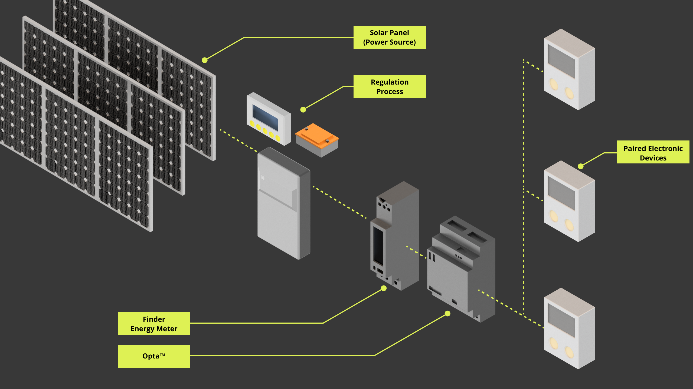
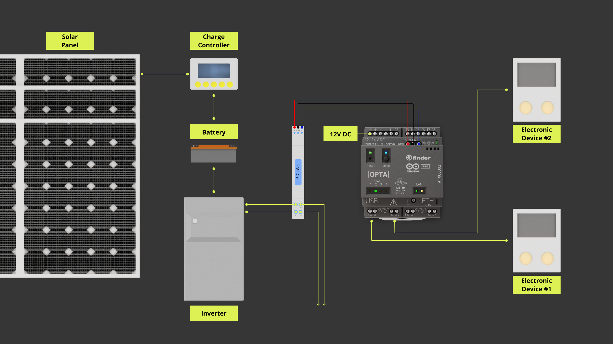
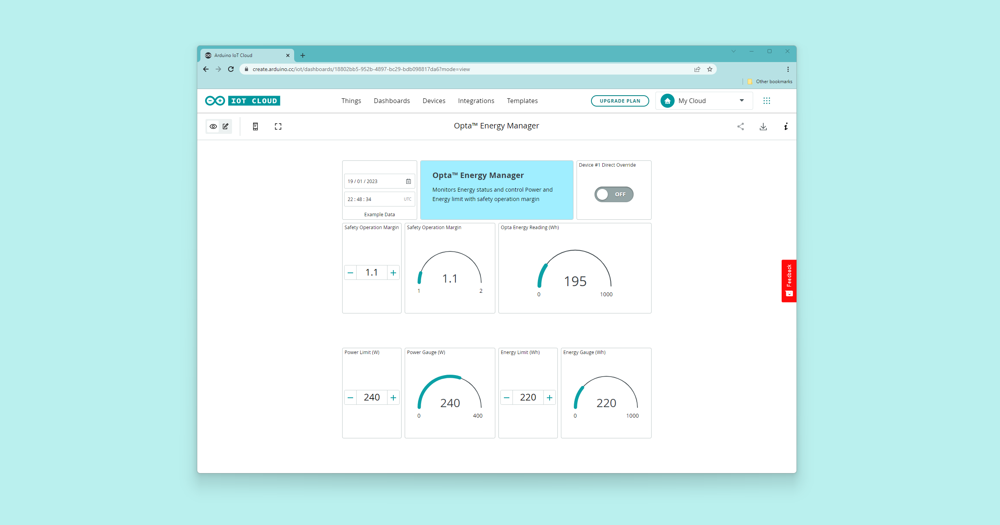

## Introduction

The Opta™ can be an irreplaceable support for home energy management. Getting information on instantaneous electrical consumption and interacting with the customer’s consumption plan, daily usage statistics, and seasonal forecasts can help in planning and managing electrical devices to optimize energetical efficiency. Always be connected and informed by integrating the Arduino IoT cloud, and add self-adjustment capability by monitoring and logging electrical statistics along with the option to operate the connected devices on-demand based on pre-set triggers.

The industry is transitioning towards Industry 4.0, going by the name of the Industrial Internet of Things (IIoT). Industrial energy management and operation of connected devices on-demand within a power grid, will bring vast cost benefits and production performance uplift. To guarantee protection from unauthorized access and service interruptions, Opta™ integrates a secure element that offers the data integrity, encryption, and certificate storage capabilities needed to provide an IoT node for the deployment of a private and safe Industrial Internet of Things network.

## Goals

This application note shows an example of an energy management system, leveraging Opta™ and Arduino IoT Cloud capabilities to perform the following operations:

- The Opta™ will receive remote actuation commands triggered on demand via Arduino Cloud
- The Opta™ will operate devices, based on the user's consumption profile and on the available power provided by solar panels
- The domestic appliances actuation will be automated considering both the operational contexts above: upon user's demand and triggered by power availability and consumption efficiency

A graphical representation of the intended application is shown below:



## Hardware and Software Requirements

### Hardware Requirements

- Opta™ PLC with RS-485 support (x1)
- Solar panel with respective system (Controller, battery, and inverter) or similar power system
- USB-C® cable (x1)
- 7M.24 Energy meter (x1)
- Domestic appliance or devices of interest
- RS-485 connection wire as recommended by the standard specification (x3):
- STP/UTP 24-18AWG (Unterminated) 100-130Ω rated
- STP/UTP 22-16AWG (Terminated) 100-130Ω rated

### Software Requirements

- [Arduino IDE 1.8.10+](https://www.arduino.cc/en/software), [Arduino IDE 2.0+](https://www.arduino.cc/en/software), or [Arduino Web Editor](https://create.arduino.cc/editor)
- If you choose an offline Arduino IDE, you must install the following libraries: `ArduinoRS485`, `ArduinoModbus` and `Scheduler`. You can install those libraries via the Library Manager of the Arduino IDE.
- For the Wi-Fi® connectivity feature of Opta™, we will use [Arduino Cloud](https://create.arduino.cc/iot/things); you will need to create an account if you still need to create one.
- [Opta™ Energy Manager Example Code](assets/energy_management.zip)

## Hardware Setup Overview

The electrical connections of the intended application design are shown in the diagram below:



The Opta™ will receive instant consumption information from the energy meter's thresholds via Modbus RTU through the RS-485 interface. The power delivered by the solar panels will go through a series of processes to get to the energy meter. The domestic appliances will be controlled using the built-in relay outputs of Opta™. Other types of power sources can be used instead of solar panels.

## Opta™ Energy Management Model Description

The Opta™ will manage the available power, based on the data reported by the energy meter connected to the power source: the solar panel. It will request and receive data from the energy meter and will estimate the instant consumption given the energy meter thresholds and actual power delivered from the solar panel.

The energy meter model used in this application note is 7M.24 from Finder, the datasheet can be found [here](https://cdn.findernet.com/app/uploads/2021/09/20090052/Modbus-7M24-7M38_v2_30062021.pdf), and communicates using Modbus RTU over the RS-485 interface. The Opta™ relays will be used to actuate the domestic appliances of interest. To compile data and manage the power distribution, Opta™ will perform the following actions:

- Request voltage and current data measured from the energy meter.
- Obtain three sets of Power data from the energy meter displayed as: *Active Power Total - Pt (W)*, *Reactive Power Total - Qt (var)*, and *Apparent Power Total - St (VA)*.
- Categorize the data acquired regarding Voltage, Current, Active Power Total - Pt (W), Reactive Power Total - Qt (var), and Apparent Power Total - St (VA) in multiple variables to report the attributes of each value by *Actual*, *Average*, *Maximum*, and *Minimum*.
- Retrieve the Energy Counter value in *Wh* and *varh*.
- Make an adequate power distribution to control the desired domestic appliances, based on the user's energy profile.

While all these processes are handled by Opta™ locally, the device will also be connected to the Arduino Cloud via Wi-Fi®. Through the Arduino Cloud, it will be possible to visualize the energy consumption and actuate remotely on-demand the connected devices.

### Opta™ Energy Management Example Code

The code exemplifies how Opta™ can achieve the functionalities described previously. Note that some of the functions in the code are generated by Arduino Cloud during the dashboard configuration.

The following headers are required to enable the RS-485 interface, Modbus RTU protocol, Arduino Cloud connection, and the scheduler. The scheduler supervises the data exchange over the RS-485 interface using the Modbus RTU protocol. In addition to this, it contains the parameters needed for a stable communication as per Modbus RTU specifications.

```arduino
#include "stm32h7xx_ll_gpio.h"
#include "thingProperties.h"

#include <ArduinoModbus.h>
#include <ArduinoRS485.h>
#include <Scheduler.h>

constexpr auto baudrate { 19200 };

// Calculate preDelay and postDelay in microseconds as per Modbus RTU Specification
// MODBUS over serial line specification and implementation guide V1.02
// Paragraph 2.5.1.1 MODBUS Message RTU Framing
// https://modbus.org/docs/Modbus_over_serial_line_V1_02.pdf
constexpr auto bitduration { 1.f / baudrate };
constexpr auto preDelayBR { bitduration * 9.6f * 3.5f * 1e6 };
constexpr auto postDelayBR { bitduration * 9.6f * 3.5f * 1e6 };

#define F7M24 0x21
```

***[Getting Started with Modbus RTU on Opta™](https://docs.arduino.cc/tutorials/opta/getting-started-with-modbus-rtu) tutorial will be able to give a deeper understanding of implementings Modbus RTU with Opta™.***

The `relay_Trigger()` method uses a simple comparison between a `desired target` value and a `required target` value and generates, as an output, the trigger for a relay activation.

The `desired target` value is a user defined value that states the activation threshold desired for the relay activation.

The `required target` value is a variable stating the minimum power required to operate a relay in stable manner and is calculated based on readings gathered from the energy meter, such as `W_actual` that represents the instant total active power measured at the moment of request.

The `user_profile.uV_code` defines the operating margin in percentage. For example, defining 10% as `1.1` inside the `consumption_profile()` method, provides a safety overhead headroom. The arguments in this method are defined as default configurations and can be later modified from the Arduino Cloud dashboard.

The `relayTarget` defines the output port prompted under certain activation conditions.

```arduino
/**
  Control the relay output based on the user (consumption) profile input and configured power/energy target.

  @param desired_target Desired resource required to run the connected device on the relay.
  @param req_target Minimum resource required to run the connected device on the relay.
  @param relayTarget Relay to activate or deactivate.
  @return Returns 0 or 1, representing HIGH state for 1 and LOW state for 0.
*/
uint8_t relay_Trigger(int desired_target, int req_target, pin_size_t relayTarget){
  if ((desired_target >= req_target) && (desired_target < (req_target*user_profile.uV_code))){
    digitalWrite(relayTarget, HIGH);
    Serial.println(F("Energy Manager: Stable operation margin - Turning ON: "));
    Serial.print(relayTarget);
    Serial.println(F(""));
  } else {
    digitalWrite(relayTarget, LOW);
    Serial.println(F("Energy Manager: Unstable / possible overload - Turning OFF: "));
    Serial.print(relayTarget);
    Serial.println(F(""));
    return 0;
  }
}

/**
  Initial user profile setup.

  @param init_OperMargin  System operation margin for power budget represented in percentage.
  @param init_Watt  User defined Wattage limit for the system.
  @param init_WhCon User defined Energy consumption limit for the system.
  @return none
*/
void consumption_profile(uint32_t init_OperMargin, uint32_t init_Watt, uint32_t init_WhCon){
  uOperMargin = init_OperMargin;
  user_profile.uV_code = uOperMargin;

  uWatt = init_Watt;
  user_profile.uW_code = uWatt;

  uWhCon = init_WhCon;
  user_profile.uWh_code = uWhCon;
}
```

The following function uses the information obtained by the energy meter and the inputs from the user provided through the Arduino Cloud, to control the connected electronic devices. It has two main conditions based on energy and power, to determine the system's capacity to activate the devices connected to it, which will produce an action only within an energy consumption margin below a 10% safety operation margin.

However, the system will warn the user if the average power required is above the defined profile limit. Specific data have been considered for this application note based on the devices used to realize the proof of concept for this example.

The `Device #1` is configured for low-power devices seeking for nominal current feed or actual available power to turn on safely. It can be also actuated remotely by the user.

The `Device #2` is configured for devices requiring more power. It will trigger the actuation if the average or the actual available power is enough to satisfy the defined power condition.

```arduino
/**
  Monitors and uses the user defined profile and retrieved information from Energy meter to manage connected devices of interest.

  @param Wh_packet Retrieved energy information from Energy meter in unit of [Wh].
  @param Device_#_f Device flag controlled by relay_Trigger() function. # specifies device number or designation.
  @param directOverride1 Direct override flag for Device #1 controlled via Cloud.
  @param W_avg Average power information retrieved from Energy meter.
*/
void energy_distro_ctrl(){
  if (Wh_packet != 0){
    uWhOpta = Wh_packet;
  } else {
    Serial.println(F("Energy Manager: Energy information recollection stand-by"));
  }

  // Energy consumption conditionar with 10% safety margin
  if ((Wh_packet*user_profile.uV_code) <= user_profile.uWh_code){
    // Device #1 specific behaviors
    Device_1_f = relay_Trigger(1, A_actual, D0);
    if (!Device_1_f){
      if (relay_Trigger(3, W_actual, D0)){
        Serial.println(F("Energy Manager: Secondary condition pass, may be unstable"));          
      } else {
        Serial.println(F("Energy Manager: Insufficient resource"));
        digitalWrite(D0, LOW); 
      }
    } else{
      Serial.println(F("Energy Manager: Conditions green"));
    }

    // Device #2 specific behaviors
    Device_2_f = relay_Trigger(12, W_avg, D1);
    if (!Device_2_f){
      if (relay_Trigger(12, W_actual, D1)){
        Serial.println(F("Energy Manager: Secondary Power condition pass"));    
      } else {
        Serial.println(F("Energy Manager: Insufficient resource"));
        digitalWrite(D0, LOW); 
      }
    } else{
      Serial.println(F("Energy Manager: Conditions green"));
    }

  } else {
    digitalWrite(D0, LOW); 
    digitalWrite(D1, LOW); 
    Serial.println(F("Energy Manager: Energy consumption is high! - Warning"));
  }
  
  // Direct override request for Device #1
  if (directOverride1 == true){
    // Override Device #1
    Serial.println(F("Energy Manager: Direct Override Request Received"));
    digitalWrite(D0, HIGH); 
  }

  // Conditioner to notify users without cutting power to electronic devices
  if ((W_avg*user_profile.uV_code) > user_profile.uW_code){
    Serial.println(F("Energy Manager: Average Power is above profile limit! - Warning"));
    Serial.print(W_avg*user_profile.uV_code);
    Serial.println(F(""));
  }
}
```

The energy meter has several registry addresses specifying a wide range of electrical information. For this application, we will prioritize 7 elements. These 7 elements are *Voltage `V`*, *Current `A`*, *Active Power Total `W`*, *Reactive Power Total `var`*, *Apparent Power Total `VA`*, *Energy in two different units of `Wh` and `varh`*. The data will be based on `actual`, `average`, `maximum`, and `minimum`.

```arduino
/**
  Requests and retrieves actual electrical, and power information from Energy meter over Modbus RTU protocol.
*/
void modbus_com_actual(){
  // Actual Measurements
  // Voltage (V)
  V_actual = readInputRegisterValues(F7M24, 0x6B, 2);

  // Current (A)
  A_actual = readInputRegisterValues(F7M24, 0x7E, 2);

  // Active Power Total - Pt (W)
  W_actual = readInputRegisterValues(F7M24, 0x8C, 2);
  
  // Reactive Power Total - Qt (var)
  Var_actual = readInputRegisterValues(F7M24, 0x94, 2);

  // Apparent Power Total - St (VA)
  Va_actual = readInputRegisterValues(F7M24, 0x9C, 2);
  delay(100);
}

...

/**
  Requests and retrieves energy information from Energy meter over Modbus RTU protocol.
*/
void modbus_com_energy(){
  // Energy
  // Energy (Wh) - n1
  Wh_packet = readInputRegisterValues(F7M24, 0xAC0, 2);

  // Energy (varh) - n2
  Varh_packet = readInputRegisterValues(F7M24, 0x2F2, 2);
  delay(100);
}
```

To enable the Modbus RTU on Opta™, the `RTU_Setup()` function is dedicated to initialize the protocol correctly.

```arduino
/**
  Sets up Modbus RTU protocol configuration.
*/
void RTU_Setup(){
  Serial.println("Energy Management - Modbus RTU Client");

  RS485.setDelays(preDelayBR, postDelayBR);

  // start the Modbus RTU client
  // 7M.24 Energy meter specifies 19200 of default baudrate and 8N2 frame
  if (!ModbusRTUClient.begin(baudrate, SERIAL_8N2)) {
    Serial.println("Failed to start Modbus RTU Client!");
    while (1)
        ;
  }
}
```

The following functions allow to access the target's data by specifying the device and register address.

```arduino
/**
  Writes Coil values given argument inputs. 

  @param dev_address Device address.
  @param reg_address Register address.
  @param coil_write Data to write.
  @param byte_count Number of bytes.
*/
void writeCoilValues(int dev_address, uint8_t reg_address, uint8_t coil_write, int byte_count){
  ModbusRTUClient.beginTransmission(dev_address, COILS, reg_address, byte_count);
  ModbusRTUClient.write(coil_write);
  
  if (!ModbusRTUClient.endTransmission()) {
    Serial.print("failed! ");
    Serial.println(ModbusRTUClient.lastError());
  } else {
    Serial.println("success");
  }
}

/**
  Reads Coil values given argument inputs. 

  @param dev_address Device address.
  @param reg_address Register address.
  @param byte_count Number of bytes.
  @param packet Holding register value reading.
*/
void readCoilValues(int dev_address, uint8_t reg_address, int byte_count, int32_t packet){
  Serial.print("Reading Coil values ... ");

  // read 10 Coil values from (slave) id 42, address 0x00
  if (!ModbusRTUClient.requestFrom(dev_address, COILS, reg_address, byte_count)) {
    Serial.print("failed! ");
    Serial.println(ModbusRTUClient.lastError());
  } else {
    Serial.println("success");

    while (ModbusRTUClient.available()) {
        Serial.print(ModbusRTUClient.read());
        packet = ModbusRTUClient.read();
        Serial.print(' ');
    }
    
    Serial.println();
  }
}

/**
  Reads Discrete Input Register values given argument inputs. 

  @param dev_address Device address.
  @param reg_address Register address.
  @param byte_count Number of bytes.
  @param packet Holding register value reading.
*/
void readDiscreteInputValues(int dev_address, uint8_t reg_address, int byte_count, int32_t packet){
  if (!ModbusRTUClient.requestFrom(dev_address, DISCRETE_INPUTS, reg_address, byte_count)) {
    Serial.print("failed! ");
    Serial.println(ModbusRTUClient.lastError());
  } else {
    Serial.println("success");

    while (ModbusRTUClient.available()) {
        Serial.print(ModbusRTUClient.read());
        packet = ModbusRTUClient.read();
        Serial.print(' ');
    }
    Serial.println();
  }
}

/**
  Writes Holding Register values given argument inputs. 

  @param dev_address Device address.
  @param reg_address Register address.
  @param holding_write Data to write.
  @param byte_count Number of bytes.
*/
void writeHoldingRegisterValues(int dev_address, uint8_t reg_address, uint8_t holding_write, int byte_count){
  ModbusRTUClient.beginTransmission(dev_address, HOLDING_REGISTERS, reg_address, byte_count);
  ModbusRTUClient.write(holding_write);

  if (!ModbusRTUClient.endTransmission()) {
    Serial.print("failed! ");
    Serial.println(ModbusRTUClient.lastError());
  } else {
    Serial.println("success");
  }
}

/**
  Reads Holding Register values given argument inputs. 

  @param dev_address Device address.
  @param reg_address Register address.
  @param byte_count Number of bytes.
  @param packet Holding register value reading.
*/
void readHoldingRegisterValues(int dev_address, uint8_t reg_address, int byte_count, int32_t packet){
  if (!ModbusRTUClient.requestFrom(dev_address, HOLDING_REGISTERS, reg_address, byte_count)) {
    Serial.print("failed! ");
    Serial.println(ModbusRTUClient.lastError());
  } else {
    Serial.println("success");

    while (ModbusRTUClient.available()) {
        Serial.print(ModbusRTUClient.read());
        packet = ModbusRTUClient.read();
        Serial.print(' ');
    }
    Serial.println();
  }
}

/**
  Reads Input Register values given argument inputs. 

  @param dev_address Device address.
  @param reg_address Register address.
  @param byte_count Number of bytes.
*/
uint8_t readInputRegisterValues(int dev_address, uint8_t reg_address, int byte_count){
  uint8_t packet;
  if (!ModbusRTUClient.requestFrom(dev_address, INPUT_REGISTERS, reg_address, byte_count)) {
    Serial.print("failed! ");
    Serial.println(ModbusRTUClient.lastError());
    return 0;
  } else {
    Serial.println("success");

    while (ModbusRTUClient.available()) {
        packet = ModbusRTUClient.read();
        Serial.println(packet);
    }
    return packet;
  }
}
```

The bridge between the Arduino Cloud and Opta™ is defined using the `iot_cloud_setup()` function. The processes are grouped into a single task for easier code maintenance. The `consumption_profile()` characterizes the operating headroom margin, power, and energy limit. These parameters will be used as the default local configuration and available for access via the Arduino Cloud dashboard.

```arduino
/**
  Sets up configuration for Arduino Cloud
*/
void iot_cloud_setup(){
  // Defined in thingProperties.h
  initProperties();

  // Connect to Arduino IoT Cloud
  ArduinoCloud.begin(ArduinoIoTPreferredConnection);
  
  /*
     The following function allows you to obtain more information
     related to the state of network and IoT Cloud connection and errors
     the higher number the more granular information you’ll get.
     The default is 0 (only errors).
     Maximum is 4
 */
  setDebugMessageLevel(2);
  ArduinoCloud.printDebugInfo();

  // Configure values at which the limit the user desires to operate within and share with Arduino Cloud
  consumption_profile(1.1, 120, 2880);
}
```

The Opta™ will initialize the RS-485 interface and Modbus RTU protocol, the Arduino Cloud connection, and the scheduler to handle Modbus RTU protocol based communication with the 7M.24 energy meter. Analog and Digital I/Os are configured here as well.

```arduino
void setup() {
  // Initial Parameter 
  directOverride1 = false;
  uWhOpta = 0;

  Serial.begin(9600);
  while (!Serial);
      
  delay(1000);

  // Analog/Digital IO Port Configuration
  analogIO_Setup();
  digitalIO_Setup();

  // Modbus RTU Configuration 
  RTU_Setup();
  
  // Status LED configuration;
  plc_led_Setup();

  // IoT Cloud Setup
  iot_cloud_setup();

  // Only for Device On State flag
  digitalWrite(LEDG, HIGH);

  // Scheduler -> ModBus
  Scheduler.startLoop(modbus_line);
}
```

The Opta™ will have the main `loop()` to prioritize tasks to communicate with Arduino Cloud and local processes. While the `modbus_line()` will focus on handling Modbus RTU protocol-based communication over the RS-485 interface.

```arduino
void loop() {
  // Cloud exchange
  consumption_var_container();
  ArduinoCloud.update();

  // Profile based energy management tasks
  energy_distro_ctrl();

  delay(1000);
}

/**
  Dedicated function for scheduler to retrieve Energy meter's information over Modbus RTU protocol
*/
void modbus_line(){
  modbus_com_actual();
  modbus_com_avg();
  modbus_com_max();
  modbus_com_min();
  modbus_com_energy();
  modbus_com_monitor();
}
```

The header containing Arduino Cloud properties is as follows. Please note that this is a file generated within the Arduino Cloud platform inside the sketch's working space, requiring Opta™ to be configured beforehand. Thus, given project requirements, the properties are subject to changes.

```arduino
// Code generated by Arduino IoT Cloud, DO NOT EDIT.

#include <ArduinoIoTCloud.h>
#include <Arduino_ConnectionHandler.h>

const char SSID[]     = SECRET_SSID;    // Network SSID (name)
const char PASS[]     = SECRET_OPTIONAL_PASS;    // Network password (use for WPA, or use as key for WEP)

void onUOperMarginChange();
void onUWattChange();
void onUWhConChange();
void onDirectOverride1Change();

float uOperMargin;
float uWatt;
float uWhCon;
float uWhOpta;
bool directOverride1;

void initProperties(){

  ArduinoCloud.addProperty(uOperMargin, READWRITE, ON_CHANGE, onUOperMarginChange);
  ArduinoCloud.addProperty(uWatt, READWRITE, ON_CHANGE, onUWattChange);
  ArduinoCloud.addProperty(uWhCon, READWRITE, ON_CHANGE, onUWhConChange);
  ArduinoCloud.addProperty(uWhOpta, READ, ON_CHANGE, NULL);
  ArduinoCloud.addProperty(directOverride1, READWRITE, ON_CHANGE, onDirectOverride1Change);

}

WiFiConnectionHandler ArduinoIoTPreferredConnection(SSID, PASS);
```

As the header is generated by Arduino Cloud as a function of the variables created, preferably it should not be edited. Further changes to add or remove variables, should be managed within the Cloud environment. The header above is an example that couples with the specific script running based on the demonstration specification. The same script can be used or modified to scale and adapt to the desired system specification.

## Connecting Opta™ with Arduino Cloud

To set up Opta™ with the cloud platform go to the [Arduino Cloud](https://cloud.arduino.cc/). You can go to our [Getting started with the cloud](https://docs.arduino.cc/arduino-cloud/getting-started/iot-cloud-getting-started) tutorial to learn on how to get started with the Arduino Cloud. Follow [the Arduino Cloud](https://docs.arduino.cc/arduino-cloud/) link to get access to more helpful and interesting tutorials.

You will be able to have an interface configured as the following preview to control and monitor parameters of interest as a dashboard example.



## Complete Opta™ Energy Management Sketch

The complete sketch used for the development of energy management on Opta™ with Arduino Cloud can be accessed [here](assets/energy_management.zip).

## Conclusion

You have built an Opta™ energy manager capable of monitoring an electrical system for its power availability and consumption to control power or energy-prioritized devices, with a remote actuation feature available thanks to the Arduino Cloud.

Opta™ can help manage the energetical balance in industrial environments: in this example, we have considered a context where machines can be operated opportunistically, based on power availability, over a 24/7 time range, to improve the overall power efficiency.

By slightly modifying this project, for example, by connecting different types of power sources, stating different conditions for the machine's operations, and modifying parameters linked to the power requirements, it will be easy to create new projects to address many cases, to reach the best solution to manage the energy distribution effectively.

## Next Steps

Implementing an energy management system at home or in a workspace environment can be very useful to reduce unnecessary power consumption. Explore the possibilities of energy management powered by Arduino Cloud to build an energy-efficient environment.