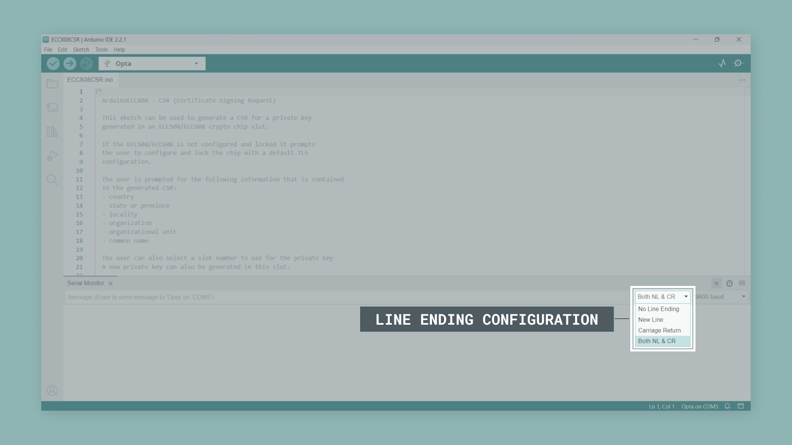
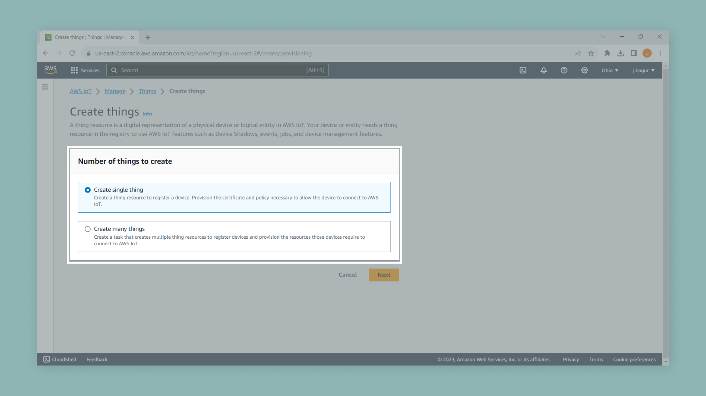
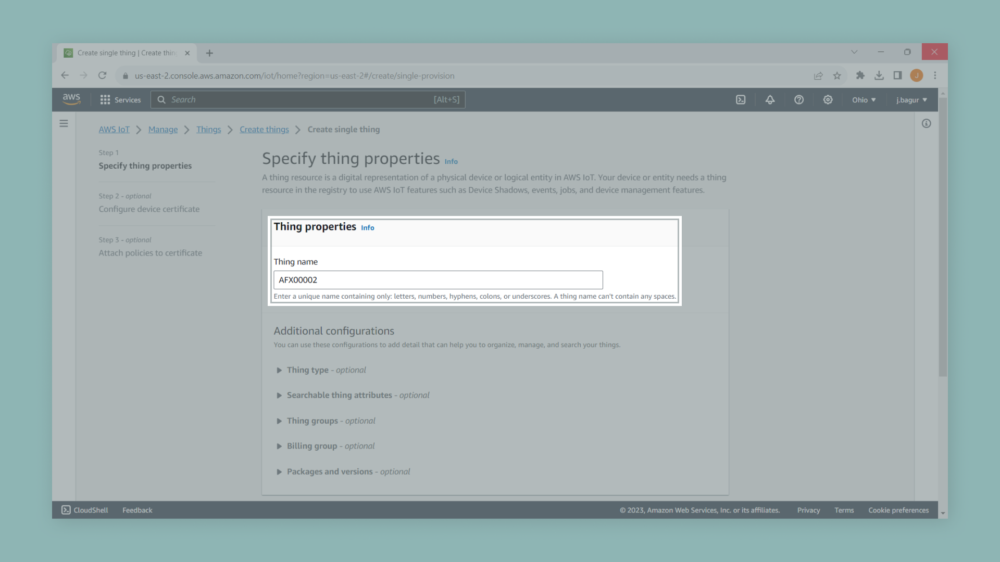
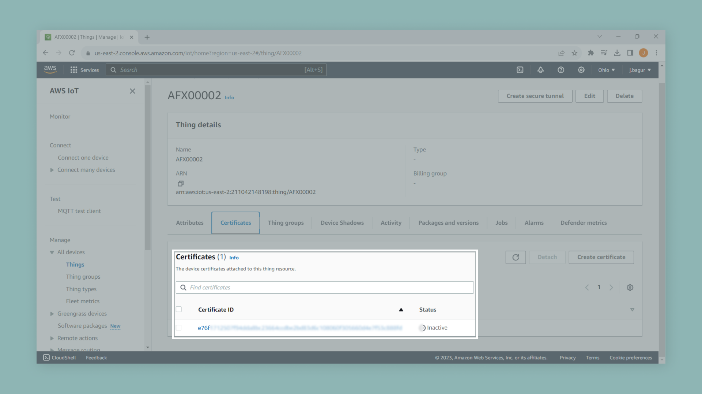

## Overview

AWS IoT Core is a managed Cloud service that lets connected devices easily and securely interact with Cloud applications and other devices. AWS IoT Core can support billions of devices and trillions of messages and can process and route those messages to AWS endpoints and other devices reliably and securely. Devices can connect to AWS IoT Core using the following protocols: HTTP, WebSockets, and MQTT.

This tutorial will walk you through how to connect an Opta™ WiFi device securely to AWS IoT Core using the MQTT protocol. MQTT (Message Queuing Telemetry Transport) is a highly lightweight machine-to-machine (M2M) connectivity protocol that provides a messaging subscription and publish transport.

## Goals

- Learn how to connect an Opta™ device to the AWS IoT Core.

## Hardware and Software Requirements

### Hardware Requirements

- [Opta™ WiFi](https://store.arduino.cc/collections/pro-family/products/opta-wifi) (x1)
- [USB-C® cable](https://store.arduino.cc/products/usb-cable2in1-type-c) (x1)

### Software Requirements

- [Arduino IDE 1.8.10+](https://www.arduino.cc/en/software), [Arduino IDE 2](https://www.arduino.cc/en/software), or [Arduino Web Editor](https://create.arduino.cc/editor)
- [ArduinoECCX08 library](https://github.com/arduino-libraries/ArduinoECCX08)
- [ArduinoBearSSL library](https://github.com/arduino-libraries/ArduinoBearSSL)
- [ArduinoMqttClient library](https://github.com/arduino-libraries/ArduinoMqttClient)
- [Arduino Cloud Provider Examples](https://github.com/arduino/ArduinoCloudProviderExamples)

## Instructions

### Setting Up the Arduino IDE

This tutorial will need the latest version of the Arduino IDE; you can download it [here](https://www.arduino.cc/en/software). If it is your first time setting up an Opta™ device with the Arduino IDE, it is advisable to check its [User Manual](https://docs.arduino.cc/tutorials/opta/user-manual) first. In the Arduino IDE, you need to install the core for Opta™ devices; you can do this by navigating to **Tools > Board > Boards Manager**. In the Board Manager tab, search for `opta` and install the latest `Arduino Mbed OS Opta Boards` version.

This tutorial also requires the latest version of the `ArduinoECCX08`, `ArduinoBearSSL`, `ArduinoMqttClient`, and `Arduino Cloud Provider Examples` libraries installed on the Arduino IDE. You can do this by navigating to **Tools > Manage Libraries** or clicking the Library Manager icon in the left tab of the IDE. In the Library Manager tab, search for `ArduinoECCX08`, `ArduinoBearSSL`, `ArduinoMqttClient`, and `Arduino Cloud Provider Examples` and install the latest version.

### Setting Up Your AWS Account

If you do not have an existing AWS account and user, refer to the online AWS documentation at set up your AWS account. To get started, follow the steps outlined in the sections below:

- [Sign up for an AWS account](https://docs.aws.amazon.com/iot/latest/developerguide/setting-up.html#aws-registration) 
- [Create an administrative user](https://docs.aws.amazon.com/iot/latest/developerguide/setting-up.html#create-an-admin) 
- [Open the AWS IoT console](https://docs.aws.amazon.com/iot/latest/developerguide/setting-up.html#iot-console-signin)

### Generating a Certificate Signing Request 

As mentioned, AWS IoT Core requires devices that connect to it using the MQTT protocol to use X.509 certificates for authentication. We'll use an example sketch from the `ArduinoECCX08` library to generate a Certificate Signing Request (CSR) from an Opta™ WiFi device and then upload this CSR in the AWS console to create an X.509 certificate.

Open the `ECCX08CSR` example sketch by navigating to **File > Examples > ArduinoECCX08 > Tools**. To upload the code to your Opta™ WiFi device, click the **Verify** button to compile the sketch and check for errors; then click the **Upload** button to program the device with the sketch.

When finished, open the IDE's Serial Monitor. Ensure the line ending configuration is set to **Both NL & CR** as shown in the image below. 

Provide the information requested by the example sketch to generate a new CSR for your Opta™ device. Copy the generated CSR from the IDE's Serial Monitor, including `-----BEGIN CERTIFICATE REQUEST-----` and `-----END CERTIFICATE REQUEST-----` and save it to a new `.txt` file or `.csr` file using your favorite text editor. You will upload this file to the AWS console next. 

Now that we have a CSR to identify your Opta™ device, we need to login into the AWS IoT Core console and create a certificate.

### Creating Resources in AWS IoT Core

Login to your AWS account; in the Console Home search bar, search for the "IoT Core" service and select it.

In the  IoT Core services area, navigate to the menu on the left side and choose **Manage > All devices > Things**, then select the **Create things** button.

Once you click the **Create things** button, you will be transferred to a page where you can create a single or many things. Select the **Create single thing** option and then the **Next** button.

After selecting the Next button, you will be transferred to a page where you can name your Thing, **name your Thing as same as the common name that you defined in the generated CSR**, and then select the **Next** button. 

After selecting the Next button, you will be transferred to a page where you can upload the generated CSR. Choose the CSR file, then select the **Next** button. 

After selecting the Next Button, you will be transferred to a page where you can choose the **policies** you want to attach to your Thing, and then select the **Create thing** button. 

In the image shown below, you can see an example policy created for testing purposes only. **Please do not use this policy in production since it is a wide-open policy and is not the best practice and standards**.

Finally, select the Thing you just created and navigate to the **Certificates** tab; select the **Certificate ID** as shown in the image below.

Once in the Certificate area, select the **Actions** dropdown menu and choose **Activate**. After the certificate is activated, the next step is to download the certificate. Save the downloaded certificate in a place where you can find the certificate for future action.

