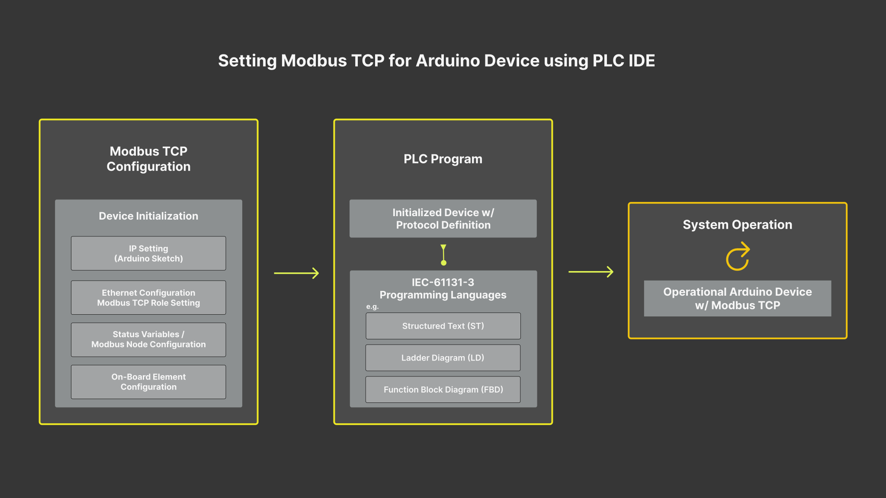
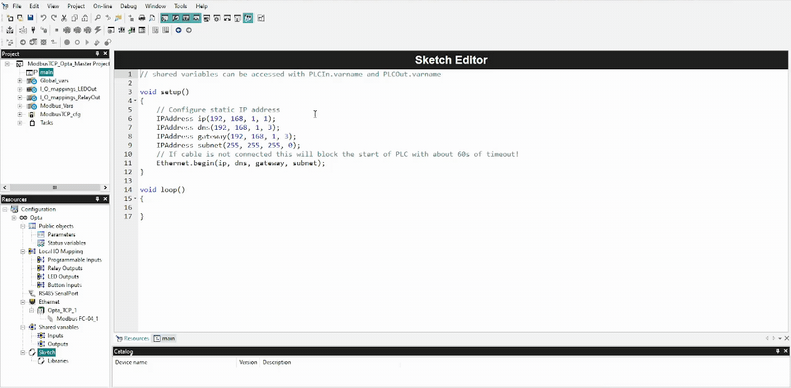
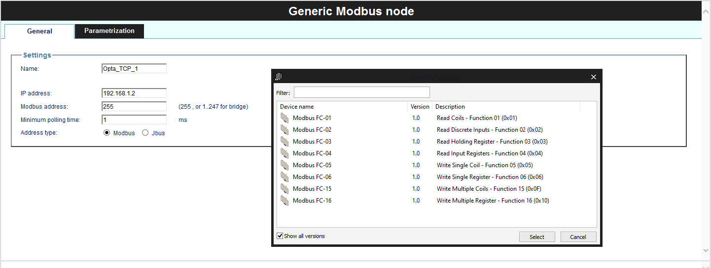

## Overview

Opta™ is distinguished by its industrial-grade hardware that ensures durability and consistent performance even in the most challenging environments. A highlight of its design is the inclusion of multiple connectivity options, notably Modbus TCP through the RJ-45 port.


In this tutorial, you will learn how to implement Modbus TCP based communication between two Opta™ devices using Arduino PLC IDE.

## Goals

- Learn how to configure the workspace environment to work with Modbus TCP using Arduino PLC IDE.
- Learn how to configure Modbus TCP for Opta™ using Arduino PLC IDE.
- Learn how to verify that Opta™ has been correctly set up using an example that uses Modbus TCP communication.

## Required Hardware and Software

### Hardware Requirements

- [Opta™](https://store.arduino.cc/collections/pro-family) (x2)
- USB-C® cable (x2)
- RJ-45 LAN cable (x3)
- Ethernet Switch (Recommended) (x1)

### Software Requirements

- [Arduino PLC IDE Tools](https://www.arduino.cc/en/software#arduino-plc-ide)
- [Arduino PLC IDE software](https://www.arduino.cc/en/software#arduino-plc-ide)
- If you have an Opta™, you do not need any license key to activate your product. Go to section [__License Activation With Pre-Licensed Products (Opta™)__](https://docs.arduino.cc/software/plc-ide/tutorials/plc-ide-setup-license#7-license-activation-with-pre-licensed-products-opta) to know more.
- [Opta™ Modbus TCP PLC IDE Project Example File](assets/ModbusTCP_Opta_Example.zip)

## Modbus TCP

The Modbus protocol is a messaging service structure using Client/Server communication. It is an *application protocol*, with its data management being independent of the transmission method.

The **Modbus TCP/IP**, often simply referred to as **Modbus TCP**, is a variant of the Modbus RTU protocol that uses the TCP/IP interface over Ethernet to exchange data between compatible devices. Here are some key elements to understand about Modbus TCP:

* The 'Transmission Control Protocol (TCP)' is responsible for the exchange of packets.

* The 'Internet Protocol (IP)' defines the addresses for routing message destinations.

* A distinct feature of Modbus TCP concerns how it maintains data integrity. Since Modbus TCP encapsulates the basic data frame within the TCP frame, the usual checksum field of Modbus isn't utilized. Instead, the checksum method from the Ethernet TCP/IP layer ensures data integrity.

* Modbus TCP/IP adheres to TCP/IP networking standards on Ethernet, using the Modbus messaging service as its data handler. Typically, the connected devices are Modbus TCP/IP Client and Server devices. However, interconnections can also be established through routers, gateways, or bridges, forming a TCP/IP network.

***Controller/Peripheral was formerly known as Master/Slave. The Modbus Organization no longer supports the use of this terminology. Devices formerly known as Master are referred to as Controller/Client and devices formerly known as Slaves are referred to as Peripheral/Server.***

## Modbus TCP & PLC IDE

In this tutorial, we will guide you through setting up two Opta™ devices with Modbus TCP using the Arduino PLC IDE. Understanding the overall process of implementation is crucial for successful deployment.

Refer to the following diagram for a concise visualization of how Opta™ is configured and deployed with Modbus TCP:



The entire procedure is divided into three distinct stages:

* __Modbus TCP Configuration__ is the foundational step where we initialize the Opta™ device with Modbus TCP and other essential properties intrinsic to the device. A pivotal component of this stage is the IP configuration, which is essential for Modbus TCP communication and will be defined within the Arduino sketch.

  During this stage, the Modbus TCP role, either Client or Server, is designated to the Opta™ device. Based on this role within the Modbus TCP, either the 'Status variables' are delineated or the Modbus node is defined to determine the communicating devices using this protocol.

* __PLC Program__, developed subsequent to device initialization, it is grounded in Modbus TCP and other properties. The beauty of this stage is the absence of a need for detailed configurations or programming related to Modbus TCP settings in the PLC code.

  The process has been simplified for user convenience. By merely referencing predefined variables in your PLC code, the system autonomously manages data exchange via Modbus TCP. This method capitalizes on the device's earlier initialization, thus cutting down on redundant steps and bolstering efficient communication.

* __System Operation__ represents the anticipated outcome post the Modbus TCP configuration and the execution of the PLC program based on the developer's designed logic. Consequently, we can observe the device engaging in communication with other devices through Modbus TCP.

The provided diagram underscores the consistency in the Modbus TCP configuration across Arduino devices using the PLC IDE. A salient feature of this system is its adaptability. Irrespective of the Modbus TCP configurations, the PLC program can operate effectively and reliably. This autonomous nature guarantees its interoperability and versatility in a variety of scenarios.

Furthermore, when it comes to creating or customizing the PLC code, we are not restricted in terms of programming language. The system supports the IEC61131-3 standard, which means it can be designed with preferred language from the suite defined under this standard. This adaptability allows for both ease of use and precision in program development.

Having provided an overview of the entire process, we can now delve into the specifics.

## Instructions

### Setting Up the Arduino PLC IDE

Access the Arduino PLC IDE software by following [Arduino PLC IDE official website](https://www.arduino.cc/pro/software-plc-ide). You will have to download two executable files for proper software installation:

- [Arduino PLC IDE Tools](https://www.arduino.cc/en/software#arduino-plc-ide)
- [Arduino PLC IDE](https://www.arduino.cc/en/software#arduino-plc-ide)


The **Arduino PLC IDE Tools** will provide all the required drivers, libraries, and cores for development while the **Arduino PLC IDE** will install the IDE software.

Install the Arduino PLC IDE Tools before the Arduino PLC IDE to avoid potential problems related to old libraries and drivers.

***For more details regarding Arduino PLC IDE setup, please take a look at [Arduino PLC IDE Setup and Board's License Activation](https://docs.arduino.cc/tutorials/portenta-machine-control/plc-ide-setup-license) tutorial.***

### Hardware Setup

For Modbus TCP communication, we will use two Opta™ devices and the PLC IDE.

#### Connection and Ethernet Switch Integration
<br></br>

Set up the connection by attaching the Ethernet LAN (RJ-45) cable to both devices using the `ETH RJ45` port. The following image provides a connection diagram for both devices:


The setup incorporates an Ethernet switch that monitors both Opta™ devices using the PLC IDE. This configuration not only links both Opta™ devices using the PLC IDE but also lets you employ a profile to observe information exchanges in real-time. We recommend using the setup with the Ethernet switch for this tutorial to ensure optimal communication between devices.

#### Field Deployment Setup
<br></br>

Once the Modbus connection is active, you can directly connect the Opta™ devices without the Ethernet switch in the field application. Furthermore, you have the flexibility to add more Modbus TCP compatible devices to the communication line, expanding the setup as needed. Refer to the following image for this configuration:


### Workspace Pre-Configuration

There are some considerations that you will need to understand beforehand for proper use of Modbus TCP on Opta™ within PLC IDE. Following subsections will help briefly explain such aspects.

#### PLC IDE Project Configuration & Licenses Management
<br></br>

In any robust development environment, understanding the intricacies of project configuration and the nuances of license management is essential. The Arduino PLC IDE provides a unique blend of features tailored for industrial automation, but to utilize them effectively, a solid foundation is indispensable.

We highly recommend reviewing [this tutorial](https://docs.arduino.cc/tutorials/portenta-machine-control/plc-ide-setup-license) before delving into the present tutorial.

#### Opta™ Basic Configuration
<br></br>

To configure the Modbus TCP communication, we need to know the IP address of each Opta™. When Opta™ is connected to a computer using the RJ-45 cable and the Ethernet switch, and the ethernet configuration is left as default, an IP address is automatically provided to Opta™ by the external *Dynamic Host Configuration Protocol (DHCP)* server. You will need to scan for the address and use that IP address as the device address of Opta™. To find the automatically assigned IP address, it is possible to use this [scanner](https://angryip.org/) to identify the address.

Opta™ can also be configured manually with a specific IP address. This method is viable to assign devices with specific addresses to operate under certain policies if required. For this configuration, the IP setting must be defined by using the sketch found within the `Resources` tab of the PLC IDE. The following image shows what the configuration could look like inside the sketch.


If the IP address for Opta™ is set manually, it is necessary to configure the Ethernet interface on your computer by introducing a manual IP address setting under *IPv4*. The information set under the IPv4 configuration follows the gateway setting. A stable connection with Opta™ using the PLC IDE is essential for project development. The following image shows a configuration example on Windows 11 operating system:


The configured IP address for Opta™ also serves to connect and develop within the Arduino PLC IDE environment. The Modbus TCP option must be activated and set with Opta™ device's assigned IP address by going to `On-line -> Set up communication`. The connection between Opta™ and the development environment can be verified with the`ping <Opta™ IP Address>` command using a terminal.



Keep in mind that the correct configuration is key to work with PLC IDE and Opta™. Once the properties of the Opta™ devices are correctly set, we will be able to seamlessly connect to Opta™ and monitor the states of both devices.

#### Modbus TCP Client and Server Mode
<br></br>

The image below shows the interface we'll encounter when accessing the Modbus TCP configuration panel in the PLC IDE.


There are two options on the Modbus TCP configuration panel:

- Modbus TCP Master
- Modbus TCP Slave always enabled. Unit Identifier: 255

If the "Modbus TCP Master" option remains unchecked, the role of a Modbus TCP Slave with its designated Unit Identifier is automatically adopted by the Opta™ device. No attention needs to be given to the Unit Identifier in such cases. It is because communication with the appropriate Opta™ device is ensured by the configured IP address, even when the same Unit Identifier is shared among multiple devices.

When "Modbus TCP Master" is checked, both Master and Slave roles are taken on by the Opta™ device. In this mode, precedence is given to the Master role. As a consequence, under the `Ethernet` configuration tab, the introduction of a *General Modbus Node* option can be observed, as will be detailed in the section that follows.

#### General Modbus Node Configuration
<br></br>

The General Modbus Node allows to add information regarding the devices compatible with the Modbus messaging service.


It will require you to fill in basic information under the `General` tab. The important information will be the IP address of the Modbus TCP compatible device to communicate. Other properties can be defined on the preference and project requirement if applicable.

If you have added a General Modbus Node defining Opta™ as a Modbus TCP Master initially and unchecked the Master role later, the Node option will stay. However, the Node's configuration field will change and request for a Modbus address with the `1 ... 247` range.

#### PLC IDE Modbus Custom Editor
<br></br>

This is an alternative way of adding a Modbus node under the `Ethernet` configuration tab. To open the Modbus Custom Editor window, go to `Tools -> Run Modbus Custom Editor` on PLC IDE.

It will allow to define the device version and information with Modbus functions pre-defined. It can be deployed later by adding it under the `Ethernet` configuration tab.


It is a useful feature to have frequently deployed device configuration stored that is compatible with Modbus protocol.
  
### Project Overview

Now that you have the prerequisites ready and the tools for Modbus TCP configuration for Opta™ using PLC IDE, an example project will be introduced. This will showcase how Modbus TCP communication between two Opta™ devices is established.

The example project will make a slight change to its default example code using the counter (`cnt`) variable. The counter data will be transmitted, allowing a real-time handshake verification to be achieved between the two Opta™ devices. For the tutorial's purpose, Ethernet properties will be assigned manually to each Opta™ device.

The status LED and relay of *Modbus TCP Master Opta™* will be activated based on the counter information received from the *Modbus TCP Slave Opta™*. Through specific sections dedicated to roles, the setting of the Modbus TCP role for each Opta™ device will be learned.

For those wishing to test without delay, the complete example project can be accessed [here](assets/ModbusTCP_Opta_Example.zip). Every essential configuration and component has been included, ensuring it's ready to be compiled and uploaded to the corresponding Opta™ device.

In the sections that follow, the configuration of each Opta™, based on its designated role in Modbus TCP communication, will be detailed.

#### Modbus TCP Slave Opta™
<br></br>

To set Opta™ as a Modbus TCP Slave, navigate to the `Ethernet` tab located in the `Resources` panel of the PLC IDE. Since the `Modbus TCP Slave` mode is always enabled, you don't have to change any setting in the current window. However, certain properties are essential for Opta™ to function accurately with Modbus TCP, thus it requires the subsequent configuration.

The Modbus TCP Slave Opta™ will employs following Ethernet properties.

```arduino

void setup()
{
    // Configure static IP address
    IPAddress ip(192, 168, 1, 2);
    IPAddress dns(192, 168, 1, 23);
    IPAddress gateway(192, 168, 1, 23);
    IPAddress subnet(255, 255, 255, 0);
    // If the cable is not connected this will block the start of PLC with about 60s of timeout!
    Ethernet.begin(ip, dns, gateway, subnet);
}

...
```

These properties — `ip`, `dns`, `gateway`, and `subnet` — are provided as arguments to the `Ethernet.begin()` method, setting its properties for Opta™. It can be adjusted as per your preference or based on network prerequisites. For instance, `ip(192, 168, 1, 2)` denotes the IP address assigned to the Modbus TCP Slave Opta™.

When initializing a project file in PLC IDE, certain essential lines within the sketch are commented out. These lines should be uncommented to activate the configurations. Once this is done, the sketch should be manually downloaded to Opta™ through the `Opta™ Configuration` window.

The following image shows the `Status variables (volatile)` window. Here, we will define the `cnt` variable, assigning its access address and datatype for Modbus TCP transmission.


The `cnt` status variable uses the following parameters:

* Address: 25000 (dec) / 0x61A8 (hex)
* Name: cnt
* PLC type: INT

With these settings ready, you need to go to `Resources -> Opta`, select the corresponding port, and begin the `Manual sketch download` process. Then you need to go to `On-line -> Set up Communication` and activate Modbus TCP with the assigned IP address for Opta™.


Proceed with `On-line -> Connect` and it will establish communication between your computer and the slave Opta™. If everything is fine, you will be able to observe the message found at the lower right corner of the PLC IDE software stating that it is connected.


Symbols `(1)` and `(2)` denote the connection statuses: Opta™ connected without a PLC code, and Opta™ connected with an available PLC code, respectively.

Next, the main PLC code, also referred to as the primary code, must be compiled and uploaded to Opta™. To do this, navigate to the `main` tab within the `Project` panel, and input the following code:

```arduino
cnt := cnt + 1;

IF cnt >= 2750 THEN
    cnt := 0;
END_IF;
```

The slave Opta™ device's task runs a simple counter and resets whenever the counter reaches `2750`. Use the `Download PLC code` option or press `F7` to initiate the code's compilation and uploading process to Opta™. A successful upload will resemble the image provided below.


Upon completing these steps, you will have successfully configured an Opta™ device as a Modbus TCP Slave. The next section will guide you through setting up another Opta™ as a Modbus TCP Master.

#### Modbus TCP Master Opta™
<br></br>

To set Opta™ as a Modbus TCP Master, begin by navigating to the 'Ethernet' tab found under the 'Resources' panel in the PLC IDE. Here, check the 'Modbus TCP Master' option. As previously discussed [here](#modbus-tcp-master-client-and-server-slave-mode), this action will designate Opta™ as a Master. Do not worry about the greyed-out Slave option.

To establish communication with the configured Modbus TCP Slave Opta™, Modbus node can be added by right-clicking on the 'Ethernet' tab located under the 'Resources' panel. Once done, the 'Add' option will be made visible. This option should be selected to introduce a 'Generic Modbus' node. For this example, the node must be configured with the following parameters:

* Name: Opta_TCP_1
* IP address: 192.168.1.2
* Minimum polling time: 1 ms
* Address type: Modbus

These properties should be set in the same manner as for the Modbus TCP Slave Opta™. The most crucial configuration is the IP address. This address must correspond to the one assigned to the slave Opta™, or any other compatible device should you add more nodes. The resulting configuration should look similar to the accompanying image:


While the Modbus node for the master Opta™ is defined, the Modbus function that will retrieve the counter (`cnt`) information from the slave Opta™ must be specified. By right-clicking on `Opta_TCP_1` or whichever name you choose, the 'Add' option will appear, revealing a device catalog window with a list of available Modbus functions:



For retrieving counter data from the slave Opta™, select the 'Modbus FC-04 (Read Input Registers)' function. The 'General' tab needs to be configured with the following parameters for correct data access:

* Start address: 25000
* Polling time: 0 ms (Continuous Read)
* Timeout: 1000 ms


Next, a variable that will store the counter information from the slave Opta™ must be defined. This variable can be added by navigating to the `Input Reg.` tab within the Modbus function configuration window. A variable named `counter_rec` will be added to hold the received data over the protocol transmission.

The following image shows a visual representation of the expected configuration:


The Modbus TCP Master Opta™ will use the following Ethernet properties.

```arduino

void setup()
{
    // Configure static IP address
    IPAddress ip(192, 168, 1, 1);
    IPAddress dns(192, 168, 1, 3);
    IPAddress gateway(192, 168, 1, 3);
    IPAddress subnet(255, 255, 255, 0);
    // If the cable is not connected this will block the start of PLC with about 60s of timeout!
    Ethernet.begin(ip, dns, gateway, subnet);
}

```

The `ip(192, 168, 1, 1)` represents the IP address of the Modbus TCP Master Opta™. The Internet Protocol properties can be adjusted as required, but ensuring the `subnet` matches your computer's is crucial.

The master Opta™ employs status LEDs and relays in this tutorial's example. The status LEDs can be defined with variables of your choice. For this example, it could use `LED1` to `LED4` designations for corresponding status LEDs.

For instance, to use the `relay_1` and `LED1` variables for the first relay and status LED respectively, these variables must be defined under the 'Local IO Mapping' tab within 'Relay Outputs' and 'LED Outputs'. If omitted, program compilation will produce an error due to unrecognized designations.

The following image shows how it should look within the PLC IDE interface:


The relays also require designations to be able to call later in the main PLC code. A table with designated variable names for relays is shown below:


The main program below will be used to fetch counter data, control status LEDs, and manage corresponding relays. A successful Modbus TCP communication will process previous tasks accordingly.

```arduino
counter := counter_rec;

IF counter >= 500 THEN
	relay_1 := TRUE;
	LED1 := TRUE;
END_IF;

IF counter >= 1000 THEN 
	relay_2 := TRUE;
	LED2 := TRUE;
END_IF;

IF counter >= 1500 THEN 
	relay_3 := TRUE;
	LED3 := TRUE;
END_IF;

IF counter >= 2000 THEN 
	relay_4 := TRUE;
	LED4 := TRUE;
END_IF;

IF counter >= 2500 THEN
	relay_1 := FALSE;
	relay_2 := FALSE;
	relay_3 := FALSE;
	relay_4 := FALSE;
	LED1 := FALSE;
	LED2 := FALSE;
	LED3 := FALSE;
	LED4 := FALSE;
END_IF;
```

The `counter` is a global variable for the master Opta™. `Counter_rec`, on the other hand, is the Modbus variable storing information retrieved from the slave Opta™. This variable was defined during the 'Read Input Registers' Modbus function's configuration.

The complete workspace interface for master Opta™ should resemble the following image once the main PLC code has been successfully compiled and downloaded to the master Opta™:


Finally, Opta™ is now ready as a Modbus TCP Master.

### Testing Modbus TCP Communication Between Opta™ Devices (PLC IDE)

You can access the complete example project [here](assets/ModbusTCP_Opta_Example.zip).

Set both Opta™ devices running with the corresponding main PLC code with the hardware setup explained in [this section](#hardware-setup). You will be able to observe the following results on master Opta™ periodically:

* Counter value = `500`: The status LED #1 and relay #1 will turn on
* Counter value = `1000`: The status LED #2 and relay #2 will turn on
* Counter value = `1500`: The status LED #3 and relay #3 will turn on
* Counter value = `2000`: The status LED #4 and relay #4 will turn on
* Counter value = `2500`: All status LEDs and relays will turn off

For a visual representation of this behavior, refer to the following clip:


In the clip, the left window represents the Modbus TCP Master Opta™, while the right window shows the Modbus TCP Slave Opta™.

## Conclusion

In this tutorial, you have learned how to configure the workspace environment for Modbus TCP using the Arduino PLC IDE and Opta™.

Additionally, through a hands-on example project, you have acquired the skills to verify that Opta™ is correctly set up and that Modbus TCP communication is operating effectively. This project showcased the control of Opta™ device's onboard features, such as relays and status LEDs, based on a custom example.

### Next Steps

Now that you have learned to implement the Modbus TCP between Opta™ devices using Arduino PLC IDE, try expanding the setup by integrating additional Modbus TCP compatible devices into the communication network.

Additionally, you can explore the possibilities by leveraging the onboard features of the Opta™ device combined with the Modbus TCP communication network. This combination offers a robust enhancement solution for industrial management systems.

For more information regarding the Modbus RTU protocol implementation on an Opta™, it may interest you to check out ["Getting Started with Modbus RTU on Opta™"](https://docs.arduino.cc/tutorials/opta/getting-started-with-modbus-rtu) tutorial.