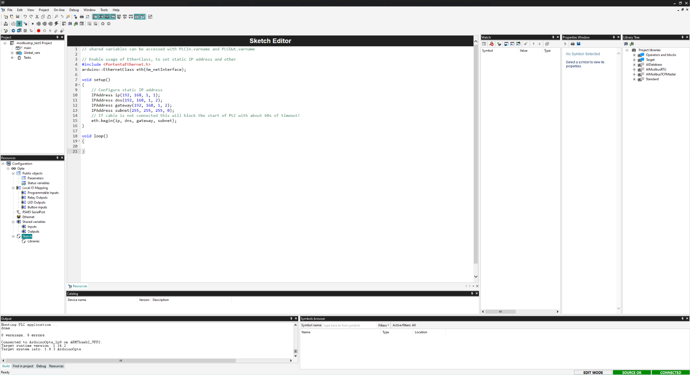
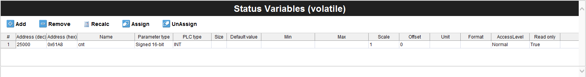
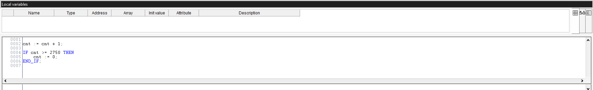
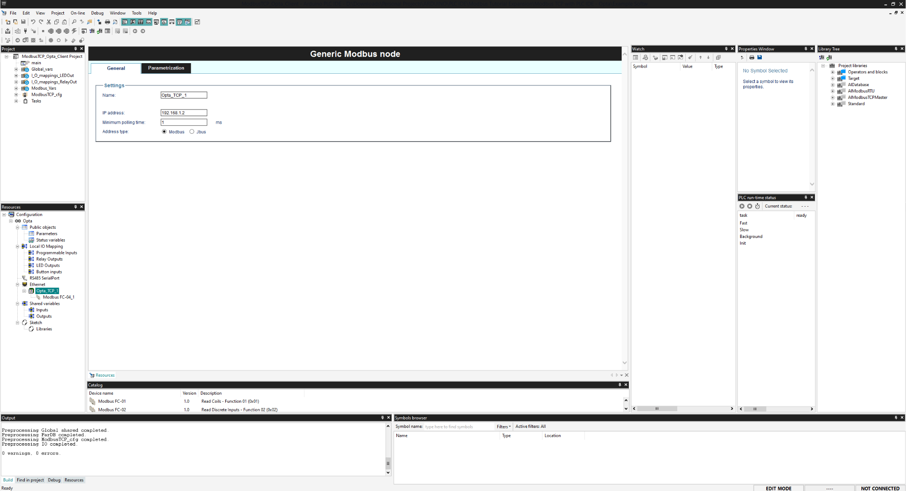
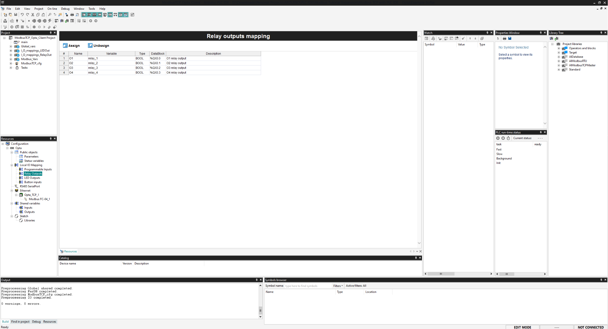
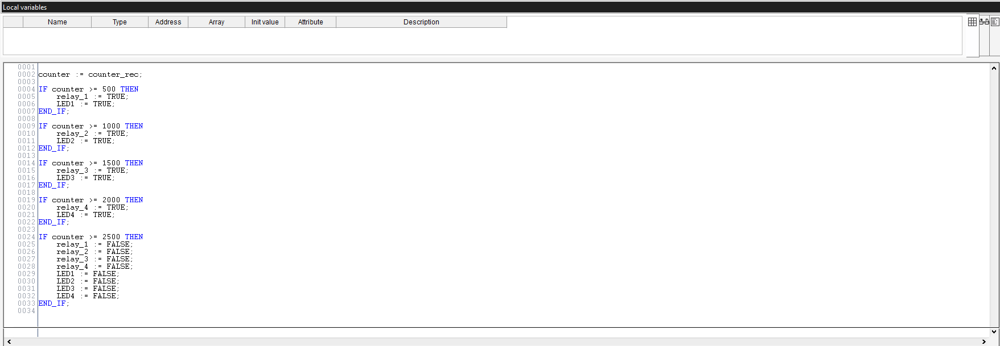
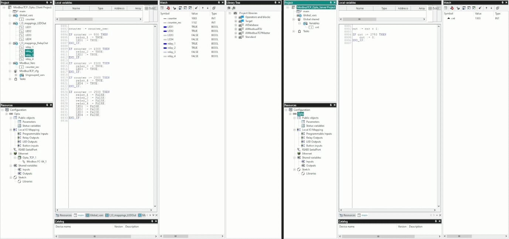

## Overview

Opta™ features industrial-grade hardware with rich connectivity options like Modbus TCP using its RJ-45 port. In this tutorial, you will learn how to implement Modbus TCP based communication between two Opta™ devices using Arduino PLC IDE.

## Goals

- Learn how to configure Modbus TCP for Opta™ using Arduino PLC IDE
- Learn how to configure the workspace environment to work with Modbus TCP using Arduino PLC IDE
- Learn how to verify that Opta™ has been correctly set up using an example that uses Modbus TCP communication.

## Required Hardware and Software

### Hardware Requirements

- Opta™ PLC with RS-485 support (x2)
- USB-C® cable (x2)
- Ethernet LAN cable (x3)
- Ethernet Switch (Recommended) (x1)

### Software Requirements

- Arduino PLC IDE ([Official Website](https://www.arduino.cc/pro/software-plc-ide))
- [Opta™ Modbus TCP PLC IDE Project Example File](assets/ModbusTCP_Opta_Example.zip)

***Your Opta is already pre-licensed so no license key is need it to activate your product. Check [the license activation guide](https://docs.arduino.cc/tutorials/opta/plc-ide-setup-license#7-license-activation-with-pre-licensed-products-opta) to learn more.***

## Modbus TCP

The **Modbus TCP/IP**, also briefly referred to as **Modbus TCP**, is a Modbus RTU protocol that uses TCP/IP interface over Ethernet to exchange data between compatible devices.

***For more information regarding the Modbus RTU protocol implementation on an Opta™, it may interest you to check out ["Getting Started with Modbus RTU on Opta™"](https://docs.arduino.cc/tutorials/opta/getting-started-with-modbus-rtu) tutorial.***

The Modbus protocol is a messaging service structure using Client/Server or Master/Slave communication. It is an *application protocol*, being the data management independent of the transmission method.

For the transmission, the *Transmission Control Protocol and Internet Protocol (TCP/IP)* is the transmission protocol integrating the TCP to handle the exchanging packets and IP to define the addresses for routing message destinations.

One characteristic of Modbus TCP is regarding how the data integrity is maintained. Due to Modbus TCP enclosing the basic data frame into the TCP frame, the usual checksum field of the Modbus is not used. Instead, the checksum method from Ethernet TCP/IP layer is used to ensure data integrity.

Thus, the Modbus TCP/IP is structured by TCP/IP networking standards on the Ethernet using the Modbus messaging service as the data handler. The connected devices are usually Modbus TCP/IP Client and Server devices, but also interconnections established via routers, gateways, or bridges constructing a TCP/IP network.

## Instructions

### Setting Up the Arduino PLC IDE

Access the Arduino PLC IDE software by following [Arduino PLC IDE official website](https://www.arduino.cc/pro/software-plc-ide). You will have to download two executable files for proper software installation:

- Arduino PLC IDE Tools
- Arduino PLC IDE

The **Arduino PLC IDE Tools** will provide all the required drivers, libraries, and cores for development while the **Arduino PLC IDE** will install the IDE software.

Install the Arduino PLC IDE Tools before the Arduino PLC IDE to avoid potential problems related to old libraries and drivers. 

***For more details regarding Arduino PLC IDE setup, please take a look at [Arduino PLC IDE Setup and Board's License Activation](https://docs.arduino.cc/tutorials/portenta-machine-control/plc-ide-setup-license) tutorial.***

### Hardware Setup

Two Opta™ devices and the PLC IDE will be used to create a Modbus TCP communication. It is set up by attaching the Ethernet LAN (RJ-45) cable to both devices on the `ETH RJ45` port. The following image shows the connection diagram to work with both devices.


The setup includes an Ethernet switch monitoring both Opta™ devices using PLC IDE and profile to observe the information exchanges in real time; being the recommendable hardware setup for the present tutorial. 

Once the Modbus connection is properly working, the Opta™ devices can remain connected directly without the need for the Ethernet switch when deployed in an application field as it can be seen in the following image.


### Workspace Pre-Configuration

There are some considerations that you will need to take it into account beforehand for proper use of Modbus TCP on Opta™ within PLC IDE. Following subsections will help briefly explain such aspects.

***It is recommendable to check out [this tutorial](https://docs.arduino.cc/tutorials/portenta-machine-control/plc-ide-setup-license#3-project-setup) to familiarize with Arduino PLC IDE environment.***

#### Opta™ Basic Configuration

The IP address is the device address when using the Modbus TCP. If you attach the Opta™ and leave the ethernet configuration as default, the external *Dynamic Host Configuration Protocol (DHCP)* server will provide an IP address by assigning automatically for the Opta™. You will later need to scan for the address and use that IP address as the device address of the Opta™.

The Opta™ can also be configured manually with a specific IP address. This method is viable to assign devices with specific addresses to operate under certain policies if required. To do this, you need to define the IP setting by effectuating the sketch found within the `Resources` tab of the PLC IDE. The following image shows what the configuration could look like.



If the IP address for the Opta™ is set manually, it is necessary to configure the Ethernet interface on your computer by introducing a manual IP address setting under *IPv4*. The information set under the IPv4 configuration follows the gateway setting. You have to ensure a stable connection with the Opta™ using the PLC IDE to develop the project.

The configured IP address for the Opta™ also serves to connect and develop within the Arduino PLC IDE environment. The Modbus TCP option must be activated and set with the Opta™ device's assigned IP address by going to `On-line -> Set up communication`. The connection between Opta™ and the development environment can be verified with the`ping <Opta™ IP Address>` command via the terminal.

It is an important configuration to work with PLC IDE and Opta™. Once the properties of the Opta™ devices are correctly set, you will be able to connect to Opta™ and two devices' states without any issue.

#### Modbus TCP Client (Master) and Server (Slave) Mode

The following image will show how the PLC IDE will greet you when accessing the Modbus TCP configuration panel.


There are two options on the Modbus TCP configuration panel:

- Modbus TCP Master
- Modbus TCP Slave always enabled. Unit Identifier: 255

If the Modbus TCP Master remains unchecked, the Opta™ will behave as a Modbus TCP Slave with its assigned Unit Identifier. In this instance, you don't have to worry about the Unit Identifier because the configured IP address for the Opta™ will be the routing address to understand which Opta™ device it is talking to even though it has the same Unit Identifier as the other.

On the other hand, if the Modbus TCP Master is checked, then the Opta™ will behave as a Client (Master) and also as a Server (Slave) device, prioritizing as a Client (Master). This will allow an option to add *General Modbus Node* under the `Ethernet` configuration tab.

#### General Modbus Node Configuration

The General Modbus Node allows to add information regarding the devices compatible with the Modbus messaging service.


It will require you to fill in basic information under the `General` tab and parameters to manage under the `Parametrization` tab.

If you have added a General Modbus Node defining the Opta™ as a Modbus TCP Client (Master) initially and unchecked the Client (Master) role later, the Node option will stay. However, the Node's configuration field will change and request for a Modbus address with the `1 ... 247` range.

#### PLC IDE Modbus Custom Editor

This is an alternative way of adding a Modbus node under the `Ethernet` configuration tab. To open the Modbus Custom Editor window, go to `Tools -> Run Modbus Custom Editor` on PLC IDE.


It will allow to define the device version and information with Modbus functions pre-defined. It can be deployed later by adding it under the `Ethernet` configuration tab. It is a useful feature to have frequently deployed device configuration stored that is compatible with Modbus protocol.
  
### Project Overview

Now that you have the prerequisites ready and the tools for Modbus TCP configuration for Opta™ using PLC IDE, an example project will be used to test Modbus TCP communication between two Opta™ devices.

The example project will make a slight change to its default example code using the counter (`cnt`) variable and transmit the counter data to achieve a live handshake verification operation between two Opta™ devices. For the tutorial's purpose, you will assign Ethernet properties manually for each Opta™ device.

The *Modbus TCP Client (Master) Opta™* will trigger the status LED and relay activation based on the counter information received from the *Modbus TCP Server (Slave) Opta™*. With the dedicated role sections, you learn how to set the Modbus TCP role for each Opta™ device.

If you would like to test it immediately, you can access the complete example project [here](assets/ModbusTCP_Opta_Example.zip). It has every configuration and element ready to compile and upload to the corresponding Opta™.

The continuing sections will show how to configure each Opta™ based on its role in Modbus TCP communication.

#### Modbus TCP Server (Slave) Opta™

To set the Opta™ as a Modbus TCP Server (Slave), you will need to go to the `Ethernet` tab under the `Resources` panel in PLC IDE. Since the `Modbus TCP Slave` mode is always enabled, you don't have to change any setting in the current window. It still requires properties that will allow the Opta™ to correctly operate Modbus TCP, thus you will need the subsequent configuration.

The Modbus TCP Server (Slave) Opta™ will use the following Ethernet properties.

```arduino
#include <PortentaEthernet.h>
arduino::EthernetClass eth(&m_netInterface);

void setup()
{
    // Configure static IP address
    IPAddress ip(192, 168, 1, 2);
    IPAddress dns(192, 168, 1, 23);
    IPAddress gateway(192, 168, 1, 23);
    IPAddress subnet(255, 255, 255, 0);
    // If the cable is not connected this will block the start of PLC with about 60s of timeout!
    eth.begin(ip, dns, gateway, subnet);
}

...
```

The Ethernet properties consist of `ip`, `dns`, `gateway`, and `subnet` elements and are called arguments for the `eth.begin()` method to assign these properties for the Opta™. These elements are defined to your preference or network requirements, and previous addresses are one configuration example that can be applied. The `ip(192, 168, 1, 2)` is the IP address assigned to Modbus TCP Server (Slave) Opta™.

It is the sketch that comes commented by default when you create the project file in PLC IDE. You will need to uncomment the lines to make the effect of the configuration and set the features by downloading the sketch manually to Opta™ at the `Opta™ Configuration` window.

The following image shows the `Status variables (volatile)` window, where you will define the `cnt` variable with its access address and its data type to share over Modbus TCP.



The `cnt` status variable uses the following parameters:

* Address: 25000 (dec) / 0x61A8 (hex)
* Name: cnt
* PLC type: INT

With these settings ready, you need to go to `Resources -> Opta`, select the corresponding port, and begin the `Manual sketch download` process. Then you need to go to `On-line -> Set up Communication` and activate Modbus TCP with the assigned IP address for the Opta™.

Proceed with `On-line -> Connect` and it will establish communication between your computer and the server Opta™. If everything is fine, you will be able to observe the message found at the lower right corner of the PLC IDE software stating that it is connected.

Now it requires the PLC code or referred to as the main code, needs to be compiled and uploaded to the Opta™. To do this, go to the `main` tab under the `Project` panel. You will then copy the following code to the space.

```arduino
cnt := cnt + 1;

IF cnt >= 2750 THEN
    cnt := 0;
END_IF;
```

The server Opta™ device's task runs a simple counter and resets whenever the counter reaches `2750`. You can use `Download PLC code` or press `F7` to begin the main code compilation and upload to the Opta™. If the process was successful, you will have a similar result as shown in the following image.



You now have set an Opta™ as Modbus TCP Server (Slave). You will now set another Opta™ as a Modbus TCP Client (Master) with the following section.

#### Modbus TCP Client (Master) Opta™

To set the Opta™ as a Modbus TCP Client (Master), you will need to go to the 'Ethernet' tab under the 'Resources' panel in PLC IDE and check the 'Modbus TCP Master' option. As explained previously [here](#modbus-tcp-master-client-and-server-slave-mode), the Opta™ will be assigned as a Client (Master) and you don't need to worry about the greyed-out option for Server (Slave).

A Modbus node needs to be added to set parameters to establish communication with the previously configured Modbus TCP Server (Slave) Opta™. Right-clicking on the 'Ethernet' tab under the 'Resources' panel, the 'Add' option will appear. Choose this option to add a 'Generic Modbus' node. The properties for the node for this example project are the following parameters:

* Name: Opta_TCP_1
* IP address: 192.168.1.2
* Minimum polling time: 1 ms
* Address type: Modbus

These are the properties you have to set for the Modbus TCP Server (Slave) Opta™ previously. The most important configuration is the IP address. The IP address for the node must be the address that was set for the server Opta™ or any other compatible device if you were to add additional nodes. You will have a similar configuration as the following image:



The Modbus node for client Opta™ is defined but it needs to set which Modbus function will be used to retrieve the counter (`cnt`) information from the server Opta™. Right-clicking on `Opta_TCP_1` in this case, or the name you choose to use will show the 'Add' option and will open a device catalog window listing all the available Modbus functions.

The 'Modbus FC-04 (Read Input Registers)' function is chosen to request and retrieve the counter data from the server Opta™. You will need to set some parameters in the 'General' tab to access the data appropriately, and it uses the following parameters:

* Start address: 25000
* Polling time: 0 ms (Continuous Read)
* Timeout: 1000 ms


It also needs to set a variable that will store the counter information transmitted from server Opta™. You can add the variable by going into the `Input Reg.` tab within the Modbus function configuration window. The following image shows how the configuration should look like:


The Modbus TCP Client (Master) Opta™ will use the following Ethernet properties.

```arduino
#include <PortentaEthernet.h>
arduino::EthernetClass eth(&m_netInterface);

void setup()
{
    // Configure static IP address
    IPAddress ip(192, 168, 1, 1);
    IPAddress dns(192, 168, 1, 3);
    IPAddress gateway(192, 168, 1, 3);
    IPAddress subnet(255, 255, 255, 0);
    // If the cable is not connected this will block the start of PLC with about 60s of timeout!
    eth.begin(ip, dns, gateway, subnet);
}

...
```

The `ip(192, 168, 1, 1)` is the IP address assigned to Modbus TCP Client (Master) Opta™. The Internet Protocol properties can be changed to your preference. It is important to have the `subnet` defined to your computer's subnet to have the Opta™ devices work in the same network.

The client Opta™ in this tutorial's example will use status LEDs and relays. The status LEDs need to be defined with variables of your choice. For this example, it uses `LED1` to `LED4` designations for corresponding status LEDs.

To use `relay_1` and `LED1` variables for the relay and status LED 1, these variables are defined under the 'Local IO Mapping' tab found within 'Relay Outputs' and 'LED Outputs'. Otherwise, the program compilation will result in an error because it cannot find its designations.

The following image shows how it should look within the PLC IDE interface:


The relays also require designations to be able to call later in the main PLC code. The following image shows the relay table with assigned variable names:



The following main program will be used to retrieve the counter data and control status LEDs with corresponding relays, confirming successful communication using Modbus TCP.

```arduino
counter := counter_rec;

IF counter >= 500 THEN
	relay_1 := TRUE;
	LED1 := TRUE;
END_IF;

IF counter >= 1000 THEN 
	relay_2 := TRUE;
	LED2 := TRUE;
END_IF;

IF counter >= 1500 THEN 
	relay_3 := TRUE;
	LED3 := TRUE;
END_IF;

IF counter >= 2000 THEN 
	relay_4 := TRUE;
	LED4 := TRUE;
END_IF;

IF counter >= 2500 THEN
	relay_1 := FALSE;
	relay_2 := FALSE;
	relay_3 := FALSE;
	relay_4 := FALSE;
	LED1 := FALSE;
	LED2 := FALSE;
	LED3 := FALSE;
	LED4 := FALSE;
END_IF;
```

The `counter` is a global variable for client Opta™, while the `counter_rec` is the Modbus variable which stores the counter information retrieved from server Opta™.

The complete workspace interface for client Opta™ should look similar to the following image if the main PLC code was successfully compiled and uploaded to client Opta™:



Finally, the Opta™ is ready as a Modbus TCP Client (Master).

### Testing Modbus TCP Communication Between Opta™ Devices (PLC IDE)

You can access the complete example project [here](assets/ModbusTCP_Opta_Example.zip). You can download the compressed file, extract it, and use the pre-configured example project for your Opta™ devices.

Set both Opta™ devices running with the corresponding main PLC code with the hardware setup explained in [this section](#hardware-setup). You will be able to observe the following results on master Opta™ periodically:

* Counter value = `500`: The status LED #1 and relay #1 will turn on
* Counter value = `1000`: The status LED #2 and relay #2 will turn on
* Counter value = `1500`: The status LED #3 and relay #3 will turn on
* Counter value = `2000`: The status LED #4 and relay #4 will turn on
* Counter value = `2500`: All status LEDs and relays will turn off

The following short clip shows a briefly expected behavior of the example project.



## Conclusion

In this tutorial, you have learned to configure the workspace environment to work with Modbus TCP using Arduino PLC IDE and verified that Opta™ has been correctly set up and Modbus TCP communication is effective using an example project that controls Opta™ device's on-board features such as relays and status LEDs based on customized example.

### Next Steps

Now that you have learned to implement the Modbus TCP between Opta™ devices using Arduino PLC IDE, try adding additional Modbus TCP compatible devices and create a Modbus TCP communication network.

Further, explore the possibilities by combining the Opta™ device's onboard features with the Modbus TCP communication network and deploy it as an enhancement solution for industrial management systems.