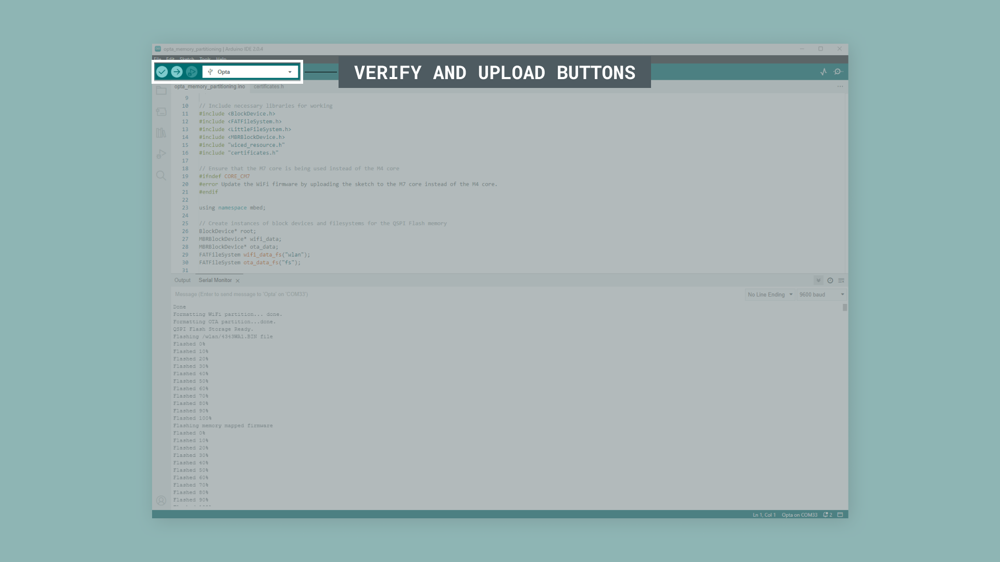
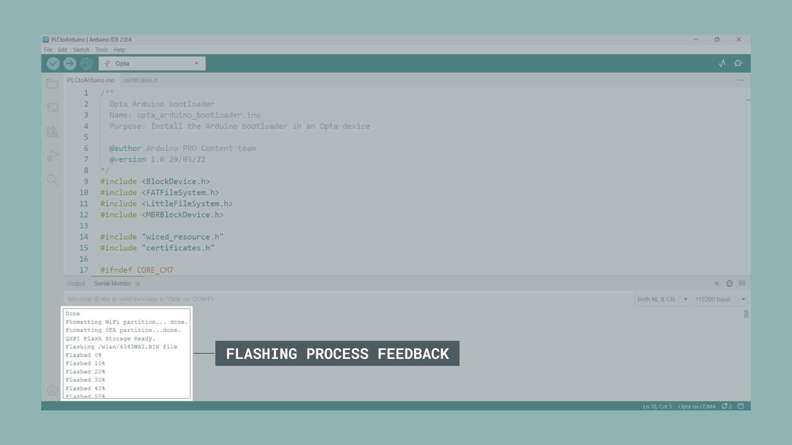

## Overview

The Opta™ is a secure, easy-to-use micro Programmable Logic Controller (PLC) with Industrial Internet of Things (IIoT) capabilities. It can be programmed with the [Arduino PLC IDE](https://www.arduino.cc/pro/software-plc-ide/), a tool that simplifies programming the device through any of the five programming languages defined by the IEC 61131-3 standard. The Opta™ can also be programmed with other tools from the Arduino ecosystem, such as the [Arduino IDE](https://www.arduino.cc/en/software) and the Arduino programming language. 

In this tutorial, we will learn how to partition the memory of an Opta™ device to enable all of its functionalities to be programmed using the Arduino IDE and the Arduino programming language.


## Goals

- Learn how to partition the memory of an Opta™ device using the Arduino ecosystem tools.
- Program an Opta™ device using the Arduino IDE and the Arduino programming language. 

## Hardware and Software Requirements

### Hardware Requirements

- [Opta™](https://store.arduino.cc/collections/pro-family) (x1)
- USB-C® cable (x1)

### Software Requirements

- [Arduino IDE 1.8.10+](https://www.arduino.cc/en/software), [Arduino IDE 2.0+](https://www.arduino.cc/en/software), or [Arduino Web Editor](https://create.arduino.cc/editor)
- [Memory partitioning sketch](assets/opta_memory_partitioning.ino)
- [Certificates file](assets/certificates.h) used in the memory partitioning sketch

## Memory Partitioning

Memory partitioning involves dividing the available memory of a device into separate regions or partitions, each serving a specific purpose. This process is used for managing memory efficiently and ensuring that different programs or functionalities of the device can coexist without interfering each other. In the context of the Opta™, partitioning the memory allows the device to accommodate different functionalities, such as its Wi-Fi® module firmware, Over-The-Air (OTA) updates functionality, and certificates storage, while still providing memory space for user programs developed in the Arduino IDE and the Arduino programming language. 

Now, we will guide the process of partitioning an Opta™'s memory to enable the full range of its functionalities to be programmed using the Arduino IDE and the Arduino programming language.

## Instructions

### Setting Up the Arduino IDE 

This tutorial requires the latest version of the Arduino IDE; we can download it [here](https://www.arduino.cc/en/software). In the Arduino IDE, we need to install the core for Opta™ devices; this can be done by navigating to **Tools > Board > Boards Manager** or clicking the Boards Manager icon in the left tab of the IDE. In the Boards Manager tab, search for `opta` and install the latest `Arduino Mbed OS Opta Boards` version.


Now we are ready to start compiling and uploading Arduino sketches to an Opta™ device using the Arduino IDE. 

### Partitioning Memory of an Opta™ Device

The sketch below will guide us through partitioning the memory of an Opta™ device. The complete sketch can be downloaded [here](assets/opta_memory_partitioning.ino), and the certificates file can be downloaded [here](assets/certificates.h). **Remember to store both files in the same folder**.


```arduino
/**
  Opta memory partitioning
  Name: opta_memory_partitioning.ino
  Purpose: Partition the memory of an Opta device

  @author Arduino PRO Content team
  @version 1.0 04/04/22
*/

// Include necessary libraries for working
#include <BlockDevice.h>
#include <FATFileSystem.h>
#include <LittleFileSystem.h>
#include <MBRBlockDevice.h>
#include "wiced_resource.h"
#include "certificates.h"

// Ensure that the M7 core is being used instead of the M4 core
#ifndef CORE_CM7
#error Update the WiFi firmware by uploading the sketch to the M7 core instead of the M4 core.
#endif

using namespace mbed;

// Create instances of block devices and filesystems for the QSPI Flash memory
BlockDevice* root;
MBRBlockDevice* wifi_data;
MBRBlockDevice* ota_data;
FATFileSystem wifi_data_fs("wlan");
FATFileSystem ota_data_fs("fs");

void setup() {
  // Set the built-in LED pin as an output and turn it off
  pinMode(LED_BUILTIN, OUTPUT);
  digitalWrite(LED_BUILTIN, LOW);

  // Initialize serial communication and wait up to 2.5 seconds for a connection
  Serial.begin(115200);
  for (auto startNow = millis() + 2500; !Serial && millis() < startNow; delay(500))
    ;

  // Blink the built-in LED 10 times as a visual indicator that the process is starting
  for (auto i = 0u; i < 10; i++) {
    digitalWrite(LED_BUILTIN, HIGH);
    delay(25);
    digitalWrite(LED_BUILTIN, LOW);
    delay(50);
  }

  // Initialize and erase the QSPI flash memory.
  Serial.println("Erasing the QSPIF");
  root = BlockDevice::get_default_instance();
  auto err = root->init();
  if (err != 0) {
    Serial.print("Error Initializing the QSPIF: ");
    Serial.println(err);
    while (true) {
      digitalWrite(LED_BUILTIN, HIGH);
      delay(50);
      digitalWrite(LED_BUILTIN, LOW);
      delay(150);
    }
  }

  // Create partitions for Wi-Fi firmware, OTA updates, and certificate storage
  // Get device geometry.
  const auto erase_size = root->get_erase_size();
  const auto size = root->size();
  const auto eraseSectors = size / erase_size;

  for (auto i = 0u; i < eraseSectors; i++) {
    err = root->erase(i * erase_size, erase_size);
    if (i % 64 == 0) {
      digitalWrite(LED_BUILTIN, HIGH);
      delay(25);
      digitalWrite(LED_BUILTIN, LOW);
    }
    if (err != 0) {
      Serial.print("Error erasing sector ");
      Serial.println(i);
      Serial.print(" [");
      Serial.print(i * erase_size);
      Serial.print(" - ");
      Serial.print(float{ i } / float{ eraseSectors } * 100);
      Serial.print("%] -> ");
      Serial.print(err ? "KO" : "OK");
      Serial.println();
      for (auto i = 0u; i < 2; i++) {
        digitalWrite(LED_BUILTIN, HIGH);
        delay(50);
        digitalWrite(LED_BUILTIN, LOW);
        delay(150);
      }
    }
  }

  Serial.println("Done");
  for (auto i = 0u; i < 5; i++) {
    digitalWrite(LED_BUILTIN, HIGH);
    delay(25);
    digitalWrite(LED_BUILTIN, LOW);
    delay(50);
  }

  // Format the partitions and create filesystem instances
  // WiFi Firmware and TLS TA certificates: 1 MB
  // Arduino OTA: 13 MB
  MBRBlockDevice::partition(root, 1, 0x0B, 0 * 1024 * 1024, 1 * 1024 * 1024);
  MBRBlockDevice::partition(root, 3, 0x0B, 14 * 1024 * 1024, 14 * 1024 * 1024);
  MBRBlockDevice::partition(root, 2, 0x0B, 1024 * 1024, 14 * 1024 * 1024);

  // Create the filesystem references
  wifi_data = new MBRBlockDevice(root, 1);
  ota_data = new MBRBlockDevice(root, 2);

  // Write Wi-Fi firmware and certificate data to the appropriate partitions
  Serial.print("Formatting WiFi partition... ");
  err = wifi_data_fs.reformat(wifi_data);
  if (err != 0) {
    Serial.println("Error formatting WiFi partition");
    while (true) {
      digitalWrite(LED_BUILTIN, HIGH);
      delay(50);
      digitalWrite(LED_BUILTIN, LOW);
      delay(150);
    }
  }

  Serial.println("done.");
  Serial.print("Formatting OTA partition...");
  err = ota_data_fs.reformat(ota_data);
  if (err != 0) {
    Serial.println("Error formatting OTA partition");
    while (true) {
      digitalWrite(LED_BUILTIN, HIGH);
      delay(50);
      digitalWrite(LED_BUILTIN, LOW);
      delay(150);
    }
  }

  Serial.println("done.");
  for (auto i = 0u; i < 10; i++) {
    digitalWrite(LED_BUILTIN, HIGH);
    delay(25);
    digitalWrite(LED_BUILTIN, LOW);
    delay(50);
  }

  Serial.println("QSPI Flash Storage Ready.");

  // Flash the memory-mapped Wi-Fi firmware and certificates
  extern const unsigned char wifi_firmware_image_data[];
  extern const resource_hnd_t wifi_firmware_image;
  FILE* fp = fopen("/wlan/4343WA1.BIN", "wb");
  const int file_size = 421098;
  int chunck_size = 1024;
  int byte_count = 0;

  Serial.println("Flashing /wlan/4343WA1.BIN file");
  printProgress(byte_count, file_size, 10, true);
  while (byte_count < file_size) {
    if (byte_count + chunck_size > file_size)
      chunck_size = file_size - byte_count;
    int ret = fwrite(&wifi_firmware_image_data[byte_count], chunck_size, 1, fp);
    if (ret != 1) {
      Serial.println("Error writing firmware data");
      break;
    }
    byte_count += chunck_size;
    printProgress(byte_count, file_size, 10, false);
  }
  fclose(fp);

  chunck_size = 1024;
  byte_count = 0;
  const uint32_t offset = 15 * 1024 * 1024 + 1024 * 512;

  Serial.println("Flashing memory mapped firmware");
  printProgress(byte_count, file_size, 10, true);
  while (byte_count < file_size) {
    if (byte_count + chunck_size > file_size)
      chunck_size = file_size - byte_count;
    int ret = root->program(wifi_firmware_image_data, offset + byte_count, chunck_size);
    if (ret != 0) {
      Serial.println("Error writing firmware data");
      break;
    }
    byte_count += chunck_size;
    printProgress(byte_count, file_size, 10, false);
  }

  chunck_size = 128;
  byte_count = 0;
  fp = fopen("/wlan/cacert.pem", "wb");

  Serial.println("Flashing certificates");
  printProgress(byte_count, cacert_pem_len, 10, true);
  while (byte_count < cacert_pem_len) {
    if (byte_count + chunck_size > cacert_pem_len)
      chunck_size = cacert_pem_len - byte_count;
    int ret = fwrite(&cacert_pem[byte_count], chunck_size, 1, fp);
    if (ret != 1) {
      Serial.println("Error writing certificates");
      break;
    }
    byte_count += chunck_size;
    printProgress(byte_count, cacert_pem_len, 10, false);
  }
  fclose(fp);

  fp = fopen("/wlan/cacert.pem", "rb");
  char buffer[128];
  int ret = fread(buffer, 1, 128, fp);
  Serial.write(buffer, ret);
  while (ret == 128) {
    ret = fread(buffer, 1, 128, fp);
    Serial.write(buffer, ret);
  }
  fclose(fp);

  Serial.println("\nFirmware and certificates updated!");
  Serial.println("It's now safe to reboot or disconnect your board.");
}

void loop() {
  // Empty loop function, main task is performed in the setup function
}

/**
  Get the size of a file
  
  @param bootloader fp (FP)
  @return filse size
*/
long getFileSize(FILE* fp) {
  fseek(fp, 0, SEEK_END);
  int size = ftell(fp);
  fseek(fp, 0, SEEK_SET);

  return size;
}

/**
  Display the progress of the flashing process
  
  @params offset (uint32_t), size (uint32_t), threshold (uint32_t) and reset (bool)
  @return none
*/
void printProgress(uint32_t offset, uint32_t size, uint32_t threshold, bool reset) {
  static int percent_done = 0;
  if (reset == true) {
    percent_done = 0;
    Serial.println("Flashed " + String(percent_done) + "%");
  } else {
    uint32_t percent_done_new = offset * 100 / size;
    if (percent_done_new >= percent_done + threshold) {
      percent_done = percent_done_new;
      Serial.println("Flashed " + String(percent_done) + "%");
    }
  }
}
```

The sketch shown above performs four main tasks:

1. **Initialize and erase the QSPI Flash memory**: The sketch initializes the QSPI Flash memory of the Opta™ device and erases its content to prepare the memory for new firmware and data. One of the built-in LEDs of the device is used to indicate the progress of the memory-erasing process.

2. **Create partitions and format them in the QSPI Flash memory**: The sketch creates and formats partitions in the QSPI Flash memory for the Wi-Fi firmware, Over-The-Air (OTA) updates functionality and certificates storage.

3. **Write Wi-Fi firmware and certificates data**: The sketch writes the Wi-Fi firmware and certificate data to the appropriate partitions in the QSPI Flash memory. It also flashes the memory-mapped Wi-Fi firmware and certificates.

4. **Display progress in the Arduino IDE Serial Monitor**: The sketch provides a visual indication of the progress of the flashing process using one of the built-in LEDs of the Opta™ device and displays messages through the Arduino IDE Serial Monitor to inform the user about the current status of the flashing process.

To upload the code, click the **Verify** button to compile the sketch and check for errors; then click the **Upload** button to program the device with the sketch. 



After a while, you should see in the Serial Monitor information on the progress of the flashing process, as shown in the image below.



You should see a success message in the Serial Monitor if everything is correct. Now we are ready to start using the full capabilities of the Opta™ with the Arduino IDE.

## Conclusion

In this tutorial, we successfully partitioned the memory of an Opta™ device, enabling its full range of functionalities to be programmed using Arduino ecosystem tools such as the Arduino IDE and the Arduino programming language. We walked through initializing and erasing the QSPI Flash memory, partitioning and formatting the memory, and writing the Wi-Fi firmware and certificate data onto the device's memory. As you move forward, you can explore the extensive Arduino ecosystem, leverage various libraries and hardware add-ons, and create powerful, connected, and secure industrial solutions using the Opta™.