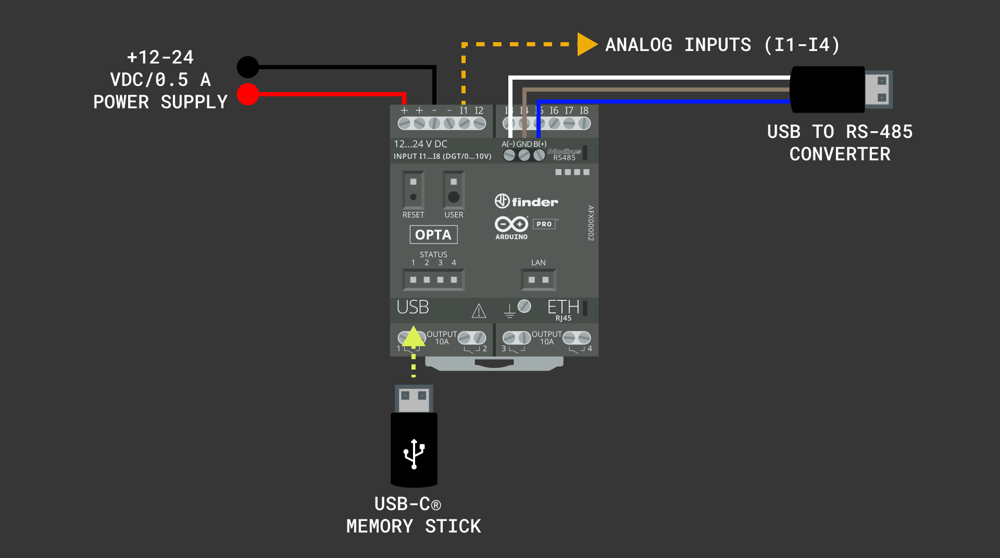

## Overview

In this tutorial, we'll learn how to interface an Opta™ device with a USB memory stick for data logging. Data logging is an essential process in industrial environments, where it is critical to continuously monitor and record vital parameters like temperature, pressure, or flow rates. These parameters are often captured through sensors connected to the input ports of a device like the Opta™. We will record readings from four analog input ports of an Opta™ device and store the data in a `.txt` file on the USB memory stick. Additionally, we will use the onboard user button and LEDs of the Opta™ device to start, stop, and indicate the status of the data logging process to the user. 

## Goals

- Interface an Opta™ device with a USB memory stick for data logging purposes.
- Read data from four analog input ports of an Opta™ device and write it to a `.txt` file on a USB memory stick.
- Use the onboard user button of an Opta™ device to start and stop the data logging process.
- Use the onboard user LEDs of an Opta™ device to indicate the different states of the data logging process to the user.

## Hardware and Software Requirements

### Hardware Requirements

- [Opta™](https://store.arduino.cc/collections/pro-family/products/opta-wifi) (x1)
- [USB-C® cable](https://store.arduino.cc/products/usb-cable2in1-type-c) (x1)
- +12-24 VDC/0.5 A power supply (x1)
- USB-C® memory stick (x1)

### Software Requirements

- [Arduino IDE 1.8.10+](https://www.arduino.cc/en/software), [Arduino IDE 2.0+](https://www.arduino.cc/en/software), or [Arduino Web Editor](https://create.arduino.cc/editor)
- [`Arduino_UnifiedStorage`](https://github.com/arduino-libraries/Arduino_UnifiedStorage) library

## USB Memory Sticks and Data Logging

USB memory sticks, also known as Flash drives, are essential for data logging purposes in industrial environments. These small, rewritable storage devices equipped with integrated Flash memory and a USB interface are ideal for storing data like temperature, pressure, and machine performance over time. Data logging, particularly in industrial environments, is fundamental for predictive maintenance, process optimization, and quality control. It involves collecting large amounts of data over time, which can be analyzed to detect trends, predict equipment failures, and enhance operational efficiency.


To manage the communication between a USB memory stick and an Opta™ device, we will use the [`Arduino_UnifiedStorage` library](https://github.com/arduino-libraries/Arduino_UnifiedStorage/tree/main). This library is excellent for working with different types of storage, including the FAT file systems that USB memory sticks often use. Its main benefit is that it makes dealing with various storage devices and file systems more straightforward. This is especially important in industrial data logging, where you need reliable and accurate data recording. The `Arduino_UnifiedStorage` library simplifies how to read and write data to external storage, ensuring precise and consistent data logging.

### Compatible USB Memory Sticks

Currently, the following USB memory sticks have been tested and are known to be fully compatible with Opta® devices:

- Kingston® DataTraveler® 80 M USB-C 256 GB Flash Drive
- SanDisk® Ultra® Dual Drive USB Type-C 64 GB Flash Drive
- SanDisk® Ultra® Dual Drive Go USB Type-C 64 GB Flash Drive

All USB memory sticks were formatted with the `FAT32` file system before they were used with an Opta® device.

***It is recommended to use USB memory sticks with a storage capacity of 256 GB or less. If a memory stick has a storage capacity greater than 256 GB, it is advised to partition it to limit its accessible storage to 256 GB or less.***

## Instructions 

### Setting Up the Arduino IDE 

This tutorial requires the latest version of the Arduino IDE; you can download it [here](https://www.arduino.cc/en/software). In the Arduino IDE, you need to install the core for Opta™ devices; this can be done by navigating to **Tools > Board > Boards Manager** or clicking the Boards Manager icon in the left tab of the IDE. In the Boards Manager tab, search for `opta` and install the latest release of the `Arduino Mbed OS Opta Boards`.


Now we are ready to start compiling and uploading Arduino sketches to an Opta™ device using the Arduino IDE. 

### Installing the Required Libraries 

This tutorial also requires the latest version of the `Arduino_UnifiedStorage` library installed on the Arduino IDE. This can be done by navigating to **Tools > Manage Libraries** or clicking the Library Manager icon in the left tab of the IDE. In the Library Manager tab, search for `Arduino_UnifiedStorage` and install the latest version.


***By default, the `Arduino_UnifiedStorage` library is installed with the `Arduino_POSIXStorage` and `Arduino_USBHostMbed5` libraries by the Arduino IDE's Library Manager. Check that all of the metioned libraries are installed correctly.***

### Writing Data to a USB Memory Stick

The example code below shows how to interface an Opta™ device with a USB memory stick, storing data from four analog inputs of an Opta device into a single line in a file on a USB memory stick. The data logging process starts when the user button is pressed for three seconds and stops when the button is pressed again for three seconds. A "Knight Rider" LED pattern is used to indicate the status of the USB connection. Once the data logging is done, all the user LEDs blink ten times.

```arduino
/**
  Opta USB data logging example sketch
  Name: usb_data_logging_opta.ino
  Purpose: This sketch logs data from four analog inputs of an Opta device 
  into a single line in a file on a USB memory stick. The data logging process starts 
  when the user button is pressed for 3 seconds and stops when the button is
  pressed again for 3 seconds. A Knight Rider LED pattern is used to indicate 
  the status of USB connection. Once the data logging is done, all the user 
  LEDs blink 10 times.

  @author Arduino PRO Content Team
  @version 1.1 10/11/23
*/

#include "Arduino_UnifiedStorage.h"

// Constants for analog input pins and LED pins
const int analog_pins[] = { A0, A1, A2, A3 };
const int led_pins[] = { LED_D0, LED_D1, LED_D2, LED_D3 };

// Timing control variables
unsigned long previousMillis = 0;
const long interval = 1000;

// Knight Rider LED pattern variables
int ledDirection = 1;
int currentLed = 0;

// USB storage and folder instances
USBStorage usbStorage;
Folder backupFolder = Folder();
bool usbIntialized = false;
volatile bool usbAvailable = false;

/**
  Function to handle USB connection callback.
  Sets the USB available flag and removes the connection callback.

  @param none
  @return none
*/
void connectionCallback() {
    usbAvailable = true;
    Arduino_UnifiedStorage::debugPrint("- USB device connected!");
    usbStorage.removeOnConnectCallback();
}

/**
  Function to handle USB disconnection callback.
  Resets the USB available flag and reinstalls the connection callback.

  @param none
  @return none
*/
void disconnectionCallback() {
    usbAvailable = false;
    Arduino_UnifiedStorage::debugPrint("- USB device disconnected!");
    usbStorage.onConnect(connectionCallback);
}

/**
  Function to handle Knight Rider LED pattern.
  Displays a LED sequence on Opta's user LEDs to indicate waiting for USB connection.

  @param none
  @return none
*/
void knightRiderPattern() {
  for (int i = 0; i < 4; i++) {
    digitalWrite(led_pins[i], LOW);
  }

  digitalWrite(led_pins[currentLed], HIGH);
  delay(100);
  currentLed += ledDirection;

  if (currentLed == 3) {
    ledDirection = -1;
  } else if (currentLed == 0) {
    ledDirection = 1;
  }
}

/**
  Function to check for a 3-second button press.
  Used to start or stop the data logging process.

  @param none
  @return true if button is pressed for 3 seconds, false otherwise
*/
bool checkButtonPress() {
  if (digitalRead(BTN_USER) == LOW) {
    unsigned long buttonPressTime = millis();
    while (digitalRead(BTN_USER) == LOW) {}
    if (millis() - buttonPressTime >= 3000) {
      Arduino_UnifiedStorage::debugPrint("- Button pressed for 3 seconds!");
      return true;
    }
  }
  return false;
}

/**
  Function to blink all user LEDs a specified number of times.
  Indicates the start or end of a process like data logging.

  @param times Number of times to blink the LEDs
  @return none
*/
void blinkAllLeds(int times) {
  for (int i = 0; i < times; i++) {
    for (int j = 0; j < 4; j++) {
      digitalWrite(led_pins[j], HIGH);
    }
    delay(500);
    for (int j = 0; j < 4; j++) {
      digitalWrite(led_pins[j], LOW);
    }
    delay(500);
  }
}

/**
  Function to handle the writing of data to USB storage.
  Manages USB initialization, mounting, and writing of sensor data to file.

  @param none
  @return none
*/
void writeToUSB() {
  if (usbAvailable && !usbIntialized) {
    usbStorage.begin();
    Folder usbRoot = usbStorage.getRootFolder();
    String folderName = "backup_data";
    backupFolder = usbRoot.createSubfolder(folderName);
    Arduino_UnifiedStorage::debugPrint("- Backup folder created: " + backupFolder.getPathAsString());
    usbStorage.unmount();
    usbIntialized = true;
  } else if (usbAvailable && usbIntialized) {
    if (!usbStorage.isMounted()) {
      if (usbStorage.begin()) {
        performUpdate();
      }
    } else if (usbStorage.isMounted()) {
      performUpdate();
    }
  }
}

/**
  Function to perform data update on USB storage.
  Writes analog sensor data in a formatted string to a text file.

  @param none
  @return none
*/
void performUpdate() {
  UFile backupFile = backupFolder.createFile("analog_inputs_data.txt", FileMode::APPEND);
  unsigned long currentMillis = millis();
  if (currentMillis - previousMillis >= interval) {
    previousMillis = currentMillis;

    String buffer = "";
    for (int i = 0; i < 4; i++) {
      int value = analogRead(analog_pins[i]);
      if (i > 0) {
        buffer += "; ";
      }
      buffer += "A" + String(i) + ": " + String(value);
    }
    buffer += "\n";
    backupFile.write(buffer);
    Arduino_UnifiedStorage::debugPrint("- Data written to file: " + buffer);
  }
  backupFile.close();
  usbStorage.unmount();
  Arduino_UnifiedStorage::debugPrint("- File closed and USB storage unmounted!");
}

// Board initialization 
void setup() {
  Serial.begin(115200); 
  Arduino_UnifiedStorage::debuggingModeEnabled = true;
  analogReadResolution(12);

  usbStorage = USBStorage();
  usbStorage.onConnect(connectionCallback);
  usbStorage.onDisconnect(disconnectionCallback);

  for (int i = 0; i < 4; i++) {
    pinMode(led_pins[i], OUTPUT);
    digitalWrite(led_pins[i], LOW);
  }

  pinMode(BTN_USER, INPUT_PULLUP);
  Arduino_UnifiedStorage::debugPrint("- Setup complete!");
}

// Main loop
void loop() {
  static bool dataLoggingStarted = false;

  if (usbAvailable && !dataLoggingStarted) {
    knightRiderPattern();

    if (checkButtonPress()) {
      dataLoggingStarted = true;
      // Turn on LED_D0 for data logging indication
      digitalWrite(led_pins[0], HIGH); 
      Arduino_UnifiedStorage::debugPrint("- Data logging started!");
    }
  } else if (dataLoggingStarted) {
    writeToUSB();

    // Toggle LED_D0
    digitalWrite(led_pins[0], digitalRead(led_pins[0]) == LOW); 

    if (checkButtonPress()) {
      dataLoggingStarted = false;
      Arduino_UnifiedStorage::debugPrint("- Data logging stopped!");
      
      // Blink all LEDs 10 times to indicate end of data logging
      blinkAllLeds(10); 
    }
  }
}
```

Here is a step-by-step breakdown of the code shown above:

Import libraries:

- The necessary libraries are imported at the beginning of the code. The example code uses the `Arduino_UnifiedStorage` library, simplifying data management across various storage types, including USB memory sticks.

Variables and instances definition:

- Instances are created for handling the USB mass storage and the file system. Arrays are also defined to store the analog input pin numbers and the built-in LED numbers.
- The example code defines variables for time tracking without using the `delay()` function, utilizing `previousMillis` and `interval`.
For the "Knight Rider" LED pattern, which sequentially lights up the user LEDs, we use the variables `ledDirection` and `currentLed`.

The `setup()` function:

- The Opta™ device is initialized. The analog-to-digital converter's resolution is set, onboard LEDs are initialized, and a connection to the USB memory stick is established. If the connection and mounting are successful, the example code sets up the file system for data read/write operations.

The main `loop()` function:

- The example code checks if the user button is pressed for three seconds to start the data logging process. All user LEDs are turned off if triggered, and the `dataLoggingStarted` flag is set to `TRUE`.
- If data logging has started, it checks if the button is held down for three seconds again to stop the data logging process. If this happens, all LEDs blink ten times to indicate that data logging has stopped.
- While waiting for a USB mass storage device connection, the program displays the "Knight Rider" LED pattern.
- Once the connection is established, user LEDs are turned off. The file system on the USB memory stick is then mounted.
- A file named `analog_inputs_data.txt` is opened on the USB memory stick for writing.
- Finally, the example code takes analog readings and writes them to the file every second. The file is closed once the data is successfully written and the USB memory stick is unmounted.

Debugging with `debugPrint` statements via Opta's RS-485 interface:

- `debugPrint` functions are used throughout the code to monitor the program's execution and track potential issues.
- These debug statements print vital information through Opta's RS-485 serial interface, such as status messages during USB connection, errors, and file operation outcomes.

***Debugging ensures that each sketch part works as expected, mainly when interfacing with external devices like USB memory sticks.***

To receive and show the debug messages on your computer, you can use a USB to RS-485 converter such as [the converter used by the Arduino Pro Content Team](https://www.waveshare.com/usb-to-rs485.htm). You can use the Arduino IDE's Serial Monitor to display the messages received in the converter or another serial terminal such as [CoolTerm](https://freeware.the-meiers.org/), a simple and cross-platform (Windows, Mac, and Linux) serial port terminal application (no terminal emulation) that is geared towards hobbyists and professionals.

### Testing the Example Code

Connect a +12-24 VDC/0.5 A power supply to your Opta™ device; to receive the debug messages, connect a USB to RS-485 converter to your Opta's RS-485 interface. The example sketch  To upload the example sketch, click the **Verify** button to compile the sketch and check for errors; then click the **Upload** button to program the device with the sketch.



The example sketch  To upload the example sketch, click the **Verify** button to compile the sketch and check for errors; then click the **Upload** button to program the device with the sketch.


After uploading the example sketch. 

## Conclusion

In this tutorial, you have learned how to interface an Opta™ device with a USB memory stick, read analog input data, and store it on the USB memory stick. Additionally, you have gained understanding on how to use the onboard user LEDs to display status information to the user. With these skills, you can now explore more complex projects, such as implementing advanced data logging and analysis for various sensors with Opta™ devices.