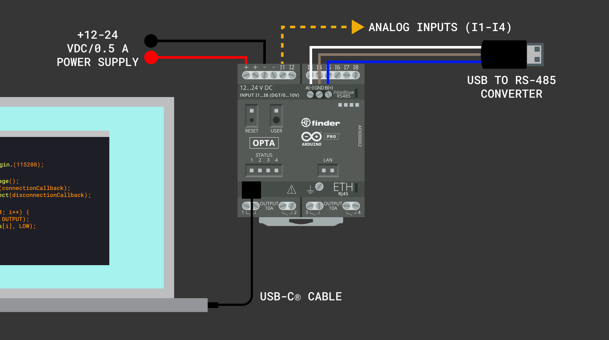

## Overview

In this tutorial, we will learn how to interface an Opta™ device with a USB memory stick for data logging. Data logging is an essential process in industrial environments, where it is critical to continuously monitor and record vital parameters like temperature, pressure, or flow rates. These parameters are often captured through sensors connected to the input ports of a device like the Opta™. 

You will record readings from four analog input ports of an Opta™ device and store the data in a `.txt` file on the USB memory stick. Additionally, we will use the onboard user button and LEDs of the Opta™ device to start, stop, and indicate the status of the data logging process to the user. 

## Goals

- Connect an Opta™ device to a USB memory stick for data logging.
- Read data from four analog input ports of an Opta™ device and write it to a `.txt` file on a USB memory stick.
- Use the onboard user button of an Opta™ device to start and stop the data logging process.
- Use the onboard user LEDs of an Opta™ device to indicate the different states of the data logging process to the user.

## Hardware and Software Requirements

### Hardware Requirements

- [Opta™](https://store.arduino.cc/collections/pro-family/products/opta-wifi) (x1)
- [USB-A to USB-C® cable](https://store.arduino.cc/products/usb-cable2in1-type-c) (x1)
- +12-24 VDC power supply (x1)
- Compatible USB-C® memory stick (x1)

### Software Requirements

- [Arduino IDE 1.8.10+](https://www.arduino.cc/en/software), [Arduino IDE 2.0+](https://www.arduino.cc/en/software), or [Arduino Web Editor](https://create.arduino.cc/editor)
- [Arduino_UnifiedStorage](https://github.com/arduino-libraries/Arduino_UnifiedStorage) library
- [Arduino_POSIXStorage](https://github.com/arduino-libraries/Arduino_POSIXStorage) library
- [Arduino_USBHostMbed5](https://github.com/arduino-libraries/Arduino_USBHostMbed5) library
- [ArduinoRS485](https://github.com/arduino-libraries/ArduinoRS485) library

### Compatible USB Memory Sticks

Any USB-C® memory stick should work with Opta® devices and the `Arduino_UnifiedStorage` library. The following USB-C® memory sticks have been officially tested by the Arduino Team and are known to be fully compatible with Opta® devices:

- Kingston® DataTraveler® 80 M USB-C 256 GB Flash Drive
- SanDisk® Ultra® Dual Drive USB Type-C 64 GB Flash Drive
- SanDisk® Ultra® Dual Drive Go USB Type-C 64 GB Flash Drive

**Note:** All USB memory sticks were formatted with the `FAT32` file system before they were used with an Opta® device and the `Arduino_UnifiedStorage` library.

***It is recommended to use USB memory sticks with a storage capacity of 256 GB or less. If a memory stick has a storage capacity greater than 256 GB, it is advised to partition it, limiting the accessible storage to 256 GB or less.***

## USB Memory Sticks and Data Logging

USB memory sticks, or Flash drives, are essential for data logging purposes in industrial environments. These small, rewritable storage devices equipped with integrated Flash memory and a USB interface are ideal for storing data such as temperature, pressure, and machine performance over time. 

Data logging, particularly in industrial environments, is essential for predictive maintenance, process optimization, and quality control. It involves collecting large amounts of data over time, which can be analyzed to identify trends, predict equipment failures and improve operational efficiency.


To manage the communication between a USB memory stick and an Opta™ device, you will use the [`Arduino_UnifiedStorage` library](https://github.com/arduino-libraries/Arduino_UnifiedStorage/tree/main). This library is excellent for working with different types of storage, including the FAT file systems that USB memory sticks often use. The main benefit of this library is that it makes dealing with various storage devices and file systems more straightforward. This is especially important in industrial data logging, where you need reliable and accurate data recording. 

***The `Arduino_UnifiedStorage` library simplifies how to read and write data to external storage devices, ensuring precise and consistent data logging. You can learn more about this library in the [following blog post](https://blog.arduino.cc/2023/11/10/introducing-arduinos-new-storage-libraries-streamline-data-management-for-your-projects/).***

## Instructions 

### Setting Up the Arduino IDE 

This tutorial requires the latest version of the Arduino IDE; you can download it [here](https://www.arduino.cc/en/software). In the Arduino IDE, you need to install the core for Opta™ devices; this can be done by navigating to **Tools > Board > Boards Manager** or clicking the Boards Manager icon in the left tab of the IDE. 

In the Boards Manager tab, search for `opta` and install the latest `Arduino Mbed OS Opta Boards` release.


You can start now compiling and uploading Arduino sketches to an Opta™ device using the Arduino IDE.

### Installing the Required Libraries 

This tutorial also requires the latest version of the `Arduino_UnifiedStorage` library installed on the Arduino IDE. This can be done by navigating to **Tools > Manage Libraries** or clicking the Library Manager icon in the left tab of the IDE. In the Library Manager tab, search for `Arduino_UnifiedStorage` and install the latest version.


***The `Arduino_UnifiedStorage` library need other dependencies: the `Arduino_POSIXStorage` and the `Arduino_USBHostMbed5` libraries. Ensure all the mentioned libraries are installed correctly and updated to their latest release.***

**Note**: The `Arduino_UnifiedStorage` library can use the RS-485 interface of your Opta™ device for **debugging purposes**. Ensure that the `ArduinoRS485 library` is installed and updated to its latest release since it is used by the `Arduino_UnifiedStorage` library for debugging. To receive and show the debug messages on your computer, you can use a USB to RS-485 converter, such as [the converter used by the Arduino Pro Content Team](https://www.waveshare.com/usb-to-rs485.htm). You can use the Arduino IDE's Serial Monitor to display the messages received in the converter or another serial terminal such as [CoolTerm](https://freeware.the-meiers.org/), a simple and cross-platform (Windows, Mac, and Linux) serial port terminal application (no terminal emulation) that is geared towards hobbyists and professionals.

### Setting Up the Hardware

Connect a +12-24 VDC power supply to your Opta™ device; for receiving debug messages, connect a USB to RS-485 converter to the RS-485 interface of your Opta™ device. The example sketch log data from the analog inputs ports `I1`, `I2`, `I3`, and `I4` of an Opta™ device connect an analog signal source to these input ports to test this functionality. For programming your Opta™ device, connect it to your computer using a USB-C® cable. 



### Writing Data to a USB Memory Stick

The example code below shows how to interface an Opta™ device with a USB memory stick for storing data from four analog inputs into a single line in a file on a USB memory stick. Here's a brief overview of the user interaction and the device's functionality:

- **Starting the process**: The data logging process begins by pressing and holding the user button on an Opta™ device for three seconds and then releasing it. This action triggers the device to enter a waiting mode for the connection of a USB memory stick indicated by a dynamic "Knight Rider" LED pattern with the onboard user LEDs.
- **Connecting the USB memory stick**: Once a USB memory stick is connected to an Opta™ device, it automatically starts logging data. Data from four analog inputs of the Opta™ device are recorded in a structured format onto the USB memory stick. During this process, `LED_D0` blinks to indicate active data logging.
- **Stopping data logging**: The process stops by pressing and holding the user button for another three seconds and then releasing it. The device stops recording data and signals completion by flashing all user LEDs ten times.

```arduino
/**
  Opta USB data logging example sketch
  Name: usb_data_logging_opta.ino
  Purpose: This sketch logs data from four analog inputs of an Opta device 
  into a single line in a file on a USB memory stick. The data logging process starts 
  when the user button is pressed for 3 seconds and stops when the button is
  pressed again for 3 seconds. A Knight Rider LED pattern is used to indicate 
  the status of USB connection. Once the data logging is done, all the user 
  LEDs blink 10 times.

  @author Arduino PRO Content Team
  @version 1.1 10/11/23
*/

#include "Arduino_UnifiedStorage.h"

// Constants for analog input pins and LED pins
const int analog_pins[] = { A0, A1, A2, A3 };
const int led_pins[] = { LED_D0, LED_D1, LED_D2, LED_D3 };

// Define constants for voltage, resolution, and divider.
const float VOLTAGE_MAX   = 3.0;      // Maximum voltage that can be read
const float RESOLUTION    = 4095.0;   // 12-bit resolution
const float DIVIDER       = 0.3;      // Voltage divider

// Timing control variables
unsigned long previousMillis = 0;
const long interval = 1000;

// Knight Rider LED pattern variables
int ledDirection = 1;
int currentLed = 0;

// USB storage and folder instances
USBStorage usbStorage;
Folder backupFolder = Folder();
bool usbIntialized = false;
volatile bool usbAvailable = false;

/**
  Function to handle USB connection callback.
  Sets the USB available flag and removes the connection callback.

  @param none
  @return none
*/
void connectionCallback() {
    usbAvailable = true;
    Arduino_UnifiedStorage::debugPrint("- USB device connected!");
    usbStorage.removeOnConnectCallback();
}

/**
  Function to handle USB disconnection callback.
  Resets the USB available flag and reinstalls the connection callback.

  @param none
  @return none
*/
void disconnectionCallback() {
    usbAvailable = false;
    Arduino_UnifiedStorage::debugPrint("- USB device disconnected!");
    usbStorage.onConnect(connectionCallback);
}

/**
  Function to handle Knight Rider LED pattern.
  Displays a LED sequence on Opta's user LEDs to indicate waiting for USB connection.

  @param none
  @return none
*/
void knightRiderPattern() {
  for (int i = 0; i < 4; i++) {
    digitalWrite(led_pins[i], LOW);
  }

  digitalWrite(led_pins[currentLed], HIGH);
  delay(100);
  currentLed += ledDirection;

  if (currentLed == 3) {
    ledDirection = -1;
  } else if (currentLed == 0) {
    ledDirection = 1;
  }
}

/**
  Function to check for a 3-second button press.
  Used to start or stop the data logging process.

  @param none
  @return true if button is pressed for 3 seconds, false otherwise
*/
bool checkButtonPress() {
  if (digitalRead(BTN_USER) == LOW) {
    unsigned long buttonPressTime = millis();
    while (digitalRead(BTN_USER) == LOW) {}
    if (millis() - buttonPressTime >= 3000) {
      Arduino_UnifiedStorage::debugPrint("- Button pressed for 3 seconds!");
      return true;
    }
  }
  return false;
}

/**
  Function to blink all user LEDs a specified number of times.
  Indicates the start or end of a process like data logging.

  @param times Number of times to blink the LEDs
  @return none
*/
void blinkAllLeds(int times) {
  for (int i = 0; i < times; i++) {
    for (int j = 0; j < 4; j++) {
      digitalWrite(led_pins[j], HIGH);
    }
    delay(500);
    for (int j = 0; j < 4; j++) {
      digitalWrite(led_pins[j], LOW);
    }
    delay(500);
  }
}

/**
  Function to handle the writing of data to USB storage.
  Manages USB initialization, mounting, and writing of sensor data to file.

  @param none
  @return none
*/
void writeToUSB() {
  if (usbAvailable && !usbIntialized) {
    usbStorage.begin();
    Folder usbRoot = usbStorage.getRootFolder();
    String folderName = "backup_data";
    backupFolder = usbRoot.createSubfolder(folderName);
    Arduino_UnifiedStorage::debugPrint("- Backup folder created: " + backupFolder.getPathAsString());
    usbStorage.unmount();
    usbIntialized = true;
  } else if (usbAvailable && usbIntialized) {
    if (!usbStorage.isMounted()) {
      if (usbStorage.begin()) {
        performUpdate();
      }
    } else if (usbStorage.isMounted()) {
      performUpdate();
    }
  }
}

/**
  Function to perform data update on USB storage.
  Writes analog sensor data in a formatted string to a text file.

  @param none
  @return none
*/
void performUpdate() {
  UFile backupFile = backupFolder.createFile("analog_inputs_data.txt", FileMode::APPEND);
  unsigned long currentMillis = millis();
  if (currentMillis - previousMillis >= interval) {
    previousMillis = currentMillis;

    String buffer = "";
    for (int i = 0; i < 4; i++) {
      int value = analogRead(analog_pins[i]);

      // Convert the terminal value to its corresponding voltage. 
      float voltage = value * (VOLTAGE_MAX / RESOLUTION) / DIVIDER;
      if (i > 0) {
        buffer += "; ";
      }
      buffer += "A" + String(i) + ": " + String(voltage);
    }
    buffer += "\n";
    backupFile.write(buffer);
    Arduino_UnifiedStorage::debugPrint("- Data written to file: " + buffer);
  }
  backupFile.close();
  usbStorage.unmount();
  Arduino_UnifiedStorage::debugPrint("- File closed and USB storage unmounted!");
}

// Board initialization 
void setup() {
  Serial.begin(115200); 
  Arduino_UnifiedStorage::debuggingModeEnabled = false;
  analogReadResolution(12);

  usbStorage = USBStorage();
  usbStorage.onConnect(connectionCallback);
  usbStorage.onDisconnect(disconnectionCallback);

  for (int i = 0; i < 4; i++) {
    pinMode(led_pins[i], OUTPUT);
    digitalWrite(led_pins[i], LOW);
  }

  pinMode(BTN_USER, INPUT_PULLUP);
  Arduino_UnifiedStorage::debugPrint("- Setup complete!");
}

// Main loop
void loop() {
  static bool dataLoggingStarted = false;

  if (usbAvailable && !dataLoggingStarted) {
    knightRiderPattern();

    if (checkButtonPress()) {
      dataLoggingStarted = true;

      // Turn off all the user LEDs
      for (int i = 0; i < 4; i++) {
        pinMode(led_pins[i], OUTPUT);
        digitalWrite(led_pins[i], LOW);
      }

      // Turn on LED_D0 for data logging indication
      digitalWrite(led_pins[0], HIGH); 
      Arduino_UnifiedStorage::debugPrint("- Data logging started!");
    }
  } else if (dataLoggingStarted) {
    writeToUSB();

    // Toggle LED_D0
    digitalWrite(led_pins[0], digitalRead(led_pins[0]) == LOW); 

    if (checkButtonPress()) {
      dataLoggingStarted = false;
      Arduino_UnifiedStorage::debugPrint("- Data logging stopped!");
      
      // Blink all LEDs 10 times to indicate end of data logging
      blinkAllLeds(10); 
    }
  }
}
```

Here is a step-by-step breakdown of the code shown above:

Import libraries:

- The sketch starts by importing the `Arduino_UnifiedStorage` library, which is essential for managing the USB memory stick and file system.

Variables and instances definition:

- The sketch establishes instances for handling the USB memory stick and the file system. Arrays are defined to store the analog input pin numbers (`analog_pins`) and the onboard user LED numbers (`led_pins`).
- Variables for managing time (`previousMillis` and `interval`) are used to track data logging intervals without relying on the built-in `delay()` function.
- The "Knight Rider" LED pattern is controlled by `ledDirection` and `currentLed` variables, sequentially illuminating the user LEDs on the Opta™ device.

The `setup()` function:

- The sketch initializes your Opta™ device, setting the analog-to-digital converter resolution and preparing the onboard user LEDs.
- The sketch establishes connection handlers for the USB memory stick using `connectionCallback()` and `disconnectionCallback()` functions.

The main `loop()` function:

- The sketch monitors the onboard user button for a three-second pressing, holding, and then releasing it to initiate or stop the data logging process.
- When data logging is started, `LED_D0` is illuminated as an indication. The "Knight Rider" LED pattern is displayed while the device waits for a USB memory stick connection.
- The `writeToUSB()` function manages the data writing process to the USB memory stick, including initialization and updating data to the USB memory stick through the `performUpdate()` function.
- Analog input data is formatted and written to a file named `analog_inputs_data.txt` on the USB memory stick.
- When the data logging is completed (indicated by pressing the user button for three seconds again), the code stops writing data to the USB memory stick.
- The sketch shows the end of the data logging process by blinking all the onboard user LEDs ten times.

**Optional**: Debugging with `debugPrint` statements via Opta's RS-485 interface

- The `debugPrint` functions provide essential feedback throughout the code, aiding in monitoring and troubleshooting.
- These statements output important information via your Opta™ device's onboard RS-485 serial interface, including status updates during USB memory stick connection and file operation results.

### Testing the Example Code

To upload the example sketch, click the **Verify** button to compile and check for errors; then click the **Upload** button to program the device with the sketch.


After uploading the example sketch, you can test it by connecting a compatible USB-C® memory stick. The example sketch log data from the analog inputs ports `I1`, `I2`, `I3`, and `I4`. Connect an analog signal source to these input ports to test this functionality.


## Conclusion

In this tutorial, you have learned how to interface an Opta™ device with a USB memory stick, read analog input data, and store it on the USB memory stick. Additionally, you have understood how to use the onboard user LEDs to display status information to the user. With these skills, you can explore more complex projects, such as implementing advanced data logging and analysis for various sensors with Opta™ devices.