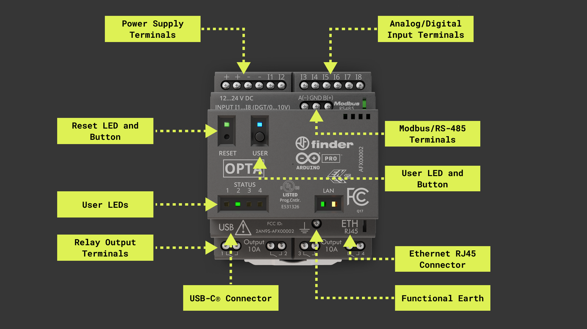
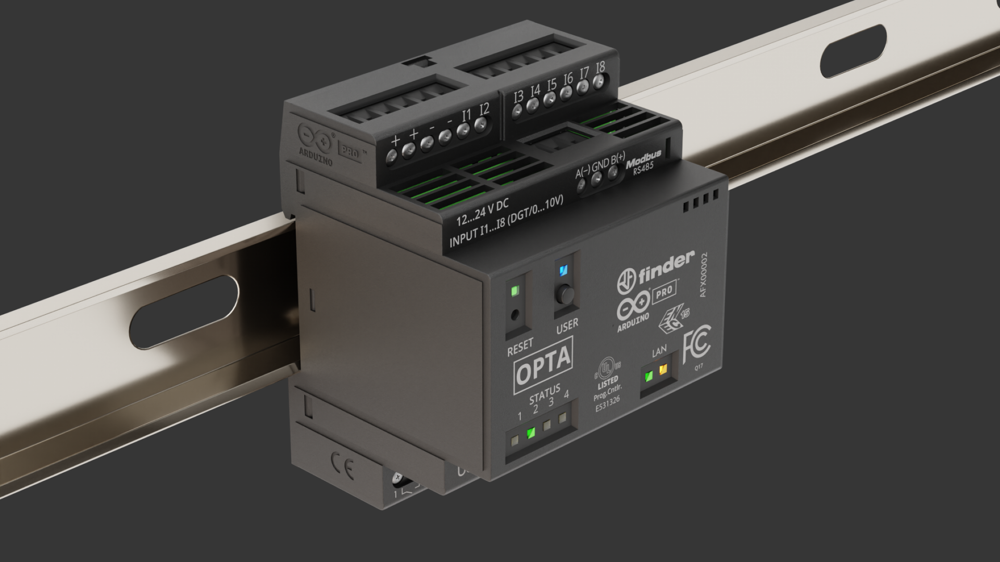
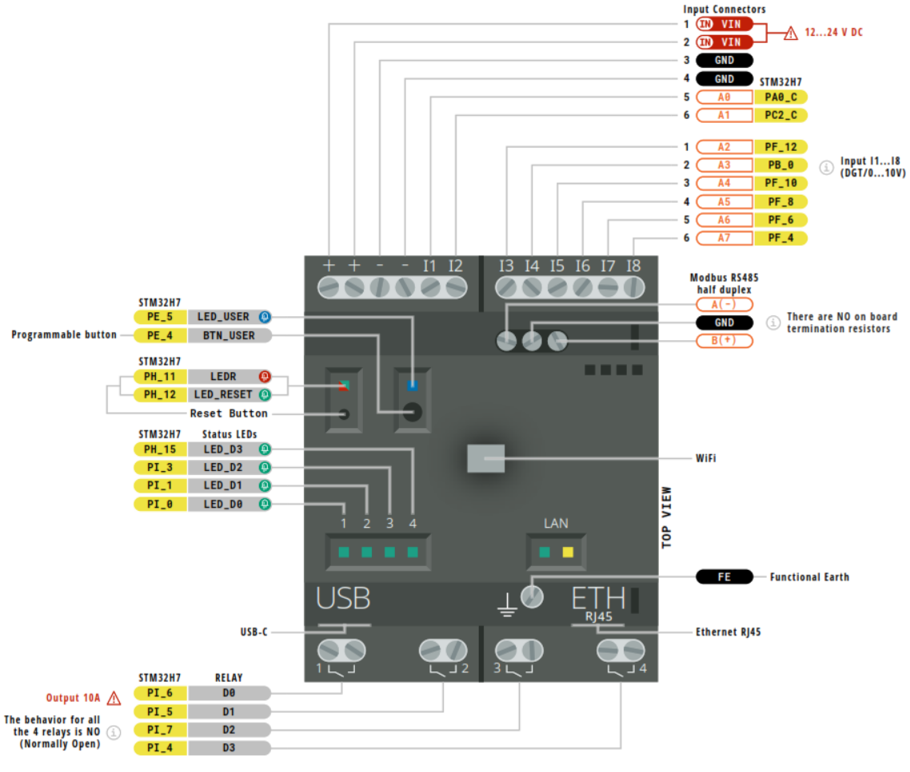
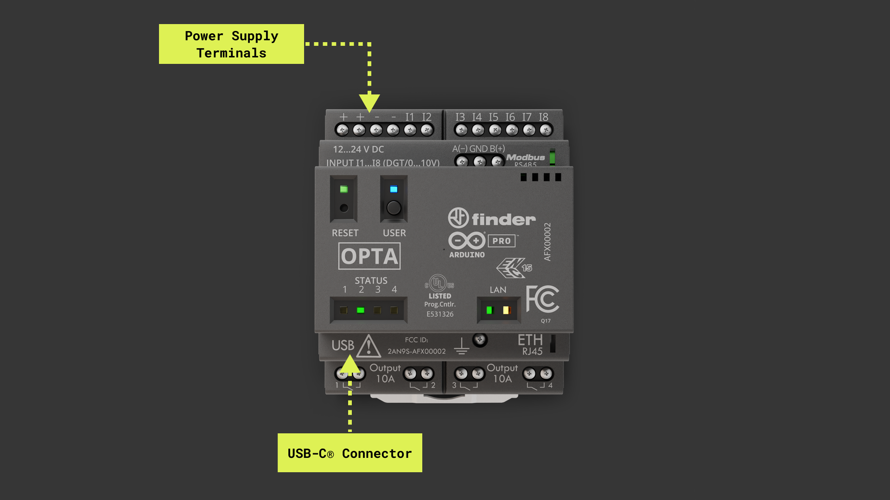
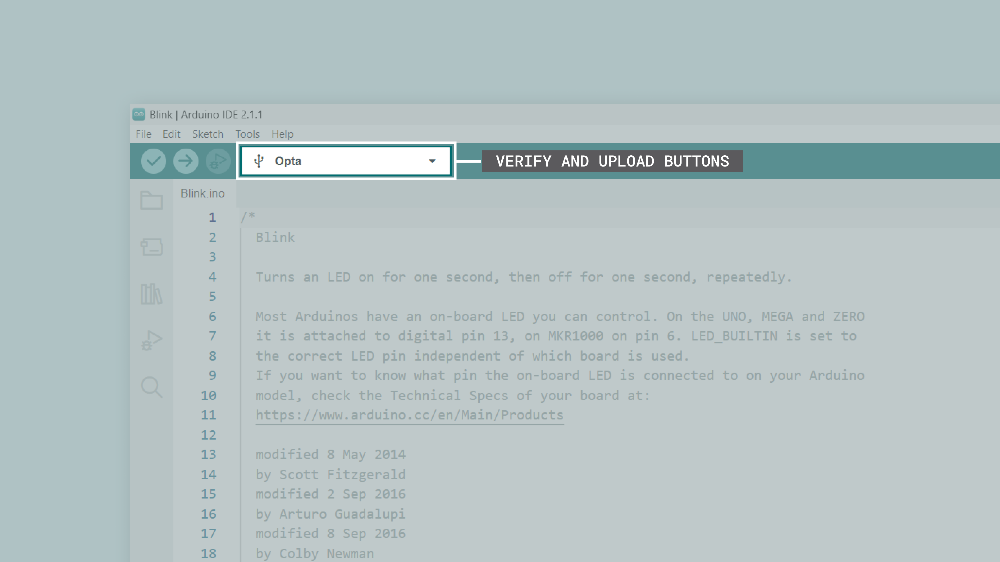
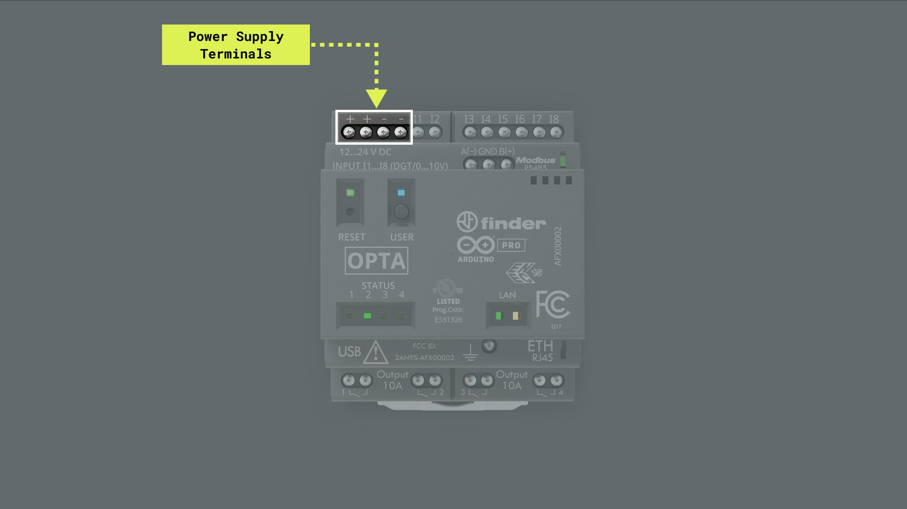
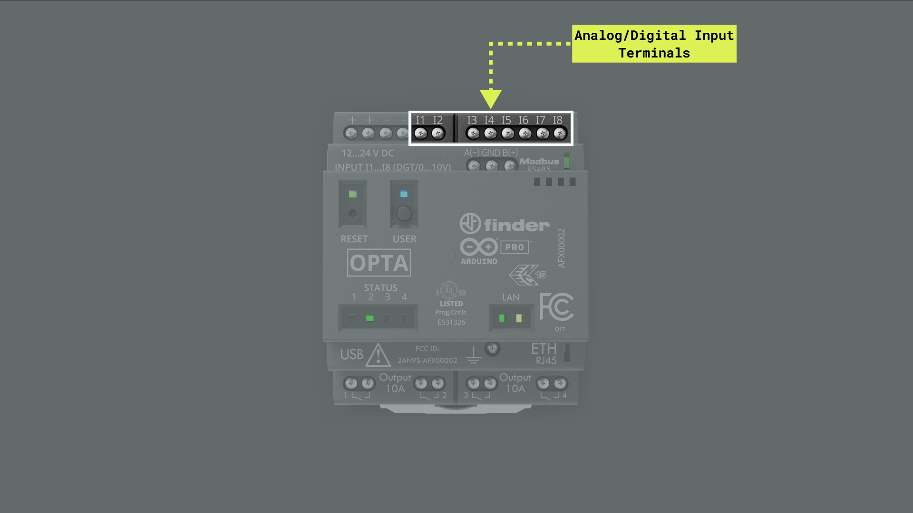

## Overview

This user manual will provide a comprehensive overview of the Opta™, covering its major hardware and software elements. With this user manual, you will learn how to set up, configure and use all the main features of an Opta™ device.

## Hardware and Software Requirements

### Hardware Requirements

- [Opta™ Lite](https://store.arduino.cc/products/opta-lite), [Opta™ RS485](https://store.arduino.cc/products/opta-rs485), or [Opta™ WiFi](https://store.arduino.cc/products/opta-wifi) (x1)
- USB-C® cable (x1)
- 24 VDC/0.5A power supply (x1)

### Software Requirements

- [Arduino IDE 2.0+](https://www.arduino.cc/en/software) or [Arduino Web Editor](https://create.arduino.cc/editor)
- [Arduino PLC IDE 1.0.3+](https://www.arduino.cc/en/software)

## Opta™ Overview

The Opta™ is a secure micro Programmable Logic Controller (PLC) with Industrial Internet of Things (IoT) capabilities. Developed in partnership with Finder®, this device supports both the Arduino programming language and standard IEC-61131-3 PLC programming languages, such as Ladder Diagram (LD), Sequential Function Chart (SFC), Function Block Diagram (FBD), Structured Text (ST), and Instruction List (IL), making it an ideal device for automation engineers. Based on the STM32H747XI from STMicroelectronics®, a high-performance Arm® Cortex®-M7 + Cortex®-M4 microcontroller, the Opta™ is a perfect option for a wide range of applications, from real-time control to predictive maintenance applications.

### Opta™ Main Components

The Opta™ features a secure and durable design that enables it for automation applications. 



Here's an overview of the device's main components shown in the image above:

- **Microcontroller**: At the heart of the Opta™ is the STM32H747XI, a powerful and high-performance microcontroller from STMicroelectronics®. The STM32H747XI is built around an Arm® Cortex®-M7 and Cortex®-M4 32-bit RISC cores. The Cortex®-M7 core operates at up to 480 MHz, and the Cortex®-M4 core at up to 240 MHz.
- **Wireless connectivity**: The Opta™ (WiFi variant only) supports 2.4 GHz Wi-Fi® (802.11 b/g/n) and Bluetooth® Low Energy (4.2 supported by firmware and 5.1 supported by hardware), allowing the device to communicate wirelessly with other devices and systems. 
- **Ethernet connectivity**: The Opta™ (all variants) features an onboard, high-performance 10/100 Mbps Ethernet transceiver accessible through its onboard RJ45 connector.
- **Security**: The Opta™ features an onboard ready-to-use secure element, the ATECC608B from Microchip®, specifically designed for IoT devices and provides advanced security features.
- **USB connectivity**: The Opta™ features an onboard USB-C® port that can be used for programming and data logging.
- **Analog and digital peripherals**: The Opta™ features analog and digital peripherals such as eight analog/digital input ports and four digital outputs ports (relay outputs). 
- **RS-485 connectivity**: The Opta™ (all variants) features a physical RS-485 communication interface available through an onboard connector.
- **Form factor**: Opta™ devices can be mounted standalone on a DIN rail, a grid, or a panel, providing quick and easy access to all input/output ports and peripherals.



### Opta™ Core and Libraries

The **`Arduino Mbed OS Opta Boards`** core contains the libraries and examples to work with the Opta™'s peripherals and onboard components, such as its input ports, output ports, Wi-Fi® and Bluetooth® module (WiFi variant only). To install the core for the Opta™, navigate to **Tools > Board > Boards Manager** or click the **Boards Manager** icon in the left tab of the IDE. In the Boards Manager tab, search for `opta` and install the latest `Arduino Mbed OS Opta Boards` version.


### Pinout



The complete pinout (for all Opta™ variants) is available and downloadable as PDF from the link below:

- [Opta™ pinout](https://docs.arduino.cc/static/820c493afe76c7aedca3f4709b12b129/opta-full-pinout.pdf)

### Datasheet

The complete datasheet (for all Opta™ variants) is available and downloadable as PDF from the link below:

- [Opta™ datasheet](https://docs.arduino.cc/resources/datasheets/AFX00001-AFX00002-AFX00003-datasheet.pdf)

### STEP Files

The complete STEP files (for all Opta™ variants) are available and downloadable from the link below:

- Opta™ STEP files  

## First Use

### Powering the Opta™

The Opta™ can be powered by the following:

- Using a **USB-C® cable** (not included) for programming purposes only, **Opta™'s output ports (relay outputs) are not powered via its USB-C® port**.
- Using an external **+12 VDC to +24 VDC power supply** connected to the Opta™'s power supply terminals (please, refer to the [pinout section](#pinout) of the user manual).



### Hello World Example

Let's program the Opta™ with the classic `hello world` example used in the Arduino ecosystem: the `Blink` sketch. We will use this example to verify the board's connection to the Arduino IDE and that the Opta™ core and device are working as expected.

There are two ways to program this example in the board:

- Navigate to **File > Examples > 01.Basics > Blink**.
- Copy and paste the code below into a new sketch in the Arduino IDE.

```arduino
void setup() {
  // Initialize LED_BUILTIN as an output 
  pinMode(LED_BUILTIN, OUTPUT);
}

void loop() {
  // Turn the user LED (RESET) off
  digitalWrite(LED_BUILTIN, HIGH);
  delay(1000);
  // Turn the user LED (RESET) on
  digitalWrite(LED_BUILTIN, LOW);
  delay(1000);
}
```

***For all the Opta™ variants, the `LED_BUILTIN` macro represents the green LED on top of the device's RESET button***

To upload the code to the Opta™, click the **Verify** button to compile the sketch and check for errors; then click the **Upload** button to program the device with the sketch.



You should see the green LED on top of your device's `RESET` button turn on for one second, then off for one second, repeatedly. With the Opta™ WiFi variant, you also have another user-programmable LED located on top of the USER button of the device; this blue user LED is represented with the `LED_USER` macro. The modified code that uses the blue `LED_USER` is shown below:

```arduino
void setup() {
  // Initialize LED_USER as an output 
  pinMode(LED_USER, OUTPUT);
}

void loop() {
  // Turn the USER LED off
  digitalWrite(LED_USER, HIGH);
  delay(1000);
  // Turn the USER LED on
  digitalWrite(LED_USER, LOW);
  delay(1000);
}
```

## USB®-C Port

The Opta™ has an **onboard USB®-C port** that can be used for programming the device's microcontroller and for data logging with mass storage devices such as USB memory sticks. 


***Opta's USB®-C port shall be used only for programming or data logging purposes. This port does not powers Opta's output relays.***

## Electrical Terminals

This user manual section covers the Opta™ electrical terminals, showing their main hardware and software characteristics. The Opta™ has 12 electrical terminals, four of which can be used for the power supply of the device, and 8 of them can be used as digital/analog inputs.

### Power Supply

As shown in the image below, the first four terminals, from left to right, are Opta™'s power supply terminals; two are marked with `+` signs and two with `-` signs. An external +12 VDC to +24 VDC power supply can be connected to these terminals. Opta™'s maximum power consumption at 12 VDC is 2 W, and at 24 VDC is 2.2 W.



***For use with Opta devices, we recommend the official Finder 78.12.1.230.2400 power supply. This power supply was designed to provide stable +24 VDC despite consistently fluctuating current draw.***

### Programmable Inputs

The image below shows Opta™ devices have **eight analog/digital programmable inputs** accessible through terminals `I1`, `I2`, `I3`, `I4`, `I5`, `I6`, `I7`, and `I8`. 



Analog/digital inputs terminals are mapped as described in the following table:

| **Opta™ Terminal** | **Arduino Pin Mapping** |
|:------------------:|:-----------------------:|
|        `I1`        |      `A0`/`PIN_A0`      |
|        `I2`        |      `A1`/`PIN_A1`      |
|        `I3`        |      `A2`/`PIN_A2`      |
|        `I4`        |      `A3`/`PIN_A3`      |
|        `I5`        |      `A4`/`PIN_A4`      |
|        `I6`        |      `A5`/`PIN_A5`      |
|        `I7`        |      `A6`/`PIN_A6`      |
|        `I8`        |      `A7`/`PIN_A7`      |

***When used as analog inputs,the working voltage range is from 0 to +10 VDC; when used as digital inputs, the working voltage range is from 0 to +24 VDC.***

The input terminals can be used through the built-in functions of the Arduino programming language. To use the input terminals as digital inputs:

- Add the `pinMode(pinName, INPUT)` instruction in your sketch's  `setup()` function. 

To use the input terminals as analog inputs:

- Add the `analogReadResolution()` instruction in your sketch's  `setup()` function.

The sketch below shows how to monitor analog voltages on Opta™'s input terminals `I1`, `I2`, and `I3`. It initializes a serial connection, takes readings from each defined terminal, converts those readings into voltage based on a 12-bit resolution, and outputs these voltage values through the Arduino IDE's Serial Monitor. The readings are looped every second, allowing you to monitor changes in real-time.


```arduino
/**
  Opta's Analog Input Terminals
  Name: opta_analog_inputs_example.ino
  Purpose: This sketch demonstrates the use of I1, I2, and I3 input 
  terminals as analog inputs on Opta™.

  @author Arduino PRO Content Team
  @version 2.0 22/07/23
*/

// Define constants for voltage, resolution, and divider.
const float VOLTAGE_MAX   = 3.0;      // Maximum voltage that can be read
const float RESOLUTION    = 4095.0;   // 12-bit resolution
const float DIVIDER       = 0.3;      // Voltage divider

// Array of terminals.
const int TERMINALS[] = {A0, A1, A2};

// Number of terminals.
const int NUM_PINS = 3;

void setup() {
  // Initialize serial communication at 9600 bits per second.
  Serial.begin(9600);

  // Enable analog inputs on Opta
  // Set the resolution of the ADC to 12 bits.
  analogReadResolution(12); 
}

void loop() {
  // Loop through each of the terminal, read the terminal analog value, convert it to voltage, and print the result.
  for (int i = 0; i < NUM_PINS; i++) {
    readAndPrint(TERMINALS[i], i + 1);
  }

  // Delay for a second before reading the terminals again.
  delay(1000);
}

// This function reads the value from the specified pin, converts it to voltage, and prints the result.
void readAndPrint(int terminal, int terminalNumber) {
  // Read the input value from the analog pin.
  int terminalValue = analogRead(terminal);

  // Convert the terminal value to its corresponding voltage. 
  float voltage = terminalValue * (VOLTAGE_MAX / RESOLUTION) / DIVIDER;
  
  // Print the terminal value and its corresponding voltage.
  Serial.print("I");
  Serial.print(terminalNumber);
  Serial.print(" value: ");
  Serial.print(terminalValue);
  Serial.print(" corresponding to ");
  Serial.print(voltage, 5);
  Serial.println(" VDC");
}
```

The sketch below shows how to monitor digital states on Opta™'s input terminals `I1`, `I2`, and `I3`. It initializes a serial connection, takes readings from each defined terminal, and interprets these readings as either `HIGH` or `LOW` digital states. These states are then output through the Arduino IDE's Serial Monitor. The state readings are looped every second, allowing you to monitor changes in real-time.

```arduino
/**
  Opta's Digital Input Terminals
  Name: opta_digital_inputs_example.ino
  Purpose: This sketch demonstrates the use of I1, I2, and I3 input 
  terminals as digital inputs on Opta™.

  @author Arduino PRO Content Team
  @version 2.0 23/07/23
*/

// Array of terminals.
const int TERMINALS[] = {A0, A1, A2};

// Number of terminals.
const int NUM_PINS = 3;

void setup() {
  // Initialize serial communication at 9600 bits per second.
  Serial.begin(9600);

  // Set the mode of the pins as digital inputs.
  for (int i = 0; i < NUM_PINS; i++) {
    pinMode(TERMINALS[i], INPUT);
  }
}

void loop() {
  // Loop through each of the terminal, read the terminal digital value, and print the result.
  for (int i = 0; i < NUM_PINS; i++) {
    readAndPrint(TERMINALS[i], i + 1);
  }

  // Delay for a second before reading the terminals again.
  delay(1000);
}

// This function reads the digital value from the specified pin and prints the result.
void readAndPrint(int terminal, int terminalNumber) {
  // Read the input value from the digital pin.
  int terminalValue = digitalRead(terminal);
  
  // Print the terminal value.
  Serial.print("I");
  Serial.print(terminalNumber);
  Serial.print(" value: ");
  Serial.println(terminalValue);
}
```

## Status LEDs

Opta™ Lite and Opta™ RS485 devices have **four user-programmable LEDs**, and **Opta™ WiFi devices have an extra one**. 


User-programmable LEDs are mapped as described in the following table:

| **Opta™ User LED** | **Arduino Pin Mapping** |
|:------------------:|:-----------------------:|
|     `STATUS 1`     |  `LED_D0`/`LED_RELAY1`  |
|     `STATUS 2`     |  `LED_D1`/`LED_RELAY2`  |
|     `STATUS 3`     |  `LED_D2`/`LED_RELAY3`  |
|     `STATUS 4`     |  `LED_D3`/`LED_RELAY4`  |
|       `USER`       |    `LED_USER`/`LEDB`    |
|       `RESET`      |      `LED_BUILTIN`      |

The sketch below shows how to create a Knight Rider-style "scanning" effect using the Opta™'s user LEDs. It works by sequentially lighting up each user's LED, creating a visual effect of scanning back and forth. This effect is achieved by defining an array of the user LEDs identifiers, and using loops to cycle through these identifiers, turning each user LED on and off in sequence.

```arduino
/**
  Opta's Knight Rider Scanning Effect
  Name: opta_knight_rider_example.ino
  Purpose: This sketch demonstrates a Knight Rider scanning effect using 
  the user LEDs of Opta™ devices.

  @author Arduino PRO Content Team
  @version 2.0 22/07/23
*/

// Define an array to hold the pin numbers for Opta's user LEDs.
const int USER_LEDS[] = {LED_D0, LED_D1, LED_D2, LED_D3};

// Number of Opta's user LEDs
const int NUM_LEDS = 4;

void setup() {
  // Set the mode for each user LED to OUTPUT.
  for (int i = 0; i < NUM_LEDS; i++) {
    pinMode(USER_LEDS[i], OUTPUT);
  }
}

void loop() {
  // Scan from the first LED to the last.
  for (int i = 0; i < NUM_LEDS; i++) {
    // Turn on the LED.
    // Wait for 50 milliseconds.
    digitalWrite(USER_LEDS[i], HIGH); 
    delay(50); 
    // Turn off the LED.
    // Wait for 50 milliseconds.
    digitalWrite(USER_LEDS[i], LOW); 
    delay(50); 
  }
  
  // Scan back from the last LED to the first.
  for (int i = NUM_LEDS - 1; i >= 0; i--) {
    // Turn on the LED.
    // Wait for 50 milliseconds.
    digitalWrite(USER_LEDS[i], HIGH); 
    delay(50); 
    // Turn off the LED.
    // Wait for 50 milliseconds.
    digitalWrite(USER_LEDS[i], LOW); 
    delay(50); 
  }
}
```

## Actuators 

This user manual section covers the Opta™ onboard actuators, showing their main hardware and software characteristics. The Opta™ has one user-programmable button and four user-programmable output relays.

### User Button

All Opta™ variants devices have an onboard user-programmable button; this user button is mapped as `BTN_USER` in the Opta™ core. The user button has a pull-up resistor, meaning its default value (while not being pressed) is `HIGH`. 


The user-programmable button can be used through the built-in functions of the Arduino programming language. To use the user button, first define it as a digital input:

- Add the `pinMode(BTN_USER, INPUT)` instruction in your sketch's  `setup()` function.

To read the status of the user button:

- Add the `digitalRead(BTN_USER)` instruction in your sketch.

The sketch below shows how to use Opta™'s programmable user button to control the sequence of status LEDs, `D0` to `D3`. It initializes the state of the user LEDs and button, along with variables for button debouncing. This sketch continuously reads the state of the user button, debounces the button input to avoid false triggering due to electrical noise, and increments a counter each time the button is pressed. It then passes the control to the `changeLights()` function. This function first turns off all LEDs and then, depending on the value of the counter turns on the corresponding LED. With each button press, the counter increments, and a different LED lights up, cycling back to the beginning after the final LED.

```arduino
/**
  Opta's User Button Example
  Name: opta_user_button_example.ino
  Purpose: Configures Opta's user-programmable button to control the user LEDs.
  This example includes debouncing for the user button.

  @author Arduino PRO Content Team
  @version 2.0 23/07/23
*/

// Current and previous state of the button.
int buttonState     = 0;
int lastButtonState = 0;

// Counter to keep track of the LED sequence.
int counter = 0;

// Variables to implement button debouncing.
unsigned long lastDebounceTime  = 0;
unsigned long debounceDelay     = 150;

// Array to store LED pins.
int LEDS[] = {LED_D0, LED_D1, LED_D2, LED_D3};
int NUM_LEDS = 4;

void setup() {
  // Initialize Opta user LEDs.
  for(int i = 0; i < NUM_LEDS; i++) {
    pinMode(LEDS[i], OUTPUT);
  }
  pinMode(BTN_USER, INPUT);
}

void loop() {
  int reading = digitalRead(BTN_USER);
  
  // Check if button state has changed.
  if (reading != lastButtonState) {
    lastDebounceTime = millis();
  }

  // Debouncing routine.
  if ((millis() - lastDebounceTime) > debounceDelay) {
    if (reading != buttonState) {
      buttonState = reading;

      // Only increment the counter if the new button state is HIGH.
      if (buttonState == HIGH) {
        if(counter < NUM_LEDS){
          counter++;
        }
        else{
          counter = 0;
        }
      }
    }
  }

  // Save the current state as the last state, for next time through the loop.
  lastButtonState = reading;
  
  // Control LED states.
  changeLights();
}

/**
  Control the status LEDs based on a counter value.
  Turns off all LEDs first, then turns on the LED 
  corresponding to the current counter value.

  @param None.
*/
void changeLights() {
  // Turn off all user LEDs.
  for(int i = 0; i < NUM_LEDS; i++) {
    digitalWrite(LEDS[i], LOW);
  }

  // Turn on the selected user LED.
  if(counter > 0) {
    digitalWrite(LEDS[counter - 1], HIGH);
  }
}
```

### Relays

Opta™ devices (all variants) have four Normally Open (NO) 10 A relays which are capable of actuating on loads at a rated voltage of 250 VAC and up to a maximum switching voltage of 400 VAC.


User-programmable relay outputs are mapped as described in the following table:

| **Opta™ Relay Output** | **Arduino Pin Mapping** |
|:----------------------:|:-----------------------:|
|       `OUTPUT 1`       |      `D0`/`RELAY1`      |
|       `OUTPUT 2`       |      `D1`/`RELAY2`      |
|       `OUTPUT 3`       |      `D2`/`RELAY3`      |
|       `OUTPUT 4`       |      `D3`/`RELAY4`      |

The output relays can be used through the built-in functions of the Arduino programming language. To use an output relay as a digital output:

- Add the `pinMode(relayOutput, OUTPUT)` instruction in your sketch's `setup()` function. 
  
To change the status of the output relay (`LOW` or `HIGH`):

- Add your sketch's `digitalWrite(relayOutput, LOW)` or `digitalWrite(relayOutput, HIGH)` instruction.

The sketch below tests the output relays and status LEDs of an Opta™ device. The sketch initializes the relays outputs and user LEDs as outputs; then, the sketch turns each output relay and its corresponding status LED on and off in sequence, with a one-second delay between each state change. This allows us to visually verify the correct functioning of the output relays and user LEDs.

```arduino
/*
  Opta's™ Output Relays 
  Name: opta_outputs_relays_example.ino
  Purpose: This sketch tests the output relays of Opta™ devices.

  @author Arduino PRO Content Team
  @version 2.0 22/07/23
*/

// Arrays of relays and user LEDs
int relayOutputs[] = {D0, D1, D2, D3};
int userLeds[] = {LED_D0, LED_D1, LED_D2, LED_D3};

// Compute the number of relays/LEDs based on the size of the relayPins array
int numRelays = 4;

void setup() {
  for(int i = 0; i < numRelays; i++) {
    // Sets the mode of the relays and user LEDs as outputs
    pinMode(relayOutputs[i], OUTPUT); 
    pinMode(userLeds[i], OUTPUT); 
  }
}

void loop() {
  // For each relay/user LED: turn it on, wait for a second, turn it off, wait for another second
  for(int i = 0; i < numRelays; i++) {
    digitalWrite(relayOutputs[i], HIGH); 
    digitalWrite(userLeds[i], HIGH);
    delay(1000);
    digitalWrite(relayOutputs[i], LOW);
    digitalWrite(userLeds[i], LOW);
    delay(1000);
  }
}
```

## Interrupts

**Opta's™ analog/digital programmable inputs and user-programmable button are interrupt capable**. An interrupt is a signal that prompts Opta's™ microcontroller to stop its current execution and start executing a special routine known as the Interrupt Service Routine (ISR). Once the ISR finishes, the microcontroller resumes executing its previous routine.

Interrupts are particularly useful when reacting instantly to an external event, such as a button press or a sensor signal. Without interrupts, you would have to constantly poll the status of a button or a sensor in the main loop of your running sketch. With interrupts, you can let your Opta's™ microcontroller do other tasks and only react when a desired event occurs.

***Due to Opta's™ microcontroller interrupt structure, interrupts in terminals `I1` and `I3` cannot be used simultaneously; you need to choose just one to avoid issues with them.***

Interrupts can be used through the built-in functions of the Arduino programming language. To enable interrupts in your Opta™s analog/digital programmable inputs and user-programmable button:

- Add the `attachInterrupt(digitalPinToInterrupt(pin), ISR, mode)`  instruction in your sketch's `setup()` function. Notice that the `pin` parameter can be `A0`, `A1`, `A2`, `A3`, `A4`, `A5`, `A6`, `A7`, or `BTN_USER`; the `ISR` parameter is the ISR function to call when the interrupt occurs, and the `mode` parameter defines when the interrupt should be triggered (`LOW`, `CHANGE`, `RISING`, or `FALLING`). 

The sketch below shows how to use Opta™'s programmable user button to control the sequence of status LEDs, `D0` to `D3`. In the original code shown in the [User Button section](#user-button), the user button's state was continuously checked inside the main loop of the sketch, and when a change was detected, the LEDs were updated accordingly. While this approach works for simple tasks, it becomes inefficient when your Opta™ has to perform more complex tasks or react to multiple inputs. In the modified code, we've set up an interrupt that triggers on a rising edge (`RISING`) of the signal from the user button, which means it triggers when the button is pressed. 

```arduino
/**
  Opta's User Button Example (Interrupt)
  Name: opta_user_button_interrupt_example.ino
  Purpose: Configures Opta's user-programmable button to control the user LEDs 
  using interrupts rather than polling the button's state. This example includes 
  debouncing for the user button.

  @author Arduino PRO Content Team
  @version 2.0 23/07/23
*/

// Current and previous state of the button.
volatile bool buttonPressed = false;

// Counter to keep track of the LED sequence.
int counter = 0;

// Variables to implement button debouncing.
unsigned long lastDebounceTime  = 0;
unsigned long debounceDelay     = 150;

// Array to store LED pins.
int LEDS[] = {LED_D0, LED_D1, LED_D2, LED_D3};
int NUM_LEDS = 4;

void setup() {
  // Initialize Opta user LEDs.
  for(int i = 0; i < NUM_LEDS; i++) {
    pinMode(LEDS[i], OUTPUT);
  }
  
  // Set up the interrupt on USER_BTN to trigger on a rising edge (when the button is pressed)
  attachInterrupt(digitalPinToInterrupt(BTN_USER), buttonISR, RISING);
}

/**
  Interrupt service routine (ISR)
  Set the variable buttonPressed to true

  @param None.
*/
void buttonISR() {
  buttonPressed = true;
}

void loop() {
  // If the button was pressed
  if (buttonPressed) {
    // Debouncing routine.
    if ((millis() - lastDebounceTime) > debounceDelay) {
      lastDebounceTime = millis();

      // Only increment the counter if the new button state is HIGH.
      if(counter < NUM_LEDS){
        counter++;
      }
      else{
        counter = 0;
      }
      
      // Reset the button pressed flag
      buttonPressed = false;
    }
  }

  // Control LED states.
  changeLights();
}

/**
  Control the status LEDs based on a counter value.
  Turns off all LEDs first, then turns on the LED 
  corresponding to the current counter value.

  @param None.
*/
void changeLights() {
  // Turn off all user LEDs.
  for(int i = 0; i < NUM_LEDS; i++) {
    digitalWrite(LEDS[i], LOW);
  }

  // Turn on the selected user LED.
  if(counter > 0) {
    digitalWrite(LEDS[counter - 1], HIGH);
  }
}

```

To learn more about interrupts in Opta devices, check out our [Getting Started with Interrupts on Opta™ tutorial](https://docs.arduino.cc/tutorials/opta/getting-started-with-interrupts).

## Real-Time Clock


## Arduino PLC IDE

PLC IDE is the Arduino solution to program Opta™ devices using the five programming languages recognized by the IEC 61131-3 standard. These programming languages include:

- Ladder Diagram (LD)
- Functional Block Diagram (FBD)
- Structured Text (ST)
- Sequential Function Chart (SFC)
- Instruction List (IL)

In the PLC IDE, you can mix PLC programming with standard Arduino sketches within the integrated sketch editor and share variables between the two environments. You can also automate tasks in your software applications; this gives you control over scheduling and repetition, enhancing the reliability and efficiency of your project. Moreover, communication protocols such as CANOpen, Modbus RTU, and Modbus TCP can be managed effortlessly using integrated no-code fieldbus configurators.

[Click here](https://www.arduino.cc/pro/software-plc-ide) to learn more about the PLC IDE.

## Support

If you encounter any issues or have questions while working with Opta™ devices, we provide various support resources to help you find answers and solutions.

### Help Center

Explore our Help Center, which offers a comprehensive collection of articles and guides for Opta™ devices. The Arduino Help Center is designed to provide in-depth technical assistance and help you make the most of your device.

- [Opta™ help center page](https://support.arduino.cc/hc/en-us/categories/360001637274-Hardware-Support)

### Forum

Join our community forum to connect with other Portenta C33 users, share your experiences, and ask questions. The forum is an excellent place to learn from others, discuss issues, and discover new ideas and projects related to the Opta™.

- [Opta™ category in the Arduino Forum](https://forum.arduino.cc/c/hardware/opta/179)

### Contact Us

Please get in touch with our support team if you need personalized assistance or have questions not covered by the help and support resources described before. We're happy to help you with any issues or inquiries about Opta™ devices.

- [Contact us page](https://www.arduino.cc/en/contact-us/)