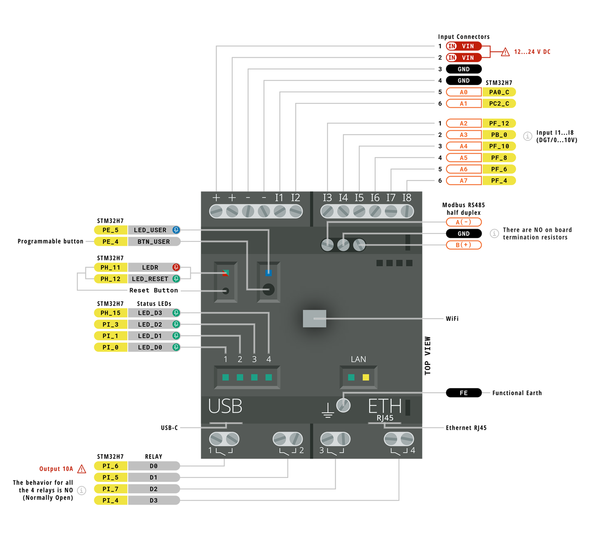
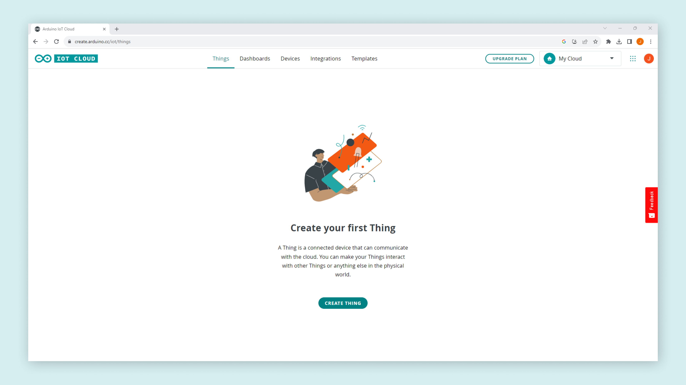
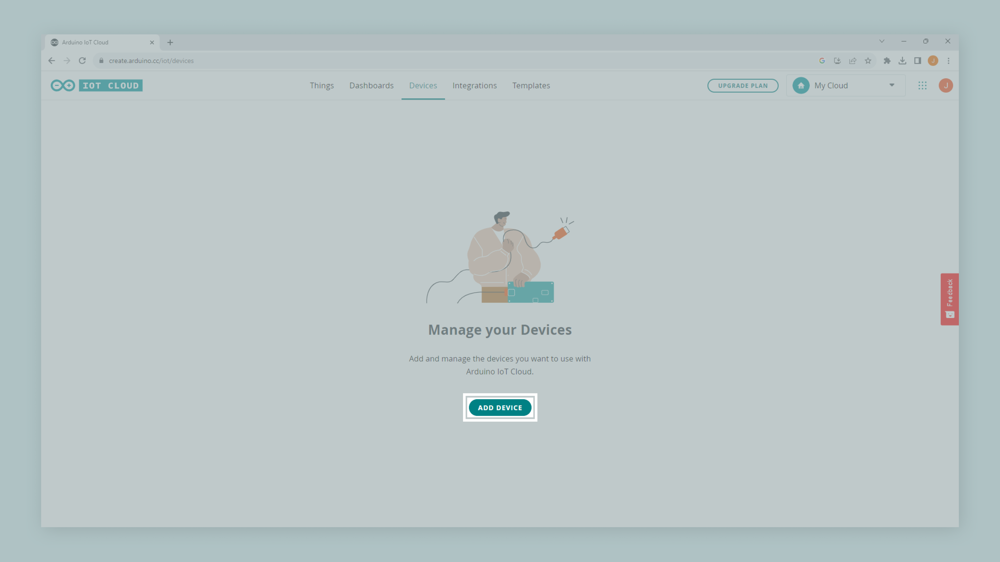
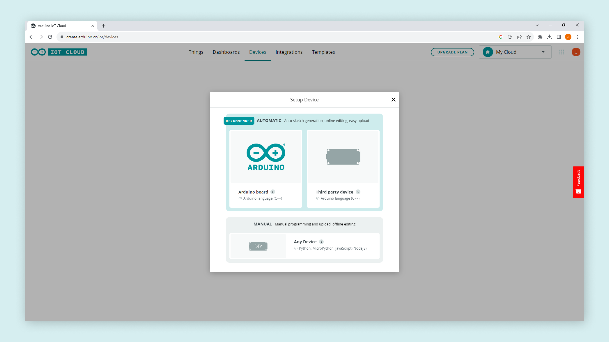
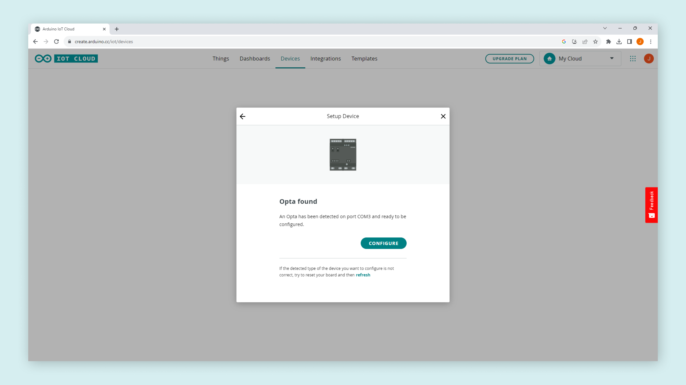
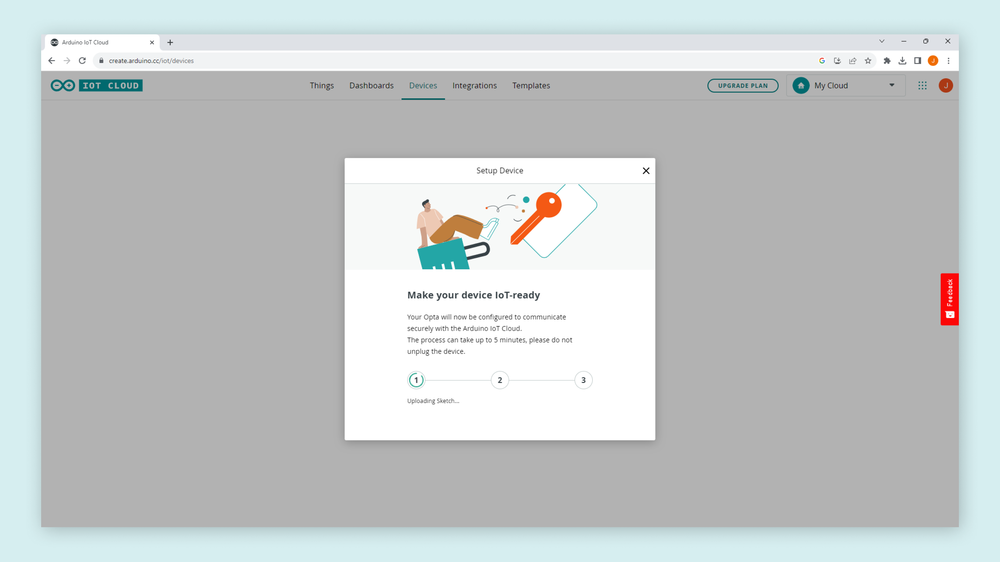
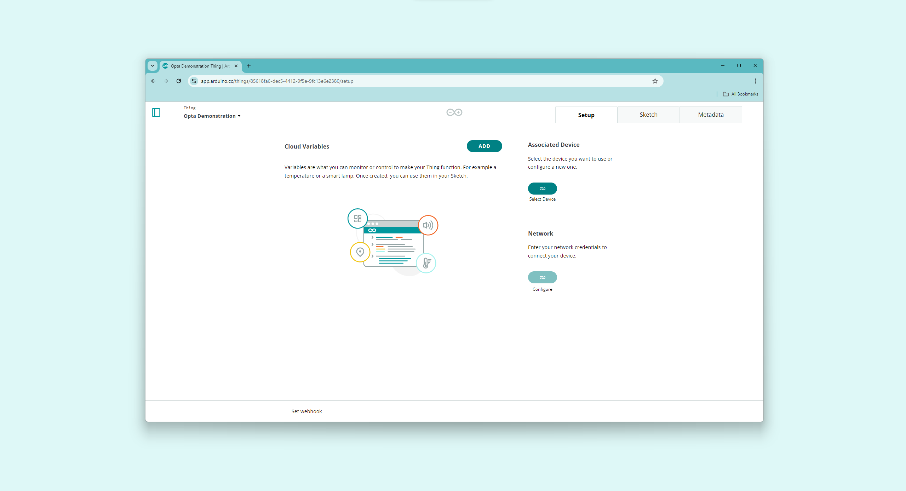
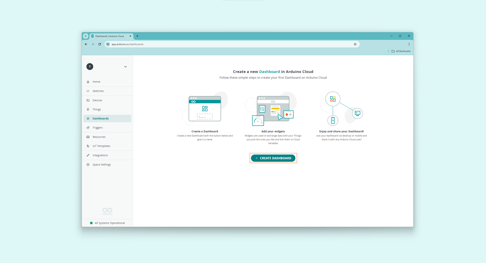
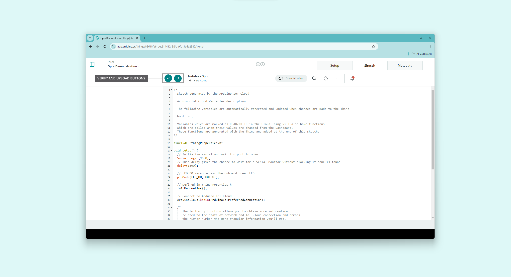

This user manual will provide a comprehensive overview of Opta™, covering its major hardware and software elements. With this user manual, you will learn how to set up, configure, and use all the main features of an Opta™ device. 

## Hardware and Software Requirements

### Hardware Requirements

- [Opta™ Lite](https://store.arduino.cc/products/opta-lite), [Opta™ RS485](https://store.arduino.cc/products/opta-rs485), or [Opta™ WiFi](https://store.arduino.cc/products/opta-wifi) (x1)
- USB-C® cable (x1)
- +12-24 VDC/0.5 A power supply (x1)

### Software Requirements

- [Arduino IDE 2.0+](https://www.arduino.cc/en/software) or [Arduino Web Editor](https://create.arduino.cc/editor)
- [Arduino PLC IDE 1.0.3+](https://www.arduino.cc/en/software) (for IEC 61131-3 PLC programming languages)
- [Arduino PLC IDE 1.0.3+ Tools](https://www.arduino.cc/en/software#arduino-plc-ide) 

***To learn more about the PLC IDE, check out our tutorials [here](https://docs.arduino.cc/software/plc-ide).***

## Opta™ Overview

Opta™ is a secure micro Programmable Logic Controller (PLC) with Industrial Internet of Things (IoT) capabilities. Developed in partnership with Finder®, this device supports both the Arduino programming language and standard IEC-61131-3 PLC programming languages, such as Ladder Diagram (LD), Sequential Function Chart (SFC), Function Block Diagram (FBD), Structured Text (ST), and Instruction List (IL), making it an ideal device for automation engineers. 


Based on the STM32H747XI from STMicroelectronics®, a high-performance Arm® Cortex®-M7 + Cortex®-M4 microcontroller, Opta™ is a perfect option for a wide range of applications, from real-time control to predictive maintenance applications.

### Opta™ Variants

There are three variants of Opta™ created to fit the different needs of each industry and application. 

 

The difference between each of the variants can be found in the following table:

|      **Feature**     |   **Opta™ Lite**  |  **Opta™ RS485**  |     **Opta™ WiFi**    |
|:--------------------:|:-----------------:|:-----------------:|:---------------------:|
|        **SKU**       |      AFX00003     |      AFX00001     |        AFX00002       |
|        **USB**       |       USB-C®      |       USB-C®      |         USB-C®        |
| **Ethernet Support** | 10/100BASE-T Port | 10/100BASE-T Port |   10/100BASE-T Port   |
|      **RS-485**      |        N/A        |    Half-duplex    |      Half-duplex      |
|      **Wi-Fi®**      |        N/A        |        N/A        |      802.11 b/g/n     |
|    **Bluetooth®**    |        N/A        |        N/A        | Bluetooth® Low Energy |

The main differences between each one of the variants are related to their connectivity possibilities. All the variants can be connected to the Cloud using the onboard Ethernet. If your solution does not need an RS-485 interface or wireless connectivity, Opta™ Lite can fit your needs. If you need to connect your device to a Modbus RTU bus using an RS-485 connection but do not need wireless communication, Opta™ RS485 is the chosen variant. To have all Opta™ features and flexibility, with full wireless Wi-Fi® and Bluetooth® Low Energy connectivity, the Opta™ WiFi variant is the perfect choice for your professional projects.

### Opta™ Main Components

Opta™ features a secure, certified, and durable design that enables it for automation and industrial applications. 


Here's an overview of the device's main components shown in the image above:

- **Microcontroller**: At the heart of Opta™ is the STM32H747XI, a powerful and high-performance microcontroller from STMicroelectronics®. The STM32H747XI is built around an Arm® Cortex®-M7 and Arm® Cortex®-M4 32-bit RISC cores. The Arm® Cortex®-M7 core operates at up to 480 MHz, and the Arm® Cortex®-M4 core at up to 240 MHz.
- **Wireless connectivity**: Opta™ (WiFi variant only) supports 2.4 GHz Wi-Fi® (802.11 b/g/n) and Bluetooth® Low Energy (4.2 supported by firmware and 5.1 supported by hardware), allowing the device to communicate wirelessly with other devices and systems. 
- **Ethernet connectivity**: Opta™ (all variants) features an onboard, high-performance 10/100 Mbps Ethernet transceiver accessible through its onboard RJ45 connector.
- **Security**: Opta™ features an onboard ready-to-use secure element, the ATECC608B from Microchip®, specifically designed for IoT devices that provides advanced security features, being perfect for Industrial IoT (IIoT) environments where security is critical.
- **USB connectivity**: Opta™ features an onboard USB-C® port that can be used for programming and data logging but not to command the relay outputs. To do so, power Opta™ using an external power supply.
- **Analog and digital peripherals**: Opta™ features analog and digital peripherals such as eight analog/digital input ports and four digital outputs ports (relay outputs). 
- **RS-485 connectivity**: Opta™ (RS485 and WiFi variants) features a physical RS-485 communication interface available through an onboard terminal connector that can be used for standard communication interfaces like Modbus RTU or custom communication protocols.
- **Form factor**: Opta™ devices can be mounted standalone on a DIN rail, a grid, or a panel, providing quick and easy access to all input/output ports and peripherals.

### Opta™ Core and Libraries

The `Arduino Mbed OS Opta Boards` core contains the libraries and examples to work with Opta™'s peripherals and onboard components, such as its input ports, output ports, Wi-Fi® and Bluetooth® module (WiFi variant only). To install the core for Opta™, navigate to **Tools > Board > Boards Manager** or click the **Boards Manager** icon in the left tab of the IDE. In the Boards Manager tab, search for `opta` and install the latest `Arduino Mbed OS Opta Boards` core version.


### Arduino PLC IDE

PLC IDE is the Arduino solution to program Opta™ devices using the five programming languages recognized by the IEC 61131-3 standard. 


The IEC 61131-3 programming languages include:

- Ladder Diagram (LD)
- Functional Block Diagram (FBD)
- Structured Text (ST)
- Sequential Function Chart (SFC)
- Instruction List (IL)

In the PLC IDE, you can mix PLC programming with standard Arduino sketches within the integrated sketch editor and share variables between the two environments. You can also automate tasks in your software applications; this gives you control over scheduling and repetition, enhancing the reliability and efficiency of your project. Moreover, communication protocols such as Modbus RTU and Modbus TCP can be managed effortlessly using integrated no-code fieldbus configurators.

Check out the following resources that will show you how to start with the Arduino PLC IDE and use use IEC 61131-3 programming languages with Opta™:

- [Arduino PLC IDE download page](https://www.arduino.cc/pro/software-plc-ide)
- [Arduino PLC IDE and Opta™ tutorials](https://docs.arduino.cc/software/plc-ide)

***The Arduino IDE and the Arduino PLC IDE programming environments have important differences in control and real-time performance, which means that the device is configured differently the first time you use one or the other. In case you have been using Opta with the PLC IDE, and you want to come back to use it inside the Arduino environment, we recommend performing the memory partitioning process that is explained in the [Opta™ Memory Partitioning for Use with the Arduino IDE](https://docs.arduino.cc/tutorials/opta/memory-partitioning) tutorial.***

### Pinout



The complete pinout (for all Opta™ variants) is available and downloadable as PDF from the link below:

- [Opta™ pinout](https://docs.arduino.cc/resources/pinouts/opta-full-pinout.pdf)

### Datasheet

The complete datasheet (for all Opta™ variants) is available and downloadable as PDF from the link below:

- [Opta™ datasheet](https://docs.arduino.cc/resources/datasheets/AFX00001-AFX00002-AFX00003-datasheet.pdf)

### STEP Files

The complete STEP files (for all Opta™ variants) are available and downloadable from the link below:

- [Opta™ STEP files](https://docs.arduino.cc/static/805141cc64a9a27e4e73a94065fa0703/AFX00001-AFX00002-AFX00003-step.zip)  

## First Use

### Powering the Opta™

Opta™ can be powered in different ways:

- Using a **USB-C® cable** (not included) for programming purposes only. **Opta's output ports (relay outputs) are not powered via its USB-C® port**.
- Using an external **+12 VDC to +24 VDC power supply** connected to Opta's power supply terminals. Please, refer to the [pinout section](#pinout) of the user manual.


### Hello World Example

Let's program Opta™ with the classic `hello world` example used in the Arduino ecosystem: the `Blink` sketch. We will use this example to verify the board's connection to the Arduino IDE and that the Opta™ core and device are working as expected.

There are two ways to program this example in the device:

- Navigate to **File > Examples > 01.Basics > Blink**.
- Copy and paste the code below into a new sketch in the Arduino IDE.

```arduino
void setup() {
  // Initialize LED_BUILTIN as an output 
  pinMode(LED_BUILTIN, OUTPUT);
}

void loop() {
  // Turn the user LED (RESET) off
  digitalWrite(LED_BUILTIN, HIGH);
  delay(1000);
  // Turn the user LED (RESET) on
  digitalWrite(LED_BUILTIN, LOW);
  delay(1000);
}
```

***For all Opta™ variants, the `LED_BUILTIN` macro represents the green LED on top of the device's RESET button.***

To upload the code to your Opta™ device, click the **Verify** button to compile the sketch and check for errors; then click the **Upload** button to program the device with the sketch.


You should see the green LED on top of your device's `RESET` button turn on for one second, then off for one second, repeatedly. 


## USB®-C Port

Opta™ has an **onboard USB®-C port** that can be used for programming the device's microcontroller and for data logging with mass storage devices such as USB memory sticks. 


***Opta's USB®-C port shall be used only for programming or data logging. This port does not power Opta's output relays.***

## Electrical Terminals

This user manual section covers Opta's electrical terminals, showing their main hardware and software characteristics. Opta™ has 12 electrical terminals, four of which can be used for the power supply of the device, and eight of them can be used as digital/analog inputs.

### Power Supply

As shown in the image below, the first four terminals, from left to right, are Opta's power supply terminals; two are marked with `+` signs and two with `-` signs. An external +12 VDC to +24 VDC power supply can be connected to these terminals. 

Opta's maximum power consumption at +12 VDC is 2 W, and at +24 VDC is 2.2 W.


***For use with Opta™ devices, we recommend the official Finder 78.12.1.230.2400 power supply. This power supply was designed to provide stable +24 VDC despite consistently fluctuating current draw.***

### Programmable Inputs

The image below shows Opta™ devices have **eight analog/digital programmable inputs** accessible through terminals `I1`, `I2`, `I3`, `I4`, `I5`, `I6`, `I7`, and `I8`. 


Analog/digital input terminals are mapped as described in the following table:

| **Opta™ Terminal** | **Arduino Pin Mapping** |
|:------------------:|:-----------------------:|
|        `I1`        |      `A0`/`PIN_A0`      |
|        `I2`        |      `A1`/`PIN_A1`      |
|        `I3`        |      `A2`/`PIN_A2`      |
|        `I4`        |      `A3`/`PIN_A3`      |
|        `I5`        |      `A4`/`PIN_A4`      |
|        `I6`        |      `A5`/`PIN_A5`      |
|        `I7`        |      `A6`/`PIN_A6`      |
|        `I8`        |      `A7`/`PIN_A7`      |

#### Analog Inputs
<br></br>

The input voltage range for each analog input terminal is the following:

- **Input voltage range**: 0 to +10 VDC

The analog input terminals can be used through the built-in functions of the [Arduino programming language](https://www.arduino.cc/reference/en/). To use the input terminals as analog inputs:

- Add the `analogReadResolution()` instruction in your sketch's `setup()` function.

The sketch below shows how to monitor analog voltages on Opta's input terminals `I1`, `I2`, and `I3`. It initializes a serial connection, takes readings from each defined terminal, converts those readings into voltage based on a 12-bit resolution, and outputs these voltage values through the Arduino IDE's Serial Monitor. The readings are looped every second, allowing you to monitor changes real-time changes.

```arduino
/**
  Opta's Analog Input Terminals
  Name: opta_analog_inputs_example.ino
  Purpose: This sketch demonstrates the use of I1, I2, and I3 input 
  terminals as analog inputs on Opta.

  @author Arduino PRO Content Team
  @version 2.0 22/07/23
*/

// Define constants for voltage, resolution, and divider.
const float VOLTAGE_MAX   = 3.0;      // Maximum voltage that can be read
const float RESOLUTION    = 4095.0;   // 12-bit resolution
const float DIVIDER       = 0.3;      // Voltage divider

// Array of terminals.
const int TERMINALS[] = {A0, A1, A2};

// Number of terminals.
const int NUM_PINS = 3;

void setup() {
  // Initialize serial communication at 9600 bits per second.
  Serial.begin(9600);

  // Enable analog inputs on Opta
  // Set the resolution of the ADC to 12 bits.
  analogReadResolution(12);
}

void loop() {
  // Loop through each of the terminal, read the terminal analog value, convert it to voltage, and print the result.
  for (int i = 0; i < NUM_PINS; i++) {
    readAndPrint(TERMINALS[i], i + 1);
  }

  // Delay for a second before reading the terminals again.
  delay(1000);
}

// This function reads the value from the specified pin, converts it to voltage, and prints the result.
void readAndPrint(int terminal, int terminalNumber) {
  // Read the input value from the analog pin.
  int terminalValue = analogRead(terminal);

  // Convert the terminal value to its corresponding voltage. 
  float voltage = terminalValue * (VOLTAGE_MAX / RESOLUTION) / DIVIDER;

  // Print the terminal value and its corresponding voltage.
  Serial.print("I");
  Serial.print(terminalNumber);
  Serial.print(" value: ");
  Serial.print(terminalValue);
  Serial.print(" corresponding to ");
  Serial.print(voltage, 5);
  Serial.println(" VDC");
}
```

#### Digital Inputs
<br></br>

The input voltage range for each digital input terminal is the following:

- **Input voltage range**: 0 to +24 VDC

The input terminals can be used through the built-in functions of the [Arduino programming language](https://www.arduino.cc/reference/en/). To use the input terminals as digital inputs:

- Add the `pinMode(pinName, INPUT)` instruction in your sketch's `setup()` function.

The sketch below shows how to monitor digital states on Opta's input terminals `I1`, `I2`, and `I3`. It initializes a serial connection, takes readings from each defined terminal, and interprets them as either `HIGH` or `LOW` digital states. These states are then output through the Arduino IDE's Serial Monitor. The state readings are looped every second, allowing you to monitor real-time changes.

```arduino
/**
  Opta's Digital Input Terminals
  Name: opta_digital_inputs_example.ino
  Purpose: This sketch demonstrates the use of I1, I2, and I3 input
  terminals as digital inputs on Opta.

  @author Arduino PRO Content Team
  @version 2.0 23/07/23
*/

// Array of terminals.
const int TERMINALS[] = {A0, A1, A2};

// Number of terminals.
const int NUM_PINS = 3;

void setup() {
  // Initialize serial communication at 9600 bits per second.
  Serial.begin(9600);

  // Set the mode of the pins as digital inputs.
  for (int i = 0; i < NUM_PINS; i++) {
    pinMode(TERMINALS[i], INPUT);
  }
}

void loop() {
  // Loop through each of the terminal, read the terminal digital value, and print the result.
  for (int i = 0; i < NUM_PINS; i++) {
    readAndPrint(TERMINALS[i], i + 1);
  }

  // Delay for a second before reading the terminals again.
  delay(1000);
}

// This function reads the digital value from the specified pin and prints the result.
void readAndPrint(int terminal, int terminalNumber) {
  // Read the input value from the digital pin.
  int terminalValue = digitalRead(terminal);
  
  // Print the terminal value.
  Serial.print("I");
  Serial.print(terminalNumber);
  Serial.print(" value: ");
  Serial.println(terminalValue);
}
```

## LEDs

Opta™ Lite and Opta™ RS485 devices have **four user-programmable LEDs**, and **Opta™ WiFi devices have an extra one**. 


User-programmable LEDs are mapped as described in the following table:

|     **Opta™ User LED**     | **Arduino Pin Mapping** |
|:--------------------------:|:-----------------------:|
|         `STATUS 1`         |  `LED_D0`/`LED_RELAY1`  |
|         `STATUS 2`         |  `LED_D1`/`LED_RELAY2`  |
|         `STATUS 3`         |  `LED_D2`/`LED_RELAY3`  |
|         `STATUS 4`         |  `LED_D3`/`LED_RELAY4`  |
| `USER` (WiFi variant only) |    `LED_USER`/`LEDB`    |
|    `RESET` (Green color)   |  `LED_BUILTIN`/`LEDG`   |
|    `RESET` (Red color)     |         `LEDR`          |

The sketch below shows how to create a Knight Rider-style "scanning" effect using Opta™s user LEDs. It works by sequentially lighting up each user's LED, creating a visual effect of scanning back and forth. This effect is achieved by defining an array of the user LED identifiers and using loops to cycle through these identifiers, turning each user LED on and off in sequence.

```arduino
/**
  Opta's Knight Rider Scanning Effect
  Name: opta_knight_rider_example.ino
  Purpose: This sketch demonstrates a Knight Rider scanning effect using 
  the user LEDs of Opta devices.


  @author Arduino PRO Content Team
  @version 2.0 22/07/23
*/

// Define an array to hold the pin numbers for Opta's user LEDs.
const int USER_LEDS[] = {LED_D0, LED_D1, LED_D2, LED_D3};

// Number of Opta's user LEDs
const int NUM_LEDS = 4;

void setup() {
  // Set the mode for each user LED to OUTPUT.
  for (int i = 0; i < NUM_LEDS; i++) {
    pinMode(USER_LEDS[i], OUTPUT);
  }
}

void loop() {
  // Scan from the first LED to the last.
  for (int i = 0; i < NUM_LEDS; i++) {
    // Turn on the LED.
    // Wait for 50 milliseconds.
    digitalWrite(USER_LEDS[i], HIGH); 
    delay(50); 
    // Turn off the LED.
    // Wait for 50 milliseconds.
    digitalWrite(USER_LEDS[i], LOW); 
    delay(50); 
  }
  
  // Scan back from the last LED to the first.
  for (int i = NUM_LEDS - 1; i >= 0; i--) {
    // Turn on the LED.
    // Wait for 50 milliseconds.
    digitalWrite(USER_LEDS[i], HIGH); 
    delay(50); 
    // Turn off the LED.
    // Wait for 50 milliseconds.
    digitalWrite(USER_LEDS[i], LOW); 
    delay(50); 
  }
}
```

You should see a Knight Rider-style "scanning" effect with Opta's user LEDs.


You also have another user-programmable LED located on top of the RESET button of the device; this green user LED is represented with the `LED_BUILTIN` macro and it is available in all Opta™ variants. 

***The USER LED located above the USER BUTTON is only available on Opta™ WiFi (AFX00002).***

The blink code that uses the green `LED_BUILTIN` LED is shown below:

```arduino
void setup() {
  // Initialize LED_USER as an output 
  pinMode(LED_BUILTIN, OUTPUT);
}

void loop() {
  // Turn the USER LED off
  digitalWrite(LED_BUILTIN, HIGH);
  delay(1000);
  // Turn the USER LED on
  digitalWrite(LED_BUILTIN, LOW);
  delay(1000);
}
```

You should see the green LED on top of your device's RESET button turn on for one second, then off for one second, repeatedly. 


## User Button

All Opta™ variants devices have an onboard user-programmable button; this user button is mapped as `BTN_USER` in the Opta™ core. The user button has an internal pull-up resistor, meaning its default value (while not being pressed) is `HIGH`. 


The user-programmable button can be used through the built-in functions of the Arduino programming language. 

To use the user button, first define it as a digital input:

- Add the `pinMode(BTN_USER, INPUT)` instruction in your sketch's `setup()` function.

To read the status of the user button:

- Add the `digitalRead(BTN_USER)` instruction in your sketch.

The sketch below shows how to use Opta's programmable user button to control the sequence of status LEDs, `D0` to `D3`. 


```arduino
/**
  Opta's User Button Example
  Name: opta_user_button_example.ino
  Purpose: Configures Opta's user-programmable button to control the user LEDs.
  This example includes debouncing for the user button.

  @author Arduino PRO Content Team
  @version 2.0 23/07/23
*/

// Current and previous state of the button.
int buttonState     = 0;
int lastButtonState = 0;

// Counter to keep track of the LED sequence.
int counter = 0;

// Variables to implement button debouncing.
unsigned long lastDebounceTime  = 0;
unsigned long debounceDelay     = 50; // In ms

// Array to store LED pins.
int LEDS[] = {LED_D0, LED_D1, LED_D2, LED_D3};
int NUM_LEDS = 4;

void setup() {
  // Initialize Opta user LEDs.
  for(int i = 0; i < NUM_LEDS; i++) {
    pinMode(LEDS[i], OUTPUT);
  }
  pinMode(BTN_USER, INPUT);
}

void loop() {
  int reading = digitalRead(BTN_USER);
  
  // Check if button state has changed.
  if (reading != lastButtonState) {
    lastDebounceTime = millis();
  }

  // Debouncing routine.
  if ((millis() - lastDebounceTime) > debounceDelay) {
    if (reading != buttonState) {
      buttonState = reading;

      // Only increment the counter if the new button state is HIGH.
      if (buttonState == HIGH) {
        if(counter < NUM_LEDS){
          counter++;
        }
        else{
          counter = 0;
        }
      }
    }
  }

  // Save the current state as the last state, for next time through the loop.
  lastButtonState = reading;
  
  // Control LED states.
  changeLights();
}

/**
  Control the status LEDs based on a counter value.
  Turns off all LEDs first, then turns on the LED 
  corresponding to the current counter value.

  @param None.
*/
void changeLights() {
  // Turn off all user LEDs.
  for(int i = 0; i < NUM_LEDS; i++) {
    digitalWrite(LEDS[i], LOW);
  }

  // Turn on the selected user LED.
  if(counter > 0) {
    digitalWrite(LEDS[counter - 1], HIGH);
  }
}
```

The sketch initializes the state of the user's LEDs and button, along with variables for button debouncing. This sketch continuously reads the state of the user button, debounces the button input to avoid false triggering due to electrical noise, and increments a counter each time the button is pressed. It then passes the control to the `changeLights()` function. This function first turns off all LEDs and then, depending on the value of the counter, turns on the corresponding LED. With each button press, the counter increments, and a different LED lights up, cycling back to the beginning after the final LED.

You should now be able to control the status LED sequence by pressing Opta's programmable user button.


## Relays

Opta™ devices (all variants) have four **Normally Open (NO)** 10 A relays capable of actuating on loads at a rated voltage of 250 VAC and up to a maximum switching voltage of 400 VAC.


User-programmable relay outputs are mapped as described in the following table:

| **Opta™ Relay Output** | **Arduino Pin Mapping** |
|:----------------------:|:-----------------------:|
|       `OUTPUT 1`       |      `D0`/`RELAY1`      |
|       `OUTPUT 2`       |      `D1`/`RELAY2`      |
|       `OUTPUT 3`       |      `D2`/`RELAY3`      |
|       `OUTPUT 4`       |      `D3`/`RELAY4`      |

The output relays can be used through the built-in functions of the Arduino programming language. To use an output relay as a digital output:

- Add the `pinMode(relayOutput, OUTPUT)` instruction in your sketch's `setup()` function. 
  
To change the status of the output relay (`LOW` or `HIGH`):

- Add your sketch's `digitalWrite(relayOutput, LOW)` or `digitalWrite(relayOutput, HIGH)` instruction.

The sketch below tests the output relays and status LEDs of an Opta™ device. The sketch initializes the relay outputs and user LEDs as outputs; then, the sketch turns each output relay and its corresponding status LED on and off in sequence, with a one-second delay between each state change. This allows us to visually verify the correct functioning of the output relays and user LEDs.

```arduino
/*
  Opta's Output Relays 
  Name: opta_outputs_relays_example.ino
  Purpose: This sketch tests the output relays of Opta devices.


  @author Arduino PRO Content Team
  @version 2.0 22/07/23
*/

// Arrays of relays and user LEDs
int relayOutputs[] = {D0, D1, D2, D3};
int userLeds[] = {LED_D0, LED_D1, LED_D2, LED_D3};

// Compute the number of relays/LEDs based on the size of the relayPins array
int numRelays = 4;

void setup() {
  for(int i = 0; i < numRelays; i++) {
    // Sets the mode of the relays and user LEDs as outputs
    pinMode(relayOutputs[i], OUTPUT); 
    pinMode(userLeds[i], OUTPUT); 
  }
}

void loop() {
  // For each relay/user LED: turn it on, wait for a second, turn it off, wait for another second
  for(int i = 0; i < numRelays; i++) {
    digitalWrite(relayOutputs[i], HIGH); 
    digitalWrite(userLeds[i], HIGH);
    delay(1000);
    digitalWrite(relayOutputs[i], LOW);
    digitalWrite(userLeds[i], LOW);
    delay(1000);
  }
}
```

## Communication

This user manual section covers the different communication interfaces and protocols supported by Opta™ devices, including the Ethernet, RS-485, Modbus, Wi-Fi®, and Bluetooth®.

### Ethernet

Opta™ devices (all variants) feature an onboard low-power 10BASE-T/100BASE-TX Ethernet physical layer (PHY) transceiver. The transceiver complies with the IEEE 802.3 and 802.3u standards and supports communication with an Ethernet MAC through a standard RMII interface. The Ethernet transceiver is accessible through the onboard RJ45 connector.


The `Arduino Mbed OS Opta Boards` core has a built-in library that lets you use the onboard Ethernet PHY transceiver right out of the box: the [`Ethernet` library](https://www.arduino.cc/reference/en/libraries/ethernet/). Let's use an example code demonstrating some of the transceiver's capabilities. 

The sketch below enables an Opta™ device to connect to the Internet via an Ethernet connection. Once connected, it performs a `GET` request to the [`ip-api.com`](https://ip-api.com/) service to fetch details about the device's IP address. It then parses the received JSON object using the [`Arduino_JSON` library](https://github.com/arduino-libraries/Arduino_JSON) to extract key IP details: IP address, city, region, and country. This data is then printed to the Arduino IDE's Serial Monitor.

```arduino
/**
  Web Client (Ethernet version)
  Name: opta_ethernet_web_client.ino
  Purpose: This sketch connects an Opta device to ip-api.com via Ethernet
  and fetches IP details for the device.

  @author Arduino PRO Content Team
  @version 2.0 15/08/23
*/

// Include the necessary libraries.
#include <Ethernet.h>
#include <Arduino_JSON.h>

// Server address for ip-api.com.
const char* server = "ip-api.com";

// API endpoint path to get IP details in JSON format.
String path = "/json/";

// Static IP configuration for the Opta device.
IPAddress ip(10, 130, 22, 84);

// Ethernet client instance for the communication.
EthernetClient client;

// JSON variable to store and process the fetched data.
JSONVar doc;

// Variable to ensure we fetch data only once.
bool dataFetched = false;

void setup() {
  // Begin serial communication at a baud rate of 115200.
  Serial.begin(115200);

  // Wait for the serial port to connect,
  // This is necessary for boards that have native USB.
  while (!Serial);

  // Attempt to start Ethernet connection via DHCP,
  // If DHCP failed, print a diagnostic message.
  if (Ethernet.begin() == 0) {
    Serial.println("- Failed to configure Ethernet using DHCP!");

    // Try to configure Ethernet with the predefined static IP address.
    Ethernet.begin(ip);
  }
  delay(2000);
}

void loop() {
  // Ensure we haven't fetched data already,
  // ensure the Ethernet link is active,
  // establish a connection to the server,
  // compose and send the HTTP GET request.
  if (!dataFetched) {
    if (Ethernet.linkStatus() == LinkON) {
      if (client.connect(server, 80)) {
        client.print("GET ");
        client.print(path);
        client.println(" HTTP/1.1");
        client.print("Host: ");
        client.println(server);
        client.println("Connection: close");
        client.println();

        // Wait and skip the HTTP headers to get to the JSON data.
        char endOfHeaders[] = "\r\n\r\n";
        client.find(endOfHeaders);

        // Read and parse the JSON response.
        String payload = client.readString();
        doc = JSON.parse(payload);

        // Check if the parsing was successful.
        if (JSON.typeof(doc) == "undefined") {
          Serial.println("- Parsing failed!");
          return;
        }

        // Extract and print the IP details.
        Serial.println("*** IP Details:");
        Serial.print("- IP Address: ");
        Serial.println((const char*)doc["query"]);
        Serial.print("- City: ");
        Serial.println((const char*)doc["city"]);
        Serial.print("- Region: ");
        Serial.println((const char*)doc["regionName"]);
        Serial.print("- Country: ");
        Serial.println((const char*)doc["country"]);
        Serial.println("");

        // Mark data as fetched.
        dataFetched = true;
      }
      // Close the client connection once done.
      client.stop();
    } else {
      Serial.println("- Ethernet link disconnected!");
    }
  }
}
```

The sketch includes the `Ethernet` and `Arduino_JSON` libraries, essential for Ethernet and JSON handling functionality. In the `setup()` function, serial communication is initiated for debugging and output. Instead of DHCP, the Ethernet connection uses a predefined static IP address.

Once the Ethernet connection runs, the sketch connects to the `ip-api.com` service, utilizing the HTTP protocol. Specifically, an `HTTP GET` request is crafted to retrieve details about the device's IP address, including its city, region, and country. If the connection to the server fails, the sketch will output an error message to the Arduino IDE's Serial Monitor for troubleshooting.

Within the `loop()` function, an `HTTP GET` request is sent to the `ip-api.com` service once. The sketch then waits for and skips the response's HTTP headers, parsing the following JSON payload.

Key IP details such as IP address, city, region, and country are extracted and then displayed in the IDE's Serial Monitor using the parsed data. If the Ethernet link happens to be disconnected, a corresponding message is printed to the Serial Monitor. Should the JSON parsing fail, an error message is showcased on the IDE's Serial Monitor, prompting the sketch to exit the current iteration of the `loop()` function immediately.

You should see the following output in the Arduino IDE's Serial Monitor:


You can download the example code [here](assets/opta_ethernet_web_client.zip).

The Media Access Control (MAC) address is essential for computer networking and devices with Internet of Things (IoT) capabilities, such as the Opta™. To learn more into-depth about how to retrieve the MAC address of an Opta™ device using the Arduino ecosystem tools, check out the following tutorial:

- [Retrieve the Opta™ MAC Address](https://docs.arduino.cc/tutorials/opta/mac-address)

### RS-485

Opta™ RS485 and WiFi variants have a built-in RS-485 interface, enabling the construction of robust and reliable data transmission systems. RS-485 interface is still the most widely used protocol for Point Of Sale (POS), industrial, and telecommunications applications. The wide common-mode range enables data transmission over longer cable lengths and in noisy environments such as the floor of a factory. Also, the high input impedance of the receivers allows more devices to be attached to the lines.


***The Opta™ RS485 and WiFi variants' RS-485 interface operates in a half-duplex mode. This means it can send or receive data at any given time, but not simultaneously.***


RS-485 data lines in Opta™ RS485 and Opta™ WiFi variants are labeled as described in the following table:

| **EIA-485 Specification Labels** | **Opta™ Labels** |
|:--------------------------------:|:----------------:|
|                `A`               |      `A(-)`      |
|                `B`               |      `B(+)`      |

***RS-485 data lines labels differ between manufacturers. Most manufacturers will use `+` and `–` to label the data lines or variations such as `D+` and `D-`. Some manufacturers will label inputs as A and B but get the polarity backward, so A is positive and B negative. Although predicting how other manufacturers will mark these lines is impossible, practical experience suggests that the `-` line should be connected to the A terminal, and the `+` line should be connected to the B terminal. Reversing the polarity will not damage an RS-485 device but will not communicate.***


To enable communication on Opta™ devices via its RS-485 interface, you can use the [`ArduinoRS485` library](https://www.arduino.cc/reference/en/libraries/arduinors485/). Let's use an example code demonstrating some of its RS-485 capabilities. Here is an example of using the `ArduinoRS485` library to transmit messages via the RS-485 interface on an Opta™ device.

```arduino
/*
  Opta's Basic RS-485 Communication

  Name: opta_basic_rs485_example.ino
  Purpose: This sketch tests the RS-485 interface of 
  Opta RS485 and Opta WiFi devices.

  @author Arduino PRO Content Team
  @version 2.0 22/07/23
*/
#include <ArduinoRS485.h>

// Set the baudrate to be used by the RS-485 interface.
constexpr auto baudrate { 115200 };

/**
  Configure the RS-485 interface. It initializes the
  interface with the specified baud rate and explicitly 
  disables data reception to avoid potential data 
  collision in this half-duplex communication standard.

  @param baudrate (int)
*/
void configureRS485(const int baudrate) {
    const auto bitduration { 1.f / baudrate };
    const auto wordlen { 9.6f }; // Or 10.0f depending on the channel configuration
    const auto preDelayBR { bitduration * wordlen * 3.5f * 1e6 };
    const auto postDelayBR { bitduration * wordlen * 3.5f * 1e6 }

    RS485.begin(baudrate);
    RS485.setDelays(preDelayBR, postDelayBR);
    RS485.noReceive();
}

/**
  Send a text message through the RS485 interface. Writes 
  the intended message to the transmission buffer, appends
  carriage return and newline characters for message 
  termination, and finally ends the transmission. 

  @param message (char)
*/
size_t printlnRS485(char* message) {
    RS485.beginTransmission();
    auto len = strlen(message);
    RS485.write(message, len);
    RS485.write('\r');
    RS485.write('\n');
    RS485.endTransmission();
}

void setup() {
    configureRS485(baudrate);
    printlnRS485("- RS-485 interface configured!");
}

void loop() {
    delay(2000);
    // Wait for two seconds and then sends a test message via the RS485 interface.
    printlnRS485("- This is a message transmitted via RS-485!");
}
```

The sketch starts with the `configureRS485()` function, which initializes the RS-485 interface with the defined baud rate and turns off data receiving. The `printlnRS485()` function handles the transmission of text messages. It starts the transmission, sends the message followed by a carriage return and newline character, and ends the transmission. The `setup()` function calls the `configureRS485()` function to configure the RS-485 interface and then sends a confirmation message. The `loop()` function repeatedly sends a message every two seconds using the `printlnRS485()` function.

To learn more into-depth about the RS-485 interface in Opta™ devices, check out the following tutorial:

- [Getting Started with RS-485 on Opta™](https://docs.arduino.cc/tutorials/opta/getting-started-with-rs485)

### Modbus (RTU/TCP)

Opta™ RS485 and WiFi variants incorporate a built-in Modbus interface, enabling the implementation of robust and reliable data transmission systems. Modbus, in its RTU version that utilizes RS-485 serial transmission or in its TCP version that operates over Ethernet, remains one of the most widely used protocols for industrial automation applications, building management systems, and process control, among others.


Modbus RTU, generally operating in half-duplex mode, with its capability to handle noisy and long-distance transmission lines, makes it an excellent choice for industrial environments. Modbus RTU communication is supported using the Arduino Opta's RS-485 physical interface. 

***Opta™ does not have internal terminator resistors, so they must be added following the Modbus protocol specification if necessary.***


Modbus TCP, taking advantage of Ethernet connectivity, allows easy integration with existing computer networks and facilitates data communication over long distances using the existing network infrastructure. It operates in full-duplex mode, allowing simultaneous sending and receiving of data.

The many nodes connected in a Modbus network, whether RTU or TCP, allow high flexibility and scalability in constructing automation and control systems.

To learn more about the Modbus interface in Opta™ devices, check out the following tutorials and application notes:

- [Getting Started with Modbus RTU on Opta™](https://docs.arduino.cc/tutorials/opta/getting-started-with-modbus-rtu)
- [Modbus TCP On Opta™ Using PLC IDE](https://docs.arduino.cc/tutorials/opta/opta-modbus-tcp-plc-ide)
- [Tank Level Monitoring with the Opta™](https://docs.arduino.cc/tutorials/opta/tank-level-app-note)
- [Tank Thermoregulation with Portenta Machine Control & Opta™](https://docs.arduino.cc/tutorials/opta/pmc-opta-temp-ctrl)
- [Energy Management with Opta™](https://docs.arduino.cc/tutorials/opta/energy-management-application-note)

### Wi-Fi®

Opta™ WiFi variant devices feature an onboard Wi-Fi® module that provides seamless wireless connectivity, allowing Opta™ to connect to Wi-Fi® networks and interact with other devices over-the-air (OTA).

Some of the key capabilities of Opta™'s onboard Wi-Fi® module are the following:

- **Wireless connectivity**: The onboard Wi-Fi® module supports IEEE 802.11b/g/n Wi-Fi® standards, enabling devices to establish reliable and high-speed wireless connections to access the Internet and communicate with other devices.
- **Secure communication**: The onboard module incorporates various security protocols such as WEP, WPA, WPA2, and WPA3, ensuring robust data encryption and protection against unauthorized access during wireless communication.
- **Onboard antenna**: Opta™ WiFi devices feature an onboard  Wi-Fi® antenna specifically designed, matched, and certified for the onboard Wi-Fi® module requirements.

The `Arduino Mbed OS Opta Boards` core has a built-in library that lets you use the onboard Wi-Fi® module right out of the box: the [`WiFi` library](https://www.arduino.cc/reference/en/libraries/wifi/). Let's walk through an example code demonstrating some of the module's capabilities.

The sketch below enables an Opta™ device to connect to the Internet via Wi-Fi® (like the Ethernet example). Once connected, it performs a `GET` request to the [`ip-api.com`](https://ip-api.com/) server to fetch details related to its IP address. It then parses the received JSON object using the [`Arduino_JSON` library](https://github.com/arduino-libraries/Arduino_JSON) to extract key IP details: IP address, city, region, and country. This data is then printed to the Arduino IDE's Serial Monitor.

You need to create first a header file named `arduino_secrets.h` to store your Wi-Fi® network credentials. To do this, add a new tab by clicking the ellipsis (the three horizontal dots) button on the top right of the Arduino IDE 2.


Put `arduino_secrets.h` as the "Name for new file" and enter the following code on the header file:

```arduino
char ssid[] = "SECRET_SSID"; // Your network SSID (name)
char password[] = "SECRET_PASS"; // Your network password (use for WPA, or use as key for WEP)
```

Replace `SECRET_SSID` with the name of your Wi-Fi® network and `SECRET_PASS` with the password of it and save the project. The example code is as follows: 

```arduino
/**
  WiFi Web Client
  Name: opta_wifi_web_client.ino
  Purpose: This sketch connects an Opta device to ip-api.com via WiFi
  and fetches IP details.

  @author Arduino PRO Content Team
  @version 2.2 16/08/23
*/

#include <WiFi.h>
#include <Arduino_JSON.h>

// Wi-Fi network details.
const char* ssid     = "YOUR_SSID";
const char* password = "YOUR_PASSWORD";

// Server address for ip-api.com.
const char* server = "ip-api.com";

// API endpoint path to get IP details in JSON format.
String path = "/json";

// Wi-Fi client instance for the communication.
WiFiClient client;

// JSON variable to store and process the fetched data.
JSONVar doc;

// Variable to ensure we fetch data only once.
bool dataFetched = false;

void setup() {
  // Begin serial communication at a baud rate of 115200.
  Serial.begin(115200);

  // Wait for the serial port to connect,
  // This is necessary for boards that have native USB.
  while (!Serial);

  // Start the Wi-Fi connection using the provided SSID and password.
  Serial.print("- Connecting to ");
  Serial.println(ssid);
  WiFi.begin(ssid, password);

  while (WiFi.status() != WL_CONNECTED) {
    delay(1000);
    Serial.print(".");
  }

  Serial.println();
  Serial.println("- Wi-Fi connected!");
  Serial.print("- IP address: ");
  Serial.println(WiFi.localIP());
}

void loop() {
  // Check if the IP details have been fetched.
  // If not, call the function to fetch IP details,
  // Set the flag to true after fetching.
  if (!dataFetched) {
    fetchIPDetails();
    dataFetched = true;
  }
}

/**
  Fetch IP details from defined server

  @param none
  @return IP details
*/
void fetchIPDetails() {
  if (client.connect(server, 80)) {
    // Compose and send the HTTP GET request.
    client.print("GET ");
    client.print(path);
    client.println(" HTTP/1.1");
    client.print("Host: ");
    client.println(server);
    client.println("Connection: close");
    client.println();

    // Wait and skip the HTTP headers to get to the JSON data.
    char endOfHeaders[] = "\r\n\r\n";
    client.find(endOfHeaders);

    // Read and parse the JSON response.
    String payload = client.readStringUntil('\n');
    doc = JSON.parse(payload);

    // Check if the parsing was successful. 
    if (JSON.typeof(doc) == "undefined") {
      Serial.println("- Parsing failed!");
      return;
    }

    // Extract and print the IP details.
    Serial.println("*** IP Details:");
    String query = doc["query"];
    Serial.print("- IP Address: ");
    Serial.println(query);
    String city = doc["city"];
    Serial.print("- City: ");
    Serial.println(city);
    String region = doc["regionName"];
    Serial.print("- Region: ");
    Serial.println(region);
    String country = doc["country"];
    Serial.print("- Country: ");
    Serial.println(country);
    Serial.println("");
  } else {
    Serial.println("- Failed to connect to server!");
  }

  // Close the client connection once done. 
  client.stop();
}
```

The sketch includes the `WiFi` and `Arduino_JSON`, which provide the necessary Wi-Fi® and JSON handling functionality. The `setup()` function initiates serial communication for debugging purposes and attempts to connect to a specified Wi-Fi® network. If the connection is not established, the sketch will keep trying until a successful connection is made.

Once the Wi-Fi® connection is established, the sketch is ready to connect to the `ip-api.com` server using the HTTP protocol. Specifically, an `HTTP GET` request is constructed to query details related to its IP address. The `GET` request is sent only once after the Wi-Fi® connection is active.

The `loop()` function is the heart of the sketch. It checks whether the data has been fetched or not. If the data still needs to be fetched, it tries to establish a connection to the server. If the connection is successful, the sketch sends an `HTTP GET` request, skips the HTTP headers of the response, and uses the `JSON.parse()` function from the `Arduino_JSON` library to parse the JSON object from the response. The parsed data extracts key IP details like IP address, city, region, and country, which are then printed to the Arduino IDE's Serial Monitor. Once the data is published, the client is disconnected to free up resources. Suppose the JSON parsing fails for any reason. In that case, an error message is outputted to the Arduino IDE's Serial Monitor, and the sketch immediately exits the current iteration of the `loop()` function.

Since the data is fetched only once, there's no need for repeatedly sending `HTTP GET` requests. After the initial fetch, you should see the details related to the IP address displayed in the Arduino IDE's Serial Monitor:


You can download the example code [here](assets/opta_wifi_web_client_example.zip).

The MAC address is essential for computer networking and devices with Internet of Things (IoT) capabilities, such as the Opta™. To learn more into-depth about how to retrieve the MAC address of an Opta™ device using the Arduino ecosystem tools, check out the following tutorial:

- [Retrieve the Opta™ MAC Address](https://docs.arduino.cc/tutorials/opta/mac-address)

### Bluetooth Low Energy®

Opta™ WiFi variant devices feature an onboard Bluetooth Low Energy® module, which supports Bluetooth 5.1 BR/EDR/LE up to 3 Mbps PHY data rate. Bluetooth 4.2 is supported by Arduino firmware.

To enable Bluetooth® communication on Opta™ devices, you can use the [`ArduinoBLE` library](https://www.arduino.cc/reference/en/libraries/arduinoble/). Let's use an example code demonstrating some of its Bluetooth® module's capabilities. Here is an example of using the ArduinoBLE library to create a voltage level monitor application, such as a 0 to 10 VDC sensor. The provided example code demonstrates the creation of a Bluetooth® Low Energy service and the characteristic of voltage values read from one of the analog input terminals of an Opta™ device to a central device, for example, a smartphone.

***You can use the [nRF Connect for Mobile](https://www.nordicsemi.com/Products/Development-tools/nrf-connect-for-mobile) app from Nordic Semiconductor® to test the functionality of the example code shown below. nRF Connect is a powerful tool that allows you to scan and explore Bluetooth Low Energy® devices and communicate with them.***

```arduino
/**
  Opta's Bluetooth Example
  Name: opta_bluetooth_example.ino
  Purpose: Read voltage level from an analog input terminal of an Opta device,
  then maps the voltage reading to a percentage value ranging from 0 to 100.

  @author Arduino PRO Content Team
  @version 1.1 23/07/23
*/

#include <ArduinoBLE.h>

// Define the voltage service and its characteristic.
BLEService voltageService("1101");
BLEUnsignedCharCharacteristic voltageLevelChar("2101", BLERead | BLENotify);

const int TERMINAL = A0;
const long interval = 200; // Delay interval in ms for voltage reading and LED blinking

BLEDevice central;

/**
  Read voltage level from an analog input terminal of an Opta device,
  then maps the voltage reading to a voltage value ranging from 0 to 10 VDC.

  @param none
  @return the voltage value (int).
*/
int readVoltageLevel() {
  int voltage = analogRead(TERMINAL);
  int voltageLevel = map(voltage, 0, 4095, 0, 10);
  return voltageLevel;
}

void setup() {
  // Initialize LED_USER as an output.
  pinMode(LED_USER, OUTPUT);
  digitalWrite(LED_USER, HIGH);

  // Initialize serial communication at 9600 bits per second.
  Serial.begin(9600);

  // Enable analog inputs on Opta.
  // Set the resolution of the ADC to 12 bits.
  analogReadResolution(12); 

  // Initialize the BLE module.
  if (!BLE.begin()) {
    Serial.println("- Starting BLE failed!");
    while (1); // In case of failure, loop indefinitely.
  }

  // Set the local name and advertised service for the BLE module.
  BLE.setLocalName("VoltageMonitor");
  BLE.setAdvertisedService(voltageService);
  voltageService.addCharacteristic(voltageLevelChar);
  BLE.addService(voltageService);

  // Start advertising the BLE service.
  BLE.advertise();
  Serial.println("- Bluetooth device active, waiting for connections...");
}

void loop() {
  // Get the current time since the Arduino started.
  unsigned long currentMillis = millis();
  
  // Static variables to hold the last time the tasks were performed.
  static unsigned long previousVoltageMillis = 0; // Last time the voltage was read
  static unsigned long previousLEDMillis = 0; // Last time the LED state changed

  // If the interval has passed, update the LED.
  if (currentMillis - previousLEDMillis >= interval) {
    // Save the current time to check against in the next loop iteration.
    previousLEDMillis = currentMillis;

    // Toggle the state of the LED.
    digitalWrite(LED_USER, !digitalRead(LED_USER));
  }

  // If a central device is connected.
  if (central) {
    if (central.connected()) {
      // Set the LED color to solid blue when connected.
      digitalWrite(LED_USER, HIGH);

      // If the interval has passed, update the voltage level.
      if (currentMillis - previousVoltageMillis >= interval) {
        // Save the current time to check against in the next loop iteration.
        previousVoltageMillis = currentMillis;

        // Read the voltage level and update the BLE characteristic with the voltage level value.
        int voltageLevel = readVoltageLevel();

        Serial.print("- Voltage level is: ");
        Serial.println(voltageLevel);
        voltageLevelChar.writeValue(voltageLevel);
      }
    }
    else {
      central = BLE.central();
      if (central) {
        Serial.print("- Connected to device: ");
        Serial.println(central.address());
      }
      else {
        Serial.print("- BLE not connected: ");
        Serial.println(central.address());
      }
    }
  }
  else {
    central = BLE.central();
    if (central) {
      Serial.print("- Connected to device: ");
      Serial.println(central.address());
    }
  }
}
```

After importing the necessary libraries and defining the Bluetooth® Low Energy service and characteristic, the `setup()` function initializes the Opta™ device and sets up the Bluetooth® Low Energy service and characteristic. The sketch then starts advertising the defined service to allow connections.

In the `loop()` function, the sketch constantly checks for a Bluetooth® Low Energy connection. When a central device connects to the device, the Opta's built-in USER LED stays solidly on, and the sketch begins continuously reading the voltage level from an analog input terminal, mapping it to a voltage value between 0 and 10 VDC, and transmitting it to the central device via the defined Bluetooth® Low Energy characteristic. If no central device is connected, the USER LED blinks regularly. The non-blocking approach of the sketch allows simultaneous tasks on it, such as sensor data reading and LED control.

You should be able now to connect to your Opta™ using a central device. The Bluetooth® Low Energy service and characteristic information are shown in the image below using the nRF Connect for Mobile app.


## Interrupts

**Opta's analog/digital programmable inputs and user-programmable button are interrupt capable**. An interrupt is a signal that prompts Opta's microcontroller to stop its current execution and start executing a special routine known as the Interrupt Service Routine (ISR). Once the ISR finishes, the microcontroller resumes executing its previous routine.

Interrupts are particularly useful when reacting instantly to an external event, such as a button press or a sensor signal. Without interrupts, you would have to constantly poll the status of a button or a sensor in the main loop of your running sketch. With interrupts, you can let your Opta's microcontroller do other tasks and only react when a desired event occurs.

***Due to Opta's microcontroller interrupt structure, interrupts in terminals `I1` and `I3` cannot be used simultaneously; you need to choose just one to avoid issues with them.***

Interrupts can be used through the built-in functions of the Arduino programming language. To enable interrupts in your Opta's analog/digital programmable inputs and user-programmable button:

- Add the `attachInterrupt(digitalPinToInterrupt(pin), ISR, mode)`  instruction in your sketch's `setup()` function. Notice that the `pin` parameter can be `A0`, `A1`, `A2`, `A3`, `A4`, `A5`, `A6`, `A7`, or `BTN_USER`; the `ISR` parameter is the ISR function to call when the interrupt occurs, and the `mode` parameter defines when the interrupt should be triggered (`LOW`, `CHANGE`, `RISING`, or `FALLING`). 

The sketch below shows how to use Opta's programmable user button to control the sequence of status LEDs, `D0` to `D3`. In the original code shown in the [User Button section](#user-button), the user button's state was continuously checked inside the main loop of the sketch, and when a change was detected, the LEDs were updated accordingly. While this approach works for simple tasks, it becomes inefficient when your Opta™ has to perform more complex tasks or react to multiple inputs. In the modified code, we've set up an interrupt that triggers on a falling edge (`FALLING`) of the signal from the user button, which means it triggers when the button is pressed. 

```arduino
/**
  Opta's User Button Example (Interrupt)
  Name: opta_user_button_interrupt_example.ino
  Purpose: Configures Opta's user-programmable button to control the user LEDs
  using interrupts rather than polling the button's state. This example includes
  debouncing for the user button.
  
  @author Arduino PRO Content Team
  @version 2.0 23/07/23
*/

// Current and previous state of the button.
volatile bool buttonPressed = false;

// Counter to keep track of the LED sequence.
int counter = 0;

// Variables to implement button debouncing.
unsigned long lastDebounceTime  = 0;
unsigned long debounceDelay     = 150;

// Array to store LED pins.
int LEDS[] = {LED_D0, LED_D1, LED_D2, LED_D3};
int NUM_LEDS = 4;

void setup() {
  // Initialize Opta user LEDs.
  for(int i = 0; i < NUM_LEDS; i++) {
    pinMode(LEDS[i], OUTPUT);
  }
  
  // Set up the interrupt on USER_BTN to trigger on a rising edge (when the button is pressed)
  attachInterrupt(digitalPinToInterrupt(BTN_USER), buttonISR, FALLING);
}

/**
  Interrupt service routine (ISR)
  Set the variable buttonPressed to true

  @param None.
*/
void buttonISR() {
  buttonPressed = true;
}

void loop() {
  // If the button was pressed
  if (buttonPressed) {
    // Debouncing routine.
    if ((millis() - lastDebounceTime) > debounceDelay) {
      lastDebounceTime = millis();

      // Only increment the counter if the new button state is HIGH.
      if(counter < NUM_LEDS){
        counter++;
      }
      else{
        counter = 0;
      }
      
      // Reset the button pressed flag
      buttonPressed = false;
    }
  }

  // Control LED states.
  changeLights();
}

/**
  Control the status LEDs based on a counter value.
  Turns off all LEDs first, then turns on the LED 
  corresponding to the current counter value.

  @param None.
*/
void changeLights() {
  // Turn off all user LEDs.
  for(int i = 0; i < NUM_LEDS; i++) {
    digitalWrite(LEDS[i], LOW);
  }

  // Turn on the selected user LED.
  if(counter > 0) {
    digitalWrite(LEDS[counter - 1], HIGH);
  }
}
```

**Note**: The example code above employs a "debouncing" technique to ensure that the user button press is recognized as a singular event despite any rapid electrical fluctuations that can occur when physically pressing the button. Upon detecting a press through an interrupt, the sketch waits for a brief interval (150 milliseconds, set by the `debounceDelay` variable) before processing the press. This delay ensures that any additional "noise" or fluctuations don't trigger multiple registrations of the same press, ensuring precise LED sequencing operation.

To learn more into-depth about interrupts in Opta™ devices, check out the following tutorial:

- [Getting Started with Interrupts on Opta™](https://docs.arduino.cc/tutorials/opta/getting-started-with-interrupts)

## Real-Time Clock (RTC)

Opta™ device's (all variants) microcontroller (the STM32H747XI) features a low-power Real-Time Clock (RTC) with sub-second accuracy and hardware calendar accessible through specific RTC management methods from Mbed™️.

Some of the key capabilities of Opta's onboard RTC are the following:

- Calendar with subsecond, seconds, minutes, hours (12 or 24 formats), week day, date, month, and years in BCD (binary-coded decimal) format.
- Automatic correction for 28, 29 (leap year), 30, and 31 days of the month.
- Two programmable alarms. 
- Timestamp feature, which can be used to save the calendar content.

The `Arduino Mbed OS Opta Boards` core has built-in libraries that let you use the device's onboard RTC, the `WiFi`, and `mbed_mktime` libraries; let's walk through an example code demonstrating some of the module's capabilities. The sketch below connects an Opta™ device to a Wi-Fi® network, synchronizes its onboard RTC with a Network Time Protocol (NTP) server using the [`NTPClient` library](https://www.arduino.cc/reference/en/libraries/ntpclient/), and prints the current RTC time to the Arduino IDE's Serial Monitor every 5 seconds. Install the `NTPClient` library using the Arduino IDE's Library Manager. 

You need to create first a header file named `arduino_secrets.h` to store your Wi-Fi® network credentials. To do this, add a new tab by clicking the ellipsis (the three horizontal dots) button on the top right of the Arduino IDE 2.


Put `arduino_secrets.h` as the "Name for new file" and enter the following code on the header file:

```arduino
char ssid[] = "SECRET_SSID"; // Your network SSID (name)
char password[] = "SECRET_PASS"; // Your network password (use for WPA, or use as key for WEP)
```

Replace `SECRET_SSID` with the name of your Wi-Fi® network and `SECRET_PASS` with the password of it and save the project. The example code is as follows: 

```arduino
/**
  Opta's RTC Example
  Name: opta_rtc_example.ino
  Purpose: Connects an Opta device to a Wi-Fi network, synchronizes its onboard RTC
  with a NTP server and prints the current RTC time to the Serial Monitor every 5 seconds.

  @author Arduino PRO Content Team
  @version 1.0 23/07/23
*/

// Libraries used in the sketch.
#include <WiFi.h>
#include "arduino_secrets.h"
#include <NTPClient.h>
#include <mbed_mktime.h>

// Wi-Fi network credentials.
int status  = WL_IDLE_STATUS;

// NTP client configuration and RTC update interval.
WiFiUDP   ntpUDP;
NTPClient timeClient(ntpUDP, "pool.ntp.org", -6*3600, 0);
// Display time every 5 seconds.
unsigned long interval = 5000UL;
unsigned long lastTime = 0;

void setup() {
  Serial.begin(9600);
  while (!Serial) {
    ;
  }
  delay(5000);

  // Attempt Wi-Fi connection.
  while (status != WL_CONNECTED) {
    Serial.print("- Attempting to connect to WPA SSID: ");
    Serial.println(ssid);
    status = WiFi.begin(ssid, password);
    delay(500);
  }

  // NTP client object initialization and time update, display updated time on the Serial Monitor.
  timeClient.begin();
  timeClient.update();
  const unsigned long epoch = timeClient.getEpochTime();
  set_time(epoch);

  // Show the synchronized time.
  Serial.println();
  Serial.println("- TIME INFORMATION:");
  Serial.print("- RTC time: ");
  Serial.println(getLocalTime());
}

void loop() {
  // Display RTC time periodically.
  unsigned long currentTime = millis();
  if (currentTime - lastTime >= interval) {
    displayRTC();
    lastTime = currentTime;
  }
}

/**
  Display Opta's internal RTC time 

  @param none
  @return none
*/
void displayRTC() {
  Serial.println();
  Serial.println("- TIME INFORMATION:");
  Serial.print("- RTC time: ");
  Serial.println(getLocalTime());
}

/**
  Retrieves Opta's RTC time

  @param none
  @return Opta's RTC time in hh:mm:ss format
*/
String getLocalTime() {
  char buffer[32];
  tm t;
  _rtc_localtime(time(NULL), &t, RTC_FULL_LEAP_YEAR_SUPPORT);
  strftime(buffer, 32, "%k:%M:%S", &t);
  return String(buffer);
}

```

This sketch uses `WiFi.h`, `NTPClient.h`, and `mbed_mktime.h` libraries and methods to connect to a specific Wi-Fi® network using the provided credentials (network name and password). Once the internet connection has been established, the code synchronizes with a Network Time Protocol (NTP) server, using the `NTPClient.h` library, to obtain the current Coordinated Universal Time (UTC). This time is then converted to local time and used to set the device's internal RTC, thanks to the functionalities provided by `mbed_mktime.h` methods. 

Once the RTC has been synchronized in the setup, the sketch enters an infinite loop. In this loop, every 5 seconds, it retrieves the current time from the RTC and prints it to the serial monitor in a more readable format, using the tm structure provided by `mbed_mktime.h`. This ensures that even if the internet connection is interrupted or the system restarts, accurate time tracking is maintained as long as the RTC's power supply is not interrupted. You should see the following output in the Arduino IDE's Serial Monitor:


You can download the example code [here](assets/opta_rtc_example.zip). To learn more about date and time manipulation operations, check out the [`time` function documentation from Mbed™️](https://os.mbed.com/docs/mbed-os/v5.15/apis/time.html). Also, check out this real-world case described in the following application note where Opta's RTC:

- [Home Automation with Opta™️](https://docs.arduino.cc/tutorials/opta/home-automation-application-note)

## Arduino IoT Cloud

All Opta™ variants are fully compatible with the [Arduino IoT Cloud](https://cloud.arduino.cc/), simplifying how professional applications are developed and tracked. By using the IoT Cloud, you can, for example, monitor your Opta's input terminals, control your device's user LEDs and output relays remotely, and update your device's firmware OTA. 

In case it is the first time you are using the IoT Cloud:

- To use the IoT Cloud, you need an account. If you do not have an account, create one for free here.
- To use the Arduino Web Editor or IoT Cloud, the Arduino Create Agent must be running on your computer. You can install the Arduino Create Agent here.

Let's walk through a step-by-step demonstration of how to use an Opta™ device with the IoT Cloud.

Log in to your IoT Cloud account; you should see the following:



First, provision your Opta™ device on your IoT Cloud space. To do this, navigate to **Devices** and then click on the **ADD DEVICE** button:



The Setup Device pop-up window will appear. Navigate into **AUTOMATIC** and select the **Arduino board** option:



After a while, your Opta™ device should be discovered by the IoT Cloud, as shown below:



Click the **CONFIGURE** button, give your device a name, and select the type of network connection. In this example, we will use a Wi-Fi® connection; you can also use an Ethernet connection with your device. Your Opta™ will be configured to communicate securely with the IoT Cloud; this process can take a while.



Once your Opta™ has been configured, let's create a "Thing" to test the connection between your board and the IoT Cloud. Navigate into **Things** and select the **CREATE THING** button; give your thing a name.



Navigate into **Associate Device** and click the **Select Device** button. Select your Opta™ device and associate it with your "Thing." Then, navigate into **Network** and click the **Configure** button; enter your network credentials.

The project is ready to add variables to your "Thing"; navigate into **Cloud Variables** and click the **ADD VARIABLE** button.


Add one variable with the following characteristics:

- **Name**: `led`
- **Variable type**: `boolean`
- **Variable permission**: `Read & Write`
- **Variable update policy**: `On change`


You should see the `led` variable in the Cloud Variables section. Navigate into **Dashboards** and select the **BUILD DASHBOARD** button; this will create a new dashboard and give your dashboard a name.



Add the following widgets to your dashboard:

- **Switch**:  Name the widget Switch and link it to the `led` variable you created before.
- **LED**: Name the widget **LED** and link it to the `led` variable you created before.

Your dashboard should look like the following:


Go back to your **Things** and open the "Thing" you created. In the "Thing" setup page, navigate into Sketch, where you should see the online editor.

In the generated sketch, define `LED_D0` pin as an output in the `setup()` function:

```arduino
void setup() {
  // Initialize serial and wait for port to open:
  Serial.begin(9600);
  // This delay gives the chance to wait for a Serial Monitor without blocking if none is found
  delay(1500);

  // LED_D0 macro access the onboard green LED
  pinMode(LED_D0, OUTPUT);

  // Defined in thingProperties.h
  initProperties();

  // Connect to Arduino IoT Cloud
  ArduinoCloud.begin(ArduinoIoTPreferredConnection);

  /*
     The following function allows you to obtain more information
     related to the state of network and IoT Cloud connection and errors
     the higher number the more granular information you’ll get.
     The default is 0 (only errors).
     Maximum is 4
 */
  setDebugMessageLevel(2);
  ArduinoCloud.printDebugInfo();
}
```

In the `onLedChange()` function, which was generated automatically by the Arduino IoT Cloud when the variable `led` was created, you must associate the onboard green LED state with the `led` variable:

```arduino
/*
  Since Led is READ_WRITE variable, onLedChange() is
  executed every time a new value is received from IoT Cloud.
*/
void onLedChange()  {
  digitalWrite(LED_D0, !led);
}
```

The complete example code can be found below:

```arduino
/*
  Sketch generated by the Arduino IoT Cloud

  Arduino IoT Cloud Variables description

  The following variables are automatically generated and updated when changes are made to the Thing

  bool led;

  Variables which are marked as READ/WRITE in the Cloud Thing will also have functions
  which are called when their values are changed from the Dashboard.
  These functions are generated with the Thing and added at the end of this sketch.
*/

#include "thingProperties.h"

void setup() {
  // Initialize serial and wait for port to open:
  Serial.begin(9600);
  // This delay gives the chance to wait for a Serial Monitor without blocking if none is found
  delay(1500);

  // LED_D0 macro access the onboard green LED
  pinMode(LED_D0, OUTPUT);

  // Defined in thingProperties.h
  initProperties();

  // Connect to Arduino IoT Cloud
  ArduinoCloud.begin(ArduinoIoTPreferredConnection);

  /*
     The following function allows you to obtain more information
     related to the state of network and IoT Cloud connection and errors
     the higher number the more granular information you’ll get.
     The default is 0 (only errors).
     Maximum is 4
 */
  setDebugMessageLevel(2);
  ArduinoCloud.printDebugInfo();
}

void loop() {
  ArduinoCloud.update();
  // Your code here
}

/*
  Since Led is READ_WRITE variable, onLedChange() is
  executed every time a new value is received from IoT Cloud.
*/
void onLedChange()  {
  digitalWrite(LED_D0, !led);
}
```

To upload the code to the Opta™ from the online editor, click the green **Verify** button to compile the sketch and check for errors, then click the green **Upload** button to program the board with the sketch.



Navigate into **Dashboards** again, your board should connect to the Wi-Fi® network you defined before (you can follow the connection process with the online editor integrated Serial Monitor). Your board's STATUS LED 1 (`LED_D0`) should light on or off when the position of the switch changes.

To learn more about Opta™ and the Arduino IoT Cloud, check out the following resources that can help you learning about the Arduino IoT Cloud and Opta™:

- [Opta™ Relay Management template](https://create.arduino.cc/iot/templates/relay-management)
- [Using PLC IDE With Arduino® IoT Cloud](https://docs.arduino.cc/tutorials/opta/plc-ide-cloud-support)

## Support

If you encounter any issues or have questions while working with Opta™ devices, we provide various support resources to help you find answers and solutions.

### Help Center

Explore our Help Center, which offers a comprehensive collection of articles and guides for Opta™ devices. The Help Center is designed to provide in-depth technical assistance and help you make the most of your device.

- [Opta™ help center page](https://support.arduino.cc/hc/en-us/categories/360001637274-Hardware-Support)

### Forum

Join our community forum to connect with other Opta™ devices users, share your experiences, and ask questions. The Forum is an excellent place to learn from others, discuss issues, and discover new ideas and projects related to Opta™.

- [Opta™ category in the Arduino Forum](https://forum.arduino.cc/c/hardware/opta/179)

### Contact Us

Please get in touch with our support team if you need personalized assistance or have questions not covered by the help and support resources described before. We're happy to help you with any issues or inquiries about Opta™ devices.

- [Contact us page](https://www.arduino.cc/en/contact-us/)  
