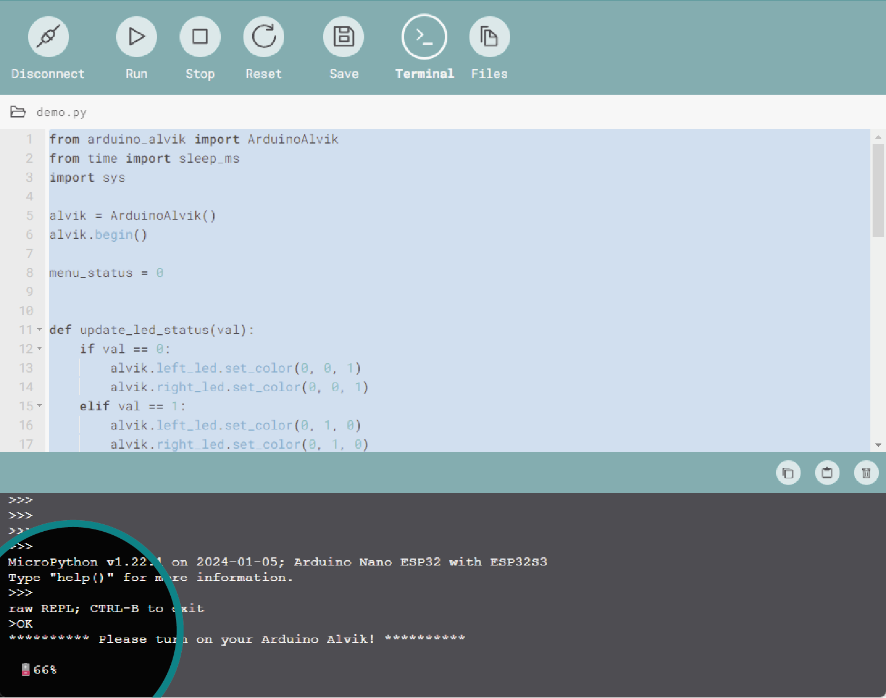

# OPERATION MANUAL ALVIK

## 1. HW and SW requirements
### 1.1 HW req
### 1.2 SW req

## 2. Alvik Overview

### 2.1 Warning notes
Please read carefully the following notes:

***Disclaimer about the risk of short-circuiting the battery when the PCB is out of the chassis. Since it is Li-Ion battery if ti is shortcircuited it can burn***

***Information about the ESD logo we need to put on the HW announcing the product is sensible to electrostatic discharge***

***Information about the screws to use next to the LEGO compatibility holes***

***If present, remove the yellow protective film on the frontal sensor***

### 2.2 Main components

#### 2.2.1 NANO ESP32
The [Nano ESP32](https://store.arduino.cc/products/nano-esp32) is the board used to control Alvik, it has a quick processor, large flash memory and Wi-Fi® enabled chip packed into a tiny circuit board.

***You can find out more about this board in the [Nano ESP32 documentation](/hardware/nano-esp32).***

Please note that when using MicroPython the pin number reflects the GPIO on the ESP32-S3, not the Nano board. Use the **green labeled number** in the following image. You can read more about this [here](https://docs.arduino.cc/micropython/micropython-course/course/introduction-python#nano-esp32--micropython-pinout).

#### 2.2.2 STM32

#### 2.2.3 ON/OFF SWITCH (focus on the importance and position)

#### 2.2.4 BATTERY (here how to charge battery and check status)

#### 2.2.5 Inputs (touch / line follow / ToF / Color / IMU)
#### 2.2.6 Outputs (LEDs / Motor + movement infos like max speed)
#### 2.2.7 Connectors

## 3. Alvik Firmware

### 3.1 How to upload last firmware
### 3.2 API (brief + link to cheat-sheet)
### 3.3 Test (simple)

## 4. Maintenance
### 4.1 Replace battery
### 4.2 Check wheels alignment
### 4.3 Check / calibrate sensors (here color calibrate procedure)

## 5. Extensions
### 5.1 Repeat warning about 15mm screws
### 5.2 Add servo
### 5.3 Add i2c grove
### 5.4 Add qwiic

