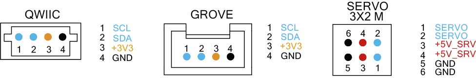

# Description
Arduino® Alvik is a powerful and versatile robot specifically designed for programming and STEAM education.

Powered by the [Arduino® Nano ESP32](https://docs.arduino.cc/hardware/nano-esp32/), Alvik offers diverse learning paths through different programming languages including MicroPython, the Arduino language, and block-based coding; enabling different possibilities to explore Robotics, IoT and AI.

# Target areas:
Maker, Education, MicroPython, Robotics, Steam

# Contents

## Features

### General Specifications Overview

Alvik is an educational robot that is battery-powered and has multiple sensors and actuators, like color detection, distance, line following, accelerometer, gyroscope and much more.

  | Feature               | Description                                                                                                   |
  | --------------------- | ------------------------------------------------------------------------------------------------------------- |
  | Alvik on-board Core   | STM32 Arm® Cortex®-M4 32 Bit                                                                                  |
  | Alvik Main Controller | Arduino® Nano ESP32                                                                                           |
  | Connectivity          | Wi-Fi®, Bluetooth® LE                                                                                         |
  | Sensors               | RGB Color detection, Distance ToF 8x8 Array - up to 350 cm, IMU - 6 degree, 3x Line follower, 7x Touch sensor |
  | Motors                | High precision with hall effect encoder. Up to 13 cm/s                                                        |
  | Extensions            | Servo motor, I2C Grove, Qwiic, Lego® Technic™, M3x5 mm Screws                                                 |

### Related Accessories (Included)

- Cable USB-C® to USB-C®

### Controllers

Alvik comes with two main microcontrollers:

 - At the core of the robot there is the STM32 Arm® Cortex®-M4 that controls all the sensors and actuators.
 - At the top a Nano ESP32 acts like the main controller and can communicate with the STM32 through a set of dedicated APIs.

| **Controllers**     | **Product page**                                                                                           | **Datasheet**                                                               |
| ------------------- | ---------------------------------------------------------------------------------------------------------- | --------------------------------------------------------------------------- |
| STM32F411RC         | [Link](https://www.st.com/en/microcontrollers-microprocessors/stm32f411rc.html#st_description_sec-nav-tab) | [Link](assets/STM32_datasheet.pdf)                                          |
| Arduino® Nano ESP32 | [Link](https://docs.arduino.cc/hardware/nano-esp32/)                                                       | [Link](https://docs.arduino.cc/resources/datasheets/ABX00083-datasheet.pdf) |

### Sensors

Alvik comes with a large number of onboard sensors, from color detection to distance sensors or inertial measurement units, all of which are listed in the following table:

| **Description**                     | **Part Name** | **Product page**                                                                                                   | **Datasheet**                          |
| ----------------------------------- | ------------- | ------------------------------------------------------------------------------------------------------------------ | -------------------------------------- |
| Color detection (x1)                | APDS 9660     | [Link](https://www.broadcom.com/products/optical-sensors/integrated-ambient-light-and-proximity-sensors/apds-9960) | [Link](assets/APDS-9960_datasheet.pdf) |
| IMU (x1)                            | LSM6DSOX      | [Link](https://www.st.com/en/mems-and-sensors/lsm6dsox.html)                                                       | [Link](assets/LSM6_datasheet.pdf)      |
| Time of Flight distance sensor (x1) | VL53L7CXV0GC  | [Link](https://www.st.com/en/imaging-and-photonics-solutions/vl53l7cx.html)                                        | [Link](assets/VL53_datasheet.pdf)      |
| Line Follower Array (x3)            | Custom made   | -                                                                                                                  | -                                      |
| Capacitive Touch buttons (x7)       | Custom made   | -                                                                                                                  | -                                      |

The sensory capabilities of Alvik can be expanded using the different connectors and communication protocols available at the back of the robot.

### Actuators

Alvik has as actuators two DC motors with magnetic relative encoders and two RGB LEDs that can be used for different purposes. In addition to that it is possible to expand the capabilities of Alvik by adding new actuators using the different connectors and communication protocols available at the back of the robot.

#### Motors

Alvik is a differential robot driven by two independent DC motors with magnetic relative encoders:

The motors have the following technical specifications:

| **Description**              | **Information** |
| ---------------------------- | --------------- |
| Operating Voltage            | 6 VDC           |
| No load Current              | 70 mA           |
| Max load Current             | 90 mA           |
| No load Speed                | 96 rpm          |
| Magnetic relative AB encoder | 3 ppr           |

The two motors are driven by the MAX22211 motors driver:

| **Description**   | **Part Name** | **Product page**                                         | **Datasheet**               |
|-------------------|---------------|----------------------------------------------------------|-----------------------------|
| Dual Motor Driver | MAX22211      | [Link](https://www.analog.com/en/products/max22211.html) | [Link](assets/max22211.pdf) |

#### RGB LEDs

Alvik has two fully programmable RGB LEDs named `DL1` and `DL2` at its top.

| **Description** | **Information** |
| --------------- | --------------- |
| RGB LED Left    | DL1             |
| RGB LED Right   | DL2             |

### Connectors & Communication Protocols

The robot is compatible with the following communication protocols:

| **Description**             | **Information**            |
| --------------------------- | -------------------------- |
| I2C                         | Groove and Qwiic connector |
| PWM Servomotor Control (x2) | Servo Motor connector      |

The connectors are placed in the back of the robot, the pinout is shown in the following image:

## Functional Overview

### Topology

The main parts of the robot are the following:

| **Part**                     | **Quantity** |                                           **Details**                                           |
| ---------------------------- | :----------: | :---------------------------------------------------------------------------------------------: |
| Arduino® Nano ESP32          |      1       |                                  Main controller of the robot                                   |
| Main PCB                     |      1       |                                      Main PCB of the robot                                      |
| STM32 Arm® Cortex®-M4 32 Bit |      1       |                               Onboard STM32 auxiliary controller                                |
| Touch Programmable button    |      7       |                      Touch programmable buttons integrated on the main PCB                      |
| ON/OFF Power Switch          |      1       |                                    Assembled on the main PCB                                    |
| RGB LED                      |      2       |                       Fully programmable RGB LED mounted on the main PCB                        |
| Color Sensor                 |      1       |                                       RGB Color detector                                        |
| 6-Axis Gyro/Accelerometer    |      1       |                              6-Axis Gyro and Accelerometer sensor                               |
| Front PCB                    |      1       |                           Robot auxiliary PCB with additional sensors                           |
| ToF Distance Sensor          |      1       |             Time-of-Flight Distance sensor up to 350 cm , mounted on the Front PCB              |
| Line follower array          |      1       | Line follower array made up of 3 phototransistors and 5 infrared LEDs, mounted on the front PCB |
| Grove Connector              |      2       |                       I2C Grove Connector to extend robot's capabilities                        |
| Qwiic Connector              |      2       |                        I2C Qwiic Connector to extend robot capabilities                         |
| Servomotor Connector         |      2       |                             3-pins connector to attach servomotors                              |
| 18650 Li-Ion Battery         |      1       |                                      Battery of the robot                                       |
| Main Chassis                 |      1       |                            Main chassis of the robot made in plastic                            |
| Motor holder                 |      2       |        Plastic support to hold the motor in place, a screwdriver is required to open it         |
| Motors                       |      2       |                             DC Motor with magnetic relative encoder                             |
| Rubber wheel                 |      2       |                               Rubber wheel with 34 mm of diameter                               |
| Inox steal ball 9 mm         |      1       |                         Ball that serves as third support for stability                         |
| Ball caster holder           |      1       |                             Plastic support to hold the steal ball                              |
| INOX M3 x 5 mm Screws        |      5       |                                  Phillips Screws of the robot                                   |
| Battery cover                |      1       |                 Cover to hold the battery, a screwdriver is required to open it                 |

### Block Diagram

The following block diagram describes the main blocks of the robot from a hardware point of view:

### Power Supply

The power distribution in the robot is explained by the following diagram:

There are three levels of power inside the robot:

| **Level** | **Description**                                                                    |
| --------- | ---------------------------------------------------------------------------------- |
| +3V7      | From the battery, the reference level is 3.7 V but it can goes from 3.0 V to 4.2 V |
| +5V       | After the Boost Converter                                                          |
| +3V3      | After the Step-Down Converter                                                      |

#### Robot's Battery

Alvik is powered by a single 18650 Li-Ion Battery protected by a battery cover at the bottom of the product which can be opened with a Phillips screwdriver. The battery is designed to be easily replaceable at any time so the robot can be used without interruptions in educational environments.

The main board of the robot incorporates the `MAX17332X22` to manage the charge and use of the battery including an overvoltage and reverse-voltage protection `LTC4360CSC8-2` chip.

<strong>Note:</strong> Do not replace the battery without adult supervision.

#### ON/OFF Power Switch

The power of the robot is located by a simple ON/OFF switch located on the top of the robot at the low right corner.

### Robot Expandability

Alvik is a robot designed to be used in STEAM & Maker environments where openness and wide compatibility with other products and construction systems are key. Thanks to that Alvik's capabilities can be expanded with new sensors and actuators using the additional connectors on its back, and with additional mechanical extensions like Lego® Technic™ pieces or 3D printed/custom made parts. In the following sections we will explain how to expand Alvik's capabilities.

#### Additional Connectors

Alvik has a series of additional connectors to expand its possibilities located at the back of the robot:

| **Description**             | **Information**                                                                       |
| --------------------------- | ------------------------------------------------------------------------------------- |
| Qwiic Connector (x2)        | I2C Connectivity with compatible sensors and actuators using the Qwiic estandard      |
| I2C Grove Connector (x2)    | I2C Connectivity with compatible sensors and actuators using the Grove estandard      |
| PWM Servomotor Control (x2) | 3-pins Servo Motor connector compatible with a wide ranger of 3rd party manufacturers |

<strong>Note:</strong> When connecting additional hardware to Alvik's connector, make sure each of the components connected has a unique I2C address to avoid connectivity issues.

#### Lego® Technic™ Compatibility

The robot is compatible with Lego® Technic™ pins to expand its body with new features and additional mechanisms.

To attach Lego® Technic™ pieces to Alvik's body use the widely available Lego® Technic™ Pegs. There are two Lego's compatible peg holes on each side of the robot as can be seen in the following image:

#### M3 Screw Inserters Compatibility

Alvik can be expanded with any additional hardware and pieces thanks to its four screw inserts present on each side of the robot. These inserts are compatible with M3 screws being the best way to expand the robot's possibilities using custom made or third-party pieces.

<!---

-->

<strong>Warning:</strong> The <strong>maximum screw length recommended is 10 mm (M3x10</strong> ). In case longer screws are used the robot could be damaged.

## Device Operation

### Getting Started - MicroPython
Alvik can be programmed with MicroPython. To do that download and install the Arduino Lab for MicroPython **[1]**. To connect the Alvik robot to your computer, you will need a USB-C® cable.

### Getting Started - Arduino IDE
If you want to program your Alvik robot while offline you need to install the Arduino® Desktop IDE **[2]**. To connect the Alvik robot to your computer, you will need a USB-C® cable.

### Getting Started - Arduino Cloud
All Arduino® IoT-enabled products are supported on Arduino Cloud **[3]** which allows you to log, graph and analyze sensor data, trigger events, and automate your home or business.

### Sample Sketches
Sample sketches for the Alvik robot can be found in the “Alvik robot Documentation” section of Arduino® Docs **[4]** and inside its dedicated libraries.

### Online Resources
Now that you have gone through the basics of what you can do with the device, you can explore the endless possibilities it provides by checking exciting projects on Arduino Project Hub **[5]** and the online store **[6]** where you will be able to complement your Alvik robot product with additional extensions, sensors and actuators.

## Product Compliance

### Certifications Summary

| Cert          | Arduino Alvik (AKX00066) |
| ------------- | ------------------------ |
| **CE (EU)**   | Yes                      |
| **UKCA (UK)** | Yes                      |

### Declaration of Conformity CE DoC (EU)

We declare under our sole responsibility that the products above are in conformity with the essential requirements of the following EU Directives and therefore qualify for free movement within markets comprising the European Union (EU) and European Economic Area (EEA).

### Declaration of Conformity to EU RoHS & REACH 211 01/19/2021

Arduino boards are in compliance with RoHS 2 Directive 2011/65/EU of the European Parliament and RoHS 3 Directive 2015/863/EU of the Council of 4 June 2015 on the restriction of the use of certain hazardous substances in electrical and electronic equipment.

| **Substance**                          | **Maximum Limit (ppm)** |
| -------------------------------------- | ----------------------- |
| Lead (Pb)                              | 1000                    |
| Cadmium (Cd)                           | 100                     |
| Mercury (Hg)                           | 1000                    |
| Hexavalent Chromium (Cr6+)             | 1000                    |
| Poly Brominated Biphenyls (PBB)        | 1000                    |
| Poly Brominated Diphenyl ethers (PBDE) | 1000                    |
| Bis(2-Ethylhexyl) phthalate (DEHP)     | 1000                    |
| Benzyl butyl phthalate (BBP)           | 1000                    |
| Dibutyl phthalate (DBP)                | 1000                    |
| Diisobutyl phthalate (DIBP)            | 1000                    |

Exemptions: No exemptions are claimed.

Arduino Boards are fully compliant with the related requirements of European Union Regulation (EC) 1907 /2006 concerning the Registration, Evaluation, Authorization and Restriction of Chemicals (REACH). We declare none of the SVHCs ([https://echa.europa.eu/web/guest/candidate-list-table](https://echa.europa.eu/web/guest/candidate-list-table)), the Candidate List of Substances of Very High Concern for authorization currently released by ECHA, is present in all products (and also package) in quantities totaling in a concentration equal or above 0.1%. To the best of our knowledge, we also declare that our products do not contain any of the substances listed on the "Authorization List" (Annex XIV of the REACH regulations) and Substances of Very High Concern (SVHC) in any significant amounts as specified by the Annex XVII of Candidate list published by ECHA (European Chemical Agency) 1907 /2006/EC.

### Conflict Minerals Declaration

As a global supplier of electronic and electrical components, Arduino is aware of our obligations with regards to laws and regulations regarding Conflict Minerals, specifically the Dodd-Frank Wall Street Reform and Consumer Protection Act, Section 1502. Arduino does not directly source or process conflict minerals such as Tin, Tantalum, Tungsten, or Gold. Conflict minerals are contained in our products in the form of solder, or as a component in metal alloys. As part of our reasonable due diligence Arduino has contacted component suppliers within our supply chain to verify their continued compliance with the regulations. Based on the information received thus far we declare that our products contain Conflict Minerals sourced from conflict-free areas.

### FCC Caution

Any Changes or modifications not expressly approved by the party responsible for compliance could void the user’s authority to operate the equipment.

This device complies with part 15 of the FCC Rules. Operation is subject to the following two conditions:

(1) This device may not cause harmful interference

(2) this device must accept any interference received, including interference that may cause undesired operation.

**FCC RF Radiation Exposure Statement:**

1. This Transmitter must not be co-located or operating in conjunction with any other antenna or transmitter.

2. This equipment complies with RF radiation exposure limits set forth for an uncontrolled environment.

3. This equipment should be installed and operated with a minimum distance of 20 cm between the radiator & your body.

**Note:** This equipment has been tested and found to comply with the limits for a Class B digital
device, pursuant to part 15 of the FCC Rules. These limits are designed to provide
reasonable protection against harmful interference in a residential installation. This equipment
generates, uses and can radiate radio frequency energy and, if not installed and used in
accordance with the instructions, may cause harmful interference to radio communications.
However, there is no guarantee that interference will not occur in a particular installation. If
this equipment does cause harmful interference to radio or television reception, which can be
determined by turning the equipment off and on, the user is encouraged to try to correct the
interference by one or more of the following measures:
- Reorient or relocate the receiving antenna.
- Increase the separation between the equipment and receiver.
- Connect the equipment into an outlet on a circuit different from that to which the
receiver is connected.
- Consult the dealer or an experienced radio/TV technician for help.

English:
User manuals for licence-exempt radio apparatus shall contain the following or equivalent notice in a conspicuous location in the user manual or alternatively on the device or both. This device complies with Industry Canada licence-exempt RSS standard(s). Operation is subject to the following two conditions:

(1) this device may not cause interference

(2) this device must accept any interference, including interference that may cause undesired operation of the device.

French:
Le présent appareil est conforme aux CNR d’Industrie Canada applicables aux appareils radio exempts de licence. L’exploitation est autorisée aux deux conditions suivantes :

(1) l’ appareil nedoit pas produire de brouillage

(2) l’utilisateur de l’appareil doit accepter tout brouillage radioélectrique subi, même si le brouillage est susceptible d’en compromettre le fonctionnement.

**IC SAR Warning:**

English
This equipment should be installed and operated with a minimum distance of 20 cm between the radiator and your body.

French:
Lors de l’ installation et de l’ exploitation de ce dispositif, la distance entre le radiateur et le corps est d ’au moins 20 cm.

**Important:** The operating temperature of the EUT can’t exceed 85℃ and shouldn’t be lower than -40 ℃.

Hereby, Arduino S.r.l. declares that this product is in compliance with essential requirements and other relevant provisions of Directive 201453/EU. This product is allowed to be used in all EU member states.

## Company Information

| Company name    | Arduino S.r.l.                                  |
| --------------- | ----------------------------------------------- |
| Company Address | Via Andrea Appiani, 25 Monza, MB, 20900 (Italy) |

## Reference Documentation

| Reference | Description                           | Link                                                                       |
| --------- | ------------------------------------- | -------------------------------------------------------------------------- |
| 1         | Arduino Lab for MicroPython (Desktop) | <https://docs.arduino.cc/micropython/>                                     |
| 2         | Arduino IDE (Desktop)                 | <https://www.arduino.cc/en/Main/Software>                                  |
| 3         | Arduino Cloud Editor                  | <https://create.arduino.cc/editor>                                         |
| 4         | Arduino Official Documentation        | <https://docs.arduino.cc/>                                                 |
| 5         | Arduino Project Hub                   | <https://create.arduino.cc/projecthub?by=part&part_id=11332&sort=trending> |
| 6         | Online Store                          | <https://store.arduino.cc/>                                                |

## Revision History

| Date       | **Revision** |             **Changes**             |
| ---------- | :----------: | :---------------------------------: |
| 13/05/2024 |      2       | Robot's Expandability section added |
| 24/04/2024 |      1       |            First Release            |
