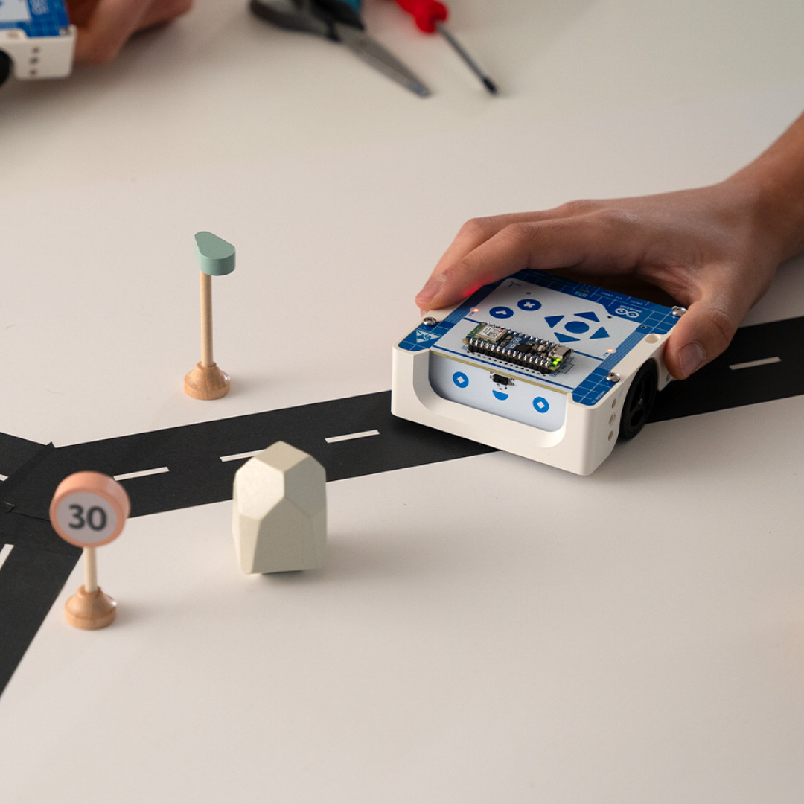
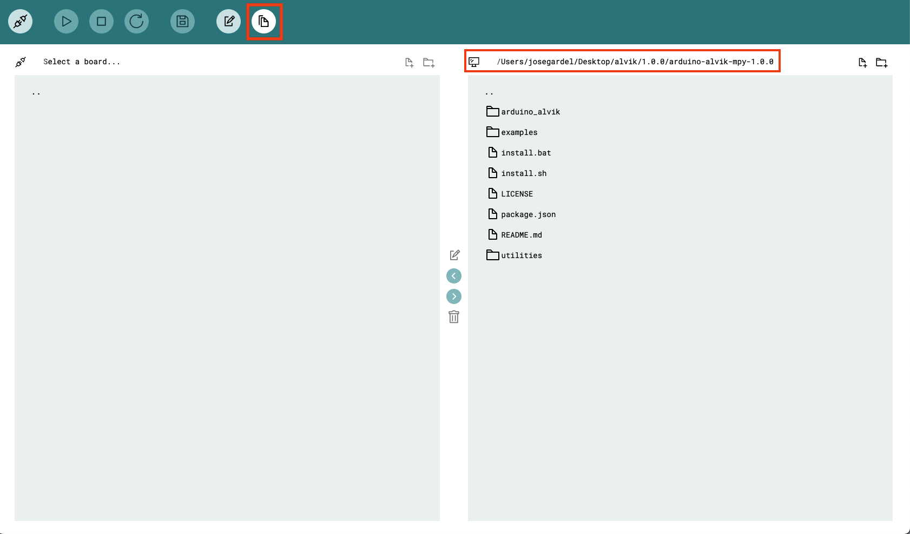
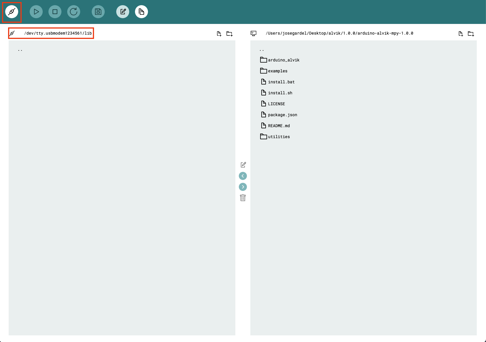
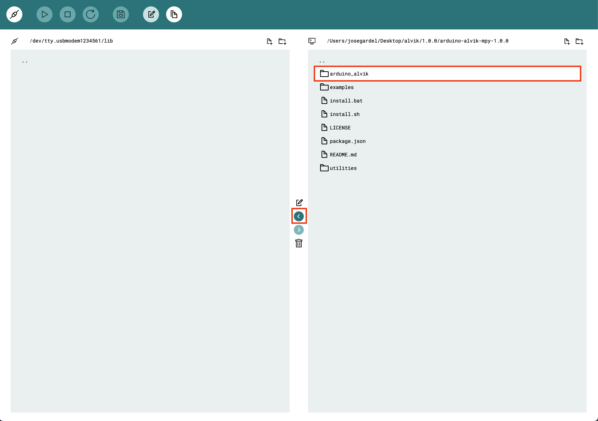
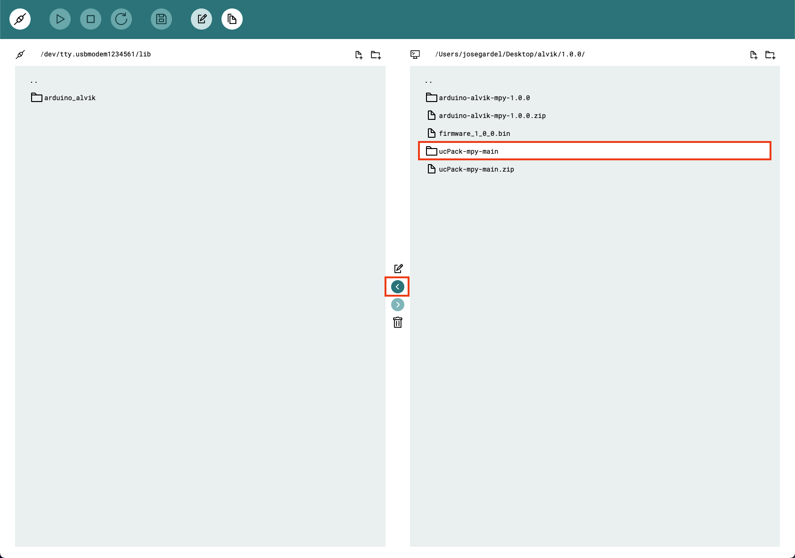
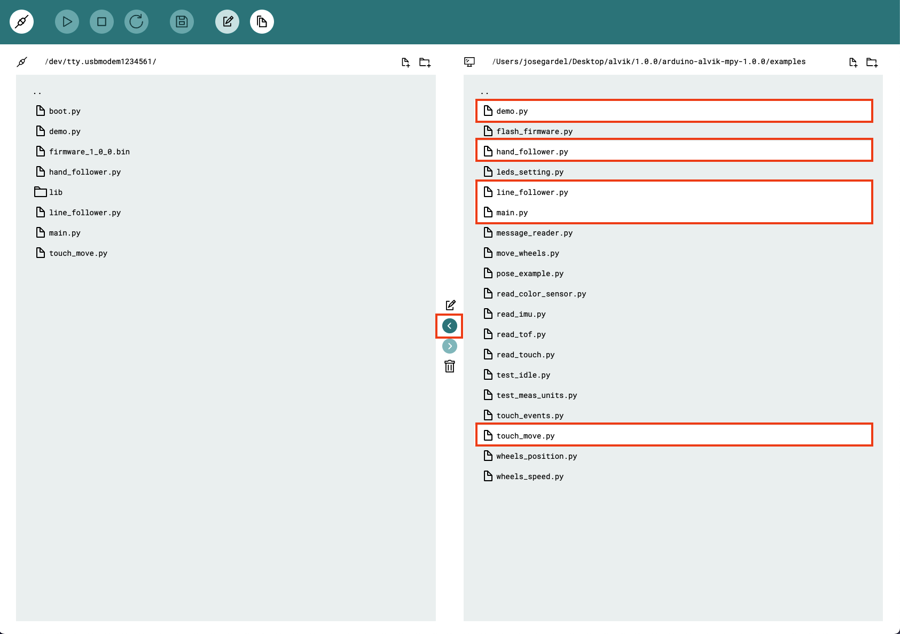
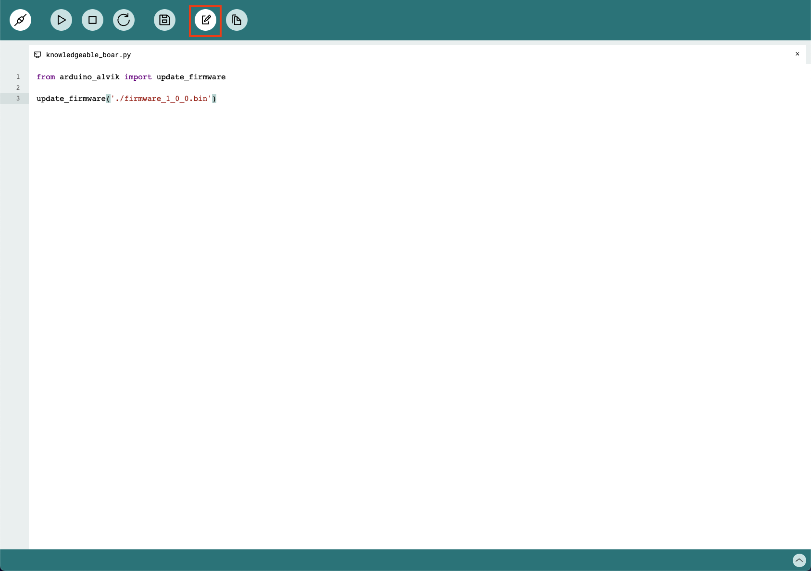

Arduino® Alvik is a powerful and versatile robot specifically designed for programming and STEAM education.


Powered by the Arduino® Nano ESP32, Alvik offers diverse learning paths through different programming languages including MicroPython, Arduino C, and block-based coding; enabling different possibilities to explore Robotics, IoT and Artificial Intelligence.

In this tutorial you will find useful information to get started, test and maintain Alvik.

## Alvik's First Use


Your Alvik robot is equipped with three ready-to-go examples. To choose one of the examples, just turn your Alvik ON, wait until the LEDs turn blue and use the Up and Down buttons to pick one color, then hit the "tick" confirmation button. It's that easy!

* **Red Program (Touch Mode):** Use the arrows to tell your robot what to do: up and down for moving forward and backward by 10 cm, and left and right for turning 90 degrees in each of the directions. The robot will collect instructions until you press the "tick" confirmation button. Once you press it, the robot will execute all the actions in order.

* **Green Program (Hand Follower):** Your robot will keep a steady 10 cm distance from your hand or any object you put in front of it. Press the "tick" confirmation button again to make the robot start following your hand.

* **Blue Program (Line Follower):** Your robot will glide along a black line on a white surface. Press the "tick" confirmation button again to make the robot follow the line. You can stop the robot at any moment by pressing the "X" cancel button. __The recommended size for the "black line" to follow is between 2-3 cm wide.__

***The product is sensible to electrostatic discharge, observe ESD-safe handling procedures when working with it***

Now that you have played with Alvik and have seen it moving, it is time to know more in-depth how it is built and how to get much more than the out-of-the-box experience from it.

## Alvik in Detail


To get started to play with Alvik you will need the following hardware and software:

### Hardware Requirements

- Alvik (x1)
- USB-C® to USB-C® cable (x1)
- Phillips Screwdriver (cross head) (x1)
- Computer (X1)

***Make sure the UCB-C® cable you are using works with data lines, not only power lines***

### Software Requirements

- Operating Systems: All the major Operating Systems are supported
- [Arduino Lab for Micropython](https://labs.arduino.cc/en/labs/micropython)

## Alvik Overview


***When the PCB is out of the chassis and the battery is in place there is the risk of short-circuiting the 18650 Li-Ion battery. If you remove the hardware from the chassis make sure you do it on a __non-conductive surface clean__ of materials or tools that can short-circuit the battery***

### Main Components

Alvik is a robot with two controllers and tons of useful sensors and actuators. The main controller is the Arduino Nano ESP32 attached at the top of the robot while there is an STM32 controller integrated into the robot that takes care of the low-level commands like reading the sensors and moving the motors.


#### Nano ESP32

The [Nano ESP32](https://store.arduino.cc/products/nano-esp32) is the board used to control Alvik, it has a quick processor, large flash memory and Wi-Fi® enabled chip packed into a tiny circuit board.

***You can find out more about this board in the [Nano ESP32 documentation](/hardware/nano-esp32).***

Please note that when using MicroPython the pin number reflects the GPIO on the ESP32-S3, not the Nano board. Use the **green labeled number** in the following image. You can read more about this [here](https://docs.arduino.cc/micropython/micropython-course/course/introduction-python#nano-esp32--micropython-pinout).


#### STM32

The main core of the robot is the STM32 ARM Cortex-M4 32 Bit, you can access it through a set of dedicated APIs from the Nano ESP32.

You can learn more about the available functions for Alvik in the following [ Alvik's API Documentation](/tutorials/alvik/api-overview/).

The latest firmware of the STM32 can be found at [this link](https://github.com/arduino-libraries/Arduino_AlvikCarrier/releases), and [here](#how-to-upload-firmware) is the guide to flash it.


#### ON/OFF Switch


At the back-right side of Alvik there is the main switch of the robot. When ON the robot will power up and it will execute the already loaded program.

***While programming the terminal of the Arduino Lab for MicroPython will notify you if you forgot to switch on the robot. Keep the robot off while programming to avoid undesired movements and remember to turn it on when you are ready to execute your program***


#### Battery

The battery is a rechargeable Li-ion 18650. It is located in the bottom part of Alvik, to access it you need to remove one Phillip's screw and take out the plastic holder.


The Nano ESP32 can report the status of the battery through the terminal of the Arduino Lab for MicroPython and with its RGB status LED. To do that you need to call the `Alvik.begin()` function in any program or directly at the command line area.

When the battery is charging the status LED will blink RED for one second.


When fully charged it will stay GREEN.


***Don't confuse the RGB status LED with the power ON LED of the Nano ESP32, which is always green.***

#### Sensors

Alvik has five different sensors, all connected to the STM32 and accessible through the [APIs](/tutorials/alvik/api-overview/). For each sensor there is a test example program that you can find in the _examples_ folder in [this repository](https://github.com/arduino/arduino-alvik-mpy/tree/main/examples).

| **Sensor name**              | **Part name** | **Test program name** |
|------------------------------|---------------|-----------------------|
| RGB Color detection          | APDS 9660     | read_color_sensor.py  |
| ToF 8x8 Array - up to 350 cm | LSM6DSOX      | read_tof.py           |
| IMU - 6 degree               | VL53L7CX      | read_imu.py           |
| 3x Line follower             | custom made   | line_follower.py      |
| 7x Touch sensor              | AT42QT2120    | read_touch.py         |

***Before using the ToF sensor check if it has a yellow protective film, if present, remove it from the sensor to ensure it works properly***

#### Actuators

Alvik has two high-precision geared motors and two RGB LEDs. The test programs are located in the same folder as the [sensor examples](#sensors).

| **Actuator name**        | **Part name**           | **Test program name** |
|--------------------------|-------------------------|-----------------------|
| Geared motors w/ encoder | GM12-N20VA-08255-150-EN | wheels_positions.py   |
| RGB LEDs                 | RGB LEDs                | leds_settings.py      |

#### Connectors

The connectors are placed in the back of the robot, the pinout is shown in the following image:


## Coding Alvik


In order for Alvik to work properly three things have to be set correctly:

1. The Nano ESP32 needs the [MicroPython firmware](https://labs.arduino.cc/en/labs/micropython) on it.
2. The [latest libraries](https://github.com/arduino/arduino-alvik-mpy/releases) have to be placed in the Nano ESP32.
3. The [latest firmware](https://github.com/arduino-libraries/Arduino_AlvikCarrier/releases) has to be uploaded to the STM32 microcontroller.

Alvik comes with a preinstalled version of libraries and firmware, but in case you want to upgrade it or if something happens and you mess things up, here is the guide to reinstall both libraries and firmware.

### MicroPython Firmware on the Nano ESP32

Download and install the [Arduino Lab for MicroPython](https://labs.arduino.cc/en/labs/micropython), if you are able to connect the Arduino Nano ESP32 it means that you're board is ready. You have to see the **CONNECTED** yellow label at the bottom.


If something goes wrong it means you need to upload the MicroPython firmware on the Nano ESP32.

Follow [this guide](https://docs.arduino.cc/micropython/basics/board-installation/).

### How to Upload Libraries

You will find the latest instructions directly in the [repository](https://github.com/arduino/arduino-alvik-mpy/releases). Here are the main steps:

1. Prepare file

Download the repository and extract all the files in a specific folder that will become the main Alvik folder.

2. Remove old files

Open **Arduino Lab for MicroPython** and **connect** Alvik. Then:

- Click on the `files` icon

- Click on a `files name` in the bottom left explorer windows.

- Click on the `bin` icon to delete it

- Repeat for all the files, from all folders


3. Install mpremote

[mpremote](https://docs.micropython.org/en/latest/reference/mpremote.html) is a Python module needed to upload files on the Nano ESP32. The minimum suggested mpremote release is 1.22.0. Be sure to have Python installed before proceeding!

```
(venv)$ pip install mpremote
```

or

```
(venv)$ python3 -m pip install mpremote
```

Depending on how you configure Python on your machine.

4. Install library

Run the following line to upload all files and download the dependencies needed to run the Arduino Alvik MicroPython library.

Linux

```
$ ./install.sh -p <device port>
```

Windows

```
> install.bat -p <device port>
```

The `install.*` script will copy all the needed files into your Alvik.

The `<device port>` is the name of the USB port that your computer assigned to the Nano ESP32. There are several ways to find it, depending on your OS, for example:

- You can use the Arduino IDE to discover the port, [follow this guide to know more.](https://support.arduino.cc/hc/en-us/articles/4406856349970-Select-board-and-port-in-Arduino-IDE)
- You can check it by using the Arduino Lab for MicroPython by clicking `Connect` after connecting Alvik with the USB cable.
- You can check the list of the USB devices attached to your PC.

### How to Upload Firmware

1. Download the latest [pre-compiled firmware](https://github.com/arduino-libraries/Arduino_AlvikCarrier/releases/latest) and place it inside Alvik's project folder

2. Go into `utilities` folder and run the `flash_firmware` script:


Linux

```
$ ./flash_firmware.sh -p <device port> <path-to-your-firmware>
```

Windows

```
> flash_firmware.bat -p <device port> <path-to-your-firmware>
```

Answer `y` to flash firmware.

### Test

There are several examples to test all the features of your Alvik placed inside the `examples` folder.

Open **Arduino Lab for MicroPython** and **connect** Alvik. Then:

1. Click on the `files` icon
2. Click on the `path string` in the bottom right explorer windows.
3. Click on the `file name` of the example you choose
4. Click on the `play button`


## Maintenance

### Check Wheels Alignment

The motion calculations performed by Alvik are based on the precise position of both wheels. You can check this position and correct it in case you think your robot is not moving as expected:

1. Place your Alvik on a side on a flat surface
2. Check that the exterior part of the wheel is in contact with the flat surface and aligned with the plastic chassis
3. Repeat with the other wheel


### Calibrate Color Sensors

To calibrate the color sensor, placed in the bottom PCB under the Nano ESP32, you'll need a white surface and a black surface. Follow these steps:

1. Open the Arduino Lab for MicroPython
2. Connect Alvik
3. Open the REPL terminal (just click on the Terminal Icon on top)

Now you're ready to send commands directly to Alvik. Every time you click enter the command will be executed in real time.

```bash
 from arduino_alvik import ArduinoAl

 alvik = ArduinoAlvi

 alvik.begin()
```

Now place your robot on the white surface and type:

```bash
alvik.color_calibration('white')
```

Now place your robot on the black surface and type:

```bash
alvik.color_calibration('black')
```

Press reset on Lab for MicroPython.

You can now test using read_color_sensor.py in the examples folder. Refer to the [test chapter](#test) if you have any problems.

***Colors are tested on paper painted using acrylic marker pens, such as UNIPOSCA, or paper printed with an inkjet printer.***

## Extensions

***When adding extensions to the robot, never use screws longer than 10 mm or the device could be damaged.***

### Add LEGO® Addons

On both sides of Alvik there are different housings that let you add:

- 4x M3 screws per side
- 2x LEGO® Technic™ Connector per side

The dimensions are:


As reference you can take a look at the following images:


### Add Servo Motors

The servo motors connectors are placed at the back of Alvik, in this tutorial we'll attach a servo motor to the port A. You can take a look at the pinout image in the [pinout](#3.2.7-connectors) chapter](#connectors).

***The port provides 5 Volt to the motor, so be sure to connect a servo that runs with 5V.***

1. Connect the servo motor to the upper port

    

2. Open the Arduino Lab for MicroPython

3. Connect Alvik with a USB cable and click CONNECT

4. Copy and paste the following test code

```arduino
from arduino_alvik import ArduinoAlvik

import time

alvik = ArduinoAlvik()

alvik.begin()

while True:
    alvik.set_servo_positions(0,0)
    time.sleep(2)
    alvik.set_servo_positions(90,0)
    time.sleep(2)
    alvik.set_servo_positions(180,0)
    time.sleep(2)
    alvik.set_servo_positions(90,0)
    time.sleep(2)
```

5. Click on the PLAY button to run the test code

6. The motor should move as in the gif below

    

If you want to understand how the command `alvik.set_servo_positions` works, you can have a look in the [API overview](/tutorials/alvik/api-overview/).

### Add I2C Grove

The I2C Grove connectors are placed at the back of Alvik, in this tutorial we'll see how to scan a generic I2C device connected to it. You can take a look at the pinout image at [Arvik's Product Page](/hardware/alvik/).

1. Connect the I2C Groove device to one of the two ports.

2. Open the Arduino Lab for MicroPython

3. Connect Alvik with a USB cable and click CONNECT

4. Turn ON Alvik

5. Copy and paste the following test code

```arduino
from machine import I2C
from machine import Pin

i2c = I2C(0, scl=Pin(12, Pin.OUT), sda=Pin(11, Pin.OUT))

print()
print('Scan i2c bus...')
print()

devices = i2c.scan()

if len(devices) == 0:
    print("No i2c device !")
else:
    print('i2c devices found:',len(devices))
print()

for device in devices:
    print("Decimal address: ",device," | Hexa address: ",hex(device))

print()
```

5. Click on the PLAY button to run the test code

6. Look at the terminal to see the list of the I2C devices

### Add Qwiic

The Qwiic connectors are placed at the back of Alvik, for this example we'll be using the Qwiic OLED display from SparkFun. You can take a look at the pinout image in the [pinout](#3.2.7-connectors) chapter](#connectors).


1. Connect the OLED display to one of the Qwiic connectors, you can use either the left one or the right one.


2. We've prepared the example code and the libraries in [this](assets/qwiic_display.zip) zip file.

3. Extract the files and open the folder

4. Install mpremote

[mpremote](https://docs.micropython.org/en/latest/reference/mpremote.html) is a Python module needed to upload files on the Nano ESP32. The minimum suggested mpremote release is 1.22.0. Be sure to have Python installed before proceeding!

```
(venv)$ pip install mpremote
```

or

```
(venv)$ python3 -m pip install mpremote
```

Depending on how you configure Python on your machine.

5. Install library

Run the following line to upload all files and download the dependencies needed to run the Arduino Alvik MicroPython library.


Linux
```
$ ./install_oled_lib.sh -p <device port>
```
Windows
```
> install_oled_lib.bat -p <device port>
```

The `<device port>` is the name of the USB port that your computer assigned to the Nano ESP32. There are several ways to find it, depending on your Operating System, for example:

- You can use the Arduino IDE to know the port by [following this guide](https://support.arduino.cc/hc/en-us/articles/4406856349970-Select-board-and-port-in-Arduino-IDE).
- You can look it using the Arduino Lab for MicroPython by clicking `Connect` after have connected the Alvik with the USB cable.
- You can look at the list of the USB devices attached to the PC

6. Test `Hello World!`

Now you can open the Arduino Lab for MicroPython, connect Alvik and open the example called `hello_world.py` in the `examples` folder. If everything works as expected you'll see something like the following image:


7. Test `bender.py`

Open the example called `bender.py`, launch it and see on your display the image of Bender's robot.

<!--
## Julian Proposal

## What is Alvik



Arduino® Alvik is a powerful and versatile robot specifically designed for programming and STEAM education. Powered by the Arduino® Nano ESP32, Alvik offers diverse learning paths through different programming languages including MicroPython, Arduino C, and block-based coding; enabling different possibilities to explore Robotics, IoT and Artificial Intelligence.


### What is included


Inside Alvik's packaging you will find the following items:
* Alvik (x1)
* Cable USB-C® to USB-C® (x1)
* 18650 Battery (already inside the robot) (x1)


***The product is sensible to electrostatic discharge, observe ESD-safe handling procedures when working with it***


### The Brain

Alvik have two controllers

### The Body

#### Controller

#### Power

    - How to charge Alvik
    - Replacing the battery

#### Sensors
    - Touch Buttons
    - Distance Sensor
    - Line Follower Sensors
    - Color Sensor
    - IMU

#### Actuators
    - Motors and Encoders

## Move Alvik!

### Basic Touch Programming

### Following Objects

### Line Follower

## Updating Alvik

### Updating Alvik's Brain (Nano ESP32)

It may happen that you used your Nano ESP32 for other projects than Alvik, or you need to replace it. In order to make your Nano ESP32 work with Alvik, there are few steps needed:

1. Install the micropython bootloader on it following [this guide](https://docs.arduino.cc/micropython/basics/board-installation/).

2. Download the Alvik micropyton libraries

   1. Alvik micropython libraries from the [Alvik repository](https://github.com/arduino/arduino-alvik-mpy/tree/main)
   2. ucPack libraries from the [ucPack repository](https://github.com/arduino/ucPack-mpy/tree/main)

3. Unzip both of the downloaded libraries in a single "Alvik" folder, open the Arduino Lab for MicroPython, go to the "files" tab and set the path to the unzipped folder on the Arduino Lab for Micropython

   

4. Make sure your Alvik is OFF, connect it to your computer and then, turn it ON

   

5. Connect your Alvik to the Arduino Labs for micropython and open the "lib"
   

6. Select the "Arduino-alvik" and move it inside the "lib" folder in your Alvik.
   

7. Go back to the main folder and select the "ucPack-mpy-main" folder and move it next to the arduino_alvik inside the "lib" folder in your Nano ESP32.
   

8. Now go back to the main root of the files system on the Nano ESP32. Then in your local folder navigate to the examples folder once there, select the following files and move them to the main folder of the ESP32.

   1. demo.py
   2. hand_follower.py
   3. line_follower.py
   4. main.py
   5. touch_move.py

   

With this last step, your Nano ESP32 has been set up with the Alvik out of the box experience and is ready to be used.

### Updating Alvik's Body (STM32)

1. Download the [pre-compiled firmware](https://github.com/arduino-libraries/Arduino_AlvikCarrier/releases/latest) from the [Alvik Carrier GitHub reposiitory](https://github.com/arduino-libraries/Arduino_AlvikCarrier)

   This step will download a "firmware_x_x_x.bin" file, save it in your Alvik folder

2. Connect your Alvik to the Computer and to the Arduino Labs for Micropython. Then, go to the files tab and navigate to the folder where you stored the "firmware_x_x_x.bin"
   

3. Let's move now the "firmware_x_x_x.bin" to the main root.
   

4. Turn ON your alvik, go to the Editor tab and tun the following commands by typing them and clicking on the "Play" button

   ```
   from arduino_alvik import update_firmware

   update_firmware('./firmware_1_0_0.bin')
   ```

   

After executing these commands, there will be updates of the process on the prompt, once the process finishes, the firmware of your alvik will be updated.

### Hello Alvik! Your first program!

Alvik is intended to be programmed with MicroPyton. We recommend you to install the [Arduino Lab for MicroPython](https://labs.arduino.cc/en/labs/micropython) editor.

Now that all the previous steps have been set, let's see how to create custom programs for Alvik to move forward until detecting an object in front of it, Alvik will detect it, dodge it and continue on its way.


**1. **Create an Alvik folder in your computer and set it as the path of the Arduino Lab for MicroPython IDE


**2. **Create a new file "obstacle_avoider.py" in your local folder


**3. **Double click on the file to open it. Once it is opened, erase the text on it and add the following code.


``` python
from arduino_alvik import ArduinoAlvik
from time import sleep_ms
import sys

alvik = ArduinoAlvik()
alvik.begin()
sleep_ms(5000)  #waiting for the robot to setup
#robot.set_illuminator(0)
distance = 10
speed = 40 #rpm

def turning():
    alvik.set_wheels_speed(0,0)
    sleep_ms(250)
    alvik.set_wheels_speed(-35,-35)
    sleep_ms(1500)
    alvik.set_wheels_speed(35,-35)
    sleep_ms(1000)

while (True):

    distance_l, distance_cl, distance_c, distance_r, distance_cr  = alvik.get_distance()
    sleep_ms(50)
    print(distance_c)

    if distance_c < distance:
        turning()
    elif distance_cl < distance:
        turning()
    elif distance_cr < distance:
        turning()
    elif distance_l < distance:
        turning()
    elif distance_r < distance:
        turning()
    else:
        alvik.set_wheels_speed(speed, speed)

```

**4. **Connect Alvik to your PC using the cable included in the box, under the tray.


***Make sure that Alvik is OFF before connecting it to your computer.***

**5. **Once Alvik is connected to the PC, connect it to the Arduino Lab for MicroPython and open the _main.py_ file in the Alvik folder. Once the file is opened let's replace the `import demo` statement by `import obstacle_avoider`.


***If you want to go back to the out of the box experience where you could select between reg, green and blue programs, you only need to modify the _main.py_ again replacing the `import obstacle_avoider` statement by `import demo`***

**6. **The last step is to move the _obstacle_avoider.py_ file from the local repository to Alvik's memory.


You are now all set, disconnect Alvik from the computer, put some obstacles around Alvik, turn it ON and see how Alvik detects them and turns to avoid them.


## Program Alvik!

### Controlling the motors

### Reading buttons

### Detecting obstacles

### Following a line

### Sensing colors

### Detecting Crashes and Fallings

### LEDs

## Expanding the Robot

### Additional Connectors
    - Qwiic Connectors
    - Grove Connectors
    - Servomotors Connectors

### Lego Technic Compatibility

### Custom parts

## Want more?

## Need Help?
-->
