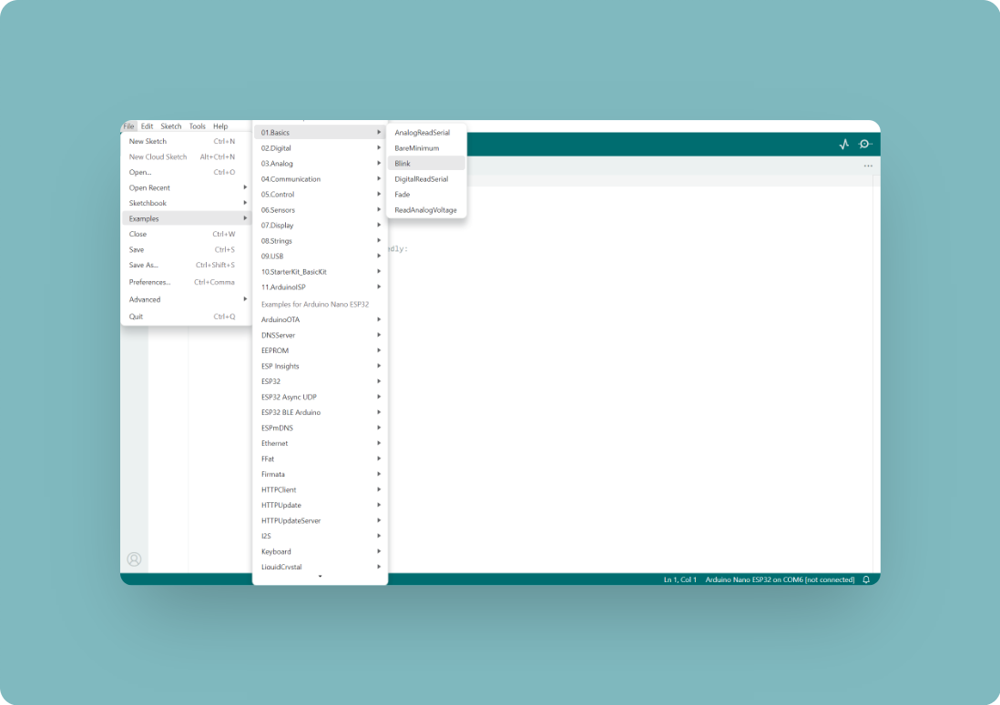

# Getting Started with Alvik on Arduino IDE

## Requirements

### Software

- **Arduino IDE**: The primary development environment for writing, compiling, and uploading code to Alvik.
- **Alvik Library for Arduino**: A library that provides easy access to the Alvik robot's functionalities.
- **USB Drivers**: Ensure you have the correct drivers installed to communicate with Alvik via USB.

### Hardware

- **Alvik Robot**: The main platform you'll be programming.
- **USB Cable**: Used to connect Alvik to your computer for programming and power.
- **Computer**: Running Windows, macOS, or Linux with a USB port.

## Setup

### Arduino IDE

1. Install the Arduino IDE from the [official Arduino website](https://www.arduino.cc/en/software).
2. Open the Arduino IDE.
3. Go to **Sketch > Include Library > Manage Libraries**.
4. In the Library Manager, search for "Alvik" and install the latest version of the Alvik library.

### Firmware Preparation

#### Preparing Alvik for Arduino IDE

1. Connect pin **B1** to **GND** on the Alvik board.

2. Connect the Alvik board to your computer using the USB cable.
3. Open the **Blink** example in the Arduino IDE by going to **File > Examples > 01.Basics > Blink**.

4. Select **esptool** as the programmer from the **Tools > Programmer** menu.

5. Select **Upload Using Programmer** from the **Sketch** menu.

6. Your board should now be restored and ready for programming with the Arduino IDE.

#### Preparing Alvik for MicroPython

1. Install the micropython bootloader on it following [this guide](https://docs.arduino.cc/micropython/basics/board-installation/).

2. Download the Alvik micropyton libraries
Alvik micropython libraries from the [Alvik repository](https://github.com/arduino/arduino-alvik-mpy/tree/main)
ucPack libraries from the [ucPack repository](https://github.com/arduino/ucPack-mpy/tree/main)
3. Unzip both of the downloaded libraries in a single "Alvik" folder, open the Arduino Lab for MicroPython, go to the "files" tab and set the path to the unzipped folder on the Arduino Lab for Micropython
   
4. Make sure your Alvik is OFF, connect it to your computer and then, turn it ON
   
5. Connect your Alvik to the Arduino Labs for micropython and open the "lib"
   
6. Select the "Arduino-alvik" and move it inside the "lib" folder in your Alvik.
   
7. Go back to the main folder and select the "ucPack-mpy-main" folder and move it next to the arduino_alvik inside the "lib" folder in your Nano ESP32.
   
8. Now go back to the main root of the files system on the Nano ESP32. Then in your local folder navigate to the examples folder once there, select the following files and move them to the main folder of the ESP32.
   `demo.py`
   `hand_follower.py`
   `line_follower.py`
   `main.py`
   `touch_move.py`

   
With this last step, your Nano ESP32 has been set up with the Alvik out of the box experience and is ready to be used.

## Programming Alvik

1. Start with a simple example, like blinking an LED or reading a sensor.
2. Use the Alvik library functions to interact with the robot's hardware.
3. Upload your sketch to see it in action.
4. Explore the included examples in the Alvik library to learn how to control motors, read sensors, and more.

## More Resources (C++)

- **Alvik Documentation**: Dive deeper into the capabilities of Alvik by exploring the official documentation.
- **Community Forums**: Join the Arduino community forums to ask questions and share your projects.
- **Tutorials and Projects**: Look for tutorials and project ideas that can inspire your next steps with Alvik.
