## Use Alvik with block-based language

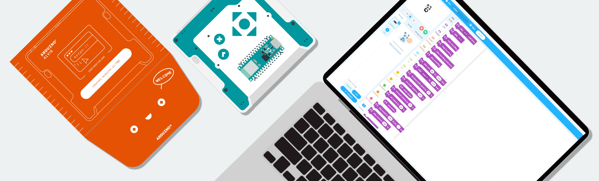

Welcome to your first experience with Alvik, your companion for exploring robotics and programming. In this guide, we'll walk you through setting up your Alvik and starting your journey into block based.

## What’s Included in the Box 

When unboxing Alvik, you should find the following items:

- Alvik robot
- USB-C® cable (located under the cardboard tray)

## Preparing Your Environment

During the installation process, you may **need to install additional drivers**, which might require the **administrator login password**.

### Supported Systems

You can use a computer with different systems like:

* Windows

* Mac, 
* Chromebook, 
* Linux. 

***Alvik is not yet supported by mBlock mobile app for Android or IOS devices.***

### Online Coding

For a quick start, you can use the *mBlock web version*. Scroll down on the [download page](https://mblock.cc/pages/downloads) to download the correct **mLink driver** for your **operating system**.

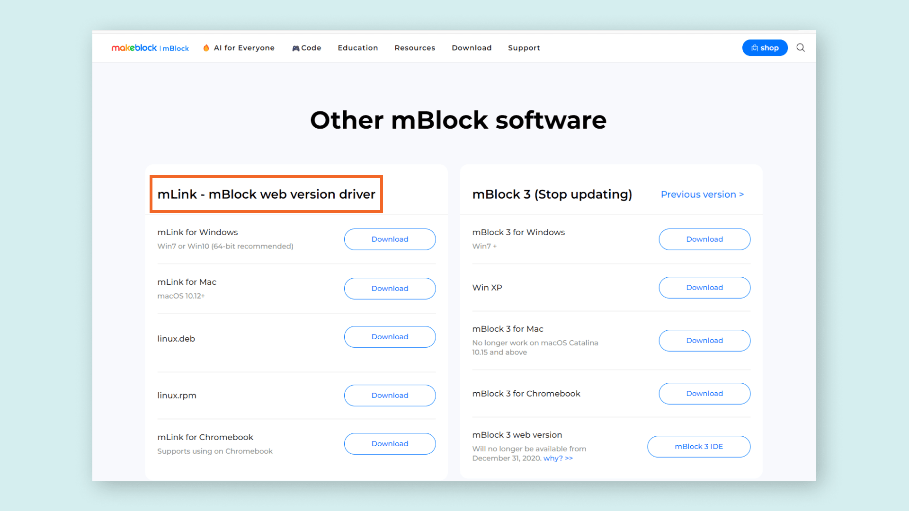

After downloading, install the **drivers**. This small software helps your computer communicate with the robot. When prompted, simply click "INSTALL."

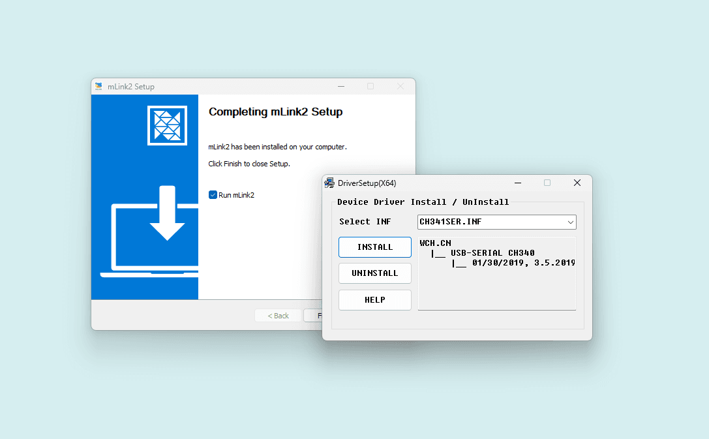

Once mLink is installed, open it and connect to <a href="https://ide.mblock.cc">**ide.mblock.cc**</a> using a web browser (Google Chrome is recommended). From now on, whenever you want to code Alvik, open the mLink application and go to the webpage mentioned above.

### Offline Coding

Please [download the software](https://mblock.cc/pages/downloads), then double-click the installer file and follow the instructions to complete the installation.

If you're using a *Windows* or *Mac* computer, scroll down the page and click the appropriate button. For *Chromebook* or *Linux* users, the process is slightly different.

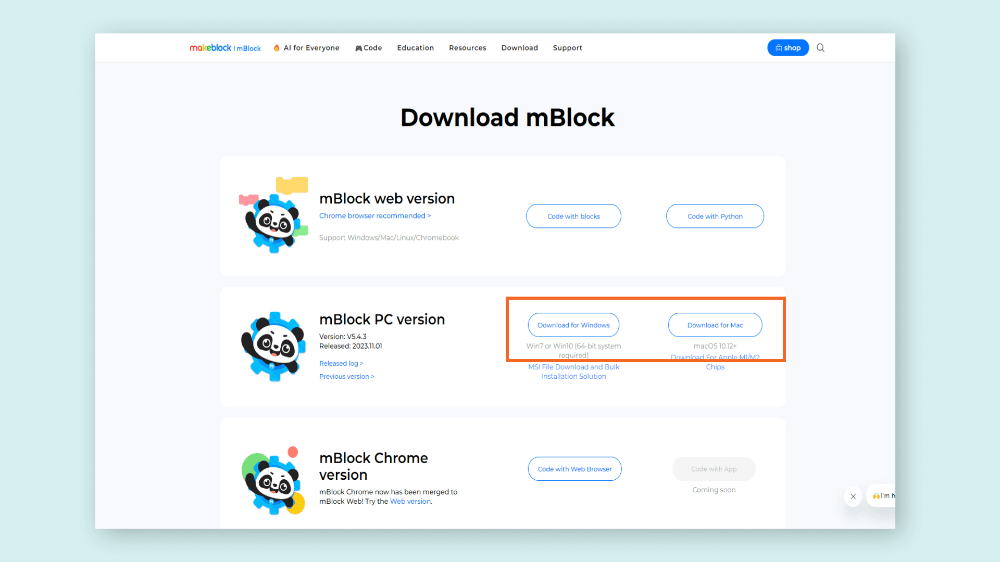

### Windows

To install mBlock on Windows:

1. Click the "Download for Windows" button, wait for the download to finish, and find the file in your Downloads folder.

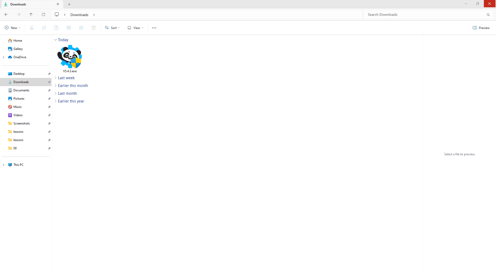

2. Double-click the downloaded file and click "YES" when prompted. Follow the on-screen instructions to complete the installation.

3. Install the **drivers** to allow your computer to communicate with the robot. A window will appear asking you to click "INSTALL."

Sometimes, the driver installation window may open in the background. Look for the computer icon in your application bar and click it to continue.

If you encounter an installation error, try clicking "UNINSTALL" and then "INSTALL" again. Once the driver installation is complete, close the driver window manually by clicking the "X" button. After installing the drivers, finish the mBlock installation.

Find mBlock on your computer (it has a Panda icon) and open it.

### MacOS

To install mBlock on macOS:

1. Click on the "Download for Mac" button on the [Download page](https://mblock.cc/pages/downloads), wait for the download to finish, and find the file in your Downloads folder.
2. Double-click the downloaded file to mount the `.dmg` file. Then, drag the Panda icon to the Applications folder.

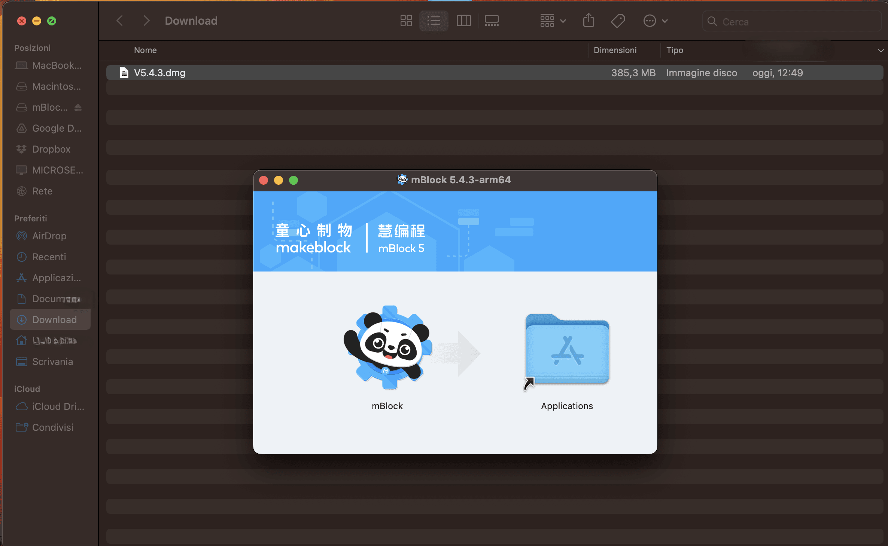

3. Open the Applications folder, locate the mBlock app, and open it. The first time you open the software, right-click (or Control-click) on the app and select "Open" from the dropdown menu.

### Chromebook or Linux

If you're using a **Chromebook** ([read the full guide here](https://support.makeblock.com/hc/en-us/articles/19412317319191-Device-Connection-Guide-for-Chromebook-Latest-Version)) or a **Linux** machine, the installation process is different because there is no installable version of the software available. Instead, you'll use the online version of mBlock, which requires a special driver to connect to the robot.

1. Scroll down to find the "mLink - mBlock web version driver" and download the appropriate file for your operating system.

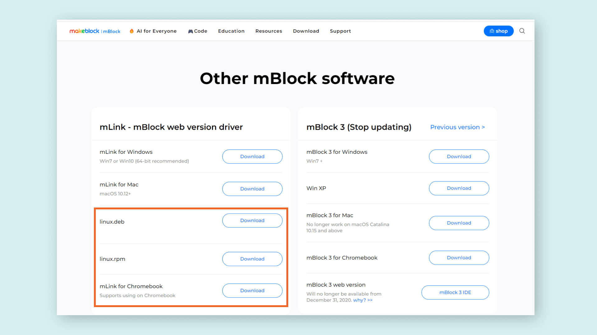

2. Go to your Downloads folder and install the driver. The installation steps may vary depending on your operating system.

## Update Firmware

## Connect the robot to mBlock

To program Alvik, start by opening the mBlock software if you haven’t already. Once the software is open, follow these steps to connect:

**1.** Locate the robot's **on/off switch** and slide it to the **OFF** position.

***To ensure a proper connection and protect the robot's battery, always turn off the robot before connecting it to your computer; it may not appear if left on***

**2.**  <a href="https://ide.mblock.cc">Open mBlock</a>. In the `Device` section, add Alvik as a programmable board by clicking the `+ Add` button, then selecting Alvik from the robot list.

**3.** **Connect the programming cable** to your computer and the Arduino Nano ESP32, the brain of the robot.

**4.** Locate the robot's **on/off switch** and slide it to the **ON** position.

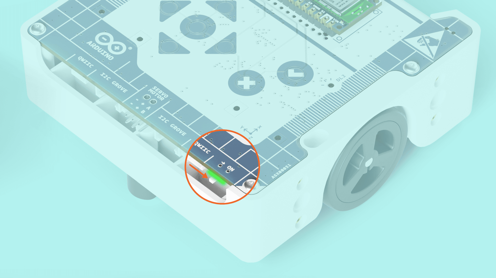

**5.** Establish the connection to **mBlock** clicking on the **Connect** button.

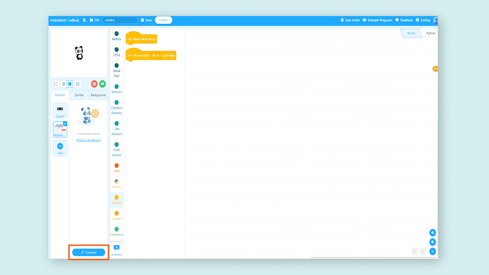

**6.** Click the **Connect** button in the pop-up window.

In the connect window, select the **Serial Port**, which is the interface the computer uses to communicate with the robot. On Windows, you might see something like COM4 (or another number), while on other operating systems, it could be something like `/dev/tty.[yourSerialPortName]`. mBlock typically detects the correct port automatically, but if you encounter any issues, make sure the selected port is the right one.

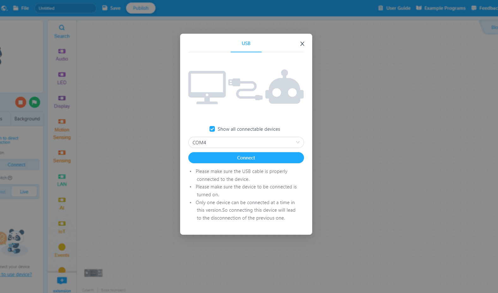

**7.** You are **ready** to work!

## Blocks 

Explore mBlock to start programming Alvik. You'll find a list of visual blocks in the center of the interface. Each block represents a command Alvik can execute, divided into **different colored folders by action kind**.

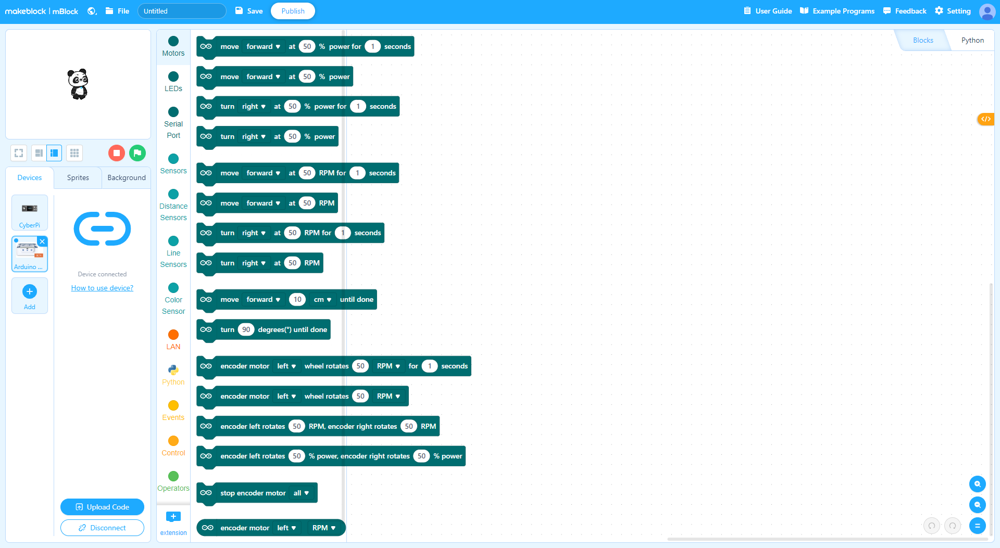When you're creating a sequence of commands for Alvik you **always need to start by stating the initial event**:
Find an `Event` command that starts when a button is pressed.

## Blink

Alvik comes with two built-in **RGB LEDs**, located on top of the robot.

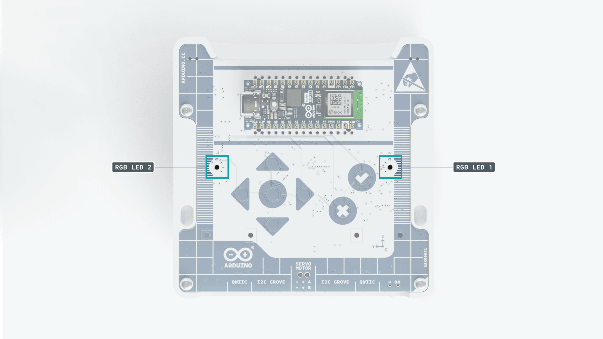

On the top of Alvik you can also find **8 buttons**, that let you operate the robot.

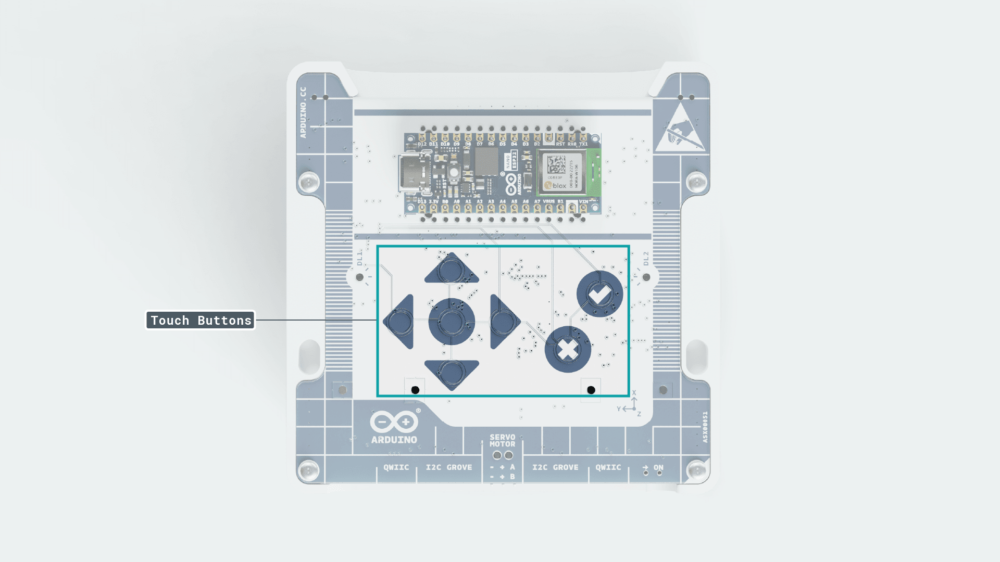

The goal of our first program is to make the LEDs flash when you press a button on Alvik:

1. Navigate to the `Events` folder and drag the command `When button [ok] is pressed` to the coding area on the right. 

2. Next, go to the `LEDs` folder and drag `set [left] LED color to [RED] for (1) seconds` into the coding area, connecting it to the previous command.

3. You need to upload the code to the robot. **Remember to turn ON the robot before uploading the code.** Transfer the program from the PC to the board by clicking the blue `Upload Code` button in the left side of the interface, and wait for the file transfer. You are now ready to test the code: let's press the `✔` button on the Alvik!

Now you’ve created your first program: Alvik will turn on the left LED for one second when the OK `✔` button is pressed.

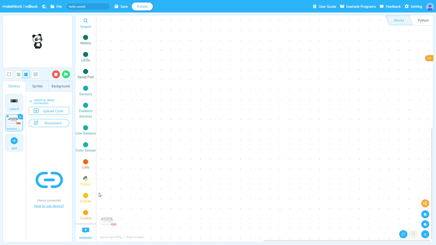 

Every parameter inside the white area (for example the number `1` or the `▼` element in the dropdown menu) may be edited, to give Alvik a different behavior. Let's try to edit the program to make the robot turn on *yellow* both LEDs, for *5 seconds*, when button `cancel` is pressed.

 

### Next Steps

*  If you want to learn more about how Alvik is built or which functions you can use to program it, visit the documentation in the [Docs space for Alvik](https://docs.arduino.cc/hardware/alvik/) and follow the respective [Alvik's User Manual](https://docs.arduino.cc/hardware/alvik/user-manual) to know more about how to build incredible projects with your robot!
* If you want to follow step-by-step guided projects following an educational approach to learn MicroPython and robotics topics with Alvik, follow the [Explore Robotics in MicroPython](https://courses.arduino.cc/explore-robotics-micropython/) course.
