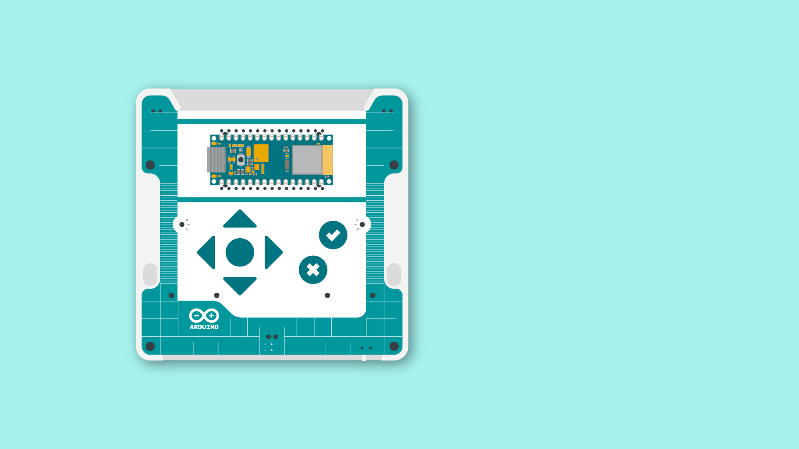

---

---

title: 'Getting Started with Alvik'
difficulty: beginner
description: 'This short guide helps you to get started with Alvik, you'll also find useful information to maintain your Alvik.'
tags:

	- Robot
author: 'Paolo Cavagnolo'

---


In this manual you'll find useful information to get started, test and maintain your Alvik. But before proceeding let's check to have all the essential tools, hardware and sotware.

## 1. Unboxing


Your Alvik robot is equipped with three ready to go examples, each one of the examples are color-coded. There's Red, Green, and Blue:

* **Red Program (Touch Mode):** Use the arrows to tell your robot what to do: up and down for moving forward and backward by 10 cm, and left and right for turning 90 degrees. The robot will collect instructions until you press the "tick" to make it happen.

* **Green Program (Hand Follower):** Your robot will keep a steady 10 cm distance from your hand or any object you put in front of it.

* **Blue Program (Line Follower):** Your robot will glide along a black line on a white surface.

  ***The recommended size for the "black line" is between 2-3cm wide***

Just turn your Alvik ON, wait until the LEDs turn blue and use the up and down buttons to pick one color, then hit the "tick" button to choose. It's that easy!



***The product is sensible to electrostatic discharge***

## 2. Getting to Know Alvik in Detail

Now that you have played with Alvik and you have seen it moving, tt is time to know more in depth how it is built and how to get much more than the out-of-the-box  experience from it.

### 2.1 Requirements

#### 2.1.1 Hardware Requirements

 - One Alvik, of course.
 - One USB-C® type cable, working and with data lines, not only power lines.
 - One screw driver, cross head
 - One computer

#### 2.1.2 Software Requirements

 - OS: all the major os are supported.
 - [Arduino Lab for Micropython](https://labs.arduino.cc/en/labs/micropython)

## 3. Alvik Overview


***When the PCB is out of the chassis and the battery is in place there is the risk of short-circuiting the 18650 Li-Ion battery. If you remove the HW from the chassis make sure you do it in a non conductive surface clean of materials or tools that can short-circuit the battery***

### 3.1 Main Components


#### 3.2.1 Nano ESP32
The [Nano ESP32](https://store.arduino.cc/products/nano-esp32) is the board used to control Alvik, it has a quick processor, large flash memory and Wi-Fi® enabled chip packed into a tiny circuit board.

***You can find out more about this board in the [Nano ESP32 documentation](/hardware/nano-esp32).***

Please note that when using MicroPython the pin number reflects the GPIO on the ESP32-S3, not the Nano board. Use the **green labeled number** in the following image. You can read more about this [here](https://docs.arduino.cc/micropython/micropython-course/course/introduction-python#nano-esp32--micropython-pinout).


#### 3.2.2 STM32

The main core of the robot is the STM32 ARM Cortex-M4 32 Bit, you can access it through a set of dedicated APIs from the Nano ESP32.

[Here](/tutorials/02.api-overview/api-overview.md) is the list of APIs.

The latest firmware of the STM32 can be found at [this link](https://github.com/arduino-libraries/Arduino_AlvikCarrier/releases), and [here](#how-to-upload-firmware) there is the guide to flash it.


#### 3.2.3 ON/OFF Switch

At the right side on the back side of the robot, there is the main switch of the robot. When ON the robot will power up and it will execute the "main.py" routine, if present; also with USB cable disconnected.


During operation the terminal of the Arduino Lab for MicroPython will notify you if you forgot to switch on the robot.


#### 3.2.4 Battery

The battery is a rechargeable Li-ion 18650. It is located in the bottom part of the Alvik, to access it you need to remove one screw and take out the plastic holder.


The Nano ESP32 can report the status of the battery through the terminal of the Arduino Lab for MicroPython and with its RGB status LED. To do that you need to call the `Alvik.begin()` function, in any program or you can also do it directly at the command line area.

When the battery is charging the status LED will blink RED for 1 second.


When fully charged it will stay GREEN.


***Don't confuse the RGB status LED with the power ON LED of the Nano ESP32, that is always green.***

#### 3.2.5 Inputs

Alvik has five inputs, all linked to the STM32 and accessible through the [APIs](/tutorials/cheat-sheet/cheat-sheet.md). For every input there is a test example program that you can find in the _examples_ folder in [this](https://github.com/arduino/arduino-alvik-mpy/tree/main/examples) repository.

| **Sensor name**              | **Part name** | **Test program name** |
|------------------------------|---------------|-----------------------|
| RGB Color detection          | APDS 9660     | read_color_sensor.py  |
| ToF 8x8 Array - up to 350 cm | LSM6DSOX      | read_tof.py           |
| IMU - 6 degree               | VL53L7CX      | read_imu.py           |
| 3x Line follower             | custom made   | line_follower.py      |
| 7x Touch sensor              | AT42QT2120    | read_touch.py         |

***Before using the ToF sensor check if it has a yellow protective film, if present, remove it from the sensor to ensure it works properly***

#### 3.2.6 Outputs

Alvik has 2 high precision geared motors and 2 RGB leds. The test programs are located in the same folder as for the [inputs](#2.2.5-inputs).

| **Actuator name**        | **Part name**           | **Test program name** |
|--------------------------|-------------------------|-----------------------|
| Geared motors w/ encoder | GM12-N20VA-08255-150-EN | wheels_positions.py   |
| RGB LEDs                 | RGB LEDs                | leds_settings.py      |

#### 3.2.7 Connectors

The connectors are placed in the back of the robot, the pinout is shown in the following image:


## 4. Coding Alvik


In order for Alvik to work properly three things has to be set correctly:

 1. the Nano ESP32 needs the [MicroPython firmware](https://labs.arduino.cc/en/labs/micropython) on it
 2. the [latest libraries](https://github.com/arduino/arduino-alvik-mpy/releases) have to be placed in the Nano ESP32
 3. the [latest firmware](https://github.com/arduino-libraries/Arduino_AlvikCarrier/releases) have to be uploaded to the STM32 microcontroller

Alvik comes with a preinstalled version of libraries and firmware, but in case you want to upgrade it or if something happened and you mess things up, heres is the guide to reinstall both libraries and firmware.

### 4.1 MicroPython Firmware on the Nano ESP32

Download and install the [Arduino Lab for Micropython](https://labs.arduino.cc/en/labs/micropython), if you are able to connect the Arduino Nano ESP32 it means that you're board is ready. You have to see the **CONNECTED** yellow label at the bottom.


If something goes wrong it means you need to upload the MicroPython firmware on the Nano ESP32.
Follow [this guide](https://docs.arduino.cc/micropython/basics/board-installation/).

### 4.2 How to Upload Libraries

You'll find the latest instructions directly in the [repository](https://github.com/arduino/arduino-alvik-mpy/releases). Here there are the main steps:

  1. Prepare file
      1. Download the repository and extract all the files in a specific folder that will became the main Alvik folder.


 2. Remove old files

     1. Open **Arduino Lab for MicroPython** and **connect** the Alvik. Then:

     - Click on the `files` icon

     - Click on a `files name` in the bottom left explorer windows.

     - Click on the `bin` icon to delete it

     - Repeat for all the files, from all folders


3. Install mpremote

[mpremote](https://docs.micropython.org/en/latest/reference/mpremote.html) is a python module needed to upload files on the Nano ESP32. The minimum suggested mpremote release is 1.22.0. Be sure to have Python installed before proceeding!

```
(venv)$ pip install mpremote
```

or

```
(venv)$ python3 -m pip install mpremote
```

Depending on how you configure python on your machine.

4. Install library

Run the following line to upload all files and download the dependencies needed to run the Arduino Alvik micropython library.

Linux
```
$ ./install.sh -p <device port>
```

Windows
```
> install.bat -p <device port>
```

The `install.*` script will copy all the needed files into your alvik.

The `<device port>` is the name of the USB port that your computer assigned to the Nano ESP32. There are several ways to find it, depending on your OS, for examples:

 - You can use the Arduino IDE 2.x,  [here](https://support.arduino.cc/hc/en-us/articles/4406856349970-Select-board-and-port-in-Arduino-IDE) a guide.
 - You can look it using the Arduino Lab for MicroPython by clicking `Connect` after have connected the Alvik with the USB cable.
 - You can look at the list of the USB devices attach to the PC

### 4.3 How to Upload Firmware

 1. Download the latest [pre-compiled firmware](https://github.com/arduino-libraries/Arduino_AlvikCarrier/releases/latest) and place it inside the Alvik project folder

 2. Go into `utilities` folder and run the `flash_firmware` script:


Linux
```
$ ./flash_firmware.sh -p <device port> <path-to-your-firmware>
```

Windows
```
> flash_firmware.bat -p <device port> <path-to-your-firmware>
```
Answer `y` to flash firmware.

### 4.4 Test

There are severals examples files to test all the features of your Alvik, placed inside the `examples` folder.

Open **Arduino Lab for MicroPython** and **connect** the Alvik. Then:

 - Click on the `files` icon
 - Click on the `path string` in the bottom right explorer windows.
 - Click on the `file name` of the example you choose
 - Click on the `play button`


## 5. Maintenance
### 5.1 Check Wheels Alignment

The motion calculations performed by Alvik are based on a precise position of both wheels. Periodically you can check this position and correct it if needed:

 - Place your Alvik on a side on a flat surface
 - Check that the exterior part of the wheel touch the flat surface, aligned with the plastic chassis
 - Repeat with the other side / wheel


### 5.2 Calibrate Color Sensors

To calibrate the color sensor, placed in the bottom PCB under the Nano ESP32, you'll need a white surface and a black surface.
You'll do it manually, so you can get familiar with the REPL terminal.

1. Open the Arduino Lab for MicroPython
2. Connect the Alvik
3. Open the REPL terminal (just click on the Terminal Icon on top)

Now you're ready to send command directly to the Alvik. Every time you'll click enter the command will be executed.

```bash
>>> from arduino_alvik import ArduinoAlvik

>>> alvik = ArduinoAlvik()

>>> alvik.begin()
```

Now place your robot on the white surface and type:

```bash
>>> alvik.color_calibration('white')
```

Now place your robot on the black surface and type:

```bash
>>> alvik.color_calibration('black')
```

Press reset on Lab for Micropython.

You can now test using read_color_sensor.py in examples folder. Refer to the [test chapter](#4.4-test) if you have any problem.

***colors are tested on paper painted using acrilic marker pens, such as UNIPOSCA, or paper printed with an inkjet printer***

## 6. Extensions

***When adding extension in the side, never use screws longer then 15mm, overall never use objects longer then 15mm in the holes because the device can be damaged***

### 6.1 Add Lego Addons

On both sides of the Alvik there are different housings that let you add:

 - 4x M3 screws per side
 - 2x LEGO Technic Connector per side.

The dimensions are:


As reference you can take a look at the following images:


### 6.2 Add Servo

The Servo connectors are placed at the back of the Alvik, in this tutorial we'll attach a servo motor to the port A. You can take a look at the pinout image at the [pinout chapter](#3.2.7-connectors).

***The port provides 5 Volt to the motor, so be sure to connect a servo that run with 5V.***

1. Connect the servo motor to the upper port


2. Open the Arduino Lab for MicroPython

3. Connect the Alvik with a USB cable and click CONNECT

4. Copy and paste the following test code

```arduino
from arduino_alvik import ArduinoAlvik

import time

alvik = ArduinoAlvik()

alvik.begin()

while True:
    alvik.set_servo_positions(0,0)
    time.sleep(2)
    alvik.set_servo_positions(90,0)
    time.sleep(2)
    alvik.set_servo_positions(180,0)
    time.sleep(2)
    alvik.set_servo_positions(90,0)
    time.sleep(2)
```

5. Click on the PLAY button to run the test code

6. The motor should move as in the gif below


If you want to understand how the command `alvik.set_servo_positions` works, you can have a look in the [API overview](/tutorials/02.api-overview/api-overview.md).


### 6.3 Add I2C Grove

The I2C Grove connectors are placed at the back of the Alvik, in this tutorial we'll see how to scan a generic I2C device connected to it. You can take a look at the pinout image at the [pinout chapter](#3.2.7-connectors).

1. Connect the I2C Groove device to one of the two ports.

2. Open the Arduino Lab for MicroPython

3. Connect the Alvik with a USB cable and click CONNECT

4. Turn ON the Alvik

4. Copy and paste the following test code

```arduino
from machine import I2C
from machine import Pin

i2c = I2C(0, scl=Pin(12, Pin.OUT), sda=Pin(11, Pin.OUT))

print()
print('Scan i2c bus...')
print()

devices = i2c.scan()

if len(devices) == 0:
    print("No i2c device !")
else:
    print('i2c devices found:',len(devices))
print()

for device in devices:  
    print("Decimal address: ",device," | Hexa address: ",hex(device))

print()
```

5. Click on the PLAY button to run the test code

6. Look at the terminal to see the list of the I2C devices

### 6.4 Add Qwiic

The Qwiic connectors are placed at the back of the Alvik, for this example we'll using the Qwiic OLED display from Sparkfun. You can take a look at the pinout image at the [pinout chapter](#3.2.7-connectors).


1. Connect the OLED display to one of the Qwiic connector, you can use either the left one or the right one.


2. We've prepared the example code and the libraries in [this](assets/qwiic_display.zip) zip file.

3. Extract the files and open the folder

4. Install mpremote

[mpremote](https://docs.micropython.org/en/latest/reference/mpremote.html) is a python module needed to upload files on the Nano ESP32. The minimum suggested mpremote release is 1.22.0. Be sure to have Python installed before proceeding!

```
(venv)$ pip install mpremote
```

or

```
(venv)$ python3 -m pip install mpremote
```

Depending on how you configure python on your machine.

5. Install library

Run the following line to upload all files and download the dependencies needed to run the Arduino Alvik micropython library.


Linux
```
$ ./install_oled_lib.sh -p <device port>
```
Windows
```
> install_oled_lib.bat -p <device port>
```

The `<device port>` is the name of the USB port that your computer assigned to the Nano ESP32. There are several ways to find it, depending on your OS, for examples:

 - You can use the Arduino IDE 2.x,  [here](https://support.arduino.cc/hc/en-us/articles/4406856349970-Select-board-and-port-in-Arduino-IDE) a guide.
 - You can look it using the Arduino Lab for MicroPython by clicking `Connect` after have connected the Alvik with the USB cable.
 - You can look at the list of the USB devices attach to the PC

6. Test `Hello World!`

Now you can open the Arduino Lab for Micropython, connect the Alvik, and open the example called `hello_world.py` in the `examples` folder. If everything works as expected you'll see something like this


7. Test `bender.py`

Open the example called `bender.py`, launch it and see if the outputs is like the image below:


