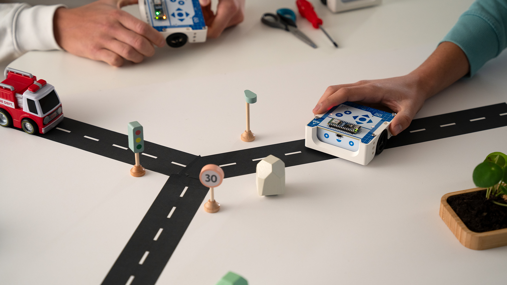
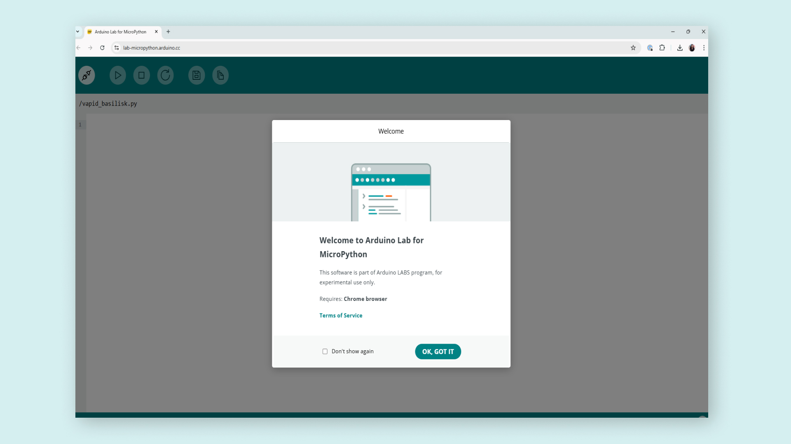
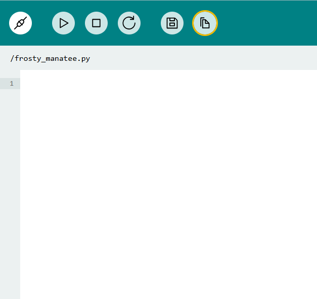
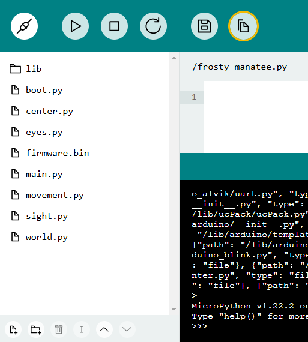
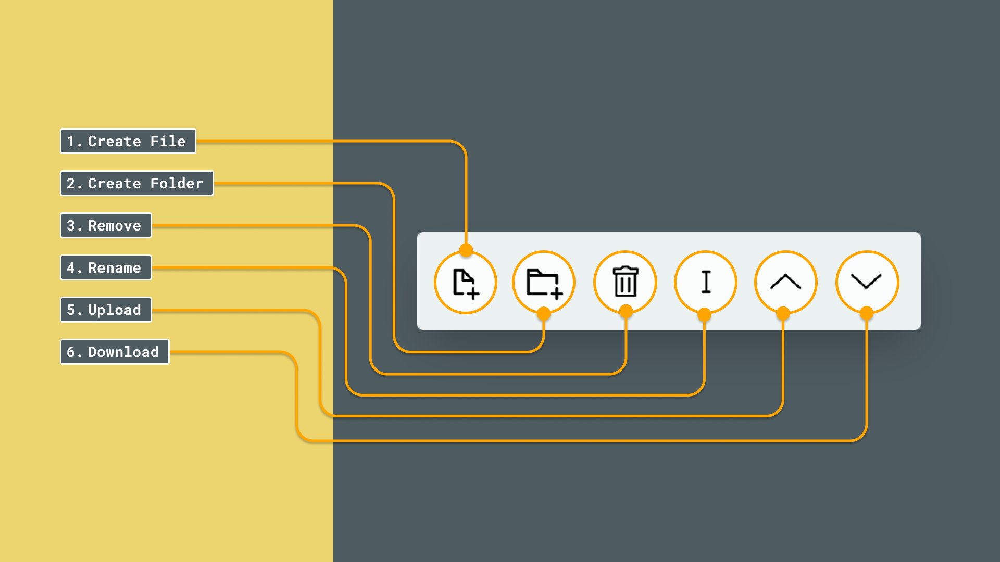

## Getting Started With Alvik

Arduino® Alvik is a powerful and versatile robot specifically designed for programming and STEAM education.


Powered by the Arduino® Nano ESP32, Alvik offers diverse learning paths through different programming languages including MicroPython, the Arduino language, and block-based coding; enabling different possibilities to explore Robotics, IoT and Artificial Intelligence.

## Check The State Of The Battery

Alvik's battery is protected by a pull-tab protective sticker. Remove the sticker to start working with the robot.


Once the firmware of your Alvik is up to date and before start playing with it, let's verify your battery works as it should by following these steps:

1. Make sure Alvik is OFF and disconnected it from the PC.
2. Open the battery compartment and check that the clips are making contact with the battery. If they aren’t, remove the battery, adjust the clips to ensure proper alignment, and then reinsert the battery securely.
3. Connect the Alvik to the PC keeping Alvik OFF.
4. At this point some lights should turn ON in your Alvik:

- **Green LED** (not confuse it with the PWR LED of the Nano ESP32) will turn ON in the ESP32
  
  The battery is fully charged. Proceed to "Unboxing Alvik" paragraph.

- **Red LED blinking**
  
  The battery is still charging from the PC. Continue to the Unboxing Alvik.

- **No lights** 
  
  The battery may be faulty. To check it, turn Alvik ON; if an orange light near the QWIIC connector blinks every 10 seconds, contact our customer support for a replacement. A user-uploaded sketch will not run unless Alvik has a charged battery. If the battery is low, the sketch will halt its execution at the initialization phase.

## Update The Firmware Of Your Alvik

Keeping your Alvik’s firmware updated ensures it has the latest features, bug fixes, and performance enhancements. Regular updates also help maintain compatibility with other software, providing optimal performance for your robot.


1. Visit https://alvikupdate.arduino.cc.
2. Connect Alvik to your computer.
3. Turn ON your Alvik.
4. Click the "Connect" button.
5. **A pop-up window will appear** prompting you to select the COM port. Choose the correct port and confirm.
6. Once connected, click the "Update" button and wait for the process to complete.

## Ready-To-Go Examples


Your Alvik robot is equipped with three ready-to-go examples. To choose one of the examples, just turn your Alvik ON, move the switch located at the bottom right corner of the robot to the right, wait until the LEDs turn blue and use the Up and Down buttons to pick one color, then hit the "tick" confirmation button. It's that easy!

- **Red Program (Touch Mode):** Use the arrows to tell your robot what to do: up and down for moving forward and backward by 10 cm, and left and right for turning 90 degrees in each of the directions. The robot will collect instructions until you press the "tick" confirmation button. Once you press it, the robot will execute all the actions in order.

- **Green Program (Hand Follower):** Your robot will keep a steady 10 cm distance from your hand or any object you put in front of it. Press the "tick" confirmation button again to make the robot start following your hand. You can stop the robot at any moment by pressing the "X" cancel button.

- **Blue Program (Line Follower):** Your robot will glide along a black line on a white surface. Press the "tick" confirmation button again to make the robot follow the line. You can stop the robot at any moment by pressing the "X" cancel button. **The recommended size for the "black line" to follow is between 2-3 cm wide.**

Now that you have played with Alvik and have seen it moving, it is time to know more in-depth how it is built and how to program Alvik to do amazing things.

### Let's Start Coding Alvik

Alvik is intended to be programmed with MicroPython. We recommend you to install the [Arduino Lab for MicroPython](https://labs.arduino.cc/en/labs/micropython) editor. Follow the instructions next to the download link to install it and open the IDE.

If you're using a **Chromebook**, there is no installable version of the software available. Instead, you'll use the [**online version**](https://lab-micropython.arduino.cc/) using Chrome. You'll need to login with an Arduino account to use it. 



Alternatively, on par with other Arduino products, you can also program your Alvik using Arduino IDE and C++. If this is the case you can find setup instructions over at [Setting up Alvik on Arduino IDE](https://docs.arduino.cc/tutorials/alvik/setting-alvik-arduino-ide/).

Now that all the previous steps have been set, let's see how to make Alvik moving across your room while avoiding objects! Let's create custom program for Alvik that:

 * Move forward until detecting an object in front of it
 * Dodge the object by turning on
 * Continue on its way by moving forwards again

***Alvik does not have its own parachute! Be careful avoid using Alvik on your table or it could fall over the edge!***

**1. **Create an Alvik folder in your computer and set it as the path of the Arduino Lab for MicroPython IDE.


**2. **Create a new file "obstacle_avoider.py" in your local folder.


**3. **Double-click on the file to open it. Once it is opened, erase the text on it and add the following code.


``` python
from arduino_alvik import ArduinoAlvik
from time import sleep_ms

alvik = ArduinoAlvik()
alvik.begin()
distance = 15
degrees = 45.00
speed = 10.00

while (True):

    distance_l, distance_cl, distance_c, distance_r, distance_cr  = alvik.get_distance()
    print(distance_c)

    if distance_c < distance:
        alvik.rotate(degrees, 'deg')
    elif distance_cl < distance:
        alvik.rotate(degrees, 'deg')
    elif distance_cr < distance:
        alvik.rotate(degrees, 'deg')
    elif distance_l < distance:
        alvik.rotate(degrees, 'deg')
    elif distance_r < distance:
        alvik.rotate(degrees, 'deg')
    else:
        alvik.drive(speed, 0.0, linear_unit='cm/s')

    sleep_ms(100)
```

**4. **Connect Alvik to your PC using the cable included in the box, under the tray.


***As a good practice, to prevent the Alvik from falling off the table, turn it OFF when you are programming it.***

***For Alvik to be recognized by your computer, it must be turned OFF.***

**5. **Once Alvik is connected to the PC, connect it to the Arduino Lab for MicroPython and open the _main.py_ file in the Alvik folder. Once the file is opened let's replace the `import demo` statement with `import obstacle_avoider`.


***If you want to go back to the out of the box experience where you could select between red, green and blue programs, you only need to modify the _main.py_ again replacing the `import obstacle_avoider` statement by `import demo`.***

**6. **The last step is to move the _obstacle_avoider.py_ file from the local repository to Alvik's memory.


You are now all set, disconnect Alvik from the computer, put some obstacles around Alvik, turn it ON, and see how Alvik navigates around your room avoiding them.

#### Let's Start Coding Alvik (Online IDE)

Note that some features might look different if you are using the Online IDE. Fear not, all code and files are interpreted the same independently of the IDE you choose. However, the UI of the Online IDE displays files differently.

You can open the file manager using the button:  


The files will then be displayed in a sidebar, also in a different arrangement. In the online IDE, files can be viewed in a sidebar:  


A few options are available at the bottom. These are: `create a new file`, `create a new folder`, `delete a file`, `rename`, `upload` and `download`:  


### Next Steps

* There is a set of already built examples that will help you to better understand how Alvik works, you can download them from [this link](https://github.com/arduino/arduino-alvik-mpy/releases), unzip them in your already created _alvik_ folder and you will be able to see them straight away in the Arduino Labs for MicroPython.
*  If you want to learn more about how Alvik is built or which functions you can use to program it, visit the documentation in the [Docs space for Alvik](https://docs.arduino.cc/hardware/alvik/) and follow the respective [Alvik's User Manual](https://docs.arduino.cc/tutorials/alvik/user-manual/) to know more about how to build incredible projects with your robot!
* If you want to follow step-by-step guided projects following an educational approach to learn MicroPython and robotics topics with Alvik, follow the [Explore Robotics in MicroPython](https://courses.arduino.cc/explore-robotics-micropython/) course.
