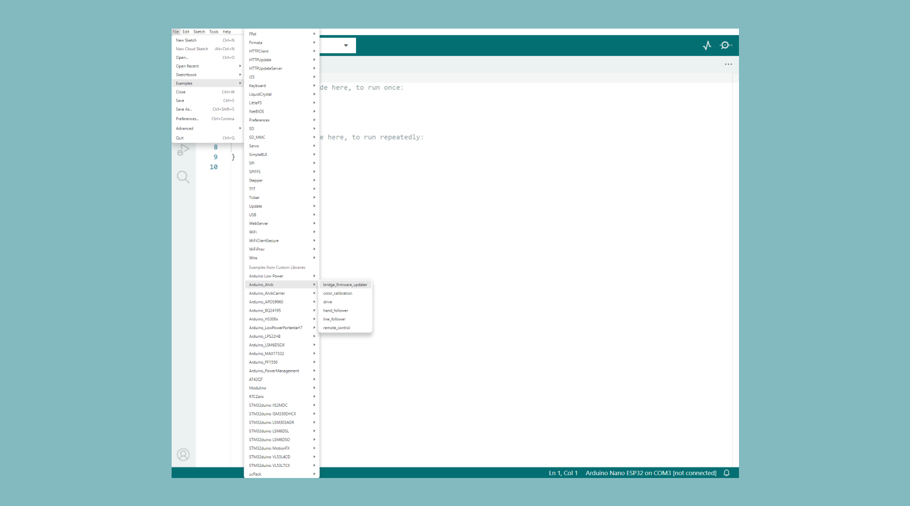

The Arduino® Alvik robot was designed to be compatible with both C++ and MicroPython. To ensure a smooth experience, functions have the same structure and parameters across all environments. This means the [Alvik's API reference](https://docs.arduino.cc/tutorials/alvik/api-overview/) can be used as a resource regardless of which environment you choose. In this guide, we will prepare the board to be programmed using the Arduino IDE.

## Requirements

### Software

- **Arduino IDE**: A modern desktop-based [Arduino IDE](https://support.arduino.cc/hc/en-us/articles/360019833020-Download-and-install-Arduino-IDE).
- **Alvik Library for Arduino**: A [library](https://github.com/arduino-libraries/Arduino_Alvik) that provides easy access to the Alvik robot's functionalities.
- **USB Drivers**: Ensure you have the correct drivers installed to communicate with Alvik via USB.
- **STM32Cube**: You will need this 3rd party programmer tool by ST available [here](https://www.st.com/en/development-tools/stm32cubeprog.html) to program the STM board.

### Hardware

- **Alvik Robot**: The main platform you'll be programming.
- **USB Cable**: Used to connect Alvik to your computer for programming and power.
- **Computer**: Running Windows, macOS, or Linux with a USB port.

## Setup

### Arduino IDE

1. Install the Arduino IDE from the [official Arduino website](https://www.arduino.cc/en/software).
2. Open the Arduino IDE.
3. Go to **Sketch > Include Library > Manage Libraries**.
4. In the Library Manager, search for "Alvik" and install the latest version of the Alvik library.

### Firmware Preparation

#### Preparing Alvik for Arduino IDE

1. Connect pin **B1** to **GND** on the Alvik board.

3. While both pins are connected plug the Alvik board to your computer using the USB cable.
5. Select **esptool** as the programmer from the **Tools > Programmer** menu.

6. Select **Upload Using Programmer** from the **Sketch** menu.
. You can nowpPress the **Reset** button on the board to make sure it is ready for uploading.
1. Open the **Bridge** example in the Arduino IDE by going to **File > Examples > 01.Basics > Blink**.

1. Open **STM32 Cube Programmer**
2.  Set the connection to **UART** mode, the **Port** to whatever port the board is connected to and **DTR** to HIGH. You can now press **Connect**.

3.  Go to **Erasing & Programming** mode and edit the **File path** to the firmware (this will be a .bin file) you are trying to program. You can find the latest release [here](https://github.com/arduino-libraries/Arduino_Alvik/releases/tag/1.0.1). You can now press **Start Programming**.


1.  After the firmware is programmed your board should now be ready!


You can at any point revert back to the MicroPython programming eviroment by following the content available over at the [MicroPython installation guide](https://docs.arduino.cc/micropython/micropython-course/course/installation/).

## Programming Alvik

Let's confirm our firmware is correctly installed. For this we will create a simple sketch that prints the firmware version using the ```get_version()``` function:

```c++
#include "Arduino_Alvik.h"

Arduino_Alvik alvik;

void setup() {
  alvik.begin();
  Serial.begin(115200);
}

void loop() {

  uint8_t u,m,l;

  alvik.get_version(u,m,l); // Gets the firmware version
  Serial.printf("%d.%d.%d\n", u, m, l);
  alvik.drive(10, 45);
  delay(1000); // Waits a second
  alvik.drive(10, -45);
  delay(1000); // Waits a second

}
```

After upload the Alvik should rotate the wheels and print the version once per second.

You can now explore the other included examples that cover more of the Alvik's components.


## More Resources (C++)

- **Alvik Documentation**: Dive deeper into the capabilities of Alvik by exploring the official documentation.
- **Community Forums**: Join the Arduino community forums to ask questions and share your projects.
- **Tutorials and Projects**: Look for tutorials and project ideas that can inspire your next steps with Alvik.
