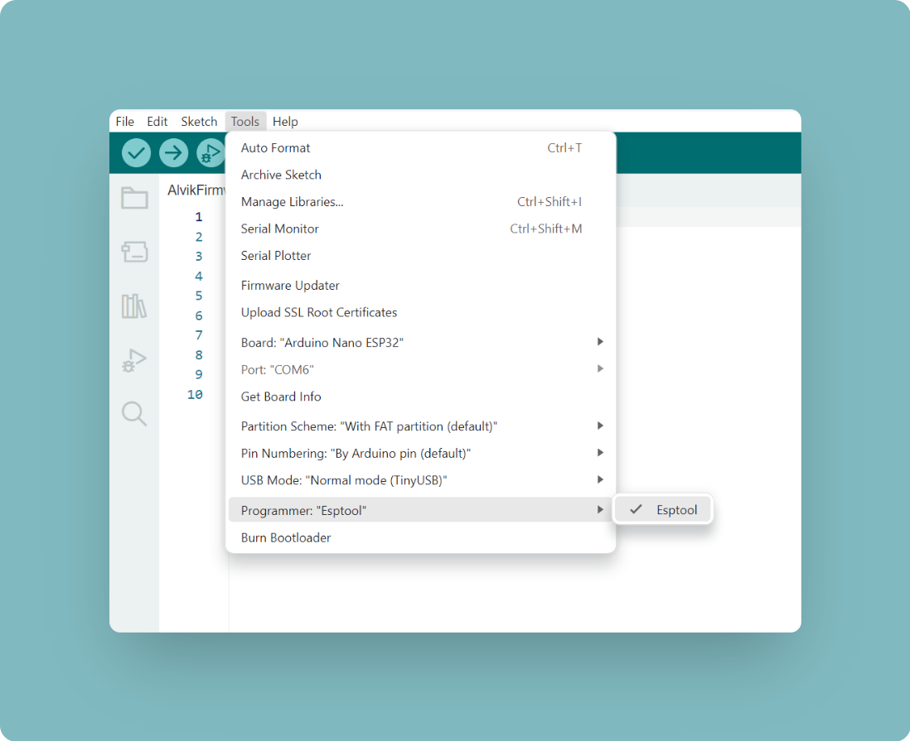
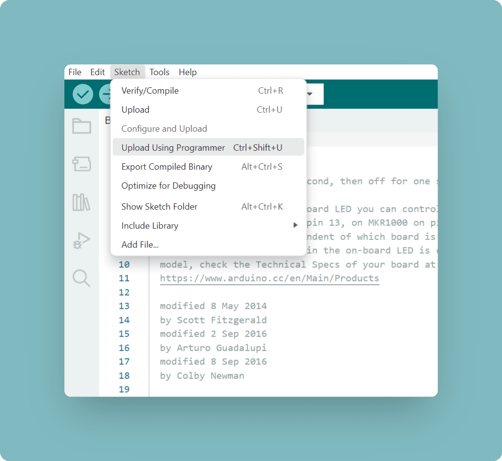
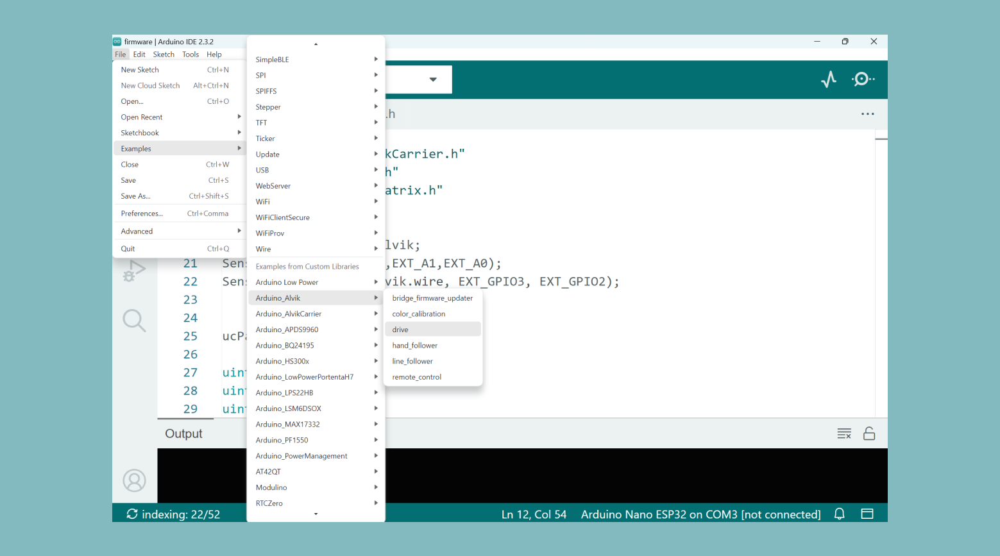

The Arduino® Alvik robot was designed to be compatible with both C++ and MicroPython. To ensure a smooth experience, functions have the same structure and parameters across all environments. This means the [Alvik's API reference](https://docs.arduino.cc/tutorials/alvik/api-overview/) can be used as a resource regardless of which environment you choose. In this guide, we will prepare the board to be programmed using the Arduino IDE.

## Requirements

### Software

- **Arduino IDE**: A modern desktop-based [Arduino IDE](https://support.arduino.cc/hc/en-us/articles/360019833020-Download-and-install-Arduino-IDE).
- **Alvik Library for Arduino**: A [library](https://github.com/arduino-libraries/Arduino_Alvik) that provides easy access to the Alvik robot's functionalities.
- **USB Drivers**: Ensure you have the correct drivers installed to communicate with Alvik via USB.

### Hardware

- **Alvik Robot**: The main platform you'll be programming.
- **USB Cable**: Used to connect Alvik to your computer for programming and power.
- **Computer**: Running Windows, macOS, or Linux with a USB port.

## Setup

### Arduino IDE

1. Install the Arduino IDE from the [official Arduino website](https://www.arduino.cc/en/software).
2. Open the Arduino IDE.
3. Go to **Sketch > Include Library > Manage Libraries**.
4. In the Library Manager, search for "Alvik" and install the latest version of the Alvik library.

### Firmware Preparation

#### Preparing Alvik For Arduino IDE

1. Connect pin **B1** to **GND** on the Alvik board.

3. While both pins are connected plug the Alvik board to your computer using the USB cable.
5. Select **esptool** as the programmer from the **Tools > Programmer** menu.

6. Select **Upload Using Programmer** from the **Sketch** menu.
. You can now Press the **Reset** button on the board to make sure it is ready for uploading.
1. Now we can finally test it. Open the **Drive** example in the Arduino IDE by going to **File > Examples > Arduino_Alvik > drive**.


The Alvik should now start their motor. If no movement occurs make sure that:
- Alvik is **ON**
- Firmware is updated (more information available in the [User Manual](https://docs.arduino.cc/tutorials/alvik/user-manual/)).


You can at any point revert back to the MicroPython programming environment by following the content available over at the [MicroPython installation guide](https://docs.arduino.cc/micropython/micropython-course/course/installation/).

## Programming Alvik

Now that your Alvik is correctly setup, lets go over some simple sketch uploads. If this is your first time with the Arduino IDE read how to [upload sketches here](https://support.arduino.cc/hc/en-us/articles/4733418441116-Upload-a-sketch-in-Arduino-IDE).

### Libraries

There are two libraries available in the library manager for use with Alvik:

- **Arduino_Alvik**: This is the primary library we will use in our sketches, and it contains high-level commands for controlling the "brain" of the Alvik, which is the Nano ESP32 board. You can find more information and download it from [here](https://www.arduino.cc/reference/en/libraries/arduino_alvik/).

- **Arduino_AlvikCarrier**: This library is designed for the STM board on the device and it is useful in situations where more fine control is required over commands. It allows more complex developments, especially when deeper integration with the hardware is needed. More information and the download link can be found [here](https://www.arduino.cc/reference/en/libraries/arduino_alvikcarrier/).

### Print Firmware Version

A simple but useful program if you are new to the Alvik is to understand how to get information from the onboard STM board. In this case, we are creating a simple sketch that prints the firmware version using the `get_version()` function.

```c++
#include "Arduino_Alvik.h"
```

Including the `Arduino_Alvik` library is essensial. The library contains all the needed predefined functions and classes that simplify the process of controlling the robot's hardware, such as motors and sensors. Without this include statement, the compiler wouldn't recognize the `Arduino_Alvik` class or its associated methods.

```c++
Arduino_Alvik alvik;
```

When using the Alvik livrary we declare an object of the `Arduino_Alvik` class named `alvik` in this case. All interactions with the robot will go through this `alvik` object. As with our `alvik.drive()` command.

```c++
void setup() {
  alvik.begin();
  Serial.begin(115200);
}
```

In the `setup()` function, the `alvik.begin()` method initializes the Alvik robot. This will be a necessity on all sketches for the Alvik.

```c++
void loop() {

  uint8_t u,m,l;

  alvik.get_version(u,m,l); // Gets the firmware version
  Serial.printf("%d.%d.%d\n", u, m, l);
  alvik.drive(10, 45);
  delay(1000); // Waits a second
  alvik.drive(10, -45);
  delay(1000); // Waits a second

}
```

This code continuously retrieves and prints the firmware version thanks to the ```get_version()``` every second while making the Alvik robot's wheels rotate back and forth using the ```drive()``` command.


**Complete code:**

```c++
#include "Arduino_Alvik.h"

Arduino_Alvik alvik;

void setup() {
  alvik.begin();
  Serial.begin(115200);
}

void loop() {

  uint8_t u,m,l;

  alvik.get_version(u,m,l); // Gets the firmware version
  Serial.printf("%d.%d.%d\n", u, m, l);
  alvik.drive(10, 45);
  delay(1000); // Waits a second
  alvik.drive(10, -45);
  delay(1000); // Waits a second

}
```

### Obstacle Avoider Example In C++

A more complex example can be found in the [getting started](https://docs.arduino.cc/tutorials/alvik/getting-started/) guide for the Alvik.
Due to the functions having same structure and names on both MicroPython and C++ we can easily port the ```obstacle-avoider``` to C++.

Keeping in mind the initialization of the Alvik from the previous example, we can build the example on the Arduino IDE:

```c++
#include "Arduino_Alvik.h"

Arduino_Alvik alvik;

void setup() {
  alvik.begin();
  delay(5000);  // Waiting for the robot to setup
}

void loop() {
  float distance = 12.0;
  float degrees = 45.0;
  float speed = 10.0;

  float distance_l, distance_cl, distance_c, distance_r, distance_cr;
  
  alvik.get_distance(distance_l, distance_cl, distance_c, distance_r, distance_cr);
  delay(50);
  
  Serial.println(distance_c);

  if (distance_c < distance || distance_cl < distance || distance_cr < distance || distance_l < distance || distance_r < distance) {
    alvik.rotate(degrees);
  } else {
    alvik.drive(speed, 0.0);
  }
}

```

You can now explore the other included examples that cover more of the Alvik's components and more functions listed on our [API reference](https://docs.arduino.cc/tutorials/alvik/api-overview/).


## More Resources

- **[Alvik Documentation](https://docs.arduino.cc/hardware/alvik/)**: Dive deeper into the capabilities of Alvik by exploring the official documentation.
- **[Community Forums](https://forum.arduino.cc/search?q=alvik)**: Join the Arduino community forums to ask questions and share your projects.
- **[Tutorials and Projects](https://courses.arduino.cc/explore-robotics-micropython/)**: Look for tutorials and project ideas that can inspire your next steps with Alvik.
