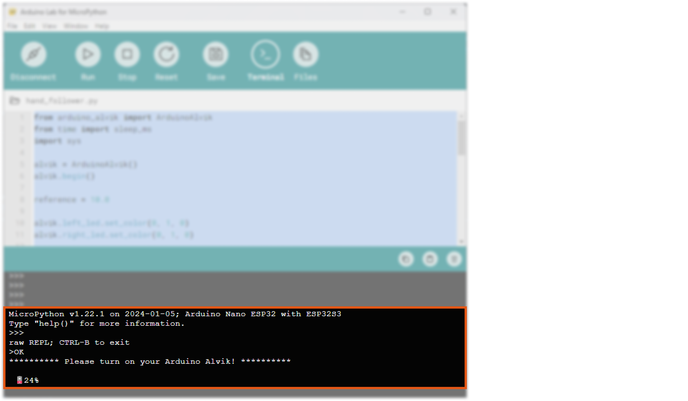

# Arduino® Alvik User Manual

## Introduction
Arduino® Alvik is a powerful and versatile robot specifically designed for programming and STEAM education.


Powered by the Arduino® Nano ESP32, Alvik offers diverse learning paths through different programming languages including MicroPython, Arduino C, and block-based coding; enabling different possibilities to explore Robotics, IoT, and Artificial Intelligence.

In this tutorial, you will find useful information to get started, test, and maintain Alvik.

## On This Page

- [Arduino® Alvik User Manual](#arduino-alvik-user-manual)
  - [Introduction](#introduction)
  - [On This Page](#on-this-page)
  - [Move Your Robot!](#move-your-robot)
    - [Hardware Requirements](#hardware-requirements)
    - [Software Requirements](#software-requirements)
  - [What is Alvik](#what-is-alvik)
  - [The Brain](#the-brain)
    - [Nano ESP32](#nano-esp32)
  - [The Body](#the-body)
    - [STM32](#stm32)
  - [Controller](#controller)
    - [ON/OFF Switch](#onoff-switch)
    - [Battery](#battery)
  - [Sensors](#sensors)
    - [Main Components](#main-components)
    - [Touch Buttons](#touch-buttons)
    - [Distance Sensors](#distance-sensors)
    - [Line Follower Sensor](#line-follower-sensor)
    - [Color Sensor](#color-sensor)
    - [IMU](#imu)
  - [Actuators](#actuators)
    - [Motors and Encoders](#motors-and-encoders)
  - [What the Robot Includes](#what-the-robot-includes)
  - [Move Alvik! (extended)](#move-alvik-extended)
    - [Basic Touch Programming](#basic-touch-programming)
    - [Following Objects](#following-objects)
    - [Line Follower](#line-follower)
  - [Alvik First Use](#alvik-first-use)
    - [Unboxing](#unboxing)
    - [Hardware Requirements](#hardware-requirements-1)
    - [Software Requirements](#software-requirements-1)
  - [Update Alvik's Body](#update-alviks-body)
  - [Update Alvik's Brain](#update-alviks-brain)
    - [Update ESP32 MicroPython Firmware](#update-esp32-micropython-firmware)
    - [Update Alvik's Library](#update-alviks-library)
    - [How to Upload Firmware](#how-to-upload-firmware)
  - [Hello Alvik! Upload Your First Program](#hello-alvik-upload-your-first-program)
  - [Program Alvik!](#program-alvik)
    - [Controlling the Motors](#controlling-the-motors)
      - [High level, fix power x amount of time or distance](#high-level-fix-power-x-amount-of-time-or-distance)
      - [Distance, angle, etc](#distance-angle-etc)
      - [Controlling power and time in degrees/s cm/s](#controlling-power-and-time-in-degreess-cms)
    - [Encoder’s Control](#encoders-control)
    - [Reading Buttons](#reading-buttons)
    - [Detecting Obstacles](#detecting-obstacles)
    - [Following a Line](#following-a-line)
    - [Sensing Colors](#sensing-colors)
    - [Detecting Falling and Crashes (IMU)](#detecting-falling-and-crashes-imu)
    - [Add Qwiic](#add-qwiic)
  - [Want More?](#want-more)
  - [Need Help](#need-help)

## Move Your Robot!

To get started to play with Alvik you will need the following hardware and software:

### Hardware Requirements

- Alvik (x1)
- USB-C® to USB-C® cable (x1)
- Phillips Screwdriver (cross head) (x1)
- Computer (x1)

***Make sure the USB-C® cable you are using works with data lines, not only power lines***

### Software Requirements

- Operating Systems: All the major Operating Systems are supported
- [Arduino Lab for Micropython](https://labs.arduino.cc/en/labs/micropython)

## What is Alvik

Arduino® Alvik is a robot with two controllers and numerous useful sensors and actuators. It is designed for STEAM education, making it an ideal tool for learning programming, Robotics, IoT, and Artificial Intelligence.

## The Brain

### Nano ESP32

The [Nano ESP32](https://store.arduino.cc/products/nano-esp32) is the board used to control Alvik. It has a fast processor, large flash memory, and a Wi-Fi® enabled chip packed into a tiny circuit board.

***You can find out more about this board in the [Nano ESP32 documentation](https://docs.arduino.cc/hardware/nano-esp32).***

Please note that when using MicroPython the pin number reflects the GPIO on the ESP32-S3, not the Nano board. Use the **green labeled number** in the following image. You can read more about this [here](https://docs.arduino.cc/micropython/micropython-course/course/introduction-python#nano-esp32--micropython-pinout).


## The Body

### STM32

The main core of the robot is the STM32 ARM Cortex-M4 32 Bit controller. It handles the low-level commands such as reading sensors and moving motors. You can access it through a set of dedicated APIs from the Nano ESP32.

You can learn more about the available functions for Alvik in the following [Alvik's API Documentation](https://docs.arduino.cc/tutorials/alvik/api-overview).

The latest firmware of the STM32 can be found at [this link](https://github.com/arduino-libraries/Arduino_AlvikCarrier/releases), and [here](#how-to-upload-firmware) is the guide to flash it.

## Controller

### ON/OFF Switch


At the back-right side of Alvik there is the main switch of the robot. When ON the robot will power up and it will execute the already loaded program.

***Keep the robot off while programming to avoid undesired movements and remember to turn it on when you are ready to execute your program. A feature of the Arduino Lab for MicroPython terminal is that it will notify you if you forgot to switch on the robot to run the code.***



### Battery

The battery is a rechargeable Li-ion 18650. It is located in the bottom part of Alvik, to access it you need to remove one Phillip's screw and take out the plastic holder.


The Nano ESP32 can report the status of the battery through the terminal of the Arduino Lab for MicroPython and with its RGB status LED. To do that you need to call the `Alvik.begin()` function in any program or directly at the command line area.

When the battery is charging the status LED will blink RED for one second.


When fully charged it will stay GREEN.


***Don't confuse the RGB status LED with the power ON LED of the Nano ESP32, which is always green.***

## Sensors

### Main Components

Alvik has five different sensors, all connected to the STM32 and accessible through the [APIs](https://docs.arduino.cc/tutorials/alvik/api-overview). For each sensor there is a test example program that you can find in the _examples_ folder in [this repository](https://github.com/arduino/arduino-alvik-mpy/tree/main/examples).

| **Sensor name**              | **Part name** | **Test program name** |
|------------------------------|---------------|-----------------------|
| RGB Color detection          | APDS 9660     | read_color_sensor.py  |
| ToF 8x8 Array - up to 350 cm | LSM6DSOX      | read_tof.py           |
| IMU - 6 degree               | VL53L7CX      | read_imu.py           |
| 3x Line follower             | custom made   | line_follower.py      |
| 7x Touch sensor              | AT42QT2120    | read_touch.py         |

***Before using the ToF sensor check if it has a yellow protective film, if present, remove it from the sensor to ensure it works properly***

### Touch Buttons

TODO: Content for this section

### Distance Sensors

TODO: Content for this section

### Line Follower Sensor

TODO: Content for this section

### Color Sensor

TODO: Content for this section

### IMU

TODO: Content for this section

## Actuators

### Motors and Encoders

Alvik has two high-precision geared motors and two RGB LEDs. The test programs are located in the same folder as the [sensor examples](#sensors).

| **Actuator name**        | **Part name**           | **Test program name** |
|--------------------------|-------------------------|-----------------------|
| Geared motors w/ encoder | GM12-N20VA-08255-150-EN | wheels_positions.py   |
| RGB LEDs                 | RGB LEDs                | leds_settings.py      |

## What the Robot Includes

TODO: Content for this section

## Move Alvik! (extended)

### Basic Touch Programming

TODO: Content for this section

### Following Objects

TODO: Content for this section

### Line Follower

TODO: Content for this section

## Alvik First Use

### Unboxing


To get started to play with Alvik you will need the following hardware and software:

### Hardware Requirements

- Alvik (x1)
- USB-C® to USB-C® cable (x1)
- Phillips Screwdriver (cross head) (x1)
- Computer (x1)

***Make sure the USB-C® cable you are using works with data lines, not only power lines***

### Software Requirements

- Operating Systems: All the major Operating Systems are supported
- [Arduino Lab for Micropython](https://labs.arduino.cc/en/labs/micropython)

## Update Alvik's Body

TODO: Content for this section

## Update Alvik's Brain

### Update ESP32 MicroPython Firmware

Download and install the [Arduino Lab for MicroPython](https://labs.arduino.cc/en/labs/micropython), if you are able to connect the Arduino Nano ESP32 it means that your board is ready. You have to see the **CONNECTED** yellow label at the bottom.


If something goes wrong it means you need to upload the MicroPython firmware on the Nano ESP32.

Follow [this guide](https://docs.arduino.cc/micropython/basics/board-installation/).

### Update Alvik's Library

You will find the latest instructions directly in the [repository](https://github.com/arduino/arduino-alvik-mpy/releases). Here are the main steps:

1. Prepare file

Download the repository and extract all the files in a specific folder that will become the main Alvik folder.

2. Remove old files

Open **Arduino Lab for MicroPython** and **connect** Alvik. Then:

- Click on the `files` icon

- Click on a `files name` in the bottom left explorer windows.

- Click on the `bin` icon to delete it

- Repeat for all the files, from all folders


3. Install mpremote

[mpremote](https://docs.micropython.org/en/latest/reference/mpremote.html) is a Python module needed to upload files on the Nano ESP32. The minimum suggested mpremote release is 1.22.0. Be sure to have Python installed before proceeding!

`venv)$ pip install mpremote`

or

`(venv)$ python3 -m pip install mpremote`

Depending on how you configure Python on your machine.

4. Install library

Run the following line to upload all files and download the dependencies needed to run the Arduino Alvik MicroPython library.

Linux

`$ ./install.sh -p <device port>`

Windows

`install.bat -p <device port>`


The `install.*` script will copy all the needed files into your Alvik.

The `<device port>` is the name of the USB port that your computer assigned to the Nano ESP32. There are several ways to find it, depending on your OS, for example:

- You can use the Arduino IDE to discover the port, [follow this guide to know more](https://support.arduino.cc/hc/en-us/articles/4406856349970-Select-board-and-port-in-Arduino-IDE).
- You can check it by using the Arduino Lab for MicroPython by clicking `Connect` after connecting Alvik with the USB cable.
- You can check the list of the USB devices attached to your PC.

### How to Upload Firmware

1. Download the latest [pre-compiled firmware](https://github.com/arduino-libraries/Arduino_AlvikCarrier/releases/latest) and place it inside Alvik's project folder.

2. Go into `utilities` folder and run the `flash_firmware` script:

Linux

`$ ./flash_firmware.sh -p <device port> <path-to-your-firmware>`


Windows

`flash_firmware.bat -p <device port> <path-to-your-firmware>`


Answer `y` to flash firmware.

## Hello Alvik! Upload Your First Program

TODO: Content for this section

## Program Alvik!

### Controlling the Motors

#### High level, fix power x amount of time or distance

TODO: Content for this section

#### Distance, angle, etc

TODO: Content for this section

#### Controlling power and time in degrees/s cm/s

TODO: Content for this section

### Encoder’s Control

TODO: Content for this section

### Reading Buttons

TODO: Content for this section

### Detecting Obstacles

TODO: Content for this section

### Following a Line

TODO: Content for this section

### Sensing Colors

TODO: Content for this section

### Detecting Falling and Crashes (IMU)

TODO: Content for this section

The `get_imu` function from the [Alvik API](https://docs.arduino.cc/tutorials/alvik/api-overview/#get_imu) returns all the IMU's readouts. The readouts include acceleration (ax, ay, az) and angular acceleration (gx, gy, gz) on the x, y, and z axes.

Here's an example of how to use this function to detect falling and crashes:

```python
from arduino_alvik import ArduinoAlvik
import time

# Initialize the Alvik robot
alvik = ArduinoAlvik()
alvik.begin()

# Function to detect falling and crashes
def detect_fall_or_crash():
    imu_readings = alvik.get_imu()
    
    ax = imu_readings['ax']
    ay = imu_readings['ay']
    az = imu_readings['az']
    gx = imu_readings['gx']
    gy = imu_readings['gy']
    gz = imu_readings['gz']
    
    # Thresholds for detecting a fall or crash (example values)
    acceleration_threshold = 2.5
    angular_acceleration_threshold = 1.0
    
    if abs(ax) > acceleration_threshold or abs(ay) > acceleration_threshold or abs(az) > acceleration_threshold:
        print("Fall or crash detected based on acceleration!")
    
    if abs(gx) > angular_acceleration_threshold or abs(gy) > angular_acceleration_threshold or abs(gz) > angular_acceleration_threshold:
        print("Fall or crash detected based on angular acceleration!")

while True:
    detect_fall_or_crash()
    time.sleep(0.1)  # Adjust the sleep time as needed

### LEDs

TODO: Content for this section

## Talking with other Machines!

### WiFi

TODO: Content for this section

### ESPNow

TODO: Content for this section

### BLE Tutorial

TODO: Content for this section

## Expanding the Robot

### Additional Connectors

Alvik includes several connectors that expand its capabilities:

- **Qwiic Connectors**
- **Grove Connectors**
- **Servomotor Connectors**
- **Lego Technic Compatibility**

### Qwiic Connectors

Used for I2C connectivity with compatible sensors and actuators using the Qwiic standard.
- TODO: Add specific details about Qwiic connectors on Alvik.

### Grove Connectors

Used for I2C connectivity with compatible sensors and actuators using the Grove standard.
- TODO: Add specific details about Grove connectors on Alvik.

### Servomotor Connectors

3-pin connectors for attaching servomotors. These connectors provide PWM control to a wide range of third-party servomotors.
- TODO: Add specific details about Servomotor connectors on Alvik.

### Lego Technic Compatibility

Alvik's body includes compatibility with Lego Technic pieces for physical expansion and customization.
- TODO: Add specific details about Lego Technic compatibility on Alvik.

### Custom Parts

***When adding extensions to the robot, never use screws longer than 10 mm or the device could be damaged.***

### Add LEGO® Addons

On both sides of Alvik there are different housings that let you add:

- 4x M3 screws per side
- 2x LEGO® Technic™ Connector per side

The dimensions are:


As reference you can take a look at the following images:


### Add Servo Motors

The servo motors connectors are placed at the back of Alvik, in this tutorial we'll attach a servo motor to the port A. You can take a look at the pinout image in the [pinout](#3.2.7-connectors) chapter.

***The port provides 5 Volt to the motor, so be sure to connect a servo that runs with 5V.***

1. Connect the servo motor to the upper port

    

2. Open the Arduino Lab for MicroPython

3. Connect Alvik with a USB cable and click CONNECT

4. Copy and paste the following test code

```
from arduino_alvik import ArduinoAlvik
import time

alvik = ArduinoAlvik()
alvik.begin()

while True:
    alvik.set_servo_positions(0,0)
    time.sleep(2)
    alvik.set_servo_positions(90,0)
    time.sleep(2)
    alvik.set_servo_positions(180,0)
    time.sleep(2)
    alvik.set_servo_positions(90,0)
    time.sleep(2)
```

5. Click on the PLAY button to run the test code

6. The motor should move as in the gif below

Click on the PLAY button to run the test code

The motor should move as in the gif below


If you want to understand how the command `alvik.set_servo_positions` works, you can have a look in the [API overview](https://docs.arduino.cc/tutorials/alvik/api-overview).

### Add I2C Grove

The I2C Grove connectors are placed at the back of Alvik, in this tutorial we'll see how to scan a generic I2C device connected to it. You can take a look at the pinout image at [Alvik's Product Page](https://docs.arduino.cc/hardware/alvik).

1. Connect the I2C Grove device to one of the two ports.

2. Open the Arduino Lab for MicroPython

3. Connect Alvik with a USB cable and click CONNECT

4. Turn ON Alvik

5. Copy and paste the following test code

```python
from machine import I2C
from machine import Pin

i2c = I2C(0, scl=Pin(12, Pin.OUT), sda=Pin(11, Pin.OUT))

print()
print('Scan i2c bus...')
print()

devices = i2c.scan()

if len(devices) == 0:
    print("No i2c device !")
else:
    print('i2c devices found:',len(devices))
print()

for device in devices:
    print("Decimal address: ",device," | Hexa address: ",hex(device))

print()
```

6. Click on the PLAY button to run the test code

7. Look at the terminal to see the list of the I2C devices

### Add Qwiic

The Qwiic connectors are placed at the back of Alvik, for this example we'll be using the Qwiic OLED display from SparkFun. You can take a look at the pinout image in the [pinout](#connectors) chapter.


1. Connect the OLED display to one of the Qwiic connectors, you can use either the left one or the right one.


2. We've prepared the example code and the libraries in [this](assets/qwiic_display.zip) zip file.

3. Extract the files and open the folder

4. Install mpremote

[mpremote](https://docs.micropython.org/en/latest/reference/mpremote.html) is a Python module needed to upload files on the Nano ESP32. The minimum suggested mpremote release is 1.22.0. Be sure to have Python installed before proceeding!

```
(venv)$ pip install mpremote
```

or

```
(venv)$ python3 -m pip install mpremote
```

Depending on how you configure Python on your machine.

5. Install library

Run the following line to upload all files and download the dependencies needed to run the Arduino Alvik MicroPython library.

Linux
```
$ ./install_oled_lib.sh -p <device port>
```
Windows
```
> install_oled_lib.bat -p <device port>
```

The `<device port>` is the name of the USB port that your computer assigned to the Nano ESP32. There are several ways to find it, depending on your Operating System, for example:

- You can use the Arduino IDE to know the port by [following this guide](https://support.arduino.cc/hc/en-us/articles/4406856349970-Select-board-and-port-in-Arduino-IDE).
- You can look it using the Arduino Lab for MicroPython by clicking `Connect` after connecting the Alvik with the USB cable.
- You can look at the list of the USB devices attached to the PC.

6. Test `Hello World!`

Now you can open the Arduino Lab for MicroPython, connect Alvik and open the example called `hello_world.py` in the `examples` folder. If everything works as expected you'll see something like the following image:


7. Test `bender.py`

Open the example called `bender.py`, launch it and see on your display the image of Bender's robot.

## Want More?

TODO: Content for this section

## Need Help

If you need further assistance, you can find support through the following channels:

- [Arduino Discord](https://discord.com/invite/arduino)
- [Arduino Forum](https://forum.arduino.cc/)
- [Arduino Contact Us Form](https://www.arduino.cc/en/contact-us)

For more detailed support, you can also reach out to the Arduino Help Center.