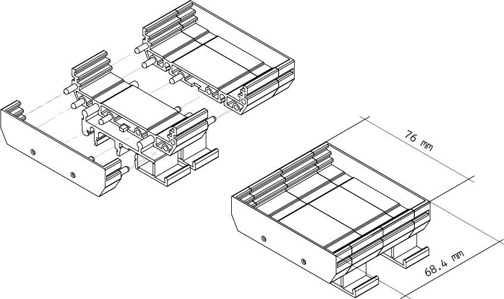

# Description

The Arduino® DIN Celsius offers you a mini temperature laboratory to test your PLC skills, with two independent heater circuits and one temperature sensor placed at the center of the board.

# Target Areas:
Pro, PLC projects, Education, Industry Ready, Building automation

# Features
**Note**: This board needs the Arduino Opta® for full functionality.

- **Temperature sensor**
    - 1 TMP236, from -10 °C to 125 °C with an accuracy of +/- 2.5 °C
- **Heater circuits** 
    - 2 independent heater circuits
- **Screw connectors** 
    - 2 screw connectors exposing +24V DC
    - 2 screw connectors exposing GND
    - 2 screw connectors for the two independent heater circuits (24 V)
    - 1 screw connector for the output voltage of the temperature sensor
- **DIN mounting**
    - RT-072 DIN Rail Modular PCB Board Holders - 72 mm

# Contents

## Functional Overview

These are the main components of the board, other secondary components, i.e. resistors or capacitors, are not listed. 

| **q.ty** | **Function**                  | **Description**                                                    |
|:--------:|-------------------------------|--------------------------------------------------------------------|
|     1    | temperature sensor            | TMP236A2DBZR IC SENSOR                                             |
|     4    | left heating circuit          | RES CHIP 1210 1k2 1% 1/2W                                          |
|     4    | right heating circuit         | RES CHIP 1210 1k2 1% 1/2W                                          |
|     2    | heating status                | LED SMD 0603 RED                                                   |
|     1    | power status                  | LED SMD 0603 GREEN                                                 |
|     1    | power connector               | CONN SCREW TERMINAL, pitch 5mm, 4POS, 16A, 450V, 2.5mm2 |
|     1    | input / output connectors     | CONN SCREW TERMINAL, pitch 5mm, 3POS, 16A, 450V, 2.5mm2 |
|     1    | protect from reverse polarity | DIODE SCHOTTKY SMD 2A 60V SOD123FL                                 |

## Heating Circuits
The board provides two independent heating circuits powered by 24 V through two different screw connector, one placed on the left side of the temperature sensor and the other on the right side. You can see how it works in the following image:

The heat is generated by the current passing through four resistors in series, and the power is about 120 mW per circuits.

## Temperature Sensor

The temperature sensor is the TMP236A2DBZR from Texas Instruments, [here](assets/tmp236-datasheet.pdf) you can find the datasheet of the component, look for the TMP236 and not TMP235. 
Here you can see its main characteristc:

 - analog out 19. 5mV/°C
 - 400 mV at 0 °C
 - accuracy max +-2.5 °C 
 - -10 °C to 125 °C Vdd 3.1 V to 5.5 V

In order to create an analog output signal (0 - 10 V) a 4.9 multiplier circuits has been added before the OUTPUT VOLTAGE screw connector pin.

The relation between the temperature, the voltage of the sensor and the output voltage of the board is summarized in the following table:

| TEMPERATURE [°C] | SENSOR OUTPUT [V] | BOARD OUTPUT x4,9 [V] |
|------------------|-------------------|-----------------------|
|-10            |0,2                   |1,0                    |
|-5             |0,3                   |1,5                    |
| 0             |0,4                   |2,0                    |
| 5             |0,5                   |2,4                    |
|10             |0,6                   |2,9                    |
|15             |0,7                   |3,4                    |
|20             |0,8                   |3,9                    |
|25             |0,9                   |4,4                    |
|30             |1,0                   |4,8                    |
|35             |1,1                   |5,3                    |
|40             |1,2                   |5,8                    |
|45             |1,3                   |6,3                    |
|50             |1,4                   |6,7                    |
|55             |1,5                   |7,2                    |
|60             |1,6                   |7,7                    |
|65             |1,7                   |8,2                    |
|70             |1,8                   |8,6                    |
|75             |1,9                   |9,1                    |
|80             |2,0                   |9,6                    |
|85             |2,1                   |10,1                   | 

## Hello, My Name is:

At the bottom right of the board a white rectangle on the silk layer offer a space to customize the board with your name.

## Compatible Boards 

| Product name                      | SKU      | Min voltage | Max voltage |
| --------------------------------- | -------- | ----------- | ----------- |
| Arduino Opta® RS485               | AFX00001 | 12 V        | 24 V        |
| Arduino Opta® WiFi                | AFX00002 | 12 V        | 24 V        |
| Arduino Opta® Lite                | AFX00003 | 12 V        | 24 V        |
| Arduino® Portenta Machine Control | AKX00032 | 24 V        | 24 V        |
| Arduino® DIN Simul8               | ABX00097 | 24 V        | 24 V        |

**Note:** Please turn to each board's datasheet for further information about power and their capacity. 

### Application Examples

**Goal temperature follower:** Use the PLC of the Opta family to program a temperature follower with PID.

## Mechanical Information
### Enclosure Dimensions

The enclosure is equipped with a DIN clip, [here](assets/RT-072-Assembly.pdf) you can find all the other information and dimension of it.

## Certifications
### Declaration of Conformity CE DoC (EU)
We declare under our sole responsibility that the products above are in conformity with the essential requirements of the following EU Directives and therefore qualify for free movement within markets comprising the European Union (EU) and European Economic Area (EEA). 

### Declaration of Conformity to EU RoHS & REACH 211 01/19/2021
Arduino boards are in compliance with RoHS 2 Directive 2011/65/EU of the European Parliament and RoHS 3 Directive 2015/863/EU of the Council of 4 June 2015 on the restriction of the use of certain hazardous substances in electrical and electronic equipment. 

| Substance                              | **Maximum limit (ppm)** |
| -------------------------------------- | ----------------------- |
| Lead (Pb)                              | 1000                    |
| Cadmium (Cd)                           | 100                     |
| Mercury (Hg)                           | 1000                    |
| Hexavalent Chromium (Cr6+)             | 1000                    |
| Poly Brominated Biphenyls (PBB)        | 1000                    |
| Poly Brominated Diphenyl ethers (PBDE) | 1000                    |
| Bis(2-Ethylhexyl} phthalate (DEHP)     | 1000                    |
| Benzyl butyl phthalate (BBP)           | 1000                    |
| Dibutyl phthalate (DBP)                | 1000                    |
| Diisobutyl phthalate (DIBP)            | 1000                    |

Exemptions : No exemptions are claimed. 

Arduino Boards are fully compliant with the related requirements of European Union Regulation (EC) 1907 /2006 concerning the Registration, Evaluation, Authorization and Restriction of Chemicals (REACH). We declare none of the SVHCs (https://echa.europa.eu/web/guest/candidate-list-table), the Candidate List of Substances of Very High Concern for authorization currently released by ECHA, is present in all products (and also package) in quantities totaling in a concentration equal or above 0.1%. To the best of our knowledge, we also declare that our products do not contain any of the substances listed on the "Authorization List" (Annex XIV of the REACH regulations) and Substances of Very High Concern (SVHC) in any significant amounts as specified by the Annex XVII of Candidate list published by ECHA (European Chemical Agency) 1907 /2006/EC.

### Conflict Minerals Declaration 
As a global supplier of electronic and electrical components, Arduino is aware of our obligations with regards to laws and regulations regarding Conflict Minerals, specifically the Dodd-Frank Wall Street Reform and Consumer Protection Act, Section 1502. Arduino does not directly source or process conflict minerals such as Tin, Tantalum, Tungsten, or Gold. Conflict minerals are contained in our products in the form of solder, or as a component in metal alloys. As part of our reasonable due diligence Arduino has contacted component suppliers within our supply chain to verify their continued compliance with the regulations. Based on the information received thus far we declare that our products contain Conflict Minerals sourced from conflict-free areas. 

## FCC Caution
Any Changes or modifications not expressly approved by the party responsible for compliance could void the user’s authority to operate the equipment.

This device complies with part 15 of the FCC Rules. Operation is subject to the following two conditions: 

(1) This device may not cause harmful interference

(2) this device must accept any interference received, including interference that may cause undesired operation.

**FCC RF Radiation Exposure Statement:**

1. This Transmitter must not be co-located or operating in conjunction with any other antenna or transmitter.

2. This equipment complies with RF radiation exposure limits set forth for an uncontrolled environment.

3. This equipment should be installed and operated with minimum distance 20cm between the radiator & your body.

English: 
User manuals for license-exempt radio apparatus shall contain the following or equivalent notice in a conspicuous location in the user manual or alternatively on the device or both. This device complies with Industry Canada license-exempt RSS standard(s). Operation is subject to the following two conditions:

(1) this device may not cause interference

(2) this device must accept any interference, including interference that may cause undesired operation of the device.

French: 
Le présent appareil est conforme aux CNR d’Industrie Canada applicables aux appareils radio exempts de licence. L’exploitation est autorisée aux deux conditions suivantes :

(1) l’ appareil nedoit pas produire de brouillage

(2) l’utilisateur de l’appareil doit accepter tout brouillage radioélectrique subi, même si le brouillage est susceptible d’en compromettre le fonctionnement.

**IC SAR Warning:**

English 
This equipment should be installed and operated with minimum distance 20 cm between the radiator and your body.  

French: 
Lors de l’ installation et de l’ exploitation de ce dispositif, la distance entre le radiateur et le corps est d ’au moins 20 cm.

**Important:** The operating temperature of the EUT can’t exceed 85℃ and shouldn’t be lower than -40℃.

Hereby, Arduino S.r.l. declares that this product is in compliance with essential requirements and other relevant provisions of Directive 2014/53/EU. This product is allowed to be used in all EU member states. 

## Company Information
| Company name    | Arduino S.r.l                           |
| --------------- | --------------------------------------- |
| Company Address | Via Andrea Appiani 25 20900 MONZA Italy |

## Revision History
| Date       | **Revision** | **Changes**               |
| ---------- | ------------ | ------------------------- |
| 25/03/2024 | 1            | First release             |
