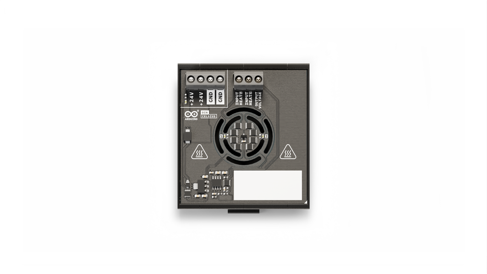

In this tutorial you'll be guided in connecting the **Arduino® DIN Celsius** to the **Arduino Opta® WiFi**, to make some heat and check the temperature.

## Hardware & Software Requirements

### Hardware

- Arduino® DIN Celsius
- [Arduino Opta® WiFi](https://store.arduino.cc/products/opta-wifi)
- USB-C® cable
- Connection cables
- 24 V DC power supply

### Software

- [Arduino IDE 2](https://www.arduino.cc/en/software)

## Overview



The DIN Celsius offers you a all-in-one temperature laboratory with two independent heater and a temperature sensors, you'll learn how to connect the board to the PLC to turn on each heater and measure the temperature from the sensor placed in the center of the board.

If you have any problems using the Opta WiFi you can read its [manual](https://docs.arduino.cc/tutorials/opta/user-manual/) before proceeding.

### Connections

To connect the DIN Celsius to the PLC you'll need seven wires. Check the following schematic:


Connections are super important in an industrial project, first of all **disconnect the power** and then connect all the pins using cable with lugs, or be careful that no copper part of the cable touch other pins.


1. Connect the power pins: +24V and GND
2. Connect the OUTPUT VOLTAGE to I8
3. Connect the +24V to both relay 4 and 3 (both pin are ok)
4. Connect the other pin of relay 3 to INPUT HEAT 1
5. Connect the other pin of relay 4 to INPUT HEAT 2


## Upload Test Code

First of all let's write a code to check the connection. We will the USER BUTTON of the Opta WiFi, the I8 and two relay, the 3 and 4. Let's define them at the beginning of the code:

```arduino
#define BTN         BTN_USER
#define HEAT_LEFT   2
#define HEAT_RIGHT  3
#define TEMP_SENS   A7
```

You can find the pin number used in the Opta WiFi in its [user manual](https://docs.arduino.cc/tutorials/opta/user-manual/), let's have a look at the pinout image taken from there:


As you can see the USER BUTTON is called `BTN_USER` we will refer to it as BTN. The relay 3 and 4 are link to pin 2 and 3, we will call them `HEAT_LEFT` and `HEAT_RIGHT`; and the I8 is called A7, we will call it `TEMP_SENS`.


Now we can write a simple sketch that will turn ON and OFF both the heating circuits:

```arduino
#define BTN         BTN_USER
#define HEAT_LEFT   2
#define HEAT_RIGHT  3
#define TEMP_SENS   A7

void setup() {

  // put your setup code here, to run once:

  pinMode(HEAT_LEFT, OUTPUT);
  pinMode(HEAT_RIGHT, OUTPUT);
  pinMode(BTN, INPUT);
  pinMode(TEMP_SENS, INPUT);

}

void loop() {

  // put your main code here, to run repeatedly:

  digitalWrite(HEAT_LEFT, HIGH);
  digitalWrite(HEAT_RIGHT, HIGH);

  delay(1000);

  digitalWrite(HEAT_LEFT, LOW);
  digitalWrite(HEAT_RIGHT, LOW);

  delay(1000);

}
```

If both LEDs start blinking one time per second, it means that they are connected correctly. Good job!

To stop the LED from blinking try modifying the upper sketch, you can remove or comment the part when you set them `HIGH`.

## Read Temperature Sensor

To read what's arriving on the I8 port, called `TEMP_SENS` in our sketch, we can use the [analogRead](https://www.arduino.cc/reference/en/language/functions/analog-io/analogread/) function, and print the result on the [Serial Monitor](https://docs.arduino.cc/software/ide-v2/tutorials/ide-v2-serial-monitor/). We can do it in one line of code putting the `analogRead()` directly inside the `Serial.println()` command. Here the code:

```arduino
#define BTN BTN_USER
#define HEAT_LEFT 2
#define HEAT_RIGHT 3
#define TEMP_SENS A7

void setup() {

  // put your setup code here, to run once:

  Serial.begin(9600);

  pinMode(HEAT_LEFT, OUTPUT);
  pinMode(HEAT_RIGHT, OUTPUT);
  pinMode(BTN, INPUT);
  pinMode(TEMP_SENS, INPUT);

}

void loop() {

  // put your main code here, to run repeatedly:

  Serial.println(analogRead(TEMP_SENS));

  delay(250);

}

```

Upload it, and open the Serial Monitor with `9600` baud rate, if you see something like this you're on the correct path!


The number you're seeing is proportional to the voltage arriving from the temperature sensor, from the following table you can obtain the temperature from the number printed on the Serial Monitor:

| **TEMPERATURE [°C]** | **BOARD OUTPUT [V]** | **ARDUINO ANALOG READ** |
|:-----------------------:|:-----------------------:|:-----------------------:|
|          -10            |           1,0           |           102           |
|          -5             |           1,5           |           154           |
|           0             |           2,0           |           205           |
|           5             |           2,4           |           246           |
|          10             |           2,9           |           297           |
|          15             |           3,4           |           348           |
|          20             |           3,9           |           399           |
|          25             |           4,4           |           451           |
|          30             |           4,8           |           492           |
|          35             |           5,3           |           543           |
|          40             |           5,8           |           594           |
|          45             |           6,3           |           645           |
|          50             |           6,7           |           686           |
|          55             |           7,2           |           737           |
|          60             |           7,7           |           788           |
|          65             |           8,2           |           840           |
|          70             |           8,6           |           881           |
|          75             |           9,1           |           932           |
|          80             |           9,6           |           983           |
|          85             |           10,0          |           1024          | 

We're reading around 377, that is just below 20 °C. From the [datasheet](assets/tmp236-datasheet.pdf) of the temperature sensor you can see that this sensor have an accuracy of +/- 2.5 °C, so you don't need to be super precise in doing the math.

## Heating While Reading Temperature

Now you can combine the two upper sketches and read the temperature while switching the heating circuits. To have more control, instead of blinking them, you can use the user button on the Opta WiFi to turn ON one, or both the heater, like this:


Here's the full code:

```arduino
#define BTN BTN_USER
#define HEAT_LEFT 2
#define HEAT_RIGHT 3
#define TEMP_SENS A7

void setup() {

  // put your setup code here, to run once:

  Serial.begin(9600);


  pinMode(HEAT_LEFT, OUTPUT);
  pinMode(HEAT_RIGHT, OUTPUT);
  pinMode(BTN, INPUT);
  pinMode(TEMP_SENS, INPUT);

}

int SCENE = -1;
bool btn_state = 0;

void loop() {

  // put your main code here, to run repeatedly:

  // PART 1: read the USER BUTTON and change SCENE when pressed
  if (btn_state == 0) {
    if (digitalRead(BTN) == 0) {
      btn_state = 1;
      SCENE++;
      if (SCENE > 2) {
        SCENE = -1;
      }
    }
  } else {
    if (digitalRead(BTN) == 1) {
      btn_state = 0;
    }
  }

  // PART 2: depending on the SCENE value, trigger one or both (or none) heating circuits
  if (SCENE == -1) {
    digitalWrite(HEAT_LEFT, LOW);
    digitalWrite(HEAT_RIGHT, LOW);
  } else if (SCENE == 0) {
    digitalWrite(HEAT_LEFT, HIGH);
    digitalWrite(HEAT_RIGHT, LOW);
  } else if (SCENE == 1) {
    digitalWrite(HEAT_LEFT, LOW);
    digitalWrite(HEAT_RIGHT, HIGH);
  } else if (SCENE == 2) {
    digitalWrite(HEAT_LEFT, HIGH);
    digitalWrite(HEAT_RIGHT, HIGH);
  }

  // PART 3: print on the serial, with a special format for the plotter!
  Serial.print("MIN:");
  Serial.print(300);
  Serial.print(",");

  Serial.print("MAX:");
  Serial.print(650);
  Serial.print(",");

  Serial.print("TEMP:");
  Serial.println(analogRead(TEMP_SENS));

  delay(250);

}
```

Upload it and open the Serial Plotter.
You'll see 3 lines, the blue and red lines are there to keep fix the Y axis, the green line is the temperature measured from the sensor. If you press the USER BUTTON you will heat up the board and you can see the temperature rising, like this:


## Conclusions

The Arduino DIN Celsius is a great board to start playing with sensors and actuators with signal of industrial level. You can now try to create a **temperature follower** apparatus, that will reach a goal temperature and keep it. Try code it yourself, if you need some help you can have a look at something called [PID](https://www.arduino.cc/reference/en/libraries/pid/).

